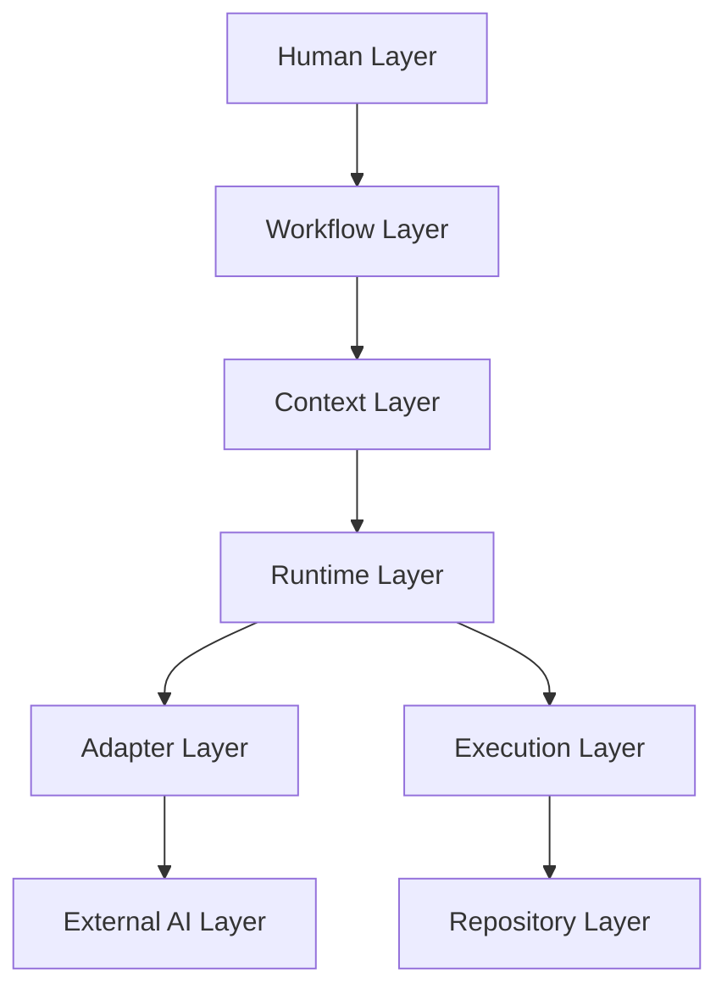
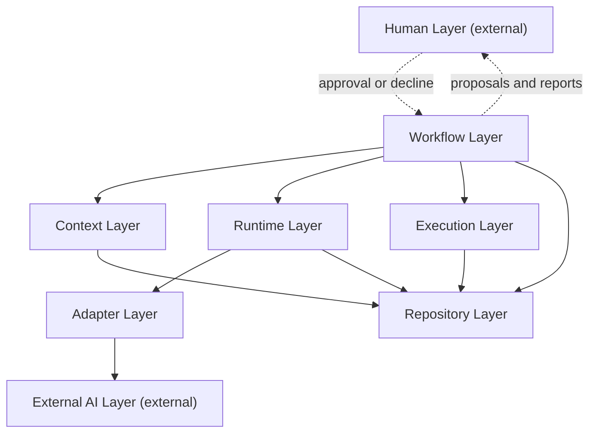
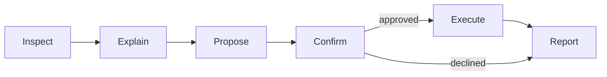
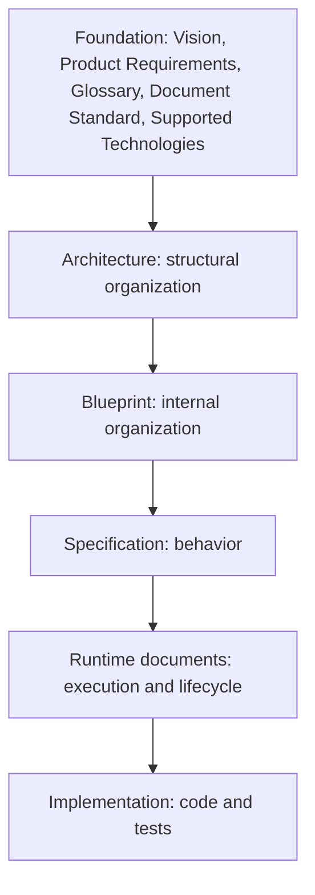
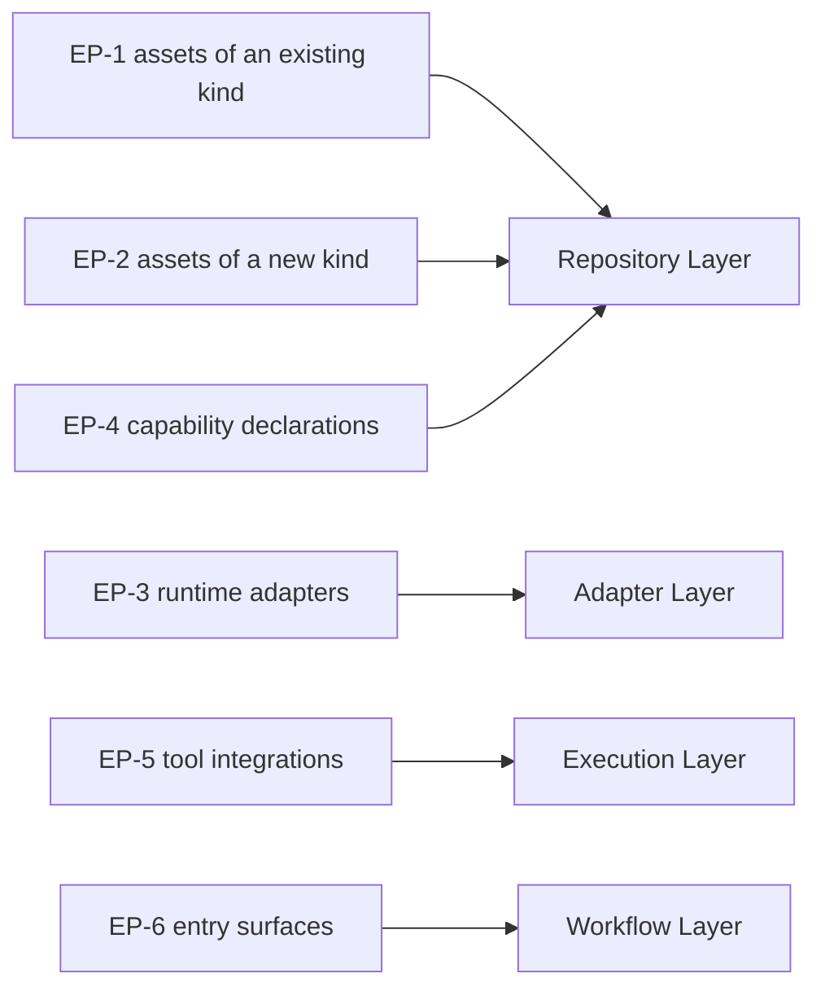

# AI Engineering Operating System

**AEOS — Architecture**

*The permanent statement of how AEOS is structurally organized.*

| Field | Value |
| :--- | :--- |
| **Document** | Architecture |
| **Product** | AI Engineering Operating System (AEOS) |
| **Document ID** | AEOS-ARCH |
| **Version** | 1.1.0 |
| **Status** | Frozen |
| **Owner** | Product Owner, AEOS |
| **Author** | Chief Software Architect, AEOS |
| **Audience** | Architects, engineering contributors, maintainers, reviewers, and AI runtimes consuming this repository |
| **Suggested path** | `docs/architecture/ARCHITECTURE.md` |
| **Companion documents** | `AEOS_VISION.md` (AEOS-VISION) · `AEOS_PRODUCT_REQUIREMENTS.md` (AEOS-PRD) · `AEOS_GLOSSARY.md` (AEOS-GLOSSARY) · `AEOS_DOCUMENT_STANDARD.md` (AEOS-DOCSTD) · `AEOS_SUPPORTED_TECHNOLOGIES.md` (AEOS-TECH) |
| **Supersedes** | None |

> **Authority of this document.**
> This document defines *how AEOS is structurally organized*. It is normative for the architectural
> layers of AEOS, their responsibilities, their dependencies, the boundaries between them, and the
> invariants that MUST hold across versions of the product.
> It defines no product requirement, no vision, no philosophy, no terminology, no technology policy,
> no runtime behavior, no workflow behavior, no code structure, and no algorithm. Where this document
> and a document of higher authority both speak to a subject, the higher-authority document governs,
> and any conflict here is a defect to be reported rather than acted upon.

> The key words **MUST**, **MUST NOT**, **SHOULD**, **SHOULD NOT**, and **MAY** in this document are
> to be interpreted as described in RFC 2119 and RFC 8174, and carry their normative meaning only
> when they appear in all capitals.

---

## Table of Contents

1. [Executive Summary](#1-executive-summary)
2. [Scope and Applicability](#2-scope-and-applicability)
3. [Architectural Principles](#3-architectural-principles)
4. [Architectural Layer Model](#4-architectural-layer-model)
5. [Architectural Dependency Model](#5-architectural-dependency-model)
6. [Cross-Layer Interaction Principles](#6-cross-layer-interaction-principles)
7. [Architectural Boundaries](#7-architectural-boundaries)
8. [Architectural Invariants](#8-architectural-invariants)
9. [Architecture and Blueprint](#9-architecture-and-blueprint)
10. [Architecture and Specification](#10-architecture-and-specification)
11. [Extension Model](#11-extension-model)
12. [Traceability to the Foundation Documents](#12-traceability-to-the-foundation-documents)
13. [Document Governance](#13-document-governance)
14. [Appendix A — Layer Responsibility Matrix](#appendix-a--layer-responsibility-matrix)
15. [Appendix B — Invariant Index](#appendix-b--invariant-index)

---

## 1. Executive Summary

AEOS is an operating system for AI-assisted, human-supervised software engineering. AEOS-PRD defines
what the product must do. This document defines the structure through which those obligations are
met, and the rules that structure MUST continue to satisfy as the product evolves.

The structure is eight layers. Six are internal and constitute AEOS: the Repository Layer, the
Context Layer, the Workflow Layer, the Runtime Layer, the Adapter Layer, and the Execution Layer.
Two are external and are never realized by AEOS: the Human Layer, at which decisions are made, and
the External AI Layer, at which inference is performed. The external layers are named because the
product's guarantees are largely statements about what may cross their boundaries, and an unnamed
boundary cannot be governed.

Five structural decisions carry most of the product's obligations. Each converts a commitment into a
property of the arrangement, verifiable by inspection rather than by trust.

| Decision | What it makes structurally true |
| :--- | :--- |
| One store of durable meaning | Only the Repository Layer holds what a project carries forward, so a project cannot come to depend on state its repository does not contain. |
| One point of supervision | The Workflow Layer is the only layer that addresses the Human Layer and the only layer that initiates a consequential action, so there is one path to effect and one place a gate is checked. |
| One place for runtime knowledge | Knowledge of a Runtime, Vendor, or Model exists only in the Adapter Layer, so runtime independence is a property a reviewer can check by looking. |
| One place for platform knowledge | Platform differences are absorbed in the Execution Layer, so every other layer is written once and behaves identically everywhere. |
| Declaration separated from execution | Workflows, Rules, Skills, Prompts, and adapters are declared as Repository Assets and interpreted by layers that hold no policy of their own. |

The document proceeds from general to specific. Principles come first, then the layer model, then
the dependency model and the interaction principles that follow from it, then the boundaries. The
invariants that MUST survive every future version are collected in one register in
[Section 8](#8-architectural-invariants), so that what is frozen can be read in a single place. The
relationships to Blueprint and Specification documents follow, then the extension model, then the
trace back to the Foundation documents.

Every invariant carries an `AR-` identifier and traces to one or more `PR-` requirement identifiers.
An invariant that could not be traced would describe a structure the product did not ask for.

---

## 2. Scope and Applicability

### 2.1 What This Document Defines

This document defines, and is the source of truth for:

- the architectural layers of AEOS and their classification;
- the purpose, responsibilities, owned concepts, and prohibited responsibilities of each layer;
- the dependency direction between layers and the interactions permitted between them;
- the principles governing cross-layer interaction;
- the architectural boundaries of AEOS and what may cross each of them;
- the architectural invariants that MUST hold across versions;
- the extension boundary: what is frozen, and where extension is admitted;
- the relationship of this document to Blueprint and Specification documents.

This list is complete.

### 2.2 What This Document Does Not Define

| Not defined here | Owned by |
| :--- | :--- |
| Why AEOS exists, its philosophy, and its invariants of purpose | AEOS-VISION |
| What AEOS is and what it must do | AEOS-PRD |
| What AEOS terms mean | AEOS-GLOSSARY |
| How AEOS documents are written | AEOS-DOCSTD |
| Which technologies are recognized, and at what tier | AEOS-TECH |
| Internal component organization and the buildable arrangement of any layer | Blueprint documents |
| Behavior, state transitions, interfaces, API contracts, data structures, and error conditions | Specification documents |
| Execution, lifecycle, and environment mechanics | Runtime documents |
| Installation, environment setup, and distribution procedure | Distribution documents |
| Project templates and scaffolds | Template assets |
| Algorithms, code structure, and dependency selection | The codebase and its tests |

> **The reading rule for this document.**
> A statement here that can be satisfied by only one mechanism has reached below its layer and is a
> defect in this document. Architecture defines structure. It does not decide whether a capability
> exists, which AEOS-PRD settles, and it does not decide how a behavior works, which Specification
> settles.

### 2.3 Relationship to the Foundation Documents

Five documents govern this one. This document contradicts none of them and restates none of them.

| Document | Governs | This document's obligation |
| :--- | :--- | :--- |
| AEOS-VISION | Purpose, philosophy, invariants `V1`–`V10` | No structure here may make an invariant of purpose unenforceable. |
| AEOS-PRD | Product behavior, capabilities `C1`–`C10`, requirements, scope | Every invariant here traces to `PR-` identifiers and MUST NOT weaken, reinterpret, or widen any of them. |
| AEOS-GLOSSARY | Terminology, naming conventions, identifier shape | Terms are used with their defined meaning. The responsibilities reserved for architecture — Workflow Engine, Context Router, Runtime Adapter — are assigned here to layers under the names the Glossary fixed. |
| AEOS-DOCSTD | Document form, structure, review, and freeze | This document's structure, normative language, and review classification follow it, subject to the record in [Section 2.4](#24-recorded-format-deviation). |
| AEOS-TECH | Recognized technologies and their support tiers | This document names no technology and makes no technology decision. |

### 2.4 Recorded Format Deviation

This document is written in GitHub-Flavored Markdown without embedded HTML, at the owner's
direction.

AEOS-DOCSTD rule `F2` states that human-oriented documents SHOULD use GitHub-compatible semantic
HTML inside Markdown where it improves readability, and conventions `R2` and `A9` name the HTML
disclosure element as the vehicle for progressive disclosure. Deviation from a `SHOULD` is permitted
where it is deliberate and recorded, under AEOS-DOCSTD Section 7.2. This subsection is that record.

No `MUST`-level rule of AEOS-DOCSTD is set aside. Rule `F5` requires that Markdown be preferred
wherever it expresses the intent adequately, which it does throughout this document; rule 8.4 admits
pipe tables for tabular content; and progressive disclosure is achieved through section structure
rather than through collapsed blocks. The difference in visual form between this document and the
Foundation documents carries no meaning, as rules `F11` and `A10` require.

### 2.5 Identifier Registration

Invariants in this document carry identifiers of the shape stated in AEOS-GLOSSARY Section 5.4, with
the layer prefix `AR`. The following `AREA` codes are registered by this document. This list is
complete.

| AREA | Meaning | Defined in |
| :--- | :--- | :--- |
| `PRN` | Architectural principle | [Section 3](#3-architectural-principles) |
| `LAY` | Layer invariant | [Section 8.2](#82-layer-invariants) |
| `DEP` | Dependency invariant | [Section 8.3](#83-dependency-invariants) |
| `BND` | Boundary invariant | [Section 8.4](#84-boundary-invariants) |
| `EXT` | Extension invariant | [Section 8.5](#85-extension-invariants) |
| `GOV` | Architectural governance invariant | [Section 8.6](#86-architectural-governance-invariants) |

The `AREA` codes used by AEOS-PRD are not reused here. An identifier is always read with its layer
prefix: `PR-REP-001` is a product requirement, and `AR-LAY-001` is an architectural invariant.

### 2.6 Terminology Introduced by This Document

The eight layer names, and the term *entry surface*, name structural elements of AEOS. They are
introduced under this document's authority over structure and carry no meaning beyond the
responsibilities assigned to them in [Section 4](#4-architectural-layer-model). Their addition to
AEOS-GLOSSARY is proposed in [Section 13.5](#135-proposed-glossary-additions), as AEOS-GLOSSARY rule
`W4` requires. Until the owner acts on that proposal, this document is their only authority.

### 2.7 Architectural Stability

For long-term governance, AEOS distinguishes between architectural elements that are intentionally frozen and those intentionally designed for future extension.

### Frozen Architectural Invariants

The following architectural elements are considered stable throughout the AEOS 1.x lifecycle unless explicitly revised by Owner decision.

- Architectural layer structure
- Layer responsibilities
- Dependency direction
- Repository-first architecture
- Human-in-the-Loop architecture
- Architectural boundaries
- Architecture Rules (AR-*)

### Architectural Extension Points

The following architectural areas are intentionally designed for future extension without changing the architectural model.

- Runtime implementations
- Runtime adapters
- Capability registries
- Repository asset categories
- Platform integrations
- Project templates

---

## 3. Architectural Principles

These principles are stable architectural rules. They constrain every layer, every Blueprint, every
Specification, and every implementation derived from this document. Each is an architectural
invariant and is listed in [Appendix B](#appendix-b--invariant-index).

None of them restates a product principle. AEOS-PRD Section 7 owns the product principles; the
mapping from those principles to the structures that realize them is recorded in
[Section 12.2](#122-foundation-principles-to-structure).

| ID | Principle | Statement | Traces to |
| :--- | :--- | :--- | :--- |
| `AR-PRN-001` | One responsibility per layer | Each layer MUST hold exactly one responsibility. | `PR-NFR-006` · `PR-NFR-007` |
| `AR-PRN-002` | Single direction of dependency | Dependencies MUST move toward lower abstraction, without cycles. | `PR-NFR-006` · `PR-NFR-008` |
| `AR-PRN-003` | One store of durable meaning | Durable product meaning MUST exist only in the Repository Layer. | `PR-REP-001` · `PR-REP-002` · `PR-REP-015` |
| `AR-PRN-004` | One point of supervision | Every consequential action MUST reach effect through a path that passes an Approval Gate held by the Workflow Layer. | `PR-WFL-005` · `PR-SAF-001` · `PR-SAF-003` |
| `AR-PRN-005` | Isolation of external knowledge | Knowledge of an external counterparty MUST be confined to the single layer that faces it. | `PR-RUN-002` · `PR-RUN-005` · `PR-PLT-005` |
| `AR-PRN-006` | Declared, not embedded | Anything a user may need to inspect, change, or extend MUST be declared as a Repository Asset. | `PR-WFL-002` · `PR-RUL-001` · `PR-NFR-007` |
| `AR-PRN-007` | Inspectable by construction | Every layer MUST produce an account of what it found, what it intended, and what resulted. | `PR-NFR-001` · `PR-WFL-011` · `PR-SAF-011` |
| `AR-PRN-008` | Failure is contained | A failing or absent layer MUST reduce the options available rather than corrupt the Repository Layer. | `PR-RUN-010` · `PR-SAF-010` · `PR-NFR-005` |
| `AR-PRN-009` | Extension over modification | Every anticipated variation MUST have an extension point, so that no common extension requires modifying AEOS. | `PR-NFR-007` · `PR-RUN-012` · `PR-WFL-013` |
| `AR-PRN-010` | Uniform across Platform and distribution | A layer, responsibility, dependency, or boundary MUST NOT vary by Platform or by distribution method. | `PR-PLT-003` · `PR-DST-005` · `PR-DST-006` |

**When principles conflict.** Architectural principles are weighed in the order AEOS-PRD Section 7
establishes for product principles, which governs this document as it governs every other. This
document establishes no ordering of its own.

---

## 4. Architectural Layer Model

### 4.1 The Layers

AEOS is structured as eight layers. Six are **internal**: they are realized by AEOS and constitute
it. Two are **external**: they are never realized by AEOS, and are named because the product's
guarantees are statements about what crosses their boundaries.

| # | Layer | Kind | Single responsibility |
| :--- | :--- | :--- | :--- |
| 1 | Human Layer | External | Deciding. |
| 2 | Workflow Layer | Internal | Sequencing work and holding every Approval Gate. |
| 3 | Context Layer | Internal | Selecting the minimum sufficient Context for one step, and retaining why. |
| 4 | Runtime Layer | Internal | Orchestrating external Runtimes in runtime-independent terms. |
| 5 | Adapter Layer | Internal | Translating between AEOS and one external Runtime. |
| 6 | Execution Layer | Internal | Observing the Environment and applying approved effects. |
| 7 | Repository Layer | Internal | Holding everything the project carries forward. |
| 8 | External AI Layer | External | Performing inference. |

The order in this table is the order of presentation, from the layer of highest abstraction to the
layers of lowest. It is not a ranking of importance. The dependency relationships between the layers
are defined in [Section 5](#5-architectural-dependency-model).

Two counterparties sit outside every layer and are named here so that no reader places them inside
one: the **Environment**, which belongs to the user, and the **Tools** the Execution Layer
orchestrates, such as version control, build and test tooling, and delivery systems. AEOS acts upon
them and contains none of them.

> **Two layer names require care in reading.**
> The *Runtime Layer* is an internal layer of AEOS that contains no Runtime. A Runtime, in the sense
> AEOS-GLOSSARY fixes, is an external AI system that performs inference, and every Runtime belongs to
> the External AI Layer. The Runtime Layer holds the responsibility for orchestrating them. The name
> also carries no statement about how AEOS itself executes, which Runtime documents own.

### 4.2 Layer Classification

| Kind | Layers | What the classification means |
| :--- | :--- | :--- |
| Internal | Workflow · Context · Runtime · Adapter · Execution · Repository | Realized by AEOS, versioned with AEOS, and verifiable in isolation. AEOS is responsible for their behavior. |
| External | Human · External AI | Never realized by AEOS and never simulated by it. AEOS is responsible only for what it sends to them, what it accepts from them, and how it behaves in their absence. |

### 4.3 Human Layer

**Purpose.** To decide. The Human Layer is where intent originates and where authority for every
consequential action rests.

**Responsibilities.**

- Forming and expressing intent.
- Granting, withholding, and withdrawing approval for a proposed action.
- Issuing, scoping, and revoking Automation Grants.
- Judging the material AEOS presents, including material produced by a Runtime.

**Owned concepts.** Intent · Human Approval · decline · Automation Grant · the user's judgment.

**Dependencies.** None. The Human Layer depends on no layer and is depended upon by none. It is
addressed by the Workflow Layer and answers it.

**Prohibited responsibilities.**

- It is never realized, simulated, predicted, or stood in for by an internal layer.
- It is never reached by any internal layer other than the Workflow Layer.

**Interaction with neighboring layers.** The Workflow Layer presents findings, Proposals, questions,
and reports; the Human Layer answers with approval, decline, or a grant. Reaching the Workflow Layer
occurs through an entry surface supplied by the distribution method, which alters nothing about the
exchange.

### 4.4 Workflow Layer

**Purpose.** To sequence engineering work and to hold every point at which a human decides.

**Responsibilities.**

- Discharging the Workflow Engine responsibility named by AEOS-GLOSSARY.
- Interpreting Workflow declarations one step at a time.
- Classifying each action by Action Class and applying the gate that class requires.
- Presenting Proposals and consuming decisions.
- Consulting Automation Grants.
- Maintaining Workflow State, including position within a TDD Cycle.
- Reporting what actually occurred, including partial completion and failure.

**Owned concepts.** Approval Gate · Proposal · Action Class · the interaction loop · Workflow State
maintenance · agentic orchestration.

**Dependencies.** Context Layer · Runtime Layer · Execution Layer · Repository Layer, for reading.

**Prohibited responsibilities.**

- It does not contain the Workflows it executes; those are Repository Assets.
- It holds no runtime-specific, vendor-specific, model-specific, or platform-specific knowledge.
- It does not reach the Adapter Layer or the External AI Layer.
- It does not apply an effect itself; effects are applied by the Execution Layer.
- It does not select Context; selection belongs to the Context Layer.

**Interaction with neighboring layers.** It reads declarations, assets, and state from the
Repository Layer; requests Context from the Context Layer; requests capability from the Runtime
Layer; requests inspection and effect from the Execution Layer; and addresses the Human Layer at
every gate.

### 4.5 Context Layer

**Purpose.** To determine the smallest set of information sufficient for one step of work, and to
retain the reason each element was included.

**Responsibilities.**

- Discharging the Context Router responsibility named by AEOS-GLOSSARY.
- Resolving a step's declared context needs against the Repository Layer.
- Selecting the minimum sufficient set from the resolved candidates.
- Retaining a justification for each selected element.
- Composing the selected elements into a Prompt.
- Excluding credentials and user-designated sensitive material before composition.

**Owned concepts.** Context selection · context justification · Prompt composition · Context
Minimization as a structural responsibility.

**Dependencies.** Repository Layer, for reading.

**Prohibited responsibilities.**

- It does not address a Runtime and holds no knowledge of any Runtime, Vendor, or Model.
- It does not transmit a composed Prompt; transmission follows a gate.
- It holds no durable state; the record of a selection belongs to Workflow State.
- It draws on no source other than the Repository Layer and Environment findings recorded there.

**Interaction with neighboring layers.** The Workflow Layer asks for Context for a named step; the
Context Layer reads from the Repository Layer and returns a composed Prompt with its justification.
Nothing leaves the machine at this layer.

### 4.6 Runtime Layer

**Purpose.** To orchestrate external Runtimes while expressing all work in terms that name none of
them.

**Responsibilities.**

- Using the Runtime selection recorded in the Profile.
- Declaring and matching Engineering Capabilities between a Workflow step and a selected Runtime.
- Dispatching runtime-independent requests to exactly one adapter.
- Handling unavailability by reducing available options.
- Surfacing runtime errors as ordinary conditions.
- Coordinating work across more than one Runtime within a Workflow.
- Attributing usage per project.

**Owned concepts.** Engineering Capability matching · runtime selection resolution · invocation
dispatch · degradation · usage attribution.

**Dependencies.** Adapter Layer · Repository Layer, for reading.

**Prohibited responsibilities.**

- It performs no inference and contains no Runtime and no Model.
- It never chooses, overrides, or substitutes the user's Runtime selection.
- It holds no credential.
- It initiates no invocation that a gate has not authorized.
- It expresses no request in a Vendor's terms.

**Interaction with neighboring layers.** The Workflow Layer requests a capability within an approved
scope; the Runtime Layer resolves the selection, matches capability, dispatches to the Adapter Layer,
and returns the result upward as material.

### 4.7 Adapter Layer

**Purpose.** To mediate between AEOS and one external Runtime, so that nothing above it changes when
the Runtime changes.

**Responsibilities.**

- Discharging the Runtime Adapter responsibility named by AEOS-GLOSSARY.
- Declaring the Engineering Capabilities its Runtime performs.
- Translating a runtime-independent request into that Runtime's terms.
- Translating results and failures back into AEOS terms.
- Holding, without recording, the credentials that Runtime requires.

**Owned concepts.** Runtime translation · capability declaration for one Runtime · credential custody
as Runtime State · knowledge of one Vendor and the Models it exposes.

**Dependencies.** External AI Layer.

**Prohibited responsibilities.**

- It holds no engineering policy: no Rule, no gate, no approval logic, no context selection, no
  Workflow knowledge.
- It writes to no layer, and addresses no internal layer other than by returning results to the
  Runtime Layer.
- It records no credential in any durable artifact.
- It decides nothing; it translates.

**Interaction with neighboring layers.** The Runtime Layer hands it a request expressed in
Engineering Capabilities and Context; it returns a result or a failure expressed in AEOS terms. It is
the last internal layer before the boundary to the External AI Layer.

### 4.8 Execution Layer

**Purpose.** To observe the Environment and to apply the effects a human has approved.

**Responsibilities.**

- Inspecting the Environment before any environment-affecting action is proposed.
- Distinguishing observed fact from inference in what it reports.
- Orchestrating the project's Tools.
- Applying approved effects to the Repository and the Environment, at the scope approved.
- Performing every durable write to the Repository Layer.
- Absorbing every Platform difference.

**Owned concepts.** Environment inspection · Tool orchestration · effect application · the single
write path · Platform absorption.

**Dependencies.** Repository Layer.

**Prohibited responsibilities.**

- It does not decide whether an action should occur.
- It does not exceed the scope of what was approved.
- It does not modify or remove a component AEOS did not install without specific confirmation
  obtained by the Workflow Layer.
- It exposes no Platform difference to any other layer.
- It addresses neither the Human Layer nor the External AI Layer.

**Interaction with neighboring layers.** The Workflow Layer asks it to inspect and, after a gate is
satisfied, to apply. It reads from and writes to the Repository Layer, and acts upon the Environment
and its Tools.

### 4.9 Repository Layer

**Purpose.** To hold everything a project carries forward, and to remain meaningful when AEOS is not
running.

**Responsibilities.**

- Holding Repository Assets of every kind.
- Holding Workflow State.
- Resolving overlapping assets deterministically when their scopes compete.
- Keeping AEOS-owned content separable from the user's project content.
- Serving reads to every internal layer permitted to read.

**Owned concepts.** Repository Asset custody · Workflow State custody · asset identity · asset scope
· asset resolution · separability.

**Dependencies.** None. The Repository Layer depends on no other layer.

**Prohibited responsibilities.**

- It holds no Runtime State, no credential, and no machine-specific configuration.
- It requires no layer to be running for its contents to be readable and meaningful.
- It performs no action and initiates no work; it is addressed, and does not address.
- It admits durable writes from no path other than the Execution Layer.

**Interaction with neighboring layers.** Every internal layer permitted to read does so directly.
Durable writes arrive by one path only, from the Execution Layer.

### 4.10 External AI Layer

**Purpose.** To perform inference. Nothing in this layer is part of AEOS.

**Responsibilities.** None are owed to AEOS. The layer is named so that the boundary in front of it
can be governed.

**Owned concepts.** Runtime · Model · inference.

**Dependencies.** None within AEOS.

**Prohibited responsibilities.**

- It carries no authority: its output never authorizes an action, satisfies a gate, alters a Rule, or
  expands an approved scope.
- It is never required for AEOS to inspect, report, or explain.
- It is never depended upon by an internal layer for anything other than inference.

**Interaction with neighboring layers.** It exchanges requests and results with exactly one adapter,
which is the only part of AEOS that knows it exists.

---

## 5. Architectural Dependency Model

### 5.1 Direction of Dependency

A layer depends on another when it requires that layer in order to discharge its own responsibility.
Dependency in AEOS moves in one direction only: toward lower abstraction. A layer of lower
abstraction is never aware of the layer that depends on it, and never calls back into it.

The consequence is that the Repository Layer, which depends on nothing, remains meaningful on its
own; and that each layer can be understood, verified, and replaced without assembling the layers
above it.

Reverse dependencies are prohibited. So is any cycle, however indirect. The normative statements are
`AR-DEP-001` through `AR-DEP-006` in [Section 8.3](#83-dependency-invariants).

### 5.2 The Dependency Graph

| Layer | Depends on | Depended upon by |
| :--- | :--- | :--- |
| Human Layer | Nothing | Nothing. It is addressed by the Workflow Layer, which is an exchange rather than a dependency. |
| Workflow Layer | Context · Runtime · Execution · Repository | Nothing |
| Context Layer | Repository | Workflow |
| Runtime Layer | Adapter · Repository | Workflow |
| Adapter Layer | External AI | Runtime |
| Execution Layer | Repository | Workflow |
| Repository Layer | Nothing | Workflow · Context · Runtime · Execution |
| External AI Layer | Nothing within AEOS | Adapter |

The same relationships, drawn. Solid edges are dependencies and always point toward lower
abstraction. Dotted edges are the supervision exchange with the Human Layer, which is not a
dependency in either direction.

### 5.3 Permitted Interactions

A layer may address only the counterparties listed for it. Every other interaction is prohibited.
This table is complete, and the invariant that binds it is `AR-DEP-004`.

| From | May address | May not address |
| :--- | :--- | :--- |
| Human Layer | The Workflow Layer, through an entry surface | Every other layer directly |
| Workflow Layer | Human · Context · Runtime · Execution · Repository, for reading | Adapter · External AI |
| Context Layer | Repository, for reading | Human · Workflow · Runtime · Adapter · Execution · External AI |
| Runtime Layer | Adapter · Repository, for reading | Human · Workflow · Context · Execution · External AI |
| Adapter Layer | External AI · the Runtime Layer, to return results | Human · Workflow · Context · Execution · Repository |
| Execution Layer | Repository, for reading and writing · the Environment and its Tools | Human · Context · Runtime · Adapter · External AI |
| Repository Layer | No layer. It is addressed and does not address | Every layer |
| External AI Layer | Its own adapter, to return results | Every other layer |

Two consequences of this table are worth stating plainly, because they are the reason for its shape.
No layer can reach the External AI Layer without passing the Runtime Layer and an adapter, so no
information leaves the machine unexamined. No layer other than the Workflow Layer can reach the
Human Layer, so every question put to a person arrives from the one place that knows what was
proposed and what remains outstanding.

### 5.4 Reads and Writes

Reads from the Repository Layer are direct: any internal layer permitted to read may do so. Durable
writes are not. Every durable write is performed by the Execution Layer.

The asymmetry is deliberate. Reading widely costs nothing and keeps layers simple. Writing from many
places would make the record of what happened a reconstruction rather than a record.

---

## 6. Cross-Layer Interaction Principles

### 6.1 Requests Descend, Accounts Ascend

Work is requested downward and accounted for upward. A layer asks the layer beneath it for what it
needs, and returns an account of what it found, intended, or produced. No layer instructs a layer
above it, and no layer reports to a layer that did not ask.

### 6.2 The Supervised Path to Effect

AEOS-PRD defines the interaction loop. The architectural statement is narrower: the loop is the only
route by which a consequential action reaches effect. A step that cannot be explained has no route to
execution, because no path exists that reaches execution without passing through the explanation.

| Phase | Layer that performs it | Layers it draws on |
| :--- | :--- | :--- |
| Inspect | Workflow | Execution, for the Environment; Repository, for state |
| Explain | Workflow | The account returned by the layer that inspected |
| Propose | Workflow | Context, where the step requires Context |
| Confirm | Workflow | Human |
| Execute | Runtime, for inference; Execution, for effect | Adapter and External AI, where inference is required |
| Report | Workflow | Execution, to record the outcome durably |

A declined proposal halts the sequence with no effect applied, and is reported like any other
outcome. This is why the declined edge in the diagram reaches Report directly.

### 6.3 Minimum Sufficient Crossing

Information crosses a boundary only when the receiving side requires it for the step in hand, and
the reason for each crossing is retained. This applies to every boundary, not only the boundary in
front of the External AI Layer, and it is the structural expression of Context Minimization rather
than a restatement of it.

### 6.4 Results Are Material, Not Authority

What returns from a lower layer is material for a decision. It is never the decision. This principle
carries the most weight at the boundary to the External AI Layer, where a result that could
authorize its own application would relocate the decision from the Human Layer to a system outside
this repository. The normative form is `AR-BND-004`.

### 6.5 Absence Reduces Options

When a counterparty is unavailable — a Runtime, a Tool, a network — the options that required it
disappear and nothing else changes. No fallback is selected, no substitute is invoked, and no
project state is altered to accommodate the absence.

### 6.6 Accounts Do Not Require Inference

Inspection, status, explanation, and reporting are produced without crossing the boundary to the
External AI Layer. An account that required inference would be unavailable exactly when a Runtime is
unreachable, which is when it is most needed.

---

## 7. Architectural Boundaries

### 7.1 The Four Boundaries

A boundary is a place where something may cross, in a stated direction, under a stated condition.
AEOS has four. This list is complete.

| Boundary | Between | Crosses outward | Crosses inward | Never crosses |
| :--- | :--- | :--- | :--- | :--- |
| Human | Workflow Layer and Human Layer | Findings, Proposals, questions, reports | Approval, decline, Automation Grants, intent | An approval AEOS produced for itself; silence read as consent |
| External AI | Adapter Layer and External AI Layer | Only the Context an approved gate authorized | Results, as material for judgment | Credentials in durable form; authority of any kind; unapproved project content |
| Environment | Execution Layer and the Environment with its Tools | Only the effects an approved step authorized, at the scope approved | Observations, distinguished from inference | Modification or removal of a component AEOS did not install, absent specific confirmation |
| Repository | Execution Layer and Repository Layer | Assets and Workflow State, readable without AEOS | Durable writes, by the single write path | Runtime State; credentials; machine-specific configuration |

### 7.2 Boundary Preservation

A boundary is preserved when no structure exists that could carry something across it other than by
the stated path. Preservation is therefore a property of the arrangement, not a check performed at
run time: the absence of a second path is what makes the first path sufficient.

Three preservation rules follow, stated normatively as `AR-BND-001` through `AR-BND-016` in
[Section 8.4](#84-boundary-invariants).

- Knowledge does not leak outward. Runtime, Vendor, and Model knowledge exists only in the Adapter
  Layer; Platform and Tool knowledge exists only in the Execution Layer.
- Authority does not leak inward. Nothing arriving from an external layer carries the power to
  authorize, to alter a Rule, or to widen a scope.
- Meaning does not leak sideways. Durable product meaning exists only in the Repository Layer, and
  Runtime State never becomes product meaning by being retained.

---

## 8. Architectural Invariants

### 8.1 What an Invariant Is

An architectural invariant is a rule that MUST hold in every version of AEOS. It is included here
only if it satisfies three tests: it constrains structure rather than behavior; it would still be
correct if every technology, runtime, and interface in use were replaced; and abandoning it would
change what AEOS is rather than how AEOS is built.

Rules that fail any of those tests are not invariants. They belong to a Blueprint, a Specification,
or an implementation, and are governed there.

The architectural principles in [Section 3](#3-architectural-principles) are invariants of the
principle kind and are not repeated here. The complete index of every invariant in this document,
with its traces, is [Appendix B](#appendix-b--invariant-index).

### 8.2 Layer Invariants

| ID | Invariant | Traces to |
| :--- | :--- | :--- |
| `AR-LAY-001` | AEOS MUST be structured as the eight layers named in [Section 4.1](#41-the-layers), of which six are internal and two are external. | `PR-NFR-006` |
| `AR-LAY-002` | Each layer MUST hold the responsibility stated for it in [Section 4](#4-architectural-layer-model), and no other. | `PR-NFR-006` · `PR-NFR-007` |
| `AR-LAY-003` | A layer MUST NOT assume a responsibility that [Section 4](#4-architectural-layer-model) prohibits to it. | `PR-NFR-006` · `PR-SAF-005` |
| `AR-LAY-004` | The Human Layer and the External AI Layer MUST NOT be realized or simulated by an internal layer. | `PR-RUN-001` · `PR-WFL-005` |
| `AR-LAY-005` | Every internal layer other than the Runtime Layer and the Adapter Layer MUST remain functional when the External AI Layer is unavailable. | `PR-RUN-010` |
| `AR-LAY-006` | An internal layer other than the Repository Layer MUST NOT hold durable state. | `PR-REP-002` · `PR-SAF-010` |
| `AR-LAY-007` | A layer, responsibility, dependency, or boundary MUST NOT vary by Platform or by distribution method. | `PR-PLT-003` · `PR-DST-005` |
| `AR-LAY-008` | Each internal layer MUST be verifiable in isolation, with its counterparties replaceable at their boundary for the purpose of verification. | `PR-NFR-010` · `PR-TDD-012` |
| `AR-LAY-009` | A concept assigned to a layer as an owned concept in [Section 4](#4-architectural-layer-model) MUST be owned by that layer alone. | `PR-NFR-006` · `PR-NFR-007` |
| `AR-LAY-010` | The contents of the Repository Layer MUST remain readable and meaningful when AEOS is not running. | `PR-REP-016` · `PR-REP-010` |

### 8.3 Dependency Invariants

| ID | Invariant | Traces to |
| :--- | :--- | :--- |
| `AR-DEP-001` | A dependency MUST move toward lower abstraction. | `PR-NFR-006` |
| `AR-DEP-002` | A reverse dependency MUST NOT exist. | `PR-NFR-006` |
| `AR-DEP-003` | A dependency cycle MUST NOT exist, however indirect. | `PR-NFR-006` · `PR-NFR-008` |
| `AR-DEP-004` | A layer MUST NOT address a counterparty that [Section 5.3](#53-permitted-interactions) does not permit it to address. | `PR-SAF-005` · `PR-NFR-006` |
| `AR-DEP-005` | The Repository Layer MUST depend on no layer. | `PR-REP-016` |
| `AR-DEP-006` | Every durable write to the Repository Layer MUST be performed by the Execution Layer. | `PR-WFL-015` · `PR-SAF-005` |
| `AR-DEP-007` | A layer MUST NOT hold knowledge of, or a reference to, a layer that depends on it. | `PR-NFR-006` · `PR-NFR-008` |

### 8.4 Boundary Invariants

| ID | Invariant | Traces to |
| :--- | :--- | :--- |
| `AR-BND-001` | A structure that carries material across a boundary other than by the path stated in [Section 7.1](#71-the-four-boundaries) MUST NOT exist. | `PR-SAF-007` · `PR-SAF-008` |
| `AR-BND-002` | AEOS MUST perform no inference and MUST contain no Model. | `PR-RUN-001` |
| `AR-BND-003` | A consequential action MUST NOT reach effect without passing an Approval Gate held by the Workflow Layer. | `PR-WFL-005` · `PR-SAF-001` |
| `AR-BND-004` | Output arriving from the External AI Layer MUST NOT authorize an action, satisfy a gate, alter a Rule, or expand an approved scope. | `PR-SAF-005` · `PR-WFL-005` |
| `AR-BND-005` | Runtime, Vendor, and Model knowledge MUST exist only in the Adapter Layer. | `PR-RUN-002` · `PR-RUN-005` · `PR-RUN-006` |
| `AR-BND-006` | Platform and Tool knowledge MUST exist only in the Execution Layer. | `PR-PLT-005` |
| `AR-BND-007` | Durable product meaning MUST exist only in the Repository Layer. | `PR-REP-001` · `PR-REP-002` |
| `AR-BND-008` | Runtime State MUST NOT be required in order to understand, reproduce, or resume a project. | `PR-REP-015` · `PR-REP-016` |
| `AR-BND-009` | Credentials MUST NOT be recorded in any durable artifact. | `PR-SAF-006` · `PR-RUN-014` · `PR-REP-013` |
| `AR-BND-010` | AEOS MUST NOT simulate, predict, or stand in for a decision belonging to the Human Layer. | `PR-WFL-005` · `PR-SAF-002` |
| `AR-BND-011` | The structure MUST NOT privilege one Vendor, Runtime, or Model over another. | `PR-RUN-003` · `PR-RUN-004` |
| `AR-BND-012` | AEOS MUST orchestrate the project's version control, delivery, build, and test systems rather than replace them. | `PR-REP-007` · `PR-TDD-009` · `PR-NFR-012` |
| `AR-BND-013` | A Repository Asset MUST NOT contain runtime-specific, vendor-specific, model-specific, platform-specific, or distribution-specific content. | `PR-WFL-003` · `PR-RUN-005` · `PR-PLT-003` |
| `AR-BND-014` | An approval MUST authorize one Proposal at the scope proposed, and an execution MUST NOT exceed that scope. | `PR-SAF-005` · `PR-WFL-015` |
| `AR-BND-015` | An Automation Grant MUST NOT satisfy a gate for an action of the destructive class. | `PR-WFL-014` · `PR-SAF-012` |
| `AR-BND-016` | The scope of every crossing of the External AI boundary MUST be disclosed to the Human Layer before the crossing occurs. | `PR-SAF-007` · `PR-SAF-008` · `PR-RUN-009` |

### 8.5 Extension Invariants

| ID | Invariant | Traces to |
| :--- | :--- | :--- |
| `AR-EXT-001` | Extension MUST occur only through the extension points named in [Section 11.2](#112-extension-points). | `PR-NFR-007` |
| `AR-EXT-002` | Every extension MUST be a declared, versioned, inspectable artifact. | `PR-RUL-001` · `PR-SKL-001` · `PR-RUN-012` |
| `AR-EXT-003` | An extension MUST NOT remove, weaken, or bypass an Approval Gate, a boundary, or rule enforcement. | `PR-SAF-001` · `PR-RUL-009` |
| `AR-EXT-004` | An extension MUST NOT introduce a layer, a dependency, or a permitted interaction. | `PR-NFR-006` |
| `AR-EXT-005` | An extension MUST NOT create a path to inference other than through the Runtime Layer and an adapter. | `PR-RUN-001` · `PR-SAF-007` |
| `AR-EXT-006` | An extension MUST execute under the same interaction loop and Action Class treatment as any other work. | `PR-WFL-005` · `PR-WFL-006` |
| `AR-EXT-007` | Adding, changing, or removing an extension MUST NOT require modifying AEOS or changing existing projects. | `PR-RUL-008` · `PR-SKL-005` · `PR-PMT-007` · `PR-WFL-013` |
| `AR-EXT-008` | An absent, invalid, or unusable extension MUST reduce available options only. | `PR-NFR-005` · `PR-RUN-010` |

### 8.6 Architectural Governance Invariants

| ID | Invariant | Traces to |
| :--- | :--- | :--- |
| `AR-GOV-001` | Every architectural identifier MUST trace to at least one `PR-` identifier. | `PR-NFR-001` |
| `AR-GOV-002` | A Blueprint document MUST NOT redefine, weaken, or extend an architectural responsibility, dependency, boundary, or invariant. | `PR-NFR-006` |
| `AR-GOV-003` | A Specification document MUST NOT redefine architecture. | `PR-NFR-006` |
| `AR-GOV-004` | An implementation MUST NOT introduce a layer, a dependency, or a boundary crossing that this document does not define. | `PR-NFR-006` · `PR-NFR-010` |
| `AR-GOV-005` | A change to a layer, a responsibility, a dependency, a boundary, an extension point, or an invariant MUST be an architecture revision under [Section 13.2](#132-change-control). | `PR-NFR-006` |
| `AR-GOV-006` | An architectural identifier MUST NOT be reused, renumbered, or repurposed; a retired invariant is marked retired in place. | `PR-NFR-001` |
| `AR-GOV-007` | Where this document conflicts with a Foundation document, the Foundation document governs, and the conflict MUST be reported as a defect in this document. | `PR-NFR-001` |
| `AR-GOV-008` | A Blueprint document MUST define internal organization only. | `PR-NFR-006` · `PR-NFR-007` |

---

## 9. Architecture and Blueprint

### 9.1 The Division

Architecture defines structure. A Blueprint elaborates that structure into a form that can be built.
The two answer different questions and neither may answer the other's.

| Question | Answered by |
| :--- | :--- |
| Which layers exist, and what is each responsible for? | Architecture |
| On what may a layer depend, and what may cross a boundary? | Architecture |
| Which rules must remain true across versions? | Architecture |
| How is a layer decomposed into parts that can be built? | Blueprint |
| How are those parts arranged, named, and related? | Blueprint |
| Where does a given responsibility live inside a layer? | Blueprint |

### 9.2 What a Blueprint May Do

- Decompose a layer into parts, and state the relationships between them.
- Arrange the internal organization of a layer, including its boundaries as seen from inside.
- Choose the ordering, grouping, and naming of internal elements.
- Elaborate an architectural responsibility into the smaller responsibilities that discharge it.
- Introduce Blueprint identifiers that trace to the architectural identifiers they elaborate.

### 9.3 What a Blueprint May Not Do

- Redefine a layer, a layer's responsibility, or a layer's prohibited responsibilities.
- Add, remove, merge, or split a layer.
- Introduce a dependency or a permitted interaction that this document does not define.
- Move a responsibility from one layer to another.
- Weaken, reinterpret, or add an exception to an architectural invariant.
- Introduce a boundary crossing, or a second path across an existing boundary.

A Blueprint that requires any of these is reporting an architectural defect, not exercising a
Blueprint's authority. The correct response is a revision request under
[Section 13.2](#132-change-control), not a local accommodation.

The normative statement is `AR-GOV-002`.

### 9.4 The Blueprint Boundary, Stated

Architecture defines structural organization. A Blueprint elaborates that organization. The boundary
between them is one of kind, not of detail: a Blueprint may be arbitrarily detailed and still remain
inside it, and a single sentence may cross it.

A Blueprint MUST NOT redefine any of the following. This list is complete.

| A Blueprint MUST NOT redefine | Defined by |
| :--- | :--- |
| An architectural layer, or the set of layers | [Section 4.1](#41-the-layers) |
| An architectural responsibility, whether held or prohibited | [Section 4](#4-architectural-layer-model) |
| An architectural boundary, or what may cross it | [Section 7](#7-architectural-boundaries) |
| An architectural dependency, or a permitted interaction | [Section 5](#5-architectural-dependency-model) |
| An architectural invariant or principle | [Section 3](#3-architectural-principles) · [Section 8](#8-architectural-invariants) |
| An extension point | [Section 11.2](#112-extension-points) |

A Blueprint defines internal organization only: how the parts inside a layer are arranged, named,
and related to one another, within the responsibility that layer already holds. The normative
statements are `AR-GOV-002` and `AR-GOV-008`.

### 9.5 The Derivation Chain

The document layers of AEOS derive from one another in one direction. AEOS-DOCSTD owns this
hierarchy; the diagram restates it so that the position of this document, and of the Blueprint layer
beneath it, can be read at a glance.

| Layer | Defines | May not define |
| :--- | :--- | :--- |
| Foundation | Purpose, product behavior, terminology, document form, technology policy | Structure |
| Architecture | Layers, responsibilities, dependencies, boundaries, invariants | Product behavior, or anything below structure |
| Blueprint | Internal organization of a layer | Anything the Architecture layer defines |
| Specification | Behavior, states, interfaces, error conditions | Structure or internal organization |
| Runtime documents | Execution, lifecycle, environment mechanics | Structure or behavior |
| Implementation | Code and the tests that constrain it | Any of the above |

Each layer derives from the one above it and MUST NOT redefine it. A statement that belongs to a
layer above is a defect reported upward; a statement that belongs to a layer below has reached below
its own layer and is a defect in place. In this chain, *Runtime documents* means documents about how
AEOS itself executes. It carries no relation to the Runtime Layer of
[Section 4.6](#46-runtime-layer) or to a Runtime in the sense AEOS-GLOSSARY fixes.

---

## 10. Architecture and Specification

### 10.1 The Division

Architecture defines structure. A Specification defines behavior within that structure, precisely
enough to be tested.

| Question | Answered by |
| :--- | :--- |
| Where does a responsibility live? | Architecture |
| What may cross a boundary, and in which direction? | Architecture |
| What exactly happens, in what order, with what inputs and outputs? | Specification |
| What are the states, transitions, and error conditions? | Specification |
| What is the interface, the format, or the contract? | Specification |
| How is correct behavior verified? | Specification |

### 10.2 The Relationship in Both Directions

A Specification is written against the structure this document defines. It states behavior for a
responsibility that already has a home, across a boundary that already has a direction, using
information that has already been permitted to cross. It never establishes any of those things for
itself.

This document, in turn, never states what a Specification owns. Where a reader finds a precise
behavioral rule, a state transition, an interface, or an error condition here, that statement has
reached below the architecture layer and is a defect in this document. The position of both
documents in the derivation chain is shown in [Section 9.5](#95-the-derivation-chain).

The normative statement is `AR-GOV-003`.

---

## 11. Extension Model

### 11.1 Frozen Architectural Invariants and Architectural Extension Points

The architecture is frozen. What is extensible is deliberately placed outside the frozen part, so
that the product can absorb new runtimes, new practices, and new integrations for years without the
structure moving. Two categories follow from that placement, and telling them apart is the first
question to ask of any proposed addition.

| Frozen | Extensible |
| :--- | :--- |
| The eight layers and their classification | The assets each layer resolves and interprets |
| Each layer's responsibility and prohibited responsibilities | The internal arrangement of a layer, under a Blueprint |
| The dependency direction and the permitted interactions | The set of adapters that exist |
| The four boundaries and what may cross them | The set of Engineering Capabilities that may be declared |
| Every invariant in [Section 8](#8-architectural-invariants) and every principle in [Section 3](#3-architectural-principles) | The set of asset kinds that exist |

**Frozen Architectural Invariants** are fixed for the life of the architecture and change only by an
architecture revision under [Section 13.2](#132-change-control). The examples below are illustrative;
the complete set is [Section 3](#3-architectural-principles) together with
[Section 8](#8-architectural-invariants).

| Frozen invariant | Carried by |
| :--- | :--- |
| The architectural layers and their classification | `AR-LAY-001` · `AR-LAY-002` |
| The dependency direction | `AR-DEP-001` · `AR-DEP-002` · `AR-DEP-003` |
| The repository-first architecture | `AR-PRN-003` · `AR-BND-007` · `AR-LAY-010` |
| The human approval model | `AR-BND-003` · `AR-BND-010` · `AR-BND-014` · `AR-BND-015` |
| The boundaries and what may cross them | `AR-BND-001` · `AR-BND-016` |

**Architectural Extension Points** are the places where addition is admitted without structural
change. The examples below are illustrative; the complete list of points is
[Section 11.2](#112-extension-points), and the mapping from common proposals to points is
[Section 11.3](#113-how-common-extensions-map-to-these-points).

| Extension | Attaches at |
| :--- | :--- |
| Runtime adapters | `EP-3` |
| Model providers | `EP-3`, because a Model is reached through the Runtime that exposes it |
| Plugins | `EP-1`, `EP-3`, or `EP-5`, according to what the plugin extends |
| Capability registries | `EP-4` |
| Project templates | `EP-1`, a Template being a Repository Asset kind |

The distinction between the two categories is not one of importance. It is one of consequence: an
addition at an extension point changes what AEOS can do, and a change to a frozen invariant changes
what AEOS is.

### 11.2 Extension Points

An extension point is a place where the architecture admits addition without structural change.
This list is complete.

| ID | Extension point | Admits | Attaches at |
| :--- | :--- | :--- | :--- |
| `EP-1` | Repository Assets of an existing kind | Further Rules, Skills, Prompts, Workflows, Templates, Profiles, and documents | Repository Layer |
| `EP-2` | Repository Assets of a new kind | A kind of asset the product did not enumerate, carrying the properties every asset carries | Repository Layer |
| `EP-3` | Runtime adapters | Support for an additional Runtime, including categories of Runtime that do not yet exist | Adapter Layer |
| `EP-4` | Engineering Capability declarations | Further units of work that a Workflow step may require and an adapter may offer | Declared by Workflow assets and by adapters |
| `EP-5` | Tool integrations | Orchestration of an additional Tool the project already uses | Execution Layer |
| `EP-6` | Entry surfaces | Further means by which the Human Layer reaches the Workflow Layer | Workflow Layer, supplied by a distribution method |

### 11.3 How Common Extensions Map to These Points

The examples below are the ones most often proposed. Each is admitted, and each attaches at exactly
one point. This mapping is illustrative: an extension not listed here is admitted if it attaches at
one of the six points, and is an architecture revision if it does not.

| Proposed extension | Extension point | Note |
| :--- | :--- | :--- |
| Runtime adapter | `EP-3` | The primary case. One adapter mediates one Runtime. |
| Model provider | `EP-3` | A Model is reached through the Runtime that exposes it, so provider support is adapter-local. It is not a separate surface, because a second surface would place Model knowledge outside the Adapter Layer and breach `AR-BND-005`. |
| Capability registry | `EP-4` | Capabilities are declared by the assets and adapters that require and offer them. The architecture fixes the declaration points, not the form of any register, which is a Blueprint concern. |
| Plugin | `EP-1`, `EP-3`, or `EP-5` | A plugin is admitted by what it extends, not by being called a plugin. It carries no authority of its own and executes under the ordinary gates. |
| Project template | `EP-1` | A Template is a Repository Asset kind. AEOS-supplied templates are a product question, recorded in AEOS-PRD Appendix A, not an architectural one. |
| Future integration | `EP-3` or `EP-5` | An integration that performs inference attaches as an adapter; one that does not attaches as a Tool integration. |

The distinction in the final row is the load-bearing one, and it follows from AEOS-GLOSSARY: a system
that performs inference is a Runtime, and a system that does not is a Tool.

### 11.4 What Extension May Never Do

Extensions add. They never subtract, and they never grant themselves authority.

| Prohibition | Carried by | Reason |
| :--- | :--- | :--- |
| An extension MUST NOT remove, weaken, or bypass an Approval Gate. | `AR-EXT-003` | The gates are the product. An extension able to remove one would make every guarantee conditional on what is installed. |
| An extension MUST NOT introduce a layer, a dependency, or a permitted interaction. | `AR-EXT-004` | The layer model is the vocabulary in which every other guarantee is expressed. |
| An extension MUST NOT create a path to inference outside the Runtime Layer and an adapter. | `AR-EXT-005` | A second path would make the disclosure obligation unenforceable. |
| An extension MUST NOT hold durable product meaning outside the Repository Layer. | `AR-BND-007` | A project would then depend on something its repository does not contain. |
| An extension MUST NOT act other than through the interaction loop and its Action Class. | `AR-EXT-006` | Supervision applies to what AEOS does, not to what AEOS shipped with. |

### 11.5 The Extension Surface

| Property shown | Stated in text |
| :--- | :--- |
| Six extension points, and the list is complete | [Section 11.2](#112-extension-points) and `AR-EXT-001` |
| Extension attaches at four layers only | [Section 11.2](#112-extension-points) |
| No extension point attaches at the Context Layer, the Runtime Layer, or an external layer | [Section 11.2](#112-extension-points) and `AR-EXT-004` |
| Capability declarations are carried by assets and adapters, and reach the architecture through the Repository Layer and the Adapter Layer | [Section 11.3](#113-how-common-extensions-map-to-these-points) |

---

## 12. Traceability to the Foundation Documents

Every invariant in this document carries its trace where it is stated. That is the forward direction,
and it is complete. This section provides the reverse direction, so that a reader holding a
requirement, a principle, or an invariant of purpose can find the structure that serves it.

### 12.1 Capabilities to Structure

| Capability | Layers that carry it | Sections |
| :--- | :--- | :--- |
| `C1` Environment management | Execution · Workflow · Repository | [4.8](#48-execution-layer) · [6.2](#62-the-supervised-path-to-effect) · [7.1](#71-the-four-boundaries) |
| `C2` Project management | Repository · Workflow | [4.9](#49-repository-layer) · [4.4](#44-workflow-layer) |
| `C3` Workflow orchestration | Workflow | [4.4](#44-workflow-layer) · [6.2](#62-the-supervised-path-to-effect) |
| `C4` AI runtime orchestration | Runtime · Adapter | [4.6](#46-runtime-layer) · [4.7](#47-adapter-layer) |
| `C5` TDD workflow | Workflow · Execution | [4.4](#44-workflow-layer) · [4.8](#48-execution-layer) |
| `C6` Documentation generation | Repository · Workflow | [4.9](#49-repository-layer) · [4.4](#44-workflow-layer) |
| `C7` Rule management | Repository · the layer performing the governed work | [4.9](#49-repository-layer) · [6.1](#61-requests-descend-accounts-ascend) |
| `C8` Skill management | Repository · Workflow | [4.9](#49-repository-layer) · [11.2](#112-extension-points) |
| `C9` Prompt management | Context | [4.5](#45-context-layer) |
| `C10` Repository management | Repository · Execution | [4.9](#49-repository-layer) · [4.8](#48-execution-layer) |

### 12.2 Foundation Principles to Structure

This document does not restate the product principles. The table records which structure makes each
of them hold, so that a reviewer can check a principle by inspecting an arrangement rather than by
trusting an intention.

| Principle | Structure that realizes it |
| :--- | :--- |
| Human-in-the-Loop by Default | The Workflow Layer is the only layer that addresses the Human Layer and the only layer that initiates a consequential action — `AR-BND-003` · `AR-BND-010` · `AR-BND-014` · `AR-BND-015` |
| Explain Before Execute | The interaction loop is the only route to effect, so a step that cannot be explained cannot reach execution — [6.2](#62-the-supervised-path-to-effect) |
| Incremental Execution | Workflow State is durable and maintained at every step boundary, making position observable and interruption safe — [4.4](#44-workflow-layer) · `AR-LAY-006` |
| Environment Inspection Before Execution | Inspection is the Execution Layer's first responsibility and the first phase of the loop; findings are distinguished from inference — [4.8](#48-execution-layer) · [6.2](#62-the-supervised-path-to-effect) |
| TDD-first Development | Cycle position is Workflow State, so verification order is part of the sequence rather than a separate mechanism — [4.4](#44-workflow-layer) |
| Repository as Product | The Repository Layer is the only store of durable meaning, depends on no layer, and stays readable without AEOS — `AR-PRN-003` · `AR-DEP-005` · `AR-LAY-010` |
| Context Minimization | The Context Layer selects per step from the Repository Layer and retains a justification for each element — [4.5](#45-context-layer) · [6.3](#63-minimum-sufficient-crossing) |
| Vendor Independence | Vendor knowledge exists only in the Adapter Layer, and no structure privileges a Vendor — `AR-BND-005` · `AR-BND-011` |
| Runtime Independence | The Runtime Layer expresses work only in runtime-independent terms; translation happens at the Adapter Layer, and no asset carries runtime-specific content — [4.6](#46-runtime-layer) · `AR-BND-005` · `AR-BND-013` |
| Model Independence | A Model is reached only through the Runtime that exposes it, so Model knowledge is adapter-local — `AR-BND-005` |
| Platform Independence | Platform differences are absorbed in the Execution Layer and are invisible elsewhere — `AR-BND-006` · `AR-LAY-007` |
| Distribution Independence | A distribution method supplies an entry surface and packaging, and alters no layer, dependency, or boundary — `AR-LAY-007` · `EP-6` |
| Safety by Default | Action Class determines gate strength at one place, and nothing crosses a boundary without an authorized and disclosed path — `AR-BND-001` · `AR-BND-003` · `AR-BND-016` |
| Extensibility by Design | Six named extension points, none of which may weaken a gate or a boundary — [11.2](#112-extension-points) · `AR-EXT-003` |

### 12.3 Invariants of Purpose to Structure

AEOS-VISION states ten invariants of purpose. The architecture is the layer at which most of them
stop being commitments and become properties of an arrangement.

| Invariant of purpose | Structure that makes it hold |
| :--- | :--- |
| `V1` No inference | `AR-BND-002` · [4.6](#46-runtime-layer) |
| `V2` The human decides | `AR-BND-003` · `AR-BND-010` · `AR-BND-014` |
| `V3` Understandable first | `AR-PRN-007` · [6.2](#62-the-supervised-path-to-effect) |
| `V4` Verification precedes implementation | [4.4](#44-workflow-layer) |
| `V5` The repository is the product | `AR-PRN-003` · `AR-DEP-005` · `AR-LAY-010` |
| `V6` Nothing privileged | `AR-BND-005` · `AR-BND-011` |
| `V7` Safe path by default | `AR-PRN-008` · `AR-BND-001` |
| `V8` The user's machine and judgment | `AR-BND-009` · `AR-BND-016` · [7.1](#71-the-four-boundaries) |
| `V9` Inspectable | `AR-PRN-007` · [6.6](#66-accounts-do-not-require-inference) |
| `V10` Extended, not modified | `AR-PRN-009` · `AR-EXT-007` |

### 12.4 Traceability Obligations

| Obligation | Bound party |
| :--- | :--- |
| Every `AR-` identifier MUST trace to at least one `PR-` identifier. | This document |
| Every Blueprint item MUST trace to at least one `AR-` identifier and, through it, to a `PR-` identifier. | Blueprint documents |
| Every specified behavior MUST trace to a `PR-` identifier and MUST NOT contradict an `AR-` invariant. | Specification documents |
| Every architectural invariant that constrains implementation MUST be covered by at least one test written before the implementation it constrains. | The codebase and its tests |

---

## 13. Document Governance

### 13.1 Status

This document is the Architecture Source of Truth for AEOS. It is intended to be frozen as part of
the AEOS 1.0 Source of Truth. Blueprint documents, Specification documents, and the codebase derive
from it and trace to its identifiers.

### 13.2 Change Control

| Change type | Requires | Version impact |
| :--- | :--- | :--- |
| Editorial correction with no change of meaning | Contributor change, owner acceptance | Patch |
| Clarification of an existing invariant that narrows nothing | Owner approval | Minor |
| Addition of an invariant that constrains nothing already permitted | Owner approval | Minor |
| Adding, removing, merging, or splitting a layer | Explicit owner revision request with recorded rationale | Major |
| Changing a layer's responsibility, or moving one between layers | Explicit owner revision request with recorded rationale | Major |
| Changing a dependency, a permitted interaction, or a boundary | Explicit owner revision request with recorded rationale | Major |
| Adding or removing an extension point | Explicit owner revision request with recorded rationale | Major |
| Removing or weakening an invariant | Explicit owner decision, recorded, with the reasoning preserved in place | Major |

An improvement that would require a Major change is recorded as a recommendation and left unapplied
until the owner requests the revision. The architecture is frozen in the interval.

### 13.3 Identifier Policy

`AR-` identifiers and extension point identifiers are permanent. They are never reused, never
renumbered, and never repurposed. A retired invariant is marked retired in place, keeping its
identifier and its rationale, as AEOS-GLOSSARY rules `I1` and `I2` require. The normative statement
is `AR-GOV-006`.

### 13.4 Review Policy

Reviews of this document classify findings as **Critical**, **Major**, **Minor**, or **Nitpick**,
identify inconsistencies without redesigning the document, and recommend freezing it when no
Critical or Major findings remain.

### 13.5 Proposed Glossary Additions

AEOS-GLOSSARY rule `W4` requires that a document using a term the Glossary does not define either
propose its addition or rephrase using defined terms. This document proposes the following
additions. Until the owner acts, the definitions of record are the responsibilities stated in
[Section 4](#4-architectural-layer-model).

| Proposed term | Proposed short definition |
| :--- | :--- |
| Human Layer | The external layer at which decisions are made and approvals are given. |
| Workflow Layer | The internal layer discharging the Workflow Engine responsibility and holding every Approval Gate. |
| Context Layer | The internal layer discharging the Context Router responsibility. |
| Runtime Layer | The internal layer orchestrating external Runtimes in runtime-independent terms. |
| Adapter Layer | The internal layer discharging the Runtime Adapter responsibility. |
| Execution Layer | The internal layer observing the Environment and applying approved effects. |
| Repository Layer | The internal layer holding Repository Assets and Workflow State. |
| External AI Layer | The external layer at which inference is performed. |
| Entry surface | The distribution-supplied means by which the Human Layer reaches the Workflow Layer. |

### 13.6 Precedence

| Situation | Resolution |
| :--- | :--- |
| This document conflicts with AEOS-VISION on an invariant of purpose | AEOS-VISION governs. The structure is corrected; the invariant is not reinterpreted. |
| This document conflicts with AEOS-PRD on product behavior or scope | AEOS-PRD governs. The conflict is a defect here and is reported. |
| This document conflicts with AEOS-GLOSSARY on the meaning of a term | AEOS-GLOSSARY governs. The conflict is a defect here and is reported. |
| This document conflicts with AEOS-DOCSTD on documentation form | AEOS-DOCSTD governs, subject to the record in [Section 2.4](#24-recorded-format-deviation). |
| This document names or implies a technology choice | AEOS-TECH governs. The statement is a defect here. |
| A Blueprint, Specification, or implementation deviates from this document on structure | This document governs. The deviation is a finding against the downstream artifact. |
| This document states a behavior, a state transition, an interface, or an installation step | The owning downstream layer governs. The statement is a defect here and is reported rather than acted upon. |

### 13.7 Revision History

| Version | Status | Summary |
| :--- | :--- | :--- |
| 1.0.0 | Freeze candidate | Initial architecture. Defines ten architectural principles; an eight-layer model with six internal and two external layers, each with purpose, responsibilities, owned concepts, dependencies, prohibited responsibilities, and neighbor interactions; a single dependency direction with a complete table of permitted interactions; six cross-layer interaction principles; four boundaries; forty-one invariants across five areas; the divisions between Architecture, Blueprint, and Specification; and six extension points. Assigns the three responsibilities AEOS-GLOSSARY reserved for architecture — Workflow Engine, Context Router, Runtime Adapter — to layers. Registers six `AREA` codes. Introduces no requirement, terminology, philosophy, technology, behavior, or implementation. Written in GitHub-Flavored Markdown without embedded HTML, under the record in [Section 2.4](#24-recorded-format-deviation). Replaces an earlier unapproved freeze candidate of this Document ID; no identifier from that draft had entered the frozen record, and identifiers here are allocated afresh. |

| 1.1.0 | Final freeze candidate | Architecture Freeze refinement. Adds no architecture and changes no layer, responsibility, dependency, boundary, extension point, or existing identifier. Converts eight constraints already present in the document into explicit invariants: `AR-LAY-009`, `AR-LAY-010`, `AR-DEP-007`, `AR-BND-013`, `AR-BND-014`, `AR-BND-015`, `AR-BND-016`, and `AR-GOV-008`. Strengthens the Architecture and Blueprint boundary with a complete statement of what a Blueprint may not redefine, in [Section 9.4](#94-the-blueprint-boundary-stated). Adds the derivation chain diagram in [Section 9.5](#95-the-derivation-chain), restating the hierarchy AEOS-DOCSTD owns. Names the two categories of the extension model explicitly in [Section 11.1](#111-frozen-architectural-invariants-and-architectural-extension-points), with illustrative examples of each. Total: ten principles and forty-nine invariants across five areas. |

---

## Appendix A — Layer Responsibility Matrix

**Appendix A is non-normative.** It consolidates statements made normatively in
[Section 4](#4-architectural-layer-model) and [Section 5](#5-architectural-dependency-model). Where
it differs from those sections, they govern.

| Layer | Kind | Responsibility | Named responsibility discharged | Owns | Prohibited | Depends on |
| :--- | :--- | :--- | :--- | :--- | :--- | :--- |
| Human | External | Deciding | None. It is not realized by AEOS | Intent, approval, decline, Automation Grants | Being realized, simulated, or predicted by an internal layer | Nothing |
| Workflow | Internal | Sequencing work and holding every Approval Gate | Workflow Engine | The interaction loop, Action Class, gates, grants, Workflow State maintenance | Containing its Workflows; holding runtime or platform knowledge; reaching the Adapter or External AI Layer; applying effects | Context · Runtime · Execution · Repository |
| Context | Internal | Selecting the minimum sufficient Context and retaining why | Context Router | Selection, justification, Prompt composition | Addressing a Runtime; holding runtime knowledge; holding durable state; transmitting | Repository |
| Runtime | Internal | Orchestrating external Runtimes in runtime-independent terms | None reserved | Capability matching, selection resolution, dispatch, degradation, attribution | Inference; containing a Runtime or Model; holding credentials; substituting a Runtime; ungated invocation | Adapter · Repository |
| Adapter | Internal | Translating between AEOS and one external Runtime | Runtime Adapter | Translation, capability declaration for one Runtime, credential custody | Holding engineering policy; writing to the Repository Layer; deciding anything | External AI |
| Execution | Internal | Observing the Environment and applying approved effects | None reserved | Inspection, Tool orchestration, effect application, the single write path, Platform absorption | Deciding whether an action should occur; exceeding approved scope; exposing Platform differences | Repository |
| Repository | Internal | Holding everything the project carries forward | None reserved | Asset custody, Workflow State custody, identity, scope, resolution, separability | Holding Runtime State or credentials; depending on a layer; initiating work | Nothing |
| External AI | External | Performing inference | None. It is not realized by AEOS | Runtimes and the Models they expose | Carrying authority; being required for inspection or reporting | Nothing within AEOS |

---

## Appendix B — Invariant Index

**Appendix B is non-normative.** It indexes the invariants stated normatively in
[Section 3](#3-architectural-principles) and [Section 8](#8-architectural-invariants). Where it
differs from those sections, they govern.

| ID | Area | Subject | Stated in |
| :--- | :--- | :--- | :--- |
| `AR-PRN-001` | Principle | One responsibility per layer | [3](#3-architectural-principles) |
| `AR-PRN-002` | Principle | Single direction of dependency | [3](#3-architectural-principles) |
| `AR-PRN-003` | Principle | One store of durable meaning | [3](#3-architectural-principles) |
| `AR-PRN-004` | Principle | One point of supervision | [3](#3-architectural-principles) |
| `AR-PRN-005` | Principle | Isolation of external knowledge | [3](#3-architectural-principles) |
| `AR-PRN-006` | Principle | Declared, not embedded | [3](#3-architectural-principles) |
| `AR-PRN-007` | Principle | Inspectable by construction | [3](#3-architectural-principles) |
| `AR-PRN-008` | Principle | Failure is contained | [3](#3-architectural-principles) |
| `AR-PRN-009` | Principle | Extension over modification | [3](#3-architectural-principles) |
| `AR-PRN-010` | Principle | Uniform across Platform and distribution | [3](#3-architectural-principles) |
| `AR-LAY-001` | Layer | The eight-layer structure | [8.2](#82-layer-invariants) |
| `AR-LAY-002` | Layer | One responsibility, as stated | [8.2](#82-layer-invariants) |
| `AR-LAY-003` | Layer | Prohibited responsibilities hold | [8.2](#82-layer-invariants) |
| `AR-LAY-004` | Layer | External layers are never realized | [8.2](#82-layer-invariants) |
| `AR-LAY-005` | Layer | Function without the External AI Layer | [8.2](#82-layer-invariants) |
| `AR-LAY-006` | Layer | Durable state only in the Repository Layer | [8.2](#82-layer-invariants) |
| `AR-LAY-007` | Layer | No variation by Platform or distribution | [8.2](#82-layer-invariants) |
| `AR-LAY-008` | Layer | Verifiable in isolation | [8.2](#82-layer-invariants) |
| `AR-LAY-009` | Layer | Owned concepts belong to one layer | [8.2](#82-layer-invariants) |
| `AR-LAY-010` | Layer | Repository contents readable without AEOS | [8.2](#82-layer-invariants) |
| `AR-DEP-001` | Dependency | Dependency moves toward lower abstraction | [8.3](#83-dependency-invariants) |
| `AR-DEP-002` | Dependency | No reverse dependency | [8.3](#83-dependency-invariants) |
| `AR-DEP-003` | Dependency | No cycle | [8.3](#83-dependency-invariants) |
| `AR-DEP-004` | Dependency | Only permitted interactions | [8.3](#83-dependency-invariants) |
| `AR-DEP-005` | Dependency | The Repository Layer depends on nothing | [8.3](#83-dependency-invariants) |
| `AR-DEP-006` | Dependency | One write path | [8.3](#83-dependency-invariants) |
| `AR-DEP-007` | Dependency | No knowledge of a dependent layer | [8.3](#83-dependency-invariants) |
| `AR-BND-001` | Boundary | No path other than the stated path | [8.4](#84-boundary-invariants) |
| `AR-BND-002` | Boundary | No inference inside AEOS | [8.4](#84-boundary-invariants) |
| `AR-BND-003` | Boundary | No effect without a gate | [8.4](#84-boundary-invariants) |
| `AR-BND-004` | Boundary | Results carry no authority | [8.4](#84-boundary-invariants) |
| `AR-BND-005` | Boundary | Runtime knowledge is adapter-local | [8.4](#84-boundary-invariants) |
| `AR-BND-006` | Boundary | Platform knowledge is execution-local | [8.4](#84-boundary-invariants) |
| `AR-BND-007` | Boundary | Durable meaning is repository-local | [8.4](#84-boundary-invariants) |
| `AR-BND-008` | Boundary | Runtime State is never required | [8.4](#84-boundary-invariants) |
| `AR-BND-009` | Boundary | Credentials are never recorded | [8.4](#84-boundary-invariants) |
| `AR-BND-010` | Boundary | Human decisions are never simulated | [8.4](#84-boundary-invariants) |
| `AR-BND-011` | Boundary | Nothing is privileged | [8.4](#84-boundary-invariants) |
| `AR-BND-012` | Boundary | External systems are orchestrated, not replaced | [8.4](#84-boundary-invariants) |
| `AR-BND-013` | Boundary | Assets carry no runtime or platform specifics | [8.4](#84-boundary-invariants) |
| `AR-BND-014` | Boundary | Approval binds to one Proposal and its scope | [8.4](#84-boundary-invariants) |
| `AR-BND-015` | Boundary | Grants never cover the destructive class | [8.4](#84-boundary-invariants) |
| `AR-BND-016` | Boundary | Crossings are disclosed before they occur | [8.4](#84-boundary-invariants) |
| `AR-EXT-001` | Extension | Only through named extension points | [8.5](#85-extension-invariants) |
| `AR-EXT-002` | Extension | Declared, versioned, inspectable | [8.5](#85-extension-invariants) |
| `AR-EXT-003` | Extension | No weakening of gates or boundaries | [8.5](#85-extension-invariants) |
| `AR-EXT-004` | Extension | No new layer, dependency, or interaction | [8.5](#85-extension-invariants) |
| `AR-EXT-005` | Extension | No second path to inference | [8.5](#85-extension-invariants) |
| `AR-EXT-006` | Extension | Same loop, same Action Class | [8.5](#85-extension-invariants) |
| `AR-EXT-007` | Extension | No modification of AEOS required | [8.5](#85-extension-invariants) |
| `AR-EXT-008` | Extension | Absence reduces options only | [8.5](#85-extension-invariants) |
| `AR-GOV-001` | Governance | Every identifier traces to a requirement | [8.6](#86-architectural-governance-invariants) |
| `AR-GOV-002` | Governance | Blueprint elaborates, never redefines | [8.6](#86-architectural-governance-invariants) |
| `AR-GOV-003` | Governance | Specification defines behavior, never structure | [8.6](#86-architectural-governance-invariants) |
| `AR-GOV-004` | Governance | Implementation introduces no structure | [8.6](#86-architectural-governance-invariants) |
| `AR-GOV-005` | Governance | Structural change is an architecture revision | [8.6](#86-architectural-governance-invariants) |
| `AR-GOV-006` | Governance | Identifiers are permanent | [8.6](#86-architectural-governance-invariants) |
| `AR-GOV-007` | Governance | Foundation documents govern | [8.6](#86-architectural-governance-invariants) |
| `AR-GOV-008` | Governance | Blueprint defines internal organization only | [8.6](#86-architectural-governance-invariants) |

---

**End of Architecture**

AEOS-ARCH · Version 1.1.0 · Architecture Source of Truth
