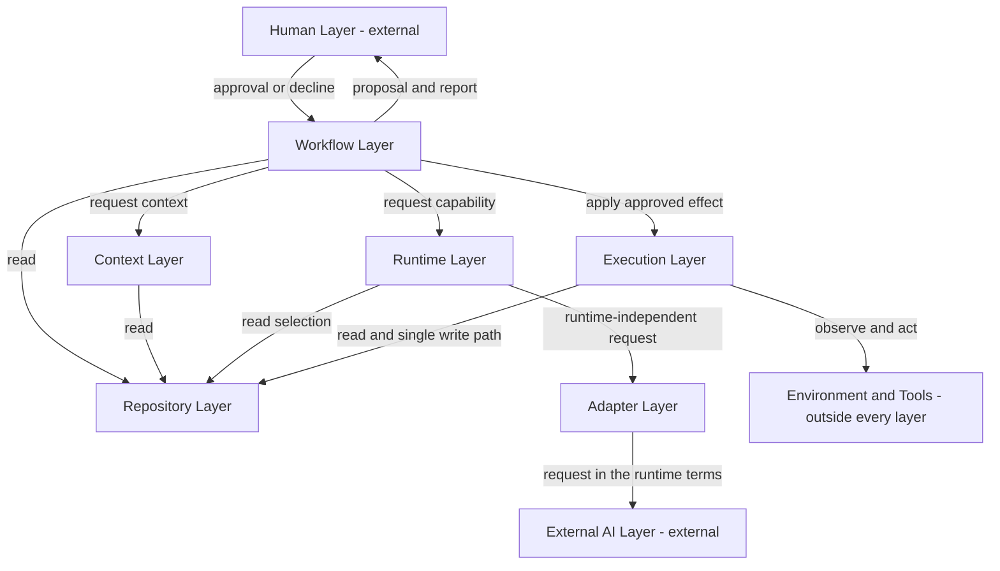
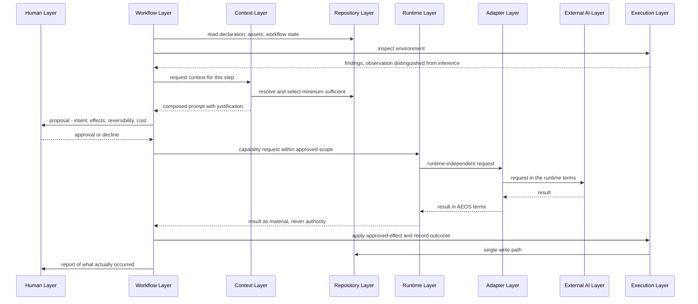
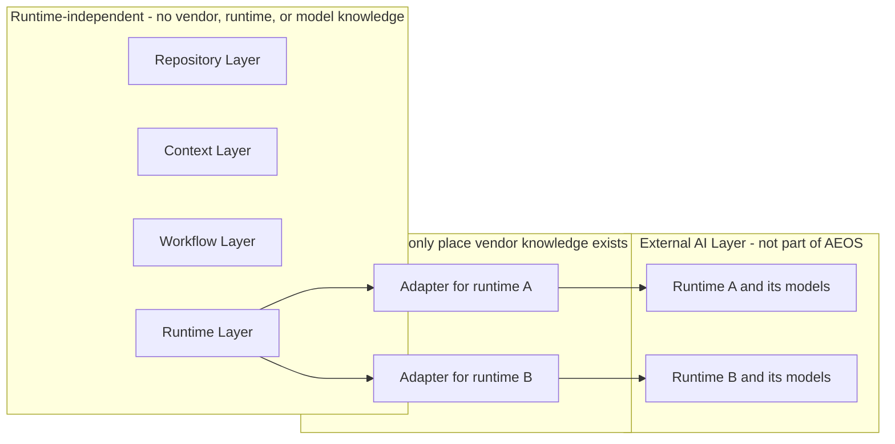
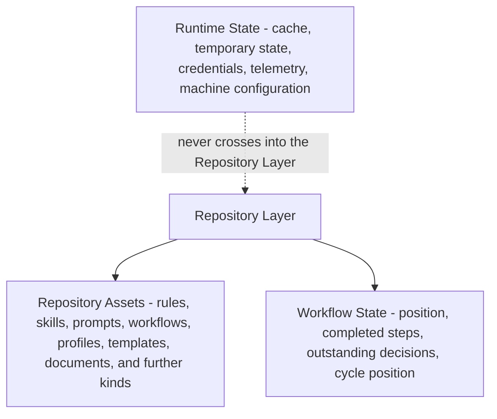
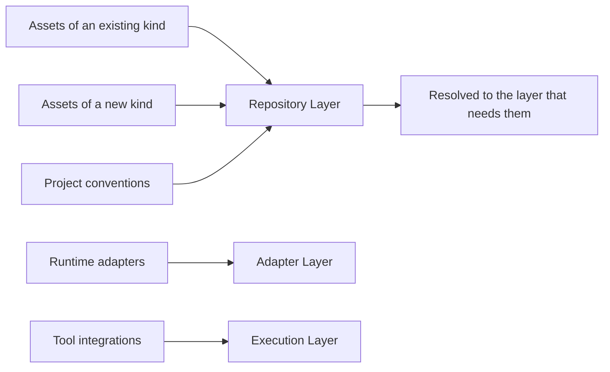

# AI Engineering Operating System

**AEOS — Architecture**

*The permanent statement of how AEOS is structured to deliver the Product.*

<table>
<thead>
<tr><th align="left">Field</th><th align="left">Value</th></tr>
</thead>
<tbody>
<tr><td><strong>Document</strong></td><td>Architecture</td></tr>
<tr><td><strong>Product</strong></td><td>AI Engineering Operating System (AEOS)</td></tr>
<tr><td><strong>Document ID</strong></td><td>AEOS-ARCH</td></tr>
<tr><td><strong>Version</strong></td><td>1.0.0</td></tr>
<tr><td><strong>Status</strong></td><td>Freeze candidate — awaiting owner approval</td></tr>
<tr><td><strong>Owner</strong></td><td>Product Owner, AEOS</td></tr>
<tr><td><strong>Author</strong></td><td>Chief System Architect, AEOS</td></tr>
<tr><td><strong>Audience</strong></td><td>Architects, engineering contributors, maintainers, reviewers, and AI runtimes consuming this repository</td></tr>
<tr><td><strong>Suggested path</strong></td><td><code>docs/architecture/ARCHITECTURE.md</code></td></tr>
<tr><td><strong>Companion documents</strong></td><td><code>AEOS_VISION.md</code> (AEOS-VISION) · <code>AEOS_PRODUCT_REQUIREMENTS.md</code> (AEOS-PRD) · <code>AEOS_GLOSSARY.md</code> (AEOS-GLOSSARY) · <code>AEOS_DOCUMENT_STANDARD.md</code> (AEOS-DOCSTD) · <code>AEOS_SUPPORTED_TECHNOLOGIES.md</code> (AEOS-TECH)</td></tr>
<tr><td><strong>Supersedes</strong></td><td>None</td></tr>
</tbody>
</table>

> **Authority of this document.**
> This document defines *how AEOS is structured* so that it can deliver the Product defined by
> AEOS-PRD. It is normative for the **layers, responsibilities, dependencies, and boundaries** of
> AEOS, and for the structural constraints that follow from them.
> It defines no product requirement, no terminology, no precise behavioral rule, no execution
> mechanism, and no code. Where this document and a document of higher authority both speak to a
> subject, the higher-authority document governs and any conflict here is a defect to be reported
> rather than acted upon.

> The key words **MUST**, **MUST NOT**, **SHOULD**, **SHOULD NOT**, and **MAY** in this document are
> to be interpreted as described in RFC 2119 and RFC 8174, and carry their normative meaning only
> when they appear in all capitals.

---

## Table of Contents

1. [Executive Summary](#1-executive-summary)
2. [Scope and Applicability](#2-scope-and-applicability)
3. [Architectural Principles](#3-architectural-principles)
4. [Architectural Layers](#4-architectural-layers)
5. [Repository Architecture](#5-repository-architecture)
6. [Context Architecture](#6-context-architecture)
7. [Workflow Architecture](#7-workflow-architecture)
8. [Runtime Architecture](#8-runtime-architecture)
9. [Adapter Architecture](#9-adapter-architecture)
10. [Extension Architecture](#10-extension-architecture)
11. [Cross-cutting Concerns](#11-cross-cutting-concerns)
12. [Architectural Boundaries](#12-architectural-boundaries)
13. [Traceability to AEOS-PRD](#13-traceability-to-aeos-prd)
14. [Future Evolution](#14-future-evolution)
15. [Document Governance](#15-document-governance)
16. [Appendix A — Architecture Diagrams](#appendix-a--architecture-diagrams)
17. [Appendix B — Layer Responsibility Matrix](#appendix-b--layer-responsibility-matrix)

---

<section>

## 1. Executive Summary

AEOS is an operating system for AI-assisted, human-supervised software engineering. AEOS-PRD states
what that product must do. This document states the structure that makes those obligations hold by
construction rather than by discipline at the point of use.

The structure is eight layers. Six are realized by AEOS: the Repository Layer, the Context Layer,
the Workflow Layer, the Runtime Layer, the Adapter Layer, and the Execution Layer. Two are
recognized but never realized by AEOS: the Human Layer, where decisions are made, and the External
AI Layer, where inference happens. Naming the two external layers is not a formality — most of the
product's guarantees are statements about what may cross those boundaries, and a boundary that is
not named cannot be enforced.

Five structural decisions carry most of the product's weight. Each converts a promise into a
property of the arrangement.

<table>
<thead>
<tr><th align="left">Decision</th><th align="left">What it makes structurally true</th></tr>
</thead>
<tbody>
<tr>
<td><strong>One store of durable meaning</strong></td>
<td>Only the Repository Layer holds anything the project carries forward. No other layer may retain product meaning, so a project cannot come to depend on state that its repository does not contain.</td>
</tr>
<tr>
<td><strong>One point of supervision</strong></td>
<td>The Workflow Layer is the only layer that addresses the Human Layer and the only layer that may initiate a consequential action. There is therefore exactly one path to effect, and exactly one place a gate can be checked.</td>
</tr>
<tr>
<td><strong>One place for runtime knowledge</strong></td>
<td>Knowledge of a specific Runtime, Vendor, or Model exists only in the Adapter Layer. Runtime independence becomes a property that can be inspected — a vendor name outside that layer is a defect that a reviewer can find.</td>
</tr>
<tr>
<td><strong>One place for platform knowledge</strong></td>
<td>Platform differences are absorbed in the Execution Layer. Every other layer is written once and behaves identically on every supported Platform.</td>
</tr>
<tr>
<td><strong>Declaration separated from execution</strong></td>
<td>Workflows, Rules, Skills, Prompts, and adapters are declared as Repository Assets and interpreted by layers that hold no policy of their own. What a team wants changed is data; what AEOS guarantees is structure.</td>
</tr>
</tbody>
</table>

The document proceeds from the general to the specific: principles first, then the layer model,
then one section for each layer's internal structure, then the concerns that cross all of them,
then the boundaries stated as prohibitions, then the trace back to AEOS-PRD.

Every structural rule in this document carries an `AR-` identifier and traces to one or more `PR-`
requirement identifiers. A rule that could not be traced would be a structure the Product did not
ask for, and would be a defect in this document.

</section>

---

<section>

## 2. Scope and Applicability

### 2.1 What This Document Governs

This document governs the structure of AEOS:

- the layers of AEOS, their responsibilities, and their classification as internal or external;
- the direction of dependency between layers and the interactions permitted between them;
- the structural arrangement within each layer, to the depth at which a Blueprint can be written against it;
- the boundaries of AEOS and what may cross each of them, in each direction;
- the structural discharge of concerns that no single layer owns;
- the extension points through which AEOS is extended rather than modified;
- the trace from each structural decision to the product requirements it serves.

### 2.2 What This Document Does Not Govern

<table>
<thead>
<tr><th align="left">Not governed here</th><th align="left">Owned by</th></tr>
</thead>
<tbody>
<tr><td>Why AEOS exists and what it must remain</td><td>AEOS-VISION</td></tr>
<tr><td>What AEOS is and what it must do</td><td>AEOS-PRD</td></tr>
<tr><td>What AEOS terms mean</td><td>AEOS-GLOSSARY</td></tr>
<tr><td>How AEOS documents are written</td><td>AEOS-DOCSTD</td></tr>
<tr><td>Which technologies AEOS recognizes, and at what tier</td><td>AEOS-TECH</td></tr>
<tr><td>The buildable arrangement of this structure — decomposition, relationships, and layout at the level a specification can be written against</td><td>Blueprint documents</td></tr>
<tr><td>How each behavior works, precisely and testably, including interfaces, formats, schemas, states, and error conditions</td><td>Specification documents</td></tr>
<tr><td>How AEOS executes, in what environment, with what lifecycle</td><td>Runtime documents</td></tr>
<tr><td>Installation, distribution procedure, and update mechanics</td><td>Distribution documents</td></tr>
<tr><td>Project templates, scaffolds, and starting points</td><td>Template assets</td></tr>
<tr><td>Algorithms, code, dependency selection, and coding detail</td><td>The codebase and its tests</td></tr>
</tbody>
</table>

> **The reading rule for this document.**
> A statement here that can be satisfied by only one mechanism has reached below its layer and is a
> defect in this document. Architecture decides *how AEOS is structured*. It does not decide
> *whether* a capability exists, which is settled by AEOS-PRD, and it does not decide *how a
> behavior works precisely*, which belongs to Specification.

### 2.3 Relationship to the Frozen Documents

Five documents govern this one. This document contradicts none of them and restates none of them.

<table>
<thead>
<tr><th align="left">Document</th><th align="left">Governs</th><th align="left">This document's obligation</th></tr>
</thead>
<tbody>
<tr>
<td><strong>AEOS-VISION</strong></td>
<td>Purpose, philosophy, invariants <code>V1</code>–<code>V10</code>.</td>
<td>No structure here may make an invariant unenforceable. A structure that would permit inference inside AEOS, privilege a Vendor, or require a fork is excluded regardless of its merits.</td>
</tr>
<tr>
<td><strong>AEOS-PRD</strong></td>
<td>Product behavior, capabilities <code>C1</code>–<code>C10</code>, requirements, scope.</td>
<td>Every structural decision here traces to one or more <code>PR-</code> identifiers and MUST NOT weaken, reinterpret, or widen any of them.</td>
</tr>
<tr>
<td><strong>AEOS-GLOSSARY</strong></td>
<td>Terminology, naming conventions, identifier shape.</td>
<td>Terms are used with their defined meaning and are not redefined. The three responsibilities reserved for architecture — Workflow Engine, Context Router, Runtime Adapter — are assigned here to layers, under the names the Glossary fixed.</td>
</tr>
<tr>
<td><strong>AEOS-DOCSTD</strong></td>
<td>Document form, structure, review, and freeze.</td>
<td>This document's structure, format, normative language, and review classification follow it.</td>
</tr>
<tr>
<td><strong>AEOS-TECH</strong></td>
<td>Recognized technologies and their support tiers.</td>
<td>This document names no technology. Where a structure requires one, the choice is made in AEOS-TECH and referenced, never made here.</td>
</tr>
</tbody>
</table>

### 2.4 Section Ordering

This document follows the ordering AEOS-DOCSTD Appendix B states for the Architecture layer:
context, then structure, then boundaries, then decisions with their reasoning and traces. Two
sections are present that a reader of the requested outline may not expect:
[Section 2](#2-scope-and-applicability) and [Section 15](#15-document-governance) are required of
every AEOS document by AEOS-DOCSTD rules `TP1` and `O4`, and their presence shifts the numbering of
the subject sections by one.

### 2.5 Identifier and Terminology Registration

Structural rules in this document carry identifiers of the shape `AR-<AREA>-<NNN>`, as AEOS-GLOSSARY
Section 5.4 requires. The `AREA` codes below are registered by this document.

<table>
<thead>
<tr><th align="left">AREA</th><th align="left">Meaning</th><th align="left">Section</th></tr>
</thead>
<tbody>
<tr><td><code>PRN</code></td><td>Architectural principle</td><td><a href="#3-architectural-principles">3</a></td></tr>
<tr><td><code>LAY</code></td><td>Layer model and layer rules</td><td><a href="#4-architectural-layers">4</a></td></tr>
<tr><td><code>REP</code></td><td>Repository architecture</td><td><a href="#5-repository-architecture">5</a></td></tr>
<tr><td><code>CTX</code></td><td>Context architecture</td><td><a href="#6-context-architecture">6</a></td></tr>
<tr><td><code>WFL</code></td><td>Workflow architecture</td><td><a href="#7-workflow-architecture">7</a></td></tr>
<tr><td><code>RUN</code></td><td>Runtime architecture</td><td><a href="#8-runtime-architecture">8</a></td></tr>
<tr><td><code>ADP</code></td><td>Adapter architecture</td><td><a href="#9-adapter-architecture">9</a></td></tr>
<tr><td><code>EXT</code></td><td>Extension architecture</td><td><a href="#10-extension-architecture">10</a></td></tr>
<tr><td><code>XCC</code></td><td>Cross-cutting concern</td><td><a href="#11-cross-cutting-concerns">11</a></td></tr>
<tr><td><code>BND</code></td><td>Architectural boundary</td><td><a href="#12-architectural-boundaries">12</a></td></tr>
</tbody>
</table>

Three of these codes — `REP`, `WFL`, and `RUN` — are also in use in AEOS-PRD. They carry the same
meaning in both documents and are therefore consistent with AEOS-GLOSSARY rule `I3`, which prohibits
reuse of an `AREA` code with a *different* meaning. An identifier is always read with its layer
prefix: `PR-REP-001` is a product requirement and `AR-REP-001` is a structural rule.

> **On the eight layer names.**
> The names *Human Layer*, *Repository Layer*, *Context Layer*, *Workflow Layer*, *Runtime Layer*,
> *Adapter Layer*, *External AI Layer*, and *Execution Layer* name structural elements of AEOS. They
> are introduced under this document's authority over structure and carry no meaning beyond the
> responsibilities assigned to them in [Section 4](#4-architectural-layers). Their addition to
> AEOS-GLOSSARY as defined terms is proposed in [Section 14.4](#144-proposed-glossary-additions), as
> AEOS-GLOSSARY rule `W4` requires; until the owner acts on that proposal, this document is their
> only authority.

</section>

---

<section>

## 3. Architectural Principles

### 3.1 The Principles

These twelve principles constrain every structural decision in this document and every Blueprint,
Specification, and implementation derived from it. A structure that violates one is a defect, not a
variation. Each principle is a statement about arrangement; none of them restates a product
principle, which AEOS-PRD owns.

<table>
<thead>
<tr><th align="left">ID</th><th align="left">Principle</th><th align="left">Statement</th><th align="left">Traces to</th></tr>
</thead>
<tbody>
<tr>
<td><code>AR-PRN-001</code></td>
<td><strong>One responsibility per layer</strong></td>
<td>Each layer owns exactly one responsibility and MUST NOT perform another layer's. A responsibility that does not fit an existing layer is an architecture revision, never a quiet addition.</td>
<td><code>PR-NFR-006</code> · <code>PR-NFR-007</code></td>
</tr>
<tr>
<td><code>AR-PRN-002</code></td>
<td><strong>Single direction of dependency</strong></td>
<td>Dependencies point in one direction. A layer MUST NOT depend on a layer that depends on it, directly or transitively.</td>
<td><code>PR-NFR-006</code> · <code>PR-NFR-008</code></td>
</tr>
<tr>
<td><code>AR-PRN-003</code></td>
<td><strong>One store of durable meaning</strong></td>
<td>Durable product meaning exists only in the Repository Layer. Every other layer is replaceable without loss of what the project knows.</td>
<td><code>PR-REP-001</code> · <code>PR-REP-002</code> · <code>PR-REP-015</code></td>
</tr>
<tr>
<td><code>AR-PRN-004</code></td>
<td><strong>One point of supervision</strong></td>
<td>Every consequential action reaches effect through exactly one path, and that path passes an Approval Gate held by the Workflow Layer.</td>
<td><code>PR-WFL-005</code> · <code>PR-WFL-006</code> · <code>PR-SAF-001</code> · <code>PR-SAF-003</code></td>
</tr>
<tr>
<td><code>AR-PRN-005</code></td>
<td><strong>Isolation of external knowledge</strong></td>
<td>Knowledge of an external counterparty is confined to the single layer that faces it: Runtime, Vendor, and Model knowledge to the Adapter Layer; Platform and Tool knowledge to the Execution Layer.</td>
<td><code>PR-RUN-002</code> · <code>PR-RUN-005</code> · <code>PR-PLT-005</code></td>
</tr>
<tr>
<td><code>AR-PRN-006</code></td>
<td><strong>Declared, not embedded</strong></td>
<td>Anything a user may need to inspect, change, or extend is declared as a Repository Asset and interpreted by a layer that holds no policy of its own.</td>
<td><code>PR-WFL-002</code> · <code>PR-RUL-001</code> · <code>PR-NFR-007</code></td>
</tr>
<tr>
<td><code>AR-PRN-007</code></td>
<td><strong>Inspectable by construction</strong></td>
<td>Every layer produces an account of what it found, intended, and did, in terms a human can act on. A layer whose behavior can only be inferred is defective.</td>
<td><code>PR-NFR-001</code> · <code>PR-WFL-011</code> · <code>PR-SAF-011</code></td>
</tr>
<tr>
<td><code>AR-PRN-008</code></td>
<td><strong>Failure is contained</strong></td>
<td>A failing or absent layer reduces the options available and MUST NOT corrupt the Repository Layer or leave a state AEOS cannot describe.</td>
<td><code>PR-RUN-010</code> · <code>PR-SAF-010</code> · <code>PR-NFR-005</code></td>
</tr>
<tr>
<td><code>AR-PRN-009</code></td>
<td><strong>Extension over modification</strong></td>
<td>Every anticipated variation is an extension point. A variation that requires modifying AEOS is an architectural defect, not a user's problem.</td>
<td><code>PR-NFR-007</code> · <code>PR-RUN-012</code> · <code>PR-WFL-013</code></td>
</tr>
<tr>
<td><code>AR-PRN-010</code></td>
<td><strong>Testable at every boundary</strong></td>
<td>Each layer is verifiable in isolation, and every external counterparty is replaceable at its boundary for the purpose of verification.</td>
<td><code>PR-NFR-010</code> · <code>PR-TDD-012</code></td>
</tr>
<tr>
<td><code>AR-PRN-011</code></td>
<td><strong>Minimum sufficient crossing</strong></td>
<td>Information crosses a boundary only when the receiving side requires it for the step in hand, and the reason for each crossing is retained.</td>
<td><code>PR-PMT-003</code> · <code>PR-PMT-004</code> · <code>PR-NFR-004</code> · <code>PR-NFR-011</code></td>
</tr>
<tr>
<td><code>AR-PRN-012</code></td>
<td><strong>Uniform across Platform and distribution</strong></td>
<td>No layer, responsibility, dependency, or boundary varies by Platform or by distribution method.</td>
<td><code>PR-PLT-003</code> · <code>PR-DST-005</code> · <code>PR-DST-006</code></td>
</tr>
</tbody>
</table>

### 3.2 How the Product Principles Are Realized Structurally

AEOS-PRD states thirteen product principles. This document does not restate them. The table records
which structure makes each of them hold, so that a reviewer can check a principle by inspecting an
arrangement rather than by trusting an intention.

<table>
<thead>
<tr><th align="left">Product principle (AEOS-PRD Section 7)</th><th align="left">Structure that realizes it</th></tr>
</thead>
<tbody>
<tr><td>Human-in-the-Loop by Default</td><td>The Workflow Layer is the only layer that addresses the Human Layer and the only layer that may initiate a consequential action — <a href="#7-workflow-architecture">Section 7</a>, <a href="#12-architectural-boundaries">Section 12</a>.</td></tr>
<tr><td>Explain Before Execute</td><td>The interaction loop is the Workflow Layer's only path to effect; a step with no proposal has no route to execution — <a href="#7-workflow-architecture">Section 7</a>.</td></tr>
<tr><td>Incremental Execution</td><td>Workflow State is written at every step boundary, making position observable and interruption safe — <a href="#7-workflow-architecture">Section 7</a>.</td></tr>
<tr><td>TDD-first Development</td><td>Cycle position is Workflow State and cycle order is expressed as step preconditions, not as a separate mechanism — <a href="#7-workflow-architecture">Section 7</a>.</td></tr>
<tr><td>Repository as Product</td><td>The Repository Layer is the only store of durable meaning, and no layer above it retains any — <a href="#5-repository-architecture">Section 5</a>.</td></tr>
<tr><td>Context Minimization</td><td>The Context Layer selects per step from the Repository Layer and retains a justification for each element — <a href="#6-context-architecture">Section 6</a>.</td></tr>
<tr><td>Vendor Independence</td><td>Vendor knowledge exists only in the Adapter Layer; no other layer may name one — <a href="#9-adapter-architecture">Section 9</a>, <a href="#12-architectural-boundaries">Section 12</a>.</td></tr>
<tr><td>Runtime Independence</td><td>The Runtime Layer expresses work only as Engineering Capability requests in runtime-independent terms; translation happens at the Adapter Layer — <a href="#8-runtime-architecture">Section 8</a>.</td></tr>
<tr><td>Model Independence</td><td>Model knowledge is adapter-local; no layer above the Adapter Layer may hold a Model assumption — <a href="#9-adapter-architecture">Section 9</a>.</td></tr>
<tr><td>Platform Independence</td><td>Platform differences are absorbed in the Execution Layer and are invisible to every other layer — <a href="#11-cross-cutting-concerns">Section 11</a>.</td></tr>
<tr><td>Distribution Independence</td><td>Distribution supplies an entry surface to the Workflow Layer and changes no layer, responsibility, or boundary — <a href="#11-cross-cutting-concerns">Section 11</a>.</td></tr>
<tr><td>Safety by Default</td><td>Action class determines gate strength at one place, and the destructive class is never satisfiable by an Automation Grant — <a href="#7-workflow-architecture">Section 7</a>.</td></tr>
<tr><td>Extensibility by Design</td><td>Extension points are named exhaustively and every extension is a declared Repository Asset — <a href="#10-extension-architecture">Section 10</a>.</td></tr>
</tbody>
</table>

### 3.3 When Principles Conflict

Architectural principles are weighed in the order AEOS-PRD Section 7 establishes for product
principles, which governs this document as it governs every other. This document adds no ordering of
its own and MUST NOT be read as establishing one.

Where two structural options satisfy that ordering equally, the option that removes a possibility of
error is preferred over the option that detects one, and the option that can be verified in
isolation is preferred over the option that requires the whole system to be assembled first.

</section>

---

<section>

## 4. Architectural Layers

### 4.1 The Layer Model

AEOS is structured as eight layers. Six are **internal**: they are realized by AEOS and constitute
it. Two are **external**: they are named because AEOS is defined by what it does and does not send
across their boundaries, and a boundary with no name on the far side cannot be governed.

<table>
<thead>
<tr><th align="left">#</th><th align="left">Layer</th><th align="left">Kind</th><th align="left">Single responsibility</th></tr>
</thead>
<tbody>
<tr><td>1</td><td><strong>Human Layer</strong></td><td>External</td><td>Deciding.</td></tr>
<tr><td>2</td><td><strong>Repository Layer</strong></td><td>Internal</td><td>Holding everything the project carries forward.</td></tr>
<tr><td>3</td><td><strong>Context Layer</strong></td><td>Internal</td><td>Selecting the minimum sufficient Context for one step, and retaining why.</td></tr>
<tr><td>4</td><td><strong>Workflow Layer</strong></td><td>Internal</td><td>Sequencing work and holding every Approval Gate.</td></tr>
<tr><td>5</td><td><strong>Runtime Layer</strong></td><td>Internal</td><td>Orchestrating external Runtimes in runtime-independent terms.</td></tr>
<tr><td>6</td><td><strong>Adapter Layer</strong></td><td>Internal</td><td>Translating between AEOS and one external Runtime.</td></tr>
<tr><td>7</td><td><strong>External AI Layer</strong></td><td>External</td><td>Performing inference.</td></tr>
<tr><td>8</td><td><strong>Execution Layer</strong></td><td>Internal</td><td>Observing the Environment and applying approved effects.</td></tr>
</tbody>
</table>

The order above is the order in which the layers are presented and is not a ranking. The dependency
relationships between them are stated in [Section 4.4](#44-permitted-interactions), and the
authority relationship — which is not a layer property at all — rests with the Human Layer at every
point where a decision is required.

> **Two layer names require care in reading.**
> *Runtime Layer* names an internal layer of AEOS that contains no Runtime. A Runtime, in the sense
> AEOS-GLOSSARY fixes, is an external AI system that performs inference, and every Runtime belongs
> to the External AI Layer. The Runtime Layer holds the responsibility for orchestrating them.
> *Runtime Layer* also MUST NOT be read as a statement about how AEOS itself executes, which Runtime
> documents own and which this document does not address.

### 4.2 Layer Classification

<table>
<thead>
<tr><th align="left">Kind</th><th align="left">Layers</th><th align="left">What the classification means</th></tr>
</thead>
<tbody>
<tr>
<td><strong>Internal</strong></td>
<td>Repository · Context · Workflow · Runtime · Adapter · Execution</td>
<td>Realized by AEOS, versioned with AEOS, and verifiable in isolation. AEOS is responsible for their behavior.</td>
</tr>
<tr>
<td><strong>External</strong></td>
<td>Human · External AI</td>
<td>Never realized by AEOS and never simulated by it. AEOS is responsible only for what it sends to them, what it accepts from them, and how it behaves when they are absent.</td>
</tr>
</tbody>
</table>

Two things sit outside every layer and are named here so that no reader places them inside one: the
**Environment**, which belongs to the user, and the **Tools** the Execution Layer orchestrates —
version control, build and test tooling, delivery systems, and the rest. AEOS acts upon them, is a
guest among them, and contains none of them.

### 4.3 Layer Responsibilities

Each layer is described below by what it owns, what it MUST NOT do, and which named responsibility
from AEOS-GLOSSARY it discharges. The complete matrix, including dependencies and traces, is
[Appendix B](#appendix-b--layer-responsibility-matrix).

<strong>1. Human Layer</strong> — deciding

 

**Owns.** Intent, judgment, Human Approval, the issuing and withdrawal of Automation Grants, and the
decision to decline. The user's Repository, machine, credentials, and judgment belong here and are
never appropriated by a layer below.

**Receives.** Proposals, findings, reports, and questions — each stated in terms a human can act on,
each distinguishing observed fact from inference.

**MUST NOT.** Be realized, simulated, predicted, or stood in for by any internal layer. An internal
layer that infers what the Human Layer would have decided has replaced the product's central
guarantee with a guess.

**Structural consequence.** Because the Human Layer is external, an approval cannot be manufactured
inside AEOS. The only way to obtain one is to present a Proposal and wait.

<strong>2. Repository Layer</strong> — holding everything the project carries forward

 

**Owns.** Repository Assets of every kind and Workflow State. It is the single source of truth for
what the project is, how it is built, what has been decided, and where work stands.

**Provides.** Read access to every internal layer that needs it, and a single write path used by the
Execution Layer.

**MUST NOT.** Depend on any other layer; hold credentials, machine-specific configuration, or any
other Runtime State; or require AEOS to be running in order for its contents to be meaningful to a
human reader.

**Structural consequence.** Every other internal layer can be replaced, restarted, or removed
without the project losing anything it knows. This is what makes AEOS-PRD `PR-REP-016` a property of
the arrangement rather than an aspiration.

<strong>3. Context Layer</strong> — selecting the minimum sufficient Context

 

**Discharges.** The **Context Router** responsibility named by AEOS-GLOSSARY.

**Owns.** Resolution of a step's declared context needs against the Repository Layer, selection of
the smallest sufficient set, retention of the reason each element was included, and composition of
the selected material into a Prompt.

**MUST NOT.** Address a Runtime, hold knowledge of any Runtime, Vendor, or Model, retain durable
state of its own, or include material that did not come from the Repository Layer or from recorded
Environment findings.

**Structural consequence.** Context selection is decided once, in one place, from one source. A
layer that cannot reach a Runtime cannot quietly optimize its selection for one.

<strong>4. Workflow Layer</strong> — sequencing work and holding every gate

 

**Discharges.** The **Workflow Engine** responsibility named by AEOS-GLOSSARY.

**Owns.** Interpretation of Workflow declarations; the interaction loop; classification of each
action by Action Class; the Approval Gate at each consequential step; consultation of Automation
Grants; maintenance of Workflow State; and the report of what actually occurred.

**MUST NOT.** Contain the workflows it executes, hold runtime-specific or platform-specific
knowledge, reach the Adapter Layer or the External AI Layer directly, or execute an effect itself.

**Structural consequence.** There is one supervisor. Every other internal layer performs work only
when the Workflow Layer asks it to, after whatever gate that step required has been satisfied.

<strong>5. Runtime Layer</strong> — orchestrating external Runtimes

 

**Owns.** Resolution of the Runtime selection recorded in the Profile; declaration and matching of
Engineering Capabilities; dispatch of runtime-independent requests to the Adapter Layer; handling of
unavailability and error as ordinary conditions; coordination where a Workflow uses more than one
Runtime; and attribution of usage per project.

**MUST NOT.** Perform inference; contain a Runtime or a Model; hold credentials; substitute one
Runtime for another; initiate an invocation that no gate authorized; or express work in any Vendor's
terms.

**Structural consequence.** Everything above this layer is written once, in runtime-independent
terms, and is unaffected when the selected Runtime changes.

<strong>6. Adapter Layer</strong> — translating for one Runtime

 

**Discharges.** The **Runtime Adapter** responsibility named by AEOS-GLOSSARY.

**Owns.** Declaration of the Engineering Capabilities one external Runtime offers; translation of a
runtime-independent request into that Runtime's terms and of its results back into AEOS terms;
custody of the credentials that Runtime requires, held as Runtime State; and reporting of that
Runtime's failures in AEOS terms.

**MUST NOT.** Hold engineering policy of any kind — no Rule, no gate, no context selection, no
Workflow knowledge; address any internal layer other than by returning results to the Runtime Layer;
write to the Repository Layer; or record a credential anywhere.

**Structural consequence.** This is the only layer that knows a Vendor exists. A Vendor, Runtime, or
Model name appearing anywhere else in AEOS is a defect that a reviewer can find by looking.

<strong>7. External AI Layer</strong> — performing inference

 

**Contains.** External Runtimes and the Models they use. Nothing here is part of AEOS, is versioned
with AEOS, or is guaranteed by AEOS.

**Receives.** Only what an approved gate authorized to cross, in the terms its adapter translated it
into.

**MUST NOT.** Be depended upon by any internal layer for anything other than inference; carry
authority; or be required for AEOS to inspect, report, or explain.

**Structural consequence.** A result returned from this layer is material for a human to judge. It
is never an instruction, never an approval, and never a change to a Rule.

<strong>8. Execution Layer</strong> — observing and applying approved effects

 

**Owns.** Environment inspection; orchestration of the project's Tools; application of approved
effects to the Repository and the Environment; the single write path into the Repository Layer; and
absorption of every Platform difference.

**MUST NOT.** Decide whether an action should occur; expand the scope of what was approved; modify
or remove a component AEOS did not install without specific confirmation obtained by the Workflow
Layer; expose a Platform difference to any other layer; or address the Human Layer or the External
AI Layer.

**Structural consequence.** Every durable change has one origin and one path, which is what makes
the audit record complete rather than approximately complete.

### 4.4 Permitted Interactions

A layer may address only the counterparties listed for it. Every other interaction is prohibited.
This table is complete.

<table>
<thead>
<tr><th align="left">From</th><th align="left">MAY address</th><th align="left">MUST NOT address</th></tr>
</thead>
<tbody>
<tr>
<td><strong>Human Layer</strong></td>
<td>The Workflow Layer, through whatever entry surface the distribution provides.</td>
<td>Every other layer directly.</td>
</tr>
<tr>
<td><strong>Repository Layer</strong></td>
<td>No layer. It is addressed; it does not address.</td>
<td>Every layer.</td>
</tr>
<tr>
<td><strong>Context Layer</strong></td>
<td>The Repository Layer, for reading.</td>
<td>Human · Workflow · Runtime · Adapter · External AI · Execution.</td>
</tr>
<tr>
<td><strong>Workflow Layer</strong></td>
<td>Human · Repository, for reading · Context · Runtime · Execution.</td>
<td>Adapter · External AI.</td>
</tr>
<tr>
<td><strong>Runtime Layer</strong></td>
<td>Repository, for reading · Adapter.</td>
<td>Human · Context · External AI · Execution.</td>
</tr>
<tr>
<td><strong>Adapter Layer</strong></td>
<td>External AI · the Runtime Layer, to return results.</td>
<td>Human · Repository · Context · Workflow · Execution.</td>
</tr>
<tr>
<td><strong>External AI Layer</strong></td>
<td>Its own adapter, to return results.</td>
<td>Every other layer.</td>
</tr>
<tr>
<td><strong>Execution Layer</strong></td>
<td>Repository, for reading and writing · the Environment and its Tools.</td>
<td>Human · Context · Runtime · Adapter · External AI.</td>
</tr>
</tbody>
</table>

Two consequences of this table are worth stating plainly, because they are the reason it is shaped
this way. First, no layer can reach the External AI Layer without passing the Runtime Layer and an
adapter, so there is no path by which context leaves the machine unexamined. Second, no layer can
reach the Human Layer except the Workflow Layer, so every question put to a person arrives through
the one place that knows what was proposed and what remains outstanding.

### 4.5 Layer Rules

<table>
<thead>
<tr><th align="left">ID</th><th align="left">Rule</th><th align="left">Traces to</th></tr>
</thead>
<tbody>
<tr><td><code>AR-LAY-001</code></td><td>AEOS MUST be structured as the eight layers named in <a href="#41-the-layer-model">Section 4.1</a>, of which six are internal and two are external.</td><td><code>PR-NFR-006</code></td></tr>
<tr><td><code>AR-LAY-002</code></td><td>Each layer MUST hold exactly the responsibility stated for it in <a href="#appendix-b--layer-responsibility-matrix">Appendix B</a>, and MUST NOT hold another layer's.</td><td><code>PR-NFR-006</code> · <code>PR-NFR-007</code></td></tr>
<tr><td><code>AR-LAY-003</code></td><td>A layer MUST NOT depend on a layer that depends on it, directly or transitively.</td><td><code>PR-NFR-006</code></td></tr>
<tr><td><code>AR-LAY-004</code></td><td>A layer MUST NOT address a counterparty that <a href="#44-permitted-interactions">Section 4.4</a> does not permit it to address.</td><td><code>PR-SAF-005</code> · <code>PR-NFR-006</code></td></tr>
<tr><td><code>AR-LAY-005</code></td><td>The Human Layer and the External AI Layer MUST NOT be realized, simulated, or substituted by any internal layer.</td><td><code>PR-RUN-001</code> · <code>PR-WFL-005</code></td></tr>
<tr><td><code>AR-LAY-006</code></td><td>Every internal layer other than the Runtime Layer and the Adapter Layer MUST remain fully functional when the External AI Layer is unavailable.</td><td><code>PR-RUN-010</code></td></tr>
<tr><td><code>AR-LAY-007</code></td><td>An internal layer other than the Repository Layer MUST NOT hold durable state; each therefore resumes from the Repository Layer alone.</td><td><code>PR-REP-002</code> · <code>PR-SAF-010</code></td></tr>
<tr><td><code>AR-LAY-008</code></td><td>Adding, removing, merging, or splitting a layer MUST be an architecture revision under <a href="#152-change-control">Section 15.2</a>, and MUST NOT be introduced by a Blueprint, a Specification, or an implementation.</td><td><code>PR-NFR-006</code></td></tr>
<tr><td><code>AR-LAY-009</code></td><td>A layer, responsibility, dependency, or permitted interaction MUST NOT vary by Platform or by distribution method.</td><td><code>PR-PLT-003</code> · <code>PR-DST-005</code></td></tr>
<tr><td><code>AR-LAY-010</code></td><td>Each internal layer MUST be verifiable in isolation, with its permitted counterparties replaceable at their boundary for the purpose of verification.</td><td><code>PR-NFR-010</code> · <code>PR-TDD-012</code></td></tr>
</tbody>
</table>

</section>

---

<section>

## 5. Repository Architecture

### 5.1 What the Repository Layer Holds

The Repository Layer holds two kinds of content and refuses a third. The distinction is drawn by
AEOS-PRD as a product distinction; this section states its structural consequence.

<table>
<thead>
<tr><th align="left">Content</th><th align="left">Structural treatment</th></tr>
</thead>
<tbody>
<tr>
<td><strong>Repository Assets</strong></td>
<td>Held durably, versioned with the project, readable without AEOS, addressable by identifier, and separable from the user's own project content.</td>
</tr>
<tr>
<td><strong>Workflow State</strong></td>
<td>Held durably beside the assets, written at every step boundary, and sufficient on its own to describe where work stands and to resume it.</td>
</tr>
<tr>
<td><strong>Runtime State</strong></td>
<td>Not held. It exists outside the Repository Layer, is never required to understand or reproduce a project, and MUST NOT be promoted into either kind above.</td>
</tr>
</tbody>
</table>

### 5.2 The Asset Model

Every Repository Asset, of every kind, shares one structural shape. The shape is what allows a new
kind of asset to be added without changing any layer, which is the mechanism behind the open list
AEOS-PRD states.

<table>
<thead>
<tr><th align="left">Element</th><th align="left">What it establishes</th></tr>
</thead>
<tbody>
<tr><td><strong>Identity</strong></td><td>A stable name by which other assets and Workflow State refer to it, independent of where it is stored.</td></tr>
<tr><td><strong>Kind</strong></td><td>Which sort of asset it is, so that a layer can resolve it without inferring from its location or its content.</td></tr>
<tr><td><strong>Version</strong></td><td>Which revision a project depends on, so that a dependent asset can state what it was written against.</td></tr>
<tr><td><strong>Scope</strong></td><td>Where the asset applies, which is the input to precedence resolution when two assets overlap.</td></tr>
<tr><td><strong>Declaration</strong></td><td>What the asset asserts, in a form an AI runtime can act on without transformation.</td></tr>
<tr><td><strong>Body</strong></td><td>What a human reads to understand and review it, in the same artifact as the declaration.</td></tr>
</tbody>
</table>

The expression of these elements — their format, syntax, schema, and file layout — is a Blueprint
and Specification concern and is not decided here. What is decided here is that all six are present
in every asset of every kind, and that no layer may depend on an asset possessing anything else.

### 5.3 Resolution and Precedence

Assets overlap. Two Rules may claim the same subject, a project-level Workflow may coexist with a
narrower one, and a Skill may exist in more than one version. Resolution is a structural concern
because a non-deterministic answer would make the same project behave differently on two machines,
which AEOS-PRD `PR-NFR-002` forbids.

The architecture requires that resolution be performed in one place — the Repository Layer — and
that the resulting order be **deterministic**, **total**, and **explainable**: for any two competing
assets, exactly one wins, the same one on every machine, and AEOS can state which and why. The
ordering itself is defined by the Blueprint layer, because it is an arrangement rather than a
structure, and stating it here would fix at the architecture layer something the Product deliberately
left open.

### 5.4 Separability

AEOS adopts existing projects far more often than it creates them, and adoption is the case that must
be safest. The architecture therefore requires that AEOS-owned content in a repository be separable
from the user's own content: identifiable as AEOS-owned, removable without touching anything else,
and addable without relocating or restructuring what is already there.

Separability is a structural property, not a courtesy. It is what makes `PR-PRJ-002` and `PR-PRJ-011`
achievable at the same time, and it is the reason no layer may store product meaning in a location it
does not own.

### 5.5 The Single Write Path

Reads from the Repository Layer are direct: any internal layer permitted to read may do so. Writes
are not. Every durable write is performed by the Execution Layer, and originates from exactly one of
two things: an approved step, or the record of a supervision event — a Proposal made, a decision
taken, an outcome reached.

This asymmetry is deliberate. Reading widely costs nothing and keeps layers simple; writing from many
places would make the audit record a reconstruction rather than a record.

### 5.6 Repository Rules

<table>
<thead>
<tr><th align="left">ID</th><th align="left">Rule</th><th align="left">Traces to</th></tr>
</thead>
<tbody>
<tr><td><code>AR-REP-001</code></td><td>The Repository Layer MUST be the only store of durable product meaning in AEOS.</td><td><code>PR-REP-001</code> · <code>PR-REP-002</code></td></tr>
<tr><td><code>AR-REP-002</code></td><td>The Repository Layer MUST hold Repository Assets and Workflow State, and MUST NOT hold Runtime State.</td><td><code>PR-REP-015</code></td></tr>
<tr><td><code>AR-REP-003</code></td><td>Every Repository Asset MUST carry identity, kind, version, scope, a declaration, and a human-readable body, in one artifact.</td><td><code>PR-REP-009</code> · <code>PR-REP-010</code> · <code>PR-NFR-009</code></td></tr>
<tr><td><code>AR-REP-004</code></td><td>References between Repository Assets MUST be made by identity, and MUST NOT depend on storage location or ordering.</td><td><code>PR-PRJ-008</code> · <code>PR-NFR-008</code></td></tr>
<tr><td><code>AR-REP-005</code></td><td>AEOS-owned repository content MUST be separable from the user's project content: identifiable, removable, and addable without restructuring what already exists.</td><td><code>PR-PRJ-002</code> · <code>PR-PRJ-011</code></td></tr>
<tr><td><code>AR-REP-006</code></td><td>Resolution of overlapping assets MUST be deterministic, total, and explainable, and MUST be performed in the Repository Layer alone.</td><td><code>PR-RUL-004</code> · <code>PR-NFR-002</code></td></tr>
<tr><td><code>AR-REP-007</code></td><td>The Repository Layer MUST NOT hold credentials, secrets, or machine-specific configuration.</td><td><code>PR-REP-013</code> · <code>PR-SAF-006</code></td></tr>
<tr><td><code>AR-REP-008</code></td><td>A Repository Asset MUST remain meaningful to a human reader and consumable by an AI runtime when AEOS is not running.</td><td><code>PR-REP-016</code> · <code>PR-REP-010</code></td></tr>
<tr><td><code>AR-REP-009</code></td><td>Workflow State MUST be durable, MUST be held in the Repository Layer, and MUST NOT be described or treated as transient.</td><td><code>PR-WFL-007</code> · <code>PR-WFL-008</code></td></tr>
<tr><td><code>AR-REP-010</code></td><td>The Repository Layer MUST NOT depend on any other layer.</td><td><code>PR-REP-016</code></td></tr>
<tr><td><code>AR-REP-011</code></td><td>Every durable write MUST be performed by the Execution Layer and MUST originate from an approved step or from the record of a supervision event.</td><td><code>PR-WFL-015</code> · <code>PR-SAF-005</code></td></tr>
<tr><td><code>AR-REP-012</code></td><td>AEOS MUST re-read the Repository Layer before proceeding when it has changed outside AEOS's knowledge, and MUST NOT proceed from a cached view.</td><td><code>PR-REP-014</code> · <code>PR-ENV-001</code></td></tr>
<tr><td><code>AR-REP-013</code></td><td>Project state MUST be isolated per project: content of one project MUST NOT be readable as, or writable through, another project's state.</td><td><code>PR-PRJ-009</code></td></tr>
</tbody>
</table>

</section>

---

<section>

## 6. Context Architecture

### 6.1 The Context Router Responsibility

The Context Layer discharges the Context Router responsibility that AEOS-GLOSSARY reserves for
architecture: selecting the minimum sufficient Context for a step of work and retaining the reason
each element was included. This document assigns the responsibility to a layer. Whether that layer
is realized as one artifact or several is a Blueprint decision.

### 6.2 The Selection Chain

Context is produced by a chain with four stages. Each stage has one input and one output, which is
what makes the result explainable element by element rather than in aggregate.

<table>
<thead>
<tr><th align="left">Stage</th><th align="left">Input</th><th align="left">Output</th></tr>
</thead>
<tbody>
<tr><td><strong>1. Need</strong></td><td>The declared context needs of one Workflow step.</td><td>A statement of what the step requires, in repository terms.</td></tr>
<tr><td><strong>2. Resolve</strong></td><td>That statement, against the Repository Layer and recorded Environment findings.</td><td>The candidate material that could satisfy the need.</td></tr>
<tr><td><strong>3. Select</strong></td><td>The candidates.</td><td>The smallest subset sufficient for the step, each element carrying its reason.</td></tr>
<tr><td><strong>4. Compose</strong></td><td>The selected elements.</td><td>A Prompt, inspectable in full before anything leaves the machine.</td></tr>
</tbody>
</table>

The chain begins at a declared need rather than at available material. This is the structural
difference between minimization and truncation: a system that starts from everything and removes
until it fits has no basis for saying why anything remained.

### 6.3 Sources and Exclusions

Context may be assembled from exactly two sources: content of the Repository Layer, and Environment
findings that the Execution Layer has recorded there. The list is complete. Nothing enters Context
from a previous session, from an unrecorded observation, or from a Runtime's earlier output that was
never written down — because none of those are things the project can be reproduced from.

Exclusion is structural rather than corrective. Credentials, secrets, and user-designated sensitive
content are excluded at the resolve stage, before composition, so that no stage of the chain ever
holds them. A design that composed first and filtered afterwards would place sensitive material one
defect away from crossing a boundary.

### 6.4 Justification

Each included element carries the reason it was included, retained with the Context and recorded as
part of Workflow State. The justification is what makes the obligation in `PR-PMT-004` answerable
after the fact rather than only at the moment of composition, and it is what allows context size to
be reduced later without guessing at what mattered.

### 6.5 Position of the Context Layer

The Context Layer composes; it does not send. The composed Prompt is returned to the Workflow Layer,
which holds the gate at which the user may inspect it, and only then does the Runtime Layer carry it
outward. Separating composition from transmission is what makes `PR-PMT-005` structurally possible:
inspection sits between two layers rather than inside the one that would otherwise be motivated to
skip it.

### 6.6 Context Rules

<table>
<thead>
<tr><th align="left">ID</th><th align="left">Rule</th><th align="left">Traces to</th></tr>
</thead>
<tbody>
<tr><td><code>AR-CTX-001</code></td><td>The Context Layer MUST be the only layer that selects Context, discharging the Context Router responsibility.</td><td><code>PR-PMT-003</code></td></tr>
<tr><td><code>AR-CTX-002</code></td><td>Context MUST be assembled only from Repository Layer content and recorded Environment findings.</td><td><code>PR-REP-002</code> · <code>PR-DOC-001</code></td></tr>
<tr><td><code>AR-CTX-003</code></td><td>Selection MUST begin from the declared context needs of one step, and MUST be scoped to that step.</td><td><code>PR-PMT-003</code> · <code>PR-NFR-004</code></td></tr>
<tr><td><code>AR-CTX-004</code></td><td>Each selected element MUST carry a retained reason for its inclusion, recorded as part of Workflow State.</td><td><code>PR-PMT-004</code> · <code>PR-NFR-001</code></td></tr>
<tr><td><code>AR-CTX-005</code></td><td>Credentials, secrets, and user-designated sensitive content MUST be excluded before composition, and MUST NOT be present at any stage of the chain.</td><td><code>PR-PMT-008</code> · <code>PR-SAF-006</code></td></tr>
<tr><td><code>AR-CTX-006</code></td><td>The composed Prompt MUST be inspectable in full before it crosses the boundary to the External AI Layer.</td><td><code>PR-PMT-005</code> · <code>PR-SAF-008</code></td></tr>
<tr><td><code>AR-CTX-007</code></td><td>The Context Layer MUST NOT address a Runtime and MUST NOT hold knowledge of any Runtime, Vendor, or Model.</td><td><code>PR-PMT-006</code> · <code>PR-RUN-005</code></td></tr>
<tr><td><code>AR-CTX-008</code></td><td>The Context Layer MUST NOT hold durable state; the record of a selection belongs to Workflow State.</td><td><code>PR-REP-002</code></td></tr>
<tr><td><code>AR-CTX-009</code></td><td>Prompts MUST be Repository Assets, and composition MUST NOT depend on anything a Prompt asset does not declare or reference.</td><td><code>PR-PMT-001</code> · <code>PR-PMT-002</code></td></tr>
</tbody>
</table>

</section>

---

<section>

## 7. Workflow Architecture

### 7.1 The Workflow Engine Responsibility

The Workflow Layer discharges the Workflow Engine responsibility that AEOS-GLOSSARY reserves for
architecture: executing Workflow declarations incrementally, holding each consequential step to its
Approval Gate, and maintaining Workflow State across interruption.

### 7.2 The Three-Part Separation

The central structural decision of this layer is that three things are separate and are never
combined.

<table>
<thead>
<tr><th align="left">Part</th><th align="left">What it is</th><th align="left">Where it lives</th><th align="left">Why it is separate</th></tr>
</thead>
<tbody>
<tr>
<td><strong>Workflow declaration</strong></td>
<td>An inert statement of steps, preconditions, gates, required Engineering Capabilities, and success criteria.</td>
<td>Repository Layer, as a Repository Asset.</td>
<td>A team's practice is reviewable, versioned, and portable only if it is data rather than behavior.</td>
</tr>
<tr>
<td><strong>Workflow execution</strong></td>
<td>The interpretation of a declaration, one step at a time.</td>
<td>Workflow Layer.</td>
<td>Guarantees that must hold for every workflow belong in one interpreter, not in each declaration.</td>
</tr>
<tr>
<td><strong>Workflow State</strong></td>
<td>The durable record of position, completed steps, outstanding decisions, and cycle position.</td>
<td>Repository Layer.</td>
<td>Position must survive the process that produced it, or interruption becomes loss.</td>
</tr>
</tbody>
</table>

Because the declaration is inert, it can contain no runtime-specific, platform-specific, or
distribution-specific content — there is nothing in it that could act on such content. Runtime
independence of workflows, required by `PR-WFL-003`, follows from the separation rather than from
care taken while authoring.

### 7.3 The Interaction Loop as the Only Path to Effect

AEOS-PRD defines the loop: Inspect, Explain, Propose, Confirm, Execute, Report. The architectural
statement is narrower and stronger: **it is the Workflow Layer's only route to a consequential
action.** No internal layer performs a consequential action except when asked by the Workflow Layer,
and the Workflow Layer asks only after the gate for that step has been satisfied.

A step that cannot be explained therefore has no route to execution — not because a check rejects it,
but because no path exists that reaches execution without passing through the explanation.

### 7.4 Gates and Action Classes

Classification by Action Class happens in the Workflow Layer, at one place, and determines the
strength of the gate. AEOS-PRD defines the four classes and the approval each requires; this
document states where the determination is made and what follows structurally.

<table>
<thead>
<tr><th align="left">Structural consequence</th><th align="left">Statement</th></tr>
</thead>
<tbody>
<tr><td><strong>One classifier</strong></td><td>No layer other than the Workflow Layer classifies an action, so an action cannot be reclassified on its way to execution.</td></tr>
<tr><td><strong>Grants are consulted in one place</strong></td><td>Automation Grants are Repository Assets read by the Workflow Layer alone. A lower layer has no means of discovering that a grant exists.</td></tr>
<tr><td><strong>Destructive is structurally unreachable by grant</strong></td><td>The destructive class has no satisfaction path through a grant. It is not that grants exclude it by policy; there is no route.</td></tr>
<tr><td><strong>Approval binds to one Proposal</strong></td><td>Execution carries the identity of the Proposal that authorized it. Scope expansion has no authorization to inherit and requires a new Proposal.</td></tr>
</tbody>
</table>

### 7.5 TDD as Workflow, Not as a Separate Mechanism

The TDD cycle is expressed as preconditions on ordinary workflow steps, and cycle position is
Workflow State. There is no separate subsystem that enforces test-first development.

This is a deliberate structural choice with two consequences. Enforcement cannot be bypassed by
performing work through a path that the separate mechanism does not watch, because there is no such
path. And an acknowledged exception, which `PR-TDD-008` requires to be explicit, is an ordinary
gated decision recorded in Workflow State like any other — visible in the same record, at the same
level of detail, as the decisions around it.

### 7.6 Interruption, Failure, and Decline

Workflow State is written at every step boundary. Three outcomes are therefore describable at all
times, and all three leave the project consistent.

<table>
<thead>
<tr><th align="left">Outcome</th><th align="left">Structural treatment</th></tr>
</thead>
<tbody>
<tr><td><strong>Decline</strong></td><td>The sequence halts with no effect applied. A decline is a recorded decision, not an error, and no dependent step runs.</td></tr>
<tr><td><strong>Failure</strong></td><td>The sequence halts at the failed step. Dependent steps do not run. What was reached is reported, including partial completion.</td></tr>
<tr><td><strong>Interruption</strong></td><td>Position is already durable. Resumption reads Workflow State and continues without re-establishing context.</td></tr>
</tbody>
</table>

### 7.7 Agentic Orchestration

Multi-step work sequenced across Runtimes is a Workflow like any other. The Workflow Layer holds
every step's gate regardless of how many Runtimes the sequence involves, and coordination between
Runtimes happens in the Runtime Layer, below the gates. Agentic orchestration therefore adds
sequencing, and adds no path that avoids supervision.

### 7.8 Workflow Rules

<table>
<thead>
<tr><th align="left">ID</th><th align="left">Rule</th><th align="left">Traces to</th></tr>
</thead>
<tbody>
<tr><td><code>AR-WFL-001</code></td><td>The Workflow Layer MUST be the only layer that sequences work and holds Approval Gates, discharging the Workflow Engine responsibility.</td><td><code>PR-WFL-004</code> · <code>PR-WFL-005</code></td></tr>
<tr><td><code>AR-WFL-002</code></td><td>Workflow declaration, workflow execution, and Workflow State MUST remain three separate things.</td><td><code>PR-WFL-002</code> · <code>PR-WFL-003</code></td></tr>
<tr><td><code>AR-WFL-003</code></td><td>A consequential action MUST reach effect only through the interaction loop, initiated by the Workflow Layer after the gate for that step is satisfied.</td><td><code>PR-WFL-005</code> · <code>PR-SAF-001</code></td></tr>
<tr><td><code>AR-WFL-004</code></td><td>Action classification MUST occur in the Workflow Layer alone.</td><td><code>PR-WFL-006</code> · <code>PR-SAF-003</code></td></tr>
<tr><td><code>AR-WFL-005</code></td><td>A step's required Engineering Capabilities MUST be declared in the workflow declaration rather than inferred at execution.</td><td><code>PR-RUN-007</code> · <code>PR-WFL-016</code></td></tr>
<tr><td><code>AR-WFL-006</code></td><td>TDD MUST be expressed as preconditions on workflow steps, with cycle position held in Workflow State, rather than as a separate enforcement mechanism.</td><td><code>PR-TDD-001</code> · <code>PR-TDD-003</code> · <code>PR-TDD-007</code></td></tr>
<tr><td><code>AR-WFL-007</code></td><td>Workflow State MUST be written at every step boundary such that any interruption leaves a describable, resumable position.</td><td><code>PR-WFL-008</code> · <code>PR-SAF-010</code></td></tr>
<tr><td><code>AR-WFL-008</code></td><td>A declined proposal or a failed step MUST halt the sequence without side effect on dependent steps.</td><td><code>PR-WFL-009</code> · <code>PR-WFL-010</code></td></tr>
<tr><td><code>AR-WFL-009</code></td><td>Automation Grants MUST be consulted only by the Workflow Layer, and MUST NOT provide a satisfaction path for a destructive-class gate.</td><td><code>PR-WFL-014</code> · <code>PR-SAF-012</code></td></tr>
<tr><td><code>AR-WFL-010</code></td><td>The Workflow Layer MUST be the only layer that addresses the Human Layer.</td><td><code>PR-WFL-005</code> · <code>PR-NFR-001</code></td></tr>
<tr><td><code>AR-WFL-011</code></td><td>A workflow declaration MUST NOT contain runtime-specific, vendor-specific, model-specific, platform-specific, or distribution-specific content.</td><td><code>PR-WFL-003</code> · <code>PR-RUN-005</code> · <code>PR-PLT-003</code></td></tr>
<tr><td><code>AR-WFL-012</code></td><td>An execution MUST carry the identity of the Proposal that authorized it, and MUST NOT exceed that Proposal's scope.</td><td><code>PR-SAF-005</code> · <code>PR-WFL-015</code></td></tr>
<tr><td><code>AR-WFL-013</code></td><td>The Workflow Layer MUST record every Proposal, decision, and outcome durably through the single write path.</td><td><code>PR-WFL-011</code> · <code>PR-WFL-015</code></td></tr>
</tbody>
</table>

</section>

---

<section>

## 8. Runtime Architecture

### 8.1 What the Runtime Layer Is

The Runtime Layer holds AEOS's responsibility for orchestrating external Runtimes. It contains no
Runtime, no Model, and no inference. Its subject matter is external; its position is internal.

Everything above this layer — the Workflow Layer, the Context Layer, the Repository Layer, and every
asset in it — is written once, in runtime-independent terms, and is unaffected when the selected
Runtime changes. That property is the whole purpose of separating this layer from the one below it.

### 8.2 Responsibilities

<table>
<thead>
<tr><th align="left">Responsibility</th><th align="left">Structural statement</th></tr>
</thead>
<tbody>
<tr><td><strong>Selection resolution</strong></td><td>The selected Runtime is read from the Profile in the Repository Layer. The Runtime Layer resolves it; it never chooses one and never substitutes another.</td></tr>
<tr><td><strong>Capability matching</strong></td><td>A step declares the Engineering Capabilities it requires; an adapter declares what its Runtime offers; the Runtime Layer compares the two and reports the difference upward before work begins.</td></tr>
<tr><td><strong>Dispatch</strong></td><td>Requests are expressed only as Engineering Capabilities, Context, and expected results, and are handed to exactly one adapter.</td></tr>
<tr><td><strong>Degradation</strong></td><td>An unavailable Runtime removes the options that required it. Nothing else changes, and no project state is altered.</td></tr>
<tr><td><strong>Error surfacing</strong></td><td>A failure is reported upward as an ordinary condition. Retry is bounded and never incurs cost that no gate authorized.</td></tr>
<tr><td><strong>Coordination</strong></td><td>Where a Workflow uses more than one Runtime, the sequencing between them happens here, below the gates and above the adapters.</td></tr>
<tr><td><strong>Attribution</strong></td><td>Usage is attributed per project and reported upward, so cost and activity can be traced to the work that caused them.</td></tr>
</tbody>
</table>

### 8.3 Engineering Capability as the Unit of Exchange

The Runtime Layer speaks in Engineering Capabilities because that is the only vocabulary in which a
Workflow and a Runtime can both be described without either constraining the other. A Workflow step
states what work it needs; an adapter states what work its Runtime performs; neither has to know
anything about the other's internals for the comparison to be meaningful.

The comparison happens before work begins, not partway through. This is a structural requirement
rather than a courtesy: a mismatch discovered mid-sequence would leave a project in a state that was
authorized in part, which `PR-SAF-010` does not permit.

### 8.4 Runtimes Are Suppliers, Never Dependencies

No internal layer other than the Runtime Layer and the Adapter Layer may be affected by the presence
or absence of a Runtime. Inspection, reporting, explanation, repository work, and every non-inference
capability continue when the External AI Layer is entirely unreachable.

This mirrors AEOS-TECH governance statement `TG-003` and is what makes `PR-RUN-010` structural: a
capability that depended on a Runtime being available would have made an integration into a
component, which AEOS-PRD prohibits.

### 8.5 Runtime Rules

<table>
<thead>
<tr><th align="left">ID</th><th align="left">Rule</th><th align="left">Traces to</th></tr>
</thead>
<tbody>
<tr><td><code>AR-RUN-001</code></td><td>The Runtime Layer MUST perform no inference and MUST contain no Runtime and no Model.</td><td><code>PR-RUN-001</code></td></tr>
<tr><td><code>AR-RUN-002</code></td><td>The Runtime Layer MUST use the Runtime selection recorded in the Profile, without substitution.</td><td><code>PR-RUN-004</code></td></tr>
<tr><td><code>AR-RUN-003</code></td><td>Requests leaving the Runtime Layer MUST be expressed only as Engineering Capabilities, Context, and expected results, in runtime-independent terms.</td><td><code>PR-RUN-002</code> · <code>PR-RUN-005</code></td></tr>
<tr><td><code>AR-RUN-004</code></td><td>Capability matching MUST occur before work begins, with any unmet requirement reported upward rather than worked around.</td><td><code>PR-RUN-007</code> · <code>PR-WFL-016</code></td></tr>
<tr><td><code>AR-RUN-005</code></td><td>Every invocation MUST follow a gate satisfied by the Workflow Layer, with scope and expected cost stated beforehand.</td><td><code>PR-RUN-009</code> · <code>PR-SAF-008</code></td></tr>
<tr><td><code>AR-RUN-006</code></td><td>Unavailability of a Runtime MUST reduce available options only, altering no project state and disabling no non-inference capability.</td><td><code>PR-RUN-010</code></td></tr>
<tr><td><code>AR-RUN-007</code></td><td>Runtime errors MUST be surfaced upward, and retry MUST be bounded and MUST NOT incur unapproved cost.</td><td><code>PR-RUN-011</code></td></tr>
<tr><td><code>AR-RUN-008</code></td><td>Coordination across more than one Runtime MUST occur in the Runtime Layer, with each step's gate intact.</td><td><code>PR-RUN-013</code> · <code>PR-WFL-012</code></td></tr>
<tr><td><code>AR-RUN-009</code></td><td>The Runtime Layer MUST NOT hold credentials.</td><td><code>PR-RUN-014</code> · <code>PR-SAF-006</code></td></tr>
<tr><td><code>AR-RUN-010</code></td><td>Runtime usage MUST be attributable per project and reported upward.</td><td><code>PR-RUN-015</code></td></tr>
<tr><td><code>AR-RUN-011</code></td><td>The Runtime Layer MUST produce comparable outcomes for the same workflow step regardless of which Runtime performed the work, and MUST report where comparability could not be established.</td><td><code>PR-RUN-008</code></td></tr>
</tbody>
</table>

</section>

---

<section>

## 9. Adapter Architecture

### 9.1 The Runtime Adapter Responsibility

The Adapter Layer discharges the Runtime Adapter responsibility that AEOS-GLOSSARY reserves for
architecture: mediating between AEOS and one external Runtime so that workflows, rules, skills, and
prompts remain unchanged when the Runtime changes.

One adapter mediates one Runtime. The relationship is one-to-one because an adapter that served two
Runtimes would contain a decision about which to use, and that decision belongs to the user.

### 9.2 What an Adapter Does and Does Not Hold

<table>
<thead>
<tr><th align="left">An adapter holds</th><th align="left">An adapter never holds</th></tr>
</thead>
<tbody>
<tr><td>The declaration of which Engineering Capabilities its Runtime offers.</td><td>Any Rule, gate, approval logic, or Action Class.</td></tr>
<tr><td>Translation of a runtime-independent request into that Runtime's terms.</td><td>Any context selection or Prompt composition.</td></tr>
<tr><td>Translation of results and failures back into AEOS terms.</td><td>Any knowledge of Workflows, Workflow State, or project structure.</td></tr>
<tr><td>Custody of the credentials that Runtime requires, as Runtime State.</td><td>Any durable record of a credential, in any form, anywhere.</td></tr>
<tr><td>Knowledge of one Vendor, one Runtime, and the Models it exposes.</td><td>Any decision about what should happen next.</td></tr>
</tbody>
</table>

An adapter translates. It does not decide. Everything an adapter could decide is a decision that
belongs to a layer above it, and moving one downward would place engineering policy on the far side
of the boundary that keeps AEOS vendor-independent.

### 9.3 The Vendor Knowledge Boundary

The Adapter Layer is the only place in AEOS where a Vendor, a Runtime, a Model, or an
interoperability standard may appear. This is the single most testable statement in this document: a
vendor name found in the Repository Layer, the Context Layer, the Workflow Layer, the Runtime Layer,
or the Execution Layer is a defect, and finding it requires no judgment.

Interoperability standards are integrated as adapters, exactly as any other Runtime is. Being a
standard rather than a service changes what the adapter translates and changes nothing about where it
sits.

> **On distribution through an AI runtime client.**
> Where AEOS is reached through an AI runtime or client — for example under the MCP distribution
> method — that client is an entry surface to the Workflow Layer, not a Runtime performing AEOS's
> work and not an adapter. Approval still originates in the Human Layer, gates are still held by the
> Workflow Layer, and the layers are unchanged. Distribution supplies a way in; it never supplies a
> way around.

### 9.4 Adapters Are Added, Not Built In

An adapter is a declared, versioned artifact. Adding support for a Runtime means adding an adapter;
it does not mean modifying AEOS, and it does not affect any existing project. Removing an adapter
removes the availability of one Runtime and nothing else.

This is what makes `PR-RUN-012` and `PR-RUN-016` achievable together: a category of Runtime that did
not exist when this document was written is accommodated by the same mechanism as one that did,
because the mechanism knows only that something declares capabilities and translates requests.

### 9.5 Adapter Rules

<table>
<thead>
<tr><th align="left">ID</th><th align="left">Rule</th><th align="left">Traces to</th></tr>
</thead>
<tbody>
<tr><td><code>AR-ADP-001</code></td><td>The Adapter Layer MUST discharge the Runtime Adapter responsibility, with one adapter mediating exactly one Runtime.</td><td><code>PR-RUN-003</code> · <code>PR-RUN-004</code></td></tr>
<tr><td><code>AR-ADP-002</code></td><td>An adapter MUST declare exactly the Engineering Capabilities its Runtime performs.</td><td><code>PR-RUN-007</code> · <code>PR-SAF-011</code></td></tr>
<tr><td><code>AR-ADP-003</code></td><td>An adapter MUST translate only, and MUST NOT hold a Rule, a gate, approval logic, context selection, or Workflow knowledge.</td><td><code>PR-RUN-002</code> · <code>PR-WFL-005</code></td></tr>
<tr><td><code>AR-ADP-004</code></td><td>Runtime-specific, vendor-specific, and model-specific knowledge MUST exist only in the Adapter Layer.</td><td><code>PR-RUN-005</code> · <code>PR-RUN-006</code></td></tr>
<tr><td><code>AR-ADP-005</code></td><td>An adapter MUST be a declared, versioned artifact addable and removable without modifying AEOS and without changing existing projects.</td><td><code>PR-RUN-012</code> · <code>PR-RUN-016</code> · <code>PR-NFR-007</code></td></tr>
<tr><td><code>AR-ADP-006</code></td><td>Credentials MUST be held only at the adapter boundary, as Runtime State, and MUST NOT be written to any durable artifact.</td><td><code>PR-RUN-014</code> · <code>PR-SAF-006</code> · <code>PR-REP-013</code></td></tr>
<tr><td><code>AR-ADP-007</code></td><td>An adapter MUST report failure in AEOS terms and MUST NOT decide how AEOS responds to it.</td><td><code>PR-RUN-011</code> · <code>PR-NFR-005</code></td></tr>
<tr><td><code>AR-ADP-008</code></td><td>Removal or absence of an adapter MUST remove the availability of one Runtime only, and MUST NOT affect any other layer.</td><td><code>PR-RUN-010</code></td></tr>
<tr><td><code>AR-ADP-009</code></td><td>Interoperability standards MUST be integrated as adapters, and MUST NOT be given a structural position that other Runtimes do not have.</td><td><code>PR-RUN-016</code> · <code>PR-RUN-003</code></td></tr>
<tr><td><code>AR-ADP-010</code></td><td>An adapter MUST NOT write to the Repository Layer, address the Human Layer, or address any internal layer other than by returning results to the Runtime Layer.</td><td><code>PR-REP-001</code> · <code>PR-WFL-005</code></td></tr>
</tbody>
</table>

</section>

---

<section>

## 10. Extension Architecture

### 10.1 The Extension Position

AEOS is extended, not modified. A user's practice must never depend on forking the product, and a
common extension that required changing AEOS would be an architectural defect rather than an
inconvenience.

Extension is therefore structural: every variation the Product anticipates has a declared place to
go, and each of those places is named below.

### 10.2 Extension Points

This list is complete. A variation that fits none of these is an architecture revision, not an
extension.

<table>
<thead>
<tr><th align="left">Extension point</th><th align="left">What it admits</th><th align="left">Layer that consumes it</th></tr>
</thead>
<tbody>
<tr><td><strong>Repository Assets of an existing kind</strong></td><td>Additional Rules, Skills, Prompts, Workflows, Templates, Profiles, and documents.</td><td>Repository Layer, resolved to the layer that needs them.</td></tr>
<tr><td><strong>Repository Assets of a new kind</strong></td><td>A kind of asset the Product did not enumerate, carrying the same six elements every asset carries.</td><td>Repository Layer.</td></tr>
<tr><td><strong>Runtime adapters</strong></td><td>Support for an additional Runtime, including categories that do not yet exist.</td><td>Adapter Layer.</td></tr>
<tr><td><strong>Project conventions</strong></td><td>Project-defined documentation and prompt conventions that override defaults within their scope.</td><td>Repository Layer, applied by the layer that owns the concern.</td></tr>
<tr><td><strong>Tool integrations</strong></td><td>Orchestration of an additional Tool the project already uses.</td><td>Execution Layer.</td></tr>
</tbody>
</table>

### 10.3 What an Extension May Never Do

Extensions add. They never subtract, and they never grant themselves authority.

<table>
<thead>
<tr><th align="left">Prohibition</th><th align="left">Reason</th></tr>
</thead>
<tbody>
<tr><td>An extension MUST NOT remove, weaken, or bypass an Approval Gate.</td><td>The gates are the product. An extension able to remove one would make every guarantee conditional on what is installed.</td></tr>
<tr><td>An extension MUST NOT introduce a layer, a dependency, or a permitted interaction.</td><td>The layer model is what every other guarantee is expressed in terms of.</td></tr>
<tr><td>An extension MUST NOT create a path to inference other than through the Runtime Layer and an adapter.</td><td>A second path would make the disclosure obligation unenforceable.</td></tr>
<tr><td>An extension MUST NOT hold durable product meaning outside the Repository Layer.</td><td>A project would then depend on something its repository does not contain.</td></tr>
<tr><td>An extension MUST NOT act other than through the interaction loop and its Action Class.</td><td>Supervision applies to what AEOS does, not to what AEOS shipped with.</td></tr>
</tbody>
</table>

### 10.4 Extension Rules

<table>
<thead>
<tr><th align="left">ID</th><th align="left">Rule</th><th align="left">Traces to</th></tr>
</thead>
<tbody>
<tr><td><code>AR-EXT-001</code></td><td>Extension MUST occur only through the points named in <a href="#102-extension-points">Section 10.2</a>, and that list MUST be treated as complete.</td><td><code>PR-NFR-007</code></td></tr>
<tr><td><code>AR-EXT-002</code></td><td>Every extension MUST be a declared, versioned, discoverable, inspectable Repository Asset or adapter.</td><td><code>PR-RUL-001</code> · <code>PR-SKL-001</code> · <code>PR-RUN-012</code></td></tr>
<tr><td><code>AR-EXT-003</code></td><td>An extension MUST NOT remove, weaken, or bypass an Approval Gate, a boundary, or rule enforcement.</td><td><code>PR-SAF-001</code> · <code>PR-RUL-009</code></td></tr>
<tr><td><code>AR-EXT-004</code></td><td>An extension MUST NOT introduce a layer, a dependency, a permitted interaction, or a path to inference.</td><td><code>PR-RUN-001</code> · <code>PR-NFR-006</code></td></tr>
<tr><td><code>AR-EXT-005</code></td><td>An extension MUST execute under the same interaction loop and Action Class treatment as any other work.</td><td><code>PR-WFL-005</code> · <code>PR-WFL-006</code></td></tr>
<tr><td><code>AR-EXT-006</code></td><td>An absent, invalid, or unusable extension MUST reduce available options only, and MUST NOT block operation that does not require it.</td><td><code>PR-NFR-005</code> · <code>PR-RUN-010</code></td></tr>
<tr><td><code>AR-EXT-007</code></td><td>Adding, modifying, or removing an extension MUST NOT require modifying AEOS or changing existing projects.</td><td><code>PR-RUL-008</code> · <code>PR-SKL-005</code> · <code>PR-PMT-007</code> · <code>PR-WFL-013</code></td></tr>
<tr><td><code>AR-EXT-008</code></td><td>Introducing a new kind of Repository Asset MUST be an extension and MUST NOT require an architecture revision, provided the kind carries the elements required by <code>AR-REP-003</code>.</td><td><code>PR-NFR-007</code> · <code>PR-REP-009</code></td></tr>
<tr><td><code>AR-EXT-009</code></td><td>An extension MUST be inspectable by the user before it takes effect, and AEOS MUST NOT apply one that cannot be inspected.</td><td><code>PR-RUL-009</code> · <code>PR-SKL-004</code></td></tr>
</tbody>
</table>

</section>

---

<section>

## 11. Cross-cutting Concerns

A cross-cutting concern is one that no single layer owns. Left unassigned, such a concern is
discharged inconsistently in each layer that encounters it. Each concern below is therefore given a
structural home: the place where it is decided, and the rule that keeps every other layer out of it.

### 11.1 The Concerns

<strong>Safety and supervision</strong>

 

**Home.** The Workflow Layer, at one point of classification and one set of gates.

**Structural statement.** Gate strength derives from Action Class; the destructive class has no
satisfaction path other than specific human confirmation; and uncertainty halts a step rather than
resolving it. No layer implements a safety check of its own, because a second check in a second place
is a second policy waiting to diverge from the first.

<strong>Secrets and credentials</strong>

 

**Home.** The Adapter Layer boundary, as Runtime State.

**Structural statement.** Credentials exist in exactly one place and are never durable. The Repository
Layer refuses them, the Context Layer excludes them before composition, and reports and documentation
are produced from material that never contained them. This is containment by construction rather than
redaction after the fact.

<strong>Observability and reporting</strong>

 

**Home.** Every layer produces an account; the Workflow Layer is the only layer that presents one.

**Structural statement.** Each layer states what it found, what it intended, and what resulted, in
terms that distinguish observation from inference. Reporting paths MUST NOT depend on the External AI
Layer: an explanation that required inference to produce would be unavailable exactly when a Runtime
is unreachable, which is when it is most needed.

<strong>Traceability</strong>

 

**Home.** Identifiers, applied uniformly across layers.

**Structural statement.** Every structural rule carries an `AR-` identifier tracing to `PR-`
identifiers; every Repository Asset carries an identity; every execution carries the identity of the
Proposal that authorized it. Traceability is a property of the identifiers, not of anyone's diligence
in maintaining a separate map.

<strong>Platform absorption</strong>

 

**Home.** The Execution Layer.

**Structural statement.** Every Platform difference is resolved where the Environment is touched. No
other layer contains a Platform distinction, and no asset, workflow, rule, skill, or prompt varies by
Platform. A capability that behaved differently on one Platform would have to have obtained that
difference from a layer forbidden to hold it.

<strong>Distribution uniformity</strong>

 

**Home.** Outside the layer model entirely.

**Structural statement.** A distribution method supplies an entry surface to the Workflow Layer and
packaging around the whole. It adds no layer, removes none, and changes no responsibility, dependency,
boundary, or gate. Two installations differing in method are structurally identical.

<strong>Failure and degradation</strong>

 

**Home.** Each layer for its own failures; the Workflow Layer for what follows.

**Structural statement.** A failure is reported upward and never resolved by a layer inventing an
alternative. Absence of an external counterparty removes options; it never corrupts the Repository
Layer, never alters project state, and never leaves a position AEOS cannot describe.

<strong>Versioning and compatibility</strong>

 

**Home.** The declarations themselves.

**Structural statement.** Assets and adapters declare their versions, and a dependent declares what it
was written against. Where a version is incompatible, AEOS reports the incompatibility rather than
adapting silently, because silent adaptation converts a stated dependency into a guess.

<strong>Testability</strong>

 

**Home.** The boundaries between layers.

**Structural statement.** Every internal layer is verifiable in isolation, and every external
counterparty is replaceable at its boundary for verification. AEOS is built under its own TDD
requirements, so a structure that could only be tested fully assembled would prevent AEOS from
complying with its own product.

<strong>Responsiveness</strong>

 

**Home.** The separation between inspection paths and inference paths.

**Structural statement.** Inspection, status, explanation, and reporting are performed without
crossing the External AI boundary. Their cost is therefore local and predictable, which is what allows
them to precede every action without discouraging their use.

<strong>Project isolation</strong>

 

**Home.** The Repository Layer, per project.

**Structural statement.** Each project's assets and Workflow State are its own. Work in one project
has no structural route to affect another, because there is no shared durable store through which such
an effect could travel.

<strong>Auditability</strong>

 

**Home.** The single write path.

**Structural statement.** Proposals, decisions, and outcomes are recorded durably through the
Execution Layer, in the same repository as the work they describe. Because there is one write path,
the record is complete by construction rather than by convention.

### 11.2 Cross-cutting Rules

<table>
<thead>
<tr><th align="left">ID</th><th align="left">Rule</th><th align="left">Traces to</th></tr>
</thead>
<tbody>
<tr><td><code>AR-XCC-001</code></td><td>Safety determinations MUST be made in the Workflow Layer alone.</td><td><code>PR-SAF-001</code> · <code>PR-SAF-002</code></td></tr>
<tr><td><code>AR-XCC-002</code></td><td>Credentials MUST exist only at the Adapter Layer boundary and MUST NOT appear in Prompts, reports, documentation, Repository Assets, or Workflow State.</td><td><code>PR-SAF-006</code> · <code>PR-PMT-008</code> · <code>PR-REP-013</code></td></tr>
<tr><td><code>AR-XCC-003</code></td><td>Every layer MUST produce an account of what it found, intended, and did, distinguishing observation from inference.</td><td><code>PR-NFR-001</code> · <code>PR-SAF-011</code></td></tr>
<tr><td><code>AR-XCC-004</code></td><td>Inspection, status, explanation, and reporting MUST NOT depend on the External AI Layer.</td><td><code>PR-NFR-003</code> · <code>PR-RUN-010</code></td></tr>
<tr><td><code>AR-XCC-005</code></td><td>Platform differences MUST be absorbed in the Execution Layer alone.</td><td><code>PR-PLT-005</code> · <code>PR-PLT-003</code></td></tr>
<tr><td><code>AR-XCC-006</code></td><td>A distribution method MUST supply an entry surface and packaging only, and MUST NOT add, remove, or alter a layer, responsibility, boundary, or gate.</td><td><code>PR-DST-005</code> · <code>PR-DST-006</code></td></tr>
<tr><td><code>AR-XCC-007</code></td><td>A failure MUST be reported upward and MUST NOT be resolved by a layer substituting an alternative that no gate authorized.</td><td><code>PR-NFR-005</code> · <code>PR-RUN-004</code></td></tr>
<tr><td><code>AR-XCC-008</code></td><td>Assets and adapters MUST declare their versions, and an incompatibility MUST be reported rather than absorbed silently.</td><td><code>PR-SKL-007</code> · <code>PR-DST-008</code></td></tr>
<tr><td><code>AR-XCC-009</code></td><td>Every internal layer MUST be verifiable in isolation, with external counterparties replaceable at their boundary.</td><td><code>PR-NFR-010</code> · <code>PR-TDD-012</code></td></tr>
<tr><td><code>AR-XCC-010</code></td><td>Durable records of Proposals, decisions, and outcomes MUST be written through the single write path into the project they describe.</td><td><code>PR-WFL-015</code> · <code>PR-REP-012</code></td></tr>
<tr><td><code>AR-XCC-011</code></td><td>Rule application MUST occur in the layer that performs the governed work, using rules resolved by the Repository Layer, and MUST NOT be delegated to the Adapter Layer or the External AI Layer.</td><td><code>PR-RUL-005</code> · <code>PR-RUL-002</code></td></tr>
<tr><td><code>AR-XCC-012</code></td><td>Documentation produced by AEOS MUST be generated from Repository Layer content and Environment findings recorded there, and MUST NOT be generated from unrecorded material.</td><td><code>PR-DOC-001</code> · <code>PR-DOC-003</code></td></tr>
</tbody>
</table>

</section>

---

<section>

## 12. Architectural Boundaries

A boundary is a place where something may cross, in a stated direction, under a stated condition.
This section states the four boundaries of AEOS, then the structures that are prohibited outright.

### 12.1 The Four Boundaries

<table>
<thead>
<tr><th align="left">Boundary</th><th align="left">Crosses outward</th><th align="left">Crosses inward</th><th align="left">Never crosses</th></tr>
</thead>
<tbody>
<tr>
<td><strong>Human</strong> Workflow Layer ↔ Human Layer</td>
<td>Findings, Proposals with effects and reversibility, questions, reports.</td>
<td>Human Approval, decline, Automation Grants and their withdrawal, intent.</td>
<td>An approval AEOS produced for itself. Silence read as consent.</td>
</tr>
<tr>
<td><strong>External AI</strong> Adapter Layer ↔ External AI Layer</td>
<td>Only the Context an approved gate authorized, translated into that Runtime's terms.</td>
<td>Results, as material for a human to judge.</td>
<td>Credentials in any durable form. Authority of any kind. Unapproved project content.</td>
</tr>
<tr>
<td><strong>Environment</strong> Execution Layer ↔ Environment and Tools</td>
<td>Only the effects an approved step authorized, at the scope approved.</td>
<td>Observations, recorded as findings and distinguished from inference.</td>
<td>Modification or removal of a component AEOS did not install, absent specific confirmation.</td>
</tr>
<tr>
<td><strong>Repository</strong> Execution Layer ↔ Repository Layer</td>
<td>Assets and Workflow State, readable without AEOS.</td>
<td>Durable writes, from an approved step or a supervision event, by the single write path.</td>
<td>Runtime State. Credentials. Machine-specific configuration.</td>
</tr>
</tbody>
</table>

### 12.2 Two Boundary Statements Worth Isolating

> **A result is material, never authority.**
> Output returned across the External AI boundary may inform a Proposal, populate a change, or answer
> a question. It MUST NOT authorize an action, satisfy a gate, modify a Rule, alter Workflow State
> directly, or expand an approved scope. A structure in which a Runtime's output could do any of those
> would have relocated the decision from the Human Layer to a system nobody in this repository
> controls.

> **Absence is a reduction in options, never a change in state.**
> When an external counterparty is unavailable — a Runtime, a Tool, a network — the options that
> required it disappear and nothing else changes. No fallback is selected, no substitute is invoked,
> and no project state is altered to accommodate the absence.

### 12.3 Prohibited Structures

The following MUST NOT exist in AEOS at any layer, in any Blueprint, Specification, or
implementation derived from this document. This list is complete.

<table>
<thead>
<tr><th align="left">ID</th><th align="left">Prohibited structure</th><th align="left">Traces to</th></tr>
</thead>
<tbody>
<tr><td><code>AR-BND-001</code></td><td>Any structure that performs inference inside AEOS, or that embeds, bundles, or hosts a Model.</td><td><code>PR-RUN-001</code> · <code>V1</code></td></tr>
<tr><td><code>AR-BND-002</code></td><td>Any path by which a consequential action reaches effect without passing an Approval Gate held by the Workflow Layer.</td><td><code>PR-WFL-005</code> · <code>PR-SAF-001</code></td></tr>
<tr><td><code>AR-BND-003</code></td><td>Any structure in which output from the External AI Layer authorizes an action, satisfies a gate, alters a Rule, or expands an approved scope.</td><td><code>PR-SAF-005</code> · <code>PR-WFL-005</code></td></tr>
<tr><td><code>AR-BND-004</code></td><td>Any store of durable product meaning outside the Repository Layer.</td><td><code>PR-REP-001</code> · <code>PR-REP-002</code></td></tr>
<tr><td><code>AR-BND-005</code></td><td>Any occurrence of Runtime, Vendor, or Model knowledge outside the Adapter Layer.</td><td><code>PR-RUN-002</code> · <code>PR-RUN-005</code></td></tr>
<tr><td><code>AR-BND-006</code></td><td>Any occurrence of Platform knowledge outside the Execution Layer.</td><td><code>PR-PLT-005</code></td></tr>
<tr><td><code>AR-BND-007</code></td><td>Any capability, responsibility, or behavior that exists under one distribution method and not another.</td><td><code>PR-DST-006</code></td></tr>
<tr><td><code>AR-BND-008</code></td><td>Any capability, responsibility, or behavior that exists on one Platform and not another.</td><td><code>PR-PLT-002</code></td></tr>
<tr><td><code>AR-BND-009</code></td><td>Any upward or cyclic dependency between layers, and any interaction that <a href="#44-permitted-interactions">Section 4.4</a> does not permit.</td><td><code>PR-NFR-006</code></td></tr>
<tr><td><code>AR-BND-010</code></td><td>Any structure that requires Runtime State in order to understand, reproduce, or resume a project.</td><td><code>PR-REP-015</code> · <code>PR-REP-016</code></td></tr>
<tr><td><code>AR-BND-011</code></td><td>Any structure that privileges one Vendor, Runtime, or Model over another, including a default that cannot be replaced by an equivalent adapter.</td><td><code>PR-RUN-003</code> · <code>V6</code></td></tr>
<tr><td><code>AR-BND-012</code></td><td>Any structure that replaces the project's version control, delivery, build, or test systems rather than orchestrating them.</td><td><code>PR-REP-007</code> · <code>PR-TDD-009</code></td></tr>
<tr><td><code>AR-BND-013</code></td><td>Any structure in which AEOS simulates, predicts, or stands in for a decision belonging to the Human Layer.</td><td><code>PR-WFL-005</code> · <code>V2</code></td></tr>
<tr><td><code>AR-BND-014</code></td><td>Any structure that requires modifying AEOS in order to add a Runtime, an asset kind, a workflow, a rule, a skill, or a prompt.</td><td><code>PR-NFR-007</code> · <code>V10</code></td></tr>
</tbody>
</table>

</section>

---

<section>

## 13. Traceability to AEOS-PRD

Every structural rule in this document carries its trace in the table where it is stated. That is the
forward direction, and it is complete: an `AR-` identifier without a `PR-` trace would be a structure
the Product did not ask for.

This section provides the reverse direction, so that a reader holding a requirement can find the
structure that serves it.

### 13.1 Capabilities to Structure

<table>
<thead>
<tr><th align="left">Capability</th><th align="left">Layers that carry it</th><th align="left">Sections</th></tr>
</thead>
<tbody>
<tr><td><code>C1</code> Environment management</td><td>Execution · Workflow · Repository</td><td><a href="#43-layer-responsibilities">4.3</a> · <a href="#11-cross-cutting-concerns">11</a> · <a href="#12-architectural-boundaries">12</a></td></tr>
<tr><td><code>C2</code> Project management</td><td>Repository · Workflow</td><td><a href="#5-repository-architecture">5</a> · <a href="#7-workflow-architecture">7</a></td></tr>
<tr><td><code>C3</code> Workflow orchestration</td><td>Workflow</td><td><a href="#7-workflow-architecture">7</a></td></tr>
<tr><td><code>C4</code> AI runtime orchestration</td><td>Runtime · Adapter</td><td><a href="#8-runtime-architecture">8</a> · <a href="#9-adapter-architecture">9</a></td></tr>
<tr><td><code>C5</code> TDD workflow</td><td>Workflow · Execution</td><td><a href="#75-tdd-as-workflow-not-as-a-separate-mechanism">7.5</a></td></tr>
<tr><td><code>C6</code> Documentation generation</td><td>Repository · Workflow</td><td><a href="#11-cross-cutting-concerns">11</a> · <a href="#5-repository-architecture">5</a></td></tr>
<tr><td><code>C7</code> Rule management</td><td>Repository · the layer performing the governed work</td><td><a href="#53-resolution-and-precedence">5.3</a> · <a href="#112-cross-cutting-rules">11.2</a></td></tr>
<tr><td><code>C8</code> Skill management</td><td>Repository · Workflow</td><td><a href="#5-repository-architecture">5</a> · <a href="#10-extension-architecture">10</a></td></tr>
<tr><td><code>C9</code> Prompt management</td><td>Context</td><td><a href="#6-context-architecture">6</a></td></tr>
<tr><td><code>C10</code> Repository management</td><td>Repository · Execution</td><td><a href="#5-repository-architecture">5</a> · <a href="#43-layer-responsibilities">4.3</a></td></tr>
</tbody>
</table>

### 13.2 Requirement Areas to Structure

The table records where each requirement area is served structurally, and what part of it this
document deliberately leaves to a lower layer. A requirement served wholly downstream is not
unaddressed; it is a behavior rather than a structure, and stating it here would reach below this
document's layer.

<table>
<thead>
<tr><th align="left">Area</th><th align="left">Primary structural sections</th><th align="left">Left to lower layers</th></tr>
</thead>
<tbody>
<tr><td><code>PR-ENV</code></td><td><a href="#43-layer-responsibilities">4.3</a> · <a href="#12-architectural-boundaries">12</a></td><td>What is inspected, how findings are expressed, and how reconciliation options are presented.</td></tr>
<tr><td><code>PR-PRJ</code></td><td><a href="#5-repository-architecture">5</a></td><td>Profile contents, initialization and adoption procedure, divergence detection rules.</td></tr>
<tr><td><code>PR-WFL</code></td><td><a href="#7-workflow-architecture">7</a></td><td>Step semantics, proposal contents, state transition rules, resumption procedure.</td></tr>
<tr><td><code>PR-RUN</code></td><td><a href="#8-runtime-architecture">8</a> · <a href="#9-adapter-architecture">9</a></td><td>Capability vocabulary, matching semantics, retry bounds, attribution detail.</td></tr>
<tr><td><code>PR-TDD</code></td><td><a href="#75-tdd-as-workflow-not-as-a-separate-mechanism">7.5</a></td><td>Cycle preconditions, failure-reason verification, exception acknowledgment procedure.</td></tr>
<tr><td><code>PR-DOC</code></td><td><a href="#112-cross-cutting-rules">11.2</a></td><td>Generation rules, drift detection, and conformance to AEOS-DOCSTD in generated output.</td></tr>
<tr><td><code>PR-RUL</code></td><td><a href="#53-resolution-and-precedence">5.3</a> · <a href="#112-cross-cutting-rules">11.2</a></td><td>The precedence ordering itself, scope semantics, violation severity, and enforcement detail.</td></tr>
<tr><td><code>PR-SKL</code></td><td><a href="#5-repository-architecture">5</a> · <a href="#10-extension-architecture">10</a></td><td>Discovery, composition semantics, and application reporting.</td></tr>
<tr><td><code>PR-PMT</code></td><td><a href="#6-context-architecture">6</a></td><td>Composition rules, parameterization, size reporting, and inspection presentation.</td></tr>
<tr><td><code>PR-REP</code></td><td><a href="#5-repository-architecture">5</a> · <a href="#12-architectural-boundaries">12</a></td><td>Asset expression and layout, version control operation semantics, review finding production.</td></tr>
<tr><td><code>PR-PLT</code></td><td><a href="#11-cross-cutting-concerns">11</a> · <a href="#12-architectural-boundaries">12</a></td><td>Per-Platform absorption detail, which is an implementation concern within one layer.</td></tr>
<tr><td><code>PR-DST</code></td><td><a href="#11-cross-cutting-concerns">11</a></td><td>Packaging, installation, update, removal, and version reporting, owned by Distribution documents.</td></tr>
<tr><td><code>PR-SAF</code></td><td><a href="#7-workflow-architecture">7</a> · <a href="#12-architectural-boundaries">12</a></td><td>Confirmation semantics, reversibility statements, and disclosure contents.</td></tr>
<tr><td><code>PR-NFR</code></td><td><a href="#3-architectural-principles">3</a> · <a href="#11-cross-cutting-concerns">11</a></td><td>Measurement, thresholds, and the evidence by which each attribute is demonstrated.</td></tr>
</tbody>
</table>

### 13.3 Quality Attributes to Structure

<table>
<thead>
<tr><th align="left">Attribute</th><th align="left">Structure that carries it</th></tr>
</thead>
<tbody>
<tr><td><code>PR-NFR-001</code> Transparency</td><td>Every layer produces an account; the Workflow Layer presents it — <code>AR-XCC-003</code>.</td></tr>
<tr><td><code>PR-NFR-002</code> Reproducibility</td><td>Deterministic, total, explainable asset resolution and one durable store — <code>AR-REP-006</code>.</td></tr>
<tr><td><code>PR-NFR-003</code> Responsiveness</td><td>Inspection and reporting never cross the External AI boundary — <code>AR-XCC-004</code>.</td></tr>
<tr><td><code>PR-NFR-004</code> Efficiency</td><td>Per-step selection from a declared need, with justification — <code>AR-CTX-003</code>.</td></tr>
<tr><td><code>PR-NFR-005</code> Resilience</td><td>Failure contained at its layer; absence reduces options only — <code>AR-PRN-008</code> · <code>AR-XCC-007</code>.</td></tr>
<tr><td><code>PR-NFR-006</code> Maintainability</td><td>One responsibility per layer, one direction of dependency — <code>AR-PRN-001</code> · <code>AR-PRN-002</code>.</td></tr>
<tr><td><code>PR-NFR-007</code> Extensibility</td><td>Named extension points, all declared as assets or adapters — <code>AR-EXT-001</code>.</td></tr>
<tr><td><code>PR-NFR-008</code> Portability</td><td>Identity-based references and Platform absorption in one layer — <code>AR-REP-004</code> · <code>AR-XCC-005</code>.</td></tr>
<tr><td><code>PR-NFR-009</code> Comprehensibility</td><td>Declaration and human-readable body in one artifact — <code>AR-REP-003</code>.</td></tr>
<tr><td><code>PR-NFR-010</code> Verifiability</td><td>Layers verifiable in isolation, counterparties replaceable at their boundary — <code>AR-XCC-009</code>.</td></tr>
<tr><td><code>PR-NFR-011</code> Privacy</td><td>Minimum sufficient crossing, disclosed before it occurs — <code>AR-PRN-011</code> · <code>AR-CTX-006</code>.</td></tr>
<tr><td><code>PR-NFR-012</code> Compatibility</td><td>External systems orchestrated, never replaced — <code>AR-BND-012</code>.</td></tr>
</tbody>
</table>

### 13.4 Vision Invariants to Structure

AEOS-VISION states ten invariants. The architecture is the layer at which most of them stop being
commitments and become properties of an arrangement.

<table>
<thead>
<tr><th align="left">Invariant</th><th align="left">Structure that makes it hold</th></tr>
</thead>
<tbody>
<tr><td><code>V1</code> No inference</td><td><code>AR-RUN-001</code> · <code>AR-BND-001</code></td></tr>
<tr><td><code>V2</code> The human decides</td><td><code>AR-WFL-010</code> · <code>AR-BND-002</code> · <code>AR-BND-013</code></td></tr>
<tr><td><code>V3</code> Understandable first</td><td><code>AR-WFL-003</code></td></tr>
<tr><td><code>V4</code> Verification precedes implementation</td><td><code>AR-WFL-006</code></td></tr>
<tr><td><code>V5</code> The repository is the product</td><td><code>AR-REP-001</code> · <code>AR-REP-008</code></td></tr>
<tr><td><code>V6</code> Nothing privileged</td><td><code>AR-ADP-004</code> · <code>AR-BND-011</code></td></tr>
<tr><td><code>V7</code> Safe path by default</td><td><code>AR-XCC-001</code> · <code>AR-PRN-008</code></td></tr>
<tr><td><code>V8</code> The user's machine and judgment</td><td><code>AR-XCC-002</code> · <code>AR-REP-007</code> · <a href="#121-the-four-boundaries">Section 12.1</a></td></tr>
<tr><td><code>V9</code> Inspectable</td><td><code>AR-PRN-007</code> · <code>AR-XCC-003</code></td></tr>
<tr><td><code>V10</code> Extended, not modified</td><td><code>AR-EXT-007</code> · <code>AR-BND-014</code></td></tr>
</tbody>
</table>

### 13.5 Traceability Obligations

<table>
<thead>
<tr><th align="left">Obligation</th><th align="left">Bound party</th></tr>
</thead>
<tbody>
<tr><td>Every <code>AR-</code> identifier MUST trace to at least one <code>PR-</code> identifier.</td><td>This document.</td></tr>
<tr><td>Every Blueprint item MUST trace to at least one <code>AR-</code> identifier and, through it, to a <code>PR-</code> identifier.</td><td>Blueprint documents.</td></tr>
<tr><td>Every specified behavior MUST trace to a <code>PR-</code> identifier and MUST NOT contradict an <code>AR-</code> rule.</td><td>Specification documents.</td></tr>
<tr><td>Every structural rule that constrains implementation MUST be covered by at least one test written before the implementation it constrains.</td><td>The codebase and its tests.</td></tr>
</tbody>
</table>

</section>

---

<section>

## 14. Future Evolution

### 14.1 What May Change Without Changing This Document

<table>
<thead>
<tr><th align="left">Change</th><th align="left">Owned by</th></tr>
</thead>
<tbody>
<tr><td>The arrangement of any layer into buildable parts</td><td>Blueprint documents</td></tr>
<tr><td>The expression, format, and layout of Repository Assets</td><td>Blueprint and Specification documents</td></tr>
<tr><td>The precedence ordering used for asset resolution</td><td>Blueprint documents</td></tr>
<tr><td>The vocabulary of Engineering Capabilities</td><td>Specification documents</td></tr>
<tr><td>Any behavior, state transition, or error condition</td><td>Specification documents</td></tr>
<tr><td>The set of adapters that exist</td><td>Extension, under <a href="#10-extension-architecture">Section 10</a></td></tr>
<tr><td>The set of asset kinds that exist</td><td>Extension, under <code>AR-EXT-008</code></td></tr>
<tr><td>Technology selection within any layer</td><td>AEOS-TECH</td></tr>
<tr><td>Execution, lifecycle, and environment mechanics</td><td>Runtime documents</td></tr>
<tr><td>Packaging, installation, and update mechanics</td><td>Distribution documents</td></tr>
</tbody>
</table>

### 14.2 What Requires an Architecture Revision

Each of the following is a change to the structure itself and MUST follow
[Section 15.2](#152-change-control). None may be introduced by a Blueprint, a Specification, an
extension, or an implementation.

- Adding, removing, merging, or splitting a layer.
- Changing a layer's responsibility.
- Adding or removing a permitted interaction between layers.
- Changing the direction of any dependency.
- Adding, removing, or weakening a boundary or a prohibited structure.
- Adding or removing an extension point.
- Retiring an `AR-` identifier.

This list is complete.

### 14.3 Recommendations for Future Releases

Recorded under the architecture freeze. **None of these is part of the current architecture.** Each
requires an explicit owner revision request before it may be adopted. They are recorded here rather
than applied, as AEOS-DOCSTD rule `E7` requires.

<table>
<thead>
<tr><th align="left">#</th><th align="left">Recommendation</th><th align="left">Rationale</th><th align="left">Why deferred</th></tr>
</thead>
<tbody>
<tr>
<td>A1</td>
<td>A declared conformance suite that verifies the boundary prohibitions in <a href="#123-prohibited-structures">Section 12.3</a> mechanically against a repository.</td>
<td>The prohibitions were written to be checkable; a suite would make architectural drift a build failure rather than a review finding.</td>
<td>Introduces a verification artifact the Product does not define. Requires owner approval.</td>
</tr>
<tr>
<td>A2</td>
<td>A declared capability vocabulary shared between workflow declarations and adapter declarations, versioned independently of both.</td>
<td>Would make capability matching comparable across adapters written by different authors.</td>
<td>Introduces a vocabulary artifact and its governance, which is a Specification concern not yet opened.</td>
</tr>
<tr>
<td>A3</td>
<td>A structural distinction between a project-local and a machine-shared adapter registry.</td>
<td>Teams may wish to standardize adapters centrally while keeping projects portable.</td>
<td>Introduces a store outside the Repository Layer, which the current structure prohibits. Requires an architecture revision, not an extension.</td>
</tr>
<tr>
<td>A4</td>
<td>An explicit entry-surface element in the layer model, rather than treating entry surfaces as a distribution concern.</td>
<td>Would give the MCP and IDE distribution paths a named structural position instead of an explanatory note.</td>
<td>Adds a layer or a layer-adjacent element. This is exactly the kind of change the architecture freeze exists to route through the owner.</td>
</tr>
</tbody>
</table>

### 14.4 Proposed Glossary Additions

AEOS-GLOSSARY rule `W4` requires that a document using a term the Glossary does not define either
propose its addition or rephrase using defined terms. This document proposes the following additions.
Until the owner acts, the definitions of record are the responsibilities stated in
[Section 4.3](#43-layer-responsibilities).

<table>
<thead>
<tr><th align="left">Proposed term</th><th align="left">Proposed short definition</th></tr>
</thead>
<tbody>
<tr><td><strong>Human Layer</strong></td><td>The external layer at which decisions are made and approvals are given.</td></tr>
<tr><td><strong>Repository Layer</strong></td><td>The internal layer holding Repository Assets and Workflow State.</td></tr>
<tr><td><strong>Context Layer</strong></td><td>The internal layer discharging the Context Router responsibility.</td></tr>
<tr><td><strong>Workflow Layer</strong></td><td>The internal layer discharging the Workflow Engine responsibility and holding every Approval Gate.</td></tr>
<tr><td><strong>Runtime Layer</strong></td><td>The internal layer orchestrating external Runtimes in runtime-independent terms.</td></tr>
<tr><td><strong>Adapter Layer</strong></td><td>The internal layer discharging the Runtime Adapter responsibility.</td></tr>
<tr><td><strong>External AI Layer</strong></td><td>The external layer at which inference is performed.</td></tr>
<tr><td><strong>Execution Layer</strong></td><td>The internal layer observing the Environment and applying approved effects.</td></tr>
<tr><td><strong>Entry surface</strong></td><td>The distribution-supplied means by which the Human Layer reaches the Workflow Layer.</td></tr>
</tbody>
</table>

</section>

---

<section>

## 15. Document Governance

### 15.1 Status

This document is the **Architecture Source of Truth** for the AEOS repository. It is intended to be
frozen as part of AEOS 1.0. Blueprint documents, Specification documents, and the codebase derive
from it and trace to its identifiers.

### 15.2 Change Control

<table>
<thead>
<tr><th align="left">Change type</th><th align="left">Requires</th><th align="left">Version impact</th></tr>
</thead>
<tbody>
<tr><td>Editorial correction with no change of meaning</td><td>Contributor change, owner acceptance</td><td>Patch</td></tr>
<tr><td>Clarification of an existing structural rule</td><td>Owner approval</td><td>Minor</td></tr>
<tr><td>Addition of a structural rule that constrains nothing already permitted</td><td>Owner approval</td><td>Minor</td></tr>
<tr><td>Any change listed in <a href="#142-what-requires-an-architecture-revision">Section 14.2</a></td><td>Explicit owner revision request with recorded rationale</td><td>Major</td></tr>
<tr><td>Removal or weakening of a rule, boundary, or prohibition</td><td>Explicit owner decision, recorded, with the reasoning preserved in place</td><td>Major</td></tr>
</tbody>
</table>

### 15.3 Identifier Policy

`AR-` identifiers are permanent. They are never reused, never renumbered, and never repurposed. A
retired rule is marked retired in place, retaining its identifier and its rationale, as
AEOS-GLOSSARY rules `I1` and `I2` require.

### 15.4 Architecture Freeze

The structure defined in this document is frozen unless the owner explicitly requests a revision. An
improvement that would alter a layer, a responsibility, a boundary, or a prohibition is recorded in
[Section 14.3](#143-recommendations-for-future-releases) rather than applied.

### 15.5 Review Policy

Reviews of this document classify findings as **Critical**, **Major**, **Minor**, or **Nitpick**,
identify inconsistencies without redesigning the document, and recommend freezing it when no Critical
or Major findings remain.

### 15.6 Precedence

<table>
<thead>
<tr><th align="left">Situation</th><th align="left">Resolution</th></tr>
</thead>
<tbody>
<tr><td>This document conflicts with AEOS-VISION on an invariant</td><td>AEOS-VISION governs. The structure is corrected; the invariant is not reinterpreted.</td></tr>
<tr><td>This document conflicts with AEOS-PRD on product behavior or scope</td><td>AEOS-PRD governs. The conflict is a defect in this document and is reported.</td></tr>
<tr><td>This document conflicts with AEOS-GLOSSARY on the meaning of a term</td><td>AEOS-GLOSSARY governs. The conflict is a defect in this document and is reported.</td></tr>
<tr><td>This document conflicts with AEOS-DOCSTD on documentation form</td><td>AEOS-DOCSTD governs.</td></tr>
<tr><td>This document names or implies a technology choice</td><td>AEOS-TECH governs. The statement is a defect in this document.</td></tr>
<tr><td>A Blueprint, Specification, or implementation deviates from this document on structure</td><td>This document governs. The deviation is a finding against the downstream artifact.</td></tr>
<tr><td>This document states a precise behavioral rule, an execution mechanism, or an installation step</td><td>The owning downstream layer governs. The statement is a defect in this document and is reported rather than acted upon.</td></tr>
</tbody>
</table>

### 15.7 Revision History

<table>
<thead>
<tr><th align="left">Version</th><th align="left">Status</th><th align="left">Summary</th></tr>
</thead>
<tbody>
<tr>
<td>1.0.0</td>
<td>Freeze candidate</td>
<td>Initial architecture. Establishes twelve architectural principles, an eight-layer model with six internal and two external layers, a complete table of permitted interactions, the internal structure of the Repository, Context, Workflow, Runtime, Adapter, and Extension architectures, twelve cross-cutting concerns with structural homes, four boundaries and fourteen prohibited structures, and traceability from every structural rule to <code>PR-</code> identifiers. Assigns the three responsibilities AEOS-GLOSSARY reserved for architecture — Workflow Engine, Context Router, Runtime Adapter — to layers. Registers ten <code>AREA</code> codes. Introduces no requirement, terminology, behavior, technology, or implementation.</td>
</tr>
</tbody>
</table>

</section>

---

<section>

## Appendix A — Architecture Diagrams

**Appendix A is non-normative.** Each diagram restates material stated normatively in the sections
above, and the table beneath each diagram carries the same information in text. Where a diagram and
the document body appear to differ, the body governs.

### A.1 The Layer Model

<table>
<thead>
<tr><th align="left">Element</th><th align="left">Stated in text</th></tr>
</thead>
<tbody>
<tr><td>Eight layers, six internal and two external</td><td><a href="#41-the-layer-model">Section 4.1</a></td></tr>
<tr><td>Every arrow shown, and no others</td><td><a href="#44-permitted-interactions">Section 4.4</a>, which is the complete list</td></tr>
<tr><td>Environment and Tools outside every layer</td><td><a href="#42-layer-classification">Section 4.2</a></td></tr>
<tr><td>One write path into the Repository Layer</td><td><a href="#55-the-single-write-path">Section 5.5</a> and <code>AR-REP-011</code></td></tr>
</tbody>
</table>

### A.2 The Path of One Gated Step

<table>
<thead>
<tr><th align="left">Property shown</th><th align="left">Stated in text</th></tr>
</thead>
<tbody>
<tr><td>The loop is the only route to a consequential action</td><td><a href="#73-the-interaction-loop-as-the-only-path-to-effect">Section 7.3</a> and <code>AR-WFL-003</code></td></tr>
<tr><td>Composition precedes the gate; transmission follows it</td><td><a href="#65-position-of-the-context-layer">Section 6.5</a> and <code>AR-CTX-006</code></td></tr>
<tr><td>A decline halts the sequence with no effect applied</td><td><a href="#76-interruption-failure-and-decline">Section 7.6</a> and <code>AR-WFL-008</code></td></tr>
<tr><td>A result is material for judgment, not authority</td><td><a href="#122-two-boundary-statements-worth-isolating">Section 12.2</a> and <code>AR-BND-003</code></td></tr>
<tr><td>The outcome is written through the Execution Layer</td><td><code>AR-REP-011</code> · <code>AR-XCC-010</code></td></tr>
</tbody>
</table>

### A.3 The Runtime Independence Boundary

<table>
<thead>
<tr><th align="left">Property shown</th><th align="left">Stated in text</th></tr>
</thead>
<tbody>
<tr><td>Runtime, vendor, and model knowledge exists only in the Adapter Layer</td><td><a href="#93-the-vendor-knowledge-boundary">Section 9.3</a> and <code>AR-ADP-004</code> · <code>AR-BND-005</code></td></tr>
<tr><td>One adapter mediates exactly one Runtime</td><td><code>AR-ADP-001</code></td></tr>
<tr><td>Switching Runtime changes the adapter in use and nothing above it</td><td><a href="#81-what-the-runtime-layer-is">Section 8.1</a></td></tr>
<tr><td>Removing an adapter removes one Runtime and nothing else</td><td><code>AR-ADP-008</code></td></tr>
</tbody>
</table>

### A.4 Repository Content and What It Refuses

<table>
<thead>
<tr><th align="left">Property shown</th><th align="left">Stated in text</th></tr>
</thead>
<tbody>
<tr><td>The Repository Layer holds Repository Assets and Workflow State</td><td><a href="#51-what-the-repository-layer-holds">Section 5.1</a> and <code>AR-REP-002</code></td></tr>
<tr><td>Runtime State is never held and never required</td><td><code>AR-REP-002</code> · <code>AR-BND-010</code></td></tr>
<tr><td>The list of asset kinds is open</td><td><a href="#52-the-asset-model">Section 5.2</a> and <code>AR-EXT-008</code></td></tr>
<tr><td>Assets remain meaningful when AEOS is not running</td><td><code>AR-REP-008</code></td></tr>
</tbody>
</table>

### A.5 Extension Points

<table>
<thead>
<tr><th align="left">Property shown</th><th align="left">Stated in text</th></tr>
</thead>
<tbody>
<tr><td>Five extension points, and the list is complete</td><td><a href="#102-extension-points">Section 10.2</a> and <code>AR-EXT-001</code></td></tr>
<tr><td>Every extension is a declared, versioned artifact</td><td><code>AR-EXT-002</code></td></tr>
<tr><td>No extension may add a layer, a gate bypass, or an inference path</td><td><a href="#103-what-an-extension-may-never-do">Section 10.3</a> and <code>AR-EXT-003</code> · <code>AR-EXT-004</code></td></tr>
<tr><td>Extension never requires modifying AEOS</td><td><code>AR-EXT-007</code> · <code>AR-BND-014</code></td></tr>
</tbody>
</table>

</section>

---

<section>

## Appendix B — Layer Responsibility Matrix

**Appendix B is non-normative.** It consolidates statements made normatively in
[Section 4](#4-architectural-layers) through [Section 12](#12-architectural-boundaries). Where it
differs from those sections, they govern.

<table>
<thead>
<tr><th align="left">Layer</th><th align="left">Kind</th><th align="left">Single responsibility</th><th align="left">Named responsibility discharged</th><th align="left">Owns</th><th align="left">MUST NOT</th><th align="left">Depends on</th><th align="left">Primary traces</th></tr>
</thead>
<tbody>
<tr>
<td><strong>Human</strong></td>
<td>External</td>
<td>Deciding.</td>
<td>None. It is not realized by AEOS.</td>
<td>Intent, Human Approval, Automation Grants, the right to decline.</td>
<td>Be realized, simulated, or predicted by any internal layer.</td>
<td>Nothing.</td>
<td><code>PR-WFL-005</code> · <code>PR-SAF-003</code></td>
</tr>
<tr>
<td><strong>Repository</strong></td>
<td>Internal</td>
<td>Holding everything the project carries forward.</td>
<td>None reserved; it is the store the others read.</td>
<td>Repository Assets, Workflow State, asset resolution.</td>
<td>Depend on another layer; hold Runtime State, credentials, or machine configuration.</td>
<td>Nothing.</td>
<td><code>PR-REP-001</code> · <code>PR-REP-002</code> · <code>PR-REP-016</code></td>
</tr>
<tr>
<td><strong>Context</strong></td>
<td>Internal</td>
<td>Selecting the minimum sufficient Context for one step and retaining why.</td>
<td><strong>Context Router</strong></td>
<td>Need resolution, selection, justification, prompt composition.</td>
<td>Address a Runtime; hold runtime, vendor, or model knowledge; hold durable state.</td>
<td>Repository Layer.</td>
<td><code>PR-PMT-003</code> · <code>PR-PMT-004</code> · <code>PR-PMT-005</code></td>
</tr>
<tr>
<td><strong>Workflow</strong></td>
<td>Internal</td>
<td>Sequencing work and holding every Approval Gate.</td>
<td><strong>Workflow Engine</strong></td>
<td>The interaction loop, action classification, gates, grants, Workflow State, reporting.</td>
<td>Contain the workflows it executes; hold runtime or platform knowledge; reach the Adapter or External AI Layer; execute an effect itself.</td>
<td>Repository · Context · Runtime · Execution layers; the Human Layer as counterparty.</td>
<td><code>PR-WFL-004</code> · <code>PR-WFL-005</code> · <code>PR-WFL-006</code></td>
</tr>
<tr>
<td><strong>Runtime</strong></td>
<td>Internal</td>
<td>Orchestrating external Runtimes in runtime-independent terms.</td>
<td>None reserved; it dispatches to adapters.</td>
<td>Selection resolution, capability matching, dispatch, degradation, error surfacing, attribution.</td>
<td>Perform inference; contain a Runtime or Model; hold credentials; substitute a Runtime; initiate an ungated invocation.</td>
<td>Repository Layer · Adapter Layer.</td>
<td><code>PR-RUN-001</code> · <code>PR-RUN-004</code> · <code>PR-RUN-007</code></td>
</tr>
<tr>
<td><strong>Adapter</strong></td>
<td>Internal</td>
<td>Translating between AEOS and one external Runtime.</td>
<td><strong>Runtime Adapter</strong></td>
<td>Capability declaration, translation in both directions, credential custody as Runtime State.</td>
<td>Hold any engineering policy; write to the Repository Layer; address any internal layer other than by returning results.</td>
<td>External AI Layer.</td>
<td><code>PR-RUN-005</code> · <code>PR-RUN-012</code> · <code>PR-RUN-014</code></td>
</tr>
<tr>
<td><strong>External AI</strong></td>
<td>External</td>
<td>Performing inference.</td>
<td>None. It is not realized by AEOS.</td>
<td>Runtimes and the Models they use.</td>
<td>Carry authority; be required for inspection, reporting, or explanation.</td>
<td>Nothing within AEOS.</td>
<td><code>PR-RUN-001</code> · <code>PR-RUN-010</code></td>
</tr>
<tr>
<td><strong>Execution</strong></td>
<td>Internal</td>
<td>Observing the Environment and applying approved effects.</td>
<td>None reserved; it is the single write path.</td>
<td>Environment inspection, Tool orchestration, effect application, Platform absorption.</td>
<td>Decide whether an action should occur; exceed approved scope; expose a Platform difference; address the Human or External AI Layer.</td>
<td>Repository Layer; the Environment and its Tools as counterparties.</td>
<td><code>PR-ENV-001</code> · <code>PR-PLT-005</code> · <code>PR-SAF-009</code></td>
</tr>
</tbody>
</table>

</section>

---

**End of Architecture**

AEOS-ARCH · Version 1.0.0 · Architecture Source of Truth

