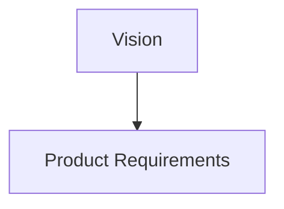

# AI Engineering Operating System

## AEOS — Document Standard

*The permanent statement of how AEOS documentation is written, structured, reviewed, and frozen.*

| Field | Value |
| :--- | :--- |
| **Document** | Document Standard |
| **Product** | AI Engineering Operating System (AEOS) |
| **Document ID** | AEOS-DOCSTD |
| **Version** | 3.0.0 |
| **Status** | Freeze candidate — awaiting owner approval |
| **Owner** | Product Owner, AEOS |
| **Author** | Documentation Governance Board, AEOS |
| **Audience** | AI systems, contributors, maintainers, reviewers, and documentation authors |
| **Suggested path** | `docs/product/DOCUMENT_STANDARD.md` |
| **Companion documents** | `AEOS_VISION.md` (AEOS-VISION) · `AEOS_PRODUCT_REQUIREMENTS.md` (AEOS-PRD) · `AEOS_GLOSSARY.md` (AEOS-GLOSSARY) · `AEOS_SUPPORTED_TECHNOLOGIES.md` (AEOS-TECH) |
| **Supersedes** | AEOS-DOCSTD 2.0.0 |

> **Authority of this document.**
> This document defines *how* AEOS documentation is written. It is normative for the **form,
> structure, language, ownership, and lifecycle** of every AEOS document.
> It defines no product requirement, no terminology, no architecture, no runtime behavior, and no
> implementation. Where this document and a document of higher authority both speak to a subject,
> the higher-authority document governs and any conflict here is a defect to be reported.

> The key words **MUST**, **MUST NOT**, **SHOULD**, **SHOULD NOT**, and **MAY** in this document are
> to be interpreted as described in RFC 2119 and RFC 8174, and carry their normative meaning only
> when they appear in all capitals.

---

## Table of Contents

1. [Executive Summary](#1-executive-summary)
2. [Scope and Applicability](#2-scope-and-applicability)
3. [Documentation Principles](#3-documentation-principles)
4. [Documentation Hierarchy](#4-documentation-hierarchy)
5. [Document Responsibilities](#5-document-responsibilities)
6. [Writing Style](#6-writing-style)
7. [Normative Language](#7-normative-language)
8. [Documentation Format Standard](#8-documentation-format-standard)
9. [AI Readability](#9-ai-readability)
10. [Human Readability](#10-human-readability)
11. [Source of Truth Rules](#11-source-of-truth-rules)
12. [Review and Freeze](#12-review-and-freeze)
13. [Future Evolution](#13-future-evolution)
14. [Document Governance](#14-document-governance)
15. [Appendix A — Recommended Document Template](#appendix-a--recommended-document-template)
16. [Appendix B — Recommended Section Ordering](#appendix-b--recommended-section-ordering)

---

## 1. Executive Summary

AEOS states that the repository is the product. A repository is the product only if what it contains
can be read, trusted, and acted upon by whoever arrives next — a contributor who was not present for
the reasoning, a maintainer years later, or an AI runtime that has no memory of the conversation in
which a decision was made. Documentation is the medium through which that happens. It is therefore
not a description of the engineering work. It is part of it.

Consistency is what makes documentation usable at that scale. A reader who must re-learn how a
project expresses itself in every new document cannot read quickly, cannot compare reliably, and
cannot tell a deliberate difference from an accidental one. For an AI runtime the cost is sharper:
an unstated convention is not a convention, and inconsistent structure becomes an invitation to
guess. Inconsistency does not merely look untidy — it silently reduces the accuracy of every
participant that depends on the repository.

Four properties make documentation consistency a first-class engineering concern in AEOS.

| Property | Why it is engineering, not presentation |
| :--- | :--- |
| **Documentation is an interface** | Humans and AI runtimes both act on it. An interface with unpredictable shape is a defective interface, regardless of how well written each instance is. |
| **Documentation carries authority** | AEOS documents govern what may be built. If a reader cannot tell which document governs a subject, authority is ambiguous and decisions are made without a basis. |
| **Documentation is traced against** | Downstream documents, tests, issues, and releases reference identifiers written here and elsewhere. Traceability survives only when identifiers and structure are stable by rule rather than by habit. |
| **Documentation outlives its authors** | The correct time horizon is the life of the product. A convention that exists only in the current contributors' practice disappears with them; a convention written down does not. |

This document exists so that none of those properties depends on who happened to write a given
document. It defines the hierarchy that assigns authority, the responsibility boundaries that keep
documents from overlapping, the language rules that make statements unambiguous, the format rules
that keep documents readable by both audiences from one artifact, and the lifecycle that determines
when a document becomes binding.

It defines nothing else. A documentation standard that also decided product behavior, terminology,
or architecture would be committing the exact error it exists to prevent.

---

## 2. Scope and Applicability

### 2.1 What This Document Governs

This Standard governs the form of AEOS documentation:

- the hierarchy of documents and the authority each layer carries;
- the responsibility boundary of each document;
- the language, tone, and normative vocabulary used in documents;
- the permitted document format and the constructs documents are written with;
- the conventions that make documents readable by humans and consumable by AI runtimes;
- the rules by which documents reference one another;
- the lifecycle from draft to freeze, and what a freeze means.

### 2.2 What This Document Does Not Govern

| Not governed here | Owned by |
| :--- | :--- |
| Why AEOS exists, and what must never change about it | AEOS-VISION |
| What AEOS is and what it must do | AEOS-PRD |
| What AEOS terms mean | AEOS-GLOSSARY |
| How AEOS is structured | Architecture documents |
| How defined behavior works precisely | Specification documents |
| How AEOS executes and in what environment | Runtime documents |
| What code realizes the product | The codebase and its tests |

A statement in this document that grants a capability, imposes a product requirement, defines a
term, or implies a structure is a **defect in this document**. It MUST be reported rather than acted
upon.

### 2.3 Applicability in Time

This Standard applies to every AEOS document created or revised after this Standard is frozen.

Documents frozen before this Standard was frozen — including AEOS-VISION, AEOS-PRD, and
AEOS-GLOSSARY — remain valid and authoritative exactly as written. This Standard does not
retroactively invalidate them, does not require their reformatting, and does not constitute a
revision request against them. Where such a document diverges from this Standard, the divergence is
recorded as a Minor finding and is reconciled only through that document's own change control, at
the owner's discretion.

### 2.4 Applicability to Authors

This Standard applies identically to human and AI authors. Where a rule is stated for "the author",
it binds whichever kind of participant produced the text. An AI runtime generating an AEOS document
MUST comply with this Standard; a contributor accepting AI-generated documentation into the
repository is responsible for that compliance.

---

## 3. Documentation Principles

These principles constrain every AEOS document. A document that violates one is defective, not
merely unconventional. Each principle carries a stable identifier so that reviews, issues, and
future documents can reference it precisely.

| ID | Principle |
| :--- | :--- |
| `DS-P-01` | Documentation is a Repository Asset. |
| `DS-P-02` | Documentation is version-controlled and reviewed like code. |
| `DS-P-03` | Documentation is engineering, not decoration. |
| `DS-P-04` | Documentation is reviewed before freeze. |
| `DS-P-05` | Documentation remains implementation-independent unless its layer requires otherwise. |
| `DS-P-06` | One document owns one responsibility. |
| `DS-P-07` | Definitions are never duplicated. |
| `DS-P-08` | Sources of truth never conflict. |
| `DS-P-09` | One artifact serves two audiences. |
| `DS-P-10` | An incomplete document is not published. |
| `DS-P-11` | Every document states its own authority. |
| `DS-P-12` | Documentation is written to age well. |

### DS-P-01 — Documentation is a Repository Asset

Documentation lives in the repository, beside the material it describes. It is durable, versioned,
inspectable, consumable, portable, and extensible in the same sense as every other Repository Asset.

Documentation that exists only in a chat session, an issue thread, a wiki outside the repository, a
vendor account, or an individual's notes is not AEOS documentation. It MAY be a useful working
artifact; it carries no authority and MUST NOT be referenced as though it did.

### DS-P-02 — Documentation is version-controlled and reviewed like code

Every documentation change enters the repository through the project's ordinary history and review.
Documents MUST be diffable: authors write in a form where a meaningful change produces a meaningful
diff.

Practically, this means one sentence per line is permitted but not required; what is required is
that reflowing, reformatting, and renumbering are avoided in changes whose purpose is substantive,
so that reviewers can see what actually changed. Formatting-only changes SHOULD be submitted
separately from substantive ones.

### DS-P-03 — Documentation is engineering, not decoration

A document is an engineering artifact subject to the same standard of truth as code: it states what
is so, distinguishes what is decided from what is proposed, and is wrong when it does not match
reality.

Consequences: documentation is not written to persuade, not written to impress, and not written to
fill a section that a template implied should exist. Structure serves comprehension. A section with
nothing to say is removed, not padded.

### DS-P-04 — Documentation is reviewed before freeze

No document becomes authoritative without review. Review classifies findings, identifies
inconsistencies, and does not redesign the document under review.

A document MUST NOT be frozen while any Critical or Major finding remains open. See
[Section 12](#12-review-and-freeze).

### DS-P-05 — Documentation remains implementation-independent unless its layer requires otherwise

Each layer of the hierarchy has a permitted depth. A document MUST NOT reach below its own layer.

Higher-layer documents (Vision, Product Requirements, Glossary, this Standard) state outcomes,
intent, meaning, and form — never mechanism. Lower-layer documents (Specification, Implementation
Guides, Developer Guides) are expected to be concrete, and their concreteness is not a violation.

The test for a higher-layer document: if a statement can be satisfied in only one way, it is too
specific for its layer.

### DS-P-06 — One document owns one responsibility

Every document answers exactly one question about the product. A document that answers two questions
is two documents that have not yet been separated.

When a document is tempted to explain something outside its responsibility, it references the owning
document instead. Brief orienting context — a sentence establishing why the referenced concept
matters here — is permitted; restating the concept is not.

### DS-P-07 — Definitions are never duplicated

A term is defined in exactly one place: the Glossary. Other documents use the term and, where the
reader benefits, link to it. They MUST NOT restate the definition, extend it, narrow it, or offer an
alternative phrasing "for convenience".

Duplicated definitions do not stay identical. The second copy is not redundancy; it is a future
contradiction with a delayed fuse.

### DS-P-08 — Sources of truth never conflict

At any moment, exactly one document is authoritative for any given subject. Two documents making
different statements about the same subject is a defect in at least one of them, and it is resolved
at the owning document — never by a local reinterpretation in the document that discovered it.

A contributor who finds such a conflict reports it. A contributor who silently resolves it has
created a third version of the truth.

### DS-P-09 — One artifact serves two audiences

Every AEOS document is written to be intelligible to a human maintainer and consumable by an AI
runtime, from the same file. A separate machine-readable version of a document MUST NOT be created.

Two artifacts describing one subject will diverge, and the one that diverges will be the one nobody
is reading that week. Conventions serving each audience are stated in
[Section 9](#9-ai-readability) and [Section 10](#10-human-readability); they are complementary, and
where they appear to compete, the resolution is stated in [Section 10](#10-human-readability).

### DS-P-10 — An incomplete document is not published

A published AEOS document MUST NOT contain placeholders, `TODO` markers, empty sections, "to be
determined" values, lorem text, or statements that depend on information the author did not have.

Where something is undecided, the document says so as a finished statement: what is undecided, who
decides it, and what the document does in the meantime. That is a complete sentence about an
incomplete decision, which is acceptable. An unfinished section is not.

### DS-P-11 — Every document states its own authority

Every AEOS document opens with a metadata block and an authority statement declaring what it
governs, what it does not govern, and which document wins in a conflict.

A reader MUST be able to determine a document's authority without reading the document, and without
consulting a person.

### DS-P-12 — Documentation is written to age well

Documents are written for readers who will arrive years later with no context. Wording is timeless:
no "currently", "recently", "new", "modern", "for now", no references to what is fashionable, and no
dates embedded in prose where a governance record would serve.

Where a statement is true only of a moment, it belongs in a revision history, a decision record, or
a lower layer that is expected to change — not in a document intended to be frozen.

---

## 4. Documentation Hierarchy

### 4.1 The Hierarchy

The hierarchy assigns **authority**. A document may constrain documents below it and MUST NOT
contradict documents above it.

```text
        AEOS-VISION            Why the product exists
              |
              v
        AEOS-PRD               What the product is and must do
              |
              v
        AEOS-GLOSSARY          What the terms mean
              |
              v
        AEOS-DOCSTD            How documentation is written
              |
              v
        AEOS-TECH              What technologies the project recognizes
              |
              v
        ARCHITECTURE           How the product is structured
              |
              v
        BLUEPRINT              How the structure is arranged to be built
              |
              v
        SPECIFICATION          How each behavior must work, precisely
              |
              v
        IMPLEMENTATION GUIDES  How the specified behavior is realized
              |
              v
        DEVELOPER GUIDES       How a person works within the result
```

The same relationships, stated without the diagram: Vision governs Product Requirements; Product
Requirements governs Glossary, Document Standard, Technology Catalog, Architecture, Blueprint,
Specification, Implementation Guides, and Developer Guides; each remaining layer governs every layer
below it in the order listed.

### 4.2 Two Kinds of Layer

Three layers are **foundational**: they do not derive behavior from the layer above and are not
derived from by the layer below. They serve every layer at once.

| Layer | Kind | Relationship to the rest |
| :--- | :--- | :--- |
| AEOS-VISION | Foundational | Constrains what may be proposed anywhere. Derives from nothing. |
| AEOS-PRD | Derivative and governing | Derives intent from the Vision; governs behavior for everything below. |
| AEOS-GLOSSARY | Foundational | Supplies meaning to every layer, including the layers above it in change-control weight. |
| AEOS-DOCSTD | Foundational | Supplies form to every layer. Carries no authority over content at any layer. |
| All remaining layers | Derivative | Each derives from the layer above and traces to `PR-` requirement identifiers. |

> **On position in the diagram.**
> The Glossary and this Standard appear beneath the PRD because they carry the same
> change-control weight as the documents above them and are governed by the same formal process —
> not because terminology or documentation form is derived from product requirements. Their service
> is horizontal: every layer, above and below, depends on them.

### 4.3 Purpose of Each Layer

#### Vision — AEOS-VISION

**Answers:** Why does AEOS exist, and what must it always remain?

**Contains:** vision, mission, philosophy, design values, non-goals, contributor principles,
invariants.

**Stability:** highest. A change here is a change of purpose.

**Does not contain:** requirements, capabilities, terminology definitions, structure, mechanism.

#### Product Requirements — AEOS-PRD

**Answers:** What is AEOS, who is it for, and what must it do for them?

**Contains:** capabilities, numbered requirements with stable identifiers, scope, quality
attributes, success metrics, release phases.

**Stability:** high. Requirements are added, refined, and retired under change control; identifiers
are permanent.

**Does not contain:** reasoning that belongs to the Vision, term definitions that belong to the
Glossary, or any statement of structure or mechanism.

#### Glossary — AEOS-GLOSSARY

**Answers:** What does each AEOS term mean?

**Contains:** the single authoritative definition of every term used across AEOS documentation.

**Stability:** high. Terminology drift is a defect; a redefinition is a governance event.

**Does not contain:** requirements, rationale beyond what the definition needs, structure, or
behavior.

#### Document Standard — AEOS-DOCSTD (this document)

**Answers:** How is AEOS documentation written, structured, reviewed, and frozen?

**Contains:** documentation principles, hierarchy, responsibility boundaries, writing style,
normative vocabulary, format rules, readability conventions, source-of-truth rules, lifecycle.

**Stability:** high. It is the shape every other document takes.

**Does not contain:** anything about the product itself.

#### Technology Catalog — AEOS-TECH

The Technology Catalog is represented by the document `AEOS_SUPPORTED_TECHNOLOGIES.md`, which serves
as the authoritative technology governance document within AEOS.

**Answers:** Which technologies, runtimes, and tooling does the project recognize, and what is the
recorded status of each?

**Contains:** an inventory of the technologies the project recognizes, the recorded status of each,
and the reasoning attached to that status. The statuses themselves, and the process by which they
change, are defined by that document and are not restated here.

**Stability:** moderate. The technology landscape changes; the catalog is expected to record that.

**Does not contain:** structure, behavior, or requirements. Presence in the catalog records
recognition only. Consistent with the product's independence commitments, inclusion confers no
privilege and absence implies no exclusion, and the catalog MUST NOT be written in a way that ranks
or endorses a vendor.

#### Architecture

**Answers:** How is AEOS structured so that it can deliver the product?

**Contains:** structural decisions, boundaries, responsibilities of parts, and the reasoning behind
them, each traced to `PR-` identifiers.

**Stability:** moderate. Architecture may evolve under its own governance without touching the
layers above it.

**Does not contain:** product requirements, terminology, precise behavioral rules, or code.

#### Blueprint

**Answers:** How is the architecture arranged so that it can actually be built?

**Contains:** the buildable arrangement of what the Architecture established — decomposition,
relationships, and boundaries at the level of detail a specification can be written against.

**Stability:** moderate.

**Does not contain:** the structural decisions themselves, which belong to Architecture, nor the
precise behavioral rules, which belong to Specification.

#### Specification

**Answers:** How must each defined behavior work, precisely and testably?

**Contains:** normative behavioral rules, inputs and outputs, states, error conditions, and
acceptance criteria, each traced to `PR-` identifiers.

**Stability:** moderate. Specifications evolve as behavior is refined.

**Does not contain:** rationale that belongs above it, or code.

#### Implementation Guides

**Answers:** How is the specified behavior realized?

**Contains:** concrete guidance for building to specification, including technology-specific detail.

**Stability:** low by design. This layer is expected to change most often.

**Does not contain:** anything that changes what must be built, which belongs to Specification or
above.

#### Developer Guides

**Answers:** How does a person work within the result?

**Contains:** task-oriented instruction for contributors and users — setup, workflow, conventions in
practice, troubleshooting.

**Stability:** low by design.

**Does not contain:** authority. A guide describes; it never decides. Where a guide and a governing
document disagree, the governing document is correct and the guide is defective.

### 4.4 Hierarchy Rules

| # | Rule |
| :--- | :--- |
| H1 | A document MUST NOT contradict any document above it in the hierarchy. |
| H2 | A document MUST NOT weaken, reinterpret, or quietly widen a statement made above it. |
| H3 | A document MUST NOT assume the responsibility of another document at any layer. |
| H4 | Every derivative document MUST trace its content to the layer above, and ultimately to `PR-` requirement identifiers. |
| H5 | Introducing a new document layer is a change to the hierarchy and requires the governance described in [Section 14](#14-document-governance). |
| H6 | A document that belongs to no layer MUST NOT be published as AEOS documentation. |
| H7 | The hierarchy describes authority, not reading order. A reader MAY enter at any layer; a document MUST make its position explicit so that entry point does not matter. |

### 4.5 Unassigned Layer

> **On Runtime documents.**
> AEOS-PRD names a Runtime layer among the layers to which it defers. This Standard does not assign
> that layer a position in the documentation hierarchy, because assigning it is a hierarchy decision
> reserved to the owner under rule H5.
> Until the owner decides, a Runtime document is written to the responsibility boundary AEOS-PRD
> states for it, and complies with every rule in this Standard that does not depend on hierarchy
> position. Placing the layer in [Section 4.1](#41-the-hierarchy) is a Major change under
> [Section 14.2](#142-change-control).

---

## 5. Document Responsibilities

### 5.1 The Responsibility Table

| Document | Owns | Answers | MUST NOT contain |
| :--- | :--- | :--- | :--- |
| **Vision** | Purpose and enduring intent | WHY | Requirements, definitions, structure, rules, mechanism |
| **Product Requirements** | Product definition and obligations | WHAT | Rationale owned by Vision, definitions owned by Glossary, structure, mechanism |
| **Glossary** | Terminology | TERMS | Requirements, structure, rules, guidance |
| **Document Standard** | Documentation form and lifecycle | HOW DOCUMENTS ARE WRITTEN | Anything about the product itself |
| **Technology Catalog** | Recognized technologies and their status | WHAT IS RECOGNIZED | Structure, behavior, requirements, endorsement |
| **Architecture** | Structure and structural reasoning | STRUCTURE | Requirements, definitions, precise behavioral rules, code |
| **Blueprint** | Buildable arrangement of the structure | ARRANGEMENT | Structural decisions, behavioral rules, code |
| **Specification** | Precise, testable behavioral rules | RULES | Rationale owned above, structural decisions, code |
| **Implementation Guides** | Realization guidance | HOW | Anything that changes what must be built |
| **Developer Guides** | Task-oriented instruction | HOW TO WORK | Authority over any governed subject |

### 5.2 The Ownership Rule

> **No document may take responsibility belonging to another document.**

This rule has no exceptions and no "for readability" allowance. The two common violations are worth
naming because both feel helpful at the moment they are committed:

| Violation | What it looks like | Correct form |
| :--- | :--- | :--- |
| **Convenience restatement** | A document repeats a definition, requirement, or decision owned elsewhere "so the reader does not have to look it up". | Reference the owning document. If the reference is hard to follow, improve the reference — not by copying the content. |
| **Anticipatory detail** | A higher-layer document specifies mechanism because the author already knows how it will be built. | State the outcome at this layer. Record the mechanism in the layer that owns it, once that layer exists. |

### 5.3 The Responsibility Test

Before a paragraph is added to a document, its author applies one test:

> **Which question does this paragraph answer?**
> If the answer is not the question the document owns, the paragraph belongs in a different
> document — however true, useful, or well written it is.

A paragraph that fails this test and cannot be relocated because the owning document does not exist
yet is recorded as a pending item in that document's future, not smuggled into this one.

---

## 6. Writing Style

### 6.1 Language

| # | Convention | In practice |
| :--- | :--- | :--- |
| S1 | **Use precise engineering language.** | Say what is so, in the fewest words that remain unambiguous. Prefer the concrete noun to the abstract one. |
| S2 | **Avoid marketing language.** | No superlatives, no "powerful", "seamless", "revolutionary", "world-class", "effortless". A claim that cannot be checked MUST NOT be made. |
| S3 | **Avoid implementation assumptions.** | Above the Specification layer, do not name a mechanism, format, library, or file layout unless the document's layer owns it. |
| S4 | **Prefer timeless wording.** | No "currently", "now", "recently", "new", "in the near future". Write as though the reader arrives in an unknown year. |
| S5 | **Prefer explicit statements.** | State the subject, the obligation, and the object. Do not rely on the reader inferring an actor from context. |
| S6 | **Avoid ambiguous terminology.** | No "simply", "just", "obviously", "should be fine", "etc." with an unbounded list, "and so on" in a normative sentence. |
| S7 | **Use one term per concept.** | Once a term is chosen, it is used everywhere. Synonyms introduced for variety are terminology drift. |
| S8 | **Prefer the active voice for obligations.** | "The author MUST state the scope" — not "the scope must be stated". Passive obligations hide who is bound. |
| S9 | **Prefer positive statements.** | State what is required. Use prohibitions where the prohibition is the point, not as a substitute for stating the rule. |
| S10 | **Expand abbreviations at first use.** | Within each document, on first appearance, unless the term is defined in the Glossary and used as a defined term. |
| S11 | **Write in the third person.** | No "we", no "I". Second person is permitted only in Developer Guides, where instruction is the purpose. |
| S12 | **Mark examples as non-normative.** | An example illustrates a rule; it never extends one. Where confusion is possible, label the example explicitly. |

### 6.2 Construction

- Paragraphs SHOULD carry one idea and SHOULD NOT exceed roughly six lines of rendered text.
- Sentences SHOULD state one obligation. A sentence containing two normative keywords SHOULD be split.
- Headings MUST describe content, not tone. "Constraints on approval" — not "The hard part".
- Lists are used for enumerable items. Prose is used for reasoning. A list of full paragraphs is prose that has been formatted as a list.
- Tables are used where items share a shape and the reader compares across them. A table with one populated column is a list.
- Numbers, ranges, and counts stated in a document MUST match the material they describe. Where a count would drift, the document states the rule instead of the count.

### 6.3 Tone

AEOS documents are written plainly and without persuasion. The reader is assumed to be competent,
short of time, and possibly hostile to the idea being described — which is the correct audience to
write for, because a document that survives that reader survives everyone.

Humor, informality, rhetorical questions, and direct address are absent from every layer above
Developer Guides.

---

## 7. Normative Language

### 7.1 Adoption

AEOS adopts the key words of RFC 2119, interpreted as described in RFC 8174: the keywords carry
their normative meaning **only when they appear in all capitals**. The same words in lower case
carry their ordinary English meaning and impose nothing.

### 7.2 The AEOS Keyword Set

| Keyword | Meaning | Consequence of non-compliance |
| :--- | :--- | :--- |
| **MUST** | An absolute requirement. There is no permitted circumstance in which the behavior is omitted. | Non-compliance is a defect. The artifact is not conformant. |
| **MUST NOT** | An absolute prohibition. | Non-compliance is a defect. The artifact is not conformant. |
| **SHOULD** | A strong recommendation. Valid reasons to deviate may exist and MUST be understood and weighed before deviating. | Deviation is permitted, MUST be deliberate, and SHOULD be recorded where a reader would otherwise assume an error. |
| **SHOULD NOT** | A strong recommendation against. Valid reasons to proceed may exist and MUST be weighed. | As above. |
| **MAY** | An optional item. The choice is free and carries no preferred direction. | None. An implementation that omits it and one that includes it are equally conformant. |

The remaining RFC 2119 keywords — `REQUIRED`, `SHALL`, `SHALL NOT`, `RECOMMENDED`,
`NOT RECOMMENDED`, `OPTIONAL` — are recognized as synonyms of the five above. AEOS documents SHOULD
use only the five, so that readers and AI runtimes match against a small, fixed vocabulary.

### 7.3 Where Normative Language Is Used

| Layer | Normative language | Reason |
| :--- | :--- | :--- |
| Vision | MUST NOT be used | The Vision imposes no requirement. Normative keywords there would create obligations the document has no authority to create. |
| Product Requirements | MAY be used | Requirements are already binding by virtue of being requirements with identifiers. |
| Glossary | SHOULD NOT be used | A definition states meaning, not obligation. |
| Document Standard | MUST be used for its rules | This document binds the form of every other document, and the strength of each rule must be unambiguous. |
| Technology Catalog | SHOULD NOT be used | The catalog records status; it does not oblige. |
| Architecture | MAY be used | Structural constraints are sometimes binding on lower layers; where they are, keywords make it explicit. |
| Blueprint | MAY be used | As above. |
| Specification | MUST be used | A specification exists to state testable obligations. A specification sentence without a keyword states nothing enforceable. |
| Implementation Guides | MAY be used | Guidance is mostly descriptive; obligations inherited from Specification are referenced, not restated. |
| Developer Guides | SHOULD NOT be used | Guides instruct. Obligations belong to the documents that own them. |

### 7.4 Rules of Use

1. A normative statement MUST identify the party bound by it. "The author MUST", "A conformant document MUST" — never an unattached "It must be ensured".
2. A normative statement MUST be independently checkable. If no reviewer could determine compliance, the statement is not normative; it is an aspiration and MUST be reworded.
3. A normative statement MUST NOT contain more than one obligation. Compound obligations are split.
4. A normative statement MUST NOT be placed inside an example, a note, or a parenthetical.
5. Keywords MUST NOT be emphasized with bold or italics in running text; capitalization is the marker.
6. A document that uses normative keywords MUST include the conformance notice in [Section 7.5](#75-required-conformance-notice).

### 7.5 Required Conformance Notice

Every document that uses normative keywords MUST include the following notice, verbatim, in its
opening material:

> The key words **MUST**, **MUST NOT**, **SHOULD**, **SHOULD NOT**, and **MAY** in this document are
> to be interpreted as described in RFC 2119 and RFC 8174, and carry their normative meaning only
> when they appear in all capitals.

---

## 8. Documentation Format Standard

### 8.1 The Format

AEOS documentation is written in **GitHub-Flavored Markdown (GFM) First** form. Human readability
takes priority, and AI readability is achieved through standard Markdown structure rather than
through markup: headings, lists, tables, and fenced blocks are the structure, and they are equally
legible to a person reading rendered output, a person reading raw text, and a runtime parsing the
file.

GitHub-Flavored Markdown (GFM), as defined by GitHub, is the official documentation format of AEOS.
Adopting a published format specification is not a platform dependency: the format is plain text,
its constructs carry their meaning without a renderer, and a document written to it remains usable
wherever Markdown is read.

| # | Rule |
| :--- | :--- |
| F1 | Every AEOS document MUST be a Markdown file with the `.md` extension. |
| F2 | *Retired in 2.0.0.* Previously required semantic HTML inside Markdown for human-oriented documents. Replaced by F12 and F13 under the GFM-First policy. |
| F3 | A document MUST render correctly without any external asset, stylesheet, or script. |
| F4 | A document MUST remain meaningful as plain text when no renderer is present. |
| F5 | *Retired in 2.0.0.* Previously permitted HTML wherever Markdown could not express the structure, without further constraint. Replaced by F13 and the exception procedure in [Section 8.3](#83-raw-html). |
| F12 | GitHub-Flavored Markdown, as defined by GitHub, is the official AEOS documentation format. Documents MUST use standard Markdown constructs wherever a standard construct expresses the required structure. |
| F13 | Raw HTML is prohibited unless Markdown cannot express the required structure. A normal AEOS document contains no HTML tags. |
| F14 | A document MUST render cleanly in the environments listed in [Section 8.5](#85-rendering-targets) without requiring HTML rendering. |
| F15 | Markdown tables are the preferred table format and MUST be used for tabular content. |
| F16 | Mermaid remains officially supported and MUST be expressed as a fenced `mermaid` block. |

> **Transition.** Documents frozen under version 1.0.0 of this Standard remain valid and
> authoritative exactly as written. Their HTML construction is recorded as a Minor finding and is
> reconciled only through each document's own change control, at the owner's discretion. A document
> created or revised after this version is frozen MUST comply with the rules above.

### 8.2 Standard Markdown Constructs

The following constructs are the vocabulary of AEOS documentation. An author who reaches for
anything else first checks whether one of these expresses the intent.

| Construct | Use |
| :--- | :--- |
| Headings (`#`, `##`, `###`) | Document and section structure. Levels descend by one and are never skipped. |
| Ordered and unordered lists | Enumerable items, steps, and bounded sets. |
| Tables | Comparative or multi-column content, including all rule tables. |
| Fenced code blocks | Literals, file skeletons, command examples, and diagrams that are not Mermaid. Every fence declares a language, or `text` where none applies. |
| Blockquotes | Authority statements, reading rules, and passages a reader must not skim past. |
| Task lists | Checklists a reader executes, such as review or freeze checklists. |
| Footnotes | Brief non-normative asides that would otherwise interrupt a sentence. |
| Inline code | Identifiers, file names, literal values, and keywords quoted as text. |
| Emphasis (`**bold**`, `*italic*`) | Marking a defined term, a rule name, or a label. Never used to carry meaning on its own. |
| Links | Internal section references and references to other documents. |
| Horizontal rules (`---`) | Separating major sections. |
| Mermaid blocks | Diagrams, expressed as a fenced `mermaid` block. |

The vocabulary above changes only under rule E9 in [Section 13.2](#132-rules-of-evolution).

A Mermaid diagram is written as a fenced block, so that a renderer without Mermaid support displays
readable source rather than a broken element. The following is a non-normative illustration of the
fence:

````text

````

Two constraints apply to the constructs above:

- Task lists MUST NOT be used to track unfinished work inside a document, which `DS-P-10` prohibits. They record steps a reader performs, not work an author has left undone.
- Footnotes MUST NOT carry normative statements, which rule 4 of [Section 7.4](#74-rules-of-use) already prohibits for notes generally.

### 8.3 Raw HTML

Raw HTML is prohibited in AEOS documentation unless Markdown cannot express the required structure.
Normal AEOS documents contain no HTML tags at all.

| # | Rule |
| :--- | :--- |
| F6 | Documents MUST NOT be standalone HTML pages. |
| F7 | Documents MUST NOT be wrapped in `<html>`, `<head>`, or `<body>`. |
| F8 | Documents MUST NOT use CSS, including `<style>` elements and `style` attributes. |
| F9 | Documents MUST NOT use JavaScript or any `<script>` element. |
| F10 | *Retired in 2.0.0.* Previously constrained which HTML attributes could be relied upon. Made moot by F13. |
| F11 | Documents MUST NOT convey meaning through visual formatting alone. |
| F17 | Where an author judges that Markdown cannot express a required structure, the HTML exception MUST be raised as a proposed revision to this Standard rather than introduced in a document. |

The reasoning behind the prohibitions is unchanged from version 1.0.0: a page is not a Repository
Asset that diffs, reviews, and reads as text; a document is a fragment inside a rendering context it
does not own; presentation is not portable and is stripped by renderers, so meaning carried by
styling is meaning lost; documentation does not execute, and executable documentation is an
unreviewable attack surface; and a reader consuming raw source, or an AI runtime, receives none of
what visual formatting alone conveys.

> **On collapsible disclosure.** Collapsible blocks are the structure most often cited as
> inexpressible in Markdown. They are not required by this Standard, and progressive disclosure is
> achieved instead through heading hierarchy and summary-before-detail ordering, as stated in
> [Section 10](#10-human-readability). An author who still judges collapsibility necessary follows
> F17.

### 8.4 Practical Conventions

- Table header cells SHOULD declare left alignment unless the column contains only short numeric values.
- Code fences MUST declare a language, or `text` where none applies.
- Every diagram MUST be accompanied by the same information stated in prose or in a table, so that no meaning exists only in the drawing. This applies to Mermaid diagrams and to diagrams drawn inside fenced blocks alike.
- Internal links SHOULD use GitHub anchor form derived from the heading text, and MUST be verified to resolve before freeze.
- Line length SHOULD be kept moderate so that raw text remains readable without horizontal scrolling. Table rows are exempt, because a table row cannot be wrapped.
- Blank lines separate every block-level construct, so that renderers with differing Markdown implementations produce the same structure.

### 8.5 Rendering Targets

A conformant AEOS document MUST render cleanly, without requiring HTML rendering, in each of the
following environments:

| Environment | Kind |
| :--- | :--- |
| GitHub | Repository rendering and review |
| VS Code | Editor preview and raw editing |
| Cursor | Editor preview and raw editing |
| Claude | AI consumption and rendered display |
| ChatGPT | AI consumption and rendered display |

Naming these environments records rendering targets only. Consistent with the product's
independence commitments, inclusion confers no privilege, absence implies no exclusion, and no
statement here endorses a vendor or ranks one environment above another. An environment is listed
because AEOS documentation is read there; a document that renders cleanly in all of them renders
cleanly in any conventional Markdown reader.

### 8.6 Objective

> The objective of the GFM-First standard is to make one artifact readable by a human, legible as
> raw text, diffable in review, and parseable by an AI runtime, in every environment where AEOS
> documentation is read. Standard Markdown structure is what delivers all four at once. HTML is
> permitted only where Markdown cannot express the structure, and is never used to style, to
> decorate, or to produce a page.

---

## 9. AI Readability

AI runtimes are first-class readers of AEOS documentation. AI readability is achieved through
standard Markdown structure, not through markup: the conventions below exist so that a runtime can
determine what a document says, what it governs, and what it requires — without inference and
without a machine-only version of the document.

| # | Convention | In practice |
| :--- | :--- | :--- |
| A1 | **Clear headings.** | Every heading describes the content beneath it, is unique within the document, and is stable across revisions. Heading levels descend by one; a level is never skipped. |
| A2 | **Predictable hierarchy.** | Documents of the same layer share section order ([Appendix B](#appendix-b--recommended-section-ordering)), so position carries information. |
| A3 | **Stable terminology.** | One term per concept, matching the Glossary exactly, including capitalization. |
| A4 | **Short paragraphs.** | One idea per paragraph, so that a passage can be extracted without carrying an unrelated claim with it. |
| A5 | **Explicit ownership.** | Every document states what it governs and what it does not. Every normative statement names the bound party. |
| A6 | **No hidden assumptions.** | Preconditions, scope limits, and exclusions are written, not implied by placement or by omission. |
| A7 | **Self-contained statements.** | A normative statement does not depend on a pronoun resolved three sentences earlier, or on the heading above it, to be understood. |
| A8 | **Stable identifiers.** | Identifiers are assigned once and never reused, renumbered, or repurposed. A retired item is marked retired in place. |
| A9 | **Consistent structural markers.** | The same construct is always expressed the same way: rules in Markdown tables with identifiers, supporting detail beneath its own heading, authority in blockquotes. |
| A10 | **No meaning in presentation.** | Colour, alignment, ordering by visual weight, and typographic emphasis carry no information that is not also stated. |
| A11 | **Explicit references.** | A reference names the document by identifier and the section or item by its identifier — never "as described above" or "see the other document". |
| A12 | **Bounded enumerations.** | A list that is complete says so. A list that is illustrative says so. An unmarked list is read as complete and MUST therefore be complete. |

> **On structure as the only signal.** A runtime receives the document as text. Headings, list
> markers, table pipes, and fences are the entire structural signal available to it, which is why
> [Section 8](#8-documentation-format-standard) requires standard constructs rather than markup that
> only some renderers interpret.

---

## 10. Human Readability

Human readers arrive with a specific question, limited time, and no obligation to read from the
beginning. These conventions serve that reader without costing the other audience anything.

| # | Convention | In practice |
| :--- | :--- | :--- |
| R1 | **Summaries before detail.** | Every document opens with material that lets a reader decide whether to continue. Every long section opens with its conclusion, not its derivation. |
| R2 | **Progressive disclosure.** | Supporting depth is placed beneath its own heading, after a summary that states what the reader will find there, so the document can be scanned by heading before any section is read in full. |
| R3 | **Consistent section order.** | A reader who knows one AEOS document knows where to look in the next one. |
| R4 | **Tables where appropriate.** | Comparable items go in Markdown tables. The reader should not have to hold four paragraphs in memory to compare four things. |
| R5 | **A table of contents.** | Required for any document with more than five top-level sections, with working internal links. |
| R6 | **Scannable structure.** | Meaningful headings, short paragraphs, and no section so long that a reader loses the thread before its point arrives. |
| R7 | **Stated authority up front.** | The reader learns what the document governs before learning what it says. |
| R8 | **Reasons alongside rules.** | Where a rule is likely to be argued with, its reason is given once, briefly. A rule whose reason nobody recorded is a rule someone will eventually remove. |
| R9 | **Examples over abstraction.** | Where a rule is easy to misapply, one concrete example is given and marked non-normative. |
| R10 | **No dead ends.** | Where a document declines to cover something, it names the document that does. |

### Resolving Apparent Conflicts Between the Two Audiences

The two audiences rarely conflict, because both are served by explicitness. Where they appear to,
the resolution is fixed:

> **Serve comprehension first, and never at the cost of completeness.**
> A convention that makes a document pleasant to read while removing information — hiding something
> a reader must see, replacing a statement with a diagram, implying scope through layout — is not a
> readability improvement. It is a defect that happens to look tidy.

---

## 11. Source of Truth Rules

### 11.1 Ownership

| # | Rule |
| :--- | :--- |
| T1 | Every concept has exactly one owning document. |
| T2 | A document that does not own a concept MUST reference it rather than define, restate, extend, or narrow it. |
| T3 | Terminology is owned by the Glossary without exception. A document MUST NOT define a term locally, including in a "terms used here" section. |
| T4 | Ownership is stated by the owning document, in its authority statement. |
| T5 | Where ownership of a concept is unclear, the ambiguity is a defect and MUST be resolved by the owner before any document relies on that concept. |

### 11.2 Referencing

A reference MUST identify the owning document and the referenced item precisely enough that a reader
can find it without searching.

| Reference to | Form |
| :--- | :--- |
| A document | Document ID, optionally with the file name — for example, AEOS-PRD. |
| A requirement | Document ID and requirement identifier — for example, AEOS-PRD `PR-SAF-003`. |
| A section | Document ID and section number and title. |
| A term | The term itself, spelled as the Glossary spells it, linked to the Glossary where the link is useful. |
| A section within the same document | An internal link to the section heading. |

References MUST NOT be made by page position, by relative phrasing such as "the document above", or
by quoting a passage in place of citing it. A summary of referenced material is permitted where it
orients the reader; it MUST be brief, MUST be marked as a summary, and MUST NOT be relied upon as
the statement of record.

### 11.3 Conflict Resolution

When a contributor — human or AI — finds two documents making different statements about one
subject:

| Step | Action |
| :--- | :--- |
| 1 | Determine which document owns the subject, using [Section 5](#5-document-responsibilities). |
| 2 | Treat the owning document's statement as correct for the purpose of proceeding. |
| 3 | Report the conflict as a defect against the non-owning document. |
| 4 | Resolve the conflict at the owning document, under that document's change control. |
| 5 | Where both documents are frozen, or where ownership itself is contested, escalate to the owner. A contributor MUST NOT resolve it. |

A contributor MUST NOT resolve a conflict by editing the document they happen to be working in, by
adding a clarifying note that reconciles the two, or by choosing the statement that suits the task
in hand. Each of those produces a third version of the truth while appearing to remove one.

### 11.4 Precedence

Where documents disagree, precedence follows the hierarchy in
[Section 4](#4-documentation-hierarchy), with these fixed rules:

| Situation | Resolution |
| :--- | :--- |
| Any document conflicts with AEOS-PRD on product behavior | AEOS-PRD governs. |
| Any document conflicts with AEOS-GLOSSARY on the meaning of a term | AEOS-GLOSSARY governs. |
| Any document conflicts with this Standard on documentation form | This Standard governs. |
| This Standard appears to speak to product behavior, terminology, architecture, or runtime | The owning document governs. The statement here is a defect in this document and is reported. |
| A conflict involves AEOS-VISION | Resolved as AEOS-VISION and AEOS-PRD themselves prescribe. This Standard does not adjudicate between them. |
| Two documents at the same layer conflict | Escalate to the owner. Same-layer conflicts indicate that a responsibility boundary is wrong, not that one document is. |

---

## 12. Review and Freeze

### 12.1 Lifecycle States

| State | Meaning | Permitted changes |
| :--- | :--- | :--- |
| **Draft** | Under authorship. Not authoritative and MUST NOT be referenced as a source of truth. | Any, by the author. |
| **In Review** | Complete and submitted for review. Content is stable while findings are gathered. | None during a review pass; findings are recorded, not applied. |
| **In Revision** | Findings are being addressed by the author. | Only changes that address recorded findings. |
| **Approved** | The owner has accepted the document. No Critical or Major findings remain open. | Editorial correction only. |
| **Frozen** | Authoritative. Downstream documents may trace to it and depend on it. | Only through the document's change control. |
| **Superseded** | Replaced by a later document, which names it in its *Supersedes* field. | None. Retained for history. |

A document's current state MUST appear in its metadata block. A state transition MUST be recorded in
the document's revision history.

### 12.2 The Lifecycle

| Stage | What happens | Exit condition |
| :--- | :--- | :--- |
| **1. Draft** | The author writes the document complete: no placeholders, no unfinished sections, authority stated, responsibilities respected. | The document is complete and self-reviewed against this Standard. |
| **2. Review** | Reviewers examine the document and classify every finding. Reviewers identify inconsistencies; they MUST NOT redesign the document. | All findings recorded with classifications. |
| **3. Revision** | The author addresses findings. Each finding is resolved, declined with a recorded reason, or escalated. | No Critical or Major finding remains open. |
| **4. Approval** | The owner accepts the document. Approval is explicit; silence is not approval. | Owner approval recorded. |
| **5. Freeze** | The document is marked Frozen and becomes authoritative for its subject. | Status and revision history updated. |

Stages 2 and 3 repeat until stage 3's exit condition holds. A review pass that produces no Critical
or Major findings SHOULD conclude with a recommendation to freeze.

### 12.3 Finding Classification

| Class | Definition | Effect on freeze |
| :--- | :--- | :--- |
| **Critical** | The document contradicts a higher-authority document, takes responsibility it does not own, or states something that would cause incorrect work if acted upon. | Blocks freeze. |
| **Major** | The document is internally inconsistent, incomplete in a way that leaves a reader unable to act, or ambiguous on a point that matters. | Blocks freeze. |
| **Minor** | The document deviates from this Standard in form, structure, or wording without affecting correctness. | Does not block freeze; recorded and normally addressed. |
| **Nitpick** | A matter of preference with no effect on correctness, consistency, or comprehension. | Does not block freeze; addressed at the author's discretion. |

### 12.4 Review Conduct

- A reviewer MUST classify every finding.
- A reviewer MUST identify inconsistencies and MUST NOT rewrite or redesign the document under review.
- A reviewer MUST cite the specific location and, where the finding is a Standard violation, the specific rule identifier.
- A reviewer SHOULD state the smallest change that would resolve each finding, without imposing it.
- A reviewer who believes the document's premise is wrong records that as a single Critical finding and escalates, rather than raising it repeatedly throughout.

### 12.5 What a Freeze Means

> A frozen document is **authoritative**. Downstream documents, contributors, reviewers, and AI
> runtimes MUST treat it as correct and MUST NOT reinterpret it locally. A frozen document changes
> only through its own change control. A better idea is recorded as a recommendation for a future
> release; it is never applied silently.

A frozen document remains frozen when a downstream document discovers a problem with it. The
discovery is reported; the freeze holds until the owner acts.

---

## 13. Future Evolution

Documentation must be able to change without the hierarchy losing meaning. The arrangement that
allows this is simple: lower layers absorb change, higher layers absorb almost none, and every layer
changes through a process proportionate to what depends on it.

### 13.1 Rate of Change by Layer

| Layer | Expected rate of change | Governance |
| :--- | :--- | :--- |
| Vision | Rare — a change of purpose | Formal governance; owner decision with recorded rationale |
| Product Requirements | Controlled — requirements added, refined, retired | Formal governance; identifiers immutable |
| Glossary | Rare — terminology drift is a defect | Formal governance |
| Document Standard | Rare — it is the shape of everything else | Formal governance |
| Technology Catalog | Ongoing — the landscape changes | Ordinary review |
| Architecture | Periodic — under the architecture freeze and owner approval | Its own change control |
| Blueprint | Periodic | Its own change control |
| Specification | Ongoing as behavior is refined | Its own change control; traces to `PR-` identifiers |
| Implementation Guides | Frequent | Ordinary review |
| Developer Guides | Frequent | Ordinary review |

### 13.2 Rules of Evolution

| # | Rule |
| :--- | :--- |
| E1 | A lower layer MUST NOT be changed in a way that contradicts a higher layer. Where the lower layer is right, the higher layer is revised first, through its own governance. |
| E2 | Evolution SHOULD be additive. New material is added; existing identifiers, sections, and headings are preserved. |
| E3 | Identifiers MUST NOT be reused, renumbered, or repurposed. A retired item is marked retired in place, with its reason. |
| E4 | A heading that other documents link to SHOULD NOT be renamed. Where renaming is unavoidable, the change is recorded and dependent links are updated in the same change. |
| E5 | A new kind of document MUST be assigned to an existing layer. Where no layer fits, adding a layer is a change to this Standard and requires formal governance. |
| E6 | A change that alters what a document owns is a change to this Standard, not to the document. |
| E7 | An improvement that would alter a frozen document's concepts is recorded as a recommendation for a future release and applied only after explicit owner approval. |
| E8 | Every change to a frozen document MUST update that document's version and revision history. |
| E9 | New Markdown syntax is not adopted automatically. A construct becomes available to AEOS documentation only after it is supported by GitHub-Flavored Markdown, and only after its adoption is approved through AEOS documentation governance. |

Rule E9 governs the construct vocabulary in
[Section 8.2](#82-standard-markdown-constructs). Both conditions are required and neither
substitutes for the other: support by GitHub-Flavored Markdown establishes that a construct exists
in the adopted format, and approval establishes that AEOS documentation uses it. Until both hold, an
author writes with the constructs already listed. A proposal to add one follows the change control in
[Section 14.2](#142-change-control), where the addition of a permitted format construct is a Major
change.

### 13.3 Versioning

AEOS documents are versioned `MAJOR.MINOR.PATCH`:

| Increment | When |
| :--- | :--- |
| **Patch** | Editorial correction with no change of meaning. |
| **Minor** | Addition or clarification that does not invalidate anything already stated or depended upon. |
| **Major** | A change of meaning, a removal, or any change that invalidates a statement other documents depend on. |

Where a document defines its own change control, that document's table governs the mapping between
change type and version increment. This section states the default for documents that do not.

---

## 14. Document Governance

### 14.1 Status

This document is the **Documentation Source of Truth** for the AEOS repository. It is intended to be
frozen as part of AEOS 1.0 and to remain stable across the life of the product.

### 14.2 Change Control

| Change type | Requires | Version impact |
| :--- | :--- | :--- |
| Editorial correction with no change of meaning | Contributor change, owner acceptance | Patch |
| Clarification of an existing rule, convention, or principle | Owner approval | Minor |
| Addition of a rule, convention, principle, or permitted format construct | Explicit owner revision request | Major |
| Change to the documentation hierarchy or to a document's responsibility | Explicit owner revision request with recorded rationale | Major |
| Removal of a rule, principle, or layer | Explicit owner decision, recorded, with the reasoning preserved in place | Major |

### 14.3 Relationship to the Architecture Freeze

This document introduces no architecture and grants no capability. Ideas arising from it that would
change the product's concepts, capability set, or principles are recorded as recommendations for a
future release under the AEOS-PRD governance, and are applied only after explicit owner approval.

### 14.4 Review Policy

Reviews of this document classify findings as **Critical**, **Major**, **Minor**, or **Nitpick**,
identify inconsistencies without redesigning, and recommend freezing the document when no Critical
or Major findings remain.

### 14.5 Precedence

| Situation | Resolution |
| :--- | :--- |
| This document conflicts with AEOS-PRD on product behavior | AEOS-PRD governs. The conflict is a defect in this document and is reported. |
| This document conflicts with AEOS-GLOSSARY on the meaning of a term | AEOS-GLOSSARY governs. The conflict is a defect in this document and is reported. |
| This document conflicts with AEOS-VISION on intent | Escalate to the owner. This document has no authority over intent. |
| A downstream document deviates from this document on documentation form | This document governs. The deviation is a finding against the downstream document. |
| A frozen document predating this Standard deviates from it | The frozen document stands. The deviation is a Minor finding, reconciled only under that document's own change control. |

### 14.6 Revision History

| Version | Status | Summary |
| :--- | :--- | :--- |
| 1.0.0 | Superseded | Initial documentation standard. Established twelve documentation principles, a ten-layer documentation hierarchy with responsibility boundaries, writing style conventions, adoption of RFC 2119 normative language with a five-keyword working set, an HTML-in-Markdown format standard with permitted elements and prohibitions, AI and human readability conventions, source-of-truth and referencing rules, the draft-to-freeze lifecycle with four finding classes, evolution rules, a document template, and a recommended section ordering. Introduced no requirement, terminology, capability, or architecture. |
| 2.0.0 | Superseded | Format policy revision only. Replaced the HTML-in-Markdown policy with a GitHub-Flavored Markdown First policy: human readability takes priority, AI readability is achieved through standard Markdown structure, GFM is the official format, standard constructs are used wherever possible, raw HTML is prohibited unless Markdown cannot express the required structure, Mermaid remains officially supported, and Markdown tables are preferred. Added rules F12 to F17 and rendering targets; retired F2, F5, and F10 in place under E3. Renamed Section 8 from "HTML-in-Markdown Standard" to "Documentation Format Standard" and updated the dependent guidance in Sections 2.1, 9, 10, and both appendices. Converted the document's own construction to GFM so that the Standard conforms to itself. No principle, hierarchy, responsibility, ownership, source-of-truth rule, lifecycle rule, or governance rule was changed. |
| 3.0.0 | Freeze candidate | Governance refinements only. Bound the Technology Catalog layer to its authoritative document, `AEOS_SUPPORTED_TECHNOLOGIES.md` (AEOS-TECH), in the hierarchy diagram and in Section 4.3, and removed the status enumeration that restated content AEOS-TECH owns. Clarified F12 and Section 8.1 to state that GitHub-Flavored Markdown, as defined by GitHub, is the official documentation format of AEOS. Added evolution rule E9 governing the adoption of new Markdown syntax, referenced from Section 8.2. Renamed the Section 4.3 subheading for the Technology Catalog layer to carry its document ID, matching the convention used by the other document-bearing layers. No principle, hierarchy position, responsibility, ownership rule, source-of-truth rule, lifecycle rule, writing convention, or governance rule was changed. |

---

## Appendix A — Recommended Document Template

**A.1 is non-normative. A.2 is normative.**

### A.1 Template

The template below shows the structure a conformant AEOS document takes. Comments mark which parts
the rules in A.2 require; the remainder is adapted to the document's layer and subject.

```markdown
# AI Engineering Operating System

## AEOS — <Document Name>

*<One-line statement of what this document is.>*

| Field | Value |                          <!-- required: metadata block -->
| :--- | :--- |
| **Document** | <Document Name> |
| **Product** | AI Engineering Operating System (AEOS) |
| **Document ID** | <DOCUMENT-ID> |
| **Version** | <x.y.z> |
| **Status** | <lifecycle state> |
| **Owner** | Product Owner, AEOS |
| **Author** | <author role> |
| **Audience** | <intended readers> |
| **Suggested path** | `<path>` |
| **Companion documents** | <document IDs> |
| **Supersedes** | <document ID and version, or None> |

> **Authority of this document.**              <!-- required: authority statement -->
> What this document governs.
> What it does not govern.
> Which document wins in a conflict.

> The key words MUST, MUST NOT, SHOULD, SHOULD NOT, and MAY ...
                                               <!-- required if normative keywords are used -->

---

## Table of Contents                           <!-- required if more than five sections -->

---

## 1. Executive Summary                        <!-- required -->
Why this document exists and what a reader gains from it.

## 2. Scope and Applicability                  <!-- required -->
What is governed, what is not, and to whom and when it applies.

## 3..N. Subject Sections                      <!-- required: the document's own content -->
The document's responsibility, expressed in its layer's permitted depth.
Rules in Markdown tables with stable identifiers.
Supporting depth beneath its own heading, after a summary.

## N+1. Document Governance                    <!-- required -->
Status · Change control · Review policy · Precedence · Revision history

## Appendices                                  <!-- optional -->
Non-normative supporting material.

---

**End of <Document Name>**

<DOCUMENT-ID> · Version <x.y.z> · <Source of Truth statement>
```

### A.2 Template Rules

| # | Rule |
| :--- | :--- |
| TP1 | Every document MUST include the metadata block, the authority statement, an executive summary, a scope section, and a governance section. |
| TP2 | Every document that uses normative keywords MUST include the conformance notice. |
| TP3 | Sections MUST be numbered; appendices MUST be lettered. |
| TP4 | A section that would be empty MUST be omitted rather than filled. |
| TP5 | An appendix SHOULD be non-normative. An appendix that contains normative statements MUST be marked normative at its head, and MUST NOT introduce an obligation absent from the document body. |
| TP6 | The template MUST be realized in standard Markdown constructs, as required by [Section 8](#8-documentation-format-standard). |

---

## Appendix B — Recommended Section Ordering

**B.1 to B.3 are non-normative. B.4 is normative.**

Ordering exists so that position carries information: a reader who knows one AEOS document can find
their way through the next one without reading it.

### B.1 Universal Ordering

| # | Section | Presence |
| :--- | :--- | :--- |
| 1 | Title block | Required |
| 2 | Metadata block | Required |
| 3 | Authority statement | Required |
| 4 | Conformance notice | Required where normative keywords are used |
| 5 | Table of contents | Required above five top-level sections |
| 6 | Executive summary | Required |
| 7 | Scope and applicability | Required |
| 8 | Principles or foundational statements | Where the document has them |
| 9 | Subject sections, general before specific | Required |
| 10 | Constraints, prohibitions, and boundaries | Where the document has them |
| 11 | Lifecycle, process, or evolution | Where the document has them |
| 12 | Document governance | Required |
| 13 | Appendices | Optional |
| 14 | Closing block | Required |

### B.2 Ordering Within a Section

1. State the conclusion or the rule.
2. State its scope and any exclusions.
3. State the detail, in a table where items are comparable.
4. State the reasoning, briefly, where the rule is likely to be argued with.
5. Give one example where misapplication is likely, marked non-normative.

### B.3 Layer Variations

| Layer | Ordering emphasis |
| :--- | :--- |
| Vision | Purpose, then long-horizon intent, then convictions, then non-goals, then invariants. |
| Product Requirements | Boundary, then problem, then capabilities, then numbered requirements, then quality attributes, then phases. |
| Glossary | Terms in a single stable order, with no narrative sections between them. |
| Technology Catalog | Categories, then entries within each category, each with a recorded status. |
| Architecture and Blueprint | Context, then structure, then boundaries, then decisions with their reasoning and traces. |
| Specification | Scope, then definitions referenced, then normative rules, then error conditions, then acceptance criteria. |
| Implementation and Developer Guides | Prerequisites, then task order, then verification, then troubleshooting. |

### B.4 Ordering Rules

| # | Rule |
| :--- | :--- |
| O1 | Documents of the same layer SHOULD share section order. |
| O2 | General content MUST precede specific content within a section. |
| O3 | Normative content MUST precede non-normative supporting material. |
| O4 | Governance MUST be the final numbered section, before any appendix. |
| O5 | A document that departs from this ordering SHOULD state why in its scope section. |

---

**End of Document Standard**

AEOS-DOCSTD · Version 3.0.0 · Documentation Source of Truth
