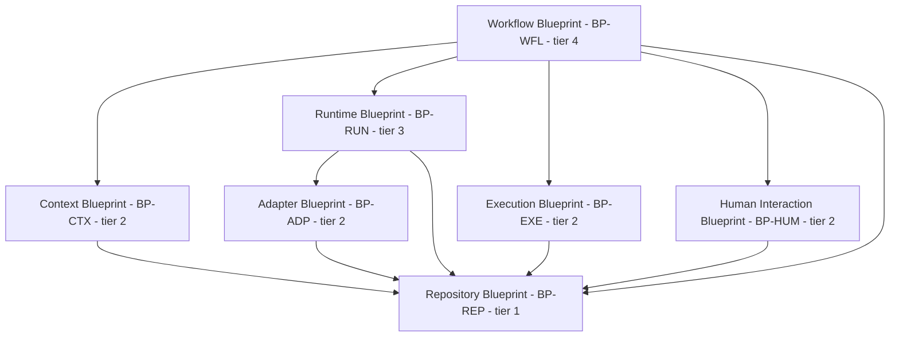
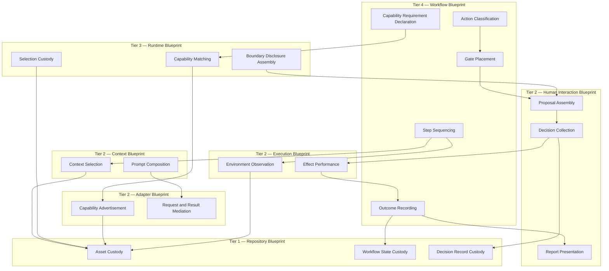

# AI Engineering Operating System

## AEOS — Blueprint

*The permanent internal structural blueprint of AEOS.*

| Field | Value |
| :--- | :--- |
| **Document** | Blueprint |
| **Product** | AI Engineering Operating System (AEOS) |
| **Document ID** | AEOS-BLUEPRINT |
| **Version** | 1.0.0 |
| **Status** | Freeze candidate |
| **Owner** | Product Owner, AEOS |
| **Author** | Chief System Architect, AEOS |
| **Audience** | Architects, specification authors, maintainers, contributors, and AI runtimes consuming this repository |
| **Suggested path** | `docs/architecture/BLUEPRINT.md` |
| **Companion documents** | `AEOS_VISION.md` (AEOS-VISION) · `AEOS_PRODUCT_REQUIREMENTS.md` (AEOS-PRD) · `AEOS_GLOSSARY.md` (AEOS-GLOSSARY) · `AEOS_DOCUMENT_STANDARD.md` (AEOS-DOCSTD) · `AEOS_SUPPORTED_TECHNOLOGIES.md` (AEOS-TECH) · `AEOS_ARCHITECTURE.md` (AEOS-ARCH) |
| **Supersedes** | None |

> **Authority of this document.**
> This document defines the **internal structural decomposition of AEOS**: the subsystems within each
> Architecture Layer, the responsibilities each subsystem holds, the boundaries between them, the
> permitted directions of collaboration, and the points at which AEOS is extended rather than
> modified.
> It defines no product behavior, no terminology, no structural decision, no specified behavior, no
> algorithm, no data structure, no interface, no runtime procedure, no technology, and no code.
> Where this document and AEOS-PRD both speak to product behavior, AEOS-PRD governs. Where this
> document and AEOS-GLOSSARY both speak to the meaning of a term, AEOS-GLOSSARY governs. Where this
> document and AEOS-ARCH both speak to a structural decision, AEOS-ARCH governs. In each case the
> conflict is a defect in this document and is reported rather than acted upon.

> The key words **MUST**, **MUST NOT**, **SHOULD**, **SHOULD NOT**, and **MAY** in this document are
> to be interpreted as described in RFC 2119 and RFC 8174, and carry their normative meaning only
> when they appear in all capitals.

---

## Table of Contents

1. [Executive Summary](#1-executive-summary)
2. [Scope and Applicability](#2-scope-and-applicability)
3. [Blueprint Principles](#3-blueprint-principles--bp-prn)
4. [Blueprint Structure](#4-blueprint-structure)
5. [Blueprint Dependency Diagram](#5-blueprint-dependency-diagram)
6. [Blueprint Rule Framework](#6-blueprint-rule-framework)
7. [Repository Blueprint](#7-repository-blueprint--bp-rep)
8. [Workflow Blueprint](#8-workflow-blueprint--bp-wfl)
9. [Context Blueprint](#9-context-blueprint--bp-ctx)
10. [Runtime Blueprint](#10-runtime-blueprint--bp-run)
11. [Adapter Blueprint](#11-adapter-blueprint--bp-adp)
12. [Execution Blueprint](#12-execution-blueprint--bp-exe)
13. [Human Interaction Blueprint](#13-human-interaction-blueprint--bp-hum)
14. [Subsystem Relationship Diagram](#14-subsystem-relationship-diagram)
15. [Blueprint Ownership Matrix](#15-blueprint-ownership-matrix)
16. [Blueprint Extension Model](#16-blueprint-extension-model--bp-ext)
17. [Blueprint and Specification Boundary](#17-blueprint-and-specification-boundary)
18. [Blueprint and Runtime Boundary](#18-blueprint-and-runtime-boundary)
19. [Blueprint Constraints](#19-blueprint-constraints--bp-gov)
20. [Document Governance](#20-document-governance)
21. [Appendix A — Blueprint Identifier Index](#appendix-a--blueprint-identifier-index)
22. [Appendix B — Traceability Summary](#appendix-b--traceability-summary)

---

## 1. Executive Summary

AEOS-ARCH establishes the Architecture Layers of AEOS and the reasoning that produced them. It
answers how AEOS is structured. It does not answer what lies inside each layer, which
responsibilities within a layer are distinct from one another, which of those responsibilities may
speak to which, or where a contributor adds capability without touching the product. Those questions
must be answered before any Specification can be written, because a specification written against an
undivided layer specifies a boundary that nobody agreed to.

This Blueprint answers them. For each Architecture Layer it states the subsystems the layer
contains, what each subsystem is responsible for, what each owns, what each depends on in both
directions, and where each admits extension. It then states the arrangement rules that hold the
decomposition together: a single permitted direction of dependency, a prohibition on collaboration
between peer layers, a single point at which supervision is placed, and a single place in which
knowledge of any external system is permitted to exist.

Four properties make this a separate document rather than a longer architecture document or a
shorter specification.

| Property | Why the Blueprint layer exists |
| :--- | :--- |
| **Decomposition is not decision** | AEOS-ARCH decides that a layer exists and why. Dividing that layer into subsystems is a different act, revisable on a different schedule, and recording it separately keeps a structural decision from being re-opened every time an internal boundary moves. |
| **Boundaries precede behavior** | A Specification states what a defined behavior must do. It cannot do so until it is settled which subsystem owns that behavior. Specifications written before the boundary is fixed encode the boundary by accident. |
| **Responsibility must be attributable** | When a defect crosses two subsystems, the question is which one was wrong. That question has an answer only where ownership was recorded in advance, in one place, for the whole product. |
| **Extension must have a named seam** | AEOS is extended and not modified. A seam that is not written down is not a seam; it is a place where the next contributor will fork the product instead. |

This document defines nothing else. It states no obligation on the user, describes no observable
behavior, prescribes no mechanism, and names no technology. A statement here that does any of those
is a defect in this document, reported under [Section 20](#20-document-governance) rather than acted
upon.

---

## 2. Scope and Applicability

### 2.1 What This Document Governs

This Blueprint governs the internal arrangement of AEOS:

- the decomposition of each Architecture Layer into subsystems;
- the responsibility held by each subsystem;
- the concepts whose custody and placement each subsystem owns;
- the inbound and outbound dependencies of each subsystem and each layer;
- the permitted directions of collaboration between layers;
- the extension points at which capability is added without modifying AEOS;
- the boundary between this layer and the Specification layer below it;
- the boundary between this layer and the Runtime layer beside it.

### 2.2 What This Document Does Not Govern

| Not governed here | Owned by |
| :--- | :--- |
| Why AEOS exists and what must never change about it | AEOS-VISION |
| What AEOS is, what it must do, and what a user observes | AEOS-PRD |
| The meaning of every AEOS term | AEOS-GLOSSARY |
| The form, language, and lifecycle of AEOS documents | AEOS-DOCSTD |
| Which technologies the project recognizes and their status | AEOS-TECH |
| Which Architecture Layers exist, and the reasoning that established them | AEOS-ARCH |
| How each defined behavior must work, precisely and testably | Specification documents |
| How AEOS executes, in what environment, with what lifecycle | Runtime documents |
| How specified behavior is realized | Implementation Guides |
| What code realizes the product | The codebase and its tests |

A statement in this document that defines a term, states a product requirement, decides which
Architecture Layers exist, prescribes an algorithm, fixes a data structure, names an interface,
describes a runtime procedure, or names a technology is a **defect in this document**. It MUST be
reported rather than acted upon.

### 2.3 Conformance to Governing Documents

This document is written to conform to AEOS-VISION, AEOS-PRD, AEOS-GLOSSARY, AEOS-DOCSTD, AEOS-TECH,
and AEOS-ARCH. Conformance is asserted, not assumed, and takes a specific form in each case.

| Governing document | Form conformance takes here |
| :--- | :--- |
| AEOS-VISION | No arrangement in this document reduces what a human decides, privileges a vendor, or makes a user's practice depend on forking the product. The invariants `V1` to `V10` bound every rule below. |
| AEOS-PRD | Every Blueprint Rule traces to one or more `PR-` identifiers. No rule restates, weakens, widens, or reinterprets a product requirement. |
| AEOS-GLOSSARY | Every AEOS term is used with the meaning AEOS-GLOSSARY records. No term is defined, extended, narrowed, or given an alternative phrasing here. The terms reserved for architecture — Blueprint, Context Router, Runtime Adapter, Workflow Engine — are used as responsibilities and are never described as components, services, processes, or files. |
| AEOS-DOCSTD | Form, section ordering, normative vocabulary, identifier stability, and lifecycle follow the Standard. |
| AEOS-TECH | No technology is named. Where a subsystem's realization will require a technology, the choice is recognized by AEOS-TECH and is made below this layer. |
| AEOS-ARCH | The Architecture Layers decomposed in [Sections 7](#7-repository-blueprint--bp-rep) to [13](#13-human-interaction-blueprint--bp-hum) are those AEOS-ARCH establishes. This document divides them; it does not create, rename, merge, or retire any of them. |

Where any of those documents states something this document contradicts, that document governs, the
contradiction is a defect here, and it is resolved at the owning document under
[Section 20.5](#205-precedence).

### 2.4 Applicability

This Blueprint applies to every Specification, Implementation Guide, extension, and contribution that
realizes any part of AEOS. It applies identically to human and AI authors. An AI runtime generating a
Specification, an extension declaration, or an implementation within AEOS MUST comply with the rules
below; a contributor accepting such generated material into the repository is responsible for that
compliance.

This Blueprint does not apply to a Developer's own project. The arrangement recorded here is the
arrangement of AEOS. The structure of software a Developer builds with AEOS is *project architecture*
and is governed by that project.

### 2.5 Recorded Deviations

Two matters are recorded here as finished statements rather than left to a reader's inference.

| # | Matter | Statement |
| :--- | :--- | :--- |
| D1 | **Subsystem labels are not terminology.** | The subsystem labels introduced in [Sections 7](#7-repository-blueprint--bp-rep) to [13](#13-human-interaction-blueprint--bp-hum) name positions within this Blueprint's decomposition. They are structural labels, not AEOS terms: they define no concept, confer no capability, and carry authority only within this document. Where a label would become general AEOS vocabulary used outside this document, its addition MUST be proposed to AEOS-GLOSSARY under rule `T5` rather than assumed from use here. |
| D2 | **Identifier form.** | Blueprint Rules use the identifier shape `BP-<AREA>-<NNN>` required by AEOS-GLOSSARY Section 6.4, not a flat `BP-<NNN>` series. A flat series would not survive the addition of a second Blueprint document and would leave the `AREA` allocation unregistered, which rule `I3` prohibits. |

---

## 3. Blueprint Principles — `BP-PRN`

These principles constrain every rule, decomposition, and boundary in this document. A rule that
violates one is defective, not merely unconventional. They are normative and each traces to the
product requirements it serves.

| ID | Principle | Traces to |
| :--- | :--- | :--- |
| `BP-PRN-001` | The Blueprint MUST express arrangement only, and MUST NOT express behavior, mechanism, or realization. | `PR-NFR-006` |
| `BP-PRN-002` | Every subsystem MUST hold exactly one responsibility, stated in one sentence. | `PR-NFR-006` · `PR-NFR-009` |
| `BP-PRN-003` | Every responsibility MUST have exactly one owning subsystem. | `PR-NFR-006` |
| `BP-PRN-004` | Dependency between Blueprint Layers MUST flow in one direction only. | `PR-NFR-006` · `PR-NFR-007` |
| `BP-PRN-005` | Knowledge of any external system MUST be confined to the single subsystem that mediates it. | `PR-RUN-002` · `PR-RUN-005` · `PR-PLT-005` |
| `BP-PRN-006` | Durable product meaning MUST be held in one layer and read from it by every other layer. | `PR-REP-001` · `PR-REP-002` |
| `BP-PRN-007` | Supervision MUST be placed at one position in the arrangement, and MUST NOT be reproduced elsewhere. | `PR-WFL-005` · `PR-SAF-001` |
| `BP-PRN-008` | Every capability that a user is expected to add MUST have a named extension point. | `PR-NFR-007` · `PR-DST-006` |
| `BP-PRN-009` | The arrangement MUST be identical across every Platform and every Distribution Method. | `PR-PLT-003` · `PR-DST-005` |
| `BP-PRN-010` | The arrangement MUST remain whole when no Runtime is available. | `PR-RUN-010` |
| `BP-PRN-011` | Every Blueprint item MUST trace to at least one `PR-` identifier. | `PR-NFR-001` |
| `BP-PRN-012` | A subsystem MUST be describable without naming a technology, a vendor, a Model, or a Platform. | `PR-RUN-003` · `PR-RUN-006` · `PR-PLT-005` |

> **On `BP-PRN-007`.** Placing supervision once is the principle most often argued with, because a
> subsystem that is about to cause an effect appears to be the natural place to ask. It is not. A
> gate reproduced in several subsystems is a gate whose strength differs by location, and a gate
> whose strength differs by location is not a gate. The position is fixed in
> [Section 8](#8-workflow-blueprint--bp-wfl) and nowhere else.

---

## 4. Blueprint Structure

### 4.1 The Seven Blueprint Layers

This Blueprint decomposes seven Architecture Layers. Each is decomposed in its own section, in the
same shape, so that a reader who has read one can navigate the next without reading it.

| # | Blueprint Layer | Area | Responsibility in one sentence | Section |
| :--- | :--- | :--- | :--- | :--- |
| 1 | **Repository Blueprint** | `BP-REP` | Holds everything durable that carries product meaning, and refuses custody of everything that does not. | [7](#7-repository-blueprint--bp-rep) |
| 2 | **Workflow Blueprint** | `BP-WFL` | Sequences engineering work one verifiable step at a time and places supervision. | [8](#8-workflow-blueprint--bp-wfl) |
| 3 | **Context Blueprint** | `BP-CTX` | Selects the minimum sufficient Context for a step and retains the reason for every inclusion. | [9](#9-context-blueprint--bp-ctx) |
| 4 | **Runtime Blueprint** | `BP-RUN` | Coordinates external Runtimes in terms that name none of them. | [10](#10-runtime-blueprint--bp-run) |
| 5 | **Adapter Blueprint** | `BP-ADP` | Mediates between AEOS and one external Runtime, and is the only place that knows which one. | [11](#11-adapter-blueprint--bp-adp) |
| 6 | **Execution Blueprint** | `BP-EXE` | Observes the Environment and performs exactly the effects that were approved. | [12](#12-execution-blueprint--bp-exe) |
| 7 | **Human Interaction Blueprint** | `BP-HUM` | Assembles what a person is asked to decide, collects the decision, and reports what happened. | [13](#13-human-interaction-blueprint--bp-hum) |

This list is complete. A Blueprint Layer absent from it is absent from this document, and adding one
is a change to this Blueprint governed by [Section 20.2](#202-change-control) and, where it implies a
new Architecture Layer, by AEOS-ARCH first.

### 4.2 Dependency Tiers

The seven layers occupy four tiers. A tier states what a layer is permitted to depend on, and
nothing else: it carries no ordering in time, no sequence of execution, and no priority.

| Tier | Name | Layers | Permitted to depend on |
| :--- | :--- | :--- | :--- |
| 1 | **Custody** | Repository | Nothing within this Blueprint. |
| 2 | **Mediation** | Context · Adapter · Execution · Human Interaction | Tier 1 only. |
| 3 | **Coordination** | Runtime | Tiers 1 and 2, and within tier 2 only the Adapter Blueprint. |
| 4 | **Orchestration** | Workflow | Tiers 1, 2, and 3. |

Two consequences follow, and both are load-bearing.

**Peer layers do not collaborate.** No tier-2 layer depends on another tier-2 layer. The Context
Blueprint never asks the Execution Blueprint to run anything; the Execution Blueprint never composes
Context; the Human Interaction Blueprint never selects a Runtime. Every collaboration between two
tier-2 layers passes through the Workflow Blueprint, which is the only layer permitted to hold more
than one of them at once.

**The reason is attributability, not tidiness.** A tier-2 layer that may call another tier-2 layer
can cause an effect that no step declared, at a position no gate covers, for a reason no proposal
stated. Routing every such collaboration through tier 4 means that every effect in AEOS has a step
that declared it and a gate that covered it, and that the sequence in which effects occur is
recorded in one place.

### 4.3 What a Layer Section States

Each of [Sections 7](#7-repository-blueprint--bp-rep) to
[13](#13-human-interaction-blueprint--bp-hum) states the following, in this order.

| Field | What it records |
| :--- | :--- |
| **Purpose** | What the layer exists to arrange, in one paragraph. |
| **Subsystems** | The internal decomposition, each with a single responsibility. |
| **Responsibilities** | What the layer as a whole is answerable for. |
| **Owned concepts** | The concepts whose custody and placement this layer owns. Ownership here is structural: it never includes the meaning of a term, which AEOS-GLOSSARY owns. |
| **Inbound dependencies** | Which layers depend on this one, and for what. |
| **Outbound dependencies** | Which layers this one depends on, and for what. |
| **Extension points** | Where capability is added to this layer without modifying AEOS. |
| **Blueprint Rules** | The normative arrangement rules for this layer, each traced. |

---

## 5. Blueprint Dependency Diagram

The diagram states the permitted dependency edges between Blueprint Layers. An edge means *may
depend on*. An edge that is absent is prohibited.

The same information, stated without the diagram:

| From | May depend on | For |
| :--- | :--- | :--- |
| Workflow | Context | The Context selected for a step, and its justification. |
| Workflow | Runtime | Capability fit, boundary disclosure, and the outcome of delegated work. |
| Workflow | Execution | Observation of the Environment, and performance of approved effects. |
| Workflow | Human Interaction | Presentation of a Proposal, collection of a decision, and reporting. |
| Workflow | Repository | Workflow declarations, applicable Rules and Skills, and Workflow State. |
| Runtime | Adapter | Capability advertisement, mediation of a request, and mediation of a result. |
| Runtime | Repository | The recorded Runtime selection and the declarations of admitted adapters. |
| Context | Repository | The assets from which Context is selected and the Prompts it is composed with. |
| Adapter | Repository | The adapter's own declaration. |
| Execution | Repository | The project state against which an effect is performed and observed. |
| Human Interaction | Repository | The record of decisions, and the custody of Automation Grants. |

| Edge that does not exist | What its absence establishes |
| :--- | :--- |
| Repository to anything | Custody is depended upon and depends on nothing. Durable meaning has no upstream. |
| Any tier-2 layer to any other tier-2 layer | Peer layers do not collaborate. Every such collaboration passes through the Workflow Blueprint. |
| Context to Runtime, or Context to Adapter | Context selection is independent of which Runtime will receive it, which is what makes a Prompt survive a change of Runtime. |
| Adapter to Runtime | Mediation is directional. An adapter is reached by the Runtime Blueprint and never reaches back into coordination. |
| Anything to Workflow | Orchestration is not a service. No layer asks the Workflow Blueprint for anything. |

---

## 6. Blueprint Rule Framework

### 6.1 Form of a Blueprint Rule

A Blueprint Rule is a normative statement about arrangement. It binds the structure of AEOS and the
documents and contributions that realize it. It never states what AEOS does for a user, which is
product behavior, and never states how a behavior works, which is specification.

| # | Requirement on a Blueprint Rule |
| :--- | :--- |
| 1 | A Blueprint Rule MUST name the party or structure bound by it. |
| 2 | A Blueprint Rule MUST state exactly one obligation. |
| 3 | A Blueprint Rule MUST be checkable by a reviewer reading the arrangement. |
| 4 | A Blueprint Rule MUST trace to one or more `PR-` identifiers. |
| 5 | A Blueprint Rule MUST NOT restate, weaken, widen, or reinterpret a product requirement. |
| 6 | A Blueprint Rule MUST NOT appear inside an example, a note, or a parenthetical. |

### 6.2 Registered Areas

This document registers the following `AREA` codes under AEOS-GLOSSARY rule `I3`. An area is
allocated once and is not reused with a different meaning at any layer.

| Area | Names | Registered by |
| :--- | :--- | :--- |
| `PRN` | Blueprint principles | This document |
| `REP` | Repository arrangement | This document, consistent with the repository area of AEOS-PRD |
| `WFL` | Workflow arrangement | This document, consistent with the workflow area of AEOS-PRD |
| `CTX` | Context arrangement | This document |
| `RUN` | Runtime coordination arrangement | This document, consistent with the runtime area of AEOS-PRD |
| `ADP` | Adapter arrangement | This document |
| `EXE` | Execution arrangement | This document |
| `HUM` | Human interaction arrangement | This document |
| `EXT` | Extension model | This document |
| `GOV` | Blueprint-wide constraints | This document |

### 6.3 Identifier Stability

| # | Rule | Traces to |
| :--- | :--- | :--- |
| `BP-GOV-001` | A Blueprint identifier MUST be immutable once published. | `PR-NFR-001` |
| `BP-GOV-002` | A retired Blueprint Rule MUST be marked retired in place, retaining its identifier and its reason. | `PR-NFR-001` |
| `BP-GOV-003` | A Blueprint identifier MUST NOT be reused, renumbered, or reassigned to a different obligation. | `PR-NFR-001` |
| `BP-GOV-004` | A new `AREA` code MUST be registered in [Section 6.2](#62-registered-areas) before any identifier using it is published. | `PR-NFR-001` |

---

## 7. Repository Blueprint — `BP-REP`

### 7.1 Purpose

The Repository Blueprint arranges custody. It is the single place in AEOS that holds durable product
meaning, and the single place that decides what is admitted into that custody and what is refused.
Every other Blueprint Layer reads from it, and none of them holds durable meaning of its own. The
arrangement exists so that a project remains understandable when AEOS is not running, when the
session that produced it has ended, and when the Runtime that assisted it is gone.

### 7.2 Subsystems

| Subsystem | Single responsibility |
| :--- | :--- |
| **Asset Custody** | Holds Repository Assets and is the only position from which durable product meaning is read or written. |
| **Asset Kind Registration** | Records which kinds of Repository Asset the arrangement recognizes and what a kind is required to declare about itself. |
| **Asset Identity** | Holds the identity of each asset — its name, its uniqueness within kind and scope, and its declared version. |
| **Workflow State Custody** | Holds the durable record of where each Workflow stands. |
| **Decision Record Custody** | Holds the durable record of what was proposed, what was decided, and what was executed. |
| **Repository State Observation** | Interprets the state of the project's version control and reports it as observed fact; performs no operation on it. |
| **Custody Boundary Guard** | Refuses admission into custody of anything that is not a Repository Asset, and of credentials and secrets in any form. |

### 7.3 Responsibilities

The Repository Blueprint is answerable for: the durability of everything that carries product
meaning; the distinction between what is a Repository Asset and what is Runtime State; the identity
and version of every asset; the position of every Workflow; the record of every decision; the
interpretation of repository state as observed fact; and the exclusion of credentials and secrets
from all of the above.

It is not answerable for: performing version control operations, which the Execution Blueprint
performs; selecting which assets are relevant to a step, which the Context Blueprint selects; or
deciding what an asset means, which the assets themselves and AEOS-PRD state.

### 7.4 Owned Concepts

| Concept | What this layer owns |
| :--- | :--- |
| Repository Asset | Its custody, its identity, its version, and its admission. Its meaning is owned by AEOS-PRD. |
| Workflow State | Its custody and durability. Its meaning is owned by AEOS-GLOSSARY. |
| Runtime State | Its exclusion from custody. Its meaning is owned by AEOS-PRD. |
| Asset kind | The registration of kinds and the openness of the set. |
| Repository state | Its observation and interpretation, never its modification. |
| Decision record | The custody of proposals, decisions, and executions as durable artifacts. |

### 7.5 Inbound Dependencies

| Depending layer | For |
| :--- | :--- |
| Workflow | Workflow declarations, applicable Rules and Skills, Workflow State, and decision records. |
| Context | The assets from which Context is selected, and the Prompt assets it composes with. |
| Runtime | The recorded Runtime selection and the declarations of admitted adapters. |
| Adapter | The adapter's own declaration. |
| Execution | The project state against which an effect is performed. |
| Human Interaction | The custody of decisions and of Automation Grants. |

### 7.6 Outbound Dependencies

None within this Blueprint. The Repository Blueprint occupies tier 1 and depends on no other
Blueprint Layer. How custody is persisted, where it is persisted, and by what mechanism are Runtime
concerns and are stated in [Section 18](#18-blueprint-and-runtime-boundary).

### 7.7 Extension Points

| Extension point | What is added | What MUST NOT change |
| :--- | :--- | :--- |
| **Asset kind admission** | A new kind of Repository Asset. | The properties every Repository Asset has, and the exclusion of Runtime State from custody. |
| **Asset instance admission** | A new Rule, Skill, Prompt, Template, or asset of any registered kind. | The identity conventions and the custody boundary. |
| **Project convention admission** | A project's own conventions governing the assets it holds. | The requirement that every asset remains inspectable and consumable. |

### 7.8 Blueprint Rules

| ID | Rule | Traces to |
| :--- | :--- | :--- |
| `BP-REP-001` | The Repository Blueprint MUST be the only layer that holds durable product meaning. | `PR-REP-001` · `PR-REP-002` |
| `BP-REP-002` | A Blueprint Layer other than the Repository Blueprint MUST NOT hold state that a project requires in order to be understood. | `PR-REP-002` · `PR-REP-016` |
| `BP-REP-003` | The Custody Boundary Guard MUST refuse admission of Runtime State into custody. | `PR-REP-015` |
| `BP-REP-004` | The Custody Boundary Guard MUST refuse admission of credentials and secrets into custody in any form. | `PR-REP-013` · `PR-SAF-006` |
| `BP-REP-005` | Asset Kind Registration MUST admit a new kind of Repository Asset without any change to another Blueprint Layer. | `PR-NFR-007` |
| `BP-REP-006` | Asset Identity MUST hold the identity of an asset separately from the content of that asset. | `PR-REP-009` |
| `BP-REP-007` | Workflow State Custody MUST hold Workflow State as durable, and MUST NOT hold it as a consequence of execution. | `PR-WFL-008` · `PR-SAF-010` |
| `BP-REP-008` | Decision Record Custody MUST hold the record of a proposal, its decision, and its execution as one durable association. | `PR-WFL-015` · `PR-REP-012` |
| `BP-REP-009` | Repository State Observation MUST report repository state as observed fact and MUST NOT modify repository state. | `PR-REP-003` · `PR-SAF-011` |
| `BP-REP-010` | Repository State Observation MUST report that the repository has changed outside the arrangement's knowledge rather than proceeding from a prior observation. | `PR-REP-014` |
| `BP-REP-011` | The Repository Blueprint MUST NOT depend on any other Blueprint Layer. | `PR-REP-016` |
| `BP-REP-012` | The Repository Blueprint MUST hold every asset in a form that remains meaningful when AEOS is not running. | `PR-REP-016` · `PR-NFR-009` |
| `BP-REP-013` | The Repository Blueprint MUST hold every asset in one form serving human review and Runtime consumption, and MUST NOT hold a second machine-only form of the same asset. | `PR-REP-009` · `PR-REP-010` · `PR-NFR-009` |
| `BP-REP-014` | The arrangement of the Repository Blueprint MUST be identical under every Distribution Method. | `PR-DST-005` · `PR-DST-007` |

---

## 8. Workflow Blueprint — `BP-WFL`

### 8.1 Purpose

The Workflow Blueprint arranges orchestration. It is the only layer that holds more than one
tier-2 layer at a time, and it is therefore the only layer in which the sequence of a piece of
engineering work exists. It is also the single position at which supervision is placed: an Approval
Gate stands here and nowhere else, so that the strength of a gate is a property of the action rather
than of the subsystem that happened to reach it.

This layer discharges the responsibility AEOS-GLOSSARY names **Workflow Engine**. The name is used
here as a responsibility, exactly as reserved, and is not described as a component, a service, a
process, or an executable.

### 8.2 Subsystems

| Subsystem | Single responsibility |
| :--- | :--- |
| **Workflow Declaration Reading** | Interprets a declared Workflow into the steps, preconditions, gates, and success criteria it states. |
| **Step Sequencing** | Advances work one verifiable step at a time and holds the position between steps. |
| **Precondition Evaluation** | Determines whether a step may begin. |
| **Action Classification** | Assigns the Action Class of every effect a step intends. |
| **Gate Placement** | Determines, from the Action Class, where an Approval Gate stands within the step. |
| **Rule Application** | Determines which Rules apply to a step and applies them at their declared point. |
| **Skill Composition** | Determines which Skills apply to a step and composes them at their declared point. |
| **Cycle Position Keeping** | Holds the position within an active TDD Cycle. |
| **Capability Requirement Declaration** | States, per step, the Engineering Capability the step requires. |
| **Outcome Recording** | Determines what a completed, partial, or failed step contributes to Workflow State. |
| **Halt Handling** | Determines that a declined proposal or a failed step stops the sequence, and that no dependent step begins. |

### 8.3 Responsibilities

The Workflow Blueprint is answerable for: the order in which steps occur; the position of every
Approval Gate; the classification of every intended effect; the application points of Rules and
Skills; the position within an active TDD Cycle; the declaration of what each step requires of a
Runtime; the recording of what actually happened; and the halting of a sequence on decline or
failure.

It is not answerable for: obtaining a decision, which the Human Interaction Blueprint obtains;
selecting Context, which the Context Blueprint selects; performing an effect, which the Execution
Blueprint performs; or reaching a Runtime, which the Runtime Blueprint reaches.

### 8.4 Owned Concepts

| Concept | What this layer owns |
| :--- | :--- |
| Approval Gate | Its position in the arrangement. Its meaning is owned by AEOS-PRD. |
| Action Class | Its assignment to an intended effect. Its meaning and its closed set of four are owned by AEOS-PRD. |
| Workflow | The interpretation of a declaration into a sequence. Its meaning is owned by AEOS-PRD. |
| TDD Cycle | The keeping of position within it. Its meaning is owned by AEOS-PRD. |
| Rule and Skill application | The point at which each is applied. What each is, is owned by AEOS-PRD. |
| Engineering Capability | The declaration of what a step requires. Its meaning is owned by AEOS-GLOSSARY. |

### 8.5 Inbound Dependencies

None. No Blueprint Layer depends on the Workflow Blueprint. Orchestration is not a service that other
layers request.

### 8.6 Outbound Dependencies

| Depended-upon layer | For |
| :--- | :--- |
| Repository | Workflow declarations, applicable Rules and Skills, Workflow State, and decision records. |
| Context | The Context selected for a step and the justification of every inclusion. |
| Runtime | Capability fit, boundary disclosure, and the outcome of delegated work. |
| Execution | Observation of the Environment and performance of approved effects. |
| Human Interaction | Presentation of a Proposal, collection of a decision, and reporting of an outcome. |

### 8.7 Extension Points

| Extension point | What is added | What MUST NOT change |
| :--- | :--- | :--- |
| **Workflow admission** | A project-defined Workflow declaration. | The gate placement rules, the Action Class assignment, and the halt behavior. |
| **Rule application point** | A Rule with a declared scope and application point. | That an applied Rule is inspectable before it takes effect. |
| **Skill application point** | A Skill composed into a step. | That the composition is visible and attributable. |
| **Lifecycle stage coverage** | A Workflow covering a lifecycle stage. | That every consequential step retains its gate. |

### 8.8 Blueprint Rules

| ID | Rule | Traces to |
| :--- | :--- | :--- |
| `BP-WFL-001` | The Workflow Blueprint MUST be the only layer at which an Approval Gate is placed. | `PR-WFL-005` · `PR-WFL-006` |
| `BP-WFL-002` | Gate Placement MUST derive the strength of a gate from the Action Class of the effect and from nothing else. | `PR-WFL-006` · `PR-SAF-003` |
| `BP-WFL-003` | Action Classification MUST assign an Action Class to every intended effect before Gate Placement occurs. | `PR-WFL-006` |
| `BP-WFL-004` | The Workflow Blueprint MUST NOT permit a step to reach the Execution Blueprint without an associated decision record. | `PR-SAF-005` · `PR-WFL-015` |
| `BP-WFL-005` | Step Sequencing MUST advance one step at a time and MUST NOT begin a step while a prior step is unresolved. | `PR-WFL-004` |
| `BP-WFL-006` | Halt Handling MUST stop the sequence on a declined proposal, and MUST leave no effect behind. | `PR-WFL-009` |
| `BP-WFL-007` | Halt Handling MUST stop the sequence on a failed step, and MUST NOT begin a dependent step. | `PR-WFL-010` · `PR-TDD-010` |
| `BP-WFL-008` | Outcome Recording MUST record partial completion as distinctly as it records completion. | `PR-WFL-011` |
| `BP-WFL-009` | The Workflow Blueprint MUST hold Workflow State through the Repository Blueprint and MUST NOT hold it within itself. | `PR-WFL-008` · `PR-REP-001` |
| `BP-WFL-010` | Workflow Declaration Reading MUST interpret a declaration without reference to any Runtime. | `PR-WFL-003` · `PR-RUN-005` |
| `BP-WFL-011` | Capability Requirement Declaration MUST state a step's requirement in the neutral vocabulary the Runtime Blueprint holds, and MUST NOT state it in the terms of any Runtime. | `PR-RUN-005` · `PR-WFL-016` |
| `BP-WFL-012` | Cycle Position Keeping MUST hold the position within an active TDD Cycle as part of Workflow State. | `PR-TDD-007` |
| `BP-WFL-013` | The Workflow Blueprint MUST treat departure from the TDD Cycle as an explicit exception carried in the arrangement, and MUST NOT permit it as a default path. | `PR-TDD-008` · `PR-TDD-003` |
| `BP-WFL-014` | Rule Application MUST occur at the point the Rule's scope declares, and MUST NOT occur at a point chosen by a subsystem. | `PR-RUL-003` · `PR-RUL-005` |
| `BP-WFL-015` | The Workflow Blueprint MUST admit a project-defined Workflow without any change to another Blueprint Layer. | `PR-WFL-013` · `PR-NFR-007` |
| `BP-WFL-016` | The Workflow Blueprint MUST be the only layer permitted to depend on more than one tier-2 layer. | `PR-NFR-006` |

---

## 9. Context Blueprint — `BP-CTX`

### 9.1 Purpose

The Context Blueprint arranges selection. It determines which project information a step requires,
retains the reason each element was included, and composes that information with the Prompt assets a
step uses. It is deliberately placed below the Runtime Blueprint and with no dependency on it,
because a selection that knows which Runtime will receive it is a selection that must be redone when
the Runtime changes. That property is the whole of what makes a Prompt survive a change of Runtime.

This layer discharges the responsibility AEOS-GLOSSARY names **Context Router**, used here as a
responsibility exactly as reserved.

### 9.2 Subsystems

| Subsystem | Single responsibility |
| :--- | :--- |
| **Context Selection** | Determines the smallest set of elements sufficient for a step. |
| **Inclusion Justification** | Retains, per element, the reason that element was included. |
| **Prompt Composition** | Composes the selected elements with the Prompt assets a step declares. |
| **Sensitivity Exclusion** | Determines what MUST NOT enter a composition, and removes it before composition completes. |
| **Composition Disclosure** | Assembles the composed result and its measured size as inspectable material. |

### 9.3 Responsibilities

The Context Blueprint is answerable for: the size and content of what a step will send outward; the
justification of every element in it; the composition of Prompts with selected material; the
exclusion of credentials and of user-designated sensitive content; and the availability of the
composed result for inspection before anything leaves.

It is not answerable for: presenting the composition to a person, which the Human Interaction
Blueprint presents; transmitting it, which the Adapter Blueprint mediates; or deciding that a step
occurs at all, which the Workflow Blueprint decides.

### 9.4 Owned Concepts

| Concept | What this layer owns |
| :--- | :--- |
| Context | Its selection, its justification, and its composition. Its meaning is owned by AEOS-PRD. |
| Context Minimization | Its application at the point of selection. Its meaning is owned by AEOS-PRD. |
| Prompt | Its composition from assets and selected material. Its meaning is owned by AEOS-PRD. |
| Sensitivity exclusion | The determination of what is excluded from a composition. |
| Composition size | Its measurement, as material for disclosure. |

### 9.5 Inbound Dependencies

| Depending layer | For |
| :--- | :--- |
| Workflow | The Context selected for a step, its justification, and the composed result. |

### 9.6 Outbound Dependencies

| Depended-upon layer | For |
| :--- | :--- |
| Repository | The assets from which Context is selected, and the Prompt assets composed with them. |

### 9.7 Extension Points

| Extension point | What is added | What MUST NOT change |
| :--- | :--- | :--- |
| **Prompt admission** | A Prompt asset, parameterized by the project. | That the composed result remains inspectable before it leaves. |
| **Selection convention admission** | A project-defined convention governing what a step's selection prefers. | That every inclusion retains a reason, and that exclusion of sensitive material is not overridable. |
| **Sensitivity designation** | A project's designation of content as sensitive. | That the designation removes material from composition rather than annotating it. |

### 9.8 Blueprint Rules

| ID | Rule | Traces to |
| :--- | :--- | :--- |
| `BP-CTX-001` | The Context Blueprint MUST NOT depend on the Runtime Blueprint or on the Adapter Blueprint. | `PR-RUN-005` · `PR-PMT-006` |
| `BP-CTX-002` | The Context Blueprint MUST NOT hold knowledge of any Runtime, Vendor, or Model. | `PR-RUN-006` · `PR-PMT-006` |
| `BP-CTX-003` | Inclusion Justification MUST retain a reason for every included element. | `PR-PMT-004` |
| `BP-CTX-004` | Context Selection MUST be scoped to a single step, and MUST NOT accumulate across steps. | `PR-PMT-003` · `PR-NFR-004` |
| `BP-CTX-005` | Sensitivity Exclusion MUST complete before Prompt Composition completes. | `PR-PMT-008` · `PR-SAF-006` |
| `BP-CTX-006` | Sensitivity Exclusion MUST remove excluded material from the composition rather than mark it. | `PR-SAF-006` · `PR-RUN-014` |
| `BP-CTX-007` | Composition Disclosure MUST make the composed result available for inspection before it is passed outward. | `PR-PMT-005` · `PR-SAF-008` |
| `BP-CTX-008` | Composition Disclosure MUST make the measured size of a composition available alongside it. | `PR-PMT-009` |
| `BP-CTX-009` | The Context Blueprint MUST pass a composed result to the Workflow Blueprint and MUST NOT pass it to any other layer. | `PR-SAF-007` |
| `BP-CTX-010` | The Context Blueprint MUST NOT hold a composed result durably. | `PR-REP-015` |
| `BP-CTX-011` | The Context Blueprint MUST admit a project-defined Prompt without any change to another Blueprint Layer. | `PR-PMT-007` · `PR-PMT-010` |
| `BP-CTX-012` | The arrangement of the Context Blueprint MUST be identical on every Platform. | `PR-PLT-003` · `PR-PLT-005` |

---

## 10. Runtime Blueprint — `BP-RUN`

### 10.1 Purpose

The Runtime Blueprint arranges coordination with external Runtimes in terms that name none of them.
It holds the neutral vocabulary in which a step states what it needs and an adapter states what it
offers, compares the two, holds the user's selection without ever overriding it, and assembles what
must be disclosed before anything crosses the boundary. Every Runtime-specific fact is held one tier
below, in the Adapter Blueprint. This layer is what makes runtime independence a property of the
arrangement rather than a promise.

### 10.2 Subsystems

| Subsystem | Single responsibility |
| :--- | :--- |
| **Availability Registration** | Holds which Runtimes are reachable, as observed rather than as assumed. |
| **Capability Vocabulary** | Holds the neutral vocabulary in which Engineering Capability is expressed by both sides. |
| **Capability Matching** | Compares what a step requires against what an adapter advertises, and states the difference. |
| **Selection Custody** | Holds the user's Runtime selection and presents it unchanged to every other subsystem. |
| **Boundary Disclosure Assembly** | Assembles the statement of what will cross the boundary and what it is expected to cost. |
| **Degradation Handling** | Determines what remains available when a Runtime is unavailable. |
| **Fault Surfacing** | Converts a mediated fault into a condition the Workflow Blueprint can act on. |

### 10.3 Responsibilities

The Runtime Blueprint is answerable for: the neutral vocabulary of Engineering Capability; the
comparison of requirement against offer; the custody of the user's selection; the content of what is
disclosed before the boundary is crossed; the reduction of available options when a Runtime is
absent; and the surfacing of faults without recurrence.

It is not answerable for: knowing anything about a particular Runtime, which the Adapter Blueprint
knows; deciding whether a step proceeds, which the Workflow Blueprint decides; obtaining approval to
cross the boundary, which the Human Interaction Blueprint obtains; or performing inference, which
AEOS never performs.

### 10.4 Owned Concepts

| Concept | What this layer owns |
| :--- | :--- |
| Engineering Capability | The neutral vocabulary and the matching of requirement to offer. Its meaning is owned by AEOS-GLOSSARY. |
| Runtime selection | Its custody and its presentation unchanged. The user's authority over it is owned by AEOS-PRD. |
| Boundary disclosure | The assembly of its content. Its presentation is owned by the Human Interaction Blueprint. |
| Availability | The record of what is reachable, as observed. |
| Degradation | The determination of what remains available in absence. |

### 10.5 Inbound Dependencies

| Depending layer | For |
| :--- | :--- |
| Workflow | Capability fit, boundary disclosure content, the outcome of delegated work, and surfaced faults. |

### 10.6 Outbound Dependencies

| Depended-upon layer | For |
| :--- | :--- |
| Adapter | Capability advertisement, mediation of a request, and mediation of a result. |
| Repository | The recorded Runtime selection and the declarations of admitted adapters. |

### 10.7 Extension Points

| Extension point | What is added | What MUST NOT change |
| :--- | :--- | :--- |
| **Capability vocabulary extension** | A new Engineering Capability term expressible by both sides. | That the vocabulary names no Runtime, Vendor, or Model. |
| **Adapter registration** | The registration of an admitted adapter as available for selection. | That registration confers no privilege and that absence disables no other layer. |

### 10.8 Blueprint Rules

| ID | Rule | Traces to |
| :--- | :--- | :--- |
| `BP-RUN-001` | The Runtime Blueprint MUST NOT hold knowledge of any specific Runtime, Vendor, or Model. | `PR-RUN-002` · `PR-RUN-003` · `PR-RUN-006` |
| `BP-RUN-002` | The Runtime Blueprint MUST NOT contain any arrangement that performs inference. | `PR-RUN-001` |
| `BP-RUN-003` | Capability Vocabulary MUST express requirement and offer in one vocabulary shared by both sides. | `PR-RUN-007` · `PR-RUN-008` |
| `BP-RUN-004` | Capability Matching MUST state a difference between requirement and offer before a step begins, and MUST NOT state it during the step. | `PR-RUN-007` · `PR-WFL-016` |
| `BP-RUN-005` | Selection Custody MUST present the user's selection unchanged and MUST NOT substitute another. | `PR-RUN-004` |
| `BP-RUN-006` | Boundary Disclosure Assembly MUST assemble the statement of what will cross the boundary before any crossing is proposed. | `PR-SAF-008` · `PR-RUN-009` |
| `BP-RUN-007` | Boundary Disclosure Assembly MUST include the expected cost of crossing in the material it assembles. | `PR-RUN-009` |
| `BP-RUN-008` | Degradation Handling MUST leave every layer that does not require inference fully available when no Runtime is reachable. | `PR-RUN-010` · `PR-RUN-002` |
| `BP-RUN-009` | Degradation Handling MUST NOT permit the absence of a Runtime to alter durable project state. | `PR-RUN-010` |
| `BP-RUN-010` | Fault Surfacing MUST pass a fault to the Workflow Blueprint and MUST NOT retry a mediated request. | `PR-RUN-011` |
| `BP-RUN-011` | Availability Registration MUST record reachability as observed and MUST NOT record it as inferred. | `PR-ENV-004` · `PR-SAF-011` |
| `BP-RUN-012` | The Runtime Blueprint MUST admit a newly registered adapter without any change to itself. | `PR-RUN-012` · `PR-RUN-016` |
| `BP-RUN-013` | The Runtime Blueprint MUST produce comparable outcomes for one step across different adapters. | `PR-RUN-008` |

---

## 11. Adapter Blueprint — `BP-ADP`

### 11.1 Purpose

The Adapter Blueprint arranges mediation. An adapter is the only position in AEOS permitted to hold
knowledge of one particular external Runtime: what it offers, how a neutral request becomes something
it accepts, how what it returns becomes something neutral again, and how its faults become ordinary
conditions. Confining that knowledge to one position is what allows a Runtime to be added, changed,
or removed without any Workflow, Rule, Skill, or Prompt changing.

This layer discharges the responsibility AEOS-GLOSSARY names **Runtime Adapter**, used here as a
responsibility exactly as reserved.

### 11.2 Subsystems

| Subsystem | Single responsibility |
| :--- | :--- |
| **Adapter Declaration** | Holds what an adapter states about itself as a durable asset. |
| **Capability Advertisement** | States, in the neutral vocabulary, the Engineering Capability the mediated Runtime offers. |
| **Request Mediation** | Converts a neutral request into the terms the mediated Runtime accepts. |
| **Result Mediation** | Converts what the mediated Runtime returns into neutral terms. |
| **Fault Mediation** | Converts a fault of the mediated Runtime into a neutral condition. |
| **Adapter Admission** | Determines how an adapter enters use without any modification of AEOS. |

### 11.3 Responsibilities

The Adapter Blueprint is answerable for: the containment of all Runtime-specific knowledge; the
advertisement of what one Runtime offers, in neutral terms; the mediation of requests, results, and
faults in both directions; and the admission of new adapters as additive declarations.

It is not answerable for: choosing a Runtime, which the user chooses and the Runtime Blueprint holds;
deciding that a boundary is crossed, which the Workflow Blueprint decides after approval; performing
inference, which the mediated Runtime performs and AEOS never does; or judging a Runtime's
suitability against another, which the arrangement does not do at all.

### 11.4 Owned Concepts

| Concept | What this layer owns |
| :--- | :--- |
| Runtime-specific knowledge | Its containment. It exists here and in no other layer. |
| Capability advertisement | The statement of one Runtime's offer in neutral terms. |
| Mediation | The conversion of requests, results, and faults in both directions. |
| Adapter admission | The additive path by which an adapter enters use. |

### 11.5 Inbound Dependencies

| Depending layer | For |
| :--- | :--- |
| Runtime | Capability advertisement, request mediation, result mediation, and fault mediation. |

### 11.6 Outbound Dependencies

| Depended-upon layer | For |
| :--- | :--- |
| Repository | The adapter's own declaration, held as a durable asset. |

Every other outbound dependency of this layer is external to AEOS and crosses the boundary to one
Runtime. That boundary is not a Blueprint Layer and is not decomposed here.

### 11.7 Extension Points

| Extension point | What is added | What MUST NOT change |
| :--- | :--- | :--- |
| **Adapter admission** | An adapter mediating a Runtime the arrangement has not previously mediated. | Any Workflow, Rule, Skill, Prompt, or existing project. |
| **Capability advertisement revision** | A change to what an adapter advertises. | The neutral vocabulary itself, which the Runtime Blueprint holds. |
| **Runtime category admission** | An adapter mediating a category of Runtime the arrangement has not previously mediated. | The prohibition on Runtime-specific knowledge outside this layer. |

### 11.8 Blueprint Rules

| ID | Rule | Traces to |
| :--- | :--- | :--- |
| `BP-ADP-001` | The Adapter Blueprint MUST be the only layer that holds knowledge of a specific Runtime, Vendor, or Model. | `PR-RUN-002` · `PR-RUN-005` |
| `BP-ADP-002` | An adapter MUST mediate exactly one Runtime. | `PR-RUN-003` |
| `BP-ADP-003` | Capability Advertisement MUST state an offer in the neutral vocabulary the Runtime Blueprint holds. | `PR-RUN-007` |
| `BP-ADP-004` | An adapter MUST NOT be required for any layer that does not require inference to function. | `PR-RUN-010` |
| `BP-ADP-005` | Adapter Admission MUST admit an adapter as an additive declaration, without modification of AEOS. | `PR-RUN-012` · `PR-NFR-007` |
| `BP-ADP-006` | Adapter Admission MUST NOT require a change to any existing project. | `PR-RUN-012` · `PR-RUN-016` |
| `BP-ADP-007` | An adapter MUST NOT alter, extend, or narrow a Workflow, Rule, Skill, or Prompt. | `PR-RUN-005` |
| `BP-ADP-008` | An adapter MUST NOT hold credentials as a durable asset. | `PR-RUN-014` · `PR-SAF-006` |
| `BP-ADP-009` | Fault Mediation MUST convert a fault into a neutral condition and MUST NOT resolve it by substituting another Runtime. | `PR-RUN-011` · `PR-RUN-004` |
| `BP-ADP-010` | The Adapter Blueprint MUST NOT depend on the Runtime Blueprint or on the Workflow Blueprint. | `PR-NFR-006` |
| `BP-ADP-011` | The presence of an adapter MUST confer no privilege on the Runtime it mediates. | `PR-RUN-003` |
| `BP-ADP-012` | An adapter MUST NOT reproduce a capability the mediated Runtime already provides. | `PR-RUN-002` |

---

## 12. Execution Blueprint — `BP-EXE`

### 12.1 Purpose

The Execution Blueprint arranges effect. It is the layer that observes the Environment as it actually
is, drives the project's existing tools rather than providing its own, performs exactly the effect
that was approved, and observes what actually resulted. It originates nothing: every effect it
performs arrives from the Workflow Blueprint carrying the decision that authorized it. That
constraint is what makes it possible to state, of any change to a user's machine or repository, which
decision produced it.

### 12.2 Subsystems

| Subsystem | Single responsibility |
| :--- | :--- |
| **Environment Observation** | Determines the actual state of the Environment and reports it as observed fact. |
| **Tool Orchestration** | Drives the project's existing build, test, version control, and delivery tools. |
| **Effect Performance** | Performs exactly the effect that a decision authorized, and no more. |
| **Outcome Observation** | Determines what actually resulted, including partial completion and failure. |
| **Reversibility Assessment** | Determines whether a proposed effect is reversible, as material for a proposal. |
| **Platform Absorption** | Absorbs the differences between Platforms so that the arrangement above is identical on each. |
| **Non-Ownership Guard** | Refuses to affect anything outside the project that AEOS did not install. |

### 12.3 Responsibilities

The Execution Blueprint is answerable for: the observation of the Environment as fact; the driving of
tools the project already has; the exact correspondence between an approved effect and a performed
one; the observation of outcome including partial and failed outcomes; the assessment of
reversibility; the absorption of Platform difference; and the refusal to touch what AEOS does not
own.

It is not answerable for: deciding that an effect occurs, which the Workflow Blueprint decides after
approval; providing a build system, test framework, version control system, or delivery pipeline,
none of which AEOS provides; or reporting to a person, which the Human Interaction Blueprint reports.

### 12.4 Owned Concepts

| Concept | What this layer owns |
| :--- | :--- |
| Environment | Its observation. Its meaning is owned by AEOS-PRD. |
| Tool | The orchestration of one. Its meaning is owned by AEOS-GLOSSARY. |
| Effect performance | The exact correspondence between what was approved and what is performed. |
| Outcome | Its observation, including partial completion and failure. |
| Reversibility | Its assessment, as material for a proposal. |
| Platform difference | Its absorption, so that it is not visible above this layer. |

### 12.5 Inbound Dependencies

| Depending layer | For |
| :--- | :--- |
| Workflow | Observation of the Environment, assessment of reversibility, performance of approved effects, and observation of outcome. |

### 12.6 Outbound Dependencies

| Depended-upon layer | For |
| :--- | :--- |
| Repository | The project state against which an effect is performed and observed. |

Every other outbound dependency of this layer is external to AEOS and reaches the Environment and the
project's own tools. That boundary is not a Blueprint Layer and is not decomposed here. The
technologies through which it is reached are recognized by AEOS-TECH and are not named in this
document.

### 12.7 Extension Points

| Extension point | What is added | What MUST NOT change |
| :--- | :--- | :--- |
| **Tool orchestration admission** | Orchestration of a tool the project already has. | That AEOS orchestrates the tool and never replaces it. |
| **Platform absorption admission** | Absorption of a difference on a supported Platform. | That the arrangement above this layer is identical on every Platform. |
| **Observation admission** | Observation of an additional aspect of the Environment. | That observation changes nothing and that uncertainty is reported as uncertainty. |

### 12.8 Blueprint Rules

| ID | Rule | Traces to |
| :--- | :--- | :--- |
| `BP-EXE-001` | The Execution Blueprint MUST NOT originate an effect. | `PR-SAF-005` · `PR-WFL-005` |
| `BP-EXE-002` | Effect Performance MUST perform only the effect a decision authorized. | `PR-SAF-005` |
| `BP-EXE-003` | Effect Performance MUST return an unauthorized scope expansion to the Workflow Blueprint rather than perform it. | `PR-SAF-005` |
| `BP-EXE-004` | Environment Observation MUST complete before any environment-affecting effect is proposed. | `PR-ENV-001` |
| `BP-EXE-005` | Environment Observation MUST distinguish an observed fact from an inference. | `PR-ENV-003` · `PR-SAF-011` |
| `BP-EXE-006` | Environment Observation MUST report an undeterminable state as undeterminable rather than as an absence. | `PR-ENV-010` · `PR-SAF-002` |
| `BP-EXE-007` | Environment Observation MUST change nothing. | `PR-ENV-011` |
| `BP-EXE-008` | Tool Orchestration MUST drive a tool the project already has and MUST NOT provide a substitute for one. | `PR-TDD-009` · `PR-REP-007` |
| `BP-EXE-009` | The Non-Ownership Guard MUST refuse an effect on a component outside the project that AEOS did not install. | `PR-ENV-009` · `PR-SAF-009` |
| `BP-EXE-010` | Outcome Observation MUST distinguish partial completion from completion and from failure. | `PR-WFL-011` |
| `BP-EXE-011` | Reversibility Assessment MUST determine reversibility before an effect is proposed, and MUST NOT determine it afterwards. | `PR-SAF-004` |
| `BP-EXE-012` | Platform Absorption MUST confine every Platform difference to this layer. | `PR-PLT-005` · `PR-PLT-003` |
| `BP-EXE-013` | The Execution Blueprint MUST leave a describable state when an effect is interrupted. | `PR-SAF-010` |
| `BP-EXE-014` | The Execution Blueprint MUST NOT depend on the Runtime Blueprint or on the Adapter Blueprint. | `PR-RUN-010` · `PR-NFR-006` |

---

## 13. Human Interaction Blueprint — `BP-HUM`

### 13.1 Purpose

The Human Interaction Blueprint arranges supervision as an experience: the assembly of what a person
is asked to decide, the collection of the decision, the custody of any delegation of that decision,
and the report of what actually happened. It decides nothing about whether a gate exists or how
strong it is — those belong to the Workflow Blueprint and, ultimately, to the Action Class that
AEOS-PRD defines. This layer makes a decision possible; it never makes one.

The layer is deliberately independent of any surface through which a person interacts. A surface is a
Runtime, Distribution, and Platform concern; the arrangement of what must be decided is not.

### 13.2 Subsystems

| Subsystem | Single responsibility |
| :--- | :--- |
| **Proposal Assembly** | Assembles a Proposal from the intended action, its rationale, its effects, its reversibility, and the consequence of declining. |
| **Explanation Assembly** | Assembles what was found, in terms a person can act on, distinguishing observed fact from inference. |
| **Decision Collection** | Collects an explicit decision and determines that nothing short of one has been given. |
| **Decision Recording** | Associates a collected decision with the Proposal it answers, for durable custody. |
| **Automation Grant Custody** | Holds the scope, extent, and revocation of a delegation of decision authority. |
| **Status Presentation** | Assembles the current position of a Workflow and the decisions outstanding within it. |
| **Report Presentation** | Assembles the statement of what actually happened, including partial completion and failure. |
| **Surface Independence** | Holds the arrangement in a form that no interaction surface is required to change. |

### 13.3 Responsibilities

The Human Interaction Blueprint is answerable for: the completeness of what a person is asked to
decide; the separation of observed fact from inference in what they are told; the explicitness of a
collected decision; the association of a decision with the Proposal it answers; the custody of
delegation and its revocation; the availability of workflow position on demand; and the reporting of
outcome with the same detail as success.

It is not answerable for: placing a gate, which the Workflow Blueprint places; determining a gate's
strength, which the Action Class determines; performing an effect, which the Execution Blueprint
performs; or choosing a surface, which lies below this Blueprint entirely.

### 13.4 Owned Concepts

| Concept | What this layer owns |
| :--- | :--- |
| Proposal | Its assembly. Its meaning is owned by AEOS-PRD. |
| Human Approval | Its collection and its association with one Proposal. Its meaning is owned by AEOS-PRD. |
| Automation Grant | Its custody, scope, and revocation. Its meaning is owned by AEOS-PRD. |
| Explanation | Its assembly, and the separation of fact from inference within it. |
| Status | The assembly of workflow position and outstanding decisions. |
| Report | The assembly of what actually happened. |

### 13.5 Inbound Dependencies

| Depending layer | For |
| :--- | :--- |
| Workflow | Presentation of a Proposal, collection of a decision, presentation of status, and reporting of an outcome. |

### 13.6 Outbound Dependencies

| Depended-upon layer | For |
| :--- | :--- |
| Repository | Durable custody of decisions and of Automation Grants. |

### 13.7 Extension Points

| Extension point | What is added | What MUST NOT change |
| :--- | :--- | :--- |
| **Surface admission** | An additional surface through which a person is presented with material and gives a decision. | The content a Proposal must carry, and the requirement that a decision is explicit. |
| **Report convention admission** | A project-defined convention governing how a report is composed. | That a failure is reported in the same detail as a success. |
| **Grant scope admission** | A narrower scope for an Automation Grant. | That no grant extends to a destructive action. |

### 13.8 Blueprint Rules

| ID | Rule | Traces to |
| :--- | :--- | :--- |
| `BP-HUM-001` | The Human Interaction Blueprint MUST NOT determine whether an Approval Gate exists. | `PR-WFL-005` · `PR-WFL-006` |
| `BP-HUM-002` | The Human Interaction Blueprint MUST NOT determine the strength of an Approval Gate. | `PR-WFL-006` · `PR-SAF-003` |
| `BP-HUM-003` | Proposal Assembly MUST assemble the intended action, its rationale, its effects, its reversibility, and the consequence of declining as one Proposal. | `PR-SAF-004` · `PR-WFL-005` |
| `BP-HUM-004` | Proposal Assembly MUST complete before Decision Collection begins. | `PR-WFL-005` |
| `BP-HUM-005` | Explanation Assembly MUST distinguish an observed fact from an inference. | `PR-SAF-011` · `PR-ENV-003` |
| `BP-HUM-006` | Decision Collection MUST treat only an explicit decision as a decision. | `PR-WFL-005` |
| `BP-HUM-007` | Decision Recording MUST associate a decision with exactly one Proposal. | `PR-SAF-005` · `PR-WFL-015` |
| `BP-HUM-008` | Automation Grant Custody MUST hold a grant as a durable asset through the Repository Blueprint. | `PR-WFL-014` |
| `BP-HUM-009` | Automation Grant Custody MUST NOT hold a grant whose scope includes a destructive action. | `PR-SAF-012` · `PR-SAF-003` |
| `BP-HUM-010` | Automation Grant Custody MUST hold revocation as immediately effective. | `PR-WFL-014` |
| `BP-HUM-011` | Report Presentation MUST assemble a failure in the same detail as a success. | `PR-WFL-011` |
| `BP-HUM-012` | Status Presentation MUST assemble workflow position and outstanding decisions without causing an effect. | `PR-WFL-007` · `PR-PRJ-007` |
| `BP-HUM-013` | Surface Independence MUST hold the arrangement so that admitting a surface requires no change to another Blueprint Layer. | `PR-DST-006` · `PR-NFR-012` |

---

## 14. Subsystem Relationship Diagram

The diagram states how subsystems collaborate across layer boundaries. Only cross-layer
collaborations are drawn; collaboration within a layer is stated in that layer's section. An edge
means *collaborates with, in the direction of the arrow*.

The same information, stated without the diagram:

| Collaboration | Direction and purpose |
| :--- | :--- |
| Step Sequencing to Context Selection | A step requests the selection of the material it requires. |
| Step Sequencing to Environment Observation | A step requests observation of actual state before intent is formed. |
| Capability Requirement Declaration to Capability Matching | A step's requirement is compared against what is offered. |
| Capability Matching to Capability Advertisement | The comparison reads an adapter's advertised offer. |
| Prompt Composition to Request and Result Mediation | A composed result is mediated outward, and a result is mediated back, after approval and by way of the Workflow Blueprint. |
| Action Classification to Gate Placement | The class of an intended effect determines where the gate stands. |
| Gate Placement to Proposal Assembly | The gate's presence causes a Proposal to be assembled. |
| Boundary Disclosure Assembly to Proposal Assembly | What will cross the boundary becomes part of the Proposal. |
| Proposal Assembly to Decision Collection | An assembled Proposal is the thing a decision answers. |
| Decision Collection to Effect Performance | An explicit decision authorizes exactly one effect. |
| Effect Performance to Outcome Recording | What resulted is recorded as the step's outcome. |
| Outcome Recording to Report Presentation | What resulted is assembled into a report. |
| Context Selection to Asset Custody | Selection reads the assets it selects from. |
| Selection Custody to Asset Custody | The recorded Runtime selection is read from custody. |
| Capability Advertisement to Asset Custody | An adapter's declaration is read from custody. |
| Environment Observation to Asset Custody | Observation reads the project state it observes against. |
| Decision Collection to Decision Record Custody | A collected decision enters durable custody. |
| Outcome Recording to Workflow State Custody | The step's position and outcome enter durable custody. |

> **On the edge from Prompt Composition to mediation.** The edge is drawn between two tier-2 layers
> and appears to contradict [Section 4.2](#42-dependency-tiers). It does not. The composed material
> passes from the Context Blueprint to the Workflow Blueprint, through the gate, and outward through
> the Runtime Blueprint to the adapter. The diagram draws the path of the material; the dependency
> diagram in [Section 5](#5-blueprint-dependency-diagram) states which layer depends on which, and
> the Context Blueprint depends on neither the Runtime Blueprint nor the Adapter Blueprint.

---

## 15. Blueprint Ownership Matrix

The matrix states, for each structural concern, which Blueprint Layer owns it and which document
owns the meaning of the terms involved. Structural ownership and definitional authority are different
things and are never merged.

| Structural concern | Owned by | Definitional authority |
| :--- | :--- | :--- |
| Custody of durable product meaning | Repository Blueprint | AEOS-PRD |
| Registration of asset kinds | Repository Blueprint | AEOS-PRD |
| Identity and version of an asset | Repository Blueprint | AEOS-GLOSSARY |
| Custody of Workflow State | Repository Blueprint | AEOS-GLOSSARY |
| Custody of decision records | Repository Blueprint | AEOS-PRD |
| Exclusion of Runtime State from custody | Repository Blueprint | AEOS-PRD |
| Exclusion of credentials from custody | Repository Blueprint | AEOS-PRD |
| Observation of repository state | Repository Blueprint | AEOS-PRD |
| Interpretation of a Workflow declaration | Workflow Blueprint | AEOS-PRD |
| Order of steps | Workflow Blueprint | AEOS-PRD |
| Assignment of Action Class | Workflow Blueprint | AEOS-PRD |
| Position of an Approval Gate | Workflow Blueprint | AEOS-PRD |
| Application point of a Rule | Workflow Blueprint | AEOS-PRD |
| Composition point of a Skill | Workflow Blueprint | AEOS-PRD |
| Position within a TDD Cycle | Workflow Blueprint | AEOS-PRD |
| Declaration of required Engineering Capability | Workflow Blueprint | AEOS-GLOSSARY |
| Halting on decline or failure | Workflow Blueprint | AEOS-PRD |
| Selection of Context | Context Blueprint | AEOS-PRD |
| Justification of each inclusion | Context Blueprint | AEOS-PRD |
| Composition of a Prompt | Context Blueprint | AEOS-PRD |
| Exclusion of sensitive material from a composition | Context Blueprint | AEOS-PRD |
| Disclosure of a composition and its size | Context Blueprint | AEOS-PRD |
| Neutral vocabulary of Engineering Capability | Runtime Blueprint | AEOS-GLOSSARY |
| Matching of requirement against offer | Runtime Blueprint | AEOS-GLOSSARY |
| Custody of the user's Runtime selection | Runtime Blueprint | AEOS-PRD |
| Content of boundary disclosure | Runtime Blueprint | AEOS-PRD |
| Behavior of the arrangement in a Runtime's absence | Runtime Blueprint | AEOS-PRD |
| Containment of Runtime-specific knowledge | Adapter Blueprint | AEOS-GLOSSARY |
| Advertisement of one Runtime's offer | Adapter Blueprint | AEOS-GLOSSARY |
| Mediation of request, result, and fault | Adapter Blueprint | AEOS-GLOSSARY |
| Admission of a new adapter | Adapter Blueprint | AEOS-PRD |
| Observation of the Environment | Execution Blueprint | AEOS-PRD |
| Orchestration of a project's tools | Execution Blueprint | AEOS-GLOSSARY |
| Performance of an approved effect | Execution Blueprint | AEOS-PRD |
| Observation of outcome | Execution Blueprint | AEOS-PRD |
| Assessment of reversibility | Execution Blueprint | AEOS-PRD |
| Absorption of Platform difference | Execution Blueprint | AEOS-PRD |
| Refusal to affect what AEOS does not own | Execution Blueprint | AEOS-PRD |
| Assembly of a Proposal | Human Interaction Blueprint | AEOS-PRD |
| Separation of fact from inference in an explanation | Human Interaction Blueprint | AEOS-PRD |
| Collection of an explicit decision | Human Interaction Blueprint | AEOS-PRD |
| Custody of an Automation Grant | Human Interaction Blueprint | AEOS-PRD |
| Assembly of status | Human Interaction Blueprint | AEOS-PRD |
| Assembly of a report | Human Interaction Blueprint | AEOS-PRD |
| Independence from any interaction surface | Human Interaction Blueprint | AEOS-PRD |

| # | Rule | Traces to |
| :--- | :--- | :--- |
| `BP-GOV-005` | A structural concern MUST appear in this matrix exactly once. | `PR-NFR-006` |
| `BP-GOV-006` | A Blueprint Layer MUST NOT assume a structural concern this matrix assigns to another layer. | `PR-NFR-006` |
| `BP-GOV-007` | A Specification MUST attribute a specified behavior to the layer this matrix names as its owner. | `PR-NFR-001` |

---

## 16. Blueprint Extension Model — `BP-EXT`

### 16.1 The Model

AEOS is extended and not modified. That commitment holds only where every kind of extension a user
is expected to make has a named seam, an admission path, and a stated set of things it may not
change. This section records all five.

| Extension class | Admitted by | What is added | What MUST NOT change |
| :--- | :--- | :--- | :--- |
| **Asset** | Repository Blueprint | A Rule, Skill, Prompt, Template, Profile, or asset of any registered kind. | The custody boundary and the identity conventions. |
| **Asset kind** | Repository Blueprint | A kind of Repository Asset the arrangement has not previously registered. | The properties every Repository Asset has, and the exclusion of Runtime State. |
| **Workflow** | Workflow Blueprint | A project-defined engineering sequence. | Gate placement, Action Class assignment, and halt behavior. |
| **Adapter** | Adapter Blueprint | Mediation of a Runtime, or of a category of Runtime, not previously mediated. | Any Workflow, Rule, Skill, Prompt, or existing project. |
| **Surface** | Human Interaction Blueprint | A surface through which material is presented and a decision is given. | The content a Proposal carries and the explicitness of a decision. |

This list is complete. An extension that fits none of the five classes is a modification of AEOS, not
an extension of it, and is governed by [Section 20.2](#202-change-control).

### 16.2 What an Extension Point Is Not

An extension point is not a place where the arrangement may be bypassed. Each of the five classes
adds material that the arrangement then treats exactly as it treats material that arrived any other
way: an admitted Workflow is gated like every Workflow, an admitted adapter is disclosed like every
adapter, an admitted asset is held under the same custody boundary as every asset.

### 16.3 Blueprint Rules

| ID | Rule | Traces to |
| :--- | :--- | :--- |
| `BP-EXT-001` | An extension MUST be admitted through exactly one of the five classes in [Section 16.1](#161-the-model). | `PR-NFR-007` |
| `BP-EXT-002` | An extension MUST be admitted as an additive declaration and MUST NOT require modification of AEOS. | `PR-NFR-007` · `PR-RUL-008` · `PR-SKL-005` · `PR-PMT-007` |
| `BP-EXT-003` | An extension MUST NOT require a change to any existing project. | `PR-RUN-012` · `PR-DST-007` |
| `BP-EXT-004` | An extension MUST NOT remove, weaken, or relocate an Approval Gate. | `PR-WFL-005` · `PR-SAF-001` |
| `BP-EXT-005` | An extension MUST NOT introduce a dependency edge absent from [Section 5](#5-blueprint-dependency-diagram). | `PR-NFR-006` |
| `BP-EXT-006` | An extension MUST be inspectable before it takes effect. | `PR-RUL-009` · `PR-SKL-004` |
| `BP-EXT-007` | An extension MUST be held as a versioned Repository Asset. | `PR-RUL-001` · `PR-SKL-001` · `PR-PMT-001` |
| `BP-EXT-008` | An extension MUST behave identically on every supported Platform. | `PR-PLT-003` |
| `BP-EXT-009` | An extension MUST be admissible under every Distribution Method. | `PR-DST-006` |
| `BP-EXT-010` | An extension MUST NOT be required for AEOS to function without it. | `PR-RUN-010` · `PR-DST-006` |

---

## 17. Blueprint and Specification Boundary

### 17.1 The Distinction

The Blueprint states where a responsibility sits. A Specification states what the behavior in that
position must do, precisely enough to be tested. Confusing the two produces either specifications
that cannot be written because no boundary was agreed, or blueprints that cannot be revised because
behavior was fixed inside them.

| Question | Answered by |
| :--- | :--- |
| Which subsystem owns this responsibility? | Blueprint |
| What must that subsystem's behavior do, exactly? | Specification |
| What is the input, the output, the state, and the error condition? | Specification |
| Which layer may depend on which? | Blueprint |
| What acceptance criteria demonstrate correctness? | Specification |
| Where is an Approval Gate placed? | Blueprint |
| What exactly must occur at that gate? | Specification |
| Where is a new adapter admitted? | Blueprint |
| What exactly must an adapter declaration state? | Specification |

### 17.2 What Each May Not Contain

| Layer | MUST NOT contain |
| :--- | :--- |
| Blueprint | Behavioral rules, inputs, outputs, states, error conditions, acceptance criteria, algorithms, data structures, interfaces. |
| Specification | Structural decisions, layer boundaries, dependency direction, subsystem ownership, extension seams. |

### 17.3 Blueprint Rules

| ID | Rule | Traces to |
| :--- | :--- | :--- |
| `BP-GOV-008` | A Specification MUST trace to at least one Blueprint identifier and to at least one `PR-` identifier. | `PR-NFR-001` |
| `BP-GOV-009` | A Specification MUST NOT relocate a responsibility this Blueprint assigns. | `PR-NFR-006` |
| `BP-GOV-010` | A Specification MUST NOT introduce a subsystem this Blueprint does not state. | `PR-NFR-006` |
| `BP-GOV-011` | This Blueprint MUST NOT state a behavioral rule, an input, an output, a state, an error condition, or an acceptance criterion. | `PR-NFR-006` |

---

## 18. Blueprint and Runtime Boundary

### 18.1 The Distinction

The Blueprint states the arrangement of AEOS. Runtime documents state how that arrangement executes:
in what process, with what lifecycle, over what storage, across what transport, with what
concurrency, on what schedule, and under what installation. The arrangement is identical in every
such context; the execution is not, and must not be fixed here.

| Concern | Owned by |
| :--- | :--- |
| Which subsystems exist and what each is responsible for | Blueprint |
| In what process or processes those subsystems execute | Runtime documents |
| What may depend on what | Blueprint |
| In what order execution actually occurs, and with what concurrency | Runtime documents |
| That the Repository Blueprint holds durable meaning | Blueprint |
| Where and by what mechanism that meaning is persisted | Runtime documents |
| That an adapter mediates one Runtime | Blueprint |
| Over what transport that mediation occurs | Runtime documents |
| That Platform difference is absorbed in the Execution Blueprint | Blueprint |
| How each Platform difference is absorbed | Runtime documents and Implementation Guides |
| That the arrangement is identical under every Distribution Method | Blueprint |
| How each Distribution Method delivers and updates AEOS | Runtime documents |

### 18.2 Blueprint Rules

| ID | Rule | Traces to |
| :--- | :--- | :--- |
| `BP-GOV-012` | This Blueprint MUST NOT state a process model, a lifecycle, a persistence mechanism, a transport, a concurrency model, or an installation procedure. | `PR-DST-005` |
| `BP-GOV-013` | A Runtime document MUST NOT alter the arrangement this Blueprint states. | `PR-DST-005` · `PR-PLT-003` |
| `BP-GOV-014` | The arrangement this Blueprint states MUST hold identically under every Platform and every Distribution Method. | `PR-PLT-003` · `PR-DST-005` |

---

## 19. Blueprint Constraints — `BP-GOV`

These constraints apply to the Blueprint as a whole and to every contribution that realizes it. The
identifiers `BP-GOV-001` to `BP-GOV-014` are stated in
[Sections 6.3](#63-identifier-stability), [15](#15-blueprint-ownership-matrix),
[17.3](#173-blueprint-rules), and [18.2](#182-blueprint-rules) and are not repeated here.

| ID | Rule | Traces to |
| :--- | :--- | :--- |
| `BP-GOV-015` | The dependency graph of Blueprint Layers MUST be acyclic. | `PR-NFR-006` |
| `BP-GOV-016` | A Blueprint Layer MUST NOT depend on a layer in a higher tier. | `PR-NFR-006` |
| `BP-GOV-017` | A tier-2 layer MUST NOT depend on another tier-2 layer, with the single exception of the Runtime Blueprint's dependency on the Adapter Blueprint stated in [Section 4.2](#42-dependency-tiers). | `PR-NFR-006` |
| `BP-GOV-018` | A subsystem MUST NOT hold a responsibility this Blueprint assigns to another subsystem. | `PR-NFR-006` |
| `BP-GOV-019` | This Blueprint MUST NOT name a technology, a Vendor, a Model, or a product. | `PR-RUN-003` · `PR-RUN-006` |
| `BP-GOV-020` | This Blueprint MUST NOT define, extend, or narrow a term AEOS-GLOSSARY defines. | `PR-NFR-009` |
| `BP-GOV-021` | This Blueprint MUST NOT state a product requirement or an observable product behavior. | `PR-NFR-006` |
| `BP-GOV-022` | This Blueprint MUST NOT create, rename, merge, or retire an Architecture Layer. | `PR-NFR-006` |
| `BP-GOV-023` | A contribution that would place a responsibility outside its assigned layer MUST be raised as a proposed revision to this Blueprint rather than made within a layer. | `PR-NFR-006` |
| `BP-GOV-024` | An arrangement that would place inference within any Blueprint Layer MUST be rejected. | `PR-RUN-001` |
| `BP-GOV-025` | An arrangement that would make a capability exclusive to one Platform MUST be rejected. | `PR-PLT-002` |
| `BP-GOV-026` | An arrangement that would make a capability exclusive to one Distribution Method MUST be rejected. | `PR-DST-006` |
| `BP-GOV-027` | An arrangement that would require modifying AEOS in order to extend it MUST be rejected. | `PR-NFR-007` |
| `BP-GOV-028` | An arrangement that would reduce what a human decides MUST be raised as the change under review rather than introduced within a layer. | `PR-WFL-005` · `PR-SAF-001` |

---

## 20. Document Governance

### 20.1 Status

This document is the **Blueprint Source of Truth** for the AEOS repository. It is intended to be
frozen as part of AEOS 1.0. It declares itself the source of truth for no subject already registered
by AEOS-GLOSSARY: the arrangement of AEOS is a subject this document owns, and nothing above it in
the hierarchy claims it.

Downstream Specifications, Implementation Guides, and contributions trace to the identifiers stated
here.

### 20.2 Change Control

| Change type | Requires | Version impact |
| :--- | :--- | :--- |
| Editorial correction with no change of meaning | Contributor change, owner acceptance | Patch |
| Clarification of an existing rule, boundary, or responsibility | Owner approval | Minor |
| Addition of a subsystem, extension point, or Blueprint Rule | Explicit owner revision request | Major |
| Change to a dependency edge, a tier, or an ownership assignment | Explicit owner revision request with recorded rationale | Major |
| Addition or removal of a Blueprint Layer | Explicit owner revision request, and a corresponding decision in AEOS-ARCH first | Major |
| Removal of a Blueprint Rule or an extension class | Explicit owner decision, recorded, with the reasoning preserved in place | Major |

### 20.3 Relationship to the Architecture Freeze

This document introduces no product concept, grants no capability, and creates no Architecture Layer.
An idea arising from it that would alter the product's concepts, capability set, or principles is
recorded as a recommendation for a future release under AEOS-PRD governance, and is applied only
after explicit owner approval. An idea that would alter a structural decision is routed to AEOS-ARCH
under that document's change control, never resolved here.

### 20.4 Review Policy

Reviews of this document classify findings as **Critical**, **Major**, **Minor**, or **Nitpick**,
identify inconsistencies without redesigning the document, and recommend freezing it when no Critical
or Major findings remain.

A finding is **Critical** where this document contradicts a higher-authority document, assumes a
responsibility it does not own, or states an arrangement that would cause incorrect work if realized.

### 20.5 Precedence

| Situation | Resolution |
| :--- | :--- |
| This document conflicts with AEOS-VISION on intent | Escalate to the owner. This document has no authority over intent. |
| This document conflicts with AEOS-PRD on product behavior | AEOS-PRD governs. The conflict is a defect in this document and is reported. |
| This document conflicts with AEOS-GLOSSARY on the meaning of a term | AEOS-GLOSSARY governs. The conflict is a defect in this document and is reported. |
| This document conflicts with AEOS-DOCSTD on documentation form | AEOS-DOCSTD governs. The deviation is a finding against this document. |
| This document conflicts with AEOS-TECH on the recognition of a technology | AEOS-TECH governs. A technology named in this document is a defect in this document. |
| This document conflicts with AEOS-ARCH on a structural decision | AEOS-ARCH governs. The conflict is a defect in this document and is reported. |
| A Specification deviates from an arrangement stated here | This document governs. The deviation is a finding against the Specification. |
| A Runtime document states an arrangement different from the one stated here | This document governs the arrangement; the Runtime document governs execution. Where the two cannot both hold, escalate to the owner. |

### 20.6 Traceability

| Layer | Obligation |
| :--- | :--- |
| This Blueprint | Every Blueprint identifier traces to one or more `PR-` identifiers. |
| Specifications | Every specified behavior traces to a Blueprint identifier and to a `PR-` identifier. |
| Implementation | Every realized subsystem traces to the Blueprint identifier that assigns its responsibility. |
| Issues and pull requests | Reference the Blueprint identifiers they advance. |

### 20.7 Revision History

| Version | Status | Summary |
| :--- | :--- | :--- |
| 1.0.0 | Freeze candidate | Initial Blueprint. Establishes twelve Blueprint principles, seven Blueprint Layers arranged in four dependency tiers, the internal subsystem decomposition of each layer with its responsibilities, owned concepts, inbound and outbound dependencies and extension points, the Blueprint dependency and subsystem relationship diagrams, the Blueprint ownership matrix, a five-class extension model, the boundaries against the Specification and Runtime layers, and the Blueprint-wide constraints. Registers ten `AREA` codes and 144 Blueprint identifiers. Introduces no product requirement, no terminology, no Architecture Layer, and no technology. |

---

## Appendix A — Blueprint Identifier Index

**Non-normative.** This appendix summarizes identifiers stated normatively in the body. Where it and
the body differ, the body governs.

| Area | Names | Range | Count | Section |
| :--- | :--- | :--- | :--- | :--- |
| `BP-PRN` | Blueprint principles | 001–012 | 12 | [3](#3-blueprint-principles--bp-prn) |
| `BP-REP` | Repository arrangement | 001–014 | 14 | [7.8](#78-blueprint-rules) |
| `BP-WFL` | Workflow arrangement | 001–016 | 16 | [8.8](#88-blueprint-rules) |
| `BP-CTX` | Context arrangement | 001–012 | 12 | [9.8](#98-blueprint-rules) |
| `BP-RUN` | Runtime coordination arrangement | 001–013 | 13 | [10.8](#108-blueprint-rules) |
| `BP-ADP` | Adapter arrangement | 001–012 | 12 | [11.8](#118-blueprint-rules) |
| `BP-EXE` | Execution arrangement | 001–014 | 14 | [12.8](#128-blueprint-rules) |
| `BP-HUM` | Human interaction arrangement | 001–013 | 13 | [13.8](#138-blueprint-rules) |
| `BP-EXT` | Extension model | 001–010 | 10 | [16.3](#163-blueprint-rules) |
| `BP-GOV` | Blueprint-wide constraints | 001–028 | 28 | [6.3](#63-identifier-stability) · [15](#15-blueprint-ownership-matrix) · [17.3](#173-blueprint-rules) · [18.2](#182-blueprint-rules) · [19](#19-blueprint-constraints--bp-gov) |
| **Total** | | | **144** | — |

---

## Appendix B — Traceability Summary

**Non-normative.** This appendix summarizes which product requirement families each Blueprint area
traces to. The authoritative trace is the *Traces to* column beside each rule in the body.

| Blueprint area | Product requirement families traced |
| :--- | :--- |
| `BP-PRN` | `PR-REP` · `PR-RUN` · `PR-WFL` · `PR-SAF` · `PR-PLT` · `PR-DST` · `PR-NFR` |
| `BP-REP` | `PR-REP` · `PR-WFL` · `PR-SAF` · `PR-DST` · `PR-NFR` |
| `BP-WFL` | `PR-WFL` · `PR-TDD` · `PR-RUL` · `PR-RUN` · `PR-REP` · `PR-SAF` · `PR-NFR` |
| `BP-CTX` | `PR-PMT` · `PR-RUN` · `PR-SAF` · `PR-REP` · `PR-PLT` · `PR-NFR` |
| `BP-RUN` | `PR-RUN` · `PR-ENV` · `PR-WFL` · `PR-SAF` |
| `BP-ADP` | `PR-RUN` · `PR-SAF` · `PR-NFR` |
| `BP-EXE` | `PR-ENV` · `PR-SAF` · `PR-WFL` · `PR-TDD` · `PR-REP` · `PR-PLT` · `PR-RUN` · `PR-NFR` |
| `BP-HUM` | `PR-WFL` · `PR-SAF` · `PR-ENV` · `PR-PRJ` · `PR-DST` · `PR-NFR` |
| `BP-EXT` | `PR-NFR` · `PR-RUL` · `PR-SKL` · `PR-PMT` · `PR-RUN` · `PR-WFL` · `PR-SAF` · `PR-PLT` · `PR-DST` |
| `BP-GOV` | `PR-NFR` · `PR-RUN` · `PR-PLT` · `PR-DST` · `PR-WFL` · `PR-SAF` |

---

**End of Blueprint**

AEOS-BLUEPRINT · Version 1.0.0 · Blueprint Source of Truth
