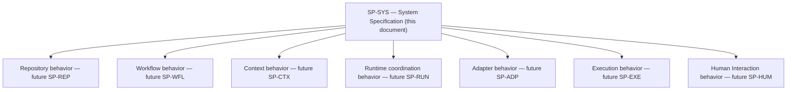
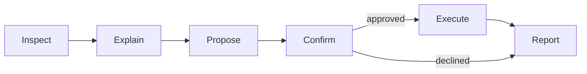

# AI Engineering Operating System

## AEOS — System Specification

*The permanent statement of the system-level, observable behavior of AEOS.*

| Field | Value |
| :--- | :--- |
| **Document** | System Specification |
| **Product** | AI Engineering Operating System (AEOS) |
| **Document ID** | AEOS-SPEC |
| **Version** | 1.0.1 |
| **Status** | Frozen |
| **Owner** | Product Owner, AEOS |
| **Author** | Chief Specification Architect, AEOS |
| **Audience** | Architects, implementers, reviewers, test authors, and AI runtimes consuming this repository |
| **Suggested path** | `docs/specification/SYSTEM_SPECIFICATION.md` |
| **Companion documents** | `AEOS_VISION.md` (AEOS-VISION) · `AEOS_PRODUCT_REQUIREMENTS.md` (AEOS-PRD) · `AEOS_GLOSSARY.md` (AEOS-GLOSSARY) · `AEOS_DOCUMENT_STANDARD.md` (AEOS-DOCSTD) · `AEOS_ARCHITECTURE.md` (AEOS-ARCH) · `AEOS_BLUEPRINT.md` (AEOS-BLUEPRINT) · `AEOS_SPECIFICATION_STANDARD.md` (AEOS-SPECSTD) |
| **Supersedes** | None |
| **Area code** | `SYS` |

> **Authority of this document.**
> This document specifies, precisely and testably, the **system-level observable behavior of
> AEOS** — the behavioral contract that holds across every product capability, expressed once as
> the interaction, classification, and boundary-crossing behavior every functional area of AEOS
> operates within. It is the first Specification document in the AEOS repository, registering the
> `SYS` behavior domain under AEOS-SPECSTD.
>
> It defines no vision, no product requirement, no terminology, no architecture, no Blueprint
> arrangement, no interface, no algorithm, no technology, and no implementation. It redefines
> nothing stated by AEOS-VISION, AEOS-PRD, AEOS-GLOSSARY, AEOS-ARCH, or AEOS-BLUEPRINT; where a
> statement here appears to, that is a defect in this document and MUST be reported rather than
> acted upon. It sits below AEOS-PRD, AEOS-ARCH, and AEOS-BLUEPRINT, and above the Context Router,
> Workflow Engine, Runtime coordination, Runtime Adapter, Execution, Repository, and Human
> Interaction behavior each future domain-specific Specification will own, as
> [Section 8](#8-extension-points) states. It is written entirely under AEOS-SPECSTD, which governs
> its form, structure, identifier convention, traceability, and lifecycle; where this document and
> AEOS-SPECSTD both speak to a subject, AEOS-SPECSTD governs the form and this document governs the
> content of the `SYS` behavior domain. Where this document and a document of higher authority both
> speak to the same subject, the higher-authority document governs and the conflict is a defect to
> be reported.

> The key words **MUST**, **MUST NOT**, **SHOULD**, **SHOULD NOT**, and **MAY** in this document are
> to be interpreted as described in RFC 2119 and RFC 8174, and carry their normative meaning only
> when they appear in all capitals.

---

## Table of Contents

1. [Purpose](#1-purpose)
2. [Scope](#2-scope)
3. [Responsibilities](#3-responsibilities)
4. [Inputs](#4-inputs)
5. [Outputs](#5-outputs)
6. [Behavior](#6-behavior)
7. [Constraints](#7-constraints)
8. [Extension Points](#8-extension-points)
9. [Traceability](#9-traceability)
10. [Non-goals](#10-non-goals)
11. [References](#11-references)
12. [Document Governance](#12-document-governance)
13. [Appendix A — SP-SYS Rule Index](#appendix-a--sp-sys-rule-index)

---

## 1. Purpose

AEOS-ARCH states how AEOS is structured. AEOS-BLUEPRINT states how that structure is arranged to be
built. Neither is precise enough to determine whether a given implementation is correct, and neither
should be — that precision belongs to the Specification layer, which AEOS-SPECSTD governs. This
document is where that layer begins.

Seven behavior domains sit beneath AEOS-BLUEPRINT's seven layers — Repository, Workflow, Context,
Runtime, Adapter, Execution, and Human Interaction — and each will eventually need its own
Specification document, precise enough for a test to be derived from it without further
interpretation. All seven of those future documents share one thing before any of them is written:
every consequential action any of them describes still follows the same interaction loop, is still
classified by the same four Action Classes, still crosses the same four boundaries under the same
disclosure obligations, and is still bound by the same independence and safety posture. Writing that
shared contract seven times, once inside each future domain-specific Specification, would either be
duplicated seven ways or would quietly diverge seven ways. Both outcomes are defects AEOS-DOCSTD
`DS-P-07` already forbids: a definition, once stated, is never duplicated.

This document exists to state that shared contract exactly once, as one behavior domain in its own
right — the observable behavior of AEOS as an integrated system, independent of which functional
area realizes any one instance of it — so that every future domain-specific Specification is written
against a fixed foundation rather than each re-deriving it. It is, in the sense AEOS-SPECSTD
[Section 5](#5-purpose-of-specifications) describes, the Specification that answers "how must AEOS
behave, precisely and testably, before any one functional area's internal behavior is specified at
all."

---

## 2. Scope

### 2.1 Behavior Domain and Area Registration

This document registers the area code `SYS` under AEOS-SPECSTD Section 11.4. The `SYS` behavior
domain is the **system-level, cross-cutting observable behavior of AEOS**: the behavior a user, an
AI runtime, or another Repository Asset can observe when AEOS exercises any of its product
capabilities, expressed through the interaction loop, the classification of actions, and the
boundaries at which material crosses. It is one behavior domain, not seven, because it states one
thing — the contract shared by every functional area — and not the union of what each area does
internally.

`SYS` is deliberately distinct from, and does not anticipate, the area codes a future Repository,
Workflow, Context, Runtime, Adapter, Execution, or Human Interaction Specification will register for
itself. Under AEOS-SPECSTD `ID5`, each of those codes is registered by the document that first uses
it; this document registers none of them, and reserves no area code on their behalf.

### 2.2 System Capabilities Covered

This document's behavioral rules draw on and apply to every product capability AEOS-PRD
Section 12 defines. Each capability's own definition and rationale remain owned by AEOS-PRD; this document states only the observable,
testable, cross-cutting behavior each capability exhibits as part of the system as a whole.

| Capability | `PR-` prefix |
| :--- | :--- |
| C1 — Environment management | `PR-ENV` |
| C2 — Project management | `PR-PRJ` |
| C3 — Workflow orchestration | `PR-WFL` |
| C4 — AI runtime orchestration | `PR-RUN` |
| C5 — TDD workflow | `PR-TDD` |
| C6 — Documentation generation | `PR-DOC` |
| C7 — Rule management | `PR-RUL` |
| C8 — Skill management | `PR-SKL` |
| C9 — Prompt management | `PR-PMT` |
| C10 — Repository management | `PR-REP` |

Platform (`PR-PLT`), Distribution (`PR-DST`), Safety (`PR-SAF`), and the Quality Attributes
(`PR-NFR`) apply across every capability above and are addressed in this document as system-wide
[Constraints](#7-constraints) rather than as a capability of their own, consistent with how AEOS-PRD Section 19 presents them.

### 2.3 Functional Decomposition

The behavior this document does not itself specify in full — the internal behavior particular to one
functional area — decomposes along the seven internal layers AEOS-ARCH Section 4 defines and AEOS-BLUEPRINT
arranges. This decomposition is stated here as the map of where subordinate Specification work
belongs; [Section 8](#8-extension-points) states, for each area, the boundary within which that
future work must remain.

| Functional area | Realizes (AEOS-ARCH layer) | Arranged by (AEOS-BLUEPRINT) | Named responsibility |
| :--- | :--- | :--- | :--- |
| Repository | Repository Layer | `BP-REP` | Asset and Workflow State custody |
| Workflow | Workflow Layer | `BP-WFL` | Workflow Engine |
| Context | Context Layer | `BP-CTX` | Context Router |
| Runtime coordination | Runtime Layer | `BP-RUN` | Runtime-independent orchestration |
| Adapter | Adapter Layer | `BP-ADP` | Runtime Adapter |
| Execution | Execution Layer | `BP-EXE` | Effect application and Environment observation |
| Human Interaction | (interaction surface toward the Human Layer) | `BP-HUM` | Proposal, decision, and report assembly |

Two of the areas above carry behavior a reader might expect to find named as separate architectural
concepts. Neither AEOS-GLOSSARY nor AEOS-ARCH names either one as a layer or a reserved
responsibility, and this document does not introduce either name as a term:

- The Workflow area's behavior includes how a Workflow's position — including its position within an
  active TDD Cycle — advances and is held between steps. AEOS-BLUEPRINT names this
  the Workflow Blueprint's *Step Sequencing* and *Cycle Position Keeping* subsystems
  (`BP-WFL` Section 8.2). A future Workflow Specification
  states this behavior in full.
- The Runtime coordination area's behavior includes how a step's requirement is compared against an
  adapter's offer, how a selection is held, and how availability is degraded. AEOS-BLUEPRINT names
  this the Runtime Blueprint's *Capability Matching*, *Selection Custody*, and *Degradation Handling*
  subsystems (`BP-RUN` Section 10.2). A future Runtime
  Specification states this behavior in full.

### 2.4 Boundary of This Document

This document specifies the behavior shared across every functional area. It does not specify the
complete internal behavior particular to any one of the seven areas in
[Section 2.3](#23-functional-decomposition); that boundary is stated normatively in
[Section 8](#8-extension-points) and the resulting exclusions are stated in
[Section 10](#10-non-goals).

---

## 3. Responsibilities

This Specification is answerable for:

- The system-level interaction loop, stated as testable behavior: Inspect, Explain, Propose,
  Confirm, Execute, Report.
- The classification of an intended effect into one of the four Action Classes, and the approval
  behavior each class requires.
- The disclosure behavior required before material crosses any of the four architectural boundaries
  AEOS-ARCH Section 7.1 defines.
- The observable behavior of environment inspection, repository custody, runtime coordination, and
  verification (TDD) at the level shared across every functional area.
- The independence, safety, and non-functional behavioral constraints that apply to every specified
  system behavior without exception.
- The functional decomposition establishing where each future, area-specific Specification document
  attaches, and the boundary each MUST respect in attaching there.

This Specification is **not** answerable for:

- The complete internal behavior particular to the Repository, Workflow, Context, Runtime, Adapter,
  Execution, or Human Interaction areas — each is owned by its own future Specification document,
  per [Section 8](#8-extension-points).
- Any structural decision, layer boundary, or dependency direction — owned by AEOS-ARCH.
- Any internal arrangement, subsystem, or extension seam — owned by AEOS-BLUEPRINT.
- Any interface, wire format, data structure, process model, persistence mechanism, or algorithm —
  owned by Implementation Guides and Runtime documents, neither of which yet exists for AEOS.
- Any product rationale, philosophy, or terminology — owned by AEOS-VISION, AEOS-PRD, and
  AEOS-GLOSSARY respectively.

---

## 4. Inputs

The inputs below are the material every system-level behavior in [Section 6](#6-behavior) operates
on. An input's validity condition is part of the behavior this document specifies; an invalid input
is a defined condition, not an unhandled one.

| Input | Crosses (AEOS-ARCH boundary) | Required properties | Valid when | Invalid when |
| :--- | :--- | :--- | :--- | :--- |
| Human decision | Human boundary, inward | An explicit act: approval, decline, grant issuance, or grant revocation | The act is explicit and answers exactly one outstanding Proposal | Silent, ambiguous, inferred from repetition, or answering a different Proposal |
| Repository Asset | Repository boundary, outward (read) | Versioned, inspectable, resolvable to one unambiguous value where scopes compete | Resolution is deterministic and the asset is current | Two applicable assets resolve ambiguously, or the asset is stale relative to the repository |
| Environment observation | Environment boundary, inward | Distinguished as observed fact or as inference | The distinction is stated; an undeterminable state is reported as undeterminable | State is asserted without the fact/inference distinction, or an undeterminable state is presented as a finding |
| Runtime result or fault | External AI boundary, inward | Expressed in Engineering Capability terms; carries no authority | Received as material only | Treated, by any downstream behavior, as authorizing an action |
| Recorded Workflow State | Repository boundary, outward (read) | Durable, consistent with the repository's current state | Matches observed repository state | Diverges from observed repository state — a defined condition, per `SP-SYS-022` in [Section 6.3](#63-environment-and-repository-behavior) |

---

## 5. Outputs

The outputs below describe externally observable, contractual behavior — what crosses a boundary,
and in what form a counterparty can rely on it — not the internal artifact, structure, or mechanism
that produces it. An implementation MAY realize an output through any internal form; this document
constrains only what the output must observably be.

| Output | Crosses (AEOS-ARCH boundary) | Content | Produced when |
| :--- | :--- | :--- | :--- |
| Explanation | Human boundary, outward | What was inspected, stated so a human can act on it, fact distinguished from inference | Following every Inspect phase that precedes a consequential action |
| Proposal | Human boundary, outward | Intended action, rationale, effects, reversibility, consequence of declining | Before Confirm, for every action above the Observation class |
| Boundary disclosure | Human boundary, outward | What will cross the External AI boundary and its expected cost | Before any crossing of the External AI boundary |
| Applied effect | Environment or Repository boundary, outward | Exactly the scope approved, no more | Only after Confirm returns approval |
| Report | Human boundary, outward; Repository boundary, inward (durable write) | What actually occurred, including partial completion and failure | Following every Execute phase and every halt |
| Composed Context | Runtime coordination, onward toward the Adapter area | Minimized to the step's requirement, with a retained reason for each inclusion, sensitive material excluded | Wherever a step requires material to reach a Runtime |

---

## 6. Behavior

Each rule below is independently testable: a reviewer or an automated test can determine compliance
from the rule's text alone, without consulting this document's author, per AEOS-SPECSTD `NL3`. A
rule's own pass/fail condition is its acceptance criterion, satisfying `MD9`.

### 6.1 The System Interaction Loop

| ID | Rule | Traces to |
| :--- | :--- | :--- |
| `SP-SYS-001` | For every action classified above Observation, AEOS MUST execute Inspect, Explain, Propose, Confirm, and Execute, in that order, before the action's effect is applied. | `PR-WFL-004` · `PR-WFL-005` |
| `SP-SYS-002` | The Inspect phase MUST determine the actual current state of the subject of the intended action before AEOS forms that intent, and MUST NOT proceed from an assumed state. | `PR-ENV-001` · `PR-WFL-005` |
| `SP-SYS-003` | The Explain phase MUST state what Inspect found in a form a human can act on, and MUST distinguish an observed fact from an inference. | `PR-ENV-003` · `PR-SAF-011` |
| `SP-SYS-004` | The Propose phase MUST state the intended action, its rationale, its effects, its reversibility, and the consequence of declining, as one Proposal. | `PR-SAF-004` · `PR-WFL-005` |
| `SP-SYS-005` | The Confirm phase MUST wait for an explicit human decision, and MUST NOT treat silence, ambiguity, or approval of a different action as approval of the Proposal presented. | `PR-WFL-005` |
| `SP-SYS-006` | The Execute phase MUST perform exactly the action approved, and MUST NOT perform an action whose scope exceeds what was approved. | `PR-SAF-005` |
| `SP-SYS-007` | The Report phase MUST state what actually occurred, including partial completion and failure, and MUST record the outcome durably. | `PR-WFL-011` · `PR-REP-012` |
| `SP-SYS-008` | AEOS MUST NOT require a human decision for an action classified as Observation. | `PR-WFL-006` |

### 6.2 Action Classification and Approval

| ID | Rule | Traces to |
| :--- | :--- | :--- |
| `SP-SYS-009` | AEOS MUST classify every intended effect into exactly one of the four Action Classes before the Propose phase completes for that effect. | `PR-WFL-006` |
| `SP-SYS-010` | An action of the Destructive class MUST require explicit, specific confirmation of that exact action, and MUST NOT be authorized by a general or prior approval. | `PR-SAF-003` |
| `SP-SYS-011` | An action of the External-effect class MUST state its expected scope and expected cost within the Proposal, before Confirm. | `PR-RUN-009` · `PR-SAF-008` |
| `SP-SYS-012` | A declined Proposal MUST halt the action it proposed, with no effect applied. | `PR-WFL-009` |
| `SP-SYS-013` | A failed step MUST halt the enclosing Workflow, and MUST NOT permit a step that depends on it to begin. | `PR-WFL-010` |
| `SP-SYS-014` | An Automation Grant MUST NOT satisfy the Confirm phase for an action of the Destructive class. | `PR-SAF-012` · `PR-WFL-014` |
| `SP-SYS-015` | Revocation of an Automation Grant MUST take effect immediately, without further action by AEOS. | `PR-WFL-014` |

### 6.3 Environment and Repository Behavior

| ID | Rule | Traces to |
| :--- | :--- | :--- |
| `SP-SYS-016` | AEOS MUST inspect the Environment before proposing or performing an environment-affecting action. | `PR-ENV-001` |
| `SP-SYS-017` | Where an inspected component matches expectation, AEOS MUST report it and MUST NOT propose a change to it. | `PR-ENV-007` |
| `SP-SYS-018` | Where Environment state cannot be determined, AEOS MUST report the uncertainty and MUST NOT proceed as though the state were known. | `PR-ENV-010` · `PR-SAF-002` |
| `SP-SYS-019` | AEOS MUST NOT modify, replace, or remove a component it did not install, absent explicit, specific confirmation of that exact action. | `PR-ENV-009` · `PR-SAF-009` |
| `SP-SYS-020` | AEOS MUST perform a durable write to the repository only as the outcome of an approved action, and MUST report every such write. | `PR-REP-001` · `PR-WFL-015` |
| `SP-SYS-021` | AEOS MUST NOT discard uncommitted work without explicit, specific confirmation of that exact action. | `PR-REP-006` |
| `SP-SYS-022` | AEOS MUST report when the repository has changed in a way its recorded state does not reflect, and MUST re-establish current state before proceeding. | `PR-REP-014` |

### 6.4 Runtime Coordination and Boundary-Crossing Behavior

| ID | Rule | Traces to |
| :--- | :--- | :--- |
| `SP-SYS-023` | AEOS MUST disclose what will cross the External AI boundary, and its expected cost, before that crossing occurs. | `PR-SAF-007` · `PR-SAF-008` · `PR-RUN-009` |
| `SP-SYS-024` | AEOS MUST NOT transmit project content to a Runtime the user has not selected and approved. | `PR-SAF-007` |
| `SP-SYS-025` | A result returned across the External AI boundary MUST be treated as material for a decision, and MUST NOT itself authorize an action, satisfy a gate, or expand an approved scope. | `PR-SAF-002` |
| `SP-SYS-026` | When a selected Runtime is unavailable, AEOS MUST reduce the options that required it, and MUST NOT alter durable project state to accommodate the absence. | `PR-RUN-010` |
| `SP-SYS-027` | AEOS MUST report a Runtime error clearly, and MUST NOT retry a mediated request in a way that incurs cost the human has not approved. | `PR-RUN-011` |
| `SP-SYS-028` | Before a Workflow step begins, AEOS MUST report any part of that step the selected Runtime cannot satisfy. | `PR-WFL-016` |
| `SP-SYS-029` | A credential MUST NOT appear in a Prompt, log, report, generated document, or Repository Asset AEOS produces. | `PR-SAF-006` · `PR-RUN-014` · `PR-REP-013` |

### 6.5 Verification (TDD) Behavior

| ID | Rule | Traces to |
| :--- | :--- | :--- |
| `SP-SYS-030` | AEOS MUST require a failing test before implementation begins, for code work under its governance. | `PR-TDD-003` |
| `SP-SYS-031` | AEOS MUST verify that a new test fails for the intended reason before implementation proceeds. | `PR-TDD-004` |
| `SP-SYS-032` | AEOS MUST treat departure from the TDD cycle as an explicit exception the human acknowledges, and MUST NOT apply it as a default path. | `PR-TDD-008` |
| `SP-SYS-033` | A test failure MUST halt Workflow progression, and MUST be reported with sufficient detail to act on. | `PR-TDD-010` |

### 6.6 Documentation, Rule, and Skill Behavior

| ID | Rule | Traces to |
| :--- | :--- | :--- |
| `SP-SYS-034` | AEOS MUST NOT publish generated documentation containing a placeholder, a TODO, or unresolved uncertainty presented as fact. | `PR-DOC-002` · `PR-DOC-010` |
| `SP-SYS-035` | AEOS MUST NOT apply a Rule the user cannot inspect. | `PR-RUL-009` |
| `SP-SYS-036` | AEOS MUST report, on request, which Rule or Skill was applied to a given action and why. | `PR-RUL-007` · `PR-SKL-008` |

### 6.7 Project and Prompt Behavior

| ID | Rule | Traces to |
| :--- | :--- | :--- |
| `SP-SYS-037` | Before initializing or adopting a project, AEOS MUST inspect the target location and report what it finds. | `PR-PRJ-003` |
| `SP-SYS-038` | AEOS MUST NOT overwrite, relocate, or restructure existing content when adopting an existing project. | `PR-PRJ-002` |
| `SP-SYS-039` | AEOS MUST make a composed Prompt available for human inspection before it is sent to a Runtime. | `PR-PMT-005` |
| `SP-SYS-040` | AEOS MUST exclude a credential or user-designated sensitive content from a Prompt composition before that composition completes. | `PR-PMT-008` |

### 6.8 Repository History Behavior

| ID | Rule | Traces to |
| :--- | :--- | :--- |
| `SP-SYS-041` | AEOS MUST NOT modify version control history without explicit, specific confirmation of that exact operation. | `PR-REP-005` |

---

## 7. Constraints

The invariants below MUST hold before, during, and after every behavior stated in
[Section 6](#6-behavior). They are stated once here because they bound every functional area
identically; a future area-specific Specification depends on them and MUST NOT restate or weaken
them.

### 7.1 Independence Constraints

| ID | Rule | Traces to |
| :--- | :--- | :--- |
| `SP-SYS-042` | AEOS MUST perform no inference, under any circumstance. | `PR-RUN-001` |
| `SP-SYS-043` | AEOS MUST NOT override or silently substitute the user's Runtime selection. | `PR-RUN-004` |
| `SP-SYS-044` | Switching the selected Runtime MUST require no change to a Workflow, Rule, Skill, Prompt, or repository structure. | `PR-RUN-005` |
| `SP-SYS-045` | Every behavior specified in [Section 6](#6-behavior) MUST be identical on Windows, macOS, and Linux. | `PR-PLT-001` · `PR-PLT-003` |
| `SP-SYS-046` | Every behavior specified in [Section 6](#6-behavior) MUST be identical under every official Distribution Method. | `PR-DST-005` · `PR-DST-006` |
| `SP-SYS-047` | A project prepared under one supported Platform or Distribution Method MUST be usable, unmodified, under another. | `PR-PLT-004` · `PR-DST-007` |

> **On "identical," non-normative.** The identity `SP-SYS-045` through `SP-SYS-047` require is
> identity of observable behavior — what a human, an AI runtime, or another Repository Asset can
> detect. It does not require identical internal implementation, mechanism, or code path across
> Platforms or Distribution Methods. How that identical behavior is achieved on each is a matter for
> Runtime documents and Implementation Guides, neither of which this document constrains.

### 7.2 Safety and Trust Constraints

| ID | Rule | Traces to |
| :--- | :--- | :--- |
| `SP-SYS-048` | Where AEOS cannot determine that a condition required for an action holds, AEOS MUST stop and report the uncertainty rather than proceed on an assumption. | `PR-SAF-002` |
| `SP-SYS-049` | AEOS MUST state the reversibility of a proposed action within the Proposal that carries it. | `PR-SAF-004` |
| `SP-SYS-050` | An interruption, at any point in [Section 6.1](#61-the-system-interaction-loop)'s loop, MUST leave the project in a state AEOS can describe. | `PR-SAF-010` |
| `SP-SYS-051` | AEOS MUST NOT present an inference as an observed fact, in any output listed in [Section 5](#5-outputs). | `PR-SAF-011` |

### 7.3 Non-Functional Behavioral Constraints

| ID | Rule | Traces to |
| :--- | :--- | :--- |
| `SP-SYS-052` | The Context AEOS sends toward a Runtime for one step MUST be the smallest set that step requires, with the reason for each inclusion available on request. | `PR-PMT-003` · `PR-PMT-004` |
| `SP-SYS-053` | A capability is complete, for the purpose of this document, only when its behavior is identical on every supported Platform. | `PR-PLT-006` |
| `SP-SYS-054` | Every behavior specified in [Section 6](#6-behavior) MUST be verifiable in isolation, with its counterparties replaceable at the point they are reached, for the purpose of that verification. | `PR-NFR-010` |
| `SP-SYS-055` | AEOS MUST make a decision it has taken explainable to the user on request: what was inspected, what was proposed, what was applied, and why. | `PR-NFR-001` |

> **On "isolation," non-normative.** The isolation `SP-SYS-054` requires is behavioral verification
> isolation: a rule can be tested against its stated inputs and outputs, with its counterparties
> replaced by test doubles at the point they are reached, without exercising the whole system at
> once. It is not a statement of architectural isolation, which AEOS-ARCH's layer boundaries already
> establish and this document does not restate.

---

## 8. Extension Points

`SS-P-09` requires that extension of a Specification be additive; frozen behavior is never silently
altered. This document's own extension mechanism is the addition of new `SP-SYS-<NNN>` identifiers
under AEOS-SPECSTD Section 18.1.
Beyond that ordinary mechanism, this document declares seven extension points at which the AEOS 1.0
Specification layer as a whole is intended to grow: the seven functional areas
[Section 2.3](#23-functional-decomposition) names. A Specification attaching at `EPS-1` through
`EPS-7` extends this document only by adding behavior within its own functional area; it does not,
and MUST NOT, modify a rule this document already states — the boundary `SP-SYS-EXT-3` already
requires.

### 8.1 Specification Extension Points

| ID | Extension point | What is added | Boundary — MUST NOT change |
| :--- | :--- | :--- | :--- |
| `EPS-1` | Repository behavior Specification | A future Specification document, registering its own area code, stating the complete behavior of Repository Asset and Workflow State custody, within `BP-REP`'s arrangement. | Any `SP-SYS-<NNN>` rule this document fixes, in particular `SP-SYS-020` · `SP-SYS-021` · `SP-SYS-022`. |
| `EPS-2` | Workflow behavior Specification | A future Specification document stating the complete behavior of step sequencing, Action Class assignment, gate placement, and Workflow State progression — including position within an active TDD Cycle — within `BP-WFL`'s arrangement. | `SP-SYS-001` through `SP-SYS-015` · `SP-SYS-030` through `SP-SYS-033`. |
| `EPS-3` | Context behavior Specification | A future Specification document stating the complete behavior of Context selection, inclusion justification, and Prompt composition within `BP-CTX`'s arrangement. | `SP-SYS-039` · `SP-SYS-040` · `SP-SYS-052`. |
| `EPS-4` | Runtime coordination behavior Specification | A future Specification document stating the complete behavior of capability matching, selection custody, boundary disclosure assembly, and degradation handling within `BP-RUN`'s arrangement. | `SP-SYS-023` through `SP-SYS-028` · `SP-SYS-042` through `SP-SYS-047`. |
| `EPS-5` | Adapter behavior Specification | A future Specification document stating the complete behavior of capability advertisement and request, result, and fault mediation within `BP-ADP`'s arrangement. | `SP-SYS-025` · `SP-SYS-029` · `SP-SYS-042`. |
| `EPS-6` | Execution behavior Specification | A future Specification document stating the complete behavior of Environment observation, effect performance, and outcome observation within `BP-EXE`'s arrangement. | `SP-SYS-016` through `SP-SYS-019` · `SP-SYS-050`. |
| `EPS-7` | Human Interaction behavior Specification | A future Specification document stating the complete behavior of Proposal assembly, decision collection, Automation Grant custody, and report presentation within `BP-HUM`'s arrangement. | `SP-SYS-004` through `SP-SYS-007` · `SP-SYS-010` · `SP-SYS-014` · `SP-SYS-015`. |

### 8.2 Rules Governing These Extension Points

| # | Rule |
| :--- | :--- |
| `SP-SYS-EXT-1` | A Specification document attaching at `EPS-1` through `EPS-7` MUST register its own area code under AEOS-SPECSTD `ID5`, and MUST NOT reuse `SYS`. |
| `SP-SYS-EXT-2` | A Specification document attaching at `EPS-1` through `EPS-7` MUST cite the `SP-SYS-<NNN>` rules it depends on, under AEOS-SPECSTD `DP1`, and MUST NOT restate them. |
| `SP-SYS-EXT-3` | A Specification document attaching at `EPS-1` through `EPS-7` MUST NOT state a rule that would contradict a rule in [Section 6](#6-behavior) or [Section 7](#7-constraints) of this document; a perceived need to do so is reported against this document rather than resolved locally. |
| `SP-SYS-EXT-4` | Addition of an eighth extension point — a functional area beyond the seven [Section 2.3](#23-functional-decomposition) names — requires that AEOS-ARCH or AEOS-BLUEPRINT first recognize the corresponding layer or arrangement; this document does not create one on its own authority. |
| `SP-SYS-EXT-5` | Extending this document to state new system-level, cross-cutting behavior — behavior every functional area shares, in the sense of [Section 2.1](#21-behavior-domain-and-area-registration) — is achieved by adding a new `SP-SYS-<NNN>` identifier under the ordinary mechanism, not by attaching at `EPS-1` through `EPS-7`. |

---

## 9. Traceability

Every rule in [Section 6](#6-behavior), [Section 7](#7-constraints), and
[Section 8.2](#82-rules-governing-these-extension-points) traces to one or more `PR-` identifiers, per
AEOS-SPECSTD `TR1`. This document as a whole traces to at least one Blueprint identifier for each
functional area it decomposes toward, per `BP-GOV-008`, as recorded in
[Section 2.3](#23-functional-decomposition) and [Section 8.1](#81-specification-extension-points).

The complete rule-by-rule trace is [Appendix A](#appendix-a--sp-sys-rule-index). The table below
summarizes trace density by `PR-` prefix, so that a change to any one AEOS-PRD requirement area can
be checked against the subset of this document it affects, per AEOS-SPECSTD `CM2`.

| `PR-` prefix | Rules in this document that trace to it |
| :--- | :--- |
| `PR-ENV` | `SP-SYS-002` · `SP-SYS-016` · `SP-SYS-017` · `SP-SYS-018` · `SP-SYS-019` |
| `PR-PRJ` | `SP-SYS-037` · `SP-SYS-038` |
| `PR-WFL` | `SP-SYS-001` through `SP-SYS-013` · `SP-SYS-020` · `SP-SYS-028` |
| `PR-RUN` | `SP-SYS-011` · `SP-SYS-023` through `SP-SYS-029` · `SP-SYS-043` through `SP-SYS-044` |
| `PR-TDD` | `SP-SYS-030` through `SP-SYS-033` |
| `PR-DOC` | `SP-SYS-034` |
| `PR-RUL` | `SP-SYS-035` · `SP-SYS-036` |
| `PR-SKL` | `SP-SYS-036` |
| `PR-PMT` | `SP-SYS-039` · `SP-SYS-040` · `SP-SYS-052` |
| `PR-REP` | `SP-SYS-007` · `SP-SYS-020` through `SP-SYS-022` · `SP-SYS-029` · `SP-SYS-041` |
| `PR-PLT` | `SP-SYS-045` · `SP-SYS-047` · `SP-SYS-053` |
| `PR-DST` | `SP-SYS-046` · `SP-SYS-047` |
| `PR-SAF` | `SP-SYS-004` · `SP-SYS-006` · `SP-SYS-010` through `SP-SYS-011` · `SP-SYS-014` · `SP-SYS-019` · `SP-SYS-023` through `SP-SYS-025` · `SP-SYS-029` · `SP-SYS-048` through `SP-SYS-051` |
| `PR-NFR` | `SP-SYS-054` · `SP-SYS-055` |

No rule in this document lacks a trace, and no rule traces to a requirement this document does not
cite by identifier, consistent with AEOS-SPECSTD `TR1` and `TR4`.

---

## 10. Non-goals

This document deliberately does not cover the following. Each is a reasonable expectation this
document does not meet, stated here so a reader does not search for it.

| Non-goal | Why it is out of scope | Where it belongs |
| :--- | :--- | :--- |
| The complete internal behavior of the Repository area | Reserved to a future Specification attaching at `EPS-1` | Future Repository behavior Specification |
| The complete internal behavior of the Workflow area, including full state-transition and TDD-cycle-position behavior | Reserved to a future Specification attaching at `EPS-2` | Future Workflow behavior Specification |
| The complete internal behavior of the Context area | Reserved to a future Specification attaching at `EPS-3` | Future Context behavior Specification |
| The complete internal behavior of the Runtime coordination area, including the full orchestration and capability-matching flow | Reserved to a future Specification attaching at `EPS-4` | Future Runtime coordination behavior Specification |
| The complete internal behavior of the Adapter area | Reserved to a future Specification attaching at `EPS-5` | Future Adapter behavior Specification |
| The complete internal behavior of the Execution area | Reserved to a future Specification attaching at `EPS-6` | Future Execution behavior Specification |
| The complete internal behavior of the Human Interaction area | Reserved to a future Specification attaching at `EPS-7` | Future Human Interaction behavior Specification |
| Interfaces, endpoints, request or response schemas, wire formats | Prohibited to the Specification layer by AEOS-SPECSTD `MN4` | Implementation Guides |
| Data structures, classes, modules, file layouts | Prohibited to the Specification layer by AEOS-SPECSTD `MN1` | Implementation Guides |
| Process model, concurrency, persistence mechanism, transport | Owned by Runtime documents, per AEOS-BLUEPRINT Section 18 | Runtime documents |
| Technology, vendor, or product selection | Prohibited to the Specification layer by AEOS-SPECSTD `MN3` | AEOS-TECH, Implementation Guides |
| Installation, deployment, or environment-preparation procedure | Prohibited to the Specification layer by AEOS-SPECSTD `MN5` | Runtime documents, Developer Guides |
| Test procedures, test plans, or test cases | Outside AEOS-SPECSTD's scope, per its Section 2.2 note on testing artifacts | A future Test Specification layer |
| Rationale for why any rule above exists | Prohibited to the Specification layer by AEOS-SPECSTD `MN6` | AEOS-VISION, AEOS-PRD |
| Structural decisions, layer boundaries, or dependency direction | Owned by AEOS-ARCH | AEOS-ARCH |
| Internal arrangement or extension seams below the seven areas in [Section 2.3](#23-functional-decomposition) | Owned by AEOS-BLUEPRINT | AEOS-BLUEPRINT |

---

## 11. References

| Reference | Cited for |
| :--- | :--- |
| AEOS-VISION | Invariants V1–V10, underlying the independence and safety posture stated behaviorally in [Section 7](#7-constraints) |
| AEOS-PRD Section 9 | The engineering lifecycle stages this document's behavior serves |
| AEOS-PRD Section 10 | The interaction loop, Action Classes, and Automation Grants specified testably in [Section 6](#6-behavior) |
| AEOS-PRD Section 12 | The ten product capabilities this document's behavior applies to |
| AEOS-PRD Section 18 | Every `PR-` identifier this document traces to |
| AEOS-PRD Section 19 | The `PR-NFR` quality attributes stated behaviorally in [Section 7.3](#73-non-functional-behavioral-constraints) |
| AEOS-GLOSSARY | The definitions of every capitalized term used in this document, including *Context Router*, *Workflow Engine*, and *Runtime Adapter* |
| AEOS-DOCSTD | The form, structure, and lifecycle every AEOS document, including this one, follows |
| AEOS-ARCH Section 4 | The eight-layer model this document's functional decomposition maps to |
| AEOS-ARCH Section 7 | The four architectural boundaries this document's disclosure and crossing behavior is written against |
| AEOS-ARCH Section 8 | The `AR-` invariants this document's constraints are grounded in |
| AEOS-BLUEPRINT Sections 7–13 | The seven Blueprint Layers this document's functional decomposition attaches to |
| AEOS-BLUEPRINT Section 17 | The Blueprint/Specification boundary this document is written against |
| AEOS-SPECSTD | The Specification Standard this document is written entirely under |

---

## 12. Document Governance

### 12.1 Status

This document is the first document of the AEOS Specification layer and is intended to be frozen as
part of the AEOS 1.0 release, alongside AEOS-VISION, AEOS-PRD, AEOS-GLOSSARY, AEOS-DOCSTD, AEOS-ARCH,
AEOS-BLUEPRINT, and AEOS-SPECSTD.

### 12.2 Change Control

This document's change control follows AEOS-SPECSTD Section 18.1 without modification, applied to
the `SYS` behavior domain.

| Increment | When |
| :--- | :--- |
| **Patch** | Editorial correction with no change to a specified rule's meaning or trace. |
| **Minor** | Addition of a new `SP-SYS-<NNN>` identifier that does not alter what an existing identifier requires. |
| **Major** | Any change to what an existing `SP-SYS-<NNN>` identifier requires; retirement of an identifier; a change to the `SYS` area code, ownership, or declared behavior domain; addition or removal of an `EPS-` extension point; or any change that would invalidate a downstream Specification, Implementation Guide, Runtime document, or test written against the prior version. |

### 12.3 Review Policy

Reviews of this document classify findings as **Critical**, **Major**, **Minor**, or **Nitpick**,
identify inconsistencies without redesigning, and apply the AEOS-SPECSTD Section 19.2 freeze
checklist before recommending freeze, per AEOS-DOCSTD Section 12.3 and 12.4.

### 12.4 Precedence

| Situation | Resolution |
| :--- | :--- |
| This document conflicts with AEOS-VISION, AEOS-PRD, AEOS-GLOSSARY, AEOS-ARCH, or AEOS-BLUEPRINT | The higher-authority document governs. The conflict is a defect in this document and is reported rather than acted upon. |
| This document conflicts with AEOS-SPECSTD on form, identifier convention, traceability, or lifecycle | AEOS-SPECSTD governs. This document is corrected. |
| This document conflicts with AEOS-SPECSTD on the content of the `SYS` behavior domain | This document governs its own content, per AEOS-SPECSTD Section 20.7. |
| A future Specification attaching at `EPS-1` through `EPS-7` appears to require a change to a rule in [Section 6](#6-behavior) or [Section 7](#7-constraints) | The apparent need is reported against this document. It is not resolved by a contradictory rule in the attaching document. |
| Two future Specification documents attaching at different extension points state conflicting dependencies on this document | Escalated to the owner, per AEOS-SPECSTD Section 15.2 `DP6`. |

### 12.5 Traceability

Traceability for this document is stated in full in [Section 9](#9-traceability) and
[Appendix A](#appendix-a--sp-sys-rule-index). Downstream documents reference this document's
`SP-SYS-<NNN>` identifiers under AEOS-SPECSTD `TR5`.

### 12.6 Revision History

| Version | Status | Summary |
| :--- | :--- | :--- |
| 1.0.0 | Superseded | Initial System Specification. Registers the `SYS` behavior domain. Establishes fifty-five `SP-SYS` rules across the system interaction loop, action classification and approval, environment and repository behavior, runtime coordination and boundary-crossing behavior, verification behavior, documentation/rule/skill behavior, project and prompt behavior, repository history behavior, independence constraints, safety and trust constraints, and non-functional behavioral constraints. States the functional decomposition of the AEOS 1.0 Specification layer into seven areas — Repository, Workflow, Context, Runtime coordination, Adapter, Execution, and Human Interaction — and declares seven Specification extension points, `EPS-1` through `EPS-7`, with five governing rules. Traces every rule to one or more `PR-` identifiers and every functional area to its owning AEOS-ARCH layer and AEOS-BLUEPRINT document. Introduces no product requirement, no vision, no terminology, no architectural decision, and no Blueprint arrangement. Redefines nothing stated by AEOS-VISION, AEOS-PRD, AEOS-GLOSSARY, AEOS-ARCH, or AEOS-BLUEPRINT. |
| 1.0.1 | Freeze candidate | Editorial clarification pass; no change of meaning. Added four non-normative clarifying notes: after [Section 7.1](#71-independence-constraints), that the identity `SP-SYS-045` through `SP-SYS-047` require is identity of observable behavior, not of internal implementation; before the [Section 5](#5-outputs) table, that an output describes externally observable, contractual behavior rather than an implementation artifact; in the [Section 8](#8-extension-points) introduction, that a Specification attaching at `EPS-1` through `EPS-7` adds behavior within its own functional area only, per the boundary `SP-SYS-EXT-3` already states; and after [Section 7.3](#73-non-functional-behavioral-constraints), that the isolation `SP-SYS-054` requires is behavioral verification isolation, not architectural isolation. No `SP-SYS` identifier, rule text, trace, extension point, or architectural boundary was added, removed, or changed. |

---

## Appendix A — SP-SYS Rule Index

**This appendix is non-normative.** The normative statement of each rule is its entry in
[Section 6](#6-behavior), [Section 7](#7-constraints), or
[Section 8.2](#82-rules-governing-these-extension-points).

| ID | Section | Short label | Traces to |
| :--- | :--- | :--- | :--- |
| `SP-SYS-001` | 6.1 | Loop order before effect | `PR-WFL-004` · `PR-WFL-005` |
| `SP-SYS-002` | 6.1 | Inspect before intent | `PR-ENV-001` · `PR-WFL-005` |
| `SP-SYS-003` | 6.1 | Explain distinguishes fact from inference | `PR-ENV-003` · `PR-SAF-011` |
| `SP-SYS-004` | 6.1 | Proposal content | `PR-SAF-004` · `PR-WFL-005` |
| `SP-SYS-005` | 6.1 | Confirm requires explicit decision | `PR-WFL-005` |
| `SP-SYS-006` | 6.1 | Execute matches approved scope | `PR-SAF-005` |
| `SP-SYS-007` | 6.1 | Report states actual outcome | `PR-WFL-011` · `PR-REP-012` |
| `SP-SYS-008` | 6.1 | Observation needs no decision | `PR-WFL-006` |
| `SP-SYS-009` | 6.2 | Every effect classified | `PR-WFL-006` |
| `SP-SYS-010` | 6.2 | Destructive requires specific confirmation | `PR-SAF-003` |
| `SP-SYS-011` | 6.2 | External-effect states scope and cost | `PR-RUN-009` · `PR-SAF-008` |
| `SP-SYS-012` | 6.2 | Decline halts with no effect | `PR-WFL-009` |
| `SP-SYS-013` | 6.2 | Failure halts dependents | `PR-WFL-010` |
| `SP-SYS-014` | 6.2 | Grant excludes Destructive | `PR-SAF-012` · `PR-WFL-014` |
| `SP-SYS-015` | 6.2 | Revocation is immediate | `PR-WFL-014` |
| `SP-SYS-016` | 6.3 | Inspect before environment action | `PR-ENV-001` |
| `SP-SYS-017` | 6.3 | Matching state, no proposed change | `PR-ENV-007` |
| `SP-SYS-018` | 6.3 | Undeterminable state reported as such | `PR-ENV-010` · `PR-SAF-002` |
| `SP-SYS-019` | 6.3 | No modification of uninstalled components | `PR-ENV-009` · `PR-SAF-009` |
| `SP-SYS-020` | 6.3 | Durable write only from approved action | `PR-REP-001` · `PR-WFL-015` |
| `SP-SYS-021` | 6.3 | Uncommitted work requires confirmation to discard | `PR-REP-006` |
| `SP-SYS-022` | 6.3 | Divergent repository state reported | `PR-REP-014` |
| `SP-SYS-023` | 6.4 | Disclosure before External AI crossing | `PR-SAF-007` · `PR-SAF-008` · `PR-RUN-009` |
| `SP-SYS-024` | 6.4 | No transmission to unapproved Runtime | `PR-SAF-007` |
| `SP-SYS-025` | 6.4 | Runtime result is material, not authority | `PR-SAF-002` |
| `SP-SYS-026` | 6.4 | Absence reduces options only | `PR-RUN-010` |
| `SP-SYS-027` | 6.4 | Errors reported, not silently retried | `PR-RUN-011` |
| `SP-SYS-028` | 6.4 | Unsatisfiable steps reported before start | `PR-WFL-016` |
| `SP-SYS-029` | 6.4 | No credentials in produced artifacts | `PR-SAF-006` · `PR-RUN-014` · `PR-REP-013` |
| `SP-SYS-030` | 6.5 | Failing test before implementation | `PR-TDD-003` |
| `SP-SYS-031` | 6.5 | Verify failure is for the intended reason | `PR-TDD-004` |
| `SP-SYS-032` | 6.5 | Cycle departure is an acknowledged exception | `PR-TDD-008` |
| `SP-SYS-033` | 6.5 | Test failure halts and reports | `PR-TDD-010` |
| `SP-SYS-034` | 6.6 | No placeholders in published documentation | `PR-DOC-002` · `PR-DOC-010` |
| `SP-SYS-035` | 6.6 | No uninspectable Rule applied | `PR-RUL-009` |
| `SP-SYS-036` | 6.6 | Applied Rule or Skill reported on request | `PR-RUL-007` · `PR-SKL-008` |
| `SP-SYS-037` | 6.7 | Inspect target before init or adoption | `PR-PRJ-003` |
| `SP-SYS-038` | 6.7 | Adoption does not overwrite existing content | `PR-PRJ-002` |
| `SP-SYS-039` | 6.7 | Composed Prompt inspectable before send | `PR-PMT-005` |
| `SP-SYS-040` | 6.7 | Sensitive content excluded before composition completes | `PR-PMT-008` |
| `SP-SYS-041` | 6.8 | History modification requires specific confirmation | `PR-REP-005` |
| `SP-SYS-042` | 7.1 | No inference, ever | `PR-RUN-001` |
| `SP-SYS-043` | 7.1 | No override of Runtime selection | `PR-RUN-004` |
| `SP-SYS-044` | 7.1 | Runtime switch requires no asset change | `PR-RUN-005` |
| `SP-SYS-045` | 7.1 | Identical behavior across Platforms | `PR-PLT-001` · `PR-PLT-003` |
| `SP-SYS-046` | 7.1 | Identical behavior across Distribution Methods | `PR-DST-005` · `PR-DST-006` |
| `SP-SYS-047` | 7.1 | Portability across Platform and Distribution | `PR-PLT-004` · `PR-DST-007` |
| `SP-SYS-048` | 7.2 | Uncertainty stops rather than assumes | `PR-SAF-002` |
| `SP-SYS-049` | 7.2 | Reversibility stated in every Proposal | `PR-SAF-004` |
| `SP-SYS-050` | 7.2 | Interruption leaves a describable state | `PR-SAF-010` |
| `SP-SYS-051` | 7.2 | No inference presented as fact | `PR-SAF-011` |
| `SP-SYS-052` | 7.3 | Context minimized with retained reasons | `PR-PMT-003` · `PR-PMT-004` |
| `SP-SYS-053` | 7.3 | Completeness requires Platform parity | `PR-PLT-006` |
| `SP-SYS-054` | 7.3 | Verifiable in isolation | `PR-NFR-010` |
| `SP-SYS-055` | 7.3 | Every decision explainable on request | `PR-NFR-001` |
| `SP-SYS-EXT-1` | 8.2 | Attaching Specifications register their own area code | AEOS-SPECSTD `ID5` |
| `SP-SYS-EXT-2` | 8.2 | Attaching Specifications cite rather than restate | AEOS-SPECSTD `DP1` |
| `SP-SYS-EXT-3` | 8.2 | Attaching Specifications MUST NOT contradict this document | AEOS-SPECSTD `SS-P-05` |
| `SP-SYS-EXT-4` | 8.2 | An eighth extension point requires prior Architecture or Blueprint recognition | AEOS-ARCH Section 9 |
| `SP-SYS-EXT-5` | 8.2 | New cross-cutting behavior extends `SYS` directly | AEOS-SPECSTD `EX1` |

---

**End of System Specification**

AEOS-SPEC · Version 1.0.1 · Traces to `PR-ENV` · `PR-PRJ` · `PR-WFL` · `PR-RUN` · `PR-TDD` ·
`PR-DOC` · `PR-RUL` · `PR-SKL` · `PR-PMT` · `PR-REP` · `PR-PLT` · `PR-DST` · `PR-SAF` · `PR-NFR`
