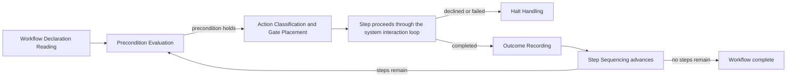

# AI Engineering Operating System

## AEOS — Workflow Engine Specification

*The permanent statement of the specified, observable behavior of the Workflow Engine.*

| Field | Value |
| :--- | :--- |
| **Document** | Workflow Engine Specification |
| **Product** | AI Engineering Operating System (AEOS) |
| **Document ID** | AEOS-SPEC-WFL |
| **Version** | 1.0.0 |
| **Status** | Freeze candidate |
| **Owner** | Product Owner, AEOS |
| **Author** | Chief Specification Architect, AEOS |
| **Audience** | Architects, implementers, reviewers, test authors, and AI runtimes consuming this repository |
| **Suggested path** | `docs/specification/WORKFLOW_ENGINE_SPECIFICATION.md` |
| **Companion documents** | `AEOS_VISION.md` (AEOS-VISION) · `AEOS_PRODUCT_REQUIREMENTS.md` (AEOS-PRD) · `AEOS_GLOSSARY.md` (AEOS-GLOSSARY) · `AEOS_DOCUMENT_STANDARD.md` (AEOS-DOCSTD) · `AEOS_ARCHITECTURE.md` (AEOS-ARCH) · `AEOS_BLUEPRINT.md` (AEOS-BLUEPRINT) · `AEOS_SPECIFICATION_STANDARD.md` (AEOS-SPECSTD) · `AEOS_SPEC.md` (AEOS-SPEC) |
| **Supersedes** | None |
| **Area code** | `WFL` |

> **Authority of this document.**
> This document specifies, precisely and testably, the **observable behavior of the Workflow
> Engine** — the responsibility AEOS-GLOSSARY reserves under that name and AEOS-ARCH Section 4.4
> assigns to the Workflow Layer, arranged by AEOS-BLUEPRINT Section 8 as the Workflow Blueprint
> (`BP-WFL`). It registers the `WFL` behavior domain under AEOS-SPECSTD Section 11.4 and attaches at
> the `EPS-2` extension point AEOS-SPEC Section 8.1 declares for exactly this domain.
>
> It defines no vision, no product requirement, no terminology, no architecture, no Blueprint
> arrangement, no interface, no algorithm, no technology, and no implementation. It redefines
> nothing stated by AEOS-VISION, AEOS-PRD, AEOS-GLOSSARY, AEOS-ARCH, AEOS-BLUEPRINT, or AEOS-SPEC;
> where a statement here appears to, that is a defect in this document and MUST be reported rather
> than acted upon. It sits below AEOS-PRD, AEOS-ARCH, and AEOS-BLUEPRINT, and beside AEOS-SPEC,
> whose `SP-SYS-001` through `SP-SYS-015`, `SP-SYS-020`, `SP-SYS-028`, `SP-SYS-030` through
> `SP-SYS-033`, and `SP-SYS-050` it depends upon and does not restate. It is written entirely under
> AEOS-SPECSTD, which governs its form, structure, identifier convention, traceability, and
> lifecycle; where this document and AEOS-SPECSTD both speak to a subject, AEOS-SPECSTD governs the
> form and this document governs the content of the `WFL` behavior domain. Where this document and a
> document of higher authority both speak to the same subject, the higher-authority document governs
> and the conflict is a defect to be reported.

> The key words **MUST**, **MUST NOT**, **SHOULD**, **SHOULD NOT**, and **MAY** in this document are
> to be interpreted as described in RFC 2119 and RFC 8174, and carry their normative meaning only
> when they appear in all capitals.

---

## Table of Contents

1. [Purpose](#1-purpose)
2. [Scope](#2-scope)
3. [Responsibilities](#3-responsibilities)
4. [Inputs](#4-inputs)
5. [Outputs](#5-outputs)
6. [Behavior](#6-behavior)
7. [Constraints](#7-constraints)
8. [Extension Points](#8-extension-points)
9. [Traceability](#9-traceability)
10. [Non-goals](#10-non-goals)
11. [References](#11-references)
12. [Document Governance](#12-document-governance)
13. [Appendix A — SP-WFL Rule Index](#appendix-a--sp-wfl-rule-index)

---

## 1. Purpose

AEOS-ARCH states that the Workflow Layer exists to sequence engineering work and to hold every point
at which a human decides, and that in doing so it discharges the responsibility AEOS-GLOSSARY
reserves under the name **Workflow Engine**: executing Workflow declarations incrementally, holding
each consequential step to its Approval Gate, and maintaining Workflow State across interruption.
AEOS-BLUEPRINT arranges that layer into eleven subsystems — Workflow Declaration Reading, Step
Sequencing, Precondition Evaluation, Action Classification, Gate Placement, Rule Application, Skill
Composition, Cycle Position Keeping, Capability Requirement Declaration, Outcome Recording, and Halt
Handling — and states the boundaries between them. Neither document is precise enough to determine
whether a given sequencing, classification, gate placement, or recorded outcome is correct, and
neither should be: that precision belongs to the Specification layer, which AEOS-SPECSTD governs and
AEOS-SPEC's `SYS` domain reserves as `EPS-2` for exactly this purpose.

This document is that domain-specific Specification. It states, rule by rule, what the Workflow
Engine must do wherever a Workflow is sequenced: how a declaration is interpreted, how a step's
precondition is evaluated, how an intended effect is classified and gated, where a Rule or Skill
applies, how position within an active TDD Cycle is held, what a step declares of a Runtime, what a
completed, partial, or failed step contributes to Workflow State, and how a decline or a failure
halts the sequence. It states nothing about how sequencing, classification, or recording is
mechanically carried out; that question belongs to Implementation Guides once they exist for this
domain.

Precision matters here specifically because the Workflow Layer is, per AEOS-ARCH Section 3, the one
point of supervision in AEOS: every consequential action reaches effect only through a path this
domain sequences and gates. AEOS-PRD's `PR-WFL` requirements and AEOS-ARCH's One Point of Supervision
principle already establish that every consequential step is held to its gate and that a decline or
failure halts the sequence without side effects; this document is where those obligations become a
set of rules a reviewer or a test can check without asking the author what was meant.

---

## 2. Scope

### 2.1 Behavior Domain and Area Registration

This document registers the area code `WFL` under AEOS-SPECSTD Section 11.4, matching the `PR-WFL`
requirement prefix and the `BP-WFL` Blueprint arrangement, consistent with that section's
recommendation. The `WFL` behavior domain is the observable behavior of the Workflow Layer AEOS-ARCH
Section 4.4 defines and the Workflow Blueprint AEOS-BLUEPRINT Section 8 arranges: the interpretation
of a Workflow declaration, the sequencing of its steps, the evaluation of preconditions, the
classification of intended effects, the placement of Approval Gates, the application of Rules and the
composition of Skills, the keeping of position within an active TDD Cycle, the declaration of a
step's Engineering Capability requirement, the recording of outcomes, and the halting of a sequence
on decline or failure.

The eleven subsystems AEOS-BLUEPRINT Section 8.2 names — Workflow Declaration Reading, Step
Sequencing, Precondition Evaluation, Action Classification, Gate Placement, Rule Application, Skill
Composition, Cycle Position Keeping, Capability Requirement Declaration, Outcome Recording, and Halt
Handling — are this document's complete organizing structure. This document introduces no subsystem
beyond those eleven, consistent with AEOS-BLUEPRINT `BP-GOV-010`, and relocates none of them,
consistent with `BP-GOV-009`.

> **On the `WF-` asset prefix, non-normative.** AEOS-GLOSSARY Section 6.4 reserves the identifier
> shape `WF-<AREA>-<NNN>` for a Workflow declaration itself, as a Repository Asset kind. That prefix
> and this document's `SP-WFL-<NNN>` prefix name different things — a declared Workflow instance
> against a specified rule of this behavior domain — and MUST NOT be conflated.

### 2.2 Attachment to the System Specification

This document attaches at the `EPS-2` extension point AEOS-SPEC Section 8.1 declares for the Workflow
behavior domain. Consistent with `SP-SYS-EXT-1`, it registers `WFL` and does not reuse `SYS`.
Consistent with `SP-SYS-EXT-2`, it cites rather than restates the `SP-SYS` rules it depends on; that
declaration is stated in full in [Section 7.5](#75-declared-dependencies). Consistent with
`SP-SYS-EXT-3`, no rule in this document contradicts a rule AEOS-SPEC Section 6 or Section 7 states,
and in particular none narrows, widens, or restates `SP-SYS-001` through `SP-SYS-015` or `SP-SYS-030`
through `SP-SYS-033`, which `EPS-2` fixes as the boundary this document must not disturb.

### 2.3 Boundary of This Document

This document specifies the behavior of the Workflow Engine alone. It does not specify how a step's
declared context need is resolved, which the Context behavior domain owns; how a decision is
collected from a person, or how a Proposal, an Explanation, a Status, or a Report is assembled and
presented, which the Human Interaction behavior domain owns; how a step's capability requirement is
matched against a Runtime, which the Runtime coordination behavior domain owns; how an approved
effect is performed or an Environment is observed, which the Execution behavior domain owns; or how a
Workflow declaration, a Rule, a Skill, or Workflow State is stored, versioned, or durably written,
which the Repository behavior domain owns. The resulting exclusions are stated in full in
[Section 10](#10-non-goals).

---

## 3. Responsibilities

This Specification is answerable for:

- The interpretation of a Workflow declaration into the steps, preconditions, gates, and success
  criteria it states, without reference to any Runtime.
- The sequencing of a Workflow's steps one verifiable step at a time, and the evaluation of each
  step's precondition before it begins.
- The classification of every intended effect into an Action Class, and the placement of the
  Approval Gate that class requires.
- The application of Rules at their declared scope, and the composition of Skills at their declared
  point, with both inspectable and attributable on request.
- The keeping of a Workflow's position within an active TDD Cycle, and the treatment of departure
  from that cycle as an explicit, acknowledged exception.
- The declaration, in neutral vocabulary, of the Engineering Capability each step requires.
- The determination of what a completed, partially completed, or failed step contributes to Workflow
  State, and causing that contribution to be durably recorded.
- The halting of a Workflow's progression on a declined Proposal or a failed step, and the
  preservation of a describable state at every halt and at every pause.
- The visibility of a Workflow's current position — completed steps, current step, and outstanding
  decisions — on request.
- The isolation of the Workflow Engine's behavior from any Runtime, Vendor, Model, or Platform, and
  its confinement to the counterparties AEOS-ARCH Section 5.3 permits it to address.

This Specification is **not** answerable for:

- The selection or composition of Context for a step, or the justification of that selection —
  owned by the Context behavior domain.
- The assembly of a Proposal, an Explanation, a Status, or a Report, or the collection of a human
  decision — owned by the Human Interaction behavior domain and stated at the system level by
  `SP-SYS-004` through `SP-SYS-007`.
- The matching of a step's declared capability requirement against a selected Runtime, or the
  custody of that selection — owned by the Runtime coordination behavior domain.
- The performance of an approved effect, or the observation of the Environment before or after it —
  owned by the Execution behavior domain.
- The storage, versioning, or durable custody of a Workflow declaration, a Rule, a Skill, or
  Workflow State itself — owned by the Repository behavior domain.
- The retrying of a request mediated to a Runtime, or the surfacing of a fault from that mediation —
  owned by the Runtime coordination and Adapter behavior domains and bounded at the system level by
  `SP-SYS-027`.
- The content, wording, or authorship of a Workflow declaration, a Rule, or a Skill itself — owned
  by the project that declares it, as a Repository Asset under AEOS-PRD `C3`, `C7`, and `C8`.
- Any structural decision, subsystem boundary, or dependency direction — owned by AEOS-ARCH and
  AEOS-BLUEPRINT.
- Any data structure, interface, storage mechanism, process model, or algorithm realizing the
  behavior below — owned by Implementation Guides, which do not yet exist for this domain.

---

## 4. Inputs

The inputs below are the material every rule in [Section 6](#6-behavior) operates on. An input's
validity condition is part of the behavior this document specifies; an invalid input is a defined
condition, not an unhandled one.

| Input | Required properties | Valid when | Invalid when |
| :--- | :--- | :--- | :--- |
| Workflow declaration | A versioned Repository Asset stating steps, preconditions, gates, and success criteria | Declared, inspectable, and interpretable without reference to any Runtime | Unversioned, uninspectable, or interpretable only with reference to a specific Runtime |
| Step precondition | A stated condition determining whether a step may begin | Evaluable against Environment or Repository observation already reported to this domain | Unevaluable, or dependent on a state this domain has not received as a report |
| Applicable Rule | A versioned, scoped Repository Asset stating an engineering constraint and its application point | The declared scope identifies the point at which it applies | The scope is absent, or does not identify an application point |
| Applicable Skill | A versioned, reusable, runtime-independent packaged procedure | The declared composition point identifies where it composes into a step | The composition point is absent |
| Automation Grant (optional) | An explicit, scoped, recorded, revocable delegation of approval authority | Its scope covers the Action Class of the intended effect and that class is not Destructive | Its scope does not cover the intended effect's Action Class, it covers a Destructive effect, or it has been revoked |
| Collected decision (from the Human Interaction behavior domain) | An explicit act answering exactly one outstanding gate for one step | Explicit, and answering the specific step's gate | Silent, ambiguous, inferred, or answering a different step's gate |
| Composed result (from the Context behavior domain) | The selection and justification composed for the requesting step | Scoped to the step that requested it | Scoped to a different step, or not composed for the requesting step at all |
| Capability fit and delegated outcome (from the Runtime coordination behavior domain) | A report of what a selected Runtime can and cannot satisfy of a step's declared requirement, and the outcome of delegated work | Scoped to the step's declared requirement | Scoped beyond the step's declared requirement, or presented as authorizing an action |
| Environment observation and applied-effect outcome (from the Execution behavior domain) | A report distinguished as observed fact or as inference | The distinction is stated | The distinction is absent |
| Recorded Workflow State (read from the Repository behavior domain) | The durable record of a Workflow's position | Consistent with the repository's current state | Diverges from the repository's current state |

---

## 5. Outputs

The outputs below describe externally observable, contractual behavior — what a counterparty
receives and can rely on — not the internal artifact or mechanism that produces it. An
implementation MAY realize an output through any internal form; this document constrains only what
the output must observably be.

| Output | Content | Produced when |
| :--- | :--- | :--- |
| Declared context need | The Context a named step requires | Whenever a step's processing requires Context |
| Capability requirement declaration | The Engineering Capability a step requires, stated in vocabulary neutral to any Runtime | Before a step begins |
| Classified, gated intended effect | A step's intended effect, its assigned Action Class, and the position of the Approval Gate it requires | Whenever Action Classification and Gate Placement complete for a step's intended effect |
| Effect approved for performance | A step's intended effect, exactly as approved, together with its associated decision record | Only after a decision returns approval |
| Outcome contribution | What a completed, partially completed, or failed step contributes to Workflow State | Following every step's completion, partial completion, or failure |
| Halt state | The point at which a Workflow's progression stopped, and the reason | Whenever Halt Handling applies |
| Workflow State snapshot | A Workflow's completed steps, current step, and outstanding decisions | On request, and at every step boundary |

---

## 6. Behavior

Each rule below is independently testable: a reviewer or an automated test can determine compliance
from the rule's text alone, without consulting this document's author, per AEOS-SPECSTD `NL3`. A
rule's own pass/fail condition is its acceptance criterion, satisfying `MD9`.

### 6.1 The Workflow Lifecycle

A Workflow's step passes through the subsystems AEOS-BLUEPRINT Section 8.2 names, engaging the system
interaction loop AEOS-SPEC Section 6.1 states once per step. This document does not restate that
loop; the diagram below shows only where the subsystems this domain owns sit around it.

Nothing about a step is held by the Workflow Engine once Outcome Recording has caused that step's
outcome to be durably recorded: this is the point at which the Workflow Engine's involvement with
that step ends. [Section 7.1](#71-custody-and-non-retention-constraints) states this boundary
normatively; [Section 7.7](#77-workflow-custody) explains it further.

### 6.2 Workflow Declaration Reading

> **On this section, non-normative.** This section is this domain's testable realization of
> AEOS-GLOSSARY's Workflow definition and of `PR-WFL-001` through `PR-WFL-003`. It states nothing
> about what a Workflow declaration may contain beyond what those documents already establish.

| ID | Rule | Traces to |
| :--- | :--- | :--- |
| `SP-WFL-001` | Before a Workflow's steps may be sequenced, Workflow Declaration Reading MUST interpret the Workflow's declaration into the steps, preconditions, gates, and success criteria the declaration states. | `PR-WFL-001` |
| `SP-WFL-002` | A Workflow declaration MUST be read from its declared, versioned form as a Repository Asset, and MUST NOT be read from any other form. | `PR-WFL-002` |
| `SP-WFL-003` | Workflow Declaration Reading MUST interpret a declaration without reference to any Runtime, and the interpretation MUST NOT differ according to which Runtime is later selected. | `PR-WFL-003` |
| `SP-WFL-004` | Where a declaration states a step's precondition, gate, or success criterion such that Precondition Evaluation or Gate Placement cannot proceed deterministically, the Workflow Engine MUST report the condition as unresolved and MUST NOT proceed on an assumed reading. | `PR-SAF-002` |

### 6.3 Step Sequencing, Preconditions, and Dependency Handling

> **On "Incremental Execution," non-normative.** AEOS-ARCH's summary of architectural guarantees
> names *Incremental Execution* as the guarantee that Workflow State is durable and maintained at
> every step boundary, making position observable and interruption safe (AEOS-ARCH Section 4.4,
> `AR-LAY-006`). The rules below, together with [Section 6.8](#68-outcome-recording)'s Outcome
> Recording rules, are this domain's testable realization of that guarantee. A step declared to
> depend on another is this domain's only notion of dependency between steps of the same Workflow;
> it states nothing about dependency between separate Workflows.

| ID | Rule | Traces to |
| :--- | :--- | :--- |
| `SP-WFL-005` | Step Sequencing MUST advance a Workflow one verifiable step at a time. | `PR-WFL-004` |
| `SP-WFL-006` | Step Sequencing MUST NOT begin a step of a Workflow while a prior step of that Workflow remains unresolved. | `PR-WFL-004` |
| `SP-WFL-007` | Precondition Evaluation MUST determine whether a step's declared precondition holds before that step begins, and a step whose precondition does not hold MUST NOT begin. | `PR-WFL-004` |
| `SP-WFL-008` | A step declared to depend on the outcome of a prior step MUST NOT begin until that prior step has completed. | `PR-WFL-010` |
| `SP-WFL-009` | Where a prior step of a Workflow has failed or its intended effect has been declined, Step Sequencing MUST NOT begin any step of that Workflow declared to depend on it. | `PR-WFL-009` · `PR-WFL-010` |

### 6.4 Action Classification and Gate Placement

| ID | Rule | Traces to |
| :--- | :--- | :--- |
| `SP-WFL-010` | Action Classification MUST assign exactly one Action Class to every intended effect a step contains, before Gate Placement for that effect occurs. | `PR-WFL-006` |
| `SP-WFL-011` | Gate Placement MUST derive the strength of the Approval Gate placed for an intended effect from that effect's Action Class, and from nothing else. | `PR-WFL-006` |
| `SP-WFL-012` | A step's intended effect MUST NOT reach the Execution behavior domain for performance, for any effect above the Observation class, without an associated decision record. | `PR-SAF-005` · `PR-WFL-015` |

### 6.5 Rule Application and Skill Composition

| ID | Rule | Traces to |
| :--- | :--- | :--- |
| `SP-WFL-013` | Rule Application MUST apply a Rule at the point its declared scope states, and MUST NOT apply it at a point chosen independently of that declared scope. | `PR-RUL-003` · `PR-RUL-005` |
| `SP-WFL-014` | An applied Rule MUST be inspectable by the user before it takes effect within a step. | `PR-RUL-009` |
| `SP-WFL-015` | The Workflow Engine MUST report, on request, which Rule was applied to a given step and why. | `PR-RUL-007` |
| `SP-WFL-016` | Skill Composition MUST compose a Skill into a step at that Skill's declared composition point, and the composition MUST be visible to the user. | `PR-SKL-006` |
| `SP-WFL-017` | The Workflow Engine MUST report, on request, which Skill was composed into a given step and why. | `PR-SKL-008` |

### 6.6 Cycle Position Keeping

| ID | Rule | Traces to |
| :--- | :--- | :--- |
| `SP-WFL-018` | Where a step falls within an active TDD Cycle, Cycle Position Keeping MUST hold that step's position within the cycle as part of Workflow State. | `PR-TDD-007` |
| `SP-WFL-019` | The Workflow Engine MUST treat departure from the TDD Cycle as an explicit exception acknowledged by a human decision, and MUST NOT apply departure as a default path. | `PR-TDD-008` · `PR-TDD-003` |

### 6.7 Capability Requirement Declaration

| ID | Rule | Traces to |
| :--- | :--- | :--- |
| `SP-WFL-020` | Capability Requirement Declaration MUST state, for each step, the Engineering Capability that step requires, in vocabulary neutral to any particular Runtime. | `PR-RUN-005` |
| `SP-WFL-021` | Capability Requirement Declaration MUST NOT state a step's requirement in terms specific to any one Runtime. | `PR-RUN-005` · `PR-RUN-006` |
| `SP-WFL-022` | Before a step begins, the Workflow Engine MUST report any part of that step's declared requirement the selected Runtime cannot satisfy. | `PR-WFL-016` |

### 6.8 Outcome Recording

| ID | Rule | Traces to |
| :--- | :--- | :--- |
| `SP-WFL-023` | Outcome Recording MUST determine, for every completed, partially completed, or failed step, what that step contributes to Workflow State. | `PR-WFL-011` |
| `SP-WFL-024` | Outcome Recording MUST record a partially completed step as distinct from a completed step. | `PR-WFL-011` |
| `SP-WFL-025` | The Workflow Engine MUST cause the outcome Outcome Recording determines for a step to be durably recorded, through the Repository behavior domain, before the next step of the same Workflow begins. | `PR-WFL-008` · `PR-WFL-011` |

### 6.9 Halt Handling

> **On this section, non-normative.** This section is this domain's realization of what a reader
> might call error handling responsibility: it states what happens when a step is declined or fails.
> It states nothing about performing a corrective or reversing action; the boundary on that is
> stated normatively in [Section 7.6](#76-boundary-on-reversal-and-retry).

| ID | Rule | Traces to |
| :--- | :--- | :--- |
| `SP-WFL-026` | Halt Handling MUST stop a Workflow's progression when a Proposal for one of its steps is declined, and MUST leave no effect of that step applied. | `PR-WFL-009` |
| `SP-WFL-027` | Halt Handling MUST stop a Workflow's progression when a step fails, MUST report the failure, and MUST NOT permit a step that depends on the failed step to begin. | `PR-WFL-010` |
| `SP-WFL-028` | A halt under this section MUST leave the Workflow in a state the Workflow Engine can describe. | `PR-SAF-010` |

### 6.10 Pause and Resume

> **On this section, non-normative.** Pause and Resume is not a named AEOS-BLUEPRINT subsystem in
> its own right; it is the product-level guarantee `PR-WFL-008` states, realized jointly by the
> position Step Sequencing holds between steps ([Section 6.3](#63-step-sequencing-preconditions-and-dependency-handling)),
> the position Cycle Position Keeping holds within an active TDD Cycle
> ([Section 6.6](#66-cycle-position-keeping)), and the durable recording Outcome Recording causes
> ([Section 6.8](#68-outcome-recording)). The rules below add only what those sections do not already
> state: that the position they establish remains available across an interruption a user chooses.

| ID | Rule | Traces to |
| :--- | :--- | :--- |
| `SP-WFL-029` | A user MUST be able to pause a Workflow between steps without loss of the Workflow's recorded position. | `PR-WFL-008` |
| `SP-WFL-030` | Resuming a paused Workflow MUST NOT require re-establishing context already recorded in Workflow State. | `PR-WFL-008` |
| `SP-WFL-031` | A paused Workflow MUST remain describable — its completed steps, its current step, and its outstanding decisions — for as long as it remains paused. | `PR-WFL-007` · `PR-WFL-008` |

### 6.11 Workflow State Visibility

| ID | Rule | Traces to |
| :--- | :--- | :--- |
| `SP-WFL-032` | The Workflow Engine MUST make a Workflow's current position — completed steps, current step, and outstanding decisions — available to the user on request. | `PR-WFL-007` |

---

## 7. Constraints

The invariants below MUST hold before, during, and after every behavior stated in
[Section 6](#6-behavior).

### 7.1 Custody and Non-Retention Constraints

> **On Workflow State custody, non-normative.** `SP-WFL-025` already fixes that a step's outcome is
> caused to be durably recorded through the Repository behavior domain rather than held by the
> Workflow Engine. This note names the pattern explicitly so a reader need not infer it from a
> single rule; [Section 7.7](#77-workflow-custody) draws it together with the related rules stated
> elsewhere in this document.

| ID | Rule | Traces to |
| :--- | :--- | :--- |
| `SP-WFL-033` | The Workflow Engine MUST hold Workflow State through the Repository behavior domain, and MUST NOT hold it within itself. | `PR-WFL-008` |
| `SP-WFL-034` | The Workflow Engine MUST hold no durable state of any kind beyond what a step's own processing requires while that step is unresolved. | `PR-REP-002` · `PR-SAF-010` |

### 7.2 Independence Constraints

| ID | Rule | Traces to |
| :--- | :--- | :--- |
| `SP-WFL-035` | The Workflow Engine MUST hold no knowledge of any Runtime, Vendor, Model, or Platform. | `PR-RUN-005` · `PR-RUN-006` |
| `SP-WFL-036` | The Workflow Engine MUST NOT address the Adapter behavior domain or the External AI boundary directly. | `PR-NFR-006` · `PR-NFR-007` |
| `SP-WFL-037` | The Workflow Engine MUST NOT perform an effect itself; performance belongs to the Execution behavior domain. | `PR-NFR-006` |
| `SP-WFL-038` | The Workflow Engine MUST NOT select Context itself; selection belongs to the Context behavior domain. | `PR-NFR-006` |

### 7.3 Sole Supervision and Structural Constraints

| ID | Rule | Traces to |
| :--- | :--- | :--- |
| `SP-WFL-039` | The Workflow Engine MUST be the only point at which an Approval Gate is placed. | `PR-WFL-005` · `PR-WFL-006` |

> **On multi-domain dependency, non-normative.** Per AEOS-BLUEPRINT `BP-WFL-016`, the Workflow
> Blueprint is the only layer AEOS-BLUEPRINT permits to depend on more than one tier-2 layer at
> once. This is a structural permission the Workflow Engine's behavior relies on — it is what
> allows the Inputs in [Section 4](#4-inputs) to be read from the Context, Runtime coordination,
> Execution, and Repository behavior domains at once — and not itself a testable obligation of this
> domain's own behavior; it is recorded here as orientation rather than as a numbered rule.

### 7.4 Non-Functional Constraints

| ID | Rule | Traces to |
| :--- | :--- | :--- |
| `SP-WFL-040` | Every rule in [Section 6](#6-behavior) MUST be verifiable in isolation, with the Context, Runtime coordination, Execution, Human Interaction, and Repository behavior domains replaceable at the point the Workflow Engine reaches them, for the purpose of that verification. | `PR-NFR-010` |
| `SP-WFL-041` | Behavior specified in [Section 6](#6-behavior) MUST be identical on every supported Platform. | `PR-PLT-003` · `PR-PLT-006` |
| `SP-WFL-042` | The Workflow Engine MUST make a classification, a gate placement, an applied Rule, a composed Skill, or a recorded outcome explainable to the user on request. | `PR-NFR-001` |

### 7.5 Declared Dependencies

Per AEOS-SPECSTD `DP1`, this document declares its dependency on the following rules of AEOS-SPEC's
`SYS` behavior domain explicitly, by identifier, rather than restating them:

| Dependency | States | Why this domain depends on it |
| :--- | :--- | :--- |
| `SP-SYS-001` through `SP-SYS-008` | The system interaction loop: Inspect, Explain, Propose, Confirm, Execute, Report, in that order, for every action above Observation. | [Section 6.4](#64-action-classification-and-gate-placement)'s classification and gate placement determine which loop applies to a step's intended effect; this domain sequences the step through that loop without restating its phases. |
| `SP-SYS-009` through `SP-SYS-015` | Action Class assignment, Destructive confirmation, External-effect disclosure, halt on decline or failure, and Automation Grant behavior. | `SP-WFL-010` through `SP-WFL-012` and `SP-WFL-026` through `SP-WFL-027` are this domain's realization of these rules for a Workflow's steps. |
| `SP-SYS-020` | A durable write to the repository is performed only as the outcome of an approved action, and every such write is reported. | `SP-WFL-025` relies on this rule to state that the durable write it causes is itself governed and reported. |
| `SP-SYS-028` | Before a Workflow step begins, AEOS reports any part of that step the selected Runtime cannot satisfy. | `SP-WFL-022` is this domain's realization of this rule. |
| `SP-SYS-030` through `SP-SYS-033` | Failing-test-first, verified failure reason, explicit cycle-departure exception, and test-failure halt. | `SP-WFL-018` and `SP-WFL-019` state this domain's position-keeping and departure-exception obligations without restating the testing behavior itself. |
| `SP-SYS-050` | An interruption at any point in the interaction loop leaves the project in a describable state. | `SP-WFL-028` and `SP-WFL-031` rely on this rule for what a halt and a pause must each leave behind. |

Consistent with AEOS-SPECSTD `DP4`, each dependency above is stated behaviorally: what must already
hold, not which document, technology, or component makes it hold. Consistent with `DP2`, no rule in
[Section 6](#6-behavior) or elsewhere in this document presumes an unstated precondition from
`SP-SYS`; every precondition this domain relies on is named in this table.

### 7.6 Boundary on Reversal and Retry

| ID | Rule | Traces to |
| :--- | :--- | :--- |
| `SP-WFL-043` | The Workflow Engine MUST NOT reverse an already-applied effect automatically; a reversal of an applied effect MUST be classified, gated, and confirmed as a new intended effect under [Section 6.4](#64-action-classification-and-gate-placement), like any other. | `PR-SAF-004` · `PR-SAF-005` |
| `SP-WFL-044` | The Workflow Engine MUST NOT retry a step's request mediated to a Runtime; a fault surfaced from the Runtime coordination behavior domain MUST be handled as a failed step under [Section 6.9](#69-halt-handling). | `PR-RUN-011` · `PR-WFL-010` |

### 7.7 Workflow Custody

**This section is non-normative.** It draws together, in one place, what [Section 6](#6-behavior)
and [Sections 7.1](#71-custody-and-non-retention-constraints) through
[7.4](#74-non-functional-constraints) already require about who holds a step's classification, its
gate, and its recorded outcome, and when that changes. It states no obligation beyond those
already-normative rules. The word *custody* is used in the sense AEOS-ARCH and AEOS-BLUEPRINT already
give it for Repository Asset custody, Workflow State custody, and Selection Custody, rather than as a
new term.

While a step is unresolved, the Workflow Engine is its sole holder: no other functional area
sequences it, classifies it, or gates it, consistent with `SP-WFL-039`'s sole-gate constraint.
Holding transfers, for the step's outcome, to the Repository behavior domain at the moment
`SP-WFL-025` causes that outcome to be durably recorded, and at no other moment; from that point the
Workflow Engine holds nothing of that step, per `SP-WFL-033` and `SP-WFL-034`. A paused Workflow is
not an exception to this: the position `SP-WFL-029` through `SP-WFL-031` require pause to preserve is
already held by the Repository behavior domain through the same durable recording, not retained by
the Workflow Engine across the pause. At no point does more than one functional area hold the same
step's unresolved classification or gate at once.

---

## 8. Extension Points

`SS-P-09` requires that extension of a Specification be additive; frozen behavior is never silently
altered. This document's ordinary extension mechanism is the addition of new `SP-WFL-<NNN>`
identifiers under AEOS-SPECSTD Section 18.1. Beyond that ordinary mechanism, this document declares
four extension points at which a project is intended to extend this domain's behavior without
altering what [Section 6](#6-behavior) and [Section 7](#7-constraints) already fix. These four points
are exactly the four AEOS-BLUEPRINT Section 8.7 names for the Workflow Blueprint; this document
introduces none beyond them, consistent with `BP-GOV-010`.

### 8.1 Workflow Extension Points

| ID | Extension point | What is added | Boundary — MUST NOT change |
| :--- | :--- | :--- | :--- |
| `EPW-1` | Workflow admission | A project-defined Workflow declaration. | The gate placement `SP-WFL-011` requires, the Action Class assignment `SP-WFL-010` requires, and the halt behavior `SP-WFL-026` and `SP-WFL-027` require. |
| `EPW-2` | Rule application point | A Rule with a declared scope and application point. | The inspectability `SP-WFL-014` requires. |
| `EPW-3` | Skill application point | A Skill composed into a step. | The visibility and attributability `SP-WFL-016` and `SP-WFL-017` require. |
| `EPW-4` | Lifecycle stage coverage | A Workflow covering a stage of the engineering lifecycle. | That every consequential step of that Workflow retains its Approval Gate, per `SP-WFL-039`. |

### 8.2 Rules Governing These Extension Points

| # | Rule | Traces to |
| :--- | :--- | :--- |
| `SP-WFL-EXT-1` | An extension admitted at `EPW-1`, `EPW-2`, `EPW-3`, or `EPW-4` MUST be admitted as an additive declaration and MUST NOT require a change to [Section 6](#6-behavior) or [Section 7](#7-constraints) of this document. | `PR-NFR-007` |
| `SP-WFL-EXT-2` | An admission at `EPW-1` MUST NOT alter the gate placement, Action Class assignment, or halt behavior `SP-WFL-010`, `SP-WFL-011`, `SP-WFL-026`, and `SP-WFL-027` require. | `PR-WFL-013` · `PR-SAF-003` |
| `SP-WFL-EXT-3` | An admission at `EPW-2` MUST NOT relax the inspectability `SP-WFL-014` requires. | `PR-RUL-009` |
| `SP-WFL-EXT-4` | An admission at `EPW-3` MUST NOT relax the visibility or attributability `SP-WFL-016` and `SP-WFL-017` require. | `PR-SKL-006` · `PR-SKL-008` |
| `SP-WFL-EXT-5` | An admission at `EPW-4` MUST NOT omit an Approval Gate from a consequential step. | `PR-WFL-005` · `PR-WFL-006` |

---

## 9. Traceability

Every rule in [Section 6](#6-behavior), [Section 7](#7-constraints), and
[Section 8.2](#82-rules-governing-these-extension-points) traces to one or more `PR-` identifiers,
per AEOS-SPECSTD `TR1`. The complete rule-by-rule trace is
[Appendix A](#appendix-a--sp-wfl-rule-index).

### 9.1 Trace Density by `PR-` Prefix

| `PR-` prefix | Rules in this document that trace to it |
| :--- | :--- |
| `PR-WFL` | `SP-WFL-001` through `SP-WFL-003` · `SP-WFL-005` through `SP-WFL-012` · `SP-WFL-022` through `SP-WFL-027` · `SP-WFL-029` through `SP-WFL-033` · `SP-WFL-039` · `SP-WFL-044` · `SP-WFL-EXT-2` · `SP-WFL-EXT-5` |
| `PR-SAF` | `SP-WFL-004` · `SP-WFL-012` · `SP-WFL-028` · `SP-WFL-034` · `SP-WFL-043` · `SP-WFL-EXT-2` |
| `PR-RUL` | `SP-WFL-013` through `SP-WFL-015` · `SP-WFL-EXT-3` |
| `PR-SKL` | `SP-WFL-016` · `SP-WFL-017` · `SP-WFL-EXT-4` |
| `PR-TDD` | `SP-WFL-018` · `SP-WFL-019` |
| `PR-RUN` | `SP-WFL-020` · `SP-WFL-021` · `SP-WFL-035` · `SP-WFL-044` |
| `PR-REP` | `SP-WFL-034` |
| `PR-NFR` | `SP-WFL-036` through `SP-WFL-038` · `SP-WFL-040` · `SP-WFL-042` · `SP-WFL-EXT-1` |
| `PR-PLT` | `SP-WFL-041` |

No rule in this document lacks a trace, and no rule traces to a requirement this document does not
cite by identifier, consistent with AEOS-SPECSTD `TR1` and `TR4`.

### 9.2 Grounding in Architecture and Blueprint Identifiers

Per AEOS-BLUEPRINT `BP-GOV-008`, this document traces to at least one Blueprint identifier and to at
least one `PR-` identifier. This document is written against the complete `BP-WFL-001` through
`BP-WFL-016` arrangement AEOS-BLUEPRINT Section 8.8 states; every rule in
[Section 6](#6-behavior) and [Section 7](#7-constraints) realizes one or more of those Blueprint
rules as testable behavior, without restating them.

This document's Constraints are additionally grounded in the following AEOS-ARCH invariants, cited
for orientation and not restated: `AR-LAY-006` grounds
[Section 7.1](#71-custody-and-non-retention-constraints); `AR-BND-005` and `AR-DEP-004` ground
[Section 7.2](#72-independence-constraints), together with the prohibited responsibilities
AEOS-ARCH Section 4.4 states for the Workflow Layer; `AR-BND-003`, `AR-PRN-004`, and `AR-LAY-009`
ground [Section 7.3](#73-sole-supervision-and-structural-constraints); `AR-LAY-008` grounds
`SP-WFL-040`; `AR-LAY-007` grounds `SP-WFL-041`; and `AR-BND-014` grounds `SP-WFL-043`.

### 9.3 Downstream Traceability

Downstream documents — Implementation Guides, tests, issues, and pull requests — reference the
`SP-WFL-<NNN>` identifiers they realize or affect, consistent with AEOS-SPECSTD `TR5`.

---

## 10. Non-goals

This document deliberately does not cover the following. Each is a reasonable expectation a reader
might expect this domain to cover, which it deliberately does not, stated here so a reader does not
search for it.

| Non-goal | Why it is out of scope | Where it belongs |
| :--- | :--- | :--- |
| Selection or composition of Context for a step, and the justification of that selection | Owned by the Context behavior domain, reserved as `EPS-3` in AEOS-SPEC | The Context Router Specification |
| Assembly of a Proposal, an Explanation, a Status, or a Report, and the collection of a human decision | Owned by the Human Interaction behavior domain, reserved as `EPS-7` in AEOS-SPEC | Future Human Interaction behavior Specification |
| Matching a step's declared capability requirement against a selected Runtime, and the custody of that selection | Owned by the Runtime coordination behavior domain, reserved as `EPS-4` in AEOS-SPEC | Future Runtime coordination behavior Specification |
| Performance of an approved effect, and observation of the Environment before or after it | Owned by the Execution behavior domain, reserved as `EPS-6` in AEOS-SPEC | Future Execution behavior Specification |
| Storage, versioning, or durable custody of a Workflow declaration, a Rule, a Skill, or Workflow State itself | Owned by the Repository behavior domain, reserved as `EPS-1` in AEOS-SPEC | Future Repository behavior Specification |
| Retrying a request mediated to a Runtime, or surfacing a fault from that mediation | Owned by the Runtime coordination and Adapter behavior domains, bounded at the system level by `SP-SYS-027` | Future Runtime coordination and Adapter behavior Specifications |
| Automatic reversal of an already-applied effect | Not established by any `PR-` requirement; `SP-WFL-043` fixes that any reversal is a newly classified, gated, and confirmed effect, not an automated mechanism | A future AEOS-PRD capability, should one be defined |
| Composition of a Workflow from other Workflows, or the execution of one Workflow nested within another | No `PR-` requirement or `BP-WFL` arrangement establishes this behavior | A future AEOS-PRD capability and a corresponding `BP-WFL` extension, reported to AEOS-PRD and AEOS-BLUEPRINT governance |
| The content, wording, or authorship of a Workflow declaration, a Rule, or a Skill | Owned by the project that declares it, as a Repository Asset under AEOS-PRD `C3`, `C7`, and `C8` | The project's own Repository Assets |
| A sequencing mechanism, scheduling method, storage technology, or execution algorithm realizing this domain's behavior | Prohibited to the Specification layer by AEOS-SPECSTD `MN1`–`MN3` | Implementation Guides, AEOS-TECH |
| Interfaces, endpoints, request or response schemas, wire formats | Prohibited to the Specification layer by AEOS-SPECSTD `MN4` | Implementation Guides |
| Data structures, classes, modules, file layouts | Prohibited to the Specification layer by AEOS-SPECSTD `MN1` | Implementation Guides |
| Installation, deployment, or environment-preparation procedure | Prohibited to the Specification layer by AEOS-SPECSTD `MN5` | Runtime documents, Developer Guides |
| Rationale for why any rule above exists | Prohibited to the Specification layer by AEOS-SPECSTD `MN6` | AEOS-VISION, AEOS-PRD |
| Structural decisions, subsystem boundaries, or dependency direction | Owned by AEOS-ARCH and AEOS-BLUEPRINT | AEOS-ARCH, AEOS-BLUEPRINT |
| Test procedures, test plans, or test cases | Outside AEOS-SPECSTD's scope, per its Section 2.2 note on testing artifacts | A future Test Specification layer |

---

## 11. References

| Reference | Cited for |
| :--- | :--- |
| AEOS-VISION | Invariants V1, V2, V3, V4, V6, V7, V9, and V10, underlying the supervision, independence, and inspectability posture this document specifies behaviorally |
| AEOS-PRD Section 9 | The engineering lifecycle stages this document's behavior serves |
| AEOS-PRD Section 10 | The interaction loop, Action Classes, and Automation Grants this document's Section 6.4 realizes for a Workflow's steps |
| AEOS-PRD Section 18.3 | Every `PR-WFL` identifier this document traces to |
| AEOS-PRD Section 18 | Every other `PR-` identifier this document traces to |
| AEOS-PRD Section 19 | The `PR-NFR` quality attributes cited in Section 7.4 |
| AEOS-GLOSSARY | The definitions of every capitalized term used in this document, including *Workflow*, *Workflow Engine*, *Workflow State*, *Approval Gate*, *Action Class*, *Automation Grant*, *TDD Cycle*, and *Engineering Capability* |
| AEOS-DOCSTD | The form, structure, and lifecycle this document, like every AEOS document, follows |
| AEOS-ARCH Section 3 | The One Point of Supervision principle Section 7.3 specifies behaviorally |
| AEOS-ARCH Section 4.4 | The Workflow Layer's purpose, responsibilities, owned concepts, dependencies, and prohibited responsibilities this document specifies precisely |
| AEOS-ARCH Section 5.3 | The permitted-interaction rule confining the Workflow Engine to the counterparties named in Section 7.2 |
| AEOS-ARCH Section 8 | The `AR-` invariants cited in Section 9.2 |
| AEOS-BLUEPRINT Section 8 | The Workflow Blueprint (`BP-WFL`), its eleven subsystems, and its sixteen rules this document is written against |
| AEOS-BLUEPRINT Section 17 | The Blueprint/Specification boundary this document is written against |
| AEOS-SPECSTD | The Specification Standard this document is written entirely under |
| AEOS-SPEC Section 8.1 | The `EPS-2` extension point this document attaches at |
| AEOS-SPEC Sections 6.1–6.5 | `SP-SYS-001` through `SP-SYS-015`, `SP-SYS-020`, `SP-SYS-028`, and `SP-SYS-030` through `SP-SYS-033`, declared as dependencies in Section 7.5 |
| AEOS-SPEC Section 7.2 | `SP-SYS-050`, declared as a dependency in Section 7.5 |

---

## 12. Document Governance

### 12.1 Status

This document is a Specification-layer document of the AEOS repository, attaching at `EPS-2` of
AEOS-SPEC, and is intended to be frozen as part of the AEOS 1.0 release alongside AEOS-VISION,
AEOS-PRD, AEOS-GLOSSARY, AEOS-DOCSTD, AEOS-ARCH, AEOS-BLUEPRINT, AEOS-SPECSTD, AEOS-SPEC, and the
Context Router Specification (AEOS-SPEC-CTX).

### 12.2 Change Control

This document's change control follows AEOS-SPECSTD Section 18.1 without modification, applied to
the `WFL` behavior domain.

| Increment | When |
| :--- | :--- |
| **Patch** | Editorial correction with no change to a specified rule's meaning or trace. |
| **Minor** | Addition of a new `SP-WFL-<NNN>` identifier that does not alter what an existing identifier requires. |
| **Major** | Any change to what an existing `SP-WFL-<NNN>` identifier requires; retirement of an identifier; a change to the `WFL` area code, ownership, or declared behavior domain; addition or removal of an `EPW-` extension point; or any change that would invalidate a downstream Implementation Guide, Runtime document, or test written against the prior version. |

### 12.3 Review Policy

Reviews of this document classify findings as **Critical**, **Major**, **Minor**, or **Nitpick**,
identify inconsistencies without redesigning, and apply the AEOS-SPECSTD Section 19.2 freeze
checklist before recommending freeze, per AEOS-DOCSTD Section 12.3 and 12.4.

### 12.4 Precedence

| Situation | Resolution |
| :--- | :--- |
| This document conflicts with AEOS-VISION, AEOS-PRD, AEOS-GLOSSARY, AEOS-ARCH, or AEOS-BLUEPRINT | The higher-authority document governs. The conflict is a defect in this document and is reported rather than acted upon. |
| This document conflicts with AEOS-SPEC on a rule `EPS-2` fixes as a boundary | AEOS-SPEC governs. The conflict is a defect in this document and is reported. |
| This document conflicts with AEOS-SPECSTD on form, identifier convention, traceability, or lifecycle | AEOS-SPECSTD governs. This document is corrected. |
| This document conflicts with AEOS-SPECSTD on the content of the `WFL` behavior domain | This document governs its own content, per AEOS-SPECSTD Section 20.7. |
| This document conflicts with the Context Router Specification (AEOS-SPEC-CTX) on a matter neither document's declared boundary resolves | Escalated to the owner, per AEOS-SPECSTD Section 15.2 `DP6`. Neither document resolves it by local reinterpretation. |
| A future Specification attaching at a different `EPS-` extension point states a dependency on this document that this document does not confirm | The apparent need is reported against this document. It is not resolved by a contradictory rule in the attaching document. |

### 12.5 Traceability

Traceability for this document is stated in full in [Section 9](#9-traceability) and
[Appendix A](#appendix-a--sp-wfl-rule-index). Downstream documents reference this document's
`SP-WFL-<NNN>` identifiers under AEOS-SPECSTD `TR5`.

### 12.6 Revision History

| Version | Status | Summary |
| :--- | :--- | :--- |
| 1.0.0 | Freeze candidate | Initial Workflow Engine Specification. Registers the `WFL` behavior domain and attaches at `EPS-2` of AEOS-SPEC. Establishes forty-four `SP-WFL` rules organized under the eleven AEOS-BLUEPRINT `BP-WFL` subsystems — Workflow Declaration Reading, Step Sequencing, Precondition Evaluation, Action Classification, Gate Placement, Rule Application, Skill Composition, Cycle Position Keeping, Capability Requirement Declaration, Outcome Recording, and Halt Handling — together with custody, independence, structural, and non-functional constraints, a stated boundary on automated reversal and retry, and six declared dependencies on `SP-SYS` rules. States four Workflow extension points, `EPW-1` through `EPW-4`, matching AEOS-BLUEPRINT Section 8.7 exactly, with five governing rules. Traces every rule to one or more `PR-` identifiers and grounds the document as a whole in the complete `BP-WFL-001` through `BP-WFL-016` arrangement and in the relevant `AR-` invariants. Explicitly excludes, as Non-goals, automatic reversal of an applied effect, retrying a mediated request, and the composition of a Workflow from other Workflows, none of which any `PR-` requirement or `BP-WFL` arrangement currently establishes. Introduces no product requirement, no vision, no terminology, no architectural decision, and no Blueprint arrangement. Redefines nothing stated by AEOS-VISION, AEOS-PRD, AEOS-GLOSSARY, AEOS-ARCH, AEOS-BLUEPRINT, or AEOS-SPEC. |

---

## Appendix A — SP-WFL Rule Index

**This appendix is non-normative.** The normative statement of each rule is its entry in
[Section 6](#6-behavior), [Section 7](#7-constraints), or
[Section 8.2](#82-rules-governing-these-extension-points).

| ID | Section | Short label | Traces to |
| :--- | :--- | :--- | :--- |
| `SP-WFL-001` | 6.2 | Interpret declaration into steps, preconditions, gates, criteria | `PR-WFL-001` |
| `SP-WFL-002` | 6.2 | Read only the declared, versioned form | `PR-WFL-002` |
| `SP-WFL-003` | 6.2 | Interpret without reference to any Runtime | `PR-WFL-003` |
| `SP-WFL-004` | 6.2 | Ambiguous declaration reported, not assumed | `PR-SAF-002` |
| `SP-WFL-005` | 6.3 | Advance one verifiable step at a time | `PR-WFL-004` |
| `SP-WFL-006` | 6.3 | No step begins while a prior step is unresolved | `PR-WFL-004` |
| `SP-WFL-007` | 6.3 | Precondition evaluated before a step begins | `PR-WFL-004` |
| `SP-WFL-008` | 6.3 | Dependent step waits for prior step's completion | `PR-WFL-010` |
| `SP-WFL-009` | 6.3 | Dependent step withheld on decline or failure | `PR-WFL-009` · `PR-WFL-010` |
| `SP-WFL-010` | 6.4 | Action Class assigned before gate placement | `PR-WFL-006` |
| `SP-WFL-011` | 6.4 | Gate strength derives from Action Class alone | `PR-WFL-006` |
| `SP-WFL-012` | 6.4 | No reach to Execution without a decision record | `PR-SAF-005` · `PR-WFL-015` |
| `SP-WFL-013` | 6.5 | Rule applied at its declared scope point | `PR-RUL-003` · `PR-RUL-005` |
| `SP-WFL-014` | 6.5 | Applied Rule inspectable before effect | `PR-RUL-009` |
| `SP-WFL-015` | 6.5 | Applied Rule reported on request | `PR-RUL-007` |
| `SP-WFL-016` | 6.5 | Skill composed at its declared point, visibly | `PR-SKL-006` |
| `SP-WFL-017` | 6.5 | Composed Skill reported on request | `PR-SKL-008` |
| `SP-WFL-018` | 6.6 | TDD Cycle position held as Workflow State | `PR-TDD-007` |
| `SP-WFL-019` | 6.6 | Cycle departure is an acknowledged exception | `PR-TDD-008` · `PR-TDD-003` |
| `SP-WFL-020` | 6.7 | Capability requirement stated in neutral vocabulary | `PR-RUN-005` |
| `SP-WFL-021` | 6.7 | Requirement not stated in Runtime-specific terms | `PR-RUN-005` · `PR-RUN-006` |
| `SP-WFL-022` | 6.7 | Unsatisfiable requirement reported before start | `PR-WFL-016` |
| `SP-WFL-023` | 6.8 | Outcome determined for every step disposition | `PR-WFL-011` |
| `SP-WFL-024` | 6.8 | Partial completion recorded distinctly | `PR-WFL-011` |
| `SP-WFL-025` | 6.8 | Outcome durably recorded before next step begins | `PR-WFL-008` · `PR-WFL-011` |
| `SP-WFL-026` | 6.9 | Decline halts with no effect left behind | `PR-WFL-009` |
| `SP-WFL-027` | 6.9 | Failure halts, is reported, withholds dependents | `PR-WFL-010` |
| `SP-WFL-028` | 6.9 | Halt leaves a describable state | `PR-SAF-010` |
| `SP-WFL-029` | 6.10 | Pause between steps without loss of position | `PR-WFL-008` |
| `SP-WFL-030` | 6.10 | Resume without re-establishing context | `PR-WFL-008` |
| `SP-WFL-031` | 6.10 | Paused Workflow remains describable | `PR-WFL-007` · `PR-WFL-008` |
| `SP-WFL-032` | 6.11 | Current position available on request | `PR-WFL-007` |
| `SP-WFL-033` | 7.1 | Workflow State held through Repository, not within | `PR-WFL-008` |
| `SP-WFL-034` | 7.1 | No durable state beyond the unresolved step | `PR-REP-002` · `PR-SAF-010` |
| `SP-WFL-035` | 7.2 | No knowledge of Runtime, Vendor, Model, Platform | `PR-RUN-005` · `PR-RUN-006` |
| `SP-WFL-036` | 7.2 | No direct address of Adapter or External AI | `PR-NFR-006` · `PR-NFR-007` |
| `SP-WFL-037` | 7.2 | No effect performed by the Workflow Engine itself | `PR-NFR-006` |
| `SP-WFL-038` | 7.2 | No Context selection by the Workflow Engine itself | `PR-NFR-006` |
| `SP-WFL-039` | 7.3 | Sole point at which a gate is placed | `PR-WFL-005` · `PR-WFL-006` |
| `SP-WFL-040` | 7.4 | Verifiable in isolation | `PR-NFR-010` |
| `SP-WFL-041` | 7.4 | Identical on every supported Platform | `PR-PLT-003` · `PR-PLT-006` |
| `SP-WFL-042` | 7.4 | Explainable to the user on request | `PR-NFR-001` |
| `SP-WFL-043` | 7.6 | No automatic reversal of an applied effect | `PR-SAF-004` · `PR-SAF-005` |
| `SP-WFL-044` | 7.6 | No retry of a request mediated to a Runtime | `PR-RUN-011` · `PR-WFL-010` |
| `SP-WFL-EXT-1` | 8.2 | Extensions are additive, never require a rule change | `PR-NFR-007` |
| `SP-WFL-EXT-2` | 8.2 | Workflow admission preserves gate, class, halt behavior | `PR-WFL-013` · `PR-SAF-003` |
| `SP-WFL-EXT-3` | 8.2 | Rule application point preserves inspectability | `PR-RUL-009` |
| `SP-WFL-EXT-4` | 8.2 | Skill application point preserves visibility, attribution | `PR-SKL-006` · `PR-SKL-008` |
| `SP-WFL-EXT-5` | 8.2 | Lifecycle stage coverage cannot omit a gate | `PR-WFL-005` · `PR-WFL-006` |

---

**End of Workflow Engine Specification**

AEOS-SPEC-WFL · Version 1.0.0 · Traces to `PR-WFL` · `PR-RUL` · `PR-SKL` · `PR-TDD` · `PR-RUN` ·
`PR-SAF` · `PR-REP` · `PR-NFR` · `PR-PLT`
