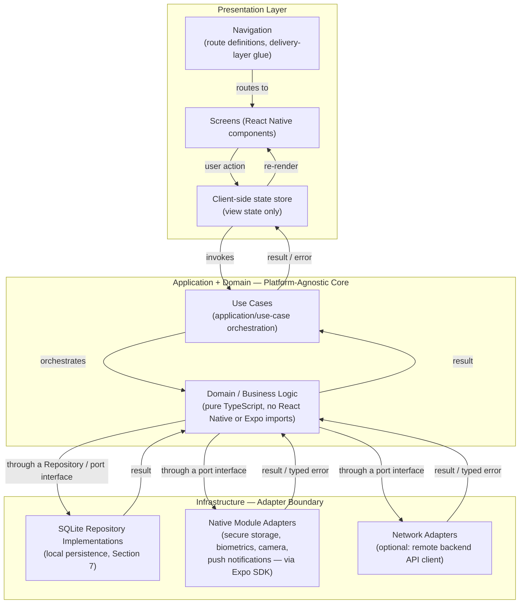

# project-mobile_v01.md

**Status:** Active
**Layer:** 4 — Project Rules
**Framework Version:** v10.1 (Tier 3 item, pulled forward from v10.1 scope ahead of the remainder of that scope, per `DECISIONS.md` entry `DEC-011`)
**Archetype:** Mobile Application (React Native + Expo, cross-platform iOS/Android)
**Purpose:** Apply Layers 1–3 of Framework v10 to the Mobile Application archetype — defining the concrete directory layout, file/class/module naming conventions, and archetype-specific technical decisions required to build a maintainable, AI-collaborable React Native + Expo mobile application — without restating any rule already governed by a lower-numbered layer.
**Authority:** This is the Mobile Application artifact of Layer 4 (`FRAMEWORK_BLUEPRINT.md`, Section 2.4), and the fourth and final of the four Layer 4 archetype documents named in the framework's Document Hierarchy (`FRAMEWORK_BLUEPRINT.md`, Section 3). Its generation was explicitly authorized as a Gate 1 (Plan Approval) pull-forward from Tier 3 / v10.1 scope, recorded as `DECISIONS.md` entry `DEC-011`, following Framework v10's Tier 1 and Tier 2 reaching full completion (`DECISIONS.md` entry `DEC-010`; `FRAMEWORK_STATUS.md`, Flag 18). It becomes fully load-bearing on the same foundation the other three archetype documents already rest on: `global_rules_revisionfinal_v10.md` (Layer 2, Active) and `global_technology_stack_v10.md` (Layer 3, Active).
**Inherits from:** `AI_DEVELOPMENT_PHILOSOPHY_v2.0.md` (Layer 1 — Constitution), `global_rules_revisionfinal_v10.md` (Layer 2 — Framework Rules), `global_technology_stack_v10.md` (Layer 3 — Technology Standards). Every rule drawn from these three documents is referenced below by name; none is restated, per the framework's inheritance model (`FRAMEWORK_BLUEPRINT.md`, Section 5).
**Governs:** Layer 5–9 artifacts scoped to the Mobile Application archetype — the mobile-track sections of `PROJECT_STRUCTURE.md` and `COMMANDS.md` once extended to cover it, any Layer 7 Skill executing inside a Mobile project, and any Layer 9 template built for this archetype (e.g., a future `template-expo-mobile/`, per `FRAMEWORK_BLUEPRINT.md`, Sections 2.9 and 18.4) — per the downward authority rule (KA-002, `FRAMEWORK_BLUEPRINT.md` Section 6).
**Supersedes:** None. This is the first Mobile archetype Project Rule document generated for this framework; no legacy `project-mobile_*` document exists in the deprecated-documents record (`FRAMEWORK_README.md`, Section 6).
**RFC 2119:** The key words **MUST**, **MUST NOT**, **REQUIRED**, **SHALL**, **SHALL NOT**, **SHOULD**, **SHOULD NOT**, **RECOMMENDED**, **MAY**, and **OPTIONAL** in this document are to be interpreted as described in RFC 2119. They apply to every rule below without exception unless the rule itself states otherwise.

---

## 0. Scope and Position in the Knowledge Architecture

This document is the fourth and final of the four planned Layer 4 artifacts (`FRAMEWORK_BLUEPRINT.md`, Section 3):

```
Layer 1 — Constitution                         AI_DEVELOPMENT_PHILOSOPHY_v2.0.md
        ↓
Layer 2 — Framework Rules                       global_rules_revisionfinal_v10.md
        ↓
Layer 3 — Technology Standards                  global_technology_stack_v10.md
        ↓ (this document inherits from all three above, by reference)
Layer 4 — Project Rules                         project-pc-app_v04.md                (Active — Desktop / Electron)
                                                 project-personal-full-stack_v01.md   (Active — Full-Stack)
                                                 project-monolithic_v04.md            (Active — Monolithic)
                                                 project-mobile_v01.md  ← this document (Mobile — React Native + Expo)
        ↓
Layer 5 — Developer Manuals
Layer 6 — Reference Implementations
Layer 7 — AI Skills
Layer 8 — Prompt Library
Layer 9 — Project Templates
```

**What this document contains.** The directory layout, naming conventions, and archetype-specific technical decisions that apply specifically to a Mobile Application built with React Native and Expo — including how the framework's Clean Architecture boundary (`global_rules_revisionfinal_v10.md`, Section 3.2), vendor-independence rule (`global_rules_revisionfinal_v10.md`, Section 2), and persistence philosophy (`AI_DEVELOPMENT_PHILOSOPHY_v2.0.md`, Sections 12–13) apply concretely to a single JavaScript-runtime mobile client bridged to native platform capabilities, rather than to Electron's multi-process model or a web-facing HTTP API boundary.

**What this document does not contain, by design.** Per its Layer 4 prohibited responsibilities (`FRAMEWORK_BLUEPRINT.md`, Section 2.4):

- It **MUST NOT** restate SOLID, Clean Architecture, the TDD boundary, Git workflow rules, or the vendor-independence rule. Those are inherited by reference from `global_rules_revisionfinal_v10.md` and cited, not reproduced.
- It **MUST NOT** define step-by-step developer workflow (session initialization, bootstrap procedure, HITL Gate sequencing). Those belong to Layer 5 (`FRAMEWORK_README.md`, `PROJECT_BOOTSTRAP_GUIDE.md`).
- It **MUST NOT** contain a full worked tutorial with vendor-specific implementation detail. That belongs to Layer 6.
- It **MUST NOT** define reusable, directly-executable AI Skills. Those belong to Layer 7 (`SKILLS.md` and individual Skill documents), which this archetype consumes unmodified — all three Tier 1 Skills are archetype-agnostic (`SKILLS.md`, Section 5).
- It **MUST NOT** restate the canonical technology table. Technology approval, defaults, and alternatives belong to `global_technology_stack_v10.md` (Layer 3); this document applies the archetype-relevant subset of that table rather than reproducing it.

**How an AI agent uses this document.** Per `FRAMEWORK_BLUEPRINT.md` Section 2.4's AI interaction model, an agent reads exactly one Layer 4 document per project — this one, whenever the project's archetype is a cross-platform mobile application. It is read once at project bootstrap (`FRAMEWORK_BLUEPRINT.md`, Section 16) and re-consulted whenever a structural or naming question arises during execution.

---

## 1. Inheritance Declaration

Per the inheritance rule that a Project Rule document must open with an explicit statement of what it inherits (`FRAMEWORK_BLUEPRINT.md`, Section 5), this document inherits, by reference and without restatement:

| From | Document | What is inherited |
|---|---|---|
| Layer 1 | `AI_DEVELOPMENT_PHILOSOPHY_v2.0.md` | Core value ordering (Section 4); AI-First and Agentic Engineering principles (Sections 5–6); Development Environment principle (Section 10); Dev Container philosophy (Section 11); Database philosophy — SQLite default (Section 12); Persistence Independence — Repository Pattern (Section 13, applied here via a mobile-appropriate SQLite binding rather than SQLAlchemy, per Section 7 of this document); Package Management philosophy (Section 14, Python-specific and not applicable to this archetype's TypeScript/Node.js runtime, exactly as already noted for the Desktop archetype in `project-pc-app_v04.md`, Section 1 — see Section 8 of this document for the applicable Layer 3 pick); Vendor Independence (Section 15). |
| Layer 2 | `global_rules_revisionfinal_v10.md` | Vendor Independence as a binding rule (Section 2); Architecture Rules — Separation of Concerns, Clean Architecture Boundaries, Extensibility (Section 3); the TDD Boundary table (Section 4); Git Workflow Rules (Section 5); Environment and Dependency Management Principles (Section 6); Code Quality Gates (Section 7); Documentation Standards (Section 8); Security Baselines (Section 9); Definition of Done (Section 10); Exception Handling Rule (Section 11). |
| Layer 3 | `global_technology_stack_v10.md` | The canonical technology table in full, including the confirmed Mobile default (React Native + Expo, Primary; Flutter, comparison only — Section 3 of that document) and the currently confirmed package-manager and state-management defaults referenced throughout this document (Section 8). This document applies the archetype-relevant subset of that table; it does not reproduce the table itself. |

Where this document states a technical decision, it is either (a) a direct application of a Layer 3 default to this archetype, cited as such, or (b) a directory-layout or naming-convention choice that is this layer's own designated responsibility (`FRAMEWORK_BLUEPRINT.md`, Section 2.4, "Responsibilities"). It is never a new architectural decision at the Layer 1–3 level.

---

## 2. Archetype Definition

The **Mobile** archetype covers a single-codebase, cross-platform (iOS and Android) mobile application built with React Native and Expo, intended to run on physical or simulated/emulated devices, consistent with the Constitution's Development Environment principle (`AI_DEVELOPMENT_PHILOSOPHY_v2.0.md`, Section 10) wherever that principle can be meaningfully applied to a mobile runtime.

1. A Mobile project **MUST** target React Native, built via the Expo managed workflow, as its mobile application framework (confirmed Layer 3 default, `global_technology_stack_v10.md`, Section 3: "Mobile | React Native + Expo | Flutter (comparison only) | Expo first"). Flutter **MUST NOT** be used for a new Mobile project under this archetype; it is named in the canonical technology table strictly as a comparison technology, not an approved alternative.
2. A Mobile project **MUST** use TypeScript, consistent with the framework-wide preference for TypeScript over JavaScript wherever a project's runtime supports it (`global_technology_stack_v10.md`, Section 3, "Language" row), applied here to Mobile in the same manner `project-pc-app_v04.md`, Section 2, already applies it to the Desktop archetype's Node.js/Electron runtime.
3. A Mobile project **SHOULD** include a Dev Container configuration for the application's non-native development activities — writing and testing business logic, running linters, running the domain/application/infrastructure test suites, and running the Metro JavaScript bundler where the local toolchain supports a containerized bundler — consistent with the Constitution's Dev Container philosophy (`AI_DEVELOPMENT_PHILOSOPHY_v2.0.md`, Section 11).
4. Native, host-level execution **MUST** be used for running the application on an iOS Simulator, an Android Emulator, or a physical device, and for producing an installable or distributable build artifact (e.g., via Expo Application Services or the platform-native Xcode/Android Studio toolchains), since none of these can be meaningfully exercised inside a Linux container. This is consistent with, not an exception to, the Constitution's statement that native execution **MAY** be used and is not the primary workflow (`AI_DEVELOPMENT_PHILOSOPHY_v2.0.md`, Section 10) — for this archetype specifically, native execution is a required supplement to the containerized workflow rather than a full replacement of it, applying the identical interpretation `project-pc-app_v04.md`, Section 2, Rule 3, already establishes for Electron's packaging step to this archetype's structurally analogous build/run requirement.

---

## 3. Application Architecture — JavaScript / Native Bridge Boundary

React Native's runtime model **MUST** be mapped onto the Clean Architecture boundary required by `global_rules_revisionfinal_v10.md`, Section 3.2, rather than treated as an architecture of its own. Unlike Electron's multi-process split (`project-pc-app_v04.md`, Section 3), React Native runs as a single JavaScript runtime bridged to native platform modules; the domain and application layers **MUST** be written as plain, React-Native-agnostic TypeScript modules that do not import React Native APIs, Expo SDK modules, or any native-module binding, and the boundary this section defines is the seam between that plain JavaScript code and everything that crosses into native platform capability or an external network.



1. The **presentation layer** (`screens/`, `navigation/`, `components/`) **MUST** be treated as delivery code only. It **MUST NOT** contain business rules, validation logic, or direct persistence or native-module access.
2. The **application and domain layers** **MUST** remain importable and unit-testable without a React Native runtime, an Expo SDK module, or a device/simulator present, satisfying the Layer 2 requirement that business logic be testable without a UI framework running (`global_rules_revisionfinal_v10.md`, Section 3.1.1).
3. The **infrastructure layer** **MUST** host every concrete adapter: local persistence (Section 7), native platform capability adapters (secure storage, biometrics, camera, push-notification registration, and any other Expo SDK or native-module integration), and, where the application consumes a remote backend, network adapters implementing a port declared in `application/ports/` — exactly as `infrastructure/external/` already does for the Full-Stack archetype's backend (`project-personal-full-stack_v01.md`, Section 4). A Mobile project **MAY** operate entirely offline/local-first with no network adapter at all; this document does not require one.
4. Every native-module invocation and every outbound network call **MUST** be treated as crossing a trust boundary, subject to the communication pattern defined in Section 6 of this document.

---

## 4. Directory Layout

The following directory layout is this document's Layer 4 responsibility to define (`FRAMEWORK_BLUEPRINT.md`, Section 2.4, "Define the project-type-specific directory layout") and is binding for every new Mobile project.

```
project-root/
├── src/
│   ├── domain/                   # Pure business logic. No React Native, no Expo, no I/O.
│   │   ├── entities/
│   │   ├── value-objects/
│   │   └── errors/
│   ├── application/                # Use cases; orchestrates domain + port interfaces.
│   │   ├── use-cases/
│   │   └── ports/                   # Repository, native-capability, and network interfaces (EP-001 seams).
│   ├── infrastructure/              # Concrete adapters. Only layer allowed to import native/Expo SDKs or a network client.
│   │   ├── persistence/
│   │   │   └── sqlite/              # Local SQLite repository implementations (Section 7).
│   │   ├── native/                  # Expo SDK / native-module adapters (secure storage, biometrics, camera, notifications).
│   │   └── network/                 # Remote backend API client adapters, where the app consumes one (optional).
│   ├── navigation/                  # Route definitions and navigator configuration. Delivery-layer glue only.
│   ├── screens/                     # Presentation layer — one module per screen.
│   ├── components/                  # Reusable presentation components.
│   └── state/                       # Client-side view-state store (Section 8).
├── tests/
│   ├── domain/                      # Test-first, per the TDD Boundary (Section 9).
│   ├── application/
│   ├── infrastructure/
│   └── e2e/                          # Whole-application behavioral tests (screen/navigation flows).
├── assets/                            # Icons, splash screens, fonts, images, non-code build inputs.
├── app.config.ts                      # Expo application configuration. Bootstrap only — no business logic.
├── .env.example
├── .gitignore
└── README.md
```

1. Business logic **MUST** live under `src/domain/` and `src/application/` only. A file under `src/infrastructure/`, `src/navigation/`, `src/screens/`, or `src/components/` that contains a business rule or validation decision **MUST** be treated as a defect and relocated.
2. `src/infrastructure/` is the **only** directory permitted to import a native-module binding, an Expo SDK module beyond core app bootstrap, or a network client library directly, satisfying the vendor-independence rule that external dependencies be accessed only through an owned interface (`global_rules_revisionfinal_v10.md`, Section 2.2).
3. `src/application/ports/` **MUST** hold every interface that `src/infrastructure/` implements, whether the concrete implementation is a persistence repository, a native-capability adapter, or a network adapter. An application/use-case module **MUST** depend on a port, never on a concrete infrastructure class.
4. `app.config.ts` (Expo's application-configuration entry point) **MUST** contain bootstrap and build configuration only — app metadata, permissions declarations, plugin configuration — and **MUST NOT** contain business logic, mirroring the identical constraint `project-pc-app_v04.md`, Section 4, already places on Electron's main-process bootstrap file.
5. This layout **MAY** be extended with additional subfolders as a project grows (e.g., `src/domain/<bounded-context>/`), but the six top-level boundaries under `src/` (`domain`, `application`, `infrastructure`, `navigation`, `screens`, `components`, plus `state`) **MUST NOT** be collapsed or renamed, since Layer 7 Skills and Layer 9 templates for this archetype will assume this layout by convention.

---

## 5. Naming Conventions

The following conventions are binding for every file, class, and module in a Mobile project, per this layer's designated responsibility to define archetype-level naming (`FRAMEWORK_BLUEPRINT.md`, Section 2.4).

| Artifact | Convention | Example |
|---|---|---|
| Source files | `kebab-case`, suffixed by role where the role is not obvious from directory alone | `create-transaction.use-case.ts`, `transaction.repository.ts` |
| Classes, interfaces, types | `PascalCase` | `TransactionRepository`, `CreateTransactionUseCase` |
| Functions, variables | `camelCase` | `createTransaction`, `isValidAmount` |
| Constants (module-level, immutable) | `UPPER_SNAKE_CASE` | `MAX_RETRY_COUNT` |
| Repository interfaces (ports) | `<Entity>Repository` | `AccountRepository` |
| Repository implementations (adapters) | `Sqlite<Entity>Repository` | `SqliteAccountRepository` |
| Native-capability adapters (ports and implementations) | `<Capability>Adapter` | `SecureStorageAdapter`, `BiometricAuthAdapter` |
| Network adapters | `<Service><Entity>Client` | `BackendAccountClient` |
| Use cases | `<Verb><Noun>UseCase` | `ImportStatementUseCase` |
| Screen components | `<Noun>Screen`, `PascalCase` | `AccountListScreen`, `TransactionDetailScreen` |
| Navigation route identifiers | `PascalCase`, mirroring the screen name they route to | `AccountList`, `TransactionDetail` |
| Test files | Mirror the file under test, suffixed `.test` or `.spec` per the test runner declared in `global_technology_stack_v10.md` | `create-transaction.use-case.test.ts` |

1. A file **MUST NOT** mix responsibilities implied by its own name — a file named `*.use-case.ts` **MUST NOT** contain infrastructure code, and a file named `*.repository.ts` under `infrastructure/` **MUST NOT** contain business rules.
2. Navigation route identifiers **MUST** be centrally declared (e.g., a single `navigation/routes.ts` module imported by every navigator and every screen that triggers navigation) rather than repeated as string literals across files, so that renaming a route is a one-file change — the same discipline `project-pc-app_v04.md`, Section 5, Rule 2, already applies to IPC channel identifiers.

---

## 6. Native Bridge and Network Communication Pattern

This section is the archetype-specific addition anticipated by `FRAMEWORK_BLUEPRINT.md`, Section 5 (a Layer 4 document "adds" an archetype-specific pattern on top of inherited Layer 2 rules — for the Desktop archetype this was an Electron IPC error-handling pattern; for the Full-Stack and Monolithic archetypes it was an HTTP API error-handling pattern; here it is the equivalent pattern for React Native's native-module bridge and, where present, an outbound network boundary). It is an application of already-frozen rules to this archetype's trust boundaries, not a new architectural decision.

1. Every native-module invocation (secure storage, biometrics, camera, push-notification registration, or any other Expo SDK or native-module call) and every outbound network call to a remote backend **MUST** be treated as a trust boundary. Data crossing either boundary — a native-module result, a permission-denial outcome, or a network response — **MUST** be validated before use in business logic, per the Layer 2 rule that input from outside the application's trust boundary must be validated (`global_rules_revisionfinal_v10.md`, Section 9.3).
2. An adapter in `src/infrastructure/native/` or `src/infrastructure/network/` **MUST NOT** catch a generic/base exception and propagate it verbatim into application or domain code. It **MUST** either (a) let a narrowly-typed domain or application error propagate to a single top-level error boundary that maps it to a typed, serializable error result, or (b) catch a specific, anticipated exception or native-module error code and translate it explicitly — consistent with the Exception Handling Rule (`global_rules_revisionfinal_v10.md`, Section 11).
3. Errors returned across either boundary **MUST** be structured (e.g., a stable `code` plus a human-readable `message`), never a raw native stack trace, a raw network error object, or a generic "something went wrong" string, so that the presentation layer can make display decisions without inspecting error internals.
4. A native-bridge or network adapter **MUST NOT** silently swallow a failure. Every caught error **MUST** either be logged, re-raised in translated form, or both, per the no-silent-swallowing rule (`global_rules_revisionfinal_v10.md`, Section 11.4). This applies without exception to a denied device permission (camera, biometrics, notifications, location, or any other) — a denial **MUST** surface as a defined, typed outcome the calling use case can act on, never as an unhandled exception or a silently ignored no-op.
5. A native-bridge or network adapter **MUST** remain a thin translation layer: it implements exactly one port declared in `src/application/ports/`, and it **MUST NOT** contain business logic. Where a native capability's result requires business interpretation (e.g., deciding what a scanned barcode means for the domain), that interpretation belongs in `src/application/use-cases/` or `src/domain/`, not in the adapter itself.
6. Device permissions **MUST** be requested only at the point of actual use, not speculatively at application startup, consistent with the least-privilege principle (`global_rules_revisionfinal_v10.md`, Section 9.4).

---

## 7. Persistence Architecture

This section applies the Constitution's database and persistence-independence philosophy (`AI_DEVELOPMENT_PHILOSOPHY_v2.0.md`, Sections 12–13) and the Layer 2 vendor-independence rule (`global_rules_revisionfinal_v10.md`, Section 2) to this archetype's on-device runtime.

1. SQLite **MUST** be the default persistence engine for a Mobile project, per the Constitution's database philosophy (`AI_DEVELOPMENT_PHILOSOPHY_v2.0.md`, Section 12), accessed via a mobile-appropriate SQLite binding compatible with the Expo managed workflow. The specific binding library is a Layer 3 lookup at bootstrap time (Section 8 of this document), consistent with the restraint every sibling archetype document already applies to its own undetermined tooling selections.
2. All SQLite access **MUST** occur exclusively from `src/infrastructure/persistence/sqlite/`. No presentation-layer module (`src/screens/`, `src/navigation/`, `src/components/`), and no application/domain module, **MUST** open a database connection or import a SQLite binding, directly or transitively.
3. Every persistence operation available to the application layer **MUST** be expressed as a Repository interface declared in `src/application/ports/`, with its concrete SQLite implementation in `src/infrastructure/persistence/sqlite/`, per the Repository Pattern requirement (`AI_DEVELOPMENT_PHILOSOPHY_v2.0.md`, Section 13) and the vendor-independence rule that replacing a vendor must be confined to the infrastructure layer (`global_rules_revisionfinal_v10.md`, Section 2.3).
4. A future migration away from local SQLite (e.g., toward a remote-sync-backed store, should a project's requirements outgrow a device-local database) **MUST** require changes confined to `src/infrastructure/persistence/`. If such a migration would require a change to `src/domain/` or `src/application/use-cases/`, the Repository abstraction has failed and **MUST** be corrected before the migration is considered complete.
5. Database schema migrations **MUST** be version-tracked and applied idempotently on application startup, so that upgrading the application on a user's device never requires manual database intervention.
6. Secrets, authentication tokens, and any other credential-class value **MUST NOT** be persisted through the general-purpose SQLite repository. They **MUST** be stored through a device-native secure-storage adapter in `src/infrastructure/native/` instead, consistent with the Layer 2 Security Baseline's prohibition on committing or casually persisting secret values (`global_rules_revisionfinal_v10.md`, Section 9.1) and the least-privilege principle (Section 9.4).

---

## 8. Layer 3 Technology Application

Per Section 2.4 of `FRAMEWORK_BLUEPRINT.md`, this document applies — but does not restate — the Layer 3 canonical technology table. The following selections are confirmed Layer 3 defaults that this archetype **MUST** use:

1. **Mobile framework:** React Native, via the Expo managed workflow (TD-series Mobile default, `global_technology_stack_v10.md`, Section 3). See Section 2 of this document.
2. **Language:** TypeScript. See Section 2, Rule 2, of this document.
3. **Package manager:** pnpm. Every Mobile project **MUST** use pnpm for dependency installation and lockfile management, consistent with the same confirmed Layer 3 default already applied to every other Node.js-based archetype (`project-pc-app_v04.md`, Section 8; `project-personal-full-stack_v01.md`, Section 8; `project-monolithic_v04.md`, Section 8) and with the Layer 2 requirement that dependency versions be pinned or lock-filed for byte-for-byte reproducible builds (`global_rules_revisionfinal_v10.md`, Section 6.2). npm and yarn **MUST NOT** be used as the project's package manager.
4. **State management:** Zustand. A Zustand store **MUST** hold presentation/view state only (e.g., current navigation-adjacent UI state, loading flags, cached read-only projections of use-case results). It **MUST NOT** hold authoritative business state or perform validation, per the Clean Architecture boundary (`global_rules_revisionfinal_v10.md`, Section 3.2.2) — the presentation layer remains outer-layer/delivery code regardless of which state library manages its UI state, identical in principle to every sibling archetype's own Zustand constraint.

Selection of the specific navigation library, the local SQLite binding, the automated test runner, the end-to-end testing tool, and the build/distribution service (e.g., Expo Application Services) **MUST** be taken from the canonical technology table in `global_technology_stack_v10.md` at the time a project is bootstrapped. This document intentionally does not name those tools, so that this Layer 4 document does not drift out of sync with Layer 3 as that table evolves; an AI agent bootstrapping a Mobile project **MUST** consult `global_technology_stack_v10.md` directly for these selections rather than infer them from this document.

---

## 9. Applying the TDD Boundary to This Archetype

The TDD Boundary itself is defined once, at Layer 2, and is not restated here (`global_rules_revisionfinal_v10.md`, Section 4). This section maps that boundary onto the directory layout of Section 4.

| Zone (Layer 2 definition) | Directory in this archetype | TDD requirement |
|---|---|---|
| Business/domain logic | `src/domain/` | **MUST** be developed test-first (`tests/domain/`). |
| Application/use-case orchestration | `src/application/` | **SHOULD** be developed test-first; **MUST** have coverage before a commit is done (`tests/application/`). |
| Infrastructure adapters | `src/infrastructure/` | **SHOULD** have integration-level tests — a local persistence adapter tested against a real, temporary SQLite instance; a native-module adapter tested against the platform's own mocking/testing utilities; test-first is RECOMMENDED, not mandatory (`tests/infrastructure/`). |
| UI/presentation, navigation wiring, framework glue | `src/screens/`, `src/navigation/`, `src/components/`, `app.config.ts` (bootstrap only) | **MAY** be developed without strict test-first; behavior-level and end-to-end tests are preferred over implementation-detail tests (`tests/e2e/`). |

A navigation route handler and a screen's data-loading logic sit at the same seam `project-pc-app_v04.md`, Section 9, already identifies for an IPC handler, and `project-personal-full-stack_v01.md` and `project-monolithic_v04.md`, each their own Section 9, identify for an API router: the screen/navigation code itself (routing, rendering, user-input capture) falls in the "framework glue" zone, while the use case it invokes falls in the "application/use-case orchestration" zone. Splitting these two responsibilities cleanly (Section 3, Rule 1, of this document) is what makes this distinction meaningful rather than ambiguous.

---

## 10. Prohibited Responsibilities — Explicit Boundary

Consistent with `FRAMEWORK_BLUEPRINT.md`, Section 2.4, this document explicitly does **not** do the following, and any future edit that adds one of these is out of scope for Layer 4 and MUST be redirected to the correct layer instead:

| Not defined here | Correct layer |
|---|---|
| Step-by-step session initialization or project bootstrap procedure | Layer 5 (`FRAMEWORK_README.md`, `PROJECT_BOOTSTRAP_GUIDE.md`) |
| Canonical command reference for this archetype | Layer 5 (`COMMANDS.md`, extension pending — Section 12 of this document) |
| Full canonical directory reference across all archetypes | Layer 5 (`PROJECT_STRUCTURE.md`, extension pending — Section 12 of this document) |
| Worked, vendor-specific tutorial | Layer 6 |
| Reusable, directly-executable AI Skill definitions (e.g., a `create-feature` Skill scoped to this archetype) | Layer 7 (`SKILLS.md` and individual Skill documents — all three Tier 1 Skills already apply unmodified, per `SKILLS.md`, Section 5) |
| Tool-specific prompt wrappers | Layer 8 |
| A ready-to-clone scaffold implementing this document | Layer 9 (a future `template-expo-mobile/`, conforming to `TEMPLATE_SPEC.md` — Tier 3 / v10.1, still deferred, per `FRAMEWORK_BLUEPRINT.md`, Section 18.4) |
| The canonical technology table itself | Layer 3 (`global_technology_stack_v10.md`) |

---

## 11. Authority and Conflict Resolution

1. Per the downward authority rule (KA-002), this document **MUST NOT** override, contradict, or restate a rule owned by `AI_DEVELOPMENT_PHILOSOPHY_v2.0.md` (Layer 1), `global_rules_revisionfinal_v10.md` (Layer 2), or `global_technology_stack_v10.md` (Layer 3). Any apparent conflict between a rule in this document and one of those three MUST be resolved in favor of the lower-numbered layer, and this document corrected.
2. A Layer 7 Skill, Layer 8 Prompt, or Layer 9 Template scoped to the Mobile archetype **MUST NOT** contradict this document. Where one appears to, this document takes precedence, per the same downward authority rule.
3. Where this document's guidance appears to overlap with any other Layer 4 archetype document, the conflict is resolved by archetype selection itself (`PROJECT_BOOTSTRAP_GUIDE.md`, Section 4.1) — a human, not this document, decides which single Layer 4 document governs a given project; no two Layer 4 documents govern the same project simultaneously.
4. The full conflict-resolution procedure, including same-layer conflicts, is defined in `FRAMEWORK_BLUEPRINT.md`, Section 6, and is not restated here.

---

## 12. Change Control

1. This document **MUST NOT** be edited silently. A change to any rule in this document that reflects a new architectural decision (as opposed to a clarification of existing, frozen decisions) **MUST** follow the amendment procedure defined in `FRAMEWORK_BLUEPRINT.md`, Section 18.2: proposal → Gate 2 (Architecture Approval) → amendment → `DECISIONS.md` entry → `FRAMEWORK_HANDOVER.md` update in the same commit.
2. Upon this document's creation, `FRAMEWORK_README.md`, Sections 4.3 and 5, and `FRAMEWORK_STATUS.md` **MUST** be updated in the same change to reflect its new `Active` status and its removal from the deferred/in-progress Tier 3 listings — per `FRAMEWORK_README.md`, Section 9, and the AI Session Instructions in `FRAMEWORK_STATUS.md`. This is a status-synchronization action, not itself an architectural decision.
3. `PROJECT_BOOTSTRAP_GUIDE.md`, Section 5.3, currently states that a Mobile-archetype bootstrap request **MUST** be declined at the framework level, since `project-mobile_v01.md` was `Pending`. With this document now `Active`, that section **MUST** be updated in the same change to remove the decline instruction and instead route a Mobile-archetype bootstrap request through the ordinary Project Creation Flow (`PROJECT_BOOTSTRAP_GUIDE.md`, Section 4), using this document at Step 3 (Section 4.3) exactly as the other three archetype documents are already used.
4. `PROJECT_STRUCTURE.md`, Section 7, and `COMMANDS.md`, Section 9.4, both currently defer the Mobile archetype's canonical directory reference and command reference respectively, each stating explicitly that it would be replaced "in the same change that document transitions from `Pending` to `Active`." That transition has now occurred; both documents **MUST** be extended in a follow-up change to reproduce this document's Section 4 directory tree and to supply the archetype-specific command reference `COMMANDS.md`, Section 9, already provides for the other three archetypes.
5. Should `global_technology_stack_v10.md` change a default referenced in Section 8 of this document (e.g., a change in package manager or state-management library), Section 8 **MUST** be updated in the same change that amends the Layer 3 document, so that this document never asserts a Layer 3 default that Layer 3 itself no longer holds.
6. This document's generation completes the set of four Layer 4 archetype documents originally named in `FRAMEWORK_BLUEPRINT.md`, Section 3 — Desktop, Full-Stack, Monolithic, and now Mobile are all `Active`. This is a status observation, not itself a new architectural decision; Layer 4 is not defined by the Blueprint as reaching a single "Active as a whole" status the way Layer 7 or Layer 8 does (`FRAMEWORK_STATUS.md`'s own framing), since each archetype document remains independently governed. No further Layer 4 archetype is currently planned.

---

## Closing Statement

This document is the Mobile Application artifact of Layer 4 in Framework v10, and the fourth and final planned archetype document. It resolves the archetype-level structural gap that stood between `global_rules_revisionfinal_v10.md` (Layer 2, Active) and a buildable React Native + Expo project: a concrete directory layout, binding naming conventions, a native-bridge-and-network error-handling pattern analogous in structure to the IPC pattern (`project-pc-app_v04.md`) and the API patterns (`project-personal-full-stack_v01.md`, `project-monolithic_v04.md`) already established for the other three archetypes, and a persistence architecture that keeps local SQLite access confined to the infrastructure layer behind a Repository seam, with credential-class data routed instead to device-native secure storage. No architectural decision has been introduced beyond what `FRAMEWORK_BLUEPRINT.md` Section 2.4 assigns to this layer's responsibility, and beyond the single Gate 1 decision (`DEC-011`) that authorized generating this document ahead of the remainder of v10.1 scope; every rule above either applies an already-frozen Layer 1–3 decision to this archetype or fulfills this layer's own designated duty to define directory structure and naming convention.

---

**Reminder:** Per this document's own Section 12, please update `FRAMEWORK_STATUS.md` to move `project-mobile_v01.md` from "Current Target" into "Completed Milestones" / "Active Documents," record that **all four planned Layer 4 archetype documents are now `Active`**, and add a changelog entry recording this document's generation and the resulting completion of `DEC-011`'s scope — in the same change, per PR-001. Please also update `FRAMEWORK_README.md` (Sections 4.3 and 5) to move this document from "in progress" to `Active`, and flag `PROJECT_BOOTSTRAP_GUIDE.md` (Section 5.3), `PROJECT_STRUCTURE.md` (Section 7), and `COMMANDS.md` (Section 9.4) for the Owner's attention, since all three currently describe the Mobile archetype as deferred or declined, which is no longer accurate now that this document exists. Two v10.1 items remain fully deferred and untouched by `DEC-011`: `AI_DEVELOPMENT_MANUAL.md` and the remaining Layer 9 template set / Layer 8 tool coverage — each would require its own, separate Gate 1 decision before being pulled forward.
