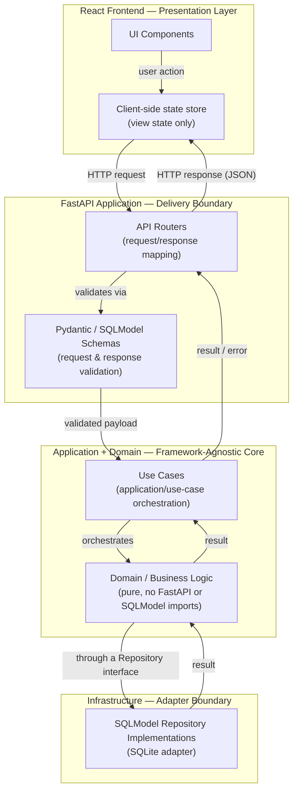

# project-monolithic_v04.md
 
**Status:** Active
**Layer:** 4 — Project Rules
**Framework Version:** v10
**Tier:** 2 (Required)
**Archetype:** Monolithic Application (FastAPI + SQLModel + React, single deployable)
**Purpose:** Apply Layers 1–3 of Framework v10 to the Monolithic Application archetype — defining the concrete directory layout, file/class/module naming conventions, and archetype-specific technical decisions required to build a maintainable, AI-collaborable single-deployable web application combining a FastAPI backend, a SQLModel/SQLite persistence layer, and a React frontend — without restating any rule already governed by a lower-numbered layer.
**Authority:** This is the Monolithic Application artifact of Layer 4 (`FRAMEWORK_BLUEPRINT.md`, Section 2.4). It is a Tier 2 deliverable (`FRAMEWORK_BLUEPRINT.md`, Section 17, Step 2) and becomes fully load-bearing now that every Tier 1 document exists (`FRAMEWORK_STATUS.md`, "Completed Milestones"), satisfying the Tier-ordering gate (DI-002) that governs when Tier 2 generation may begin.
**Inherits from:** `AI_DEVELOPMENT_PHILOSOPHY_v2.0.md` (Layer 1 — Constitution), `global_rules_revisionfinal_v10.md` (Layer 2 — Framework Rules), `global_technology_stack_v10.md` (Layer 3 — Technology Standards). Every rule drawn from these three documents is referenced below by name; none is restated, per the framework's inheritance model (`FRAMEWORK_BLUEPRINT.md`, Section 5).
**Governs:** Layer 5–9 artifacts scoped to the Monolithic Application archetype — e.g., the monolithic-track sections of `PROJECT_BOOTSTRAP_GUIDE.md` and `PROJECT_STRUCTURE.md` (once Active), any Layer 7 Skill executing inside a Monolithic project, and any Layer 9 template built for this archetype (e.g., a future `template-monolithic-*`, distinct from the FastAPI/SQLite Tier 2 seed template tracked separately in `TEMPLATE_SPEC.md`) — per the downward authority rule (KA-002, `FRAMEWORK_BLUEPRINT.md` Section 6).
**Supersedes:** `project-monolithic_v03.md`, `project-monolithic_기술스택_v03.txt`, and `project-monolithic_prompt_v04.md` — all `Deprecated` as of the v10 freeze (DL-002, `FRAMEWORK_README.md` Section 6).
**RFC 2119:** The key words **MUST**, **MUST NOT**, **REQUIRED**, **SHALL**, **SHALL NOT**, **SHOULD**, **SHOULD NOT**, **RECOMMENDED**, **MAY**, and **OPTIONAL** in this document are to be interpreted as described in RFC 2119. They apply to every rule below without exception unless the rule itself states otherwise.
 
---
 
## 0. Scope and Position in the Knowledge Architecture
 
This document is the second of four planned Layer 4 artifacts to be generated (`FRAMEWORK_BLUEPRINT.md`, Section 3):
 
```
Layer 1 — Constitution                         AI_DEVELOPMENT_PHILOSOPHY_v2.0.md
        ↓
Layer 2 — Framework Rules                       global_rules_revisionfinal_v10.md
        ↓
Layer 3 — Technology Standards                  global_technology_stack_v10.md
        ↓ (this document inherits from all three above, by reference)
Layer 4 — Project Rules  (this document)        project-pc-app_v04.md               (Active — Desktop/Electron)
                                                 project-monolithic_v04.md  ← this document
                                                 project-personal-full-stack_v01.md  (Tier 2, pending)
                                                 project-mobile_v01.md               (Tier 3 / v10.1, pending)
        ↓
Layer 5 — Developer Manuals
Layer 6 — Reference Implementations
Layer 7 — AI Skills
Layer 8 — Prompt Library
Layer 9 — Project Templates
```
 
**What this document contains.** The directory layout, naming conventions, and archetype-specific technical decisions that apply specifically to a Monolithic Application built with FastAPI, SQLModel, and React — including how the framework's Clean Architecture boundary (`global_rules_revisionfinal_v10.md`, Section 3.2), vendor-independence rule (`global_rules_revisionfinal_v10.md`, Section 2), and persistence philosophy (`AI_DEVELOPMENT_PHILOSOPHY_v2.0.md`, Sections 12–13) apply concretely within a single deployable unit combining an HTTP API, a relational persistence layer, and a bundled frontend.
 
**What this document does not contain, by design.** Per its Layer 4 prohibited responsibilities (`FRAMEWORK_BLUEPRINT.md`, Section 2.4):
 
- It **MUST NOT** restate SOLID, Clean Architecture, the TDD boundary, Git workflow rules, or the vendor-independence rule. Those are inherited by reference from `global_rules_revisionfinal_v10.md` and cited, not reproduced.
- It **MUST NOT** define step-by-step developer workflow (session initialization, bootstrap procedure, HITL Gate sequencing). Those belong to Layer 5 (`FRAMEWORK_README.md`, `PROJECT_BOOTSTRAP_GUIDE.md`).
- It **MUST NOT** contain a full worked tutorial with vendor-specific implementation detail. That belongs to Layer 6.
- It **MUST NOT** define reusable, directly-executable AI Skills. Those belong to Layer 7 (`SKILLS.md` and individual Skill documents), which this archetype consumes without modification (Section 10 below).
- It **MUST NOT** restate the canonical technology table. Technology approval, defaults, and alternatives belong to `global_technology_stack_v10.md` (Layer 3); this document applies the archetype-relevant subset of that table rather than reproducing it.
**How an AI agent uses this document.** Per `FRAMEWORK_BLUEPRINT.md` Section 2.4's AI interaction model, an agent reads exactly one Layer 4 document per project — this one, whenever the project's archetype is a single-deployable monolithic web application. It is read once at project bootstrap (`FRAMEWORK_BLUEPRINT.md`, Section 16; `PROJECT_BOOTSTRAP_GUIDE.md`, Section 4.3) and re-consulted whenever a structural or naming question arises during execution.
 
---
 
## 1. Inheritance Declaration
 
Per the inheritance rule that a Project Rule document must open with an explicit statement of what it inherits (`FRAMEWORK_BLUEPRINT.md`, Section 5), this document inherits, by reference and without restatement:
 
| From | Document | What is inherited |
|---|---|---|
| Layer 1 | `AI_DEVELOPMENT_PHILOSOPHY_v2.0.md` | Core value ordering (Section 4); AI-First and Agentic Engineering principles (Sections 5–6); Development Environment principle (Section 10); Dev Container philosophy (Section 11); Database philosophy — SQLite default (Section 12); Persistence Independence — Repository Pattern (Section 13); Package Management philosophy — Poetry/uv for the Python backend (Section 14; see Section 8 of this document for how this applies alongside the frontend's own Layer 3 package-manager default); Vendor Independence (Section 15). |
| Layer 2 | `global_rules_revisionfinal_v10.md` | Vendor Independence as a binding rule (Section 2); Architecture Rules — Separation of Concerns, Clean Architecture Boundaries, Extensibility (Section 3); the TDD Boundary table (Section 4); Git Workflow Rules (Section 5); Environment and Dependency Management Principles (Section 6); Code Quality Gates (Section 7); Documentation Standards (Section 8); Security Baselines (Section 9); Definition of Done (Section 10); Exception Handling Rule (Section 11). |
| Layer 3 | `global_technology_stack_v10.md` | The canonical technology table in full, including the backend-framework, ORM, database, and frontend-library defaults referenced throughout this document (Section 8) — FastAPI, SQLModel, SQLite, and React. This document applies the archetype-relevant subset of that table; it does not reproduce the table itself. |
 
Where this document states a technical decision, it is either (a) a direct application of a Layer 3 default to this archetype, cited as such, or (b) a directory-layout or naming-convention choice that is this layer's own designated responsibility (`FRAMEWORK_BLUEPRINT.md`, Section 2.4, "Responsibilities"). It is never a new architectural decision at the Layer 1–3 level.
 
---
 
## 2. Archetype Definition
 
The **Monolithic** archetype covers a web application whose backend API, persistence layer, and frontend user interface are developed, versioned, built, and deployed together as a **single deployable unit** — one process, or one container image, serving both the HTTP API and the compiled frontend assets. This distinguishes it from the two other web-facing archetypes named in `FRAMEWORK_BLUEPRINT.md`, Section 2.4:
 
- The **PC App** archetype (`project-pc-app_v04.md`) targets an installable desktop application (Electron), not a server-hosted web application.
- The **Full-Stack** archetype (`project-personal-full-stack_v01.md`, Tier 2, currently `Pending`), where it exists, is understood to separate frontend and backend into independently deployable services; the Monolithic archetype exists specifically for the simpler, single-deployable case where that separation is not warranted by the project's actual scope (`global_rules_revisionfinal_v10.md`, Section 3.3.1 — extension points are added only when a second variant is known or reasonably anticipated).
1. A Monolithic project **MUST** target FastAPI as its backend web framework, SQLModel as its ORM and persistence-mapping layer, and React as its frontend UI library, per `global_technology_stack_v10.md` (Section 8 of this document).
2. A Monolithic project **MUST** be structured so that a single build produces one deployable artifact: a FastAPI application that, in production, serves both its own HTTP API and the compiled React static assets. The two halves **MUST NOT** be deployed as independently versioned services under this archetype — doing so is a Full-Stack-archetype decision, not a Monolithic one, and requires selecting that archetype instead (Section 4.1 of `PROJECT_BOOTSTRAP_GUIDE.md`), not extending this document.
3. A Monolithic project **SHOULD** include a Dev Container configuration covering both the Python backend and the Node.js frontend toolchains, consistent with the Constitution's Dev Container philosophy (`AI_DEVELOPMENT_PHILOSOPHY_v2.0.md`, Section 11).
4. The standard development workflow **MUST** follow the Constitution's Development Environment principle (`AI_DEVELOPMENT_PHILOSOPHY_v2.0.md`, Section 10): clone → open project → Docker Compose → start development. Native execution **MAY** be used for local iteration on either the backend or frontend individually, but **MUST NOT** be treated as the primary workflow.
---
 
## 3. Application Architecture
 
The Clean Architecture boundary required by `global_rules_revisionfinal_v10.md`, Section 3.2, **MUST** be mapped onto the monolith's internal layering rather than treated as an architecture of its own. The domain and application layers **MUST** be written as plain, framework-agnostic Python modules that import neither FastAPI nor SQLModel; the API layer and the infrastructure layer are delivery and adapter mechanisms, respectively, that consume those modules, exactly as any other framework code would.
 

 
1. The **frontend (React)** **MUST** be treated as the presentation/delivery layer only. It **MUST NOT** contain business rules, validation logic, or direct persistence access; it communicates with the backend exclusively over the HTTP API.
2. The **API layer** (FastAPI routers and their Pydantic/SQLModel request/response schemas) **MUST** be the only code permitted to depend on FastAPI. It **MUST** validate every inbound request before invoking application logic (Section 6).
3. The **application and domain layers MUST** remain importable and unit-testable without an HTTP server, a database connection, or a browser running, satisfying the Layer 2 requirement that business logic be testable without a UI framework running (`global_rules_revisionfinal_v10.md`, Section 3.1.1).
4. The **infrastructure layer** **MUST** host the concrete SQLModel repository implementations and is the only layer, alongside the API layer's own framework dependency, permitted to import a vendor persistence driver directly.
5. In production, the FastAPI application **MUST** serve the compiled React build as static assets from the same deployable, consistent with the single-deployable requirement of Section 2, item 2. A reverse proxy or CDN **MAY** sit in front of the deployable at the infrastructure/operations level; this is outside the scope of the application's own architecture and is not a component this document defines.
---
 
## 4. Directory Layout
 
The following directory layout is this document's Layer 4 responsibility to define (`FRAMEWORK_BLUEPRINT.md`, Section 2.4, "Define the project-type-specific directory layout") and is binding for every new Monolithic project.
 
```
project-root/
├── backend/
│   ├── domain/                  # Pure business logic. No FastAPI, no SQLModel, no I/O.
│   │   ├── entities/
│   │   ├── value_objects/
│   │   └── errors/
│   ├── application/              # Use cases; orchestrates domain + repository interfaces.
│   │   ├── use_cases/
│   │   └── ports/                 # Repository and service interfaces (EP-001 seams).
│   ├── infrastructure/            # Concrete adapters. Only layer allowed to import SQLModel/DB drivers.
│   │   ├── persistence/
│   │   │   └── sqlite/            # SQLModel-based repository implementations (Section 7).
│   │   └── external/               # Other external service integrations, if any.
│   ├── api/                        # FastAPI delivery layer.
│   │   ├── routers/                # One router module per bounded resource/domain.
│   │   ├── schemas/                # Pydantic/SQLModel request & response schemas.
│   │   └── dependencies/           # FastAPI dependency-injection wiring (auth, DB session, etc.).
│   └── main.py                      # FastAPI app bootstrap only — no business logic.
├── frontend/
│   ├── src/
│   │   ├── components/
│   │   ├── views/
│   │   ├── api/                     # Typed client wrapping backend HTTP endpoints.
│   │   └── state/                    # Client-side view-state store.
│   ├── public/
│   └── package.json
├── tests/
│   ├── domain/                       # Test-first, per the TDD Boundary (Section 9).
│   ├── application/
│   ├── infrastructure/
│   ├── api/
│   └── e2e/                           # Whole-application behavioral tests.
├── resources/                          # Non-code build inputs, deployment assets.
├── .env.example
├── .gitignore
└── README.md
```
 
1. Business logic **MUST** live under `backend/domain/` and `backend/application/` only. A file under `backend/api/`, `backend/infrastructure/`, or `frontend/` that contains a business rule or validation decision **MUST** be treated as a defect and relocated.
2. `backend/infrastructure/` is the **only** directory permitted to import a database driver or vendor SDK directly, satisfying the vendor-independence rule that external dependencies be accessed only through an owned interface (`global_rules_revisionfinal_v10.md`, Section 2.2).
3. `backend/application/ports/` **MUST** hold every interface that `backend/infrastructure/` implements. A use case **MUST** depend on a port, never on a concrete infrastructure class.
4. `backend/api/schemas/` **MUST** hold every Pydantic/SQLModel schema used for request or response validation. A schema **MUST NOT** be reused as a domain entity — the API layer's data-transfer shape and the domain layer's entity shape **MUST** remain independently definable, even where their fields currently coincide, consistent with the Clean Architecture boundary (`global_rules_revisionfinal_v10.md`, Section 3.2.2).
5. This layout **MAY** be extended with additional subfolders as a project grows (e.g., `backend/domain/<bounded-context>/`), but the top-level boundaries under `backend/` (`domain`, `application`, `infrastructure`, `api`) and the `backend`/`frontend`/`tests` split **MUST NOT** be collapsed or renamed, since Layer 7 Skills and any future Layer 9 template for this archetype will assume this layout by convention.
---
 
## 5. Naming Conventions
 
The following conventions are binding for every file, class, and module in a Monolithic project, per this layer's designated responsibility to define archetype-level naming (`FRAMEWORK_BLUEPRINT.md`, Section 2.4).
 
| Artifact | Convention | Example |
|---|---|---|
| Backend source files (Python) | `snake_case`, suffixed by role where the role is not obvious from directory alone | `create_order_use_case.py`, `order_repository.py` |
| Backend classes, interfaces | `PascalCase` | `OrderRepository`, `CreateOrderUseCase` |
| Backend functions, variables | `snake_case` | `create_order`, `is_valid_amount` |
| Backend constants (module-level, immutable) | `UPPER_SNAKE_CASE` | `MAX_RETRY_COUNT` |
| Repository interfaces (ports) | `<Entity>Repository` | `AccountRepository` |
| Repository implementations (adapters) | `SqlModel<Entity>Repository` | `SqlModelAccountRepository` |
| Use cases | `<Verb><Noun>UseCase` | `ImportStatementUseCase` |
| API router modules | `<domain>_router.py`, mounted under `/api/<domain>` | `orders_router.py` → `/api/orders` |
| Request/response schemas | `<Entity><Purpose>Schema` or the `<Entity>Create` / `<Entity>Read` / `<Entity>Update` convention | `OrderCreateSchema`, `OrderRead` |
| Frontend component files (TS/React) | `PascalCase` matching the exported component | `OrderList.tsx`, `CreateOrderForm.tsx` |
| Frontend non-component modules | `camelCase` or `kebab-case`, consistent with the file's own directory | `orderApiClient.ts`, `use-order-state.ts` |
| Test files | Mirror the file under test, suffixed `_test`/`.test` per the test runner declared in `global_technology_stack_v10.md` | `create_order_use_case_test.py`, `OrderList.test.tsx` |
 
1. A file **MUST NOT** mix responsibilities implied by its own name — a file named `*_use_case.py` **MUST NOT** contain infrastructure code, and a file named `*_repository.py` under `infrastructure/` **MUST NOT** contain business rules.
2. API route paths **MUST** be centrally declared per router (e.g., a single `orders_router.py` owning every `/api/orders/*` path) rather than scattered across unrelated modules, so that renaming a resource's API surface is a one-file change.
---
 
## 6. API Request Handling and Error Handling Pattern
 
This section is the archetype-specific addition anticipated by `FRAMEWORK_BLUEPRINT.md`, Section 5 (a Layer 4 document "adds" an archetype-specific pattern on top of inherited Layer 2 rules — for the PC App archetype this was an Electron IPC error-handling pattern; here it is the equivalent pattern for FastAPI's HTTP boundary). It is an application of already-frozen rules to this archetype's delivery mechanism, not a new architectural decision.
 
1. Every API endpoint **MUST** be treated as a trust boundary. Request payloads crossing from the client **MUST** be validated via a Pydantic/SQLModel schema before use in business logic, per the Layer 2 rule that input from outside the application's trust boundary must be validated (`global_rules_revisionfinal_v10.md`, Section 9.3).
2. A route handler in `backend/api/routers/` **MUST NOT** catch a generic/base exception and return it verbatim to the client. It **MUST** either (a) let a narrowly-typed domain or application error propagate to a single, application-wide FastAPI exception handler that maps it to a structured HTTP response, or (b) catch a specific, anticipated exception type and translate it explicitly — consistent with the Exception Handling Rule (`global_rules_revisionfinal_v10.md`, Section 11).
3. Errors returned by the API **MUST** be structured (e.g., a stable `code`, a human-readable `message`, and an appropriate HTTP status code), never a raw stack trace or a generic "something went wrong" string, so that the frontend can make presentation decisions without inspecting error internals.
4. A route handler **MUST NOT** silently swallow a failure. Every caught error **MUST** either be logged, re-raised in translated form, or both, per the no-silent-swallowing rule (`global_rules_revisionfinal_v10.md`, Section 11.4).
5. A route handler **MUST** remain a thin orchestration layer: it receives a validated request, invokes exactly one use case from `backend/application/use_cases/`, and maps the result or error to an HTTP response. Business logic **MUST NOT** be written inline inside a route handler.
6. Authentication and authorization checks, where the project requires them, **MUST** be performed at the API layer via FastAPI's dependency-injection mechanism, before a use case is invoked. Authorization decisions **MUST NOT** be embedded inside domain or application logic, consistent with the least-privilege principle (`global_rules_revisionfinal_v10.md`, Section 9.4).
---
 
## 7. Persistence Architecture
 
This section applies the Constitution's database and persistence-independence philosophy (`AI_DEVELOPMENT_PHILOSOPHY_v2.0.md`, Sections 12–13) and the Layer 2 vendor-independence rule (`global_rules_revisionfinal_v10.md`, Section 2) to this archetype's single-process deployment model.
 
1. SQLite **MUST** be the default persistence engine for a Monolithic project, per the Constitution's database philosophy (`AI_DEVELOPMENT_PHILOSOPHY_v2.0.md`, Section 12). PostgreSQL **MAY** be adopted as an upgrade path where a project's requirements outgrow a single-file store, consistent with the confirmed Layer 3 default and its documented alternative (TD-007).
2. SQLModel **MUST** be used as the ORM and persistence-mapping layer for all database access, and **MUST** be used exclusively within `backend/infrastructure/persistence/`. Neither `backend/api/` nor `backend/domain/`/`backend/application/` **MUST** import a SQLModel table model or open a database session directly.
3. Every persistence operation available to the application layer **MUST** be expressed as a Repository interface declared in `backend/application/ports/`, with its concrete SQLModel implementation in `backend/infrastructure/persistence/sqlite/`, per the Repository Pattern requirement (`AI_DEVELOPMENT_PHILOSOPHY_v2.0.md`, Section 13) and the vendor-independence rule that replacing a vendor must be confined to the infrastructure layer (`global_rules_revisionfinal_v10.md`, Section 2.3).
4. A future migration away from SQLite (e.g., to PostgreSQL) **MUST** require changes confined to `backend/infrastructure/persistence/`. If such a migration would require a change to `backend/domain/` or `backend/application/use_cases/`, the Repository abstraction has failed and **MUST** be corrected before the migration is considered complete.
5. Database schema migrations **MUST** be version-tracked and applied idempotently at application startup or through an explicit migration step preceding it, so that upgrading the deployable never requires manual, undocumented database intervention (`global_rules_revisionfinal_v10.md`, Section 6.3).
---
 
## 8. Layer 3 Technology Application
 
Per Section 2.4 of `FRAMEWORK_BLUEPRINT.md`, this document applies — but does not restate — the Layer 3 canonical technology table. The following selections are confirmed Layer 3 defaults that this archetype **MUST** use:
 
1. **Backend web framework:** FastAPI. Every Monolithic project **MUST** expose its HTTP API through FastAPI, consistent with the archetype definition in Section 2 of this document.
2. **ORM / persistence-mapping layer:** SQLModel. See Section 7 above for its scope of use.
3. **Database:** SQLite (default), with PostgreSQL as the confirmed upgrade path (Section 7, item 1).
4. **Frontend UI library:** React. The frontend **MUST** be built with React and compiled to static assets for the FastAPI application to serve in production (Section 3, item 5).
5. **Backend package manager:** Poetry (primary) or uv (alternative), per the Constitution's Package Management philosophy (`AI_DEVELOPMENT_PHILOSOPHY_v2.0.md`, Section 14). Dependency versions **MUST** be pinned or lock-filed for byte-for-byte reproducible builds (`global_rules_revisionfinal_v10.md`, Section 6.2).
6. **Frontend package manager:** pnpm, consistent with the same confirmed Layer 3 default already applied to Node.js/frontend tooling elsewhere in this framework (`project-pc-app_v04.md`, Section 8). npm and yarn **MUST NOT** be used as the frontend's package manager.
Selection of the specific frontend state-management library, the specific backend and frontend test runners, and the build/packaging/containerization tooling **MUST** be taken from the canonical technology table in `global_technology_stack_v10.md` at the time a project is bootstrapped. This document intentionally does not name those tools, so that this Layer 4 document does not drift out of sync with Layer 3 as that table evolves; an AI agent bootstrapping a Monolithic project **MUST** consult `global_technology_stack_v10.md` directly for these selections rather than infer them from this document.
 
---
 
## 9. Applying the TDD Boundary to This Archetype
 
The TDD Boundary itself is defined once, at Layer 2, and is not restated here (`global_rules_revisionfinal_v10.md`, Section 4). This section maps that boundary onto the directory layout of Section 4.
 
| Zone (Layer 2 definition) | Directory in this archetype | TDD requirement |
|---|---|---|
| Business/domain logic | `backend/domain/` | **MUST** be developed test-first (`tests/domain/`). |
| Application/use-case orchestration | `backend/application/` | **SHOULD** be developed test-first; **MUST** have coverage before a commit is done (`tests/application/`). |
| Infrastructure adapters | `backend/infrastructure/` | **SHOULD** have integration-level tests against a real (e.g., temporary, file-based) SQLite instance; test-first is RECOMMENDED, not mandatory (`tests/infrastructure/`). |
| UI/presentation, API wiring, framework glue | `backend/api/` (routing and schema wiring), `backend/main.py`, `frontend/` | **MAY** be developed without strict test-first; behavior-level and end-to-end tests are preferred over implementation-detail tests (`tests/api/`, `tests/e2e/`). |
 
A FastAPI route handler sits at the seam between the "application/use-case orchestration" zone and the "framework glue" zone: the handler function itself (request mapping, response shaping) falls in the latter zone, while the use case it invokes falls in the former. Splitting these two responsibilities cleanly (Section 6, Rule 5) is what makes this distinction meaningful rather than ambiguous — the same principle already applied to the PC App archetype's IPC handlers (`project-pc-app_v04.md`, Section 9).
 
---
 
## 10. Prohibited Responsibilities — Explicit Boundary
 
Consistent with `FRAMEWORK_BLUEPRINT.md`, Section 2.4, this document explicitly does **not** do the following, and any future edit that adds one of these is out of scope for Layer 4 and MUST be redirected to the correct layer instead:
 
| Not defined here | Correct layer |
|---|---|
| Step-by-step session initialization or project bootstrap procedure | Layer 5 (`FRAMEWORK_README.md`, `PROJECT_BOOTSTRAP_GUIDE.md`) |
| Canonical command reference for this archetype | Layer 5 (`COMMANDS.md`, Tier 2, pending) |
| Full canonical directory reference across all archetypes | Layer 5 (`PROJECT_STRUCTURE.md`, Tier 2, pending) |
| Worked, vendor-specific tutorial | Layer 6 |
| Reusable, directly-executable AI Skill definitions (e.g., `create-feature` as applied to this archetype) | Layer 7 (`SKILLS.md` and its three `Active` Tier 1 Skill documents, all archetype-agnostic per `SKILLS.md`, Section 5, and directly applicable to this archetype without modification) |
| Tool-specific prompt wrappers | Layer 8 |
| A ready-to-clone scaffold implementing this document | Layer 9 (a future `template-monolithic-*`, conforming to `TEMPLATE_SPEC.md` — distinct from the FastAPI/SQLite Tier 2 seed template tracked in `TEMPLATE_SPEC.md`, Section 12, whose own archetype targeting is out of scope for this document to assert) |
| The canonical technology table itself | Layer 3 (`global_technology_stack_v10.md`) |
 
---
 
## 11. Authority and Conflict Resolution
 
1. Per the downward authority rule (KA-002), this document **MUST NOT** override, contradict, or restate a rule owned by `AI_DEVELOPMENT_PHILOSOPHY_v2.0.md` (Layer 1), `global_rules_revisionfinal_v10.md` (Layer 2), or `global_technology_stack_v10.md` (Layer 3). Any apparent conflict between a rule in this document and one of those three MUST be resolved in favor of the lower-numbered layer, and this document corrected.
2. A Layer 7 Skill, Layer 8 Prompt, or Layer 9 Template scoped to the Monolithic archetype **MUST NOT** contradict this document. Where one appears to, this document takes precedence, per the same downward authority rule.
3. Where this document's guidance appears to overlap or conflict with `project-pc-app_v04.md` or a future `project-personal-full-stack_v01.md` (e.g., over which archetype a given project should select), the conflict is resolved by archetype selection itself (`PROJECT_BOOTSTRAP_GUIDE.md`, Section 4.1) — a human, not this document, decides which single Layer 4 document governs a given project; no two Layer 4 documents govern the same project simultaneously.
4. The full conflict-resolution procedure, including same-layer conflicts, is defined in `FRAMEWORK_BLUEPRINT.md`, Section 6, and is not restated here.
---
 
## 12. Change Control
 
1. This document **MUST NOT** be edited silently. A change to any rule in this document that reflects a new architectural decision (as opposed to a clarification of existing, frozen decisions) **MUST** follow the amendment procedure defined in `FRAMEWORK_BLUEPRINT.md`, Section 18.2: proposal → Gate 2 (Architecture Approval) → amendment → `DECISIONS.md` entry → `FRAMEWORK_HANDOVER.md` update in the same commit.
2. Upon this document's creation, `FRAMEWORK_README.md` Sections 4–6 and `FRAMEWORK_STATUS.md` **MUST** be updated in the same change to reflect its new `Active` status and its removal from the "Pending" and "Next Targets" lists, per `FRAMEWORK_README.md` Section 9 and the AI Session Instructions in `FRAMEWORK_STATUS.md`.
3. Should `global_technology_stack_v10.md` change a default referenced in Section 8 of this document (e.g., a change in ORM, database, frontend library, or package manager), Section 8 **MUST** be updated in the same change that amends the Layer 3 document, so that this document never asserts a Layer 3 default that Layer 3 itself no longer holds.
---
 
## Closing Statement
 
This document is the Monolithic Application artifact of Layer 4 in Framework v10. It resolves the archetype-level structural gap that stood between `global_rules_revisionfinal_v10.md` (Layer 2, `Active`) and a buildable single-deployable FastAPI/SQLModel/React application: a concrete directory layout, binding naming conventions, a FastAPI-specific request/error-handling pattern, and a persistence architecture that keeps SQLModel-based database access confined to the infrastructure layer behind a Repository seam. No architectural decision has been introduced beyond what `FRAMEWORK_BLUEPRINT.md` Section 2.4 assigns to this layer's responsibility; every rule above either applies an already-frozen Layer 1–3 decision to this archetype or fulfills this layer's own designated duty to define directory structure and naming convention. Per `FRAMEWORK_BLUEPRINT.md` Section 17, the remaining Tier 2 targets are `template-fastapi-sqlite/`, `project-personal-full-stack_v01.md`, `COMMANDS.md`, `PROJECT_STRUCTURE.md`, and the Prompt Library.
