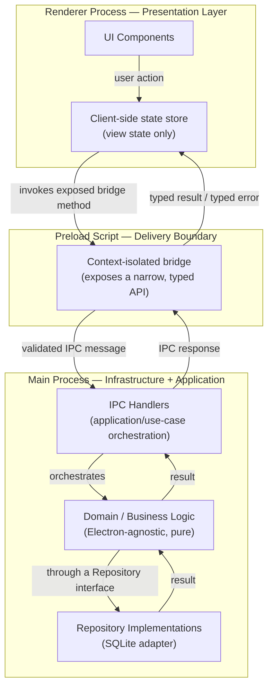

# project-pc-app_v04.md

**Status:** Active
**Layer:** 4 — Project Rules
**Framework Version:** v10
**Tier:** 1 (Critical)
**Archetype:** Desktop Application (Electron-based)
**Purpose:** Apply Layers 1–3 of Framework v10 to the Desktop Application archetype — defining the concrete directory layout, file/class/module naming conventions, and archetype-specific technical decisions required to build a maintainable, AI-collaborable Electron desktop application — without restating any rule already governed by a lower-numbered layer.
**Authority:** This is the Desktop Application artifact of Layer 4 (`FRAMEWORK_BLUEPRINT.md`, Section 2.4). It is a Tier 1 deliverable (`FRAMEWORK_BLUEPRINT.md`, Section 17, Step 1) and becomes fully load-bearing now that `global_rules_revisionfinal_v10.md` (Layer 2) exists and is `Active`, since this document inherits from it rather than from any deprecated predecessor.
**Inherits from:** `AI_DEVELOPMENT_PHILOSOPHY_v2.0.md` (Layer 1 — Constitution), `global_rules_revisionfinal_v10.md` (Layer 2 — Framework Rules), `global_technology_stack_v10.md` (Layer 3 — Technology Standards). Every rule drawn from these three documents is referenced below by name; none is restated, per the framework's inheritance model (`FRAMEWORK_BLUEPRINT.md`, Section 5).
**Governs:** Layer 5–9 artifacts scoped to the Desktop Application archetype — e.g., the desktop-track sections of a future `PROJECT_BOOTSTRAP_GUIDE.md`, any Layer 7 Skill executing inside a PC App project, and any Layer 9 template built for this archetype (e.g., a future `template-electron-*`) — per the downward authority rule (KA-002, `FRAMEWORK_BLUEPRINT.md` Section 6).
**Supersedes:** `project-pc-app_v03.md`, `project-pc-app_기술스택_v03.txt`, and `project-pc-app_prompt_v04.md` — all `Deprecated` as of the v10 freeze (DL-002). The technology stack those documents described (PyQt, PySide, PyInstaller, Inno Setup) is not a valid choice for new desktop work under Framework v10.
**RFC 2119:** The key words **MUST**, **MUST NOT**, **REQUIRED**, **SHALL**, **SHALL NOT**, **SHOULD**, **SHOULD NOT**, **RECOMMENDED**, **MAY**, and **OPTIONAL** in this document are to be interpreted as described in RFC 2119. They apply to every rule below without exception unless the rule itself states otherwise.

---

## 0. Scope and Position in the Knowledge Architecture

This document is one of four planned Layer 4 artifacts (`FRAMEWORK_BLUEPRINT.md`, Section 3), and the first to be generated:

```
Layer 1 — Constitution                         AI_DEVELOPMENT_PHILOSOPHY_v2.0.md
        ↓
Layer 2 — Framework Rules                       global_rules_revisionfinal_v10.md
        ↓
Layer 3 — Technology Standards                  global_technology_stack_v10.md
        ↓ (this document inherits from all three above, by reference)
Layer 4 — Project Rules  (this document)        project-pc-app_v04.md  ← Desktop / Electron
                                                 project-personal-full-stack_v01.md  (Tier 2, pending)
                                                 project-monolithic_v04.md           (Tier 2, pending)
                                                 project-mobile_v01.md               (Tier 3 / v10.1, pending)
        ↓
Layer 5 — Developer Manuals
Layer 6 — Reference Implementations
Layer 7 — AI Skills
Layer 8 — Prompt Library
Layer 9 — Project Templates
```

**What this document contains.** The directory layout, naming conventions, and archetype-specific technical decisions that apply specifically to a Desktop Application built with Electron — including how the framework's Clean Architecture boundary (`global_rules_revisionfinal_v10.md`, Section 3.2), vendor-independence rule (`global_rules_revisionfinal_v10.md`, Section 2), and persistence philosophy (`AI_DEVELOPMENT_PHILOSOPHY_v2.0.md`, Sections 12–13) apply concretely across Electron's multi-process model.

**What this document does not contain, by design.** Per its Layer 4 prohibited responsibilities (`FRAMEWORK_BLUEPRINT.md`, Section 2.4):

- It **MUST NOT** restate SOLID, Clean Architecture, the TDD boundary, Git workflow rules, or the vendor-independence rule. Those are inherited by reference from `global_rules_revisionfinal_v10.md` and cited, not reproduced.
- It **MUST NOT** define step-by-step developer workflow (session initialization, bootstrap procedure, HITL Gate sequencing). Those belong to Layer 5 (`FRAMEWORK_README.md`, `PROJECT_BOOTSTRAP_GUIDE.md`).
- It **MUST NOT** contain a full worked tutorial with vendor-specific implementation detail. That belongs to Layer 6.
- It **MUST NOT** define reusable, directly-executable AI Skills. Those belong to Layer 7 (`SKILLS.md` and individual Skill documents).
- It **MUST NOT** restate the canonical technology table. Technology approval, defaults, and alternatives belong to `global_technology_stack_v10.md` (Layer 3); this document applies the archetype-relevant subset of that table rather than reproducing it.

**How an AI agent uses this document.** Per `FRAMEWORK_BLUEPRINT.md` Section 2.4's AI interaction model, an agent reads exactly one Layer 4 document per project — this one, whenever the project's archetype is a PC/desktop application. It is read once at project bootstrap (`FRAMEWORK_BLUEPRINT.md`, Section 16) and re-consulted whenever a structural or naming question arises during execution.

---

## 1. Inheritance Declaration

Per the inheritance rule that a Project Rule document must open with an explicit statement of what it inherits (`FRAMEWORK_BLUEPRINT.md`, Section 5), this document inherits, by reference and without restatement:

| From | Document | What is inherited |
|---|---|---|
| Layer 1 | `AI_DEVELOPMENT_PHILOSOPHY_v2.0.md` | Core value ordering (Section 4); AI-First and Agentic Engineering principles (Sections 5–6); Development Environment principle (Section 10); Dev Container philosophy (Section 11); Database philosophy — SQLite default (Section 12); Persistence Independence — Repository Pattern (Section 13); Package Management philosophy — Poetry/uv (Section 14, Python-specific and not applicable to this archetype's Node.js/Electron runtime; see Section 8 of this document for the applicable Layer 3 pick); Vendor Independence (Section 15). |
| Layer 2 | `global_rules_revisionfinal_v10.md` | Vendor Independence as a binding rule (Section 2); Architecture Rules — Separation of Concerns, Clean Architecture Boundaries, Extensibility (Section 3); the TDD Boundary table (Section 4); Git Workflow Rules (Section 5); Environment and Dependency Management Principles (Section 6); Code Quality Gates (Section 7); Documentation Standards (Section 8); Security Baselines (Section 9); Definition of Done (Section 10); Exception Handling Rule (Section 11). |
| Layer 3 | `global_technology_stack_v10.md` | The canonical technology table in full, including the desktop-framework default (Electron, per TD-002) and the currently confirmed package-manager and state-management defaults referenced throughout this document (Section 8). This document applies the archetype-relevant subset of that table; it does not reproduce the table itself. |

Where this document states a technical decision, it is either (a) a direct application of a Layer 3 default to this archetype, cited as such, or (b) a directory-layout or naming-convention choice that is this layer's own designated responsibility (`FRAMEWORK_BLUEPRINT.md`, Section 2.4, "Responsibilities"). It is never a new architectural decision at the Layer 1–3 level.

---

## 2. Archetype Definition

The **PC App** archetype covers single-user, cross-platform desktop software distributed as an installable application for Windows, macOS, and Linux, intended to run on a developer's Home PC, Office PC, and laptop interchangeably, consistent with the Constitution's Development Environment principle (`AI_DEVELOPMENT_PHILOSOPHY_v2.0.md`, Section 10).

1. A PC App project **MUST** target Electron as its desktop application framework (TD-002; `FRAMEWORK_BLUEPRINT.md`, Section 2.4). PyQt, PySide, PyInstaller, and Inno Setup **MUST NOT** be used for any new PC App project; these are `Deprecated` (DL-002) and are not a Layer 3 alternative for this archetype.
2. A PC App project **SHOULD** include a Dev Container configuration for the application's non-native development activities (writing and testing business logic, running linters, running the domain/application test suites), consistent with the Constitution's Dev Container philosophy (`AI_DEVELOPMENT_PHILOSOPHY_v2.0.md`, Section 11).
3. Native, host-level execution **MUST** be used for building, packaging, and manually verifying the Electron shell itself (window chrome, OS-level integrations, installer output), since these cannot be meaningfully exercised inside a container. This is consistent with, not an exception to, the Constitution's statement that native execution **MAY** be used and is not the primary workflow (`AI_DEVELOPMENT_PHILOSOPHY_v2.0.md`, Section 10) — for this archetype specifically, native execution is a required supplement to the containerized workflow rather than a full replacement of it.

---

## 3. Process Architecture

Electron's multi-process model **MUST** be mapped onto the Clean Architecture boundary required by `global_rules_revisionfinal_v10.md`, Section 3.2, rather than treated as an architecture of its own. The domain and application layers **MUST** be written as plain, Electron-agnostic modules that do not import Electron APIs; the main and preload processes are infrastructure/delivery mechanisms that consume those modules, exactly as any other framework code would.



1. The **renderer process** **MUST** be treated as the presentation/delivery layer only. It **MUST NOT** contain business rules, validation logic, or direct persistence access.
2. The **preload script** **MUST** be the only code that bridges renderer and main processes, using Electron's context isolation. It **MUST** expose a narrow, explicitly typed API surface — never a generic "invoke anything" passthrough — consistent with the least-privilege principle (`global_rules_revisionfinal_v10.md`, Section 9.4).
3. The **main process** **MUST** host the application/use-case orchestration layer and the infrastructure/adapter layer (including the persistence adapter, Section 7). Domain logic invoked from the main process **MUST** remain importable and unit-testable without an Electron runtime present, satisfying the Layer 2 requirement that business logic be testable without a UI framework running (`global_rules_revisionfinal_v10.md`, Section 3.1.1).

---

## 4. Directory Layout

The following directory layout is this document's Layer 4 responsibility to define (`FRAMEWORK_BLUEPRINT.md`, Section 2.4, "Define the project-type-specific directory layout") and is binding for every new PC App project.

```
project-root/
├── src/
│   ├── domain/                 # Pure business logic. No Electron, no I/O.
│   │   ├── entities/
│   │   ├── value-objects/
│   │   └── errors/
│   ├── application/             # Use cases; orchestrates domain + repository interfaces.
│   │   ├── use-cases/
│   │   └── ports/               # Repository and service interfaces (EP-001 seams).
│   ├── infrastructure/          # Concrete adapters. Only layer allowed to import vendor SDKs.
│   │   ├── persistence/
│   │   │   └── sqlite/          # SQLite repository implementations (Section 7).
│   │   └── system/               # OS-level integrations (filesystem, notifications, etc.).
│   ├── main/                     # Electron main-process entry point and IPC handlers.
│   │   ├── ipc/                  # One handler module per IPC channel group (Section 6).
│   │   └── index.ts (or .js)     # Main process bootstrap only — no business logic.
│   ├── preload/                  # Context-isolated bridge (Section 3.2).
│   │   └── index.ts (or .js)
│   └── renderer/                 # Presentation layer only.
│       ├── components/
│       ├── views/
│       └── state/                # Client-side view-state store (Section 9).
├── tests/
│   ├── domain/                   # Test-first, per the TDD Boundary (Section 10).
│   ├── application/
│   ├── infrastructure/
│   └── e2e/                      # Whole-application behavioral tests.
├── resources/                    # Icons, installer assets, non-code build inputs.
├── .env.example
├── .gitignore
└── README.md
```

1. Business logic **MUST** live under `src/domain/` and `src/application/` only. A file under `src/main/`, `src/preload/`, or `src/renderer/` that contains a business rule or validation decision **MUST** be treated as a defect and relocated.
2. `src/infrastructure/` is the **only** directory permitted to import a vendor SDK or a Node.js persistence driver directly, satisfying the vendor-independence rule that external dependencies be accessed only through an owned interface (`global_rules_revisionfinal_v10.md`, Section 2.2).
3. `src/application/ports/` **MUST** hold every interface that `src/infrastructure/` implements. An application/use-case module **MUST** depend on a port, never on a concrete infrastructure class.
4. This layout **MAY** be extended with additional subfolders as a project grows (e.g., `src/domain/<bounded-context>/`), but the five top-level boundaries under `src/` (`domain`, `application`, `infrastructure`, `main`, `preload`, `renderer`) **MUST NOT** be collapsed or renamed, since Layer 7 Skills and Layer 9 templates for this archetype will assume this layout by convention.

---

## 5. Naming Conventions

The following conventions are binding for every file, class, and module in a PC App project, per this layer's designated responsibility to define archetype-level naming (`FRAMEWORK_BLUEPRINT.md`, Section 2.4).

| Artifact | Convention | Example |
|---|---|---|
| Source files | `kebab-case`, suffixed by role where the role is not obvious from directory alone | `create-transaction.use-case.ts`, `transaction.repository.ts` |
| Classes, interfaces, types | `PascalCase` | `TransactionRepository`, `CreateTransactionUseCase` |
| Functions, variables | `camelCase` | `createTransaction`, `isValidAmount` |
| Constants (module-level, immutable) | `UPPER_SNAKE_CASE` | `MAX_RETRY_COUNT` |
| Repository interfaces (ports) | `<Entity>Repository` | `AccountRepository` |
| Repository implementations (adapters) | `<Vendor><Entity>Repository` | `SqliteAccountRepository` |
| Use cases | `<Verb><Noun>UseCase` | `ImportStatementUseCase` |
| IPC channel identifiers | `<domain>:<action>`, lower-kebab segments | `accounts:create`, `accounts:list` |
| Test files | Mirror the file under test, suffixed `.test` or `.spec` per the test runner declared in `global_technology_stack_v10.md` | `create-transaction.use-case.test.ts` |

1. A file **MUST NOT** mix responsibilities implied by its own name — a file named `*.use-case.ts` **MUST NOT** contain infrastructure code, and a file named `*.repository.ts` under `infrastructure/` **MUST NOT** contain business rules.
2. IPC channel identifiers **MUST** be centrally declared (e.g., a single `ipc-channels` module imported by both preload and main) rather than repeated as string literals across files, so that renaming a channel is a one-file change.

---

## 6. IPC Communication and Error Handling Pattern

This section is the archetype-specific addition anticipated by `FRAMEWORK_BLUEPRINT.md`, Section 5 (a Layer 4 document "adds" an archetype-specific pattern on top of inherited Layer 2 rules — there, given as the example of "Electron-specific IPC error handling pattern"). It is an application of already-frozen rules to Electron's process boundary, not a new architectural decision.

1. Every IPC channel **MUST** be treated as a trust boundary. Payloads crossing from renderer to main **MUST** be validated before use in business logic, per the Layer 2 rule that input from outside the application's trust boundary must be validated (`global_rules_revisionfinal_v10.md`, Section 9.3).
2. An IPC handler in `src/main/ipc/` **MUST NOT** catch a generic/base exception and return it verbatim to the renderer. It **MUST** either (a) let a narrowly-typed domain or application error propagate to a single top-level IPC error boundary that maps it to a typed, serializable error response, or (b) catch a specific, anticipated exception type and translate it explicitly — consistent with the Exception Handling Rule (`global_rules_revisionfinal_v10.md`, Section 11).
3. Errors returned across the IPC boundary **MUST** be structured (e.g., a stable `code` plus a human-readable `message`), never a raw stack trace or a generic "something went wrong" string, so that the renderer can make presentation decisions without inspecting error internals.
4. An IPC handler **MUST NOT** silently swallow a failure. Every caught error **MUST** either be logged, re-raised in translated form, or both, per the no-silent-swallowing rule (`global_rules_revisionfinal_v10.md`, Section 11.4).
5. An IPC handler **MUST** remain a thin orchestration layer: it receives a validated payload, invokes exactly one use case from `src/application/use-cases/`, and maps the result or error to a response. Business logic **MUST NOT** be written inline inside an IPC handler.

---

## 7. Persistence Architecture

This section applies the Constitution's database and persistence-independence philosophy (`AI_DEVELOPMENT_PHILOSOPHY_v2.0.md`, Sections 12–13) and the Layer 2 vendor-independence rule (`global_rules_revisionfinal_v10.md`, Section 2) to the Electron process model.

1. SQLite **MUST** be the default persistence engine for a PC App project, per the Constitution's database philosophy (`AI_DEVELOPMENT_PHILOSOPHY_v2.0.md`, Section 12). The SQLite database file **MUST** be stored under the operating system's per-user application-data directory, resolved via Electron's `app.getPath()`-equivalent mechanism, never inside the application's installation directory.
2. All SQLite access **MUST** occur exclusively from the main process, inside `src/infrastructure/persistence/sqlite/`. The renderer process **MUST NOT** open a database connection or import a database driver, directly or transitively.
3. Every persistence operation available to the application layer **MUST** be expressed as a Repository interface declared in `src/application/ports/`, with its concrete SQLite implementation in `src/infrastructure/persistence/sqlite/`, per the Repository Pattern requirement (`AI_DEVELOPMENT_PHILOSOPHY_v2.0.md`, Section 13) and the vendor-independence rule that replacing a vendor must be confined to the infrastructure layer (`global_rules_revisionfinal_v10.md`, Section 2.3).
4. A future migration away from SQLite (e.g., to a client-server database, should a project's requirements outgrow a single-file store) **MUST** require changes confined to `src/infrastructure/persistence/`. If such a migration would require a change to `src/domain/` or `src/application/use-cases/`, the Repository abstraction has failed and **MUST** be corrected before the migration is considered complete.
5. Database schema migrations **MUST** be version-tracked and applied idempotently on application startup, so that upgrading the application on a user's machine never requires manual database intervention.

---

## 8. Layer 3 Technology Application

Per Section 2.4 of `FRAMEWORK_BLUEPRINT.md`, this document applies — but does not restate — the Layer 3 canonical technology table. The following selections are confirmed Layer 3 defaults that this archetype **MUST** use:

1. **Desktop framework:** Electron (TD-002). See Section 2 of this document.
2. **Package manager:** pnpm. Every PC App project **MUST** use pnpm for dependency installation and lockfile management, consistent with the Layer 2 requirement that dependency versions be pinned or lock-filed for byte-for-byte reproducible builds (`global_rules_revisionfinal_v10.md`, Section 6.2). npm and yarn **MUST NOT** be used as the project's package manager.
3. **Renderer state management:** Zustand. A Zustand store **MUST** hold presentation/view state only (e.g., current screen, loading flags, cached read-only projections of use-case results). It **MUST NOT** hold authoritative business state or perform validation, per the Clean Architecture boundary (`global_rules_revisionfinal_v10.md`, Section 3.2.2) — the renderer remains outer-layer/delivery code regardless of which state library manages its UI state.

Selection of the specific renderer UI library, the automated test runner, and the build/packaging/distribution tooling (e.g., the installer-generation tool that replaces the deprecated Inno Setup) **MUST** be taken from the canonical technology table in `global_technology_stack_v10.md` at the time a project is bootstrapped. This document intentionally does not name those tools, so that this Layer 4 document does not drift out of sync with Layer 3 as that table evolves; an AI agent bootstrapping a PC App project **MUST** consult `global_technology_stack_v10.md` directly for these selections rather than infer them from this document.

---

## 9. Applying the TDD Boundary to This Archetype

The TDD Boundary itself is defined once, at Layer 2, and is not restated here (`global_rules_revisionfinal_v10.md`, Section 4). This section maps that boundary onto the directory layout of Section 4.

| Zone (Layer 2 definition) | Directory in this archetype | TDD requirement |
|---|---|---|
| Business/domain logic | `src/domain/` | **MUST** be developed test-first (`tests/domain/`). |
| Application/use-case orchestration | `src/application/` | **SHOULD** be developed test-first; **MUST** have coverage before a commit is done (`tests/application/`). |
| Infrastructure adapters | `src/infrastructure/` | **SHOULD** have integration-level tests against a real (e.g., temporary, file-based) SQLite instance; test-first is RECOMMENDED, not mandatory (`tests/infrastructure/`). |
| UI/presentation, CLI wiring, framework glue | `src/main/` (bootstrap only), `src/preload/`, `src/renderer/` | **MAY** be developed without strict test-first; behavior-level and end-to-end tests are preferred over implementation-detail tests (`tests/e2e/`). |

An IPC handler in `src/main/ipc/` sits at the seam between the "application/use-case orchestration" zone and the "framework glue" zone: the handler function itself (routing, payload mapping) falls in the latter zone, while the use case it invokes falls in the former. Splitting these two responsibilities cleanly (Section 6, Rule 5) is what makes this distinction meaningful rather than ambiguous.

---

## 10. Prohibited Responsibilities — Explicit Boundary

Consistent with `FRAMEWORK_BLUEPRINT.md`, Section 2.4, this document explicitly does **not** do the following, and any future edit that adds one of these is out of scope for Layer 4 and MUST be redirected to the correct layer instead:

| Not defined here | Correct layer |
|---|---|
| Step-by-step session initialization or project bootstrap procedure | Layer 5 (`FRAMEWORK_README.md`, `PROJECT_BOOTSTRAP_GUIDE.md`) |
| Canonical command reference for this archetype | Layer 5 (`COMMANDS.md`, Tier 2, pending) |
| Full canonical directory reference across all archetypes | Layer 5 (`PROJECT_STRUCTURE.md`, Tier 2, pending) |
| Worked, vendor-specific tutorial | Layer 6 |
| Reusable, directly-executable AI Skill definitions (e.g., a `create-feature` Skill scoped to this archetype) | Layer 7 (`SKILLS.md` and individual Skill documents) |
| Tool-specific prompt wrappers | Layer 8 |
| A ready-to-clone scaffold implementing this document | Layer 9 (a future `template-electron-*`, conforming to `TEMPLATE_SPEC.md`) |
| The canonical technology table itself | Layer 3 (`global_technology_stack_v10.md`) |

---

## 11. Authority and Conflict Resolution

1. Per the downward authority rule (KA-002), this document **MUST NOT** override, contradict, or restate a rule owned by `AI_DEVELOPMENT_PHILOSOPHY_v2.0.md` (Layer 1), `global_rules_revisionfinal_v10.md` (Layer 2), or `global_technology_stack_v10.md` (Layer 3). Any apparent conflict between a rule in this document and one of those three MUST be resolved in favor of the lower-numbered layer, and this document corrected.
2. A Layer 7 Skill, Layer 8 Prompt, or Layer 9 Template scoped to the PC App archetype **MUST NOT** contradict this document. Where one appears to, this document takes precedence, per the same downward authority rule.
3. The full conflict-resolution procedure, including same-layer conflicts, is defined in `FRAMEWORK_BLUEPRINT.md`, Section 6, and is not restated here.

---

## 12. Change Control

1. This document **MUST NOT** be edited silently. A change to any rule in this document that reflects a new architectural decision (as opposed to a clarification of existing, frozen decisions) **MUST** follow the amendment procedure defined in `FRAMEWORK_BLUEPRINT.md`, Section 18.2: proposal → Gate 2 (Architecture Approval) → amendment → `DECISIONS.md` entry → `FRAMEWORK_HANDOVER.md` update in the same commit.
2. Upon this document's creation, `FRAMEWORK_README.md` Sections 4–6 and `FRAMEWORK_STATUS.md` **MUST** be updated in the same change to reflect its new `Active` status and its removal from the "Pending" and "Documents To Generate" lists, per `FRAMEWORK_README.md` Section 9 and the AI Session Instructions in `FRAMEWORK_STATUS.md`.
3. Should `global_technology_stack_v10.md` change a default referenced in Section 8 of this document (e.g., a change in package manager or state-management library), Section 8 **MUST** be updated in the same change that amends the Layer 3 document, so that this document never asserts a Layer 3 default that Layer 3 itself no longer holds.

---

## Closing Statement

This document is the Desktop Application artifact of Layer 4 in Framework v10. It resolves the archetype-level structural gap that stood between `global_rules_revisionfinal_v10.md` (Layer 2, now `Active`) and a buildable Electron project: a concrete directory layout, binding naming conventions, an Electron-specific IPC error-handling pattern, and a persistence architecture that keeps SQLite access confined to the main process behind a Repository seam. No architectural decision has been introduced beyond what `FRAMEWORK_BLUEPRINT.md` Section 2.4 assigns to this layer's responsibility; every rule above either applies an already-frozen Layer 1–3 decision to this archetype or fulfills this layer's own designated duty to define directory structure and naming convention. Per `FRAMEWORK_BLUEPRINT.md` Section 17, the next Tier 1 targets remain `PROJECT_BOOTSTRAP_GUIDE.md`, `DECISIONS.md` (seeded), `SKILLS.md` with its three starter Skills, and `TEMPLATE_SPEC.md`.
