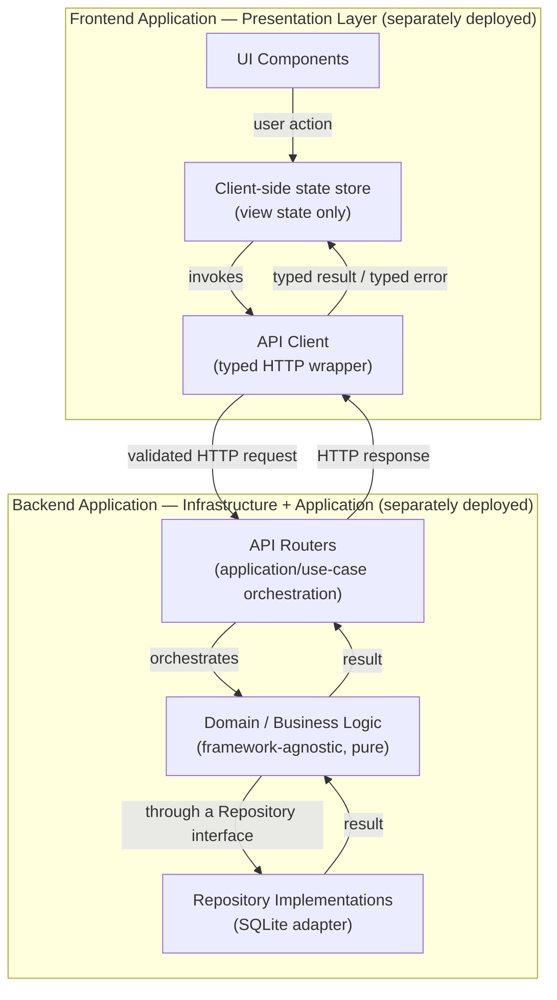

# project-personal-full-stack_v01.md

**Status:** Active
**Layer:** 4 — Project Rules
**Framework Version:** v10
**Tier:** 2 (Required)
**Archetype:** Full-Stack Application (Separate Frontend + Backend)
**Purpose:** Apply Layers 1–3 of Framework v10 to the Full-Stack Application archetype — defining the concrete directory layout, file/class/module naming conventions, and archetype-specific technical decisions required to build a maintainable, AI-collaborable application composed of a separately deployable backend (FastAPI) and frontend (single-page application), communicating over a versioned REST API boundary — without restating any rule already governed by a lower-numbered layer.
**Authority:** This is the Full-Stack Application artifact of Layer 4 (`FRAMEWORK_BLUEPRINT.md`, Section 2.4). It is a Tier 2 deliverable (`FRAMEWORK_BLUEPRINT.md`, Section 17, Step 2), generated only after every Tier 1 document exists (DI-002), and becomes fully load-bearing on the same foundation `project-pc-app_v04.md` already established: `global_rules_revisionfinal_v10.md` (Layer 2, Active) and `global_technology_stack_v10.md` (Layer 3, Active).
**Inherits from:** `AI_DEVELOPMENT_PHILOSOPHY_v2.0.md` (Layer 1 — Constitution), `global_rules_revisionfinal_v10.md` (Layer 2 — Framework Rules), `global_technology_stack_v10.md` (Layer 3 — Technology Standards). Every rule drawn from these three documents is referenced below by name; none is restated, per the framework's inheritance model (`FRAMEWORK_BLUEPRINT.md`, Section 5).
**Governs:** Layer 5–9 artifacts scoped to the Full-Stack Application archetype — the full-stack-track sections of `PROJECT_STRUCTURE.md` and `COMMANDS.md` once they exist, any Layer 7 Skill executing inside a Full-Stack project, and any Layer 9 template built for this archetype (beginning with `template-fastapi-sqlite/`) — per the downward authority rule (KA-002, `FRAMEWORK_BLUEPRINT.md` Section 6).
**Supersedes:** `project-full-stack_v04.md`, `project-full-stack_기술스택_v04.txt`, and `project-full-stack_prompt_v04.md` — all `Deprecated` as of the v10 freeze (DL-002). Per `FRAMEWORK_README.md`, Section 6, Consequence 2: npm/yarn as *required* package managers and Recoil as an approved state-management option, both present in the deprecated documents, are not valid choices for new full-stack work. `global_technology_stack_v10.md` (Active, Layer 3) already governs these choices — pnpm and Zustand — independent of this document's own generation.
**RFC 2119:** The key words **MUST**, **MUST NOT**, **REQUIRED**, **SHALL**, **SHALL NOT**, **SHOULD**, **SHOULD NOT**, **RECOMMENDED**, **MAY**, and **OPTIONAL** in this document are to be interpreted as described in RFC 2119. They apply to every rule below without exception unless the rule itself states otherwise.

---

## 0. Scope and Position in the Knowledge Architecture

This document is the second of four planned Layer 4 artifacts to be generated (`FRAMEWORK_BLUEPRINT.md`, Section 3):

```
Layer 1 — Constitution                         AI_DEVELOPMENT_PHILOSOPHY_v2.0.md
        ↓
Layer 2 — Framework Rules                       global_rules_revisionfinal_v10.md
        ↓
Layer 3 — Technology Standards                  global_technology_stack_v10.md
        ↓ (this document inherits from all three above, by reference)
Layer 4 — Project Rules  (this document)        project-pc-app_v04.md                (Active — Desktop / Electron)
                                                 project-personal-full-stack_v01.md   ← this document
                                                 project-monolithic_v04.md            (Tier 2, pending)
                                                 project-mobile_v01.md                (Tier 3 / v10.1, pending)
        ↓
Layer 5 — Developer Manuals
Layer 6 — Reference Implementations
Layer 7 — AI Skills            SKILLS.md, skill-create-feature.md, skill-generate-tests.md, skill-review-code.md (all Active)
Layer 8 — Prompt Library
Layer 9 — Project Templates     TEMPLATE_SPEC.md (Active); template-fastapi-sqlite/ (pending — this document unblocks it)
```

**What this document contains.** The directory layout, naming conventions, and archetype-specific technical decisions that apply specifically to a Full-Stack Application built as a separately deployable FastAPI backend plus SPA frontend — including how the framework's Clean Architecture boundary (`global_rules_revisionfinal_v10.md`, Section 3.2), vendor-independence rule (`global_rules_revisionfinal_v10.md`, Section 2), and persistence philosophy (`AI_DEVELOPMENT_PHILOSOPHY_v2.0.md`, Sections 12–13) apply concretely across an HTTP API boundary rather than Electron's IPC boundary.

**What this document does not contain, by design.** Per its Layer 4 prohibited responsibilities (`FRAMEWORK_BLUEPRINT.md`, Section 2.4):

- It **MUST NOT** restate SOLID, Clean Architecture, the TDD boundary, Git workflow rules, or the vendor-independence rule. Those are inherited by reference from `global_rules_revisionfinal_v10.md` and cited, not reproduced.
- It **MUST NOT** define step-by-step developer workflow (session initialization, bootstrap procedure, HITL Gate sequencing). Those belong to Layer 5 (`FRAMEWORK_README.md`, `PROJECT_BOOTSTRAP_GUIDE.md`).
- It **MUST NOT** contain a full worked tutorial with vendor-specific implementation detail. That belongs to Layer 6.
- It **MUST NOT** define reusable, directly-executable AI Skills. Those belong to Layer 7 (`SKILLS.md` and individual Skill documents), which this archetype consumes unmodified — all three Tier 1 Skills are archetype-agnostic (`SKILLS.md`, Section 5).
- It **MUST NOT** restate the canonical technology table. Technology approval, defaults, and alternatives belong to `global_technology_stack_v10.md` (Layer 3); this document applies the archetype-relevant subset of that table rather than reproducing it, exactly as `project-pc-app_v04.md` does in its own Section 8.

**How an AI agent uses this document.** Per `FRAMEWORK_BLUEPRINT.md` Section 2.4's AI interaction model, an agent reads exactly one Layer 4 document per project — this one, whenever the project's archetype is a full-stack web application with a separately deployable backend and frontend. It is read once at project bootstrap (`FRAMEWORK_BLUEPRINT.md`, Section 16) and re-consulted whenever a structural or naming question arises during execution.

---

## 1. Inheritance Declaration

Per the inheritance rule that a Project Rule document must open with an explicit statement of what it inherits (`FRAMEWORK_BLUEPRINT.md`, Section 5), this document inherits, by reference and without restatement:

| From | Document | What is inherited |
|---|---|---|
| Layer 1 | `AI_DEVELOPMENT_PHILOSOPHY_v2.0.md` | Core value ordering (Section 4); AI-First and Agentic Engineering principles (Sections 5–6); Development Environment principle (Section 10); Dev Container philosophy (Section 11); Database philosophy — SQLite default (Section 12); Persistence Independence — Repository Pattern and SQLAlchemy (Section 13); Package Management philosophy — Poetry primary, uv alternative (Section 14) — directly applicable to this archetype's Python backend, unlike `project-pc-app_v04.md`, Section 1, where this was noted as inapplicable to a pure Node.js/Electron runtime; Vendor Independence (Section 15). |
| Layer 2 | `global_rules_revisionfinal_v10.md` | Vendor Independence as a binding rule (Section 2); Architecture Rules — Separation of Concerns, Clean Architecture Boundaries, Extensibility (Section 3); the TDD Boundary table (Section 4); Git Workflow Rules (Section 5); Environment and Dependency Management Principles (Section 6); Code Quality Gates (Section 7); Documentation Standards (Section 8); Security Baselines (Section 9); Definition of Done (Section 10); Exception Handling Rule (Section 11). |
| Layer 3 | `global_technology_stack_v10.md` | The canonical technology table in full, including the confirmed backend, database, and frontend-tooling defaults referenced throughout this document (Section 8). This document applies the archetype-relevant subset of that table; it does not reproduce the table itself. |

Where this document states a technical decision, it is either (a) a direct application of a Layer 1–3 default to this archetype, cited as such, or (b) a directory-layout or naming-convention choice that is this layer's own designated responsibility (`FRAMEWORK_BLUEPRINT.md`, Section 2.4, "Responsibilities"). It is never a new architectural decision at the Layer 1–3 level.

---

## 2. Archetype Definition

The **Full-Stack** archetype covers a web application composed of two independently deployable applications — a backend API service and a frontend single-page application (SPA) — communicating exclusively over a versioned HTTP/REST API boundary, intended for the same reproducible-environment workflow the Constitution establishes for every archetype (`AI_DEVELOPMENT_PHILOSOPHY_v2.0.md`, Section 10).

1. A Full-Stack project **MUST** target FastAPI as its backend framework. This is the confirmed Layer 3 backend default this document applies (`global_technology_stack_v10.md`'s canonical technology table); it is independently corroborated by FastAPI being the explicitly named backend of the Layer 9 reference template this document unblocks, `template-fastapi-sqlite/` (`FRAMEWORK_BLUEPRINT.md`, Sections 2.9, 3, and 17) — a name fixed at the original v10 freeze, not introduced by this document.
2. A Full-Stack project **MUST** target SQLite as its default persistence engine, per the Constitution's database philosophy (`AI_DEVELOPMENT_PHILOSOPHY_v2.0.md`, Section 12) and the frozen TD-007 decision (SQLite default, PostgreSQL retained as a defined upgrade path — `DECISIONS.md`, DEC-008).
3. A Full-Stack project **SHOULD** include a Dev Container configuration covering both the backend's and the frontend's non-native development activities (running the backend server, running the frontend dev server, running linters, running domain/application/component test suites), consistent with the Constitution's Dev Container philosophy (`AI_DEVELOPMENT_PHILOSOPHY_v2.0.md`, Section 11).
4. Unlike the PC App archetype, a Full-Stack project has no native/host-level packaging step analogous to Electron's installer build (`project-pc-app_v04.md`, Section 2, Rule 3) — both the backend and the frontend build artifacts **MAY** run entirely inside the containerized workflow, consistent with the Constitution's statement that the containerized workflow is primary (`AI_DEVELOPMENT_PHILOSOPHY_v2.0.md`, Section 10).

---

## 3. Application Architecture — Frontend/Backend Boundary

The Full-Stack archetype's two-application split **MUST** be mapped onto the Clean Architecture boundary required by `global_rules_revisionfinal_v10.md`, Section 3.2, exactly as `project-pc-app_v04.md`, Section 3, maps Electron's process split onto the same boundary — the mechanism differs (HTTP/REST here, IPC there), but the underlying requirement does not. The backend's domain and application layers **MUST** be written as framework-agnostic modules that do not import FastAPI-specific types into domain code; the frontend is presentation/delivery code exactly as Electron's renderer process is.



1. The **frontend application** **MUST** be treated as the presentation/delivery layer only. It **MUST NOT** contain business rules, validation logic, or direct persistence access — identical in spirit to the renderer-process constraint in `project-pc-app_v04.md`, Section 3.1.
2. The **API client** module **MUST** be the only frontend code that issues HTTP requests to the backend. It **MUST** expose a narrow, explicitly typed interface to the rest of the frontend — never raw, ad hoc `fetch`/HTTP calls scattered across components — consistent with the least-privilege and narrow-surface principle `project-pc-app_v04.md`, Section 3.2, already applies to Electron's preload bridge.
3. The **backend application** **MUST** host the application/use-case orchestration layer (API routers) and the infrastructure/adapter layer (including the persistence adapter, Section 7). Domain logic **MUST** remain importable and unit-testable without a running HTTP server, satisfying the Layer 2 requirement that business logic be testable without a UI or transport framework running (`global_rules_revisionfinal_v10.md`, Section 3.1.1).
4. Unlike the PC App archetype, frontend and backend in this archetype are **separately deployable artifacts**, not two processes of one packaged application. Every cross-boundary call **MUST** therefore be treated as crossing a network trust boundary, not merely a process boundary — this has direct consequences for the communication pattern (Section 6) and is a stricter, not looser, requirement than Electron's IPC boundary.

---

## 4. Directory Layout

The following directory layout is this document's Layer 4 responsibility to define (`FRAMEWORK_BLUEPRINT.md`, Section 2.4, "Define the project-type-specific directory layout") and is binding for every new Full-Stack project.

```
project-root/
├── backend/
│   ├── src/
│   │   ├── domain/                  # Pure business logic. No FastAPI, no I/O.
│   │   │   ├── entities/
│   │   │   ├── value_objects/
│   │   │   └── errors/
│   │   ├── application/             # Use cases; orchestrates domain + repository interfaces.
│   │   │   ├── use_cases/
│   │   │   └── ports/               # Repository and service interfaces (EP-001 seams).
│   │   ├── infrastructure/          # Concrete adapters. Only layer allowed to import vendor SDKs.
│   │   │   ├── persistence/
│   │   │   │   └── sqlite/          # SQLite repository implementations (Section 7).
│   │   │   └── external/            # Outbound calls to third-party services, if any.
│   │   └── api/                     # FastAPI delivery layer and routers (Section 6).
│   │       ├── routers/             # One router module per resource group.
│   │       ├── schemas/             # Request/response models (validation boundary).
│   │       └── main.py              # FastAPI app bootstrap only — no business logic.
│   ├── tests/
│   │   ├── domain/                  # Test-first, per the TDD Boundary (Section 9).
│   │   ├── application/
│   │   ├── infrastructure/
│   │   └── api/                     # Router-level behavioral/integration tests.
│   ├── pyproject.toml                # Poetry project definition (Section 8).
│   └── .env.example
├── frontend/
│   ├── src/
│   │   ├── components/
│   │   ├── views/
│   │   ├── state/                    # Client-side view-state store (Section 9).
│   │   └── api-client/                # Typed HTTP client (Section 3, Rule 2).
│   ├── tests/
│   │   ├── unit/
│   │   └── e2e/
│   ├── package.json                  # pnpm project definition (Section 8).
│   └── .env.example
├── resources/                        # Shared non-code assets (e.g., OpenAPI schema exports), if any.
├── .gitignore
└── README.md
```

1. Business logic **MUST** live under `backend/src/domain/` and `backend/src/application/` only. A file under `backend/src/api/` or anywhere in `frontend/` that contains a business rule or validation decision **MUST** be treated as a defect and relocated.
2. `backend/src/infrastructure/` is the **only** directory permitted to import a vendor SDK or a database driver directly, satisfying the vendor-independence rule that external dependencies be accessed only through an owned interface (`global_rules_revisionfinal_v10.md`, Section 2.2).
3. `backend/src/application/ports/` **MUST** hold every interface that `backend/src/infrastructure/` implements. An application/use-case module **MUST** depend on a port, never on a concrete infrastructure class.
4. `frontend/src/api-client/` **MUST** be the only frontend directory that references the backend's API contract directly (endpoint paths, request/response shapes). No other frontend directory **MUST** construct an HTTP request to the backend independently.
5. This layout **MAY** be extended with additional subfolders as a project grows (e.g., `backend/src/domain/<bounded-context>/`), but the top-level boundaries — `backend/` vs. `frontend/`, and within `backend/src/`: `domain`, `application`, `infrastructure`, `api` — **MUST NOT** be collapsed or renamed, since Layer 7 Skills and Layer 9 templates for this archetype will assume this layout by convention, exactly as `project-pc-app_v04.md`, Section 4, Rule 4, already establishes for the Desktop archetype.

---

## 5. Naming Conventions

The following conventions are binding for every file, class, and module in a Full-Stack project, per this layer's designated responsibility to define archetype-level naming (`FRAMEWORK_BLUEPRINT.md`, Section 2.4). Because this archetype spans two languages, conventions are stated per side of the boundary rather than as a single cross-language table — this is a direct, non-arbitrary consequence of the archetype's own two-application design (Section 3), not a new rule.

### 5.1 Backend (Python)

| Artifact | Convention | Example |
|---|---|---|
| Source files, modules | `snake_case`, per Python (PEP 8) convention | `create_transaction_use_case.py`, `transaction_repository.py` |
| Classes, Pydantic schemas | `PascalCase` | `TransactionRepository`, `CreateTransactionUseCase` |
| Functions, variables | `snake_case` | `create_transaction`, `is_valid_amount` |
| Constants (module-level, immutable) | `UPPER_SNAKE_CASE` | `MAX_RETRY_COUNT` |
| Repository interfaces (ports) | `<Entity>Repository` | `AccountRepository` |
| Repository implementations (adapters) | `Sqlite<Entity>Repository` | `SqliteAccountRepository` |
| Use cases | `<Verb><Noun>UseCase` | `ImportStatementUseCase` |
| API routes (paths) | `/<resource>`, plural, lower-kebab where multi-word | `/accounts`, `/import-statements` |
| Test files | Mirror the file under test, prefixed `test_` per the Layer 3 test runner's convention | `test_create_transaction_use_case.py` |

### 5.2 Frontend (TypeScript/JavaScript)

| Artifact | Convention | Example |
|---|---|---|
| Source files | `kebab-case`, suffixed by role where not obvious from directory alone | `account-list.view.ts`, `accounts.api-client.ts` |
| Classes, interfaces, types, components | `PascalCase` | `AccountList`, `Account` |
| Functions, variables | `camelCase` | `fetchAccounts`, `isLoading` |
| Constants (module-level, immutable) | `UPPER_SNAKE_CASE` | `MAX_PAGE_SIZE` |
| Test files | Mirror the file under test, suffixed `.test` or `.spec` per the Layer 3 test runner | `account-list.view.test.ts` |

1. A backend file **MUST NOT** mix responsibilities implied by its own name — a file named `*_use_case.py` **MUST NOT** contain infrastructure code, and a file named `*_repository.py` under `infrastructure/` **MUST NOT** contain business rules — the same discipline `project-pc-app_v04.md`, Section 5, Rule 1, already applies to its archetype.
2. API route paths **MUST** be centrally declared and versioned (e.g., under an `/api/v1/` prefix) rather than scattered as ad hoc string literals across router modules, so that a breaking API change is a one-file, deliberate decision rather than an incidental drift.

---

## 6. API Communication and Error Handling Pattern

This section is the archetype-specific addition anticipated by `FRAMEWORK_BLUEPRINT.md`, Section 5 — the Full-Stack analogue of the "Electron-specific IPC error handling pattern" `project-pc-app_v04.md`, Section 6, already defines for its own archetype. It is an application of already-frozen rules to this archetype's HTTP boundary, not a new architectural decision.

1. Every API endpoint **MUST** be treated as a trust boundary. Request payloads crossing from frontend to backend **MUST** be validated before use in business logic, per the Layer 2 rule that input from outside the application's trust boundary must be validated (`global_rules_revisionfinal_v10.md`, Section 9.3) — this requirement is, if anything, stricter here than in `project-pc-app_v04.md`, since the frontend and backend are separately deployed and the boundary is a genuine network boundary, not merely an inter-process one (Section 3, Rule 4).
2. Request and response validation **MUST** be expressed through the backend's schema layer (`backend/src/api/schemas/`), not performed ad hoc inside a router function.
3. An API router **MUST NOT** catch a generic/base exception and return it verbatim to the frontend. It **MUST** either (a) let a narrowly-typed domain or application error propagate to a single application-level exception handler that maps it to a structured, versioned error response, or (b) catch a specific, anticipated exception type and translate it explicitly — consistent with the Exception Handling Rule (`global_rules_revisionfinal_v10.md`, Section 11).
4. Errors returned across the API boundary **MUST** be structured (e.g., a stable machine-readable error code plus a human-readable message), never a raw stack trace or an undifferentiated "something went wrong" string, so that the frontend can make presentation decisions without inspecting error internals — identical in intent to the structured-error requirement `project-pc-app_v04.md`, Section 6, Rule 3, already states for IPC responses.
5. An API router **MUST NOT** silently swallow a failure. Every caught error **MUST** either be logged, re-raised in translated form, or both, per the no-silent-swallowing rule (`global_rules_revisionfinal_v10.md`, Section 11.4).
6. An API router **MUST** remain a thin orchestration layer: it receives a validated request, invokes exactly one use case from `backend/src/application/use_cases/`, and maps the result or error to a response. Business logic **MUST NOT** be written inline inside a router function.
7. Because frontend and backend are independently deployable, the API contract itself (endpoint shapes, request/response schemas) **MUST** be treated as a versioned artifact — a breaking change to a schema **MUST** be a deliberate, coherent commit (`global_rules_revisionfinal_v10.md`, Section 5.2), not an incidental side effect of an unrelated backend change.

---

## 7. Persistence Architecture

This section applies the Constitution's database and persistence-independence philosophy (`AI_DEVELOPMENT_PHILOSOPHY_v2.0.md`, Sections 12–13) and the Layer 2 vendor-independence rule (`global_rules_revisionfinal_v10.md`, Section 2) to this archetype's backend.

1. SQLite **MUST** be the default persistence engine for a Full-Stack project's backend, per the Constitution's database philosophy (`AI_DEVELOPMENT_PHILOSOPHY_v2.0.md`, Section 12) and TD-007 (`DECISIONS.md`, DEC-008). The SQLite database file **MUST** be stored at a path supplied via environment configuration (`.env.example`, Section 4), never hardcoded into application code.
2. All SQLite access **MUST** occur exclusively from `backend/src/infrastructure/persistence/sqlite/`. Neither `backend/src/api/` nor any part of `frontend/` **MUST** open a database connection or import a database driver, directly or transitively.
3. Every persistence operation available to the application layer **MUST** be expressed as a Repository interface declared in `backend/src/application/ports/`, with its concrete SQLite implementation in `backend/src/infrastructure/persistence/sqlite/`, per the Repository Pattern requirement (`AI_DEVELOPMENT_PHILOSOPHY_v2.0.md`, Section 13, which names SQLAlchemy directly as the isolating mechanism — directly applicable here, unlike in `project-pc-app_v04.md`, Section 1, where SQLAlchemy was noted as inapplicable to a Node.js runtime) and the vendor-independence rule that replacing a vendor must be confined to the infrastructure layer (`global_rules_revisionfinal_v10.md`, Section 2.3).
4. A future migration away from SQLite (e.g., to PostgreSQL, the defined TD-007 upgrade path) **MUST** require changes confined to `backend/src/infrastructure/persistence/`. If such a migration would require a change to `backend/src/domain/` or `backend/src/application/use_cases/`, the Repository abstraction has failed and **MUST** be corrected before the migration is considered complete.
5. Database schema migrations **MUST** be version-tracked and applied idempotently at backend startup or via an explicit migration command, so that deploying a new backend version never requires manual database intervention.

---

## 8. Layer 3 Technology Application

Per Section 2.4 of `FRAMEWORK_BLUEPRINT.md`, this document applies — but does not restate — the Layer 3 canonical technology table. The following selections are confirmed Layer 3 (or, where noted, Layer 1) defaults that this archetype **MUST** use:

1. **Backend framework:** FastAPI (Section 2, Rule 1).
2. **Backend package manager:** Poetry, primary; uv, alternative — per the Constitution's Package Management Philosophy (`AI_DEVELOPMENT_PHILOSOPHY_v2.0.md`, Section 14), directly applicable here since this archetype's backend is Python, unlike the PC App archetype's Node.js/Electron runtime.
3. **Database:** SQLite, default; PostgreSQL, defined upgrade path (TD-007). See Section 7.
4. **Frontend package manager:** pnpm. Every Full-Stack project's frontend **MUST** use pnpm for dependency installation and lockfile management, consistent with the Layer 2 requirement that dependency versions be pinned or lock-filed for byte-for-byte reproducible builds (`global_rules_revisionfinal_v10.md`, Section 6.2), and consistent with `FRAMEWORK_README.md`, Section 6, Consequence 2, which already confirms pnpm applies to this archetype independent of this document's own generation. npm and yarn **MUST NOT** be used as the frontend's package manager.
5. **Frontend state management:** Zustand. A Zustand store **MUST** hold presentation/view state only (current screen, loading flags, cached read-only projections of API results). It **MUST NOT** hold authoritative business state or perform validation, per the Clean Architecture boundary (`global_rules_revisionfinal_v10.md`, Section 3.2.2) — the frontend remains outer-layer/delivery code regardless of which state library manages its UI state, identical in principle to `project-pc-app_v04.md`, Section 8, Rule 3. Recoil **MUST NOT** be used, per `FRAMEWORK_README.md`, Section 6, Consequence 2.

Selection of the specific frontend UI framework/library, the automated test runners for both backend and frontend, the ORM/query layer used inside the SQLite adapter, and hosting/CI tooling **MUST** be taken from the canonical technology table in `global_technology_stack_v10.md` at the time a project is bootstrapped. This document intentionally does not name those tools, so that this Layer 4 document does not drift out of sync with Layer 3 as that table evolves — the same restraint `project-pc-app_v04.md`, Section 8, already applies to its own archetype's undetermined selections; an AI agent bootstrapping a Full-Stack project **MUST** consult `global_technology_stack_v10.md` directly for these selections rather than infer them from this document.

---

## 9. Applying the TDD Boundary to This Archetype

The TDD Boundary itself is defined once, at Layer 2, and is not restated here (`global_rules_revisionfinal_v10.md`, Section 4). This section maps that boundary onto the directory layout of Section 4.

| Zone (Layer 2 definition) | Directory in this archetype | TDD requirement |
|---|---|---|
| Business/domain logic | `backend/src/domain/` | **MUST** be developed test-first (`backend/tests/domain/`). |
| Application/use-case orchestration | `backend/src/application/` | **SHOULD** be developed test-first; **MUST** have coverage before a commit is done (`backend/tests/application/`). |
| Infrastructure adapters | `backend/src/infrastructure/` | **SHOULD** have integration-level tests against a real, temporary, file-based SQLite instance; test-first is RECOMMENDED, not mandatory (`backend/tests/infrastructure/`). |
| UI/presentation, framework glue | `backend/src/api/` (routers, bootstrap), all of `frontend/src/` | **MAY** be developed without strict test-first; behavior-level and end-to-end tests are preferred over implementation-detail tests (`backend/tests/api/`, `frontend/tests/e2e/`). |

An API router in `backend/src/api/routers/` sits at the same seam `project-pc-app_v04.md`, Section 9, already identifies for an IPC handler: the router function itself (routing, request/response mapping) falls in the "framework glue" zone, while the use case it invokes falls in the "application/use-case orchestration" zone. Splitting these two responsibilities cleanly (Section 6, Rule 6) is what makes this distinction meaningful rather than ambiguous. The frontend's `api-client/` module sits in the same glue zone as the router — it MAY be tested behaviorally (e.g., via a mocked HTTP layer) but is not subject to the test-first requirement that binds `backend/src/domain/`.

---

## 10. Prohibited Responsibilities — Explicit Boundary

Consistent with `FRAMEWORK_BLUEPRINT.md`, Section 2.4, this document explicitly does **not** do the following, and any future edit that adds one of these is out of scope for Layer 4 and MUST be redirected to the correct layer instead:

| Not defined here | Correct layer |
|---|---|
| Step-by-step session initialization or project bootstrap procedure | Layer 5 (`FRAMEWORK_README.md`, `PROJECT_BOOTSTRAP_GUIDE.md`) |
| Canonical command reference for this archetype | Layer 5 (`COMMANDS.md`, Tier 2, pending) |
| Full canonical directory reference across all archetypes | Layer 5 (`PROJECT_STRUCTURE.md`, Tier 2, pending) |
| Worked, vendor-specific tutorial | Layer 6 |
| Reusable, directly-executable AI Skill definitions | Layer 7 (`SKILLS.md` and individual Skill documents — all three Tier 1 Skills already apply unmodified, per `SKILLS.md`, Section 5) |
| Tool-specific prompt wrappers | Layer 8 |
| A ready-to-clone scaffold implementing this document | Layer 9 (`template-fastapi-sqlite/`, conforming to `TEMPLATE_SPEC.md`) |
| The canonical technology table itself | Layer 3 (`global_technology_stack_v10.md`) |

---

## 11. Authority and Conflict Resolution

1. Per the downward authority rule (KA-002), this document **MUST NOT** override, contradict, or restate a rule owned by `AI_DEVELOPMENT_PHILOSOPHY_v2.0.md` (Layer 1), `global_rules_revisionfinal_v10.md` (Layer 2), or `global_technology_stack_v10.md` (Layer 3). Any apparent conflict between a rule in this document and one of those three MUST be resolved in favor of the lower-numbered layer, and this document corrected.
2. A Layer 7 Skill, Layer 8 Prompt, or Layer 9 Template scoped to the Full-Stack archetype **MUST NOT** contradict this document. Where one appears to, this document takes precedence, per the same downward authority rule.
3. The full conflict-resolution procedure, including same-layer conflicts, is defined in `FRAMEWORK_BLUEPRINT.md`, Section 6, and is not restated here.

---

## 12. Change Control

1. This document **MUST NOT** be edited silently. A change to any rule in this document that reflects a new architectural decision (as opposed to a clarification of existing, frozen decisions) **MUST** follow the amendment procedure defined in `FRAMEWORK_BLUEPRINT.md`, Section 18.2: proposal → Gate 2 (Architecture Approval) → amendment → `DECISIONS.md` entry → `FRAMEWORK_HANDOVER.md` update in the same commit.
2. Upon this document's creation, `FRAMEWORK_README.md` Sections 4–6 and `FRAMEWORK_STATUS.md` **MUST** be updated in the same change to reflect its new `Active` status and its removal from the "Pending (Tier 2)" lists, per `FRAMEWORK_README.md` Section 9 and the AI Session Instructions in `FRAMEWORK_STATUS.md`.
3. Should `global_technology_stack_v10.md` change a default referenced in Section 8 of this document (e.g., a change in backend framework, package manager, or state-management library), Section 8 **MUST** be updated in the same change that amends the Layer 3 document, so that this document never asserts a Layer 3 default that Layer 3 itself no longer holds.
4. This document's generation directly unblocks Category 1 (Section 5) and Category 5 (Section 9) conformance checks for `template-fastapi-sqlite/` (`TEMPLATE_SPEC.md`, Section 14.3), previously reported as a standing Tier gap. `template-fastapi-sqlite/` MAY now proceed against this document; Category 4 (Prompt Library references) of `TEMPLATE_SPEC.md` remains separately blocked on Layer 8, per that document's own Section 14.1.

---

## Closing Statement

This document is the Full-Stack Application artifact of Layer 4 in Framework v10. It resolves the archetype-level structural gap that stood between `global_rules_revisionfinal_v10.md` (Layer 2, Active) and a buildable FastAPI + SPA project: a concrete two-application directory layout, binding per-language naming conventions, a REST API error-handling pattern analogous to `project-pc-app_v04.md`'s IPC pattern, and a persistence architecture that keeps SQLite access confined to the backend behind a Repository seam. No architectural decision has been introduced beyond what `FRAMEWORK_BLUEPRINT.md` Section 2.4 assigns to this layer's responsibility; every rule above either applies an already-frozen Layer 1–3 decision to this archetype or fulfills this layer's own designated duty to define directory structure and naming convention. This document's completion directly unblocks `template-fastapi-sqlite/` for its Category 1 and Category 5 conformance checks per `TEMPLATE_SPEC.md`.
