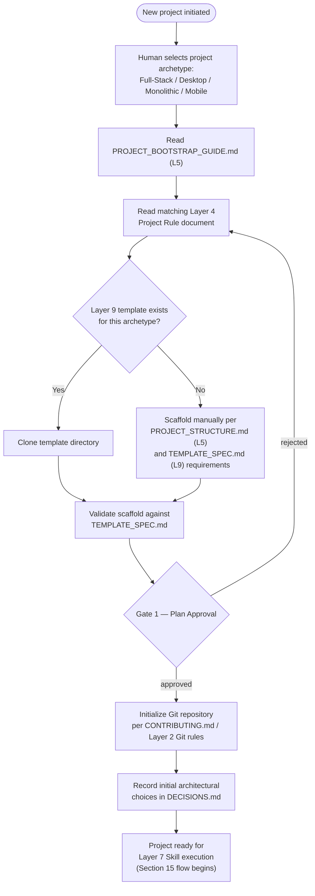

# PROJECT_BOOTSTRAP_GUIDE.md

**Status:** Active
**Layer:** 5 — Developer Manuals
**Tier:** 1 (Critical)
**Purpose:** Define the single, canonical procedure by which a new project is created under this framework — the operational realization of the Project Creation Flow defined in `FRAMEWORK_BLUEPRINT.md`, Section 16 — so that a human developer or an AI agent can bootstrap a project without inventing structure, skipping a required checkpoint, or improvising in the presence of a gap.
**Authority:** Structural derivative of `FRAMEWORK_BLUEPRINT.md`, Sections 2.5 and 16. This document introduces no architectural decision of its own. Every step, rule, and diagram below is traceable to the Project Creation Flow and its governing rules in `FRAMEWORK_BLUEPRINT.md`.
**Inherits from:** Layers 1–4 (the philosophy, rules, technology standards, and project-archetype rules being operationalized) and Layer 7 (the Skills that populate Workflow Phases once bootstrap is complete), per `FRAMEWORK_BLUEPRINT.md`, Section 2.5.
**Governs:** Nothing below it. This is an operational Layer 5 document; it does not create new obligations for Layers 6–11 beyond what they already owe to Layers 1–4.
**Read order:** Read once at the start of every new project — human-initiated or AI-initiated — immediately after the AI Session Initialization Sequence (`FRAMEWORK_README.md`, Section 7 / `FRAMEWORK_BLUEPRINT.md`, Section 14) has completed, and before any Layer 4 Project Rule document is consulted in depth.

---

## 0. How to Use This Document

This document answers exactly one question: **"I am about to start a new project under this framework — what do I do, in what order, and where do I stop to ask for approval?"**

It does not repeat the rules found in Layers 1–4 — it points to them at the moment each becomes relevant. It does not contain a worked tutorial with vendor-specific implementation detail (that is Layer 6's responsibility) and it does not define reusable, directly-executable AI task definitions (that is Layer 7's responsibility, via `SKILLS.md`). If you find yourself looking here for *how* to implement something rather than *what to do next and what to read*, you are looking in the wrong layer.

If any step below directs you to a document that `FRAMEWORK_README.md` currently lists as anything other than `Active`, stop and read Section 5 of this guide before proceeding. Do not substitute a deprecated document, and do not improvise the missing content yourself.

---

## 1. Scope and Boundaries

**What this document contains.** The ordered procedure for taking a project from "a human has decided to build something" to "the project is bootstrapped and ready for Layer 7 Skill execution to begin," including the one HITL Gate that sits inside this flow.

**What this document does not contain, by design** (`FRAMEWORK_BLUEPRINT.md`, Section 2.5, Prohibited Responsibilities):

- It **MUST NOT** introduce new architectural rules. Any architectural question this document's author encountered while writing it that was not already resolved by Layers 1–4 has been escalated, not silently answered here.
- It **MUST NOT** contain a full worked tutorial with vendor-specific implementation detail. For that, see the Reference Implementations in Layer 6 (the RAG guide, the AI-agent harness guide), which remain informational only.
- It **MUST NOT** define reusable, directly-executable AI task definitions. Those are Skills (Layer 7), discovered through `SKILLS.md` and invoked only *after* this guide's procedure is complete.
- It **MUST NOT** define canonical commands or canonical directory structure in full. Those belong to `COMMANDS.md` and `PROJECT_STRUCTURE.md` respectively (Layer 5, Tier 2); this guide points to them at the relevant step rather than duplicating their content.

**Duplication rule.** Per the framework's inheritance model (`FRAMEWORK_BLUEPRINT.md`, Section 5), this document does not restate Layer 1–4 rules — it references them by name at the step where they apply. If any statement below appears to restate a Layer 2 or Layer 3 rule instead of pointing to it, that statement is a defect and should be corrected to a reference.

---

## 2. Prerequisite: Session Initialization Must Already Be Complete

This guide assumes the AI Session Initialization Sequence (`FRAMEWORK_README.md`, Section 7, mirroring `FRAMEWORK_BLUEPRINT.md`, Section 14) has already been completed at least once in the current session — `FRAMEWORK_README.md` has been read, the Constitution has been read for value calibration, `global_technology_stack_v10.md` has been read, and `FRAMEWORK_HANDOVER.md` has been read to recover prior-session context.

**MUST NOT begin.** No agent SHOULD begin the procedure in Section 4 below before that sequence has been completed in the current session. Bootstrapping a project is substantive work in the sense that phrase is used in `FRAMEWORK_README.md`, Section 7.

---

## 3. The Canonical Project Creation Flow

The following diagram is reproduced from `FRAMEWORK_BLUEPRINT.md`, Section 16. It is the authoritative shape of the flow; Section 4 below expands each node into an actionable procedure.

**Definition of "bootstrapped."** Per `FRAMEWORK_BLUEPRINT.md`, Section 16: a project is not considered bootstrapped until it has passed Gate 1 (Plan Approval) **and** its scaffold has been validated against the relevant Layer 9 specification — or, where no template yet exists for the archetype, against `PROJECT_STRUCTURE.md` directly. Reaching "ready for Layer 7 Skill execution" without satisfying both conditions is not a valid bootstrap, regardless of how much scaffolding exists on disk.

---

## 4. Step-by-Step Procedure

### 4.1 Step 1 — Select Project Archetype

The human, acting as Engineering CEO (Level 1 of the tri-level model, `FRAMEWORK_BLUEPRINT.md` Section 1.2), selects one of the four project archetypes this framework defines at Layer 4:

| Archetype | Governing Layer 4 Document |
|---|---|
| Desktop (Electron-based) | `project-pc-app_v04.md` |
| Full-Stack | `project-personal-full-stack_v01.md` |
| Monolithic | `project-monolithic_v04.md` |
| Mobile | `project-mobile_v01.md` |

An AI agent MUST NOT select the archetype on the human's behalf. It MAY ask a clarifying question if the human's request does not clearly indicate which archetype applies, but the decision itself belongs to Level 1, not Level 3.

### 4.2 Step 2 — Read This Guide

Trivial once reached: this step is satisfied by the fact that this procedure is being followed. It is retained as an explicit node in the flow (per `FRAMEWORK_BLUEPRINT.md`, Section 16) so that the sequence is unambiguous for an agent traversing it programmatically.

### 4.3 Step 3 — Read the Matching Layer 4 Project Rule Document

Read the single Layer 4 document identified in the table in Section 4.1 above, in full. Per the framework's inheritance model, that document will itself state which Layer 2 and Layer 3 documents it inherits from rather than restating their rules — do not expect (or add) duplicate rule content there.

**Before proceeding:** confirm, via `FRAMEWORK_README.md` Section 4/5, that the target Layer 4 document is currently `Active`. If it is not, stop here and follow Section 5.2 of this guide rather than continuing to Step 4.

### 4.4 Step 4 — Determine Whether a Layer 9 Template Exists

Check whether a Layer 9 Project Template exists for the selected archetype. The authoritative source for this is `FRAMEWORK_README.md`, Section 4/5 (which template directories are `Active`), read together with `TEMPLATE_SPEC.md` (the required meta-specification every concrete template must conform to, per `FRAMEWORK_BLUEPRINT.md` Section 12.1).

- **If a template exists:** proceed to Step 4a (Clone Template).
- **If no template exists for the archetype:** proceed to Step 4b (Manual Scaffold).

#### 4.4a Clone Template

Clone the matching template directory (e.g., `template-fastapi-sqlite/`) as the starting point for the new project. Per `FRAMEWORK_BLUEPRINT.md`, Section 12.1, the clone MUST already satisfy `TEMPLATE_SPEC.md` by construction, since no concrete template may exist in Layer 9 without first conforming to that specification.

#### 4.4b Manual Scaffold

Where no template exists, scaffold the project manually, conforming to both:

1. `PROJECT_STRUCTURE.md` (Layer 5) — the canonical directory-structure reference, and
2. `TEMPLATE_SPEC.md` (Layer 9) — the same structural requirements a template would otherwise have satisfied for you.

Manual scaffolding is not a lower-rigor path; it is the same requirement set applied without the convenience of a pre-built starting point. **Before proceeding:** confirm both `PROJECT_STRUCTURE.md` and `TEMPLATE_SPEC.md` are `Active` per `FRAMEWORK_README.md`. If either is not, stop and follow Section 5.3 of this guide.

### 4.5 Step 5 — Validate the Scaffold

Whether the scaffold came from Step 4a or 4b, it MUST be validated against `TEMPLATE_SPEC.md` (or, if no template path was used, validated against `PROJECT_STRUCTURE.md` directly, per the Section 3 definition of "bootstrapped" above) before proceeding to Gate 1. A scaffold that has not passed this validation MUST NOT be presented to the human as ready for Gate 1 review.

### 4.6 Step 6 — Gate 1: Plan Approval

This is the one HITL Gate inside the bootstrap procedure. Per `FRAMEWORK_BLUEPRINT.md`, Section 9.2:

| Gate | Name | Reviews | Blocks |
|---|---|---|---|
| Gate 1 | Plan Approval | Project or feature plan | Any engineering work starting |

The human (Engineering CEO) reviews the selected archetype, the Layer 4 Project Rule document's applicability, and the validated scaffold, and either approves or rejects.

- **Rejected:** control returns to Step 3 (Read the matching Layer 4 Project Rule document) — not to Step 1 or Step 4 — per the explicit loop-back edge in the Section 3 diagram. Re-examine the archetype fit and scaffold decisions in light of the rejection before attempting Gate 1 again.
- **Approved:** proceed to Step 7.

No engineering work — including any Layer 7 Skill execution — MAY begin before Gate 1 is approved (`FRAMEWORK_BLUEPRINT.md`, Section 9.2, "Blocks" column). The technical mechanism by which a human records approval or rejection at this Gate is deferred (HE-003) and is not specified by this document or by the framework at v10; what is fixed is the Gate's name, position, and blocking effect.

### 4.7 Step 7 — Initialize Git Repository

Initialize the project's Git repository per `CONTRIBUTING.md` (Layer 5) and the Git Workflow Rules of `global_rules_revisionfinal_v10.md`, Section 5 (Layer 2) — branch naming, commit message format, and the prohibition on direct commits to the primary integration branch for non-trivial changes all apply from the project's very first commit onward. This guide does not restate those rules; it only marks the point in the flow at which they first become binding for the new project.

### 4.8 Step 8 — Record Initial Architectural Choices

Append the project's initial architectural choices (archetype selection, template or manual-scaffold decision, and any deviation from Layer 4 defaults that Gate 1 approved) to `DECISIONS.md` (Layer 10), following the required entry fields defined in `global_rules_revisionfinal_v10.md`, Section 8.3, and `FRAMEWORK_BLUEPRINT.md`, Section 13.1: date, decision identifier, context, options considered, decision made, and rationale.

**Before proceeding:** confirm `DECISIONS.md` exists and is `Active`. If it does not yet exist, stop and follow Section 5.4 of this guide rather than skipping this step silently.

### 4.9 Step 9 — Project Ready for Layer 7 Skill Execution

Once Gate 1 has been approved, the Git repository initialized, and the initial decision record appended, the project is bootstrapped. Engineering execution now proceeds under the AI Execution Flow defined in `FRAMEWORK_BLUEPRINT.md`, Section 15 — reading `SKILLS.md`, selecting a Skill matching the current Workflow Phase, and executing it. That flow is out of scope for this document; this guide's responsibility ends at the boundary this step names.

---

## 5. Current Applicability at Framework v10's Mid-Migration State

Section 4 above states the canonical procedure in full, independent of which documents currently exist. As of this revision, every document that procedure depends on is `Active` for the Desktop, Full-Stack, and Monolithic archetypes. This section is retained to record the resolution of each subsection's previously-open gap (Sections 5.1–5.6) and the net effect on the flow as a whole (Section 5.7), so that a reader can see the framework's mid-migration trajectory rather than only its current end state.

**Governing rule.** Per `FRAMEWORK_README.md`, Section 4: "An AI agent MUST treat any document not listed as `Active` in this section as unavailable for new work." Nothing in this section grants an exception to that rule. A gap identified below is a reason to stop and escalate, never a reason to improvise the missing document's content or substitute a deprecated legacy document in its place.

### 5.1 Desktop Archetype — `project-pc-app_v04.md` (Resolved)

`project-pc-app_v04.md` is `Active`. A Desktop-archetype project MAY now proceed through Step 3 (Section 4.3) against this document in full. This subsection is retained for historical traceability of the gap it previously described; no escalation is required for this archetype.

### 5.2 Full-Stack and Monolithic Archetypes (Resolved)

`project-personal-full-stack_v01.md` and `project-monolithic_v04.md` are both `Active`. A Full-Stack- or Monolithic-archetype project MAY now proceed through Step 3 (Section 4.3) against the matching document in full. This subsection is retained for historical traceability of the gap it previously described; no escalation is required for either archetype.

### 5.3 Mobile Archetype

`project-mobile_v01.md` is `Pending (Tier 3 / v10.1)` — out of scope for the current v10 release entirely (`FRAMEWORK_BLUEPRINT.md`, Section 18.4). A Mobile-archetype bootstrap request at this stage MUST be declined at the framework level, not merely deferred, until v10.1 scope begins.

### 5.4 Layer 9 — `TEMPLATE_SPEC.md` (Resolved) and `template-fastapi-sqlite/` (Still Pending)

`TEMPLATE_SPEC.md` is `Active`. Step 4 of Section 4.4 above resolves the manual-scaffold branch (4.4b) against it in full, together with `PROJECT_STRUCTURE.md` (also `Active`, Section 5.5 below) — Step 5 (Scaffold Validation) can now be completed through the canonical manual-scaffold path for every currently `Active` archetype.

`template-fastapi-sqlite/`, the concrete Layer 9 template, remains `Pending` — but not on account of any missing governing-layer document. Its generation is blocked solely on an explicit, unresolved Owner decision: with both `project-personal-full-stack_v01.md` and `project-monolithic_v04.md` now `Active`, `TEMPLATE_SPEC.md` does not itself state which of the two FastAPI-capable archetypes this template is intended to target (`FRAMEWORK_STATUS.md`, Flag 10). This is a Level 1 (human Engineering CEO) decision an agent MUST NOT infer, per Section 4.1 above. Step 4a of this guide (Clone Template) therefore remains unavailable for a FastAPI-based project until that decision is made; Step 4b (Manual Scaffold) remains fully available in the interim.

### 5.5 Layer 5 — `PROJECT_STRUCTURE.md` and `COMMANDS.md` (Resolved)

`PROJECT_STRUCTURE.md` is `Active`. Per Section 4.4b above, it is available for manual scaffolding for every currently `Active` archetype, and Step 5 (Scaffold Validation) may be performed against it directly. `COMMANDS.md` is also `Active` and now supplies the canonical command reference for Step 7's Git initialization and every other command-line operation this guide points to, in place of the Layer 3 technology stack document alone.

### 5.6 Layer 10 — `DECISIONS.md` (Resolved)

`DECISIONS.md` is `Active` (seeded). Step 8 of Section 4.8 above can be completed in full: an agent that reaches this point in the flow MUST append the project's initial architectural choices as a new entry to the existing log, following the required entry fields already defined there (`DECISIONS.md`, Section 1), rather than proceeding to Step 9 without any record.

### 5.7 Net Effect (Resolved)

Taken together, Sections 5.1 through 5.6 mean that, as of this revision, **every currently `Active` archetype — Desktop, Full-Stack, and Monolithic — can now be bootstrapped end to end through the canonical flow**, via the manual-scaffold path (Section 4.4b) validated against `PROJECT_STRUCTURE.md` and `TEMPLATE_SPEC.md`, both `Active`. This is a materially different state from this guide's original generation, when no archetype could complete the flow. The sole remaining limitation is narrower and archetype-specific: the *template-clone* path (Section 4.4a) is unavailable for a FastAPI-based project (Full-Stack or Monolithic) until the Owner resolves which archetype `template-fastapi-sqlite/` targets (`FRAMEWORK_STATUS.md`, Flag 10); the manual-scaffold path remains fully available for that project in the interim. An AI agent asked to bootstrap a project today SHOULD proceed through the canonical flow directly, reporting only the narrower, archetype-specific template-clone limitation where it applies, rather than reporting the flow as blocked in general.

---

## 6. Relationship to Other Layer 5 Documents

This guide is one of six Layer 5 documents (`FRAMEWORK_BLUEPRINT.md`, Section 2.5) and does not duplicate the responsibility of any other:

| Document | Relationship to this guide |
|---|---|
| `FRAMEWORK_README.md` | Read *before* this guide, every session. Supplies the current document-status tables this guide's Section 5 depends on. |
| `CONTRIBUTING.md` | Governs the mechanics of the Git initialization performed in Step 7 (Section 4.7). This guide points to it; it does not restate it. |
| `COMMANDS.md` (Active) | Supplies canonical command syntax for scaffold and Git operations referenced throughout Section 4. |
| `PROJECT_STRUCTURE.md` (Active) | Supplies the directory-structure requirement this guide's Step 4b (Section 4.4b) and Step 5 (Section 4.5) depend on directly. |
| `AI_DEVELOPMENT_MANUAL.md` (Tier 3, v10.1) | Will house the comprehensive AI-agent operational manual. This guide covers only project *creation*; ongoing operational guidance beyond bootstrap belongs there once it exists. |

---

## 7. Change Control

1. This document MUST NOT be edited silently. A change to the procedure defined here that alters *what* is done (as opposed to fixing a stale reference once a `Pending` document in Section 5 becomes `Active`) is an architectural decision and MUST follow the amendment procedure defined in `FRAMEWORK_BLUEPRINT.md`, Section 18.2.
2. Section 5 of this document MUST be updated in the same change as any transition of a document it names from `Pending` to `Active`, so that this guide never claims a gap that no longer exists or stays silent about one that does. This mirrors the mirroring obligation `FRAMEWORK_README.md` places on itself in its own Section 9.
3. Upon this document's creation, `FRAMEWORK_README.md` Sections 4 and 5, and `FRAMEWORK_STATUS.md`, MUST be updated in the same change to reflect its new `Active` status.

---

## Closing Statement

This guide operationalizes `FRAMEWORK_BLUEPRINT.md` Section 16 into a procedure an AI agent or human developer can follow without ambiguity: select an archetype, read the matching Layer 4 document, resolve the template-or-manual-scaffold branch, validate the scaffold, pass Gate 1, initialize Git, record the initial decision, and hand off to Layer 7 Skill execution. No step here introduces a rule that Layers 1–4 did not already establish. As stated plainly in Section 5.7, this flow can now be completed end to end for every currently `Active` archetype (Desktop, Full-Stack, Monolithic) via the manual-scaffold path — a materially improved condition this guide is required to report accurately, consistent with the same discipline that previously required it to report the flow as blocked. The only narrower, archetype-specific limitation remaining is the template-clone path for a FastAPI-based project, pending the Owner's archetype-disambiguation decision (`FRAMEWORK_STATUS.md`, Flag 10).
