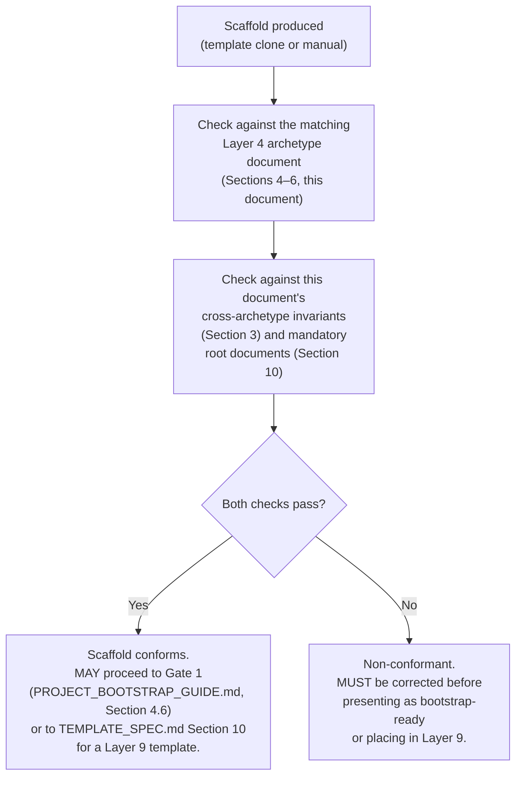

# PROJECT_STRUCTURE.md

**Status:** Active
**Layer:** 5 — Developer Manuals
**Framework Version:** v10
**Tier:** 2 (Required)
**Purpose:** Serve as the single canonical, cross-archetype directory-structure reference for Framework v10 (`FRAMEWORK_BLUEPRINT.md`, Section 2.5, "Responsibilities": "Define the canonical command reference (`COMMANDS.md`) and canonical directory structure reference (`PROJECT_STRUCTURE.md`)") — the lookup document a human developer or an AI agent consults to see, in one place, the directory layout of every currently `Active` Layer 4 archetype, the structural invariants that recur across all of them, and the mandatory root-level documents every project MUST contain, so that a project's scaffold can be validated without re-deriving structure from four separate documents each time.
**Authority:** Structural derivative of `FRAMEWORK_BLUEPRINT.md`, Sections 2.5 and 17. This document introduces no architectural decision of its own. Every directory tree reproduced below is transcribed, without alteration, from the single Layer 4 Project Rule document that is its authoritative source (`project-pc-app_v04.md`, `project-personal-full-stack_v01.md`, `project-monolithic_v04.md`, each Section 4). Where this document's reproduction and its Layer 4 source ever diverge, the Layer 4 document is authoritative and this document is in error and **MUST** be corrected (Section 14).
**Inherits from:** `AI_DEVELOPMENT_PHILOSOPHY_v2.0.md` (Layer 1 — the Development Environment principle, Section 10; the Dev Container philosophy, Section 11); `global_rules_revisionfinal_v10.md` (Layer 2 — the Clean Architecture Boundary, Section 3.2; the TDD Boundary, Section 4; the Security Baseline requiring an environment-configuration example with no real secrets, Section 9.2); `global_technology_stack_v10.md` (Layer 3 — indirectly, through the Layer 4 documents that apply it); and `project-pc-app_v04.md`, `project-personal-full-stack_v01.md`, and `project-monolithic_v04.md` (Layer 4 — the three currently `Active` archetype documents, each Section 4, supplying every directory tree reproduced below). Every rule and tree drawn from these documents is referenced below by name; none is reinterpreted.
**Governs:** Nothing below it. This is an operational Layer 5 document; it does not create new obligations for Layers 6–11 beyond what they already owe to Layers 1–4. Per `TEMPLATE_SPEC.md`, Section 5 (Category 1) and Section 9 (Category 5), a concrete Layer 9 template's directory structure **MUST**, once this document is `Active`, additionally conform to the canonical cross-archetype reference this document supplies, in addition to its target Layer 4 document.
**Supersedes:** None. This is the first version of this document.
**Read order:** Read after `FRAMEWORK_README.md`, `PROJECT_BOOTSTRAP_GUIDE.md`, `COMMANDS.md`, and the Layer 4 Project Rule document matching the current project's archetype — at the point in the Project Creation Flow (`FRAMEWORK_BLUEPRINT.md`, Section 16) where a scaffold (template-derived or manual) is validated (`PROJECT_BOOTSTRAP_GUIDE.md`, Section 4.4b–4.5). Per `FRAMEWORK_BLUEPRINT.md`, Section 2.5's AI interaction model, this document — together with `COMMANDS.md` — is "referenced continuously as a lookup table during execution," not read once and set aside.
**RFC 2119:** The key words **MUST**, **MUST NOT**, **REQUIRED**, **SHALL**, **SHALL NOT**, **SHOULD**, **SHOULD NOT**, **RECOMMENDED**, **MAY**, and **OPTIONAL** in this document are to be interpreted as described in RFC 2119. They apply to every rule below without exception unless the rule itself states otherwise.

---

## 0. Scope and Position in the Knowledge Architecture

```
Layer 1 — Constitution                         AI_DEVELOPMENT_PHILOSOPHY_v2.0.md
        ↓
Layer 2 — Framework Rules                       global_rules_revisionfinal_v10.md
        ↓
Layer 3 — Technology Standards                  global_technology_stack_v10.md
        ↓
Layer 4 — Project Rules                         project-pc-app_v04.md               (Active)
                                                 project-personal-full-stack_v01.md  (Active)
                                                 project-monolithic_v04.md           (Active)
                                                 project-mobile_v01.md               (Tier 3 / v10.1, pending)
        ↓ (this document inherits from all four layers above, by reference)
Layer 5 — Developer Manuals   FRAMEWORK_README.md          (Active)
                              PROJECT_BOOTSTRAP_GUIDE.md   (Active)
                              CONTRIBUTING.md              (Active)
                              COMMANDS.md                  (Active)
                              PROJECT_STRUCTURE.md         ← this document
                              AI_DEVELOPMENT_MANUAL.md     (pending, Tier 3 / v10.1)
        ↓
Layer 6 — Reference Implementations
Layer 7 — AI Skills
Layer 8 — Prompt Library
Layer 9 — Project Templates    TEMPLATE_SPEC.md (Active); template-fastapi-sqlite/ (pending)
```

**What this document contains.** A single, consolidated, cross-archetype directory-structure reference (`FRAMEWORK_BLUEPRINT.md`, Section 2.5, "Responsibilities"): the structural invariants shared by every currently `Active` archetype (Section 3); the full directory tree of each currently `Active` archetype, reproduced verbatim from its Layer 4 source for lookup convenience (Sections 4–6); the mandatory root-level documents every archetype requires (Section 7); and this document's role in scaffold conformance validation during project bootstrap and template creation (Section 9).

**What this document does not contain, by design.** Per the Layer 5 prohibited responsibilities (`FRAMEWORK_BLUEPRINT.md`, Section 2.5):

- It **MUST NOT** introduce a new architectural rule, directory boundary, or naming convention. Every tree and rule below is transcribed from, or a direct organizational consolidation of, content already frozen at Layer 2 or Layer 4.
- It **MUST NOT** be the authoritative source for any single archetype's directory layout. That authority remains with the matching Layer 4 document (Section 2 below, Section 14). This document is a reference *compiled from* Layer 4, not a replacement for it.
- It **MUST NOT** define reusable, directly-executable AI Skills, tool-specific command syntax, or Prompt Library content. Those are Layer 7 (`SKILLS.md`), Layer 5's own `COMMANDS.md`, and Layer 8, respectively — Section 11 below draws this boundary explicitly.
- It **MUST NOT** define a project-creation *procedure*. `PROJECT_BOOTSTRAP_GUIDE.md` (Layer 5) governs the process within which this document's reference is consulted; this document supplies only the structural reference itself.

**How an AI agent uses this document.** An agent that has already read the matching Layer 4 Project Rule document and is scaffolding a project manually (`PROJECT_BOOTSTRAP_GUIDE.md`, Section 4.4b) or validating a scaffold (`PROJECT_BOOTSTRAP_GUIDE.md`, Section 4.5; `TEMPLATE_SPEC.md`, Section 10) consults this document as the single, cross-archetype checkpoint — rather than needing to hold all four Layer 4 documents' directory trees in context simultaneously to confirm nothing has drifted between archetypes or been misapplied.

---

## 1. What This Document Is and Is Not

This document answers exactly one question: **"What is the canonical directory structure for a given `Active` archetype, and what structural invariant holds across all of them?"** It does not answer *whether* a project may be bootstrapped at all (that is `PROJECT_BOOTSTRAP_GUIDE.md`'s question), *which* archetype a project should select (that is the human Engineering CEO's decision, per `PROJECT_BOOTSTRAP_GUIDE.md`, Section 4.1), or *what command* creates or populates a given directory (that is `COMMANDS.md`'s question).

Per the framework's inheritance model (`FRAMEWORK_BLUEPRINT.md`, Section 5), this document does not originate a directory layout — it reproduces one, verbatim, from the Layer 4 document that owns it, and organizes the reproduction for cross-archetype lookup. If any tree below appears to differ from its stated Layer 4 source, that difference is a defect in this document, not a competing decision, and **MUST** be corrected to match the Layer 4 source (Section 14).

---

## 2. Inheritance Declaration

Per the inheritance rule that a Layer 5 document does not restate a governing-layer rule (`FRAMEWORK_BLUEPRINT.md`, Section 5), this document inherits, by reference and without restatement:

| From | Document | What is inherited |
|---|---|---|
| Layer 1 | `AI_DEVELOPMENT_PHILOSOPHY_v2.0.md` | The Development Environment principle (Section 10); the Dev Container philosophy (Section 11) — both of which every archetype's directory tree is scaffolded to support. |
| Layer 2 | `global_rules_revisionfinal_v10.md` | The Clean Architecture Boundary (Section 3.2), which every archetype's `domain` / `application` / `infrastructure` separation (Section 3 below) directly implements; the TDD Boundary (Section 4), which every archetype's test-directory mapping (Section 3 below) directly implements; the Security Baseline requirement that every project provide an environment-configuration example containing no real secret values (Section 9.2), which grounds the mandatory `.env.example` file (Section 7 below). |
| Layer 3 | `global_technology_stack_v10.md` | Not consulted directly by this document; inherited transitively through the three Layer 4 documents below, each of which already applies the canonical technology table to its own archetype. |
| Layer 4 | `project-pc-app_v04.md`, `project-personal-full-stack_v01.md`, `project-monolithic_v04.md` | The complete, authoritative directory layout of each archetype (each document's own Section 4), reproduced verbatim in Sections 4–6 of this document. This document does not alter, extend, or reinterpret any of the three trees. |

Where this document states a structural fact, it is either (a) a verbatim reproduction of a Layer 4 directory tree, cited to its source, or (b) a cross-archetype organizational observation over content Layer 2 or Layer 4 already fixes (Section 3). It is never a new architectural decision.

---

## 3. Cross-Archetype Structural Invariants

**Scope note.** This section is a documentation lens over rules and structures already frozen at Layer 2 and Layer 4. It introduces no new directory boundary, naming convention, or architectural rule; it only makes explicit what is already true of every currently `Active` archetype, so that an agent working across archetypes does not need to re-derive the pattern independently each time.

### 3.1 The Clean Architecture Boundary, By Archetype

Every currently `Active` archetype maps the Layer 2 Clean Architecture Boundary (`global_rules_revisionfinal_v10.md`, Section 3.2) onto its own directory tree using the same three inner-layer names — `domain`, `application`, `infrastructure` — differing only in where the delivery/presentation layer(s) sit, which is itself a direct, non-arbitrary consequence of each archetype's own process/deployment model (Electron's multi-process split; the Full-Stack archetype's two independently deployable applications; the Monolithic archetype's single deployable combining an API and a bundled frontend).

| Boundary layer (Layer 2 definition) | PC App (Electron) | Full-Stack | Monolithic |
|---|---|---|---|
| Domain (pure business logic; no framework or I/O imports) | `src/domain/` | `backend/src/domain/` | `backend/domain/` |
| Application (use-case orchestration; ports/interfaces) | `src/application/` | `backend/src/application/` | `backend/application/` |
| Infrastructure (only layer permitted to import a vendor SDK/driver) | `src/infrastructure/` | `backend/src/infrastructure/` | `backend/infrastructure/` |
| Delivery/presentation (archetype-specific; never contains business logic) | `src/main/`, `src/preload/`, `src/renderer/` | `backend/src/api/`, `frontend/` | `backend/api/`, `frontend/` |

Per the Layer 2 rule this table organizes (`global_rules_revisionfinal_v10.md`, Section 3.1.3, 3.2.2), a file inside a domain or application directory **MUST NOT** import a delivery- or infrastructure-layer module, in any archetype. This is not a new rule; it is the same rule each Layer 4 document already states for its own archetype (`project-pc-app_v04.md`, Section 4, Rule 1; `project-personal-full-stack_v01.md`, Section 4, Rule 1; `project-monolithic_v04.md`, Section 4, Rule 1), reproduced here as a single cross-archetype observation.

### 3.2 The TDD Boundary, By Archetype

Every currently `Active` archetype maps the Layer 2 TDD Boundary (`global_rules_revisionfinal_v10.md`, Section 4) onto its own test-directory tree using the same zone-to-rigor mapping; only the concrete paths differ, per each archetype's own directory layout (Sections 4–6 below).

| TDD Boundary zone (Layer 2 definition, `global_rules_revisionfinal_v10.md` §4) | PC App (Electron) test directory | Full-Stack test directory | Monolithic test directory |
|---|---|---|---|
| Business/domain logic (**MUST** be test-first) | `tests/domain/` | `backend/tests/domain/` | `tests/domain/` |
| Application/use-case orchestration (**SHOULD** test-first, **MUST** have coverage) | `tests/application/` | `backend/tests/application/` | `tests/application/` |
| Infrastructure adapters (**SHOULD** have integration-level coverage) | `tests/infrastructure/` | `backend/tests/infrastructure/` | `tests/infrastructure/` |
| UI/presentation, framework glue, end-to-end (**MAY**, behavior-level preferred) | `tests/e2e/` | `backend/tests/api/`, `frontend/tests/unit/`, `frontend/tests/e2e/` | `tests/api/`, `tests/e2e/` |

This table restates no new requirement; it is the same TDD Boundary application each Layer 4 document already states in its own Section 9 (`project-pc-app_v04.md`, Section 9; `project-personal-full-stack_v01.md`, Section 9; `project-monolithic_v04.md`, Section 9), consolidated for single-lookup convenience.

### 3.3 The Vendor-Independence Seam, By Archetype

In every currently `Active` archetype, exactly one directory is permitted to import a vendor SDK, database driver, or other external dependency directly, satisfying the Layer 2 vendor-independence rule that external dependencies be accessed only through an owned interface (`global_rules_revisionfinal_v10.md`, Section 2.2):

| Archetype | Directory permitted to import a vendor SDK/driver directly | Port/interface location |
|---|---|---|
| PC App (Electron) | `src/infrastructure/` | `src/application/ports/` |
| Full-Stack | `backend/src/infrastructure/` | `backend/src/application/ports/` |
| Monolithic | `backend/infrastructure/` | `backend/application/ports/` |

No other directory in any archetype's tree — including the delivery layer (`src/renderer/`, `frontend/`, `backend/src/api/`, `backend/api/`) — **MUST** import a vendor SDK or database driver directly, per the same Layer 2 rule.

---

## 4. Canonical Directory Structure — Desktop / PC App (Electron)

**Authoritative source:** `project-pc-app_v04.md`, Section 4. This tree is reproduced verbatim for cross-archetype lookup convenience. Where this reproduction and `project-pc-app_v04.md` ever diverge, `project-pc-app_v04.md` is authoritative and this document **MUST** be corrected in the same change (Section 14).

```
project-root/
├── src/
│   ├── domain/                 # Pure business logic. No Electron, no I/O.
│   │   ├── entities/
│   │   ├── value-objects/
│   │   └── errors/
│   ├── application/             # Use cases; orchestrates domain + repository interfaces.
│   │   ├── use-cases/
│   │   └── ports/               # Repository and service interfaces (EP-001 seams).
│   ├── infrastructure/          # Concrete adapters. Only layer allowed to import vendor SDKs.
│   │   ├── persistence/
│   │   │   └── sqlite/          # SQLite repository implementations.
│   │   └── system/               # OS-level integrations (filesystem, notifications, etc.).
│   ├── main/                     # Electron main-process entry point and IPC handlers.
│   │   ├── ipc/                  # One handler module per IPC channel group.
│   │   └── index.ts (or .js)     # Main process bootstrap only — no business logic.
│   ├── preload/                  # Context-isolated bridge.
│   │   └── index.ts (or .js)
│   └── renderer/                 # Presentation layer only.
│       ├── components/
│       ├── views/
│       └── state/                # Client-side view-state store.
├── tests/
│   ├── domain/                   # Test-first, per the TDD Boundary.
│   ├── application/
│   ├── infrastructure/
│   └── e2e/                      # Whole-application behavioral tests.
├── resources/                    # Icons, installer assets, non-code build inputs.
├── .env.example
├── .gitignore
└── README.md
```

**Binding rules governing this tree** (restated from `project-pc-app_v04.md`, Section 4, by reference — not reinterpreted here): business logic **MUST** live under `src/domain/` and `src/application/` only; `src/infrastructure/` is the only directory permitted to import a vendor SDK or Node.js persistence driver directly; `src/application/ports/` **MUST** hold every interface `src/infrastructure/` implements; the five top-level boundaries under `src/` **MUST NOT** be collapsed or renamed.

---

## 5. Canonical Directory Structure — Full-Stack Application

**Authoritative source:** `project-personal-full-stack_v01.md`, Section 4. This tree is reproduced verbatim for cross-archetype lookup convenience. Where this reproduction and `project-personal-full-stack_v01.md` ever diverge, `project-personal-full-stack_v01.md` is authoritative and this document **MUST** be corrected in the same change (Section 14).

```
project-root/
├── backend/
│   ├── src/
│   │   ├── domain/                  # Pure business logic. No FastAPI, no I/O.
│   │   │   ├── entities/
│   │   │   ├── value_objects/
│   │   │   └── errors/
│   │   ├── application/             # Use cases; orchestrates domain + repository interfaces.
│   │   │   ├── use_cases/
│   │   │   └── ports/               # Repository and service interfaces (EP-001 seams).
│   │   ├── infrastructure/          # Concrete adapters. Only layer allowed to import vendor SDKs.
│   │   │   ├── persistence/
│   │   │   │   └── sqlite/          # SQLite repository implementations.
│   │   │   └── external/            # Outbound calls to third-party services, if any.
│   │   └── api/                     # FastAPI delivery layer and routers.
│   │       ├── routers/             # One router module per resource group.
│   │       ├── schemas/             # Request/response models (validation boundary).
│   │       └── main.py              # FastAPI app bootstrap only — no business logic.
│   ├── tests/
│   │   ├── domain/                  # Test-first, per the TDD Boundary.
│   │   ├── application/
│   │   ├── infrastructure/
│   │   └── api/                     # Router-level behavioral/integration tests.
│   ├── pyproject.toml                # Poetry project definition.
│   └── .env.example
├── frontend/
│   ├── src/
│   │   ├── components/
│   │   ├── views/
│   │   ├── state/                    # Client-side view-state store.
│   │   └── api-client/                # Typed HTTP client.
│   ├── tests/
│   │   ├── unit/
│   │   └── e2e/
│   ├── package.json                  # pnpm project definition.
│   └── .env.example
├── resources/                        # Shared non-code assets (e.g., OpenAPI schema exports), if any.
├── .gitignore
└── README.md
```

**Binding rules governing this tree** (restated from `project-personal-full-stack_v01.md`, Section 4, by reference — not reinterpreted here): business logic **MUST** live under `backend/src/domain/` and `backend/src/application/` only; `backend/src/infrastructure/` is the only directory permitted to import a vendor SDK or database driver directly; `frontend/src/api-client/` **MUST** be the only frontend directory referencing the backend's API contract directly; the `backend/`/`frontend/` split and the `domain`/`application`/`infrastructure`/`api` boundaries under `backend/src/` **MUST NOT** be collapsed or renamed.

---

## 6. Canonical Directory Structure — Monolithic Application

**Authoritative source:** `project-monolithic_v04.md`, Section 4. This tree is reproduced verbatim for cross-archetype lookup convenience. Where this reproduction and `project-monolithic_v04.md` ever diverge, `project-monolithic_v04.md` is authoritative and this document **MUST** be corrected in the same change (Section 14).

```
project-root/
├── backend/
│   ├── domain/                  # Pure business logic. No FastAPI, no SQLModel, no I/O.
│   │   ├── entities/
│   │   ├── value_objects/
│   │   └── errors/
│   ├── application/              # Use cases; orchestrates domain + repository interfaces.
│   │   ├── use_cases/
│   │   └── ports/                 # Repository and service interfaces (EP-001 seams).
│   ├── infrastructure/            # Concrete adapters. Only layer allowed to import SQLModel/DB drivers.
│   │   ├── persistence/
│   │   │   └── sqlite/            # SQLModel-based repository implementations.
│   │   └── external/               # Other external service integrations, if any.
│   ├── api/                        # FastAPI delivery layer.
│   │   ├── routers/                # One router module per bounded resource/domain.
│   │   ├── schemas/                # Pydantic/SQLModel request & response schemas.
│   │   └── dependencies/           # FastAPI dependency-injection wiring (auth, DB session, etc.).
│   └── main.py                      # FastAPI app bootstrap only — no business logic.
├── frontend/
│   ├── src/
│   │   ├── components/
│   │   ├── views/
│   │   ├── api/                     # Typed client wrapping backend HTTP endpoints.
│   │   └── state/                    # Client-side view-state store.
│   ├── public/
│   └── package.json
├── tests/
│   ├── domain/                       # Test-first, per the TDD Boundary.
│   ├── application/
│   ├── infrastructure/
│   ├── api/
│   └── e2e/                           # Whole-application behavioral tests.
├── resources/                          # Non-code build inputs, deployment assets.
├── .env.example
├── .gitignore
└── README.md
```

**Binding rules governing this tree** (restated from `project-monolithic_v04.md`, Section 4, by reference — not reinterpreted here): business logic **MUST** live under `backend/domain/` and `backend/application/` only; `backend/infrastructure/` is the only directory permitted to import a database driver or vendor SDK directly; `backend/api/schemas/` **MUST NOT** be reused as a domain entity; the top-level boundaries under `backend/` (`domain`, `application`, `infrastructure`, `api`) and the `backend`/`frontend`/`tests` split **MUST NOT** be collapsed or renamed.

---

## 7. Canonical Directory Structure — Mobile Application (Deferred)

`project-mobile_v01.md` (Layer 4, Mobile archetype) is `Pending (Tier 3 / v10.1)` (`FRAMEWORK_README.md`, Section 4.3). No canonical directory structure for this archetype is defined by this document, since no authoritative Layer 4 source yet exists for this document to reproduce from. Per `PROJECT_BOOTSTRAP_GUIDE.md`, Section 5.3, a Mobile-archetype bootstrap request **MUST** be declined at the framework level entirely, not merely deferred, until v10.1 scope begins. This document accordingly defines no Mobile-archetype directory reference. An agent asked for a Mobile-archetype directory structure **MUST** report this as an out-of-scope request for the current framework version, consistent with `PROJECT_BOOTSTRAP_GUIDE.md`, Section 5.3, rather than improvise a directory layout.

This section **MUST** be replaced with a full canonical directory reference, reproduced from `project-mobile_v01.md`, Section 4, in the same change that document transitions from `Pending` to `Active` (Section 15 below).

---

## 8. Archetype Selection Is Not This Document's Responsibility

This document supplies the directory reference for each archetype once selected; it does not select the archetype. Per `PROJECT_BOOTSTRAP_GUIDE.md`, Section 4.1, the human, acting as Engineering CEO (Level 1 of the tri-level model, `FRAMEWORK_BLUEPRINT.md`, Section 1.2), selects one of the archetypes named in Section 3 of that guide. An AI agent **MUST NOT** select the archetype on the human's behalf, and **MUST NOT** treat the presence of two structurally similar archetypes in this document (Full-Stack and Monolithic, both capable of a FastAPI-based backend) as license to infer which one a given task intends — where this is ambiguous, the agent **MUST** ask, consistent with `PROJECT_BOOTSTRAP_GUIDE.md`, Section 4.1.

---

## 9. Conformance Role in Project Bootstrap and Template Validation

### 9.1 Manual Scaffolding

Per `PROJECT_BOOTSTRAP_GUIDE.md`, Section 4.4b, where no Layer 9 template exists for the selected archetype, a project **MUST** be scaffolded manually, conforming to both `PROJECT_STRUCTURE.md` (this document) and `TEMPLATE_SPEC.md` (Layer 9). With this document now `Active`, that conformance check is fully performable for the three currently `Active` archetypes: an agent scaffolding manually **MUST** reproduce the directory tree stated in Section 4, 5, or 6 above (matching the selected archetype) exactly, and **MUST** include the mandatory root-level documents of Section 10 below, before presenting the scaffold for validation (`PROJECT_BOOTSTRAP_GUIDE.md`, Section 4.5).

### 9.2 Template Validation

Per `TEMPLATE_SPEC.md`, Section 5 (Category 1) and Section 9 (Category 5), a concrete Layer 9 template's directory structure **MUST**, now that this document is `Active`, conform to this document's canonical cross-archetype reference in addition to its target Layer 4 document. Because Sections 4–6 of this document are verbatim reproductions of the corresponding Layer 4 trees, a template that conforms to its target Layer 4 document's directory layout necessarily conforms to this document as well, absent an undetected drift between the two (Section 14) — this document does not impose an additional, independent structural requirement beyond what Layer 4 already states; it supplies the single point at which that requirement is checked across archetypes.



### 9.3 Drift Detection

Because this document's Sections 4–6 are reproductions rather than an independent source, a conformance check that passes against Section 4/5/6 above but fails against the same archetype's own Layer 4 document indicates that this document has drifted out of sync with its source — this is a defect in `PROJECT_STRUCTURE.md`, not a new archetype variant, and **MUST** be corrected per Section 14 and Section 15 below, never resolved by treating the two documents as independently authoritative.

---

## 10. Root-Level Mandatory Documents

Regardless of archetype, every project **MUST** contain, at minimum, the following root-level (or, for the two-application archetypes, per-application) documents, consistent with the fixed requirement `TEMPLATE_SPEC.md`, Section 6, already states for every Layer 9 template and which this document extends, by the same reasoning, to every project regardless of whether it was scaffolded from a template:

| Document | Requirement | Governing rule |
|---|---|---|
| `README.md` | **MUST** be present at the project root. **MUST** state, at minimum, the project's archetype and a pointer to `PROJECT_BOOTSTRAP_GUIDE.md`. | `AI_DEVELOPMENT_PHILOSOPHY_v2.0.md`, Section 17 (Documentation Philosophy); `TEMPLATE_SPEC.md`, Section 6. |
| `.env.example` | **MUST** be present (at the project root for single-application archetypes; per-application for the Full-Stack archetype, per Section 5 above) and **MUST** contain no real secret values. | `global_rules_revisionfinal_v10.md`, Section 9.2. |
| `.gitignore` | **MUST** be present at the project root and **MUST**, at minimum, exclude build artifacts, dependency directories, and any local environment file that could contain real secret values. | `global_rules_revisionfinal_v10.md`, Section 9.1. |

A project **MUST NOT** omit any of these three documents on the grounds that its archetype "doesn't need" one of them, consistent with `TEMPLATE_SPEC.md`, Section 6, Rule 1 — the requirement is archetype-independent.

---

## 11. Prohibited Responsibilities — Explicit Boundary

Consistent with `FRAMEWORK_BLUEPRINT.md`, Section 2.5, this document explicitly does **not** do the following, and any future edit that adds one of these is out of scope for this document and **MUST** be redirected to the correct layer instead:

| Not defined here | Correct layer |
|---|---|
| Whether an archetype's directory layout may be changed | Layer 4 (the matching Project Rule document) — this document only reproduces what Layer 4 states |
| Canonical command-line syntax for creating or populating a directory | Layer 5 (`COMMANDS.md`) |
| Whether a project may proceed to Gate 1 | Layer 5 (`PROJECT_BOOTSTRAP_GUIDE.md`) |
| The canonical technology table itself | Layer 3 (`global_technology_stack_v10.md`) |
| Reusable, directly-executable AI Skill definitions | Layer 7 (`SKILLS.md` and individual Skill documents) |
| Tool-specific AI invocation wrappers | Layer 8 (Prompt Library, Active) |
| Concrete, clonable project scaffolds | Layer 9 (`TEMPLATE_SPEC.md` and concrete templates, e.g., `template-fastapi-sqlite/`) |
| Which archetype a specific project should use | The human Engineering CEO, per `PROJECT_BOOTSTRAP_GUIDE.md`, Section 4.1 (Section 8 above) |

---

## 12. Relationship to Other Layer 5 Documents

| Document | Relationship to this document |
|---|---|
| `FRAMEWORK_README.md` | Read *before* this document, every session. Supplies the current document-status tables this document's Section 13 depends on. |
| `PROJECT_BOOTSTRAP_GUIDE.md` | Governs the *procedure* within which this document's reference is consulted — Step 4b (manual scaffold) and Step 5 (scaffold validation) of Section 4.4–4.5. This document supplies the *structure*; that guide supplies the *process surrounding it*. |
| `COMMANDS.md` | Governs the command-line syntax for operations performed against the structure this document defines (e.g., which command creates a given directory's contents). This document supplies the *paths*; `COMMANDS.md` supplies the *commands run against them* (`COMMANDS.md`, Section 9). |
| `TEMPLATE_SPEC.md` (Layer 9) | Requires every concrete Layer 9 template to conform to this document's cross-archetype reference, once `Active`, in addition to its target Layer 4 document (`TEMPLATE_SPEC.md`, Sections 5 and 9). This document's completion resolves the previously-open `PROJECT_STRUCTURE.md`-dependent portion of `TEMPLATE_SPEC.md`'s Categories 1 and 5 (`TEMPLATE_SPEC.md`, Section 14.2). |
| `AI_DEVELOPMENT_MANUAL.md` (Tier 3, v10.1, pending) | Will house the comprehensive AI-agent operational manual; this document covers only directory structure, not the broader operational guidance that document will eventually provide. |

---

## 13. Current Applicability at Framework v10's Mid-Migration State

1. **Mobile archetype.** Per Section 7 above, no directory reference is defined for the Mobile archetype, consistent with `project-mobile_v01.md` remaining `Pending (Tier 3 / v10.1)` and `PROJECT_BOOTSTRAP_GUIDE.md`, Section 5.3. This gap remains open.
2. **`template-fastapi-sqlite/` archetype-disambiguation question.** This document reproduces the directory trees of both `project-personal-full-stack_v01.md` and `project-monolithic_v04.md` (Sections 5–6 above), since both are currently `Active` and both are capable FastAPI-based archetypes. This document does not, and cannot, resolve which of the two `template-fastapi-sqlite/` is intended to target — that remains an open question requiring explicit Owner confirmation (`FRAMEWORK_STATUS.md`, "Current Work," Flag 10), and this document's own existence does not close it. This gap remains open.
3. **Prompt Library dependency (Resolved).** The Prompt Library (Layer 8) is now `Active` as a whole, with `CLAUDE_CODE_PROMPTS.md` and `OPENAI_PROMPTS.md` satisfying the Tier 2 two-tool minimum. `TEMPLATE_SPEC.md`'s Category 4 (mandatory Prompt Library references) gap is therefore fully resolved, per `TEMPLATE_SPEC.md`, Section 14.1. Combined with this document's own resolution of the `PROJECT_STRUCTURE.md`-dependent portion of `TEMPLATE_SPEC.md` Categories 1 and 5 (Section 12 above), every `TEMPLATE_SPEC.md` category is now fully checkable for the three currently `Active` archetypes; only item 2 above (the archetype-disambiguation question) remains a standing blocker on `template-fastapi-sqlite/`'s generation.

An agent encountering one of the two gaps still open above (items 1 and 2) **MUST** report it plainly rather than improvise a substitute.

---

## 14. Authority and Conflict Resolution

1. Per the downward authority rule (KA-002, `FRAMEWORK_BLUEPRINT.md`, Section 6), this document **MUST NOT** contradict `AI_DEVELOPMENT_PHILOSOPHY_v2.0.md` (Layer 1), `global_rules_revisionfinal_v10.md` (Layer 2), `global_technology_stack_v10.md` (Layer 3), or any Active Layer 4 Project Rule document. Where a tree or rule in this document appears to conflict with any of those, the higher-priority document wins and this document **MUST** be corrected.
2. Specifically, where this document's reproduction of a Layer 4 directory tree (Sections 4–6) ever diverges from that tree's own Layer 4 source — whether through an update to the Layer 4 document that this document has not yet mirrored, or through a transcription error — the Layer 4 document is authoritative without exception, and this document's reproduction is in error and **MUST** be corrected in the same change that the divergence is discovered (Section 15).
3. A Layer 9 Template validated against this document **MUST NOT** be treated as conformant on the strength of this document alone if it conflicts with the template's target Layer 4 document; Layer 4 conformance is the primary check, and this document's conformance check is subordinate to it (`TEMPLATE_SPEC.md`, Section 16, Rule 4, applies the same precedence).
4. The full conflict-resolution procedure, including same-layer conflicts, is defined in `FRAMEWORK_BLUEPRINT.md`, Section 6, and is not restated here.

---

## 15. Change Control

1. This document **MUST NOT** be edited silently to introduce a new directory boundary, invariant, or mandatory document beyond what Sections 3 and 10 already state. A change of that kind is an architectural change and **MUST** follow the amendment procedure defined in `FRAMEWORK_BLUEPRINT.md`, Section 18.2: proposal → Gate 2 (Architecture Approval) → amendment → `DECISIONS.md` entry → `FRAMEWORK_HANDOVER.md` update in the same commit.
2. **Mandatory mirroring rule.** Any change to a directory tree in `project-pc-app_v04.md`, `project-personal-full-stack_v01.md`, or `project-monolithic_v04.md` (each document's own Section 4) **MUST** be accompanied, in the same change, by an update to the corresponding section of this document (Section 4, 5, or 6 respectively), so that this document's reproduction never drifts from its authoritative source. This is not itself a new architectural decision each time it is applied — it is the transcription obligation this document's own authority statement (header, above) already establishes.
3. Section 7 of this document **MUST** be replaced with a full canonical directory reference, reproduced from `project-mobile_v01.md`, Section 4, in the same change that document transitions from `Pending` to `Active`, rather than left silent about an archetype the framework has since adopted — mirroring the identical obligation `COMMANDS.md`, Section 15, Rule 4, already places on its own archetype-specific section.
4. Section 13 of this document **MUST** be updated in the same change as any transition of a document it names (most directly, resolution of the `template-fastapi-sqlite/` archetype-disambiguation question, or Layer 8's generation) from open-gap to resolved, so that this document never claims a gap that no longer exists or stays silent about one that does.
5. Upon this document's creation, `FRAMEWORK_README.md`, Sections 4–6, and `FRAMEWORK_STATUS.md` **MUST** be updated in the same change to reflect its new `Active` status and its removal from the "Pending (Tier 2)" lists, per `FRAMEWORK_README.md`, Section 9, and the AI Session Instructions in `FRAMEWORK_STATUS.md`.

---

## Closing Statement

This document is the canonical, cross-archetype directory-structure reference for Framework v10 (`FRAMEWORK_BLUEPRINT.md`, Section 2.5) — the single lookup document consolidating the directory trees of every currently `Active` archetype (Desktop/Electron, Full-Stack, Monolithic), the structural invariants that recur across all of them (the Clean Architecture Boundary, the TDD Boundary, and the vendor-independence seam), and the mandatory root-level documents every project requires. No architectural decision has been introduced beyond what `FRAMEWORK_BLUEPRINT.md`, Section 2.5, assigns to this layer's responsibility; every tree reproduced above is transcribed verbatim from its Layer 4 source, and every cross-archetype observation organizes a rule already frozen at Layer 2 or Layer 4. This document's completion resolves the previously-open `PROJECT_STRUCTURE.md`-dependent portion of `TEMPLATE_SPEC.md`'s Categories 1 and 5 (Section 12 above); the separately-tracked Category 4 Prompt Library gap has since been resolved by Layer 8 reaching `Active` (Section 13, item 3, above). The sole remaining open item is the `template-fastapi-sqlite/` archetype-disambiguation question (Section 13, item 2), which is the framework's sole remaining Tier 2 target, per `FRAMEWORK_STATUS.md`, "Current Work."
