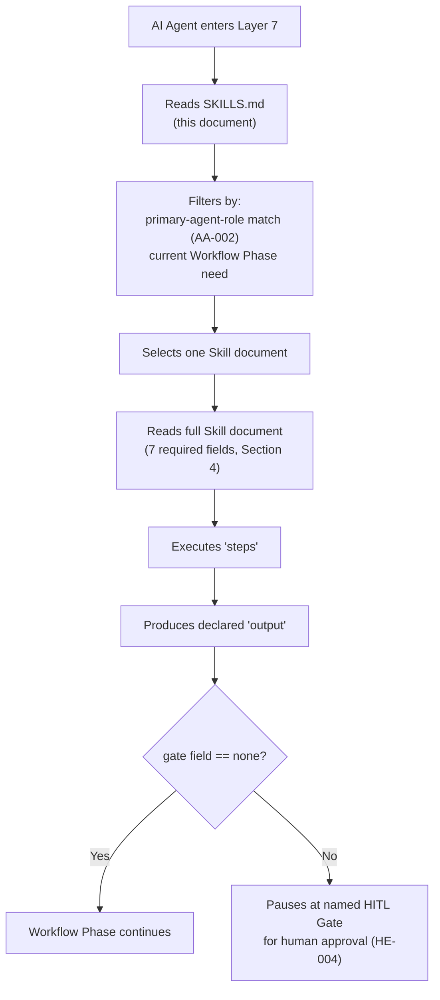
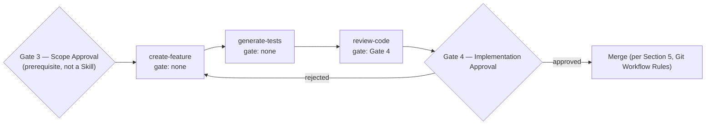
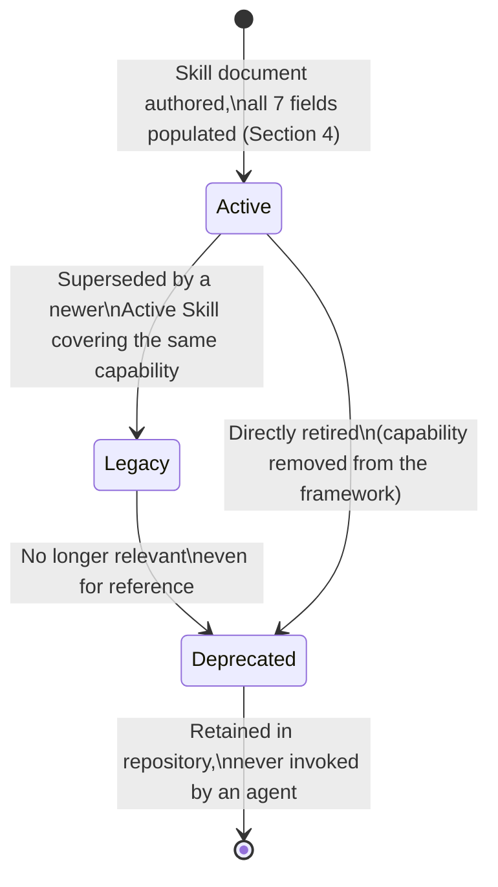

# SKILLS.md

**Status:** Active
**Layer:** 7 — AI Skills
**Tier:** 1 (Critical)
**Purpose:** Serve as the required Skill Manifest and Registry for Framework v10 (correction C-06) — the single index of every named, reusable, directly-executable engineering capability (Skill) available in the framework, structured for consumption by an AI Engineering Operating System rather than by a single-shot coding assistant. It records, for every Skill: classification, metadata, discovery routing, input/output relationships, composition into Workflow Phases, lifecycle status, and its relationship to the framework's deferred multi-agent orchestration future.
**Primary Authority (highest priority, in order):** `FRAMEWORK_BLUEPRINT.md` → `FRAMEWORK_README.md` → `global_rules_revisionfinal_v10.md`. This document introduces no architectural decision of its own and MUST NOT be read as amending any of the three. Where any statement below appears to conflict with one of them, the higher-priority document wins and this document MUST be corrected (Section 17).
**Reference materials (informational inspiration only, no authority):** `README_andrej-karpathy-skills.md`, `README_Claude Forge.md`, `README_agentmemory.md`. These three external project READMEs are consulted in Section 2 below solely for general design patterns (discoverability, composability, reusable capability framing, metadata organization, execution consistency, session continuity). None of their specific architecture, vendor mechanisms, or runtime mechanisms (plugin marketplaces, hook engines, MCP servers, memory-server processes, slash-command runtimes) is adopted anywhere in this document. Where a reference material's pattern and the Blueprint would ever conflict, the Blueprint prevails without exception.
**Inherits from:** `global_rules_revisionfinal_v10.md` (Layer 2 — the rules every Skill's `framework-alignment` field must cite), `global_technology_stack_v10.md` (Layer 3 — the technologies a Skill may use), and, at the point a Skill is actually executed, whichever Layer 4 Project Rule document matches the current project's archetype (`FRAMEWORK_BLUEPRINT.md`, Section 2.7, Inputs).
**Governs:** Every individual Skill document listed in the manifest table below (Section 12), and, transitively, any Layer 8 Prompt that wraps one of those Skills and any Layer 9 Template that references one, per the downward authority rule (KA-002, `FRAMEWORK_BLUEPRINT.md` Section 6).
**Supersedes:** The prior version of this document generated earlier in the framework's implementation timeline (the expanded Registry version, itself superseding the original manifest-only version). This revision adds one new section — Section 2, Cross-Project Design Inspiration — making explicit, and bounding, how the three reference materials named above were used. No fact about any Skill's role, gate, metadata, or status has changed across any of these revisions; only organization and the explicitness of sourcing have.
**Read order:** Read first upon entering Layer 7, before any individual Skill document — this is the literal entry procedure for the layer (`FRAMEWORK_BLUEPRINT.md`, Section 10.2). It is read after the AI Session Initialization Sequence (`FRAMEWORK_README.md`, Section 7) has completed, and after the matching Layer 4 Project Rule document (`FRAMEWORK_BLUEPRINT.md`, Section 15) has been read for the current task.
**RFC 2119:** The key words **MUST**, **MUST NOT**, **REQUIRED**, **SHALL**, **SHALL NOT**, **SHOULD**, **SHOULD NOT**, **RECOMMENDED**, **MAY**, and **OPTIONAL** in this document are to be interpreted as described in RFC 2119. They apply to every rule below without exception unless the rule itself states otherwise. Where a section below describes an illustrative pattern rather than a binding rule (Sections 7 and 8 in particular), this is stated explicitly and SHOULD/MAY language is used deliberately in place of MUST.

---

## 0. Scope and Position in the Knowledge Architecture

```
Layer 1 — Constitution                         AI_DEVELOPMENT_PHILOSOPHY_v2.0.md
        ↓
Layer 2 — Framework Rules                       global_rules_revisionfinal_v10.md
        ↓
Layer 3 — Technology Standards                  global_technology_stack_v10.md
        ↓
Layer 4 — Project Rules                         project-pc-app_v04.md (Active)
                                                 project-personal-full-stack_v01.md (pending)
                                                 project-monolithic_v04.md (pending)
                                                 project-mobile_v01.md (pending, v10.1)
        ↓
Layer 5 — Developer Manuals
Layer 6 — Reference Implementations
        ↓ (this document inherits from Layers 2–4, by reference, at the point a Skill executes)
Layer 7 — AI Skills  (this document + individual Skill documents)
        ↓
Layer 8 — Prompt Library
Layer 9 — Project Templates
```

**What this document contains.** The required manifest structure for Layer 7 (`FRAMEWORK_BLUEPRINT.md`, Section 10.2), expanded into a full registry: classification, metadata schema, discovery routing, documented input/output relationships between Skills, documented composition into Workflow Phases, lifecycle status per Skill, an explicit and bounded account of external design inspiration, and an informational note on multi-agent compatibility.

**What this document does not contain, by design.** Per the Layer 7 prohibited responsibilities (`FRAMEWORK_BLUEPRINT.md`, Section 2.7):

- It **MUST NOT** contain the full seven-field specification of any individual Skill in operative detail (the concrete `steps` a Skill executes). That belongs to the individual Skill document itself (Section 3 below distinguishes the two).
- It **MUST NOT** define or modify any Layer 1–4 rule. Where a Skill's execution would require modifying a governing-layer document, that capability is not a valid Skill and **MUST** be escalated to a Gate 2 (Architecture Approval) decision instead (SK-003, `FRAMEWORK_BLUEPRINT.md` Section 10.4).
- It **MUST NOT** perform cross-project operations, and no Skill indexed here **MUST** be designed to do so (SK-003).
- It **MUST NOT** introduce a Skill dependency-graph field, a composition operator, a hook/event mechanism, a memory-server process, or any other schema or runtime element beyond the seven fields fixed in `FRAMEWORK_BLUEPRINT.md`, Section 10.3. Sections 7 and 8 below are documentation lenses over existing fields, not schema extension; Section 2 below is informational sourcing, not new architecture.

**How an AI agent uses this document.** Per `FRAMEWORK_BLUEPRINT.md`, Section 2.7's AI interaction model: an agent reads this manifest to discover available capabilities, selects a Skill by matching its own `primary-agent-role` tag (AA-002) against the manifest's **Primary Agent Role** column and matching the current Workflow Phase's need, reads the full Skill document only after selection, executes its `steps`, produces its declared `output`, and — if the Skill's `gate` field is not `none` — pauses at the named HITL Gate for human approval before the next Workflow Phase begins (HE-004).

---

## 1. Design Orientation — Why This Manifest Is Structured for an Engineering Operating System

This section explains *why* the structure below looks the way it does, consistent with the framework's own documentation standard that intent precede mechanics (`global_rules_revisionfinal_v10.md`, Section 8.1). It introduces no rule; it is read as context for Sections 3–11.

Framework v10 does not treat a Skill as a standalone prompt template consumed by one developer in one sitting. It treats a Skill as an addressable unit of execution inside an Engineering Operating System (`AI_DEVELOPMENT_PHILOSOPHY_v2.0.md`, Section 7) — discoverable by role, boundable by scope, chainable into Workflow Phases, and stoppable at named HITL Gates, precisely so that a future orchestration layer can consume this same manifest without the framework changing shape (FD-003, `FRAMEWORK_BLUEPRINT.md` Section 1.3). Three structural properties follow directly from that design assumption, and each has a section below:

1. **A Skill must be findable by role and phase, not by name-guessing** (Section 6) — because a Planner Agent, not a human skimming a list, may eventually be the one selecting it.
2. **A Skill's relationship to the Skills around it must be legible from data already in its metadata**, not from prose buried in a separate document (Sections 7–8) — because an orchestrator reasons over structured relationships, not narrative explanation.
3. **A Skill's trustworthiness at a point in time must be a queryable status**, not an assumption (Section 9) — because an agent acting autonomously needs to know, cheaply, whether a Skill it is about to invoke is currently authoritative.

None of this is new architecture. It is the practical consequence of decisions the Blueprint already made — the tri-level model (Section 1.2), the agentic design assumption (Section 1.3), the Skill Architecture (Section 10), and the Document Lifecycle (Section 7) — read together and organized for lookup rather than left implicit. Section 2, immediately below, makes explicit which general, widely recognized patterns this organization draws on, and — just as importantly — which specific mechanisms it deliberately does not import.

---

## 2. Cross-Project Design Inspiration (Informational Only)

**Purpose of this section.** The Owner directed that useful *ideas* from three external, non-framework projects be incorporated where appropriate — discoverability, composability, reusable engineering capabilities, metadata organization, execution consistency, and session continuity — while explicitly prohibiting adoption of their architecture, vendor-specific mechanisms, or runtime-specific mechanisms. This section is the auditable record of how that instruction was honored: each pattern is named, its general source is noted, and it is mapped to the specific Blueprint-defined mechanism that already realizes it in Framework v10. No new field, rule, or mechanism is introduced anywhere in this section.

| Requested pattern | Illustrated (informationally) by | Realized in Framework v10 exclusively through |
|---|---|---|
| **Discoverability** | General practice across contemporary agentic-skill tooling of centralizing a capability index so an agent does not need to scan a directory tree | The Skill Manifest itself — a single-read index an agent consults before doing anything else (`FRAMEWORK_BLUEPRINT.md`, Section 10.2; this document, Section 6) |
| **Composability** | General practice of chaining named capabilities into a sequence rather than invoking each in isolation | The Workflow Phase concept (`FRAMEWORK_BLUEPRINT.md`, Section 8) and this document's Skill Composition section (Section 8 below), which documents `create-feature` → `generate-tests` → `review-code` as one reference chain |
| **Reusable engineering capabilities** | General framing of a "skill" as a named, reusable unit of work rather than a disposable, one-off prompt | The definition of a Skill already fixed in the Blueprint (SK-001, `FRAMEWORK_BLUEPRINT.md`, Section 10.1) |
| **Metadata organization** | General practice of structuring a capability's properties into named, lookup-friendly fields rather than free-text description | The seven-field Skill Metadata Schema (Section 4 below) and the four-dimension Skill Classification (Section 5 below), both already fixed by the Blueprint (Sections 10.3 and, implicitly, 10.5) |
| **Execution consistency** | General practice of requiring explicit, checkable completion criteria before a unit of work is considered finished, rather than an unverified "looks done" | The Layer 2 Definition of Done (`global_rules_revisionfinal_v10.md`, Section 10) and the `framework-alignment` field (Section 4 below), which every Skill execution must satisfy regardless of which agent or tool performs it |
| **Session continuity** | General practice of persisting context across sessions so an agent does not need to be re-briefed from scratch each time | The Layer 10 Knowledge Base — `DECISIONS.md` and `FRAMEWORK_HANDOVER.md` (`FRAMEWORK_BLUEPRINT.md`, Section 2.10) — together with this manifest's own persistence: an agent re-entering Layer 7 in a new session reads the same `SKILLS.md`, rather than re-deriving its capability set each time |

**Explicit non-adoptions.** To keep this mapping auditable rather than aspirational, the following are stated plainly: no plugin/marketplace installation mechanism, no hook or lifecycle-event engine, no MCP server or other tool-connector protocol, no persistent memory-server process, and no slash-command or CLI runtime from any of the three reference materials is a component of Framework v10 or of this document. Adopting any such mechanism would be a vendor-specific or runtime-specific architectural decision and would require its own Gate 2 (Architecture Approval) proposal (`FRAMEWORK_BLUEPRINT.md`, Section 18.2) — squarely out of scope for a Layer 7 manifest to introduce unilaterally. What is carried forward from the reference materials is the *pattern* named in the left-hand column above, and nothing more.

---

## 3. Manifest Entries vs. Full Skill Documents — Two Distinct Field Sets

Framework v10 defines two related but distinct structures, and this document is responsible for only the first:

| Structure | Field count | Defined in | Populated by |
|---|---|---|---|
| **Manifest entry** (this document, Section 12) | 5 fields | `FRAMEWORK_BLUEPRINT.md`, Section 10.2 | `SKILLS.md` |
| **Full Skill document** (e.g., `skill-create-feature.md`) | 7 fields | `FRAMEWORK_BLUEPRINT.md`, Section 10.3 (correction C-08) | The individual Skill document itself |

**Manifest entry fields (this document):** skill name, primary agent role, gate position, a one-line description, and the file path to the full Skill document.

**Full Skill document fields (not this document):** `skill-name`, `primary-agent-role`, `gate`, `input`, `output`, `steps`, `framework-alignment`.

A manifest entry is a *pointer*, not a substitute. An AI agent **MUST NOT** treat the one-line description in Section 12 as sufficient to execute a Skill — it **MUST** open the full Skill document first (`FRAMEWORK_BLUEPRINT.md`, Section 10.2 diagram: "Reads full Skill document" occurs strictly after "Selects one Skill document").

---

## 4. Skill Metadata Schema

The seven fields below are fixed by `FRAMEWORK_BLUEPRINT.md`, Section 10.3 (correction C-08). This section restates their names and purpose, by reference, for a reader entering Layer 7 through this manifest rather than through the Blueprint directly. It does not add an eighth field, and no future Skill document **MUST** carry any field beyond these seven.

| Field | Purpose | Why it matters for an OS, not just a template |
|---|---|---|
| `skill-name` | Unique identifier, verb-phrase format | Gives the manifest a stable key an orchestrator can reference without re-parsing prose. |
| `primary-agent-role` | Exactly one role from the thirteen reserved roles (AA-001) | Is the sole basis on which an agent — human-driven today, Planner-Agent-driven eventually — filters candidate Skills (Section 6). |
| `gate` | The canonical HITL Gate this Skill's output requires, or `none` | Encodes, as data rather than as a side conversation, whether execution may proceed unattended past this Skill (HE-004). |
| `input` | The information and artifacts required to begin | The basis for the input/output relationships documented in Section 7 — what a Skill needs is what determines what must run before it. |
| `output` | The artifact(s) produced on completion | The other half of Section 7 — what a Skill produces is what makes it a valid predecessor to another Skill. |
| `steps` | The ordered procedure followed | Scoped strictly to this Skill's own execution; a Skill's `steps` **MUST NOT** describe another Skill's internal procedure, only reference its `output` as an input. |
| `framework-alignment` | The specific Layer 2/3/4 rules governing execution | Makes a Skill's compliance boundary explicit and machine-checkable rather than assumed from context (SK-002). |

Every individual Skill document listed in Section 12 **MUST** populate all seven fields before it is considered valid and addable to this manifest's "Active" status (`FRAMEWORK_BLUEPRINT.md`, Section 10.3: "A Skill document with any field missing is not valid and MUST NOT be added to the manifest").

---

## 5. Skill Classification

Framework v10 does not define a separate Skill taxonomy beyond the dimensions already present in its metadata and layer structure. This section organizes the three Tier 1 Skills along four dimensions that already exist elsewhere in the Blueprint, so that classification is a lookup rather than a judgment call:

| Dimension | Source of the dimension | Applies to Tier 1 Skills as |
|---|---|---|
| **Primary Agent Role** (AA-002) | `FRAMEWORK_BLUEPRINT.md`, Section 10.3 | Backend/Frontend Agent, Test Agent, Code Review Agent (Section 12) |
| **Workflow Phase alignment** | `FRAMEWORK_BLUEPRINT.md`, Section 8 | All three Tier 1 Skills align to the "Development" Workflow Phase, the phase between Gate 3 (Scope Approval) and Gate 4 (Implementation Approval) |
| **HITL Gate** | `FRAMEWORK_BLUEPRINT.md`, Section 9.2 | `none`, `none`, `Gate 4 — Implementation Approval` respectively (Section 12) |
| **Archetype scope** | Implicit in SK-003 (`FRAMEWORK_BLUEPRINT.md`, Section 10.4: "A Skill executes within exactly one project") + Layer 4's archetype concept | All three Tier 1 Skills are **archetype-agnostic** — they carry no Electron-, full-stack-, monolithic-, or mobile-specific logic in their own definition, and instead consume whichever Layer 4 document matches the project they are invoked within |

No fifth dimension is introduced. A future Skill (Section 13) **MUST** be classifiable along these same four dimensions before it is added to this manifest; if it cannot be — for example, if it inherently spans more than one Workflow Phase — that is itself a signal the candidate Skill may need to be split, and **MUST** be raised as a design question rather than resolved by adding a new classification dimension here.

---

## 6. Skill Discovery

Reproduced from `FRAMEWORK_BLUEPRINT.md`, Section 10.2, this is the literal, ordered procedure for entering Layer 7:



No agent SHOULD select a Skill by name-matching alone (e.g., pattern-matching the task description to a Skill's title). Selection **MUST** go through the two-part filter shown above: role match, then Workflow Phase fit (Section 5). Where no Skill in Section 12 satisfies both, the agent **MUST** report the gap rather than force-fit a mismatched Skill or invent one ad hoc — a genuinely new capability is an architectural addition to Layer 7 and follows the same Gate 2 amendment procedure as any other frozen-decision change (`FRAMEWORK_BLUEPRINT.md`, Section 18.2).

---

## 7. Skill Dependencies

**Scope note.** Framework v10 does not define a Skill dependency-graph field, a `depends-on` metadata attribute, or any other new dependency mechanism. `BLUEPRINT_INPUT_FREEZE.md` contains no such decision, and none is introduced here. What follows is a documentation of the dependency relationships that are already implied by two fields that do exist — `input` and `output` (Section 4) — presented as a lookup table rather than left for an agent to infer from separate Skill documents each time.

A Skill B is said to *depend on* Skill A, for the purposes of this table only, when Skill A's declared `output` is the natural or required form of Skill B's declared `input`. This is descriptive of the current Tier 1 set, not a rule that constrains how future Skills MUST be authored.

| Skill | Declared input (summary) | Natural predecessor | Relationship |
|---|---|---|---|
| `create-feature` | A scoped feature definition (the output of Gate 3 — Scope Approval) and the matching Layer 4 Project Rule document | None within Layer 7 — its input comes from a HITL Gate, not from another Skill | Entry point of the Development Workflow Phase |
| `generate-tests` | The business/application logic produced by `create-feature`, plus the applicable Layer 2 TDD Boundary zone (`global_rules_revisionfinal_v10.md`, Section 4) | `create-feature` | Consumes `create-feature`'s `output` as its `input` |
| `review-code` | The implementation and its associated tests, i.e., the combined output of `create-feature` and `generate-tests` | `create-feature`, `generate-tests` | Consumes both prior Skills' `output` as its `input`; is the last Skill before Gate 4 |

This table **MUST** be treated as informational routing guidance, not as a binding execution order. A project MAY invoke `generate-tests` before `create-feature` completes (e.g., under the TDD Boundary's requirement that business logic be developed test-first, `global_rules_revisionfinal_v10.md` Section 4) — in which case the dependency direction in practice is reversed from the table above for that specific invocation. The table records the *typical* relationship for manifest-lookup convenience; the individual Skill documents' own `input`/`output` fields, once authored, remain the authoritative source for any specific invocation.

---

## 8. Skill Composition

**Scope note.** As with Section 7, no new composition operator is introduced. `FRAMEWORK_BLUEPRINT.md`, Section 8, already defines a Workflow Phase as "a sequence of one or more Skill executions." This section documents one illustrative composition of the three Tier 1 Skills into a single Workflow Phase, using SHOULD/MAY language throughout, since the Blueprint does not mandate a specific internal ordering among Skills within a phase — only that the phase as a whole sits between two HITL Gates.



This composition SHOULD be read as the reference pattern for a single-feature Development Workflow Phase under Framework v10, consistent with:

- `global_rules_revisionfinal_v10.md`, Section 4 (the TDD Boundary, which places test creation alongside or ahead of implementation for business logic);
- `global_rules_revisionfinal_v10.md`, Section 7.4 (code review as the step whose human confirmation is authoritative at Gate 4); and
- `FRAMEWORK_BLUEPRINT.md`, Section 9.2 (Gate 4 reviews "completed implementation" and blocks "merge").

A project MAY compose these three Skills differently — for example, interleaving `generate-tests` and `create-feature` iteratively rather than strictly sequentially — provided the phase as a whole still terminates at `review-code`'s output being what Gate 4 evaluates. This document does not mandate a single rigid order; it documents a default so that an agent with no other context has a reasonable composition to fall back to.

---

## 9. Skill Lifecycle

**Scope note.** Framework v10 defines exactly one document lifecycle model, applicable to every framework artifact including Skill documents: the four-status model of `FRAMEWORK_BLUEPRINT.md`, Section 7 (DL-001). This section applies that existing model to Skills specifically; it does not define a Skill-specific lifecycle distinct from it.



Applied to the current Tier 1 set, all three Skills in Section 12 have completed the `[*] --> Active` transition: `skill-create-feature.md`, `skill-review-code.md`, and `skill-generate-tests.md` each exist as full, valid, seven-field Skill documents, and the manifest's **Document Status** column (Section 12) records all three as `Active`, consistent with the same distinction `FRAMEWORK_README.md` draws throughout its own Section 4 between documents that exist-and-are-classified and documents that do not yet exist. With this transition, Layer 7 (AI Skills) is `Active` as a whole, per `FRAMEWORK_BLUEPRINT.md`, Section 2.7 ("Active once the manifest and three starter Skills exist").

No Skill in this framework has yet reached `Legacy` or `Deprecated` status, since no Skill document has yet been superseded or retired.

---

## 10. Future Multi-Agent Compatibility (Informational Only)

This section is explicitly informational, per the Owner's own instruction accompanying this document's requirements, and introduces no architecture beyond what `FRAMEWORK_BLUEPRINT.md` already states in Sections 1.3 and 18.5.

Framework v10 does not implement multi-agent orchestration (FD-003). This manifest is, however, one of the two concrete mechanisms the Blueprint identifies as making a future orchestration layer possible without structural change to the framework (`FRAMEWORK_BLUEPRINT.md`, Section 18.5):

1. **Named agent roles** (AA-001/AA-002), already present in every manifest entry's Primary Agent Role column (Section 12), give a hypothetical future Planner Agent a routing key that requires no new field to consume — it is the same column a human or single AI agent already reads today.
2. **The Skill Manifest itself** (this document) makes Skill discovery "a single-read operation rather than a directory scan" (`FRAMEWORK_BLUEPRINT.md`, Section 18.5) — a property that matters identically whether the reader is today's single AI agent or a future orchestrator coordinating several.

Nothing in this document assumes, requires, or specifies how a multi-agent orchestration layer would be built. Any such design remains, per FD-003 and Section 18.5, a future decision requiring its own Gate 2 review — this section exists only to note that nothing in the manifest's current structure would need to change to accommodate it. This is the same non-adoption discipline applied in Section 2 above to the external reference materials: naming a compatible *direction* is not the same as building toward it.

---

## 11. On the "Thirteen Reserved Roles" (AA-001)

`FRAMEWORK_BLUEPRINT.md`, Section 10.3, requires every Skill's `primary-agent-role` field to hold "exactly one role from the thirteen reserved roles (AA-001)." The full enumeration of those thirteen roles is a frozen decision recorded in `BLUEPRINT_INPUT_FREEZE.md`, which is outside the set of documents this manifest was generated against. This document does **not** reproduce or invent that full list.

What this document *can* state with authority — because `FRAMEWORK_BLUEPRINT.md` names them directly, in Section 10.5 — are the four roles relevant to the three Tier 1 Skills: **Backend Agent**, **Frontend Agent**, **Code Review Agent**, and **Test Agent**. These four are used in the manifest table below (Section 12). Any future Skill added to this manifest **MUST** have its `primary-agent-role` value verified against the full AA-001 list in `BLUEPRINT_INPUT_FREEZE.md` before being added — not assumed from context.

---

## 12. The Skill Manifest — Tier 1 Inventory

Per `FRAMEWORK_BLUEPRINT.md`, Section 10.5, three Skills are required for Tier 1 completion of Layer 7 (SK-004). Per the Owner's explicit instruction, "Phase 1" (treated here as the same set as the Blueprint's "Tier 1," per Rule 5's requirement to keep terminology consistent across documents) contains only these three, and no others. All three are indexed below.

| Skill Name | Primary Agent Role | Gate | Description | Skill Document | Document Status |
|---|---|---|---|---|---|
| `create-feature` | Backend Agent / Frontend Agent (context-dependent, per `FRAMEWORK_BLUEPRINT.md` §10.5) | `none` ¹ | Implements a new feature's business/domain logic and, where applicable, its presentation layer, within a single existing project, conforming to that project's Layer 4 archetype rules. | `skill-create-feature.md` | **Active** |
| `generate-tests` | Test Agent | `none` ¹ | Produces test coverage for a unit of business, application, or infrastructure logic, positioned within the Layer 2 TDD Boundary (`global_rules_revisionfinal_v10.md`, Section 4). | `skill-generate-tests.md` | **Active** |
| `review-code` | Code Review Agent | Gate 4 — Implementation Approval ² | Performs the AI-executed code-quality and rule-conformance review required before a non-trivial change may merge, per `global_rules_revisionfinal_v10.md`, Section 7.4. | `skill-review-code.md` | **Active** |

**Footnote 1.** `create-feature` and `generate-tests` carry `gate: none`, reconciled from provisional to authoritative upon the generation of `skill-create-feature.md` and `skill-generate-tests.md` respectively, per this document's own Section 18.2. Both Skill documents independently confirm the original reasoning documented in Section 8 (Skill Composition): within a single Development Workflow Phase, both feed forward into `review-code` without an intervening human checkpoint — it is the *combined* output of the phase, not either Skill's output in isolation, that is reviewed at a named Gate (`skill-create-feature.md`, Section 1; `skill-generate-tests.md`, Section 1). This value is no longer provisional.

**Footnote 2.** `review-code` carries `Gate 4 — Implementation Approval`, confirmed as authoritative — not merely provisional — upon the generation of `skill-review-code.md`, per this document's own Section 18.2. The original textual grounds remain unchanged: `global_rules_revisionfinal_v10.md`, Section 7.4, states that code review may be "performed by a human or by an AI agent operating under the `review-code` Skill (Layer 7), with human confirmation remaining authoritative at Gate 4." This ties `review-code`'s output directly to Gate 4 as defined in `FRAMEWORK_BLUEPRINT.md`, Section 9.2 ("Reviews completed implementation," "Blocks: Merge").

For reference, the five canonical Gate positions a `gate` field may hold (reproduced from `FRAMEWORK_BLUEPRINT.md`, Section 9.2, for lookup convenience — not restated as a new rule):

| Gate | Name | Reviews | Blocks |
|---|---|---|---|
| Gate 1 | Plan Approval | Project or feature plan | Any engineering work starting |
| Gate 2 | Architecture Approval | Architectural decisions | Implementation starting |
| Gate 3 | Scope Approval | Feature scope definition | Development starting |
| Gate 4 | Implementation Approval | Completed implementation | Merge |
| Gate 5 | Release Approval | Release artifacts | Deployment |

No Skill is currently mapped to Gates 1, 2, 3, or 5. This is expected at v10: those Gates bound Workflow Phases (planning, architecture, scope definition, release) that are not yet populated by a Layer 7 Skill and remain, for now, purely human-driven checkpoints per `PROJECT_BOOTSTRAP_GUIDE.md` (Gate 1) and `FRAMEWORK_BLUEPRINT.md` Section 18.2 (Gate 2).

---

## 13. Roadmap — Planned Future Skills (Not Yet Architected)

Per the Owner's instruction, future Skills MAY be listed only as planned roadmap entries, without defining new architecture for them. `FRAMEWORK_BLUEPRINT.md` itself already names the complete v10.1 candidate list (Sections 10.5 and 18.4); this section reproduces that list, by reference, and adds no entry beyond it:

| Planned Skill | Named in | Status |
|---|---|---|
| `refactor-module` | `FRAMEWORK_BLUEPRINT.md`, Section 10.5 | Named only — no metadata, gate, or classification defined |
| `build-prd` | `FRAMEWORK_BLUEPRINT.md`, Section 10.5 | Named only |
| `update-architecture` | `FRAMEWORK_BLUEPRINT.md`, Section 10.5 | Named only |
| `generate-adr` | `FRAMEWORK_BLUEPRINT.md`, Section 10.5 | Named only |
| `create-release-notes` | `FRAMEWORK_BLUEPRINT.md`, Section 10.5 | Named only |
| `build-docker-environment` | `FRAMEWORK_BLUEPRINT.md`, Section 10.5 | Named only |

None of these six is a manifest entry. None has a `primary-agent-role`, `gate`, or classification (Section 5) assigned, and none **MUST** be treated as available for selection under the discovery procedure in Section 6. Per `FRAMEWORK_BLUEPRINT.md`, Section 18.4, this list defines the complete scope of v10.1 Layer 7 expansion; "no additional scope MAY be added to v10.1 planning without a Gate 1 (Plan Approval) decision recorded in `DECISIONS.md`," and the same restriction applies to adding any Skill beyond these six to this roadmap section.

---

## 14. Scope Boundary and Escalation Rule

Per `FRAMEWORK_BLUEPRINT.md`, Section 10.4 (SK-003), every Skill indexed in Section 12 — once its full document exists — is bound by the following, restated here only as a discovery-time reminder and not as a new rule:

1. A Skill **MUST** execute within the context of exactly one project. It **MUST NOT** perform cross-project operations.
2. A Skill **MUST NOT** modify any Layer 1–4 document, and **MUST NOT** override an architectural decision.
3. A capability that would require either of the above is not a valid Skill design. It **MUST** be escalated to a Gate 2 (Architecture Approval) review and, if approved, recorded in `DECISIONS.md` (Layer 10) — never encoded as a Skill regardless of how convenient that would be.

An AI agent consulting this manifest that encounters a task matching one of these excluded shapes **MUST** report it as an escalation, not attempt to satisfy it via `create-feature`, `generate-tests`, or `review-code`.

---

## 15. Relationship to Other Layers

| Layer | Relationship to this manifest |
|---|---|
| Layer 2 (`global_rules_revisionfinal_v10.md`) | Every Skill's `framework-alignment` field (Section 4) **MUST** cite the specific Layer 2 rules it follows. This manifest does not restate them. |
| Layer 3 (`global_technology_stack_v10.md`) | Constrains which concrete technologies a Skill's `steps` may introduce; a Skill **MUST NOT** contradict a Layer 3 default. |
| Layer 4 (e.g., `project-pc-app_v04.md`) | Supplies the project-type context a Skill executes within (SK-003); a Skill executing inside a PC App project **MUST** conform to that document's directory layout and naming conventions. |
| Layer 5 (`PROJECT_BOOTSTRAP_GUIDE.md`) | Step 9 of that guide (Section 4.9) hands off to the AI Execution Flow (`FRAMEWORK_BLUEPRINT.md`, Section 15), which begins by reading this manifest. |
| Layer 8 (Prompt Library) | Every Prompt document **MUST** reference a Skill indexed here rather than duplicate its logic (`FRAMEWORK_BLUEPRINT.md`, Section 11.2). A Prompt referencing a Skill not listed in Section 12 is invalid. |
| Layer 9 (Project Templates) | `TEMPLATE_SPEC.md` requires every concrete template to declare mandatory Skill references (`FRAMEWORK_BLUEPRINT.md`, Section 2.9); those references **MUST** resolve to an entry in Section 12 of this document. |

---

## 16. Current Applicability at Framework v10's Mid-Migration State

**Governing rule.** Per `FRAMEWORK_BLUEPRINT.md`, Section 2.7 (Status): Layer 7 is `Active` only "once the manifest and three starter Skills exist." All four required artifacts now exist in complete, `Active` form: this manifest (`SKILLS.md`) and all three individual Skill documents (`skill-create-feature.md`, `skill-review-code.md`, `skill-generate-tests.md`), as reflected in the **Document Status** column of Section 12. **Layer 7 (AI Skills) is therefore `Active` as a whole**, consistent with `FRAMEWORK_README.md`, Section 4.1, and `FRAMEWORK_STATUS.md`, "Active Documents."

**Effect on Section 6's discovery flow.** An AI agent that reaches the "Selects one Skill document" step of Section 6 above will now find a valid, `Active` target file for all three entries. The discovery flow resolves end to end: an agent may select `create-feature`, `generate-tests`, or `review-code` by role and Workflow Phase match, open the corresponding Skill document, and execute its `steps` without encountering a missing-artifact gap.

**Net effect.** This section is retained, per this document's own Section 18.2 obligation to reconcile — rather than silently delete — a section whose underlying gap has closed, so that the record of Layer 7's completion remains traceable. It may be removed in a future revision once its historical value is judged to have passed; until then, it accurately reports that no gap remains. Per the Document Generation Order (`FRAMEWORK_BLUEPRINT.md`, Section 17), the framework's active generation queue has since moved beyond Layer 7 — see `FRAMEWORK_STATUS.md`, "Current Work," for the framework's present target.

---

## 17. Authority and Conflict Resolution

1. Per the Primary Authority ordering stated in the header, and per the downward authority rule (KA-002), this document **MUST NOT** contradict `FRAMEWORK_BLUEPRINT.md`, `FRAMEWORK_README.md`, or `global_rules_revisionfinal_v10.md`, in that order of precedence. Where an individual Skill document, once authored, appears to conflict with a Layer 2 rule or a Layer 3 default, the governing layer wins and the Skill document **MUST** be corrected (`FRAMEWORK_BLUEPRINT.md`, Section 6).
2. None of the reference materials named in the header (Section 2) carries any authority over this document. A pattern drawn from them **MUST NOT** be cited as justification for a rule that conflicts with any Primary Authority document.
3. Within Layer 7 itself, this manifest is authoritative over which Skills exist and their summary metadata, classification, documented dependencies, and composition (Sections 5, 7, 8, 12); the individual Skill document is authoritative over the full seven-field specification of a single Skill once it exists. Where the two disagree (e.g., a stale `gate` value in this manifest after a Skill document is amended), this manifest **MUST** be updated in the same change that amends the Skill document, per the mirroring obligation described in Section 18 below.
4. The full conflict-resolution procedure, including same-layer conflicts between two operational-layer artifacts, is defined in `FRAMEWORK_BLUEPRINT.md`, Section 6, and is not restated here.

---

## 18. Change Control

1. This document **MUST NOT** be edited silently to add a genuinely new Skill. Introducing a new Skill beyond the three named in Section 12 (or the six named in Section 13) is scope expansion and **MUST** follow the amendment procedure in `FRAMEWORK_BLUEPRINT.md`, Section 18.2.
2. Whenever an individual Skill document listed in Section 12 is generated, this manifest's **Document Status** column **MUST** be updated from `Pending — not yet generated` to `Active` in the same change, the corresponding `gate` value **MUST** be reconciled against the value the Skill document itself authoritatively declares (superseding the provisional Footnotes 1–2 reasoning where they differ), and the Skill Lifecycle diagram's current-state note (Section 9) **MUST** be updated to reflect that the Skill has entered the `Active` state.
3. Any addition to, or removal from, the Section 5 classification dimensions, the Section 7 dependency table, or the Section 8 composition diagram that changes what is *true* about a Skill's role, gate, or ordering — as opposed to merely re-describing it more clearly — is an architectural change and **MUST** follow the Section 18.2 amendment procedure of `FRAMEWORK_BLUEPRINT.md`, not be made silently here.
4. Any expansion of Section 2 (Cross-Project Design Inspiration) to adopt a concrete mechanism from a reference material — rather than merely naming a general pattern already realized through an existing Blueprint mechanism — is an architectural change and **MUST** follow the same Section 18.2 amendment procedure, not be introduced as an editorial addition to this section.
5. Upon this document's creation, `FRAMEWORK_README.md` Sections 4–6 and `FRAMEWORK_STATUS.md` **MUST** be updated in the same change to reflect that `SKILLS.md` (the manifest) now exists in its current form, while accurately continuing to report that Layer 7 as a whole remains incomplete pending the three individual Skill documents (Section 16 above).

---

## Closing Statement

This document is the required Skill Manifest and Registry for Framework v10 (correction C-06), restructured for consumption by an AI Engineering Operating System rather than a simple coding assistant: it adds Cross-Project Design Inspiration (Section 2), Classification (Section 5), documented Dependencies (Section 7), documented Composition (Section 8), and Lifecycle (Section 9) to the original manifest, and closes with an informational note on multi-agent compatibility (Section 10) that commits the framework to nothing beyond what Sections 1.3 and 18.5 of `FRAMEWORK_BLUEPRINT.md` already state. It introduces no new Skill beyond the three Tier 1 entries named in `FRAMEWORK_BLUEPRINT.md` Section 10.5, no new Gate, no new role, and no new schema field — and it adopts no architecture, vendor mechanism, or runtime mechanism from any of the three external reference materials consulted for inspiration in Section 2. Its two judgment calls — the `gate` values for `create-feature` and `generate-tests`, and the `Gate 4` assignment for `review-code` — are both traceable to existing frozen text rather than invented, and have since been confirmed as authoritative, not merely provisional, by the individual Skill documents that settle them (Section 12, Footnotes 1–2). Per Section 16 above, all three of those documents — `skill-create-feature.md`, `skill-review-code.md`, and `skill-generate-tests.md` — are now `Active`, and Layer 7 (AI Skills) is `Active` as a whole.
