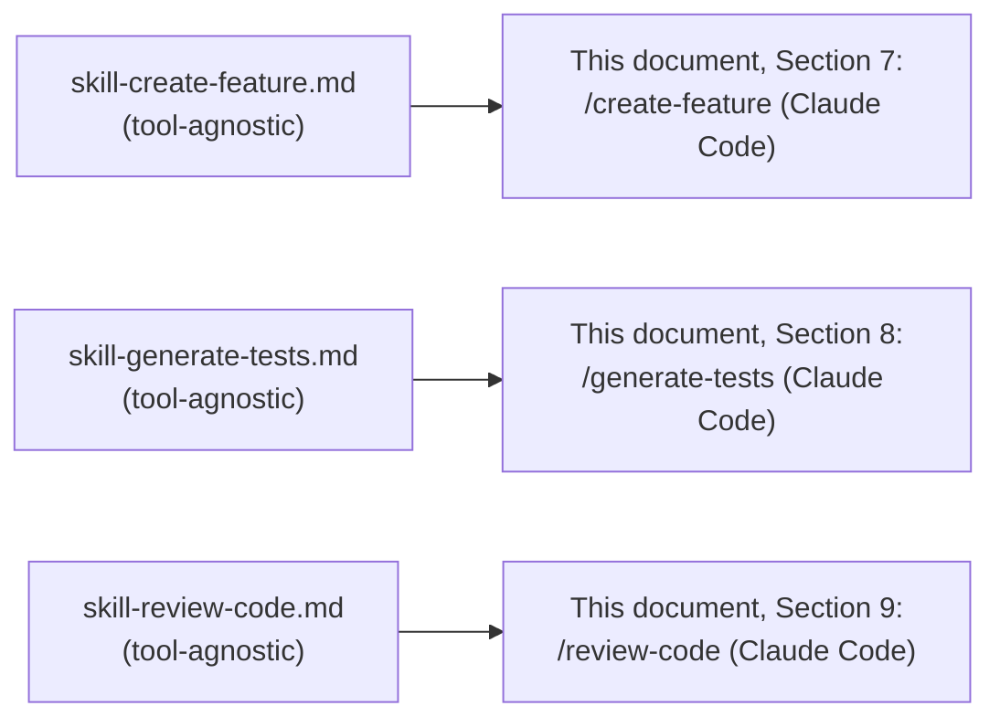
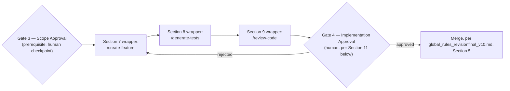

# CLAUDE_CODE_PROMPTS.md

**Status:** Active
**Layer:** 8 — Prompt Library
**Framework Version:** v10
**Tier:** 2 (Required)
**Tool:** Claude Code
**Purpose:** Provide the Claude-Code-specific invocation wrappers for the three Tier 1 Layer 7 Skills (`create-feature`, `generate-tests`, `review-code`) — translating each tool-agnostic Skill into a concrete, directly-usable Claude Code artifact, per `FRAMEWORK_BLUEPRINT.md`, Section 2.8 ("Provide the tool-specific invocation artifacts that translate a Skill... into a concrete prompt for a specific AI tool"). This document introduces no engineering capability independent of the Skills it wraps; it is an invocation layer, not a specification layer.
**Primary Authority (highest priority, in order):** `FRAMEWORK_BLUEPRINT.md` → `SKILLS.md` → `global_rules_revisionfinal_v10.md` → `global_technology_stack_v10.md`. This document introduces no architectural decision of its own and MUST NOT be read as amending any of the four. Where any statement below appears to conflict with one of them, the higher-priority document wins and this document MUST be corrected (Section 15).
**Reference materials (informational inspiration only, no authority):** Claude Code Official Documentation, Claude Code Best Practices, Anthropic Prompt Engineering Guide. Consulted solely for general patterns in tool-specific invocation design, prompt structure, and instruction clarity (Section 2 below). No claim in this document about Claude Code's current feature surface, CLI syntax, or configuration schema is asserted as permanently fixed; where Claude Code's own documented mechanism may have evolved since this document's generation, the reader MUST verify current syntax against Claude Code's own official documentation before use (Section 4, item 5). Where a reference pattern and the Primary Authority would ever conflict, the Primary Authority prevails without exception.
**Inherits from:** `SKILLS.md` and its three `Active` Skill documents (`skill-create-feature.md`, `skill-generate-tests.md`, `skill-review-code.md`) — Layer 7, the Skills this document wraps, cited by reference and never duplicated (`FRAMEWORK_BLUEPRINT.md`, Section 11.2); `global_rules_revisionfinal_v10.md` — Layer 2, the rules every wrapped Skill's execution must still satisfy regardless of invocation tool; `global_technology_stack_v10.md` — Layer 3, the technology selections a Skill's `steps` may introduce; `FRAMEWORK_README.md`, `PROJECT_BOOTSTRAP_GUIDE.md` — Layer 5, the session-initialization and bootstrap procedures this document's Section 6 maps onto a Claude-Code-specific mechanism.
**Governs:** Nothing at a governing layer. Per `FRAMEWORK_BLUEPRINT.md`, Section 2.8, Layer 8 is operational, not governing, and has no authority over any Layer 1–7 artifact. This document MAY, however, be referenced by a future Layer 9 template targeting Claude Code as its primary developer tool, to help satisfy `TEMPLATE_SPEC.md`, Section 8 (Category 4, mandatory Prompt Library references) — subject to the Tier 2 gap stated in Section 13 below.
**Supersedes:** None. This is the first Prompt Library document generated for Framework v10.
**Read order:** Read only after `SKILLS.md` and the specific Skill document being wrapped have already been read in full (`SKILLS.md`, Section 3: a manifest entry, and by extension a Prompt wrapper, is a pointer, never a substitute for the full Skill specification). A developer or AI agent selects this document specifically because Claude Code has already been chosen as the invocation tool for the current session — tool selection itself remains a developer/project decision, never a framework mandate (`FRAMEWORK_BLUEPRINT.md`, Sections 1.4, 11.3).
**RFC 2119:** The key words **MUST**, **MUST NOT**, **REQUIRED**, **SHALL**, **SHALL NOT**, **SHOULD**, **SHOULD NOT**, **RECOMMENDED**, **MAY**, and **OPTIONAL** in this document are to be interpreted as described in RFC 2119. They apply to every rule below without exception unless the rule itself states otherwise.

---

## 0. Scope and Position in the Knowledge Architecture

```
Layer 1 — Constitution                         AI_DEVELOPMENT_PHILOSOPHY_v2.0.md
        ↓
Layer 2 — Framework Rules                       global_rules_revisionfinal_v10.md
        ↓
Layer 3 — Technology Standards                  global_technology_stack_v10.md
        ↓
Layer 4 — Project Rules                         project-pc-app_v04.md               (Active)
                                                 project-personal-full-stack_v01.md  (Active)
                                                 project-monolithic_v04.md           (Active)
                                                 project-mobile_v01.md               (pending, v10.1)
        ↓
Layer 5 — Developer Manuals    FRAMEWORK_README.md, PROJECT_BOOTSTRAP_GUIDE.md,
                                CONTRIBUTING.md, COMMANDS.md, PROJECT_STRUCTURE.md   (all Active)
        ↓
Layer 6 — Reference Implementations
        ↓
Layer 7 — AI Skills            SKILLS.md (Manifest, Active)
                                skill-create-feature.md   (Active)
                                skill-generate-tests.md   (Active)
                                skill-review-code.md      (Active)
        ↓ (this document inherits from Layer 7, by reference, and wraps it for one specific tool)
Layer 8 — Prompt Library        CLAUDE_CODE_PROMPTS.md    ← this document (tool: Claude Code)
                                 (a second, distinct tool's Prompt document remains required
                                  for Tier 2 completion — Section 13 below)
        ↓
Layer 9 — Project Templates     TEMPLATE_SPEC.md (Active); template-fastapi-sqlite/ (pending)
Layer 10 — Knowledge Base
Layer 11 — Reference Documents
```

**What this document contains.** For each of the three `Active` Tier 1 Skills, a complete, directly-usable Claude Code invocation artifact: the Skill it wraps, the `primary-agent-role` it declares (matching the Skill's own, per `FRAMEWORK_BLUEPRINT.md`, Section 11.2), the `gate` it inherits for display purposes, and the full prompt text a developer can place into a Claude Code custom-command file. It also states how a Claude-Code-specific mechanism (project memory, custom commands) realizes the already-frozen AI Session Initialization Sequence (`FRAMEWORK_README.md`, Section 7) for this one tool, without altering that sequence.

**What this document does not contain, by design.** Per the Layer 8 prohibited responsibilities (`FRAMEWORK_BLUEPRINT.md`, Sections 2.8 and 11):

- It **MUST NOT** define a new engineering capability independent of a Layer 7 Skill. Every prompt below invokes exactly one of the three `Active` Tier 1 Skills; it does not introduce a fourth capability.
- It **MUST NOT** restate a Skill's `input`, `output`, `steps`, or `framework-alignment` content inline. Each wrapper below points to its Skill document by name for that content, consistent with the non-duplication rule (`FRAMEWORK_BLUEPRINT.md`, Section 11.2: "A Prompt document MUST NOT contain engineering logic that belongs in the Skill it wraps").
- It **MUST NOT** name Claude Code as a required framework dependency at the architecture level. This document exists precisely because Layer 8, and only Layer 8, MAY reference a specific tool (`FRAMEWORK_BLUEPRINT.md`, Section 1.4); no statement here binds Layers 1–7 to Claude Code.
- It **MUST NOT** specify the technical mechanism by which a HITL Gate technically pauses and resumes — that mechanism remains explicitly deferred at the framework level (HE-003). Section 11 below only observes how Claude Code's own, already-existing turn-based interaction model happens to satisfy the Gate's *positional* requirement; it does not define a new pause/resume mechanism for the framework.
- It **MUST NOT**, by itself, bring Layer 8 to `Active` status. A minimum of two distinct tools is required for Tier 2 completion (`FRAMEWORK_BLUEPRINT.md`, Section 11.3); this document supplies exactly one (Section 13).

**How a developer or AI agent uses this document.** A human developer who has selected Claude Code as their invocation tool for a Framework v10 project opens this document, selects the wrapper matching the Skill they need (Section 7, 8, or 9), and either invokes it directly in a Claude Code session or places its fenced code block into the project's `.claude/commands/` directory (or equivalent current Claude Code custom-command mechanism, Section 4) for reuse across sessions. The AI tool executing that prompt is the Level 3 "AI Agent" in the tri-level model (`FRAMEWORK_BLUEPRINT.md`, Section 1.2); this document is simply how the human hands the Skill to that tool.

---

## 1. Relationship to the Skill Manifest (`SKILLS.md`) — Non-Duplication Rule

Per `FRAMEWORK_BLUEPRINT.md`, Section 11.2, "a Prompt document MUST reference the Skill(s) it invokes, rather than duplicating the Skill's logic inline. If a capability is only defined as a prompt and not as a Skill, it is not yet a complete framework artifact — the underlying Skill MUST be authored first." All three Skills this document wraps are already `Active` (`SKILLS.md`, Section 12; `FRAMEWORK_STATUS.md`, "Active Documents"), so this precondition is satisfied for all three wrappers below.



Each wrapper below is a *pointer plus invocation scaffolding*, never a restatement. Where this document's summary of a Skill's purpose, input, or output appears to add detail beyond what the Skill document itself states, that addition is a defect and MUST be corrected to a reference (`FRAMEWORK_BLUEPRINT.md`, Section 5, the inheritance model, applied here exactly as it is applied between Layer 4 and Layer 2).

---

## 2. Cross-Reference Design Inspiration (Informational Only)

**Purpose of this section.** Following the same auditable pattern already established for this framework's Layer 7 and Layer 9 documents (`SKILLS.md`, Section 2; `skill-create-feature.md`, Section 2; `TEMPLATE_SPEC.md`, Section 2), general *patterns* from three external, non-framework reference materials are reflected in this document's organization and prompt-writing discipline — never in new architecture. Each pattern is named, its general source noted, and mapped to the specific Blueprint- or `global_rules`-defined mechanism it is realized through in Framework v10.

| Requested pattern | Illustrated (informationally) by | Realized in this document exclusively through |
|---|---|---|
| **Clear, unambiguous task framing before any instruction detail** | Anthropic's Prompt Engineering Guide's emphasis on being clear and direct, and stating the task's context and goal before its mechanics | Each wrapper's opening lines (Sections 7–9), which state the Skill being invoked and its preconditions before any step-level detail, mirroring the "why before how" documentation standard already fixed at Layer 2 (`global_rules_revisionfinal_v10.md`, Section 8.1) |
| **Structured, tagged sections within a single prompt, rather than an undifferentiated block of instructions** | Anthropic's Prompt Engineering Guide's recommendation to use XML-style tags to separate context, instructions, and expected output | The `<context>`, `<instructions>`, `<inputs>`, and `<output_format>` structure used in every wrapper body (Sections 7–9) |
| **A dedicated, reusable, named invocation artifact scoped to one repeatable task** | Claude Code's own documented custom-command mechanism (a named, reusable prompt invoked by a short trigger, parameterized by the invoking developer's input) | The one-command-per-Skill structure of this document (Sections 7–9), each expressed as a complete, copyable Claude Code custom-command file |
| **Persistent, auto-loaded project context that a session does not need to be re-given each time** | Claude Code's own documented project-memory mechanism (a file automatically read at session start, holding durable project context) | Section 6 below, mapping the already-frozen AI Session Initialization Sequence (`FRAMEWORK_README.md`, Section 7) onto that mechanism — no new session-initialization rule is introduced; only its Claude-Code-specific realization is described |
| **Explicit, checkable output expectations rather than an open-ended "do the task"** | Anthropic's Prompt Engineering Guide's guidance to specify desired output format and give the model room to reason before concluding | The `<output_format>` block in every wrapper (Sections 7–9), grounded in each Skill's own Completion Criteria table rather than inventing a new success definition |

**Explicit non-adoptions.** No plugin-marketplace mechanism, no third-party hook or lifecycle-event engine, no MCP server or tool-connector protocol, and no memory-server process from any external ecosystem is a component of this document or of Framework v10. What is carried forward is the *pattern* named in the left-hand column above, mapped to a mechanism the Blueprint already defines or to Claude Code's own documented, native mechanism — nothing more. Adopting a concrete third-party mechanism beyond Claude Code's own native, documented features would be an architectural decision requiring its own Gate 2 (Architecture Approval) proposal (`FRAMEWORK_BLUEPRINT.md`, Section 18.2), and is explicitly out of scope for this document.

---

## 3. Tool Independence Declaration

Per `FRAMEWORK_BLUEPRINT.md`, Section 1.4, no specific AI tool is a component of Framework v10 at the architecture level. This document's existence does not change that: Claude Code is named here, and only here, because Layer 8 documents are the one layer of the framework explicitly permitted to reference a specific tool ("Project-level and developer-level documents (Layer 8 specifically) MAY reference specific tools, because tool selection is a developer decision, not a framework architecture decision").

1. Nothing in Layers 1–7 depends on this document existing, and nothing in Layers 1–7 is altered by it.
2. A project using this framework **MAY** select any tool for Skill invocation, including one with no corresponding Prompt Library entry yet — in that case, the developer invokes the Skill document directly, without a tool-specific wrapper, exactly as an agent would before any Layer 8 artifact existed for this project (`FRAMEWORK_BLUEPRINT.md`, Section 2.8, "AI interaction model").
3. This document **MUST NOT** be read as recommending Claude Code over any other tool at the framework level. It exists because Claude Code was the tool selected for this wrapper's generation, per the Owner's instruction — the same tool-selection discretion `FRAMEWORK_BLUEPRINT.md`, Section 11.3, already reserves to the developer/project.

---

## 4. The Claude Code Invocation Mechanism

This section describes, at a conceptual level, the Claude-Code-specific mechanism every wrapper in Sections 7–9 targets. It is descriptive of Claude Code's own documented, native feature surface — it does not define a new framework mechanism.

1. Claude Code supports **custom commands**: short, named, reusable prompts a developer defines once and invokes repeatedly within a session, typically parameterized by developer-supplied input at invocation time. Each wrapper in this document (Sections 7–9) is written in the form of one such custom command.
2. Claude Code supports a **project-memory file**, automatically loaded at the start of a session, holding durable project context the developer does not want to re-supply every time. Section 6 below maps the AI Session Initialization Sequence onto this mechanism.
3. Neither mechanism is invented by this document. Both are Claude Code's own native, documented features; this document only specifies *what content* Framework v10 places into them, not the mechanisms themselves.
4. This document expresses each command's content as a fenced code block containing the complete file content a developer places into the corresponding custom-command location within a Claude-Code-managed project. Framework v10 does not fix that file's exact directory path or frontmatter schema as an architectural decision — those are Claude Code's own conventions, external to this framework, and are therefore reproduced here for practical usability rather than asserted as framework rules.
5. **Verification requirement.** Because Claude Code's own documented feature surface, exact file locations, and frontmatter field names MAY evolve independently of this framework, a developer or AI agent using this document **MUST** confirm the current custom-command syntax against Claude Code's own official documentation before relying on the exact frontmatter shown in Sections 7–9, consistent with the same restraint `COMMANDS.md`, Section 7, already applies to undetermined Layer 3 tool-name selections rather than asserting a name that could drift out of sync with its source.

---

## 5. Prompt Document Metadata Schema (Layer 8, Claude Code)

Per `FRAMEWORK_BLUEPRINT.md`, Section 11.2, every Prompt document MUST declare a `primary-agent-role` matching the Skill it invokes. This section defines the small, fixed set of organizational fields this document uses to record that requirement and related lookup information for each wrapper below. These fields are a documentation lens over this document's own three entries — analogous to how `SKILLS.md`, Section 4, restates the Layer 7 metadata schema for a reader entering that layer — and introduce no new Layer 7 schema field.

| Field | Purpose |
|---|---|
| `skill-invoked` | The exact Layer 7 Skill this wrapper invokes, by filename. |
| `primary-agent-role` | The role declared by this wrapper, which **MUST** match the invoked Skill's own `primary-agent-role` (`skill-create-feature.md`, `skill-generate-tests.md`, `skill-review-code.md`, each Section 3). |
| `gate` | The HITL Gate the invoked Skill's output requires, or `none` — reproduced from the Skill's own Section 3 for lookup convenience, not independently declared. |
| `claude-code-artifact` | The conventional location a developer places this wrapper's content, per Claude Code's own custom-command mechanism (Section 4). |
| `tool` | Fixed at `Claude Code` for every entry in this document. |

---

## 6. Session Bootstrap for Claude Code

The AI Session Initialization Sequence (`FRAMEWORK_README.md`, Section 7; `FRAMEWORK_BLUEPRINT.md`, Section 14) is a Layer 5 procedure, already frozen, requiring every session to read `FRAMEWORK_README.md` first, then the Constitution, `global_rules_revisionfinal_v10.md`, `global_technology_stack_v10.md`, `DECISIONS.md`, and `FRAMEWORK_HANDOVER.md`, in that order. This document does not alter that sequence. It states only how Claude Code's project-memory mechanism (Section 4, item 2) MAY be used to satisfy it without requiring the sequence to be manually re-triggered every session.

A project's Claude-Code-loaded project-memory file **SHOULD** contain, at minimum, a pointer directing the agent to perform the Section 7 sequence before any Skill wrapper in this document (Sections 7–9) is invoked — for example, an instruction stating that `FRAMEWORK_README.md` MUST be read first, in every new session, before any other framework document. This document does not reproduce the full session-initialization procedure here, consistent with the non-duplication rule (Section 1 above) applied by analogy to Layer 5 content: the project-memory file **MUST** point to `FRAMEWORK_README.md` and `FRAMEWORK_BLUEPRINT.md`, Section 14, rather than restate their content.

---

## 7. Prompt Wrapper — `create-feature`

| Field | Value |
|---|---|
| `skill-invoked` | `skill-create-feature.md` |
| `primary-agent-role` | Backend Agent **or** Frontend Agent (context-dependent — resolved per invocation, exactly as `skill-create-feature.md`, Section 4, already requires; this wrapper does not resolve the choice on the Skill's behalf) |
| `gate` | `none` (`skill-create-feature.md`, Section 3) |
| `claude-code-artifact` | Conventionally, a Claude Code custom command named `create-feature` |
| `tool` | Claude Code |

**Preconditions this wrapper does not repeat.** Every precondition listed in `skill-create-feature.md`, Section 6, still applies in full when this Skill is invoked through Claude Code. This wrapper's body instructs the agent to verify them; it does not restate what each one means.

```markdown
---
description: Implement a scoped feature's business/domain logic (and, where applicable, its presentation layer) using the create-feature Skill.
argument-hint: [feature-description-or-pointer-to-Gate-3-scope-definition]
---

<context>
You are executing the `create-feature` Skill (Layer 7, `skill-create-feature.md`) of
Framework v10, invoked here through its Claude Code Prompt Library wrapper
(`CLAUDE_CODE_PROMPTS.md`, Section 7). You are operating as either the Backend Agent
or the Frontend Agent, resolved per `skill-create-feature.md`, Section 4, based on
which side of the Clean Architecture boundary this feature's work primarily sits on.
</context>

<instructions>
1. Confirm every precondition in `skill-create-feature.md`, Section 6, is satisfied
   before proceeding. If any precondition is unmet, stop and report which one,
   per that Skill's own Section 11 (Failure Conditions) — do not proceed on an
   assumption.
2. Read `skill-create-feature.md` in full if you have not already done so in this
   session. Do not rely on a prior summary of it.
3. Execute the Skill's `steps` field (`skill-create-feature.md`, Section 9) exactly
   as written, in order, using the scoped feature definition supplied in
   $ARGUMENTS (or, where $ARGUMENTS points to a Gate 3 approval artifact rather
   than a plain description, that artifact) as this invocation's input.
4. Where the Skill's own Section 11 (Failure Conditions and Escalation) requires
   you to stop and report a gap, do so plainly. Do not attempt to work around a
   listed failure condition.
5. Self-check your output against the Skill's Completion Criteria table
   (`skill-create-feature.md`, Section 10) before presenting it as complete.
</instructions>

<inputs>
$ARGUMENTS
</inputs>

<output_format>
Present your output as the completed result of `create-feature`, structured so
that it can be consumed directly as input to the `generate-tests` Skill
(`skill-create-feature.md`, Section 8) — including any flagged
architectural-decision candidate (Section 9.6, item 3), stated explicitly rather
than absorbed silently. Do not present your output as having passed Gate 4; this
Skill's `gate` field is `none`, and Gate 4 review occurs later, against the
combined output of `create-feature` → `generate-tests` → `review-code`
(`SKILLS.md`, Section 8).
</output_format>
```

---

## 8. Prompt Wrapper — `generate-tests`

| Field | Value |
|---|---|
| `skill-invoked` | `skill-generate-tests.md` |
| `primary-agent-role` | Test Agent (`skill-generate-tests.md`, Section 3) |
| `gate` | `none` (`skill-generate-tests.md`, Section 3) |
| `claude-code-artifact` | Conventionally, a Claude Code custom command named `generate-tests` |
| `tool` | Claude Code |

**Ordering note this wrapper does not resolve independently.** `skill-generate-tests.md`, Section 1, states explicitly that this Skill MAY be invoked either after `create-feature`'s output already exists (typical ordering) or ahead of `create-feature`'s own Implementation stage (reversed, test-first ordering). This wrapper does not select an ordering on the developer's behalf; Stage 1 of the invoked Skill (`skill-generate-tests.md`, Section 9.1) determines which ordering applies.

```markdown
---
description: Produce Unit, Integration, End-to-End, Regression, Edge Case, and Negative Test Cases using the generate-tests Skill.
argument-hint: [pointer-to-create-feature-output-or-specification-artifacts]
---

<context>
You are executing the `generate-tests` Skill (Layer 7, `skill-generate-tests.md`)
of Framework v10, invoked here through its Claude Code Prompt Library wrapper
(`CLAUDE_CODE_PROMPTS.md`, Section 8). You are operating as the Test Agent.
</context>

<instructions>
1. Confirm every precondition in `skill-generate-tests.md`, Section 6, is
   satisfied before proceeding, including determining which of the two orderings
   named in that Skill's Section 1 applies to this invocation. If a required
   input is unavailable under either ordering, stop and report per that Skill's
   Section 12 — do not proceed with a partial or assumed input set.
2. Read `skill-generate-tests.md` in full if you have not already done so in
   this session. Do not rely on a prior summary of it.
3. Execute the Skill's `steps` field (`skill-generate-tests.md`, Section 9)
   exactly as written, in order, using the input supplied in $ARGUMENTS.
4. Organize your output by the Test Category Taxonomy already defined in
   `skill-generate-tests.md`, Section 10 (Unit, Integration, End-to-End,
   Regression, Edge Case, Negative). Where a category does not apply (most
   commonly Regression, absent defect history), state this explicitly rather
   than omitting the category silently.
5. Do not implement, modify, or "fix" the business/application logic under
   test, even where a generated test reveals a defect — report the finding
   per the Skill's Section 12, item 3, instead.
6. Self-check your output against the Skill's Completion Criteria table
   (`skill-generate-tests.md`, Section 11) before presenting it as complete.
</instructions>

<inputs>
$ARGUMENTS
</inputs>

<output_format>
Present your output as the completed result of `generate-tests`, structured so
that it can be consumed jointly with `create-feature`'s output as input to the
`review-code` Skill (`skill-generate-tests.md`, Section 8) — including any
flagged architectural-decision candidate. Do not present your output as having
passed Gate 4; this Skill's `gate` field is `none`.
</output_format>
```

---

## 9. Prompt Wrapper — `review-code`

| Field | Value |
|---|---|
| `skill-invoked` | `skill-review-code.md` |
| `primary-agent-role` | Code Review Agent (`skill-review-code.md`, Section 3) |
| `gate` | `Gate 4 — Implementation Approval` (`skill-review-code.md`, Section 3) |
| `claude-code-artifact` | Conventionally, a Claude Code custom command named `review-code` |
| `tool` | Claude Code |

**Gate-handling note.** This wrapper's output is what Gate 4 evaluates (`skill-review-code.md`, Section 8). See Section 11 of this document for how that Gate's human-approval requirement manifests specifically within Claude Code's own turn-based interaction model — a description, not a new mechanism.

```markdown
---
description: Perform the required code-quality and rule-conformance review, with severity-classified findings, using the review-code Skill.
argument-hint: [pointer-to-create-feature-and-generate-tests-output]
---

<context>
You are executing the `review-code` Skill (Layer 7, `skill-review-code.md`) of
Framework v10, invoked here through its Claude Code Prompt Library wrapper
(`CLAUDE_CODE_PROMPTS.md`, Section 9). You are operating as the Code Review
Agent. Your output is what Gate 4 (Implementation Approval) evaluates; you do
not yourself approve or reject the change (`skill-review-code.md`, Section 5.2,
item 3) — that authority belongs to the human Engineering CEO.
</context>

<instructions>
1. Confirm every precondition in `skill-review-code.md`, Section 6, is
   satisfied before proceeding, including which artifact supplies the test
   coverage input (a completed `generate-tests` invocation, or test artifacts
   embedded in `create-feature`'s own test-first implementation). If any
   precondition is unmet, stop and report per that Skill's Section 12.
2. Read `skill-review-code.md` in full if you have not already done so in this
   session. Do not rely on a prior summary of it.
3. Execute the Skill's `steps` field (`skill-review-code.md`, Section 9) in
   order, reviewing the artifacts supplied in $ARGUMENTS against every
   dimension that Section enumerates: Blueprint and Framework Rule compliance,
   Architecture and Technology compliance, Code Quality, Security, Test
   Coverage, Documentation Impact, and RFC 2119 Compliance where applicable —
   with Maintainability applied throughout as the weighing lens
   (`skill-review-code.md`, Section 4), not as a separate stage.
4. Classify every finding by severity exactly as defined in
   `skill-review-code.md`, Section 10 (Critical / Major / Minor). Do not
   introduce a severity level, wording, or threshold beyond what that section
   already defines.
5. Do not implement, rewrite, or remediate the code or tests under review —
   report findings only (`skill-review-code.md`, Section 5.2, item 1).
6. Self-check your output against the Skill's Completion Criteria table
   (`skill-review-code.md`, Section 11) before presenting it as complete.
</instructions>

<inputs>
$ARGUMENTS
</inputs>

<output_format>
Present your output as the full structured findings report defined in
`skill-review-code.md`, Section 8: findings by dimension with severity and
rule citation, an explicit ready/not-ready recommendation determined
mechanically by whether any Critical finding remains open, a Definition of
Done cross-check, a Test Coverage summary, any flagged architectural-decision
candidate, and a statement of exactly which artifacts were reviewed. State
explicitly that this output is a recommendation for Gate 4, not the Gate 4
approval decision itself.
</output_format>
```

---

## 10. Skill Composition in Claude Code

The reference Skill Composition already defined at Layer 7 (`SKILLS.md`, Section 8: `create-feature` → `generate-tests` → `review-code`, terminating at Gate 4) applies unchanged when every Skill in the chain is invoked through this document's Claude Code wrappers. This document introduces no new composition operator; it only observes how the existing composition looks when each step is a Claude Code custom-command invocation within one continuous session.



A developer using Claude Code MAY invoke the three wrappers in this order within a single session, passing each Skill's stated output forward as the next wrapper's `$ARGUMENTS` input, consistent with `SKILLS.md`, Section 8's own SHOULD/MAY framing — this document does not mandate this exact sequence as the only valid one, for the same reason `SKILLS.md`, Section 8, itself does not.

---

## 11. HITL Gate Handling in Claude Code

The technical mechanism by which an AI agent pauses and resumes at a named HITL Gate is explicitly deferred at the framework level (HE-003; `FRAMEWORK_BLUEPRINT.md`, Section 9.2) and is not specified by this document. What follows is a description of how Claude Code's own, already-existing interaction model happens to satisfy the Gate's *positional* requirement — it introduces no new mechanism.

1. Claude Code operates as a turn-based, conversational tool: after producing a response, it stops and awaits the human's next message. This document does not create this behavior; it is native to how Claude Code already operates.
2. Where a wrapped Skill's `gate` field names a specific Gate (as `review-code`'s does, Gate 4), the natural end of that wrapper's turn — the point at which `review-code`'s findings report is presented and Claude Code stops — **coincides with** the position HE-002 already reserves for Gate 4. The human's next message (approval, rejection, or a request for revision) is the Gate 4 decision.
3. Where a wrapped Skill's `gate` field is `none` (as `create-feature`'s and `generate-tests`'s both are), no explicit approval checkpoint is required before the next Workflow Phase Skill executes — a developer MAY, and typically will, still read the output between turns, but this document does not require a formal Gate pause at that point, consistent with `SKILLS.md`, Section 12, Footnote 1.
4. This section MUST NOT be read as defining a Claude-Code-specific Gate mechanism distinct from the five canonical Gates already frozen at Layer 5 (`FRAMEWORK_BLUEPRINT.md`, Section 9.2). It is an observation of fit, not a new architectural element.

---

## 12. Prohibited Responsibilities — Explicit Boundary

Consistent with `FRAMEWORK_BLUEPRINT.md`, Sections 2.8 and 11, this document explicitly does **not** do the following, and any future edit that adds one of these is out of scope for Layer 8 and MUST be redirected to the correct layer instead:

| Not defined here | Correct layer |
|---|---|
| Any Skill's `input`, `output`, `steps`, or `framework-alignment` specification | Layer 7 (`skill-create-feature.md`, `skill-generate-tests.md`, `skill-review-code.md`) |
| Any new Skill, HITL Gate, or agent role | Layer 7 / Layer 5, and only via a Gate 2 amendment (`FRAMEWORK_BLUEPRINT.md`, Section 18.2) |
| The canonical technology table, or any archetype's directory layout / naming convention | Layer 3 (`global_technology_stack_v10.md`) / Layer 4 (the matching Project Rule document) |
| The AI Session Initialization Sequence in full | Layer 5 (`FRAMEWORK_README.md`, Section 7) |
| The technical pause/resume mechanism for a HITL Gate | Explicitly deferred at the framework level (HE-003); not defined by any layer at v10 |
| A second tool's invocation wrappers (Cursor, ChatGPT, GitHub Copilot, Codex) | A separate Layer 8 document, per tool, required for Tier 2 completion (Section 13 below) |
| A ready-to-clone project scaffold | Layer 9 (`TEMPLATE_SPEC.md` and concrete templates) |

---

## 13. Tier 2 Completion Status and Current Gap

Per `FRAMEWORK_BLUEPRINT.md`, Section 11.3, "Tier 2 completion requires Prompt Library coverage for a minimum of two distinct AI tools, without specifying which two." This document supplies exactly **one** tool — Claude Code. It does **not**, by itself, bring Layer 8 to `Active` status.

1. `FRAMEWORK_STATUS.md`, "Next Targets," already lists "Prompt Library (minimum two AI tools)" as an outstanding Tier 2 item. This document's generation is progress toward that item, not its completion.
2. A second, distinct tool's Prompt Library document (e.g., a Cursor-, ChatGPT-, GitHub-Copilot-, or Codex-specific equivalent of this document) **MUST** be generated before Layer 8 can be recorded `Active`, consistent with the same two-of-five minimum every prior Layer 8 statement in this framework's document set has already anticipated (`FRAMEWORK_BLUEPRINT.md`, Sections 2.8, 11.3, 17).
3. Until that second tool's document exists, `TEMPLATE_SPEC.md`, Section 8 (Category 4, mandatory Prompt Library references), remains only partially satisfiable: a concrete template MAY now reference this document for a Claude-Code-based workflow, but Category 4's own minimum-two-tools requirement (`TEMPLATE_SPEC.md`, Section 8, item 1) is not yet met by this document alone. `TEMPLATE_SPEC.md`, Section 14.1, MUST continue to report Category 4 as an open gap until a second tool's Prompt Library document exists, not treat this document as closing it.
4. An AI agent or developer encountering this gap **MUST** report it plainly, consistent with the same discipline `PROJECT_BOOTSTRAP_GUIDE.md`, Section 5, and `TEMPLATE_SPEC.md`, Section 14, already apply to their own honestly-reported gaps — not treat this single-tool document as though it completed Layer 8.

---

## 14. Relationship to Other Layers

| Layer | Relationship to this document |
|---|---|
| Layer 5 (`FRAMEWORK_README.md`) | Supplies the AI Session Initialization Sequence this document's Section 6 maps onto Claude Code's project-memory mechanism, without restating it. |
| Layer 5 (`PROJECT_BOOTSTRAP_GUIDE.md`) | Governs whether a project has been bootstrapped and Gate 1 approved — a precondition every wrapped Skill's own Section 6 already requires this document's user to confirm before invocation. |
| Layer 7 (`SKILLS.md`) | The Manifest this document's three wrappers correspond to. Where `SKILLS.md`'s own entry for a Skill (role, gate) is amended, this document's matching metadata table (Sections 7–9) **MUST** be updated in the same change (Section 15 below). |
| Layer 7 (`skill-create-feature.md`, `skill-generate-tests.md`, `skill-review-code.md`) | The full specifications this document wraps. This document contains no engineering logic beyond what these three documents already state. |
| Layer 9 (`TEMPLATE_SPEC.md`) | Requires every concrete Layer 9 template to declare mandatory Prompt Library references once the minimum tool count is satisfied (`TEMPLATE_SPEC.md`, Section 8). This document is a partial, single-tool contribution toward that requirement (Section 13 above). |

---

## 15. Authority and Conflict Resolution

1. Per the Primary Authority ordering stated in the header, and per the downward authority rule (KA-002, `FRAMEWORK_BLUEPRINT.md`, Section 6), this document **MUST NOT** contradict `FRAMEWORK_BLUEPRINT.md`, `SKILLS.md`, `global_rules_revisionfinal_v10.md`, or `global_technology_stack_v10.md`, in that order of precedence. Where this document appears to conflict with any of the four, the higher-priority document wins and this document **MUST** be corrected.
2. None of the reference materials named in the header (Section 2) carries any authority over this document. A pattern drawn from them **MUST NOT** be cited as justification for a rule that conflicts with any Primary Authority document.
3. Where a future amendment to `skill-create-feature.md`, `skill-generate-tests.md`, or `skill-review-code.md` changes a Skill's `input`, `output`, `steps`, `gate`, or `primary-agent-role`, this document's corresponding wrapper (Sections 7–9) **MUST** be updated in the same change, per Section 16 below, so that this document never invokes a stale version of a Skill's specification.
4. The full conflict-resolution procedure, including same-layer conflicts between this document and a future second-tool Prompt Library document, is defined in `FRAMEWORK_BLUEPRINT.md`, Section 6, and is not restated here.

---

## 16. Change Control

1. This document **MUST NOT** be edited silently to invoke a Skill beyond the three Tier 1 Skills currently `Active` in `SKILLS.md`, Section 12, or to introduce a new agent role, Gate, or invocation mechanism. A change of that kind is scope expansion and **MUST** follow the amendment procedure defined in `FRAMEWORK_BLUEPRINT.md`, Section 18.2.
2. Whenever a wrapped Skill document (`skill-create-feature.md`, `skill-generate-tests.md`, `skill-review-code.md`) is amended in a way that changes its `input`, `output`, `steps`, `gate`, or `primary-agent-role`, the corresponding wrapper in this document (Sections 7–9) **MUST** be updated in the same change, and this document's own metadata tables **MUST** be reconciled against the amended Skill document's authoritative values.
3. Upon this document's creation, `SKILLS.md`, Section 15 (Relationship to Other Layers), **MAY** be extended to note that a Claude-Code-specific Prompt Library entry now exists for each Tier 1 Skill — this is an accurate factual addition, not an architectural change, and does not itself require a Gate 2 event.
4. This document **MUST NOT** be recorded as completing Layer 8 (`FRAMEWORK_BLUEPRINT.md`, Section 2.8, "Active once at least two tool-specific Prompt sets exist") until a second, distinct tool's Prompt Library document exists, per Section 13 above.
5. Upon this document's creation, `FRAMEWORK_README.md` Sections 4–6 and `FRAMEWORK_STATUS.md` **MUST** be updated in the same change to record this document as `Active` progress toward the "Prompt Library (minimum two AI tools)" Tier 2 item, while explicitly continuing to report that item as incomplete until a second tool's document exists — per `FRAMEWORK_README.md`, Section 9, and the AI Session Instructions in `FRAMEWORK_STATUS.md`.

---

## Closing Statement

This document is the first Prompt Library artifact of Framework v10 (Layer 8), providing complete, directly-usable Claude Code invocation wrappers for all three `Active` Tier 1 Skills — `create-feature`, `generate-tests`, and `review-code` — together with a Claude-Code-specific mapping of the already-frozen AI Session Initialization Sequence onto Claude Code's project-memory mechanism, and an explicit, non-architecture-creating description of how Claude Code's native turn-based interaction model satisfies the positional requirement of a named HITL Gate. No architectural decision has been introduced beyond what `FRAMEWORK_BLUEPRINT.md`, Sections 2.8 and 11, assign to this layer's responsibility; every wrapper points to its Skill's full specification rather than restating it, and every Claude-Code-specific detail is confined to this document, consistent with the framework's runtime-independence principle. As stated plainly in Section 13, this document alone does not complete Layer 8 — a second, distinct tool's Prompt Library document remains required for Tier 2 completion, per `FRAMEWORK_BLUEPRINT.md`, Section 11.3.
