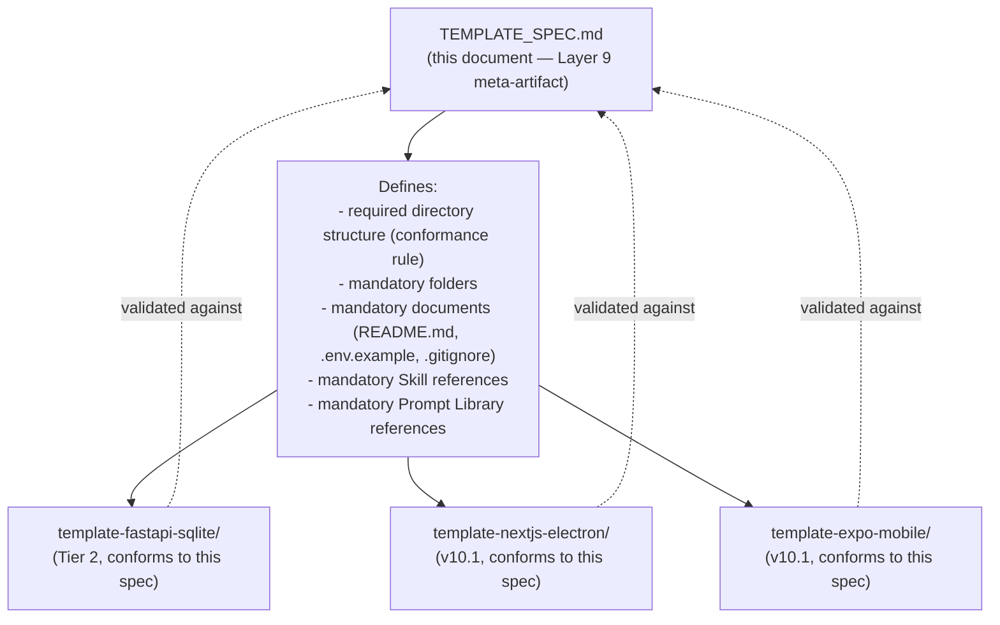
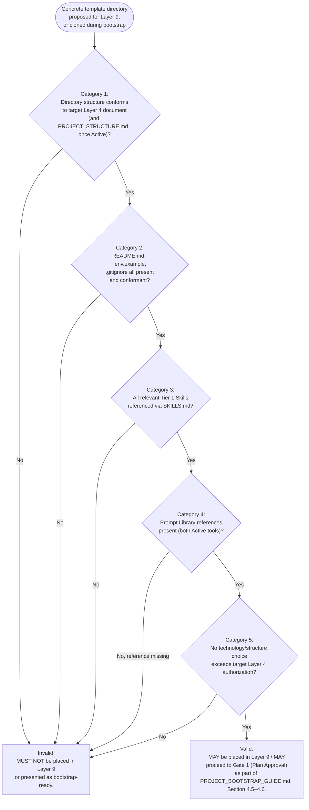
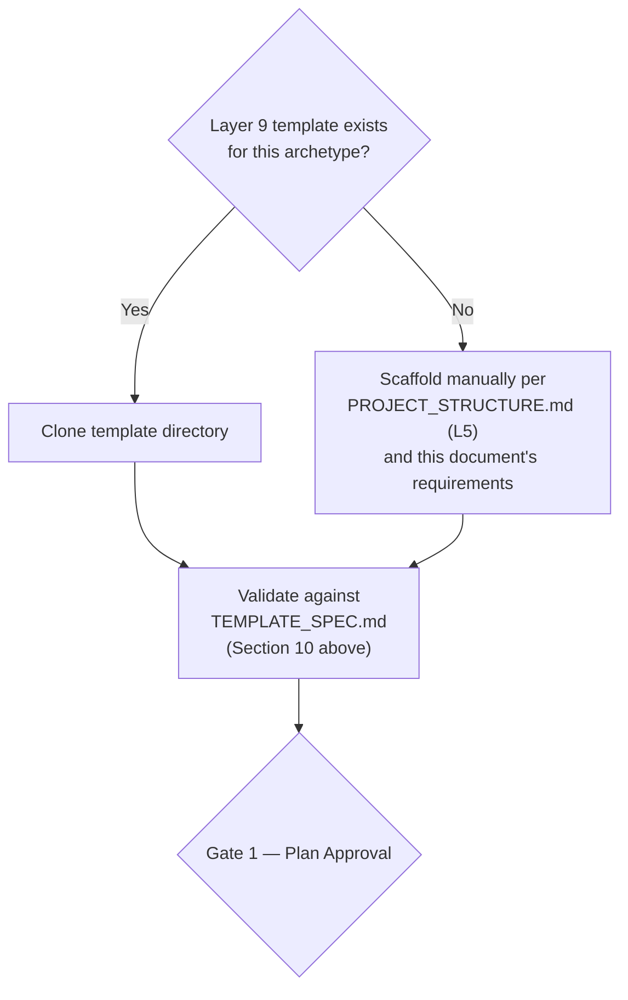
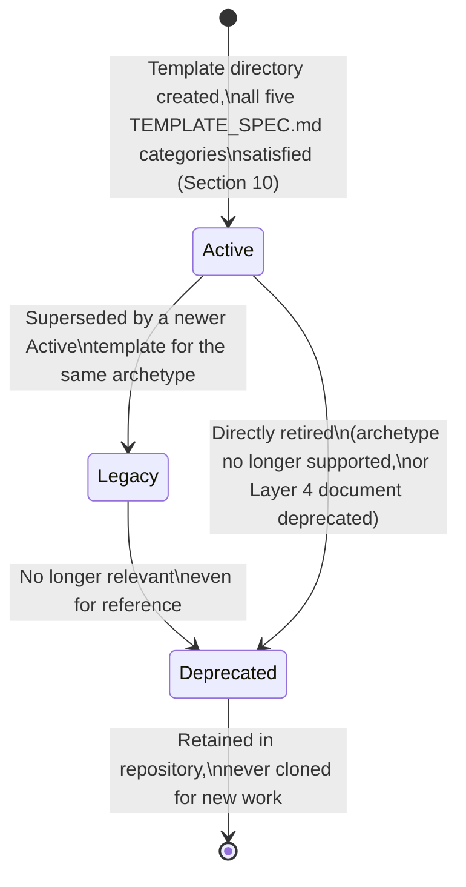

# TEMPLATE_SPEC.md

**Status:** Active
**Layer:** 9 — Project Templates
**Tier:** 1 (Critical)
**Purpose:** Serve as the required Project Template Specification for Framework v10 (correction C-10) — the single parent meta-artifact that every concrete Layer 9 template directory MUST conform to before it may be considered valid. This document defines, in full: the required directory-structure conformance rule, the mandatory documents every template MUST contain, the mandatory Skill references every template MUST declare, and the mandatory Prompt Library references every template MUST declare — the same five-part content list `FRAMEWORK_BLUEPRINT.md`, Section 12.1, already fixes for this document. It introduces no new architectural decision beyond what that section and Section 2.9 already specify.
**Primary Authority (highest priority, in order):** `FRAMEWORK_BLUEPRINT.md` → `FRAMEWORK_README.md` → `global_rules_revisionfinal_v10.md`. This document introduces no architectural decision of its own and MUST NOT be read as amending any of the three. Where any statement below appears to conflict with one of them, the higher-priority document wins and this document MUST be corrected (Section 16).
**Reference materials (informational inspiration only, no authority):** `README_cookiecutter.md`, `README_copier.md`, `README_Claude Forge.md`. These three external project READMEs are consulted in Section 2 below solely for general design patterns (specification-first generation, non-destructive scaffolding, bundled/pre-wired starting points, questionnaire-driven customization). None of their specific architecture, vendor mechanisms, or runtime mechanisms (templating engines, hook scripts, plugin marketplaces, update/diff engines) is adopted anywhere in this document. Where a reference material's pattern and the Blueprint would ever conflict, the Blueprint prevails without exception.
**Inherits from:** `FRAMEWORK_BLUEPRINT.md`, Sections 2.9 and 12 (this document's own defining sections); whichever Layer 4 Project Rule document a concrete template targets (e.g., `project-pc-app_v04.md` for a Desktop/Electron template) — supplying the directory layout and naming conventions a template's structure must conform to; `PROJECT_STRUCTURE.md` (Layer 5, `Active`) — the canonical cross-archetype directory reference a template's layout must also match; `SKILLS.md` and its three Tier 1 Skill documents (Layer 7, all `Active`) — the Skills a template's mandatory Skill references resolve to; and the Prompt Library (Layer 8, `Active` — `CLAUDE_CODE_PROMPTS.md` and `OPENAI_PROMPTS.md`) — the tool-specific invocations a template's mandatory Prompt Library references resolve to.
**Governs:** Every concrete Layer 9 template directory, present or future (e.g., `template-fastapi-sqlite/`, and any future `template-nextjs-electron/`, `template-expo-mobile/`), per the downward authority rule (KA-002, `FRAMEWORK_BLUEPRINT.md` Section 6) and the specification-first pattern (correction C-10, `FRAMEWORK_BLUEPRINT.md` Section 12.1). No concrete template MAY exist in Layer 9 without first satisfying every requirement this document states.
**Supersedes:** None. This is the first version of this document.
**Read order:** Read first upon entering Layer 9, before any concrete template directory is created or validated — the literal, required first artifact of this layer (`FRAMEWORK_BLUEPRINT.md`, Section 12.1: "This is the required first artifact in Layer 9, analogous to `SKILLS.md` in Layer 7"). It is read after the AI Session Initialization Sequence (`FRAMEWORK_README.md`, Section 7) has completed, and at the point in the Project Creation Flow (`FRAMEWORK_BLUEPRINT.md`, Section 16; `PROJECT_BOOTSTRAP_GUIDE.md`, Section 4.4) where a template is selected, cloned, or validated.
**RFC 2119:** The key words **MUST**, **MUST NOT**, **REQUIRED**, **SHALL**, **SHALL NOT**, **SHOULD**, **SHOULD NOT**, **RECOMMENDED**, **MAY**, and **OPTIONAL** in this document are to be interpreted as described in RFC 2119. They apply to every rule below without exception unless the rule itself states otherwise.

---

## 0. Scope and Position in the Knowledge Architecture

```
Layer 1 — Constitution                         AI_DEVELOPMENT_PHILOSOPHY_v2.0.md
        ↓
Layer 2 — Framework Rules                       global_rules_revisionfinal_v10.md
        ↓
Layer 3 — Technology Standards                  global_technology_stack_v10.md
        ↓
Layer 4 — Project Rules                         project-pc-app_v04.md (Active)
                                                 project-personal-full-stack_v01.md (pending)
                                                 project-monolithic_v04.md (pending)
                                                 project-mobile_v01.md (pending, v10.1)
        ↓
Layer 5 — Developer Manuals                     PROJECT_STRUCTURE.md (Active, Tier 2)
Layer 6 — Reference Implementations
Layer 7 — AI Skills                             SKILLS.md (Active)
                                                 skill-create-feature.md (Active)
                                                 skill-generate-tests.md (Active)
                                                 skill-review-code.md (Active)
Layer 8 — Prompt Library                        CLAUDE_CODE_PROMPTS.md (Active)
                                                 OPENAI_PROMPTS.md (Active)
        ↓ (this document inherits from Layers 4, 5, 7, 8 above, by reference, at the
           point a concrete template is validated against it)
Layer 9 — Project Templates  (this document + concrete template directories)
                                                 TEMPLATE_SPEC.md  ← this document
                                                 template-fastapi-sqlite/  (Tier 2, pending)
        ↓
Layer 10 — Knowledge Base
Layer 11 — Reference Documents
```

**What this document contains.** The required Project Template Specification for Layer 9 (`FRAMEWORK_BLUEPRINT.md`, Sections 2.9 and 12.1, correction C-10): the specification-first pattern this layer follows (Section 1 below); the five required content categories every concrete template MUST satisfy — directory-structure conformance, mandatory documents, mandatory Skill references, mandatory Prompt Library references, and archetype/`PROJECT_STRUCTURE.md` conformance (Sections 5–9); the conformance validation procedure a template MUST pass before being placed in Layer 9 or before a bootstrap MAY proceed past it (Section 10; `FRAMEWORK_BLUEPRINT.md`, Section 12.2); and the explicit resolution of how this document, together with a single seed template, satisfies the Layer 9 minimum-artifact requirement for v10 (Section 12; correction C-05).

**What this document does not contain, by design.** Per the Layer 9 prohibited responsibilities (`FRAMEWORK_BLUEPRINT.md`, Section 2.9):

- It **MUST NOT** define new architectural rules. It packages Layer 4 decisions into a usable starting-point requirement; it does not extend or reinterpret them (`FRAMEWORK_BLUEPRINT.md`, Section 2.9, "Prohibited Responsibilities").
- It **MUST NOT** replace `PROJECT_BOOTSTRAP_GUIDE.md` (Layer 5). That document explains the *process* of bootstrapping a project, including where template selection and validation sit inside that process; this document supplies only the *specification* a template must satisfy once selected.
- It **MUST NOT** restate the canonical directory layout of any specific Layer 4 archetype (e.g., the `src/domain/`, `src/application/` structure of `project-pc-app_v04.md`, Section 4). It requires *conformance* to whichever Layer 4 document a template targets; it does not reproduce that document's content.
- It **MUST NOT** restate the seven-field Skill specification of any individual Skill (`skill-create-feature.md`, `skill-generate-tests.md`, `skill-review-code.md`), the Skill Manifest's classification or composition logic (`SKILLS.md`), or the content of any future Prompt Library entry. It requires that a template *reference* these artifacts; it does not duplicate their logic.
- It **MUST NOT** introduce a new HITL Gate, a new agent role, a new Skill Metadata field, or any schema element beyond what `FRAMEWORK_BLUEPRINT.md` already fixes for Layers 7–9.

**How an AI agent uses this document.** Per `FRAMEWORK_BLUEPRINT.md`, Section 2.9's AI interaction model: during project creation, an AI agent or developer selects the Layer 9 template matching the target archetype (where one exists), clones it, and then follows `PROJECT_BOOTSTRAP_GUIDE.md` to customize it. The agent **MUST** validate the cloned template against this document before considering the bootstrap's scaffold-validation step (`PROJECT_BOOTSTRAP_GUIDE.md`, Section 4.5) complete. Where no template exists for the target archetype, the agent instead validates a manually scaffolded project directly against this document and against `PROJECT_STRUCTURE.md` (`PROJECT_BOOTSTRAP_GUIDE.md`, Section 4.4b).

---

## 1. Relationship to Layer 9 — The Specification-First Pattern

Layer 9 follows a specification-first pattern (correction C-10, `FRAMEWORK_BLUEPRINT.md`, Section 12.1): this document MUST exist and MUST be read before any concrete template directory is created or validated. It is the required first artifact of this layer, playing the same structural role for Layer 9 that `SKILLS.md` plays for Layer 7 — a single, required, read-first meta-artifact that every subsequent artifact in the layer is checked against, rather than a layer populated by independently-invented concrete artifacts.



No concrete template directory MAY be added to Layer 9 without first satisfying every requirement this document states (`FRAMEWORK_BLUEPRINT.md`, Section 12.2). This document, in turn, MUST NOT be edited to accommodate a specific template's shortcomings — where a concrete template cannot satisfy a requirement below, the template is invalid and MUST be corrected, not this specification (Section 16).

---

## 2. Cross-Project Design Inspiration (Informational Only)

**Purpose of this section.** Following the same auditable pattern already established for Layer 7 (`SKILLS.md`, Section 2; `skill-create-feature.md`, Section 2; `skill-review-code.md`, Section 2), general *ideas* from three external, non-framework projects are reflected in this document's organization and requirement framing — while explicitly prohibiting adoption of their architecture, templating engines, or runtime mechanisms. Each requested pattern is named, its general source noted, and mapped to the specific Blueprint-defined mechanism that already realizes it in Framework v10. No new field, rule, or mechanism is introduced anywhere in this section.

| Requested pattern | Illustrated (informationally) by | Realized in Framework v10 exclusively through |
|---|---|---|
| **A parent specification every concrete instance must satisfy before it is considered valid** | Cookiecutter's `cookiecutter.json` and Copier's `copier.yml`, each of which declares the required inputs and structure a generated project must conform to | This document itself — the required Layer 9 meta-artifact every concrete template MUST conform to (correction C-10, `FRAMEWORK_BLUEPRINT.md` Section 12.1) |
| **Scaffolding produces a working project starting point quickly, without manual setup drift between projects** | Cookiecutter's stated goal of "help[ing] consumers have a working source code tree as quickly as possible"; Copier's rendering of a template directory into a destination project | The Layer 9 Project Template concept itself (`FRAMEWORK_BLUEPRINT.md`, Section 2.9, "Purpose"), instantiated via the Clone Template step of the Project Creation Flow (`FRAMEWORK_BLUEPRINT.md`, Section 16; `PROJECT_BOOTSTRAP_GUIDE.md`, Section 4.4a) |
| **A complete, pre-wired starting kit bundling structure, documentation, and required references together, rather than assembled piecemeal** | Claude Forge's "one install, full professional kit" framing — commands, skills, hooks, and rules bundled and pre-wired together rather than installed one at a time | The five required categories this document defines (Sections 5–9), all validated together in a single conformance check (Section 10) before a template — or a manually scaffolded project — may proceed past Gate 1 (`PROJECT_BOOTSTRAP_GUIDE.md`, Section 4.5–4.6) |
| **Working across local paths and remote/versioned sources without changing the consumer-facing workflow** | Copier's support for both local paths and Git URLs as template sources | Not adopted as a new mechanism; Framework v10 does not specify a template *retrieval* protocol (local vs. remote) at all — a concrete template is a directory that either exists in the repository's Layer 9 location or does not (Section 12 below). Any future need to source templates remotely would be a Layer 3/8 tooling decision, out of scope for this specification, and would require its own Gate 2 review |

**Explicit non-adoptions.** To keep this mapping auditable rather than aspirational, the following are stated plainly: no Jinja-style (or other) templating/variable-substitution engine, no `cookiecutter.json`/`copier.yml`-style interactive questionnaire mechanism, no pre-/post-generate hook script runtime, no project-update or diff/re-render mechanism (as distinct from one-time scaffolding), and no plugin-marketplace or CLI-installer mechanism from any of the three reference materials is a component of Framework v10 or of this document. Adopting any such mechanism would be a vendor-specific or runtime-specific architectural decision and would require its own Gate 2 (Architecture Approval) proposal (`FRAMEWORK_BLUEPRINT.md`, Section 18.2) — squarely out of scope for a Layer 9 specification to introduce unilaterally. What is carried forward from the reference materials is the *pattern* named in the left-hand column above, and nothing more.

---

## 3. Inheritance Declaration

Consistent with the framework's inheritance model (`FRAMEWORK_BLUEPRINT.md`, Section 5) — under which a lower-numbered layer's rules apply automatically to higher-numbered layers without restatement — this document inherits, by reference and without restatement:

| From | Document | What is inherited |
|---|---|---|
| Layer 4 | Whichever Project Rule document a concrete template targets (e.g., `project-pc-app_v04.md` for Desktop/Electron) | The archetype's directory layout, naming conventions, and archetype-specific technical decisions (`FRAMEWORK_BLUEPRINT.md`, Section 2.9, "Inputs") — this document requires *conformance* to that layout; it does not restate it. |
| Layer 5 | `PROJECT_STRUCTURE.md` (`Active`, Tier 2) | The canonical, cross-archetype directory-structure reference a template's layout must match, per `FRAMEWORK_BLUEPRINT.md`, Section 2.9, "Inputs." The gap this row previously described (Section 14 below) is resolved for the `PROJECT_STRUCTURE.md`-dependent portion of Categories 1 and 5. |
| Layer 7 | `SKILLS.md` and its three Tier 1 Skill documents (`skill-create-feature.md`, `skill-generate-tests.md`, `skill-review-code.md`, all `Active`) | The Skills a template's mandatory Skill references (Section 7 below) resolve to. This document does not restate any Skill's seven-field specification. |
| Layer 8 | The Prompt Library (`Active` — `CLAUDE_CODE_PROMPTS.md` and `OPENAI_PROMPTS.md`, the two required tool-specific documents) | The tool-specific invocations a template's mandatory Prompt Library references (Section 8 below) resolve to. |

Where this document states a requirement, it is either (a) a direct application of an already-frozen Blueprint decision (Section 12.1's five-category content list) to the general shape every template must have, or (b) a conformance-checking rule pointing to whichever Layer 4/5/7/8 artifact actually governs the specific content in question. It is never a new architectural decision at the Layer 1–4 level.

---

## 4. The Five Required Categories — Overview

Per `FRAMEWORK_BLUEPRINT.md`, Section 12.1, this document defines exactly five required categories of content that every concrete Layer 9 template MUST satisfy. No sixth category is introduced; no category listed below MAY be treated as optional for any concrete template regardless of archetype.

| # | Category | Defined in | Nature of the requirement |
|---|---|---|---|
| 1 | Required directory structure | Section 5 | Conformance rule — the template's layout MUST match its target Layer 4 archetype document and, once `Active`, `PROJECT_STRUCTURE.md` |
| 2 | Mandatory documents | Section 6 | Fixed, archetype-independent file list: `README.md`, `.env.example`, `.gitignore` |
| 3 | Mandatory Skill references | Section 7 | The template MUST reference the Tier 1 Skills relevant to its Development Workflow Phase |
| 4 | Mandatory Prompt Library references | Section 8 | The template MUST reference at least the minimum Prompt Library coverage required for Tier 2 completion, once Layer 8 exists |
| 5 | Archetype and `PROJECT_STRUCTURE.md` conformance | Section 9 | The template MUST NOT introduce a directory layout, naming convention, or technology choice beyond what its target Layer 4 document already authorizes |

A concrete template that fails to satisfy any one of these five categories in full is invalid and **MUST NOT** be placed in Layer 9, regardless of how complete its coverage of the remaining four categories is (`FRAMEWORK_BLUEPRINT.md`, Section 12.2).

---

## 5. Category 1 — Required Directory Structure

1. A concrete template's internal directory structure **MUST** conform to the directory layout defined by the single Layer 4 Project Rule document matching the template's target archetype (e.g., `project-pc-app_v04.md`, Section 4, for a Desktop/Electron template). This document **MUST NOT** restate that layout; it requires conformance to it.
2. A concrete template **MUST NOT** collapse, rename, or omit any top-level structural boundary its target Layer 4 document designates as binding (e.g., for the Desktop/Electron archetype, the `domain` / `application` / `infrastructure` / `main` / `preload` / `renderer` boundaries under `src/`, per `project-pc-app_v04.md`, Section 4, Rule 4).
3. Once `PROJECT_STRUCTURE.md` (Layer 5) is `Active`, a concrete template's directory structure **MUST** additionally conform to that document's canonical, cross-archetype directory reference, in addition to its target Layer 4 document. Where the two would ever conflict, the target Layer 4 document is authoritative for archetype-specific structure, and any apparent conflict **MUST** be raised for correction rather than silently resolved in either document's favor (`FRAMEWORK_BLUEPRINT.md`, Section 6).
4. Where no Layer 9 template yet exists for an archetype, this same conformance requirement applies directly to a manually scaffolded project, per `PROJECT_BOOTSTRAP_GUIDE.md`, Section 4.4b — manual scaffolding is not a lower-rigor path; it is this same requirement set applied without the convenience of a pre-built starting point.
5. This document **MUST NOT** define a directory structure of its own that a template could satisfy independently of its target Layer 4 document. There is no archetype-agnostic canonical layout at Layer 9; there is only a conformance rule pointing to Layer 4 (and, once `Active`, Layer 5).

---

## 6. Category 2 — Mandatory Documents

Regardless of archetype, every concrete Layer 9 template **MUST** contain, at minimum, the following three documents at the root of the generated project structure, per the fixed content list of `FRAMEWORK_BLUEPRINT.md`, Section 12.1:

| Document | Requirement |
|---|---|
| `README.md` | **MUST** be present. **MUST** state, at minimum, the project's archetype, the Layer 4 Project Rule document it was generated to conform to, and a pointer to `PROJECT_BOOTSTRAP_GUIDE.md` for onward setup — consistent with the Constitution's Documentation Philosophy (`AI_DEVELOPMENT_PHILOSOPHY_v2.0.md`, Section 17: "sufficient documentation for another developer — or another AI session — to continue development without prior context"). |
| `.env.example` | **MUST** be present and **MUST** contain no real secret values, per the Layer 2 Security Baseline requirement that every project provide an example/template for required environment configuration containing no real secret values (`global_rules_revisionfinal_v10.md`, Section 9.2). |
| `.gitignore` | **MUST** be present and **MUST**, at minimum, exclude the archetype's build artifacts, dependency directories, and any local environment file that could contain real secret values (e.g., a non-example `.env`), consistent with the Layer 2 rule that secrets **MUST NOT** be committed to version control in any form (`global_rules_revisionfinal_v10.md`, Section 9.1). |

1. A concrete template **MUST NOT** omit any of these three documents on the grounds that its target archetype "doesn't need" one of them — the requirement is archetype-independent, per Section 12.1's fixed content list.
2. A concrete template **MAY** include additional documents beyond these three (e.g., a `CHANGELOG.md`, a `CONTRIBUTING.md` reference, or an archetype-specific setup note), but **MUST NOT** substitute an additional document for one of the three required ones — each of the three has a distinct, non-interchangeable purpose.
3. Where a template's target Layer 4 document already specifies additional required root-level files (none currently do, as of `project-pc-app_v04.md`), those additional files are inherited from Layer 4 and are additive to, not a replacement for, the three files required by this section.

---

## 7. Category 3 — Mandatory Skill References

1. A concrete template **MUST** declare, within its `README.md` or an equivalent onboarding document, an explicit reference to every Tier 1 Skill relevant to its Development Workflow Phase (`FRAMEWORK_BLUEPRINT.md`, Section 8), by name and by pointing to `SKILLS.md` as the discovery entry point — per the required "mandatory Skill references" content category (`FRAMEWORK_BLUEPRINT.md`, Section 12.1).
2. As of this document's generation, the complete set of Tier 1 Skills is `create-feature`, `generate-tests`, and `review-code`, all `Active` (`SKILLS.md`, Section 12; `FRAMEWORK_STATUS.md`, "Active Documents"). A concrete template targeting any archetype **MUST** reference all three, since `SKILLS.md`, Section 5, classifies all three Tier 1 Skills as archetype-agnostic — none carries Electron-, full-stack-, monolithic-, or mobile-specific logic in its own definition.
3. A template's Skill reference **MUST** point to the Skill via `SKILLS.md` (the manifest, per `SKILLS.md` Section 3's distinction between a manifest entry and a full Skill document) rather than reproduce any Skill's `input`, `output`, `steps`, or `framework-alignment` content inline. Reproducing a Skill's specification inline in a template would violate the framework's inheritance model (`FRAMEWORK_BLUEPRINT.md`, Section 5) in exactly the way a Layer 4 document restating a Layer 2 rule would.
4. A template **MUST NOT** reference a Skill not currently listed as `Active` in `SKILLS.md`, Section 12. Where a future Skill (`SKILLS.md`, Section 13, "Roadmap") becomes `Active`, this requirement extends automatically to it without requiring an amendment to this document, since the requirement is "every Tier 1 Skill relevant to the Development Workflow Phase," not an enumerated, frozen list — the enumeration in item 2 above is a statement of current fact, not a separate, independently-frozen requirement.
5. A template **MAY** additionally reference a template-relevant Skill outside the Tier 1 set once such a Skill exists and is `Active` (e.g., a future `build-docker-environment` Skill, per `SKILLS.md`, Section 13), but **MUST NOT** treat such a reference as satisfying this category in place of the three Tier 1 Skills.

---

## 8. Category 4 — Mandatory Prompt Library References

1. A concrete template **MUST** declare an explicit reference to the Prompt Library entries relevant to invoking its mandatory Skill references (Section 7 above) for at least the minimum number of AI tools required for Tier 2 Prompt Library completion — currently two distinct tools, without specifying which two (`FRAMEWORK_BLUEPRINT.md`, Section 11.3) — per the required "mandatory Prompt Library references" content category (`FRAMEWORK_BLUEPRINT.md`, Section 12.1).
2. A template's Prompt Library reference **MUST** point to the relevant Prompt document (e.g., `CLAUDE_CODE_PROMPTS.md` or `OPENAI_PROMPTS.md`) rather than reproduce that Prompt's invocation logic inline, consistent with the Layer 8 rule that a Prompt document is an invocation wrapper around a Layer 7 Skill and MUST NOT duplicate the Skill's logic (`FRAMEWORK_BLUEPRINT.md`, Section 11.2) — a template referencing a Prompt is bound by the same non-duplication discipline in reverse: it points to the Prompt, it does not restate what the Prompt itself already states.
3. The Prompt Library (Layer 8) is now `Active` as a whole, with two distinct tool-specific documents — `CLAUDE_CODE_PROMPTS.md` (Claude Code) and `OPENAI_PROMPTS.md` (OpenAI) — satisfying the Tier 2 minimum (`FRAMEWORK_BLUEPRINT.md`, Section 11.3; `FRAMEWORK_README.md`, Section 4.2). This category is therefore **fully satisfiable**: a concrete template MUST reference both documents to satisfy item 1 above. Section 14 below reflects this resolution.
4. A template previously validated against an earlier revision of this document, when this category was unsatisfiable, **MUST** be re-validated to confirm this category is now satisfied, and its Document Status (Section 13 below) **MUST** be updated accordingly if it was previously withheld from `Active` status solely on account of this gap.

---

## 9. Category 5 — Archetype and `PROJECT_STRUCTURE.md` Conformance

1. A concrete template **MUST NOT** introduce a project-type-specific technology choice beyond what its corresponding Layer 4 document already authorizes (`FRAMEWORK_BLUEPRINT.md`, Section 2.9, "Inherited constraints"). For example, a template targeting the Desktop/Electron archetype **MUST NOT** select a renderer state-management library other than Zustand, or a package manager other than pnpm, since `project-pc-app_v04.md`, Section 8, already fixes those as the archetype's Layer 3 defaults.
2. Where a template's target Layer 4 document leaves a technology selection to be made at bootstrap time rather than fixing it itself (e.g., `project-pc-app_v04.md`, Section 8, deliberately leaves the renderer UI library, test runner, and packaging/installer tooling to `global_technology_stack_v10.md` "at the time a project is bootstrapped"), the template **MAY** either embed a concrete selection consistent with that Layer 3 table, or leave the selection as an explicit, documented decision point for the person bootstrapping the project — but **MUST NOT** silently omit the decision point without documenting it in the template's `README.md`.
3. A template **MUST NOT** contradict a rule inherited from Layer 1–3 through its target Layer 4 document. Where a template's own convenience (e.g., a common third-party scaffolding convention) would require such a contradiction, the template is invalid as designed and **MUST** be corrected, or the underlying Layer 3/4 rule **MUST** be raised as a Gate 2 amendment proposal — never silently overridden at the template level (`FRAMEWORK_BLUEPRINT.md`, Section 6).
4. Once `PROJECT_STRUCTURE.md` is `Active`, this category additionally requires that a template's structure be checked against that document directly, per Section 5, item 3, above — this section's conformance rule and Section 5's directory-structure rule are two aspects of the same underlying requirement (structural conformance vs. technology-selection conformance) and **MUST** be validated together, not treated as independent checks that could pass or fail separately without cross-reference.

---

## 10. Conformance Validation Procedure

Per `FRAMEWORK_BLUEPRINT.md`, Section 12.2, a concrete template directory that does not satisfy every requirement in Sections 5–9 above is invalid and **MUST NOT** be placed in Layer 9. This conformance check is a required step in the Project Creation Flow (`FRAMEWORK_BLUEPRINT.md`, Section 16; `PROJECT_BOOTSTRAP_GUIDE.md`, Section 4.5).



1. An AI agent or developer performing this validation **MUST** check all five categories, in the order given in Section 4, rather than stopping at the first apparent pass — a template that satisfies Categories 1–3 but silently omits Category 5's conformance check is not validated, merely partially checked.
2. Category 4 is now fully satisfiable, per Section 8 above — Layer 8 is `Active` with both required tool-specific documents. A concrete template that omits a Category 4 reference **MUST** be treated as a genuine template defect (Fail), not as a standing framework gap, consistent with the ordinary application of this Section's procedure.
3. This procedure **MUST** be performed both (a) when a concrete template is first proposed for addition to Layer 9, and (b) whenever an AI agent clones an existing template during a specific project's bootstrap (`PROJECT_BOOTSTRAP_GUIDE.md`, Section 4.4a–4.5) — passing validation once, at the template's own creation, does not exempt a later bootstrap from re-confirming conformance, since the template's target Layer 4 or Layer 3 document may have changed in the interim (Section 13 below).

---

## 11. Relationship to the Project Creation Flow

This document's conformance procedure (Section 10) is the mechanism `PROJECT_BOOTSTRAP_GUIDE.md`, Section 4.5 ("Validate the Scaffold"), and `FRAMEWORK_BLUEPRINT.md`, Section 16, both point to without restating.



1. Per `FRAMEWORK_BLUEPRINT.md`, Section 16, a project is not considered "bootstrapped" until it has passed Gate 1 (Plan Approval) **and** its scaffold has been validated against this document — or, where no template yet exists for the archetype, against `PROJECT_STRUCTURE.md` directly (`PROJECT_BOOTSTRAP_GUIDE.md`, Section 3). A scaffold that has not passed the Section 10 procedure above **MUST NOT** be presented to the human as ready for Gate 1 review (`PROJECT_BOOTSTRAP_GUIDE.md`, Section 4.5).
2. This document does not itself perform, gate, or record the Gate 1 approval decision — that remains the human Engineering CEO's authority (`FRAMEWORK_BLUEPRINT.md`, Section 1.2, Level 1), exercised through the procedure `PROJECT_BOOTSTRAP_GUIDE.md`, Section 4.6, already defines. This document's role ends at producing a pass/fail conformance result for that Gate to evaluate.

---

## 12. v10 Scope and the KA-004 Minimum-Artifact Requirement

Per `FRAMEWORK_BLUEPRINT.md`, Section 12.3, and correction C-05: this document, together with a single seed template (`template-fastapi-sqlite/`), satisfies the Layer 9 minimum-artifact requirement (KA-004 — "each operational layer must contain at least one valid, classified artifact for the framework to be considered complete at any given version") for Framework v10. This resolves what would otherwise be a contradiction between two other frozen statements: that full Layer 9 template population is deferred to v10.1, and that every operational layer must contain at least one valid artifact.

1. This document alone is *not* sufficient to satisfy KA-004 for Layer 9 — a specification with no concrete instance conforming to it is not yet "at least one valid, classified artifact" in the sense KA-004 requires. `template-fastapi-sqlite/` (Tier 2, currently `Pending — not yet generated`) is the seed instance this document's minimum-satisfaction claim depends on.
2. Until `template-fastapi-sqlite/` exists and has passed the Section 10 conformance procedure, Layer 9 as a whole remains incomplete, in the same sense that Layer 7 remained incomplete until all three Tier 1 Skill documents existed alongside `SKILLS.md` (`FRAMEWORK_BLUEPRINT.md`, Section 2.7, "Status"; `FRAMEWORK_STATUS.md`, Flag 7). This document's own creation is a necessary, but not by itself sufficient, condition for Layer 9's completion.
3. Full population of the template set across every Layer 4 archetype (a full-stack template, a monolithic template, and — in v10.1 — a mobile template) is explicitly a v10.1 objective (`FRAMEWORK_BLUEPRINT.md`, Sections 12.3 and 18.4) and is out of scope for this document to require or anticipate beyond naming it as a future direction, consistent with the same restraint `SKILLS.md`, Section 13, applies to its own roadmap of future Skills.

---

## 13. Template Lifecycle

**Scope note.** Framework v10 defines exactly one document lifecycle model, applicable to every framework artifact including concrete Layer 9 templates: the four-status model of `FRAMEWORK_BLUEPRINT.md`, Section 7 (DL-001). This section applies that existing model to templates specifically; it does not define a template-specific lifecycle distinct from it, in the same manner `SKILLS.md`, Section 9, applies the identical model to Skills.



1. A concrete template document status **MUST NOT** be recorded as `Active` until the Section 10 conformance procedure has been passed in full for that template, except where Category 4 (Prompt Library references) is unsatisfiable solely because Layer 8 does not yet exist — in that specific case, a template MAY still be recorded `Active` for Categories 1–3 and 5, with Category 4 noted as an open, framework-level gap rather than a template defect (Section 8, item 3; Section 14 below).
2. As of this document's generation, `template-fastapi-sqlite/` does not yet exist and therefore has not entered this lifecycle at all — it remains, per the same distinction `FRAMEWORK_README.md` and `SKILLS.md` draw throughout their own document sets, `Pending — not yet generated`, a state prior to and distinct from `Active`, `Legacy`, and `Deprecated`.
3. Where a Layer 4 archetype document a template targets is itself superseded (e.g., a hypothetical future `project-pc-app_v05.md`), the corresponding template's status **MUST** transition to `Legacy` in the same change, and its replacement template — once it exists and passes Section 10 — becomes the new `Active` template for that archetype, consistent with DL-001's general supersession rule.

---

## 14. Current Applicability at Framework v10's Mid-Migration State

Section 4 above states the canonical five-category requirement set in full, independent of which documents currently exist. As of this revision, every artifact those categories depend on is `Active`. This section is retained to record the resolution of each category's previously-open gap (Sections 14.1–14.4) and the one genuinely still-open item (Section 14.3's archetype-disambiguation question), so that a reader can see the framework's mid-migration trajectory rather than only its current end state.

**Governing rule.** Per `FRAMEWORK_README.md`, Section 4: "An AI agent MUST treat any document not listed as `Active` in this section as unavailable for new work." Nothing in this section grants an exception to that rule. A gap identified below is a reason to stop and report, never a reason to improvise the missing document's content or substitute a deprecated legacy document in its place.

### 14.1 Category 4 — Prompt Library References (Resolved)

The Prompt Library (Layer 8) is now `Active` as a whole, with both `CLAUDE_CODE_PROMPTS.md` (Claude Code) and `OPENAI_PROMPTS.md` (OpenAI) satisfying the Tier 2 two-tool minimum (`FRAMEWORK_BLUEPRINT.md`, Section 11.3; `FRAMEWORK_README.md`, Section 4.2). Category 4 is therefore **fully satisfiable** for any concrete template. This subsection is retained for historical traceability of the gap it previously described; an agent validating a template today **MUST** check Category 4 as an ordinary pass/fail requirement per Section 10 above, not as a standing, unsatisfiable gap.

### 14.2 Category 1 and Category 5 — `PROJECT_STRUCTURE.md` (Resolved)

`PROJECT_STRUCTURE.md` (Layer 5) is now `Active` (`FRAMEWORK_README.md`, Section 4.2). The portion of Category 1 and Category 5 that checks a template against the canonical cross-archetype directory reference is therefore fully performable, in addition to conformance against the template's target Layer 4 document (e.g., `project-pc-app_v04.md`). This subsection is retained for historical traceability of the gap it previously described; an agent validating a template today **MUST** perform both checks — the target Layer 4 document and `PROJECT_STRUCTURE.md` — in full, per Section 5, item 3, and Section 9, item 2, above.

### 14.3 Archetype Availability

Three of the four Layer 4 archetype documents are now `Active`: `project-pc-app_v04.md` (Desktop/Electron), `project-personal-full-stack_v01.md` (Full-Stack), and `project-monolithic_v04.md` (Monolithic) (`FRAMEWORK_README.md`, Section 4.1–4.2). A concrete template targeting any of these three archetypes **MAY** now be validated against Categories 1, 5, or 9's underlying Layer 4 reference in full. Only a Mobile-archetype template request **MUST** be declined at the framework level entirely, per `PROJECT_BOOTSTRAP_GUIDE.md`, Section 5.3, since `project-mobile_v01.md` remains `Pending (Tier 3 / v10.1)` and out of scope for v10 in its entirety.

**Open, separate question — not a Layer 4 availability gap.** With both `project-personal-full-stack_v01.md` and `project-monolithic_v04.md` now `Active`, `template-fastapi-sqlite/` (the seed template Section 12 below identifies as the outstanding Layer 9 KA-004 artifact) has **two** plausible, `Active`, FastAPI-capable archetype targets, and this specification does not itself state which one it is intended to conform to. This is an explicit, unresolved Owner decision (`FRAMEWORK_STATUS.md`, Flag 10), not a document-generation gap of the kind this Section 14 otherwise tracks. It **MUST** be confirmed by the Owner, not assumed, before `template-fastapi-sqlite/` is generated, per `TEMPLATE_SPEC.md`, Section 5, Rule 1, and `PROJECT_BOOTSTRAP_GUIDE.md`, Section 4.1.

### 14.4 Net Effect

As of this revision, Categories 1 through 5 are each fully checkable for the Desktop, Full-Stack, and Monolithic archetypes: Categories 1, 2, 3, and 5 have been fully checkable since their respective Layer 4/5 dependencies reached `Active`, and Category 4 is now fully satisfiable following Layer 8's completion (Section 14.1). The **sole** remaining blocker on `template-fastapi-sqlite/`'s generation is the archetype-disambiguation question stated in Section 14.3 above — an explicit Owner decision, not an unresolved document dependency. Once that decision is made, `template-fastapi-sqlite/` MAY be generated and validated against this specification in full, with no category requiring a reported gap.

---

## 15. Relationship to Other Layers

| Layer | Relationship to this specification |
|---|---|
| Layer 4 (e.g., `project-pc-app_v04.md`) | Supplies the directory layout, naming conventions, and archetype-specific technical decisions every template targeting that archetype MUST conform to (Sections 5, 9). This document requires conformance; it does not restate Layer 4 content. |
| Layer 5 (`PROJECT_STRUCTURE.md`, pending) | Will supply the cross-archetype canonical directory reference this document's Category 1 and Category 5 checks additionally require once `Active` (Section 14.2). |
| Layer 5 (`PROJECT_BOOTSTRAP_GUIDE.md`) | Governs the *process* within which this document's conformance procedure (Section 10) is invoked — Step 4 (template-or-manual-scaffold decision) and Step 5 (scaffold validation) of `PROJECT_BOOTSTRAP_GUIDE.md`, Section 4.4–4.5. This document supplies the *specification*; that guide supplies the *procedure surrounding it*. |
| Layer 7 (`SKILLS.md` and the three Tier 1 Skill documents) | Supplies the Skills a template's mandatory Skill references (Section 7) point to. This document does not restate any Skill's specification. |
| Layer 8 (Prompt Library, `Active`) | Supplies the tool-specific invocations a template's mandatory Prompt Library references (Section 8) point to — `CLAUDE_CODE_PROMPTS.md` and `OPENAI_PROMPTS.md`. |
| Layer 9 (concrete templates, e.g., `template-fastapi-sqlite/`) | Every concrete template in this layer MUST conform to this document in full (Section 10) before being considered `Active` (Section 13). |
| Layer 10 (`DECISIONS.md`) | Not a direct input to this document. Where validating a template surfaces an apparent architectural gap (e.g., a technology choice a Layer 4 document has not yet resolved), that gap MUST be escalated per the same discipline `skill-create-feature.md`, Section 11, and `skill-review-code.md`, Section 12, already apply — flagged for a Gate 2 decision and, if approved, recorded in `DECISIONS.md`, never resolved silently within a template. |

---

## 16. Authority and Conflict Resolution

1. Per the Primary Authority ordering stated in the header, and per the downward authority rule (KA-002), this document **MUST NOT** contradict `FRAMEWORK_BLUEPRINT.md`, `FRAMEWORK_README.md`, or `global_rules_revisionfinal_v10.md`, in that order of precedence. Where this document appears to conflict with any of the three, the higher-priority document wins and this document **MUST** be corrected.
2. None of the reference materials named in the header (Section 2) carries any authority over this document. A pattern drawn from them **MUST NOT** be cited as justification for a rule that conflicts with any Primary Authority document.
3. Where a concrete template, once created, appears to conflict with a requirement in this document, this document is authoritative and the template **MUST** be corrected — a template's existing structure or convenience **MUST NOT** be cited as grounds to weaken a requirement stated here (Section 1).
4. Where this document appears to conflict with a Layer 4 Project Rule document over which technology choice is authorized for an archetype, the Layer 4 document is authoritative per the downward authority rule, and this document's Section 9 requirement (conformance to Layer 4) **MUST** be read as automatically following whatever Layer 4 currently states, not as a frozen restatement of Layer 4's content at the time of this document's own generation.
5. The full conflict-resolution procedure, including same-layer conflicts between two operational-layer artifacts (e.g., between two concrete templates), is defined in `FRAMEWORK_BLUEPRINT.md`, Section 6, and is not restated here.

---

## 17. Change Control

1. This document **MUST NOT** be edited silently. A change to any of the five required categories (Sections 5–9), the conformance validation procedure (Section 10), or the Template Lifecycle model's application to templates (Section 13) is an architectural change and **MUST** follow the amendment procedure defined in `FRAMEWORK_BLUEPRINT.md`, Section 18.2: proposal → Gate 2 (Architecture Approval) → amendment → `DECISIONS.md` entry → `FRAMEWORK_HANDOVER.md` update in the same commit.
2. Section 14 of this document **MUST** be updated in the same change as any transition of a document it names (`PROJECT_STRUCTURE.md`, the Prompt Library, any Layer 4 archetype document) from `Pending` to `Active`, so that this document never claims a gap that no longer exists or stays silent about one that does — mirroring the identical obligation `PROJECT_BOOTSTRAP_GUIDE.md`, Section 7, already places on its own Section 5.
3. Upon this document's creation, `FRAMEWORK_README.md`, Sections 4–6, and `FRAMEWORK_STATUS.md` **MUST** be updated in the same change to reflect its new `Active` status and its removal from the "Pending" and "Documents To Generate" lists, per `FRAMEWORK_README.md`, Section 9, and the AI Session Instructions in `FRAMEWORK_STATUS.md`.
4. Layer 9 as a whole does not become fully populated on this document alone. Per Section 12 above, `template-fastapi-sqlite/` remains the outstanding Tier 2 artifact required for this layer's minimum-artifact requirement (KA-004) to be met by an actual concrete instance rather than by the specification alone.

---

## Closing Statement

This document is the required Project Template Specification for Framework v10 (correction C-10) — the parent meta-artifact every concrete Layer 9 template MUST conform to, playing the same structural role for Layer 9 that `SKILLS.md` plays for Layer 7. It defines the five required content categories `FRAMEWORK_BLUEPRINT.md`, Section 12.1, already fixes — directory-structure conformance, mandatory documents, mandatory Skill references, mandatory Prompt Library references, and archetype/`PROJECT_STRUCTURE.md` conformance — together with the conformance validation procedure (Section 10) a template MUST pass before being placed in Layer 9 or presented as bootstrap-ready. No architectural decision has been introduced beyond what `FRAMEWORK_BLUEPRINT.md` Sections 2.9 and 12 assign to this layer's responsibility. Consistent with correction C-05, this document alone satisfies only half of the Layer 9 minimum-artifact requirement; the outstanding half — a conforming concrete instance, `template-fastapi-sqlite/` — remains the framework's sole outstanding Tier 2 target. All five required content categories are now fully checkable for the three currently `Active` archetypes (Section 14); the only remaining blocker on `template-fastapi-sqlite/`'s generation is the archetype-disambiguation question of Section 14.3, an explicit Owner decision rather than a document dependency.
