# FRAMEWORK_BLUEPRINT.md

**Status:** Active
**Layer:** 5 — Developer Manuals
**Authority:** Master Blueprint of Framework v10
**Source of Truth:** `BLUEPRINT_INPUT_FREEZE.md` (38 frozen architectural decisions + 10 corrections)
**Scope of this document:** Structural transformation only. No new architectural concept is introduced. No frozen decision is modified. Every statement in this document MUST be traceable to a decision ID (`FD-`, `TD-`, `DL-`, `KA-`, `DI-`, `LP-`, `CC-`, `PR-`, `EP-`, `AA-`, `SK-`, `HE-`) or a correction ID (`C-01` through `C-10`) in `BLUEPRINT_INPUT_FREEZE.md`.

---

## 0. How to Read This Document

This blueprint is the master structural reference for Framework v10. It does not contain rules (that is Layer 2's responsibility), technology choices (Layer 3), or project-specific guidance (Layer 4). It defines **how the framework itself is shaped** — its layers, their relationships, their authority, their lifecycle, and the sequence in which an AI agent or human developer should traverse them.

Every future framework document — whether governing (Layers 1–6) or operational (Layers 7–11) — MUST be generated in a way that conforms to the structure defined here. If a future document appears to conflict with this blueprint, the blueprint takes precedence unless a new Owner decision is recorded in `DECISIONS.md` (Layer 10) that explicitly amends it.

This document is intended to be read by both humans and AI agents. An AI agent beginning any framework-related task SHOULD treat Section 14 ("AI Session Initialization Sequence") as its literal first action.

---

## 1. Overall Framework Architecture

### 1.1 Framework Vision

Framework v10 is the foundational layer of an **Engineering Operating System (EOS)** for Agentic Software Development (FD-001). It is not a style guide and it is not a collection of best practices. It is the substrate — the knowledge structures, standards, and conventions — that allows a single human, acting as Engineering CEO, to direct AI agents that execute engineering work autonomously and consistently.

The framework's success is measured by one criterion: **how little human clarification an AI agent requires to produce correct, consistent output using only framework documents** (AA-004). A framework that requires constant human re-explanation has failed at its purpose, regardless of how complete its document set is.

### 1.2 The Tri-Level Operating Model

The framework enforces three operating levels that MUST NEVER be collapsed into one another (FD-002):

| Level | Actor | Responsibility | MUST NOT |
|---|---|---|---|
| 1 — Direction | Human (Engineering CEO) | Defines vision, approves HITL Gates, makes architectural decisions | Perform engineering execution that falls within a defined agent role's delegation scope |
| 2 — Structure | Framework (this document set) | Defines knowledge structures, standards, conventions, and workflow shape | Execute engineering work; make architectural decisions on its own authority |
| 3 — Execution | AI Agents | Execute engineering work within framework-defined structures | Operate outside the boundaries defined by Layers 1–6; bypass a declared HITL Gate |

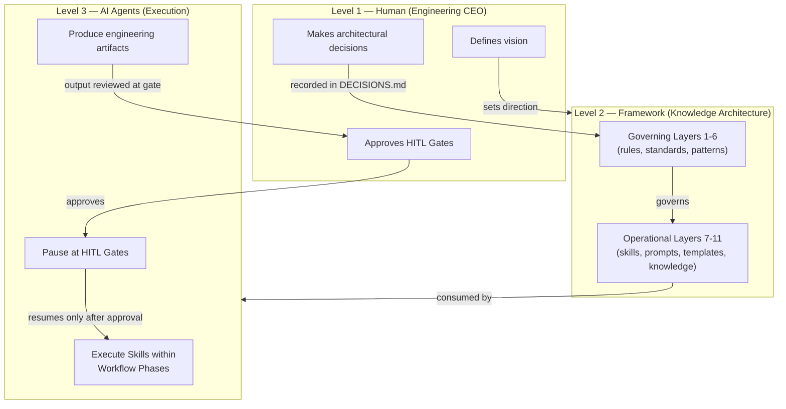

### 1.3 Agentic Design Assumption

Framework v10 does **not** implement multi-agent orchestration (FD-003). It does not specify a communication protocol, a distributed runtime, a message bus, or a scheduling system between agents. However, every artifact in the framework — every document, every Skill, every Prompt — MUST be designed so that a future orchestration layer can consume it without requiring structural changes to the framework. This is achieved through two mechanisms that recur throughout this blueprint:

1. **Named agent roles** (AA-001) are attached as metadata to operational artifacts, so a future Planner Agent can route work without the framework itself changing shape.
2. **HITL Gates** (HE-002) are named and frozen as stopping points, independent of how AI execution technically pauses and resumes. The mechanism is deferred (HE-003); the position is not.

### 1.4 Runtime Independence

No specific AI tool, runtime, or vendor (Claude, Cursor, Codex, Gemini, MCP, or any harness implementation) is a component of the framework. These are implementation runtimes that **consume** framework artifacts. The framework MUST NOT name a specific tool as a required dependency at the architecture level (Point 8 of `BLUEPRINT_INPUT_FREEZE.md`, correction C-01). Project-level and developer-level documents (Layer 8 specifically) MAY reference specific tools, because tool selection is a developer decision, not a framework architecture decision.

---

## 2. Knowledge Architecture — All Eleven Layers

The Knowledge Architecture (KA-001) is the canonical hierarchy of Framework v10. It replaces all prior document organization schemes. Every framework artifact MUST be assigned to exactly one of the eleven layers below (validated in `BLUEPRINT_INPUT_FREEZE.md`, Point 3).

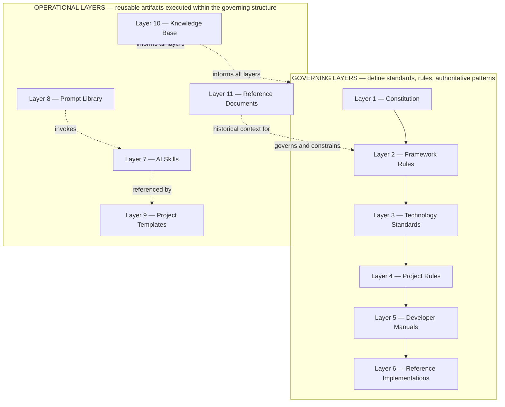

Per KA-002, **authority flows strictly downward**: a lower-numbered layer always takes precedence over a higher-numbered layer in case of conflict. Per KA-003, Layers 1–6 are *governing* (they define what is true and what is required); Layers 7–11 are *operational* (they are reusable artifacts that act within the boundaries the governing layers define). Operational layers MUST NOT override governing layers under any circumstance.

Per KA-004, each operational layer (7–11) MUST contain at least one valid, classified artifact for the framework to be considered complete at any given version. Full population of every layer is incremental and is not a release prerequisite beyond this minimum.

The following subsections specify each layer in full: purpose, responsibilities, inputs, outputs, inherited constraints, prohibited responsibilities, and AI interaction model.

---

### 2.1 Layer 1 — Constitution

**Purpose.** Establish the immutable philosophical foundation that every other layer inherits from. This is the only layer that answers "why does this framework exist" rather than "what should I do."

**Responsibilities.**
- State the framework's core values, in priority order: Maintainability, Simplicity, Consistency, Developer Experience, AI Readability, Vendor Independence, Long-term Sustainability, Extensibility, Performance, Technology Trends.
- Define the AI-First and Agentic Engineering principles that all lower layers must honor.
- Define the database, package management, and vendor-independence philosophy at the level of *principle*, not *implementation*.

**Inputs.** None. Layer 1 is axiomatic; it does not inherit from any other layer.

**Outputs.** A single governing document (`AI_DEVELOPMENT_PHILOSOPHY_v2.0.md`) that every Layer 2–11 artifact must be consistent with.

**Inherited constraints.** None — this is the root of the inheritance tree.

**Prohibited responsibilities.** Layer 1 MUST NOT specify concrete technologies (e.g., "use FastAPI"), MUST NOT specify project structure, and MUST NOT specify workflow mechanics. Those are the responsibility of Layers 2, 3, and 5 respectively.

**AI interaction model.** An AI agent reads Layer 1 once per session, early, to calibrate tone and priority ordering. It is rarely re-read mid-task. It is the layer an agent returns to only when a genuine value conflict arises between two lower-layer instructions.

**Status.** `Constitution`. Changed only through an explicit Owner decision recorded in `DECISIONS.md` (Layer 10).

---

### 2.2 Layer 2 — Framework Rules

**Purpose.** Translate the Constitution's principles into universal, enforceable, technology-agnostic engineering rules that apply to every project type the framework supports.

**Responsibilities.**
- Define RFC-level (MUST/SHOULD/MAY) rules for architecture (SOLID, Clean Architecture), Git workflow inheritance, environment and dependency management principles, code quality gates, documentation standards, security baselines, and the TDD boundary (EP-002).
- State the vendor-independence constraint (EP-001) as a binding rule, not merely an aspiration.
- Define what "done" means for a commit, independent of any specific tech stack.

**Inputs.** Layer 1 (Constitution).

**Outputs.** `global_rules_revisionfinal_v10.md` — the single Layer 2 document. This is the framework's highest-priority Tier 1 deliverable (DI-001).

**Inherited constraints.** MUST be consistent with every Layer 1 principle. MUST NOT contradict the priority ordering defined in the Constitution.

**Prohibited responsibilities.** Layer 2 MUST NOT name specific frameworks, libraries, or package managers (that is Layer 3's job) and MUST NOT define project-folder layouts for a specific application type (that is Layer 4's job).

**AI interaction model.** This is the layer an AI agent consults for *any* engineering decision that is not technology-specific: "should I catch this generic exception," "does this commit message follow convention," "is this comment explaining why or what." It is read in full at the start of any coding task and referenced continuously during execution.

**Status.** `Active` once created (currently the framework's single highest-priority gap; see Section 17).

---

### 2.3 Layer 3 — Technology Standards

**Purpose.** Declare the official, framework-wide technology stack: the specific tools, languages, and platforms approved for use, with explicit defaults and explicit supported alternatives.

**Responsibilities.**
- Maintain the canonical technology table (frontend, backend, database, vector store, desktop, mobile, package managers, hosting, CI).
- Record every default-vs-alternative decision with its rationale (e.g., TD-006: FAISS default, Qdrant supported alternative for production-grade persistent search; TD-007: SQLite default, PostgreSQL upgrade path).
- Resolve technology conflicts that previously existed across legacy documents (TD-002 through TD-007).

**Inputs.** Layer 1 (philosophical priority ordering, e.g., maintainability over trend), Layer 2 (vendor-independence rule that every choice in this layer must satisfy).

**Outputs.** `global_technology_stack_v10.md` — the single Layer 3 document.

**Inherited constraints.** Every technology selected here MUST be replaceable per the EP-001 vendor-independence rule. No selection in this layer may be treated as a hard infrastructure dependency inside business logic.

**Prohibited responsibilities.** Layer 3 MUST NOT define *how* a project is structured (Layer 4) or *how* a developer interacts with these tools day to day (Layer 5). It declares *what is approved*, not *how it is used*.

**AI interaction model.** An AI agent consults this layer whenever it needs to choose a concrete library, database, or package manager. If a task requires a technology not listed here, the agent MUST surface this as a gap requiring a Gate 2 (Architecture Approval) decision rather than silently introducing a new dependency.

**Status.** `Active`.

---

### 2.4 Layer 4 — Project Rules

**Purpose.** Apply Layers 1–3 to a specific application archetype (Full-Stack, Desktop, Monolithic, Mobile), defining the concrete folder structure, naming conventions, and archetype-specific technical decisions.

**Responsibilities.**
- Define the project-type-specific directory layout.
- Define naming conventions for files, classes, and modules within that archetype.
- Resolve archetype-specific technology selections that are downstream of Layer 3 (e.g., which desktop framework, per TD-002 Electron is the standard, replacing the deprecated PyQt approach).
- Each Project Rule document MUST explicitly state which Layer 2 and Layer 3 rules it inherits rather than restating them.

**Inputs.** Layer 1, Layer 2, Layer 3 — all three are inherited, never restated.

**Outputs.**
- `project-pc-app_v04.md` (Electron-based) — Tier 1.
- `project-personal-full-stack_v01.md` — Tier 2.
- `project-monolithic_v04.md` — Tier 2.
- `project-mobile_v01.md` — Tier 3, deferred to v10.1.

**Inherited constraints.** MUST NOT redefine SOLID, Clean Architecture, Git conventions, or vendor-independence rules — these are inherited by reference from Layer 2. MUST use only technologies approved in Layer 3, or explicitly flag a Layer 3 gap for Gate 2 review.

**Prohibited responsibilities.** Layer 4 MUST NOT define step-by-step developer workflow (Layer 5), MUST NOT contain a full worked tutorial (Layer 6), and MUST NOT define reusable AI execution units (Layer 7).

**AI interaction model.** An AI agent reads exactly one Project Rule document per project — the one matching the current project's archetype. It is read once at project bootstrap (Section 16) and re-consulted whenever a structural or naming question arises during execution.

**Status.** `project-pc-app_v04.md` is `Active` upon creation; the PyQt-based legacy documents it replaces are `Deprecated` (DL-002).

---

### 2.5 Layer 5 — Developer Manuals

**Purpose.** Provide the operational, day-to-day procedural guidance that connects a human developer (or an AI agent acting on the developer's behalf) to the rest of the framework: how to start a session, how to bootstrap a project, what commands exist, and what the engineering workflow looks like end to end.

**Responsibilities.**
- Define the framework's single entry point document (`FRAMEWORK_README.md`), which every new session — human or AI — reads first (CC-002).
- Define the project bootstrap procedure (`PROJECT_BOOTSTRAP_GUIDE.md`).
- Define the canonical command reference (`COMMANDS.md`) and canonical directory structure reference (`PROJECT_STRUCTURE.md`).
- Define the commit/PR procedural workflow (`CONTRIBUTING.md`, reclassified to this layer per correction C-02).
- Formalize the Engineering Workflow pattern as an alternating sequence of Workflow Phases and HITL Gates (correction C-09; see Section 9).
- House the comprehensive AI-agent operational manual (`AI_DEVELOPMENT_MANUAL.md`, Tier 3, deferred to v10.1).

**Inputs.** Layers 1–4 (the rules and standards being operationalized) and Layer 7 (the Skills that populate each Workflow Phase).

**Outputs.** `FRAMEWORK_README.md`, `PROJECT_BOOTSTRAP_GUIDE.md`, `COMMANDS.md`, `PROJECT_STRUCTURE.md`, `CONTRIBUTING.md`, `AI_DEVELOPMENT_MANUAL.md` (v10.1).

**Inherited constraints.** MUST NOT introduce new architectural rules — it operationalizes Layers 1–4, it does not extend them. Any architectural decision discovered while writing a Layer 5 document MUST be escalated to Layer 2/3/4 and recorded in `DECISIONS.md`, not embedded silently in the manual.

**Prohibited responsibilities.** Layer 5 MUST NOT contain a full worked tutorial with vendor-specific implementation detail (that is Layer 6) and MUST NOT contain reusable, directly-executable AI task definitions (that is Layer 7).

**AI interaction model.** This is the layer an AI agent or human reads to know *what to do right now*. `FRAMEWORK_README.md` is read first in every session (Section 14). `PROJECT_BOOTSTRAP_GUIDE.md` is read once at the start of a new project (Section 16). `COMMANDS.md` and `PROJECT_STRUCTURE.md` are referenced continuously as lookup tables during execution.

**Status.** `FRAMEWORK_README.md`, `PROJECT_BOOTSTRAP_GUIDE.md` are Tier 1 `Active` documents upon creation; `COMMANDS.md`, `PROJECT_STRUCTURE.md` are Tier 2; `AI_DEVELOPMENT_MANUAL.md` is Tier 3 (v10.1).

---

### 2.6 Layer 6 — Reference Implementations

**Purpose.** Demonstrate the framework's principles applied end to end in a complete, working, vendor-specific scenario. This layer teaches *by example*, not by rule.

**Responsibilities.**
- House complete, runnable tutorials (the thirteen-chapter RAG guide, the AI-agent harness guide) that show one valid way to apply the framework.
- Make explicit, via a status header on every document in this layer, that vendor and technology choices shown here (HyperCLOVA X, BGE-M3, Qdrant, NextChat) are implementation-specific examples and are **not** Layer 3 framework defaults (CC-001).

**Inputs.** Layers 1–5, applied concretely.

**Outputs.** The RAG guide chapters (`chapter1_git.md` through `chapter13_operations.md`), `ai-agent-harness-guide.html`.

**Inherited constraints.** A Reference Implementation MUST NOT contradict Layer 1–4 principles (e.g., it must still demonstrate vendor-replaceable service-layer abstraction, even while choosing a specific vendor for the worked example). It MAY use a technology not listed as a Layer 3 default, provided it is clearly marked as an implementation-specific choice rather than a framework mandate.

**Prohibited responsibilities.** Layer 6 documents MUST NOT be cited as authoritative for "what the framework requires." If an AI agent finds a conflict between a Layer 6 example and a Layer 2–4 rule, the governing layer wins, and the Layer 6 document is informational only.

**AI interaction model.** An AI agent consults Layer 6 only when it needs a worked example of a pattern — e.g., "show me how the service-layer swap pattern looks in practice." It is never the first document read, and it is never treated as a source of binding requirements.

**Status.** `Active`, with the CC-001 classification header applied to every chapter.

---

### 2.7 Layer 7 — AI Skills

**Purpose.** Define the reusable, named, directly-executable engineering capabilities that a human or an AI agent can invoke to perform a unit of engineering work.

**Responsibilities.**
- Maintain `SKILLS.md`, the required Skill Manifest that indexes every Skill in the framework (correction C-06). This is the first artifact any AI agent reads when entering Layer 7.
- Maintain individual Skill documents, each populated with all seven required fields (correction C-08; see Section 11).
- Seed the framework with the three Tier 1 starter Skills: `create-feature`, `review-code`, `generate-tests` (SK-004).

**Inputs.** Layer 2 (rules the Skill must follow), Layer 3 (technologies the Skill may use), Layer 4 (project-type context the Skill executes within).

**Outputs.** `SKILLS.md` + individual Skill documents (e.g., `skill-create-feature.md`, `skill-review-code.md`, `skill-generate-tests.md`).

**Inherited constraints.** A Skill executes within the context of exactly one project (SK-003). A Skill MUST NOT modify any Layer 1–4 document. A Skill MUST declare a `framework-alignment` field binding it to the specific Layer 2/3 rules it follows (SK-002).

**Prohibited responsibilities.** A Skill MUST NOT perform cross-project operations. A Skill that would require modifying a governing-layer document is not a valid Skill — it is an architectural decision requiring Owner involvement (SK-003), and MUST be escalated rather than encoded as a Skill.

**AI interaction model.** This is the primary unit of AI execution in the framework. An AI agent (or a future Planner Agent) reads `SKILLS.md` to discover available capabilities, selects a Skill by matching its own `primary-agent-role` tag (AA-002) and the current Workflow Phase, reads the full Skill document, executes its `steps`, produces its declared `output`, and — if the Skill's `gate` field is not `none` — pauses at the named HITL Gate for human approval before the next phase begins (HE-004).

**Status.** `Active` once the manifest and three starter Skills exist (Tier 1).

---

### 2.8 Layer 8 — Prompt Library

**Purpose.** Provide the tool-specific invocation artifacts that translate a Skill (Layer 7, tool-agnostic) into a concrete prompt for a specific AI tool (Claude Code, Cursor, ChatGPT, GitHub Copilot, Codex, or any future tool).

**Responsibilities.**
- Maintain one or more Prompt documents per supported AI tool.
- Ensure every Prompt document references the Skill(s) it invokes, rather than duplicating the Skill's logic inline.
- Keep tool selection a developer/project decision, never a framework mandate (correction C-01, C-07).

**Inputs.** Layer 7 (the Skill being invoked), Layer 5 (the workflow context the prompt is used within).

**Outputs.** Individual Prompt documents, organized per AI tool (e.g., `prompts-claude.md`, `prompts-cursor.md`). Minimum two distinct tools required for Tier 2 completion (DI-001, corrected by C-01 to remove any single named tool as mandatory).

**Inherited constraints.** A Prompt document MUST declare a `primary-agent-role` (AA-002), matching the Skill it invokes. A Prompt MUST NOT contain engineering logic that belongs in the Skill it wraps — it is an invocation wrapper, not a duplicate specification.

**Prohibited responsibilities.** Layer 8 MUST NOT define new engineering capabilities independent of a Layer 7 Skill. It MUST NOT be the only place a piece of engineering logic exists — if a capability is only defined as a prompt and not as a Skill, it is not yet a framework-complete capability.

**AI interaction model.** A human developer selects a Prompt document matching their chosen AI tool to invoke a specific Skill. The AI tool executing that prompt is itself the Level 3 "AI Agent" in the tri-level model (Section 1.2); the Prompt is simply how the human hands the Skill to that tool.

**Status.** `Active` once at least two tool-specific Prompt sets exist (Tier 2). Full five-tool coverage is Tier 3 (v10.1).

---

### 2.9 Layer 9 — Project Templates

**Purpose.** Provide ready-to-clone project scaffolds that embody a specific Layer 4 Project Rule document in directly usable form, eliminating manual setup drift between projects.

**Responsibilities.**
- Maintain `TEMPLATE_SPEC.md`, the required Project Template Specification — the parent meta-artifact every concrete template MUST conform to (correction C-10). It defines: required directory structure, mandatory folders, mandatory documents (`README.md`, `.env.example`, `.gitignore`), mandatory Skill references, and mandatory Prompt Library references.
- Maintain concrete template directories (e.g., `template-fastapi-sqlite/`) that satisfy every requirement in `TEMPLATE_SPEC.md`.

**Inputs.** Layer 4 (the Project Rule the template implements), Layer 7 (Skills the template references), Layer 8 (Prompts the template references), Layer 5 (`PROJECT_STRUCTURE.md`, which the template's layout must match).

**Outputs.** `TEMPLATE_SPEC.md` (Tier 1) + `template-fastapi-sqlite/` scaffold (Tier 2). Full template set for every project archetype is Tier 3 (v10.1).

**Inherited constraints.** No concrete template may exist without first satisfying `TEMPLATE_SPEC.md` — a template that fails any specification requirement is invalid and MUST NOT be placed in this layer (correction C-10). A template MUST NOT introduce project-type-specific technology choices beyond what its corresponding Layer 4 document already authorizes.

**Prohibited responsibilities.** Layer 9 MUST NOT define new architectural rules — it packages Layer 4 decisions into a usable starting point. It MUST NOT replace `PROJECT_BOOTSTRAP_GUIDE.md` (Layer 5); the bootstrap guide explains the *process*, the template provides the *artifact*.

**AI interaction model.** During project creation (Section 16), an AI agent or developer selects the template matching the target archetype, clones it, and then follows `PROJECT_BOOTSTRAP_GUIDE.md` to customize it. The agent MUST validate the cloned template against `TEMPLATE_SPEC.md` before considering bootstrap complete.

**Status.** `TEMPLATE_SPEC.md` is `Active` (Tier 1, satisfies KA-004 minimum per correction C-05). `template-fastapi-sqlite/` is `Active` (Tier 2). Remaining templates are Tier 3.

---

### 2.10 Layer 10 — Knowledge Base

**Purpose.** Preserve the framework's institutional memory: the chronological record of architectural decisions and the accumulated session-continuity context that prevents the framework from repeating settled arguments or losing track of in-progress work.

**Responsibilities.**
- Maintain `DECISIONS.md` as an append-only chronological record. Every entry MUST record: date, decision identifier, context, options considered, decision made, and rationale (PR-002).
- Maintain `FRAMEWORK_HANDOVER.md` (reclassified to this layer per correction C-03) as the living session-continuity document, updated whenever a significant architectural decision is made (PR-001).

**Inputs.** Every layer — any layer may produce a decision or context update that belongs here.

**Outputs.** `DECISIONS.md`, `FRAMEWORK_HANDOVER.md`.

**Inherited constraints.** `DECISIONS.md` is append-only; existing entries MUST NOT be edited or deleted, only superseded by new entries that reference the original. Any commit that introduces or changes an architectural decision MUST append a `DECISIONS.md` entry in the same commit (PR-001) — this is not optional.

**Prohibited responsibilities.** Layer 10 MUST NOT be treated as a governing layer — recording a decision in `DECISIONS.md` does not by itself change Layer 1–4 rules; it documents that a change occurred and points to the document that was actually amended.

**AI interaction model.** An AI agent MUST read `DECISIONS.md` before proposing or making any architectural decision in a session (PR-002), to avoid re-litigating settled questions. `FRAMEWORK_HANDOVER.md` is read at the start of any session that picks up framework-evolution work, to recover context from prior sessions.

**Status.** `Active`, seeded with initial entries at Tier 1.

---

### 2.11 Layer 11 — Reference Documents

**Purpose.** Preserve historically informative material that is no longer authoritative but provides useful transitional context — most importantly, the bridge logic explaining how the framework arrived at its current state.

**Responsibilities.**
- House `V10_MIGRATION_NOTES.md` (reclassified to this layer per correction C-04), which documents the v09-to-v10 transition rationale.

**Inputs.** Historical framework versions and their resolved conflicts.

**Outputs.** `V10_MIGRATION_NOTES.md` (seed artifact, satisfying the KA-004 minimum for this layer).

**Inherited constraints.** A Reference Document is informational only. It MUST NOT be cited as a source of binding rules once the governing-layer documents it describes (e.g., `global_rules_revisionfinal_v10.md`) are complete.

**Prohibited responsibilities.** Layer 11 MUST NOT be confused with Layer 6 (Reference *Implementations*, which are technical examples) or Layer 10 (Knowledge Base, which is the live decision record). Layer 11 is specifically historical/transitional documentation.

**AI interaction model.** An AI agent consults Layer 11 only when it needs to understand *why* a legacy document was deprecated or *how* a prior version's conflict was resolved. It is not part of the standard session-initialization read path (Section 14).

**Status.** `Active` until all Tier 1 and Tier 2 v10 documents are complete, at which point it transitions to `Deprecated` (DL-003).

---

## 3. Document Hierarchy

The complete, validated mapping of every framework document to its layer (per `BLUEPRINT_INPUT_FREEZE.md`, Point 3) is as follows. No document appears in more than one layer.

| Layer | Document(s) | Tier |
|---|---|---|
| 1 — Constitution | `AI_DEVELOPMENT_PHILOSOPHY_v2.0.md` | Existing |
| 2 — Framework Rules | `global_rules_revisionfinal_v10.md` | Tier 1 |
| 3 — Technology Standards | `global_technology_stack_v10.md` | Existing |
| 4 — Project Rules | `project-pc-app_v04.md` | Tier 1 |
| 4 — Project Rules | `project-personal-full-stack_v01.md` | Tier 2 |
| 4 — Project Rules | `project-monolithic_v04.md` | Tier 2 |
| 4 — Project Rules | `project-mobile_v01.md` | Tier 3 (v10.1) |
| 5 — Developer Manuals | `FRAMEWORK_README.md` | Tier 1 |
| 5 — Developer Manuals | `PROJECT_BOOTSTRAP_GUIDE.md` | Tier 1 |
| 5 — Developer Manuals | `CONTRIBUTING.md` | Existing (extended, PR-001) |
| 5 — Developer Manuals | `COMMANDS.md` | Tier 2 |
| 5 — Developer Manuals | `PROJECT_STRUCTURE.md` | Tier 2 |
| 5 — Developer Manuals | `AI_DEVELOPMENT_MANUAL.md` | Tier 3 (v10.1) |
| 6 — Reference Implementations | RAG chapters 1–13 | Existing (CC-001 classified) |
| 6 — Reference Implementations | `ai-agent-harness-guide.html` | Existing (CC-001 classified) |
| 7 — AI Skills | `SKILLS.md` (Manifest) | Tier 1 |
| 7 — AI Skills | `skill-create-feature.md`, `skill-review-code.md`, `skill-generate-tests.md` | Tier 1 |
| 8 — Prompt Library | Tool-specific prompt documents (≥2 tools) | Tier 2 |
| 9 — Project Templates | `TEMPLATE_SPEC.md` | Tier 1 |
| 9 — Project Templates | `template-fastapi-sqlite/` | Tier 2 |
| 10 — Knowledge Base | `DECISIONS.md` | Tier 1 |
| 10 — Knowledge Base | `FRAMEWORK_HANDOVER.md` | Existing |
| 11 — Reference Documents | `V10_MIGRATION_NOTES.md` | Existing (seed) |

Documents not listed above and carrying `Deprecated` status (per DL-002) are not assigned to any active layer. They remain in the repository for historical traceability only and MUST NOT be read as authoritative by an AI agent performing new work.

---

## 4. Dependency Hierarchy

Dependency flows in one direction: downward. A document at layer *N* MAY depend on (reference, inherit from, be constrained by) any document at layer 1 through *N − 1*. A document MUST NOT depend on a document at a higher-numbered layer.

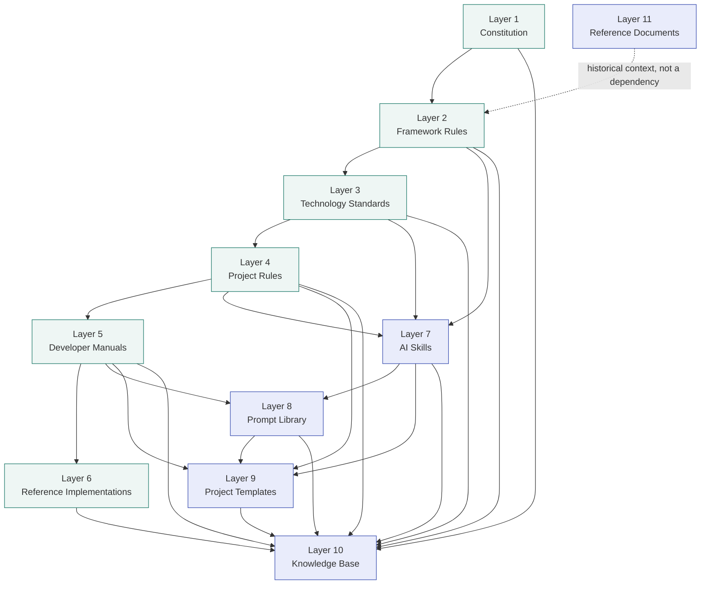

Two properties of this graph are load-bearing:

1. **Layer 10 (Knowledge Base) depends on every other layer but no layer depends on it.** Any layer may produce a decision worth recording, but recording a decision does not itself create new binding rules — it only documents that some governing-layer document was changed.
2. **Layer 11 (Reference Documents) has no forward dependency at all.** It is a dotted, informational edge into Layer 2 only — it explains *why* Layer 2 looks the way it does, but Layer 2 does not depend on Layer 11 for its current validity.

---

## 5. Inheritance Model

Inheritance in this framework means: a lower-numbered layer's rules apply automatically to every higher-numbered layer's artifacts, **without restatement**. A child document that restates a parent rule instead of referencing it has violated the inheritance model and MUST be corrected.

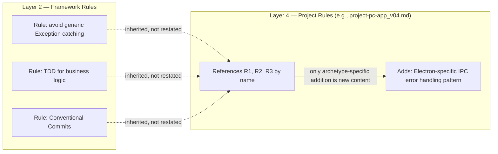

**Inheritance rules:**

- A Project Rule document (Layer 4) MUST open with an explicit statement of which Layer 2 and Layer 3 documents it inherits from, by filename and version.
- A Skill document (Layer 7) MUST populate its `framework-alignment` field (SK-002) with the specific Layer 2/3/4 rules it follows, rather than re-describing those rules inline.
- A Template (Layer 9) MUST inherit its structural requirements from `TEMPLATE_SPEC.md` and, transitively, from the Layer 4 document that specification is built for.
- Duplication across documents at the same layer (e.g., the same SOLID explanation appearing in three separate Layer 4 documents) is a defect. It MUST be moved to Layer 2 and referenced.

---

## 6. Authority Model

Authority answers the question: "when two documents disagree, which one is correct?" Per KA-002, the answer is always determined by layer number, never by document age, length, or perceived completeness.

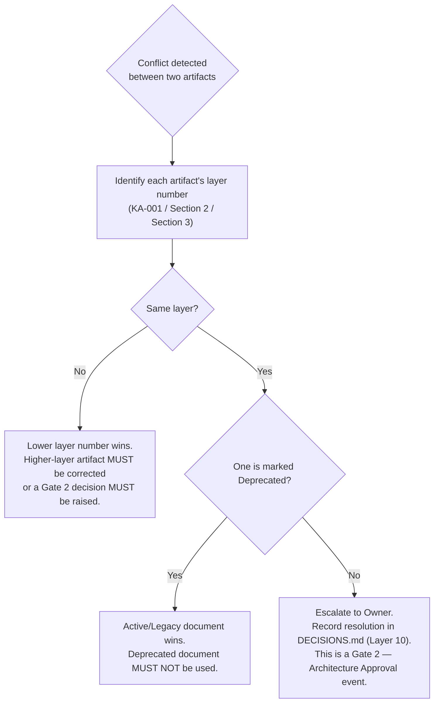

**Binding rule (KA-002):** A Project Rule (Layer 4) cannot override a Framework Rule (Layer 2). An AI Skill (Layer 7) cannot contradict a Technology Standard (Layer 3). This precedence is absolute and admits no exception based on context, urgency, or convenience.

**Operational-layer authority note:** Within Layers 7–11, no operational layer has authority over another — they are peers serving different functions (a Skill does not outrank a Template; a Prompt does not outrank the Knowledge Base). Conflicts between two operational-layer artifacts at the same layer are resolved by Owner escalation exactly as in the same-layer governing case above.

---

## 7. Document Lifecycle

Every framework document, in every layer, carries exactly one of four statuses at all times (DL-001).

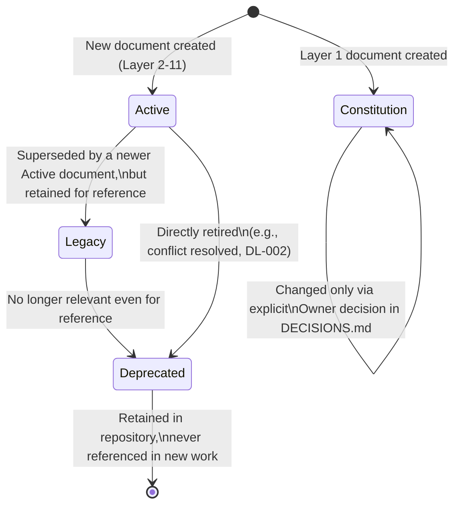

**Status definitions (DL-001):**

| Status | Meaning | MUST / MUST NOT |
|---|---|---|
| `Constitution` | Highest-authority document | MUST be changed only through an explicit Owner decision recorded in `DECISIONS.md` |
| `Active` | Current, authoritative, in use | MUST be the document an AI agent relies on for this topic |
| `Legacy` | Superseded but retained | MUST NOT be treated as authoritative for new work; MAY be consulted for historical pattern reference |
| `Deprecated` | Retired | MUST NOT be referenced in any new work, by human or AI agent |

**Immediate deprecations at v10 freeze (DL-002):** `AI_DEVELOPMENT_PHILOSOPHY` v1.0, both v09 global rules variants, the legacy Korean technology-stack documents, all three legacy `project-pc-app` documents (PyQt-based), all three legacy `project-full-stack` documents, all three legacy `project-monolithic` documents, and `stack_version01.md`.

**Transitional status (DL-003):** `V10_MIGRATION_NOTES.md` (Layer 11) remains `Active` until every Tier 1 and Tier 2 v10 document exists, at which point it transitions to `Deprecated`. This is the only document in the framework with a pre-scheduled, condition-triggered status transition.

---

## 8. Engineering Workflow Architecture

Per correction C-09, every engineering workflow in Framework v10 follows one canonical structural pattern: an alternating sequence of **Workflow Phases** (automated AI execution) and **HITL Gates** (human approval checkpoints).

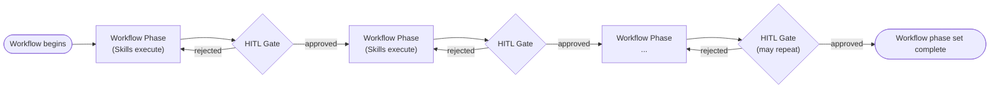

**Structural rules:**

- A **Workflow Phase** is a sequence of one or more Skill executions (Layer 7), bounded by the constraints of the governing layers (Layers 1–6) currently in effect for the project.
- A **HITL Gate** is one of the five canonical positions defined in Section 10. No workflow MAY skip a Gate that a Skill within it has declared via its `gate` field (HE-004).
- This pattern is fully contained within Layer 5 (Developer Manuals). It does not require — and Framework v10 does not introduce — a separate "Engineering Workflow" layer in the Knowledge Architecture (validated in `BLUEPRINT_INPUT_FREEZE.md`, Point 5).
- `PROJECT_BOOTSTRAP_GUIDE.md`, `CONTRIBUTING.md`, and (in v10.1) `AI_DEVELOPMENT_MANUAL.md` are the Layer 5 documents responsible for specifying which Phases and Gates apply to which workflow type (e.g., new-feature workflow vs. bug-fix workflow vs. release workflow).

---

## 9. HITL Workflow Integration

### 9.1 Why Gates Exist

HITL (Human-in-the-Loop) Gates exist because the human operates as Engineering CEO (AA-003): consequential engineering decisions require CEO approval before AI agents are permitted to proceed into the next phase of work (HE-001).

### 9.2 The Five Canonical Gates

Five gate positions are named and frozen for Framework v10 (HE-002). The names and positions are immutable; the technical mechanism by which an agent pauses and resumes at a gate is explicitly deferred (HE-003) and is not specified by this framework version.

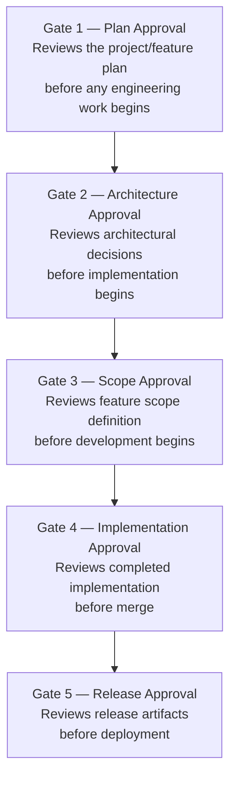

| Gate | Name | Reviews | Blocks |
|---|---|---|---|
| Gate 1 | Plan Approval | Project or feature plan | Any engineering work starting |
| Gate 2 | Architecture Approval | Architectural decisions | Implementation starting |
| Gate 3 | Scope Approval | Feature scope definition | Development starting |
| Gate 4 | Implementation Approval | Completed implementation | Merge |
| Gate 5 | Release Approval | Release artifacts | Deployment |

### 9.3 Binding Skills to Gates

Every Skill document MUST declare, in its required `gate` field (SK-002, HE-004), which of the five canonical gates applies to its output before the next Workflow Phase may begin — or the literal value `none` if the Skill's output requires no human approval before downstream work continues. No runtime enforcement mechanism is implied or required by this declaration in v10; it is binding metadata that a future orchestration layer (or the present-day human CEO) uses to know where to stop and look.

---

## 10. Skill Architecture

### 10.1 Definition

A Skill (Layer 7) is a named, reusable engineering capability executable by a human developer or assignable to an AI agent (SK-001). It is the atomic unit of AI-executable engineering work in Framework v10.

### 10.2 The Skill Manifest

`SKILLS.md` is the required index for Layer 7 (correction C-06). It MUST exist before any individual Skill document is considered discoverable by an AI agent. Each entry in the manifest records: skill name, primary agent role, gate position, a one-line description, and the file path to the full Skill document. An AI agent — and, in a future version, a Planner Agent performing orchestration — reads `SKILLS.md` first, selects candidate Skills by matching `primary-agent-role` (AA-002) against its own role and matching the current Workflow Phase's needs, and only then opens the individual Skill document.

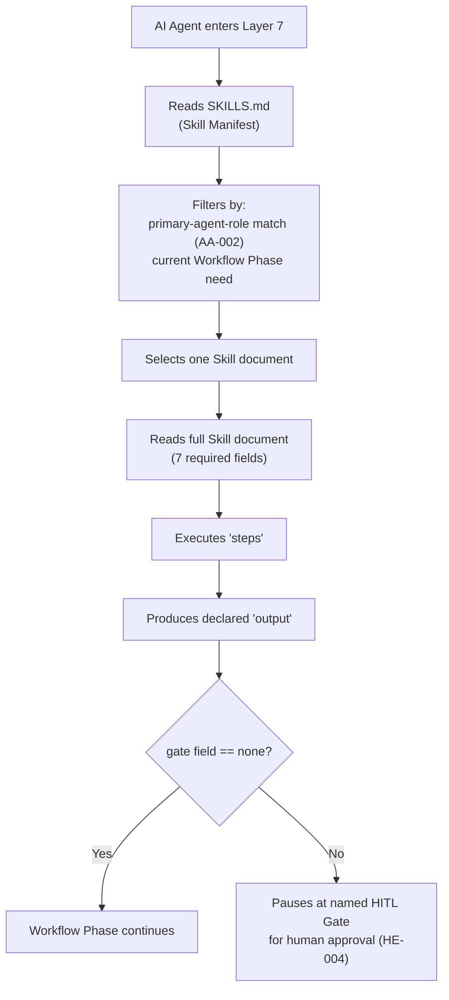

### 10.3 Skill Document Structure

Every Skill document MUST populate all seven of the following fields (SK-002, corrected field count per C-08). A Skill document with any field missing is not valid and MUST NOT be added to the manifest.

| Field | Description |
|---|---|
| `skill-name` | Unique identifier in verb-phrase format (e.g., `review-code`, `generate-tests`) |
| `primary-agent-role` | Exactly one role from the thirteen reserved roles (AA-001) |
| `gate` | The canonical HITL Gate (Section 9.2) this Skill's output requires, or `none` |
| `input` | The information and artifacts the Skill requires to begin |
| `output` | The artifact(s) the Skill produces upon completion |
| `steps` | The ordered procedure the Skill follows |
| `framework-alignment` | The specific Layer 2/3 rules and Layer 4 project context governing this Skill's execution |

### 10.4 Scope Boundary

A Skill executes within exactly one project (SK-003). It MUST NOT perform cross-project operations, MUST NOT modify any document in Layers 1–4, and MUST NOT override an architectural decision. A capability that would require any of these is not a valid Skill design — it is an architectural decision and MUST be escalated to a Gate 2 review and recorded in `DECISIONS.md` instead.

### 10.5 v10 Starter Skills

Three Skills are required for Tier 1 completion (SK-004): `create-feature` (primary role: Backend Agent or Frontend Agent, context-dependent), `review-code` (primary role: Code Review Agent), and `generate-tests` (primary role: Test Agent). The remaining Skills referenced in the framework's broader vision — `refactor-module`, `build-prd`, `update-architecture`, `generate-adr`, `create-release-notes`, `build-docker-environment` — are targets for v10.1 Layer 7 expansion and are not required for v10 completeness.

---

## 11. Prompt Library Architecture

### 11.1 Purpose and Naming

Layer 8 is named **Prompt Library** — the single canonical name across the entire framework (correction C-07, resolving three prior inconsistent names: "AI Prompts," "Prompts," and "AI Prompt Pack"). A Prompt Library entry is the tool-specific invocation wrapper around a Layer 7 Skill.

### 11.2 Relationship to Skills

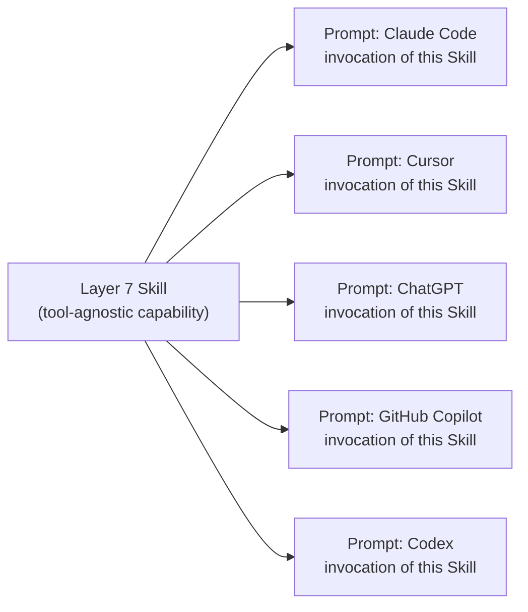

A Prompt document MUST reference the Skill it invokes rather than re-specifying the Skill's logic. If a capability exists only as a Prompt with no corresponding Skill, it is not yet a complete framework artifact — the underlying Skill MUST be authored first.

### 11.3 Tool Independence

No AI tool is named as a required framework dependency at any layer above Layer 8 (correction C-01; see Section 1.4). Tool selection is a developer and project-level decision. Tier 2 completion requires Prompt Library coverage for a minimum of two distinct AI tools, without specifying which two. Tier 3 (v10.1) extends coverage toward the full five-tool set referenced throughout this blueprint (Claude Code, Cursor, ChatGPT, GitHub Copilot, Codex).

---

## 12. Template Architecture

### 12.1 The Specification-First Pattern

Layer 9 follows a specification-first pattern: `TEMPLATE_SPEC.md` MUST exist and be read before any concrete template directory is created or validated (correction C-10). This is the required first artifact in Layer 9, analogous to `SKILLS.md` in Layer 7.

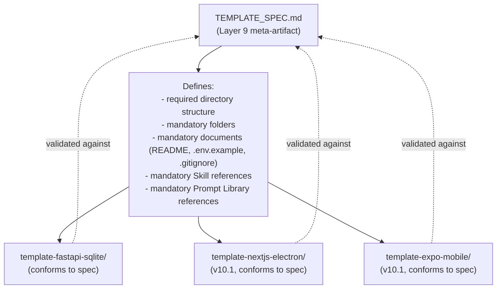

### 12.2 Conformance Requirement

A concrete template directory that does not satisfy every requirement in `TEMPLATE_SPEC.md` is invalid and MUST NOT be placed in Layer 9. This conformance check is a required step in the Project Creation Flow (Section 16).

### 12.3 v10 Scope

`TEMPLATE_SPEC.md` and a single seed template, `template-fastapi-sqlite/`, satisfy the Layer 9 minimum-artifact requirement (KA-004) for v10, resolving the contradiction that would otherwise exist between "full template population deferred to v10.1" and "every operational layer must contain at least one valid artifact" (correction C-05). Full population of the template set across every Layer 4 archetype is a v10.1 objective.

---

## 13. Knowledge Base Architecture (Layer 10 Detail)

While Section 2.10 specifies Layer 10 within the eleven-layer system, this section details its internal architecture, since it is the layer every other layer feeds into.

### 13.1 Two-Document Structure

Layer 10 consists of exactly two documents, each with a distinct function:

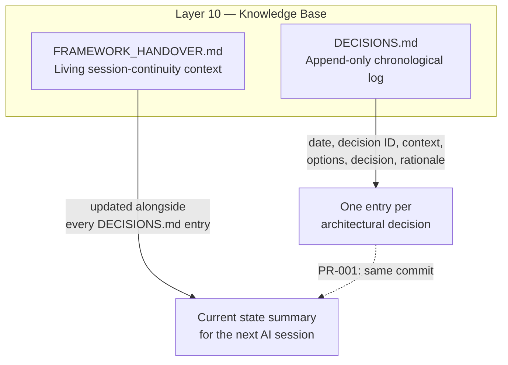

### 13.2 The Append-Only Constraint

`DECISIONS.md` entries are never edited or removed once written. A decision that is later reversed is recorded as a *new* entry that explicitly references the entry it supersedes. This preserves a complete, tamper-evident history of how the framework's architecture evolved — directly analogous to why a version-control system never silently rewrites published history.

### 13.3 Mandatory Co-Update Rule

Per PR-001, any commit that introduces or changes an architectural decision MUST append a `DECISIONS.md` entry in that same commit. This is the mechanism that prevents `FRAMEWORK_HANDOVER.md` (and the framework generally) from drifting silently away from the decisions that have actually been made.

---

## 14. AI Session Initialization Sequence

Every AI agent session that engages with this framework — whether for framework evolution work or for application engineering work — MUST begin with the following read sequence. This is the literal, ordered entry procedure (CC-002).

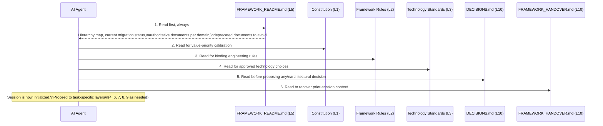

**Rule:** `FRAMEWORK_README.md` is the designated entry point for all AI agent sessions and all new developers (CC-002). No agent should begin substantive work — reading a Project Rule, selecting a Skill, or generating code — before completing this sequence at least once per session.

---

## 15. AI Execution Flow

Once a session is initialized (Section 14) and a specific engineering task is identified, an AI agent follows this execution flow.

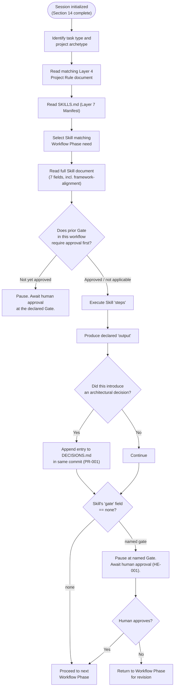

This flow is the operational realization of the tri-level model (Section 1.2): the agent operates entirely within Level 3, consulting Level 2 structures, and pausing for Level 1 (human) approval exactly where the framework declares it must.

---

## 16. Project Creation Flow

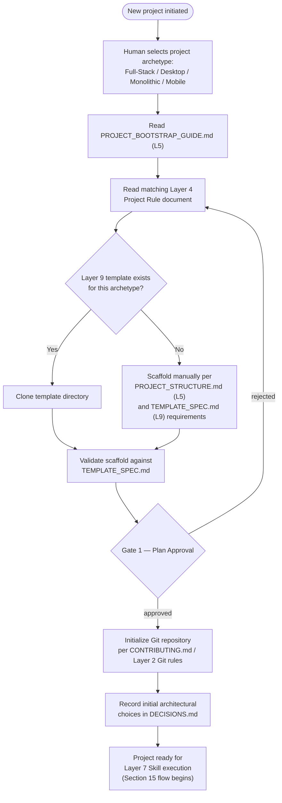

A project is not considered "bootstrapped" until it has passed Gate 1 (Plan Approval) and its scaffold has been validated against the relevant Layer 9 specification (or, where no template yet exists, against `PROJECT_STRUCTURE.md` directly).

---

## 17. Document Generation Order

Documents MUST be generated in an order that respects the Dependency Hierarchy (Section 4): no document may be authored before every layer it depends on already exists, with one necessary exception — `global_rules_revisionfinal_v10.md` itself, which is the framework's first and most urgent gap and therefore the mandatory starting point for all future document-generation work.

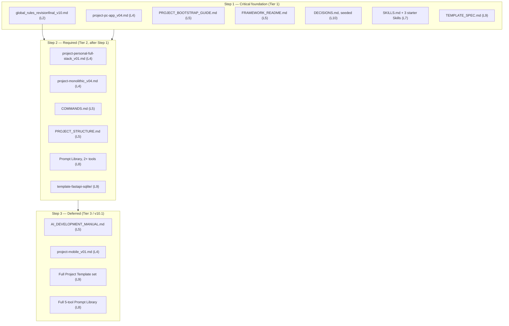

**Ordering rules within Step 1:** `global_rules_revisionfinal_v10.md` (Layer 2) MUST be generated first, since `project-pc-app_v04.md` (Layer 4) inherits from it and cannot be authored correctly beforehand. `FRAMEWORK_README.md` and `PROJECT_BOOTSTRAP_GUIDE.md` (Layer 5) SHOULD be generated immediately after, since they are the documents every subsequent session will read first (Section 14). `SKILLS.md` and its three starter Skills (Layer 7) and `TEMPLATE_SPEC.md` (Layer 9) MAY be generated in parallel with each other once Layer 2 exists, since neither depends on the other.

**Ordering rule for Step 2:** No Tier 2 document generation begins until every Tier 1 document exists (DI-002). This is an explicit completeness gate, not a soft preference.

**Ordering rule for Step 3:** Tier 3 work is formally out of scope for the v10 release and belongs to v10.1 planning. It MUST NOT be pulled forward ahead of Tier 1 or Tier 2 completion.

---

## 18. Framework Evolution Rules

### 18.1 Immutability of Frozen Decisions

Every decision recorded in `BLUEPRINT_INPUT_FREEZE.md` (the 38 architectural decisions and 10 corrections) is frozen as of this blueprint's generation. This blueprint MUST NOT be read as introducing, altering, or reinterpreting any of those decisions — it is a structural transformation of them, nothing more.

### 18.2 How the Framework May Change

A frozen decision MAY only be changed through the following procedure, which is itself a specialization of the general AI Execution Flow (Section 15):

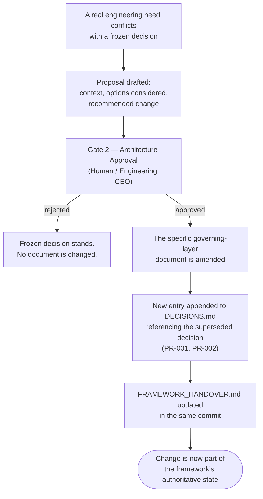

### 18.3 Versioning Philosophy

Framework evolution follows the same priority ordering as every other decision in this system (Constitution, Section 1.4 of `AI_DEVELOPMENT_PHILOSOPHY_v2.0.md`): Maintainability first, trend last. A proposed change MUST be evaluated against whether it reduces or increases long-term maintenance cost before any other consideration. Technology trend alone is never sufficient justification for amending a frozen decision.

### 18.4 v10.1 Scope Boundary

Tier 3 items identified throughout this blueprint (`AI_DEVELOPMENT_MANUAL.md`, `project-mobile_v01.md`, the full Project Template set, the full five-tool Prompt Library) define the complete scope of v10.1. No additional scope MAY be added to v10.1 planning without a Gate 1 (Plan Approval) decision recorded in `DECISIONS.md`. This boundary exists specifically to prevent the same scope-creep pattern that produced the incomplete v09-to-v10 migration this blueprint resolves.

### 18.5 Multi-Agent Extensibility Guarantee

Per FD-003 and validated in `BLUEPRINT_INPUT_FREEZE.md` (Point 10), a future version of this framework MAY introduce multi-agent orchestration without requiring structural changes to the eleven-layer Knowledge Architecture, the named agent roles (AA-001), or the HITL Gate positions (HE-002). The Skill Manifest (`SKILLS.md`, correction C-06) makes Skill discovery a single-read operation rather than a directory scan, which is the specific mechanism that makes this extensibility guarantee true in practice rather than merely aspirational. Any future orchestration design MUST preserve this guarantee or explicitly record, via a Gate 2 decision, why it cannot.

---

## Closing Statement

This blueprint is the immutable master structure from which every future Framework v10 document is generated. It contains eighteen structural sections, eleven fully specified Knowledge Architecture layers, and the complete set of diagrams needed for both a human and an AI agent to navigate the framework without ambiguity. The next action defined by this framework is Step 1 of Section 17: the generation of `global_rules_revisionfinal_v10.md`.
