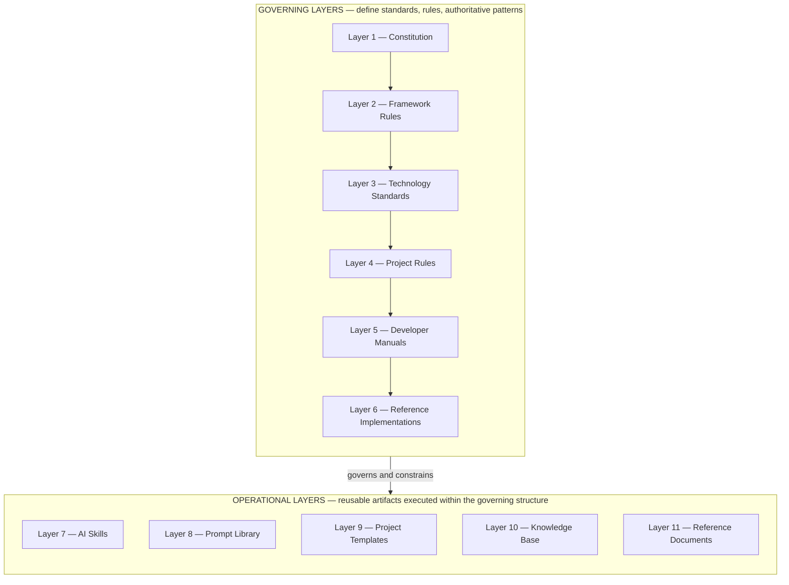
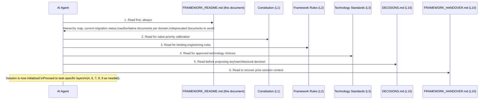
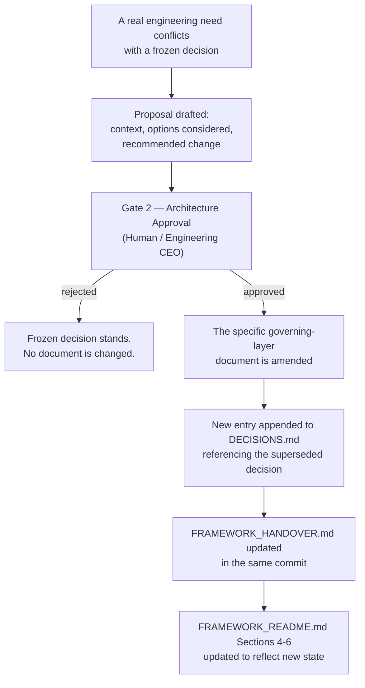

# FRAMEWORK_README.md

**Status:** Active
**Layer:** 5 — Developer Manuals
**Tier:** 1 (Critical)
**Purpose:** Designated entry point for every AI agent session and every new developer entering this framework (CC-002)
**Authority:** Structural derivative of `FRAMEWORK_BLUEPRINT.md`. This document introduces no architectural decision of its own. It reports, in navigable form, the state of the 38 architectural decisions frozen in `BLUEPRINT_INPUT_FREEZE.md` and structured across the eleven Knowledge Architecture layers defined in `FRAMEWORK_BLUEPRINT.md`.
**Read order:** This document MUST be read first, before any other framework document, in every new session (Section 14 of `FRAMEWORK_BLUEPRINT.md`).

---

## 0. Read This First

If you are an AI agent or a developer opening this repository for the first time, stop and read this document in full before opening any other file. It exists specifically so that you do not have to guess which of the many documents in this repository are current, which are historical, and which one governs the question you are trying to answer.

This document answers exactly four questions, per its designated role (CC-002):

1. **What is the shape of the framework?** — Section 2, the Knowledge Architecture hierarchy map.
2. **What state is the framework in right now?** — Section 4, current migration status.
3. **Which document is authoritative for a given topic?** — Section 5, authoritative documents by domain.
4. **Which documents must I ignore?** — Section 6, deprecated documents.

Everything else in this README (Sections 1, 3, 7, 8, 9) exists to make those four answers usable rather than merely listed.

---

## 1. What This Framework Is

This repository is the foundational layer of an **Engineering Operating System (EOS)** for Agentic Software Development. It is not a style guide and it is not a loose collection of best practices. It is the substrate — the knowledge structures, standards, and conventions — that allows a single human, acting as Engineering CEO, to direct AI agents that execute engineering work autonomously and consistently.

The framework operates on three levels that are never collapsed into one another:

| Level | Actor | Responsibility |
|---|---|---|
| 1 — Direction | Human (Engineering CEO) | Defines vision, approves HITL Gates, makes architectural decisions |
| 2 — Structure | Framework (this document set) | Defines knowledge structures, standards, conventions, workflow shape |
| 3 — Execution | AI Agents | Execute engineering work within framework-defined structures |

The framework's success is measured by one criterion: **how little human clarification an AI agent requires to produce correct, consistent output using only framework documents.** A framework that requires constant human re-explanation has failed at its purpose regardless of how many documents it contains. This README is the first and most direct instrument for reducing that clarification burden.

The framework does not yet implement multi-agent orchestration, but every artifact in it — every document, every Skill, every Prompt — is designed so that a future orchestration layer can consume it without requiring structural change. Two mechanisms carry this guarantee: named agent roles attached as metadata to operational artifacts, and named, frozen HITL Gate positions independent of how AI execution technically pauses and resumes.

No specific AI tool, runtime, or vendor (Claude, Cursor, Codex, Gemini, MCP, or any harness implementation) is a component of this framework. These are implementation runtimes that consume framework artifacts. If a document you are reading names a specific tool as a required dependency at the architecture level, that document is in error relative to this framework's runtime-independence principle. Layer 8 (Prompt Library) is the sole, explicit exception to this rule, since naming a specific tool is that layer's designated purpose (Section 1.4 of `FRAMEWORK_BLUEPRINT.md`).

---

## 2. The Knowledge Architecture — Hierarchy Map

The framework is organized into eleven layers. Layers 1–6 are **governing**: they define what is true and what is required. Layers 7–11 are **operational**: they are reusable artifacts that act within the boundaries the governing layers define. Operational layers never override governing layers.

| Layer | Name | Purpose in one line |
|---|---|---|
| 1 | Constitution | The immutable philosophical foundation every other layer inherits from |
| 2 | Framework Rules | Universal, technology-agnostic, RFC-level engineering rules |
| 3 | Technology Standards | The official approved technology stack, with defaults and alternatives |
| 4 | Project Rules | Layers 1–3 applied to a specific application archetype |
| 5 | Developer Manuals | Day-to-day operational guidance connecting a developer/agent to the framework |
| 6 | Reference Implementations | Complete, working, vendor-specific worked examples |
| 7 | AI Skills | Named, reusable, directly-executable engineering capabilities |
| 8 | Prompt Library | Tool-specific invocation wrappers around Layer 7 Skills |
| 9 | Project Templates | Ready-to-clone scaffolds implementing a Layer 4 Project Rule |
| 10 | Knowledge Base | The append-only decision log and living session-continuity context |
| 11 | Reference Documents | Historical/transitional documentation, informational only |

**Authority rule.** A lower-numbered layer always takes precedence over a higher-numbered layer in case of conflict. A Project Rule (Layer 4) cannot override a Framework Rule (Layer 2). An AI Skill (Layer 7) cannot contradict a Technology Standard (Layer 3). This precedence is absolute and admits no exception based on context, urgency, or convenience.

**Completeness rule.** Each operational layer (7–11) MUST contain at least one valid, classified artifact for the framework to be considered complete at any given version. Full population of every layer is incremental and is not a release prerequisite beyond that minimum.

The full specification of each layer — its responsibilities, inputs, outputs, inherited constraints, prohibited responsibilities, and AI interaction model — is defined in `FRAMEWORK_BLUEPRINT.md`, Section 2. This README does not restate that specification; it points to it.

---

## 3. Document Status System

Every framework document, in every layer, carries exactly one of four statuses at all times.

| Status | Meaning | Rule |
|---|---|---|
| `Constitution` | Highest-authority document | MUST be changed only through an explicit Owner decision recorded in `DECISIONS.md` |
| `Active` | Current, authoritative, in use | MUST be the document an AI agent relies on for this topic |
| `Legacy` | Superseded but retained | MUST NOT be treated as authoritative for new work; MAY be consulted for historical pattern reference |
| `Deprecated` | Retired | MUST NOT be referenced in any new work, by human or AI agent |

Every document listed in Sections 4 and 5 below carries one of these four statuses in its own header. If a document's header status disagrees with this README, this README's classification is authoritative until corrected — because this README is regenerated whenever the framework's document set changes, per Section 9.

---

## 4. Current Migration Status

The framework is mid-migration from v09 to v10. This section states, plainly, what exists and what does not. An AI agent MUST treat any document not listed as `Active` in this section as unavailable for new work.

### 4.1 Tier 1 — Critical (framework v10 is not releasable without these)

Every Tier 1 document is now `Active`. Tier 1 is complete.

| Document | Layer | Status |
|---|---|---|
| `AI_DEVELOPMENT_PHILOSOPHY_v2.0.md` | 1 — Constitution | **Active** |
| `global_technology_stack_v10.md` | 3 — Technology Standards | **Active** |
| `FRAMEWORK_BLUEPRINT.md` | 5 — Developer Manuals | **Active** |
| `BLUEPRINT_INPUT_FREEZE.md` | 5 — Developer Manuals | **Active** |
| `FRAMEWORK_README.md` (this document) | 5 — Developer Manuals | **Active** |
| `global_rules_revisionfinal_v10.md` | 2 — Framework Rules | **Active** |
| `project-pc-app_v04.md` (Electron-based) | 4 — Project Rules | **Active** |
| `PROJECT_BOOTSTRAP_GUIDE.md` | 5 — Developer Manuals | **Active** |
| `DECISIONS.md` (seeded) | 10 — Knowledge Base | **Active** |
| `SKILLS.md` + 3 starter Skills (`create-feature`, `review-code`, `generate-tests`) | 7 — AI Skills | **Active** (all four constituent artifacts complete; Layer 7 is `Active` as a whole) |
| `TEMPLATE_SPEC.md` | 9 — Project Templates | **Active** |

### 4.2 Tier 2 — Required (generated only after every Tier 1 document exists)

Five of six Tier 2 items are now `Active`. The sole remaining item, `template-fastapi-sqlite/`, is blocked on an explicit Owner decision — see Section 4.6.

| Document | Layer | Status |
|---|---|---|
| `project-personal-full-stack_v01.md` | 4 — Project Rules | **Active** |
| `project-monolithic_v04.md` | 4 — Project Rules | **Active** |
| `COMMANDS.md` | 5 — Developer Manuals | **Active** |
| `PROJECT_STRUCTURE.md` | 5 — Developer Manuals | **Active** |
| Prompt Library, minimum two AI tools | 8 — Prompt Library | **Active** (`CLAUDE_CODE_PROMPTS.md` and `OPENAI_PROMPTS.md`; Layer 8 is `Active` as a whole) |
| `template-fastapi-sqlite/` (conforming to `TEMPLATE_SPEC.md`) | 9 — Project Templates | **Pending — blocked on an Owner archetype decision (Section 4.6)** |

### 4.3 Tier 3 — Deferred to v10.1 (out of scope for the v10 release)

| Document | Layer |
|---|---|
| `AI_DEVELOPMENT_MANUAL.md` | 5 — Developer Manuals |
| `project-mobile_v01.md` | 4 — Project Rules |
| Full Project Template set (all archetypes) | 9 — Project Templates |
| Full five-tool Prompt Library | 8 — Prompt Library |

No Tier 3 item MAY be pulled forward ahead of Tier 1 or Tier 2 completion without a Gate 1 (Plan Approval) decision recorded in `DECISIONS.md`.

### 4.4 Already-Active Supporting Documents

The following documents exist, are not part of the Tier 1/2/3 generation queue, and are already `Active`:

| Document | Layer |
|---|---|
| `CONTRIBUTING.md` (extended per PR-001) | 5 — Developer Manuals |
| `FRAMEWORK_HANDOVER.md` | 10 — Knowledge Base |
| RAG guide, `chapter1_git.md` through `chapter13_operations.md` | 6 — Reference Implementations |
| `ai-agent-harness-guide.html` | 6 — Reference Implementations |
| `V10_MIGRATION_NOTES.md` | 11 — Reference Documents (transitional — see Section 4.5) |

### 4.5 Transitional Document

`V10_MIGRATION_NOTES.md` remains `Active` until every Tier 1 and every Tier 2 document above exists. Tier 1 is now fully complete (Section 4.1), but Tier 2 is not — `template-fastapi-sqlite/` remains `Pending` (Section 4.2). `V10_MIGRATION_NOTES.md` therefore **remains `Active`**, per its own lifecycle rule, until that final Tier 2 item is generated. At that point it transitions to `Deprecated` automatically. Until that transition occurs, it is the authoritative conflict-resolution bridge between v09 and v10 rules for any question this README does not directly resolve — though, with every governing layer (1–6) and Layer 7–8 now fully `Active`, the range of questions still requiring that bridge has narrowed substantially since the framework's earlier, less-complete state.

### 4.6 Current Priority

Every Tier 1 document is complete, and five of six Tier 2 documents are complete. The framework's single standing gap is the generation of **`template-fastapi-sqlite/`** (Layer 9, Tier 2) — the concrete seed template that, together with `TEMPLATE_SPEC.md` (already `Active`), satisfies the Layer 9 minimum-artifact requirement (KA-004) in full.

That generation is currently blocked, not by any missing governing-layer document, but by an **explicit, unresolved archetype-selection question**: two `Active` Layer 4 archetype documents — `project-personal-full-stack_v01.md` (Full-Stack) and `project-monolithic_v04.md` (Monolithic) — are both capable of hosting a FastAPI + SQLite project, and neither `TEMPLATE_SPEC.md` nor `PROJECT_STRUCTURE.md` states which one `template-fastapi-sqlite/` is intended to target. Per `TEMPLATE_SPEC.md`, Section 5, Rule 1, a concrete template's directory structure MUST conform to exactly one Layer 4 archetype document, and per `PROJECT_BOOTSTRAP_GUIDE.md`, Section 4.1, archetype selection is a Level 1 (human Engineering CEO) decision that an AI agent MUST NOT make on the human's behalf.

An AI agent asked to perform framework-evolution work, absent other direction, SHOULD treat **securing the Owner's explicit confirmation of which archetype `template-fastapi-sqlite/` targets** as the standing priority. It MUST NOT infer or assume an answer and proceed with template generation in the meantime. Once that confirmation is given, it becomes this framework's next recorded architectural decision (`DECISIONS.md`, entry `DEC-010`), and `template-fastapi-sqlite/`'s generation may proceed without further blockers — every other prerequisite category (`TEMPLATE_SPEC.md`'s Categories 1 through 5) is already fully satisfiable.

---

## 5. Authoritative Documents by Domain

This table is the practical answer to "which document governs this question." Read it as: for the domain in the left column, the document in the right column is authoritative. Where the right column still says "Pending," no authoritative document yet exists for that domain, and any answer must be escalated to a Gate 2 (Architecture Approval) decision rather than improvised.

| Domain | Authoritative Document | Layer | Status |
|---|---|---|---|
| Core values, AI-First principle, database/vendor philosophy | `AI_DEVELOPMENT_PHILOSOPHY_v2.0.md` | 1 | Active |
| Universal engineering rules (SOLID, Git, TDD boundary, vendor independence) | `global_rules_revisionfinal_v10.md` | 2 | Active |
| Approved technology stack, defaults and alternatives | `global_technology_stack_v10.md` | 3 | Active |
| Desktop application structure (Electron) | `project-pc-app_v04.md` | 4 | Active |
| Full-stack application structure | `project-personal-full-stack_v01.md` | 4 | Active |
| Monolithic application structure | `project-monolithic_v04.md` | 4 | Active |
| Mobile application structure | `project-mobile_v01.md` | 4 | Pending (Tier 3 / v10.1) |
| Framework structural architecture, layer definitions, dependency/authority model | `FRAMEWORK_BLUEPRINT.md` | 5 | Active |
| Frozen architectural decisions (source input to the blueprint) | `BLUEPRINT_INPUT_FREEZE.md` | 5 | Active |
| Session entry point (this document) | `FRAMEWORK_README.md` | 5 | Active |
| New-project bootstrap procedure | `PROJECT_BOOTSTRAP_GUIDE.md` | 5 | Active |
| Commit and Pull Request procedure | `CONTRIBUTING.md` | 5 | Active |
| Canonical command reference | `COMMANDS.md` | 5 | Active |
| Canonical directory structure reference | `PROJECT_STRUCTURE.md` | 5 | Active |
| Comprehensive AI-agent operational manual | `AI_DEVELOPMENT_MANUAL.md` | 5 | Pending (Tier 3 / v10.1) |
| Worked RAG/local-LLM implementation example | RAG chapters 1–13 | 6 | Active (Reference Implementation only — not binding) |
| Worked AI-agent harness example | `ai-agent-harness-guide.html` | 6 | Active (Reference Implementation only — not binding) |
| Skill discovery index | `SKILLS.md` | 7 | Active |
| Individual Skill definitions | `skill-create-feature.md`, `skill-review-code.md`, `skill-generate-tests.md` | 7 | Active |
| Tool-specific prompt invocations | `CLAUDE_CODE_PROMPTS.md` (Claude Code), `OPENAI_PROMPTS.md` (OpenAI) | 8 | Active |
| Project template structural requirements | `TEMPLATE_SPEC.md` | 9 | Active |
| Concrete FastAPI + SQLite scaffold | `template-fastapi-sqlite/` | 9 | **Pending — blocked on an Owner archetype decision (Section 4.6)** |
| Architectural decision history | `DECISIONS.md` | 10 | Active |
| Session-continuity context | `FRAMEWORK_HANDOVER.md` | 10 | Active |
| v09→v10 transition rationale | `V10_MIGRATION_NOTES.md` | 11 | Active (transitional — see Section 4.5) |

Where this table says a document is "Pending," no other document in the repository MAY be treated as a substitute source of authority for that domain, including any legacy v09 document that historically covered the same topic. Legacy coverage of a domain does not confer authority once that domain's Layer 2–4 document is designated in this framework; it only means the domain is a known gap (see Section 4).

---

## 6. Deprecated Documents — Do Not Reference

The following documents are `Deprecated` as of the v10 freeze. They MUST NOT be read as authoritative for any new engineering work, whether performed by a human or an AI agent. They are retained in the repository for historical traceability only.

| Document | Superseded by |
|---|---|
| `AI_DEVELOPMENT_PHILOSOPHY.md` (v1.0) | `AI_DEVELOPMENT_PHILOSOPHY_v2.0.md` |
| `global_rules_revisionfinal_v09_(Source of Truth).md` | `global_rules_revisionfinal_v10.md` (Active) |
| `global_rules_revisionfinal_v09_(prompt).md` | `global_rules_revisionfinal_v10.md` (Active) |
| `global규칙_기술스택_v02.txt` | `global_technology_stack_v10.md` |
| `project-pc-app_v03.md` | `project-pc-app_v04.md` (Active) |
| `project-pc-app_기술스택_v03.txt` | `project-pc-app_v04.md` (Active) |
| `project-pc-app_prompt_v04.md` | `project-pc-app_v04.md` (Active) |
| `project-full-stack_v04.md` | `project-personal-full-stack_v01.md` (Active) |
| `project-full-stack_기술스택_v04.txt` | `project-personal-full-stack_v01.md` (Active) |
| `project-full-stack_prompt_v04.md` | `project-personal-full-stack_v01.md` (Active) |
| `project-monolithic_v03.md` | `project-monolithic_v04.md` (Active) |
| `project-monolithic_기술스택_v03.txt` | `project-monolithic_v04.md` (Active) |
| `project-monolithic_prompt_v04.md` | `project-monolithic_v04.md` (Active) |
| `stack_version01.md` | `global_technology_stack_v10.md` |

Two consequences follow directly from this table and MUST be honored by any agent working in this repository:

1. **PyQt/PySide/PyInstaller/Inno Setup are not valid choices for new desktop work.** `project-pc-app_v03.md` and its companions are deprecated. Electron is the standing decision, and `project-pc-app_v04.md` is now `Active` and fully load-bearing (Section 4.1).
2. **npm/yarn as *required* package managers, and Recoil as an approved state-management option, are not valid** per the deprecated `project-full-stack_v04.md`. `global_technology_stack_v10.md` (Active, Layer 3) governs these choices — pnpm and Zustand — and this is now independently confirmed by both `Active` archetype documents that apply it (`project-pc-app_v04.md`, Section 8; `project-personal-full-stack_v01.md`, Section 8; `project-monolithic_v04.md`, Section 8).

---

## 7. AI Session Initialization Sequence

Every AI agent session that engages with this framework — whether for framework evolution or for application engineering — MUST begin with the following read sequence.

Applied to the framework's current state (Section 4), this sequence now resolves fully at every step:

| Step | Document | Current availability |
|---|---|---|
| 1 | `FRAMEWORK_README.md` | Read as normal — this document |
| 2 | `AI_DEVELOPMENT_PHILOSOPHY_v2.0.md` | Read as normal — Active |
| 3 | `global_rules_revisionfinal_v10.md` | Read as normal — **Active**. No fallback to `V10_MIGRATION_NOTES.md` is required for any question this document resolves (`global_rules_revisionfinal_v10.md`, Section 13.3). |
| 4 | `global_technology_stack_v10.md` | Read as normal — Active |
| 5 | `DECISIONS.md` | Read as normal — **Active** (seeded). Note the honestly-flagged known gap in its own Section 4.2 (`TD-001`, `TD-003`, `TD-004`, `TD-005`, the `LP-` series) — these identifiers remain traceable only to `BLUEPRINT_INPUT_FREEZE.md` until transcribed. This gap does not block ordinary session initialization; it only means those specific identifiers cannot yet be looked up through `DECISIONS.md` itself. |
| 6 | `FRAMEWORK_HANDOVER.md` | Read as normal — Active |

No agent SHOULD begin substantive work — reading a Project Rule document, selecting a Skill, or generating application code — before completing this sequence at least once per session.

---

## 8. Where to Go Next

Once session initialization (Section 7) is complete, route to the correct downstream document based on the task at hand. Each of the following is a pointer, not a restatement — the full procedure lives in `FRAMEWORK_BLUEPRINT.md`.

| Your task | Go to |
|---|---|
| Starting a new engineering task inside an existing project | `FRAMEWORK_BLUEPRINT.md`, Section 15 — AI Execution Flow |
| Bootstrapping a brand-new project | `FRAMEWORK_BLUEPRINT.md`, Section 16 — Project Creation Flow, together with `PROJECT_BOOTSTRAP_GUIDE.md` |
| Discovering what reusable capability exists for a task | `SKILLS.md`, per `FRAMEWORK_BLUEPRINT.md` Section 10 — the manifest and all three Tier 1 Skill documents are `Active` |
| Invoking a Skill through a specific AI tool | `CLAUDE_CODE_PROMPTS.md` or `OPENAI_PROMPTS.md`, per `FRAMEWORK_BLUEPRINT.md` Section 11 |
| Understanding which HITL Gate applies to your current output | `FRAMEWORK_BLUEPRINT.md`, Section 9 — HITL Workflow Integration |
| Looking up canonical command syntax or directory structure | `COMMANDS.md` and `PROJECT_STRUCTURE.md` |
| Proposing a change to a frozen architectural decision | Section 9 of this document, below |
| Understanding *why* a legacy document was deprecated | `V10_MIGRATION_NOTES.md` (Layer 11, transitional) |
| Committing code or opening a Pull Request | `CONTRIBUTING.md` |

---

## 9. How the Framework Changes

Every decision recorded in `BLUEPRINT_INPUT_FREEZE.md` is frozen. None of it may be altered by silently editing a document. The only valid path to change is:

Two rules govern this process without exception:

1. **Maintainability outranks trend.** A proposed change MUST be evaluated against whether it reduces or increases long-term maintenance cost before any other consideration. Technology trend alone is never sufficient justification for amending a frozen decision.
2. **This README is a mirror, not a source.** Sections 4, 5, and 6 of this document exist to report the state of the document set as it changes. Whenever a Tier 1 or Tier 2 document is generated, whenever a document's status transitions, or whenever a new document is deprecated, this README MUST be updated in the same change so that Section 4's "Pending" markers and Section 6's deprecation list remain accurate. An out-of-date `FRAMEWORK_README.md` is a framework defect, because every session depends on it being correct.

This revision itself is an exercise of Rule 2: it brings Sections 4–7 back into agreement with the framework's actual, current state — resolving the accumulated synchronization gaps `FRAMEWORK_STATUS.md` had been tracking as Flags 1, 2, 4, 7, 8, 9, 11, 12, and 14, and narrowing Flag 10 to the single, explicit open question stated in Section 4.6. It records no new architectural decision of its own, consistent with this document's own Authority statement above.

---

## Closing Statement

This document is the fixed starting point for every session that touches this framework, human or AI. It resolves the four questions a new session cannot safely proceed without answering: what the framework's shape is, what state it is currently in, which document governs which domain, and which documents are no longer valid. Every other question belongs to a more specific document reachable from Sections 5 and 8 above. As of this revision, every governing layer (1–6) is fully `Active`, and both Layer 7 (AI Skills) and Layer 8 (Prompt Library) are `Active` as a whole. The framework's single standing priority is no longer a missing governing document — it is securing the Owner's explicit archetype confirmation (Section 4.6) so that `template-fastapi-sqlite/`, the framework's last outstanding Tier 2 artifact, can be generated and Layer 9 brought to full completion.
