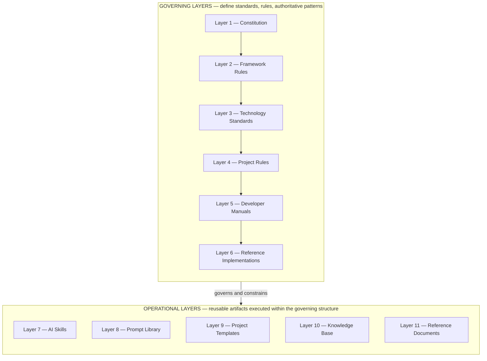
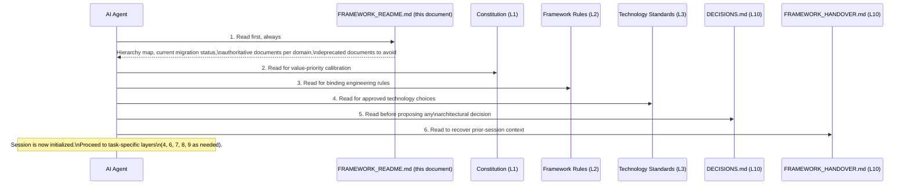
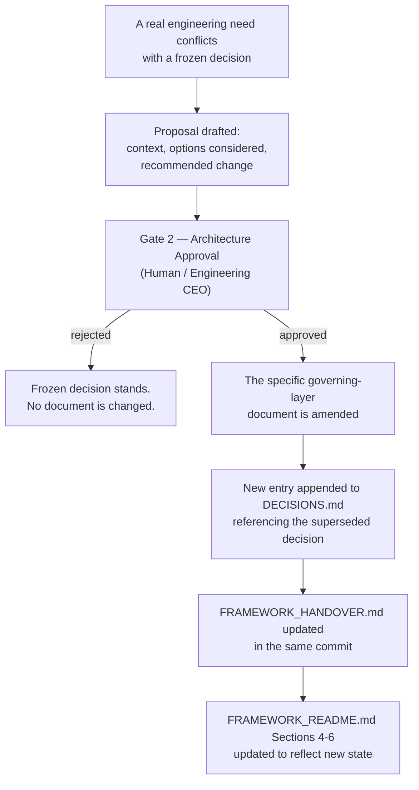

# FRAMEWORK_README.md

**Status:** Active
**Layer:** 5 — Developer Manuals
**Tier:** 1 (Critical)
**Purpose:** Designated entry point for every AI agent session and every new developer entering this framework (CC-002)
**Authority:** Structural derivative of `FRAMEWORK_BLUEPRINT.md`. This document introduces no architectural decision of its own. It reports, in navigable form, the state of the 38 architectural decisions frozen in `BLUEPRINT_INPUT_FREEZE.md` and structured across the eleven Knowledge Architecture layers defined in `FRAMEWORK_BLUEPRINT.md`.
**Read order:** This document MUST be read first, before any other framework document, in every new session (Section 14 of `FRAMEWORK_BLUEPRINT.md`).

---

## 0. Read This First

If you are an AI agent or a developer opening this repository for the first time, stop and read this document in full before opening any other file. It exists specifically so that you do not have to guess which of the many documents in this repository are current, which are historical, and which one governs the question you are trying to answer.

This document answers exactly four questions, per its designated role (CC-002):

1. **What is the shape of the framework?** — Section 2, the Knowledge Architecture hierarchy map.
2. **What state is the framework in right now?** — Section 4, current migration status.
3. **Which document is authoritative for a given topic?** — Section 5, authoritative documents by domain.
4. **Which documents must I ignore?** — Section 6, deprecated documents.

Everything else in this README (Sections 1, 3, 7, 8, 9) exists to make those four answers usable rather than merely listed.

---

## 1. What This Framework Is

This repository is the foundational layer of an **Engineering Operating System (EOS)** for Agentic Software Development. It is not a style guide and it is not a loose collection of best practices. It is the substrate — the knowledge structures, standards, and conventions — that allows a single human, acting as Engineering CEO, to direct AI agents that execute engineering work autonomously and consistently.

The framework operates on three levels that are never collapsed into one another:

| Level | Actor | Responsibility |
|---|---|---|
| 1 — Direction | Human (Engineering CEO) | Defines vision, approves HITL Gates, makes architectural decisions |
| 2 — Structure | Framework (this document set) | Defines knowledge structures, standards, conventions, workflow shape |
| 3 — Execution | AI Agents | Execute engineering work within framework-defined structures |

The framework's success is measured by one criterion: **how little human clarification an AI agent requires to produce correct, consistent output using only framework documents.** A framework that requires constant human re-explanation has failed at its purpose regardless of how many documents it contains. This README is the first and most direct instrument for reducing that clarification burden.

The framework does not yet implement multi-agent orchestration, but every artifact in it — every document, every Skill, every Prompt — is designed so that a future orchestration layer can consume it without requiring structural change. Two mechanisms carry this guarantee: named agent roles attached as metadata to operational artifacts, and named, frozen HITL Gate positions independent of how AI execution technically pauses and resumes.

No specific AI tool, runtime, or vendor (Claude, Cursor, Codex, Gemini, MCP, or any harness implementation) is a component of this framework. These are implementation runtimes that consume framework artifacts. If a document you are reading names a specific tool as a required dependency at the architecture level, that document is in error relative to this framework's runtime-independence principle. Layer 8 (Prompt Library) is the sole, explicit exception to this rule, since naming a specific tool is that layer's designated purpose (Section 1.4 of `FRAMEWORK_BLUEPRINT.md`).

---

## 2. The Knowledge Architecture — Hierarchy Map

The framework is organized into eleven layers. Layers 1–6 are **governing**: they define what is true and what is required. Layers 7–11 are **operational**: they are reusable artifacts that act within the boundaries the governing layers define. Operational layers never override governing layers.

| Layer | Name | Purpose in one line |
|---|---|---|
| 1 | Constitution | The immutable philosophical foundation every other layer inherits from |
| 2 | Framework Rules | Universal, technology-agnostic, RFC-level engineering rules |
| 3 | Technology Standards | The official approved technology stack, with defaults and alternatives |
| 4 | Project Rules | Layers 1–3 applied to a specific application archetype |
| 5 | Developer Manuals | Day-to-day operational guidance connecting a developer/agent to the framework |
| 6 | Reference Implementations | Complete, working, vendor-specific worked examples |
| 7 | AI Skills | Named, reusable, directly-executable engineering capabilities |
| 8 | Prompt Library | Tool-specific invocation wrappers around Layer 7 Skills |
| 9 | Project Templates | Ready-to-clone scaffolds implementing a Layer 4 Project Rule |
| 10 | Knowledge Base | The append-only decision log and living session-continuity context |
| 11 | Reference Documents | Historical/transitional documentation, informational only |

**Authority rule.** A lower-numbered layer always takes precedence over a higher-numbered layer in case of conflict. A Project Rule (Layer 4) cannot override a Framework Rule (Layer 2). An AI Skill (Layer 7) cannot contradict a Technology Standard (Layer 3). This precedence is absolute and admits no exception based on context, urgency, or convenience.

**Completeness rule.** Each operational layer (7–11) MUST contain at least one valid, classified artifact for the framework to be considered complete at any given version. Full population of every layer is incremental and is not a release prerequisite beyond that minimum.

The full specification of each layer — its responsibilities, inputs, outputs, inherited constraints, prohibited responsibilities, and AI interaction model — is defined in `FRAMEWORK_BLUEPRINT.md`, Section 2. This README does not restate that specification; it points to it.

---

## 3. Document Status System

Every framework document, in every layer, carries exactly one of four statuses at all times.

| Status | Meaning | Rule |
|---|---|---|
| `Constitution` | Highest-authority document | MUST be changed only through an explicit Owner decision recorded in `DECISIONS.md` |
| `Active` | Current, authoritative, in use | MUST be the document an AI agent relies on for this topic |
| `Legacy` | Superseded but retained | MUST NOT be treated as authoritative for new work; MAY be consulted for historical pattern reference |
| `Deprecated` | Retired | MUST NOT be referenced in any new work, by human or AI agent |

Every document listed in Sections 4 and 5 below carries one of these four statuses in its own header. If a document's header status disagrees with this README, this README's classification is authoritative until corrected — because this README is regenerated whenever the framework's document set changes, per Section 9.

A document does not need to be *superseded by a named replacement* to become `Deprecated`. A document MAY also transition to `Deprecated` because a condition its own status header pre-declares has been met — `V10_MIGRATION_NOTES.md` is exactly this case (DL-003; Section 4.5, Section 6, below).

---

## 4. Current Migration Status

**Framework v10 (Tier 1 and Tier 2) is now fully complete.** Every governing layer (1–6) is `Active`, and every v10-scoped operational layer (7, 8, 9, 10) is `Active` as a whole. The v09→v10 migration this section previously tracked as "mid-migration" has concluded in substance: `V10_MIGRATION_NOTES.md` (Layer 11), which existed specifically to bridge v09-to-v10 conflicts until v10's own Tier 1 and Tier 2 documents existed, has now met its own pre-declared retirement condition and transitioned to `Deprecated` (Section 4.5). The framework's current work is a single, explicitly Owner-approved v10.1 item pulled forward ahead of the rest of that scope (Section 4.6) — v10.1 as a whole remains a separate, largely deferred body of work.

This section states, plainly, what exists and what does not. An AI agent MUST treat any document not listed as `Active` in this section as unavailable for new work.

### 4.1 Tier 1 — Critical (framework v10 is not releasable without these)

Every Tier 1 document is `Active`. Tier 1 is complete.

| Document | Layer | Status |
|---|---|---|
| `AI_DEVELOPMENT_PHILOSOPHY_v2.0.md` | 1 — Constitution | **Active** |
| `global_technology_stack_v10.md` | 3 — Technology Standards | **Active** |
| `FRAMEWORK_BLUEPRINT.md` | 5 — Developer Manuals | **Active** |
| `BLUEPRINT_INPUT_FREEZE.md` | 5 — Developer Manuals | **Active** |
| `FRAMEWORK_README.md` (this document) | 5 — Developer Manuals | **Active** |
| `global_rules_revisionfinal_v10.md` | 2 — Framework Rules | **Active** |
| `project-pc-app_v04.md` (Electron-based) | 4 — Project Rules | **Active** |
| `PROJECT_BOOTSTRAP_GUIDE.md` | 5 — Developer Manuals | **Active** |
| `DECISIONS.md` (seeded) | 10 — Knowledge Base | **Active** |
| `SKILLS.md` + 3 starter Skills (`create-feature`, `review-code`, `generate-tests`) | 7 — AI Skills | **Active** (all four constituent artifacts complete; Layer 7 is `Active` as a whole) |
| `TEMPLATE_SPEC.md` | 9 — Project Templates | **Active** |

### 4.2 Tier 2 — Required (generated only after every Tier 1 document exists)

**All six Tier 2 items are now `Active`. Tier 2 is complete.** The final item, `template-fastapi-sqlite/`, was generated once the Owner resolved which of the two capable Layer 4 archetypes it targets — `project-personal-full-stack_v01.md` (Full-Stack), confirmed and recorded as `DECISIONS.md` entry `DEC-010`.

| Document | Layer | Status |
|---|---|---|
| `project-personal-full-stack_v01.md` | 4 — Project Rules | **Active** |
| `project-monolithic_v04.md` | 4 — Project Rules | **Active** |
| `COMMANDS.md` | 5 — Developer Manuals | **Active** |
| `PROJECT_STRUCTURE.md` | 5 — Developer Manuals | **Active** |
| Prompt Library, minimum two AI tools | 8 — Prompt Library | **Active** (`CLAUDE_CODE_PROMPTS.md` and `OPENAI_PROMPTS.md`; Layer 8 is `Active` as a whole) |
| `template-fastapi-sqlite/` (conforming to `TEMPLATE_SPEC.md` and `project-personal-full-stack_v01.md`, per `DEC-010`) | 9 — Project Templates | **Active** (Layer 9 is `Active` as a whole, satisfying KA-004 in full) |

With this table complete, **Framework v10, Tier 1 and Tier 2 combined, has no outstanding item.**

### 4.3 Tier 3 — v10.1 (one item pulled forward; the remainder still deferred)

| Document | Layer | Status |
|---|---|---|
| `project-mobile_v01.md` | 4 — Project Rules | **In progress — approved pull-forward (see below)** |
| `AI_DEVELOPMENT_MANUAL.md` | 5 — Developer Manuals | Deferred |
| Full Project Template set (all archetypes beyond `template-fastapi-sqlite/`) | 9 — Project Templates | Deferred |
| Full five-tool Prompt Library (beyond Claude Code and OpenAI) | 8 — Prompt Library | Deferred |

Per `FRAMEWORK_BLUEPRINT.md`, Section 18.4, no Tier 3 item may be pulled forward ahead of Tier 1 or Tier 2 completion without a Gate 1 (Plan Approval) decision recorded in `DECISIONS.md`. Tier 1 and Tier 2 are now both complete (Sections 4.1–4.2), and the Owner has given exactly such a Gate 1 decision for `project-mobile_v01.md` specifically — recorded as `DECISIONS.md` entry `DEC-011` — so that document alone is now in progress, ahead of the rest of v10.1 scope. `AI_DEVELOPMENT_MANUAL.md`, the remaining Project Template set, and the remaining Prompt Library coverage remain deferred and untouched by this approval; pulling any of them forward would require its own, separate Gate 1 event.

### 4.4 Already-Active Supporting Documents

The following documents exist, are not part of the Tier 1/2/3 generation queue, and are `Active`:

| Document | Layer |
|---|---|
| `CONTRIBUTING.md` (extended per PR-001) | 5 — Developer Manuals |
| `FRAMEWORK_HANDOVER.md` | 10 — Knowledge Base |
| RAG guide, `chapter1_git.md` through `chapter13_operations.md` | 6 — Reference Implementations |
| `ai-agent-harness-guide.html` | 6 — Reference Implementations |

`V10_MIGRATION_NOTES.md`, previously listed here as `Active (transitional)`, is no longer `Active` — see Section 4.5.

### 4.5 `V10_MIGRATION_NOTES.md` — Now `Deprecated` (DL-003 Triggered)

Per `FRAMEWORK_BLUEPRINT.md`, Sections 2.11 and 7 (DL-003): *"`V10_MIGRATION_NOTES.md` (Layer 11) remains `Active` until every Tier 1 and Tier 2 v10 document exists, at which point it transitions to `Deprecated`."* With `template-fastapi-sqlite/`'s completion (Section 4.2), every Tier 1 and Tier 2 v10 document now exists. **`V10_MIGRATION_NOTES.md` therefore transitions from `Active` to `Deprecated` as of this revision.**

This is a status transition mechanically determined by an already-frozen, pre-scheduled condition — not a new architectural decision, in the same sense Layer 7's and Layer 8's earlier transitions to `Active` were not new decisions. It is also the only document in the framework whose deprecation is triggered by a completeness condition rather than by direct supersession (DL-002); the two other rows in Section 6, below, cover the ordinary case.

`V10_MIGRATION_NOTES.md` remains in the repository for historical traceability of the v09→v10 transition rationale, per the ordinary `Deprecated` rule (Section 3, above): it MUST NOT be referenced in any new work, and it MUST NOT be treated as a conflict-resolution bridge going forward. That bridging role has ended — every governing-layer document it existed to stand in for is now itself `Active`, so any future conflict between two documents is resolved directly through the ordinary Authority Model (`FRAMEWORK_BLUEPRINT.md`, Section 6), with no fallback to this document required or permitted.

### 4.6 Current Priority

Framework v10 (Tier 1 and Tier 2) is complete in full (Sections 4.1–4.2). The framework's current priority is generating **`project-mobile_v01.md`** (Layer 4, Mobile Application archetype) — the single v10.1 item the Owner has explicitly approved pulling forward, per the Gate 1 decision recorded as `DECISIONS.md` entry `DEC-011`.

This is a narrow, explicitly bounded pull-forward, not a general resumption of v10.1 work: `AI_DEVELOPMENT_MANUAL.md`, the remaining Layer 9 template set, and the remaining Layer 8 tool coverage all remain deferred (Section 4.3) and are untouched by this approval. Generating `project-mobile_v01.md` now does not imply, and MUST NOT be read as implying, that the rest of v10.1 has also been pulled forward.

No architectural redesign is implied by this generation. The document's content is already substantially determined by rules frozen at Layers 1–3 — most directly, the confirmed Mobile default of React Native + Expo (`global_technology_stack_v10.md`, Section 3) — combined with Layer 4's own designated responsibility to define directory layout and naming convention for the archetype (`FRAMEWORK_BLUEPRINT.md`, Section 2.4), exactly as already exercised for the Desktop, Full-Stack, and Monolithic archetypes. Only the position of this one document in the overall generation queue has moved; nothing about what it will say has been decided ahead of its own generation.

---

## 5. Authoritative Documents by Domain

This table is the practical answer to "which document governs this question." Read it as: for the domain in the left column, the document in the right column is authoritative. Where the right column says "Pending," no authoritative document yet exists for that domain, and any answer must be escalated to a Gate 2 (Architecture Approval) decision rather than improvised.

| Domain | Authoritative Document | Layer | Status |
|---|---|---|---|
| Core values, AI-First principle, database/vendor philosophy | `AI_DEVELOPMENT_PHILOSOPHY_v2.0.md` | 1 | Active |
| Universal engineering rules (SOLID, Git, TDD boundary, vendor independence) | `global_rules_revisionfinal_v10.md` | 2 | Active |
| Approved technology stack, defaults and alternatives | `global_technology_stack_v10.md` | 3 | Active |
| Desktop application structure (Electron) | `project-pc-app_v04.md` | 4 | Active |
| Full-stack application structure | `project-personal-full-stack_v01.md` | 4 | Active |
| Monolithic application structure | `project-monolithic_v04.md` | 4 | Active |
| Mobile application structure | `project-mobile_v01.md` | 4 | **Pending — in progress (approved v10.1 pull-forward, `DEC-011`; see Section 4.6)** |
| Framework structural architecture, layer definitions, dependency/authority model | `FRAMEWORK_BLUEPRINT.md` | 5 | Active |
| Frozen architectural decisions (source input to the blueprint) | `BLUEPRINT_INPUT_FREEZE.md` | 5 | Active |
| Session entry point (this document) | `FRAMEWORK_README.md` | 5 | Active |
| New-project bootstrap procedure | `PROJECT_BOOTSTRAP_GUIDE.md` | 5 | Active |
| Commit and Pull Request procedure | `CONTRIBUTING.md` | 5 | Active |
| Canonical command reference | `COMMANDS.md` | 5 | Active |
| Canonical directory structure reference | `PROJECT_STRUCTURE.md` | 5 | Active |
| Comprehensive AI-agent operational manual | `AI_DEVELOPMENT_MANUAL.md` | 5 | Pending (Tier 3 / v10.1, deferred) |
| Worked RAG/local-LLM implementation example | RAG chapters 1–13 | 6 | Active (Reference Implementation only — not binding) |
| Worked AI-agent harness example | `ai-agent-harness-guide.html` | 6 | Active (Reference Implementation only — not binding) |
| Skill discovery index | `SKILLS.md` | 7 | Active |
| Individual Skill definitions | `skill-create-feature.md`, `skill-review-code.md`, `skill-generate-tests.md` | 7 | Active |
| Tool-specific prompt invocations | `CLAUDE_CODE_PROMPTS.md` (Claude Code), `OPENAI_PROMPTS.md` (OpenAI) | 8 | Active |
| Project template structural requirements | `TEMPLATE_SPEC.md` | 9 | Active |
| Concrete FastAPI + SQLite scaffold | `template-fastapi-sqlite/` | 9 | **Active** — conforms to `project-personal-full-stack_v01.md` (Full-Stack), per `DEC-010` |
| Architectural decision history | `DECISIONS.md` | 10 | Active |
| Session-continuity context | `FRAMEWORK_HANDOVER.md` | 10 | Active |
| v09→v10 transition rationale | `V10_MIGRATION_NOTES.md` | 11 | **Deprecated** (DL-003 — see Section 4.5 and Section 6; retained for historical reference only) |

Where this table says a document is "Pending," no other document in the repository MAY be treated as a substitute source of authority for that domain, including any legacy v09 document that historically covered the same topic. Legacy coverage of a domain does not confer authority once that domain's Layer 2–4 document is designated in this framework; it only means the domain is a known gap (see Section 4).

---

## 6. Deprecated Documents — Do Not Reference

The following documents are `Deprecated`. They MUST NOT be read as authoritative for any new engineering work, whether performed by a human or an AI agent. They are retained in the repository for historical traceability only.

| Document | Superseded by |
|---|---|
| `AI_DEVELOPMENT_PHILOSOPHY.md` (v1.0) | `AI_DEVELOPMENT_PHILOSOPHY_v2.0.md` |
| `global_rules_revisionfinal_v09_(Source of Truth).md` | `global_rules_revisionfinal_v10.md` (Active) |
| `global_rules_revisionfinal_v09_(prompt).md` | `global_rules_revisionfinal_v10.md` (Active) |
| `global규칙_기술스택_v02.txt` | `global_technology_stack_v10.md` |
| `project-pc-app_v03.md` | `project-pc-app_v04.md` (Active) |
| `project-pc-app_기술스택_v03.txt` | `project-pc-app_v04.md` (Active) |
| `project-pc-app_prompt_v04.md` | `project-pc-app_v04.md` (Active) |
| `project-full-stack_v04.md` | `project-personal-full-stack_v01.md` (Active) |
| `project-full-stack_기술스택_v04.txt` | `project-personal-full-stack_v01.md` (Active) |
| `project-full-stack_prompt_v04.md` | `project-personal-full-stack_v01.md` (Active) |
| `project-monolithic_v03.md` | `project-monolithic_v04.md` (Active) |
| `project-monolithic_기술스택_v03.txt` | `project-monolithic_v04.md` (Active) |
| `project-monolithic_prompt_v04.md` | `project-monolithic_v04.md` (Active) |
| `stack_version01.md` | `global_technology_stack_v10.md` |
| `V10_MIGRATION_NOTES.md` | *Not superseded by a named replacement.* Deprecated per its own pre-declared DL-003 condition — every Tier 1 and Tier 2 v10 document now exists (Section 4.1–4.2). See Section 4.5. |

Three consequences follow directly from this table and MUST be honored by any agent working in this repository:

1. **PyQt/PySide/PyInstaller/Inno Setup are not valid choices for new desktop work.** `project-pc-app_v03.md` and its companions are deprecated. Electron is the standing decision, and `project-pc-app_v04.md` is `Active` and fully load-bearing (Section 4.1).
2. **npm/yarn as *required* package managers, and Recoil as an approved state-management option, are not valid** per the deprecated `project-full-stack_v04.md`. `global_technology_stack_v10.md` (Active, Layer 3) governs these choices — pnpm and Zustand — and this is independently confirmed by every `Active` archetype document that applies it (`project-pc-app_v04.md`, Section 8; `project-personal-full-stack_v01.md`, Section 8; `project-monolithic_v04.md`, Section 8), and by `template-fastapi-sqlite/`'s own `backend/pyproject.toml` and `frontend/package.json`.
3. **`V10_MIGRATION_NOTES.md` is no longer a valid fallback for resolving a document conflict.** Its role as the v09↔v10 conflict-resolution bridge existed only until v10's own Tier 1 and Tier 2 documents were complete (DL-003). That condition is now met (Section 4.5); any conflict encountered from this point forward MUST be resolved through the ordinary Authority Model (`FRAMEWORK_BLUEPRINT.md`, Section 6) directly, never by consulting this now-deprecated document.

---

## 7. AI Session Initialization Sequence

Every AI agent session that engages with this framework — whether for framework evolution or for application engineering — MUST begin with the following read sequence.

Applied to the framework's current state (Section 4), this sequence now resolves fully at every step:

| Step | Document | Current availability |
|---|---|---|
| 1 | `FRAMEWORK_README.md` | Read as normal — this document |
| 2 | `AI_DEVELOPMENT_PHILOSOPHY_v2.0.md` | Read as normal — Active |
| 3 | `global_rules_revisionfinal_v10.md` | Read as normal — **Active**. No fallback to `V10_MIGRATION_NOTES.md` is required or available for any question this document resolves — that document is now `Deprecated` (Section 4.5). |
| 4 | `global_technology_stack_v10.md` | Read as normal — Active |
| 5 | `DECISIONS.md` | Read as normal — **Active** (seeded). Two entries, `DEC-010` (the `template-fastapi-sqlite/` archetype target) and `DEC-011` (the Mobile pull-forward approval), are drafted and due for append to that document directly — confirm they are present before treating either decision as fully recorded. Note also the honestly-flagged known gap in that document's own Section 4.2 (`TD-001`, `TD-003`, `TD-004`, `TD-005`, the `LP-` series) — these identifiers remain traceable only to `BLUEPRINT_INPUT_FREEZE.md` until transcribed. Neither gap blocks ordinary session initialization. |
| 6 | `FRAMEWORK_HANDOVER.md` | Read as normal — Active |

No agent SHOULD begin substantive work — reading a Project Rule document, selecting a Skill, or generating application code — before completing this sequence at least once per session.

---

## 8. Where to Go Next

Once session initialization (Section 7) is complete, route to the correct downstream document based on the task at hand. Each of the following is a pointer, not a restatement — the full procedure lives in `FRAMEWORK_BLUEPRINT.md`.

| Your task | Go to |
|---|---|
| Starting a new engineering task inside an existing project | `FRAMEWORK_BLUEPRINT.md`, Section 15 — AI Execution Flow |
| Bootstrapping a brand-new project | `FRAMEWORK_BLUEPRINT.md`, Section 16 — Project Creation Flow, together with `PROJECT_BOOTSTRAP_GUIDE.md` |
| Cloning the Full-Stack Layer 9 template rather than scaffolding manually | `template-fastapi-sqlite/`, together with `PROJECT_BOOTSTRAP_GUIDE.md`, Section 4.4a |
| Discovering what reusable capability exists for a task | `SKILLS.md`, per `FRAMEWORK_BLUEPRINT.md` Section 10 — the manifest and all three Tier 1 Skill documents are `Active` |
| Invoking a Skill through a specific AI tool | `CLAUDE_CODE_PROMPTS.md` or `OPENAI_PROMPTS.md`, per `FRAMEWORK_BLUEPRINT.md` Section 11 |
| Understanding which HITL Gate applies to your current output | `FRAMEWORK_BLUEPRINT.md`, Section 9 — HITL Workflow Integration |
| Looking up canonical command syntax or directory structure | `COMMANDS.md` and `PROJECT_STRUCTURE.md` |
| Proposing a change to a frozen architectural decision | Section 9 of this document, below |
| Understanding *why* a legacy document was deprecated | `V10_MIGRATION_NOTES.md` (Layer 11, now `Deprecated` per DL-003 — retained for historical traceability only; Section 4.5) |
| Committing code or opening a Pull Request | `CONTRIBUTING.md` |

---

## 9. How the Framework Changes

Every decision recorded in `BLUEPRINT_INPUT_FREEZE.md` is frozen. None of it may be altered by silently editing a document. The only valid path to change is:

Two rules govern this process without exception:

1. **Maintainability outranks trend.** A proposed change MUST be evaluated against whether it reduces or increases long-term maintenance cost before any other consideration. Technology trend alone is never sufficient justification for amending a frozen decision.
2. **This README is a mirror, not a source.** Sections 4, 5, and 6 of this document exist to report the state of the document set as it changes. Whenever a Tier 1 or Tier 2 document is generated, whenever a document's status transitions, or whenever a new document is deprecated, this README MUST be updated in the same change so that Section 4's "Pending" markers and Section 6's deprecation list remain accurate. An out-of-date `FRAMEWORK_README.md` is a framework defect, because every session depends on it being correct.

This revision is a further exercise of Rule 2, made necessary by three events in the same window: (a) the Owner's confirmation of `template-fastapi-sqlite/`'s archetype target (`DEC-010`), which completed Tier 2 in full; (b) the resulting, mechanically-triggered deprecation of `V10_MIGRATION_NOTES.md` under its own pre-declared DL-003 condition; and (c) the Owner's separate Gate 1 approval pulling `project-mobile_v01.md` forward from v10.1 (`DEC-011`). It resolves the `FRAMEWORK_README.md`-side portion of `FRAMEWORK_STATUS.md`'s Flag 18, and narrows Flag 10 to fully closed. As with the prior regeneration this document underwent, no new architectural decision is introduced by this revision itself — every change above is either a direct report of a decision made elsewhere (`DEC-010`, `DEC-011`, both pending transcription into `DECISIONS.md` directly) or a status transition mechanically determined by an already-frozen condition (DL-003).

---

## Closing Statement

This document is the fixed starting point for every session that touches this framework, human or AI. It resolves the four questions a new session cannot safely proceed without answering: what the framework's shape is, what state it is currently in, which document governs which domain, and which documents are no longer valid. Every other question belongs to a more specific document reachable from Sections 5 and 8 above.

As of this revision, **Framework v10 — Tier 1 and Tier 2 combined — is fully complete**: every governing layer (1–6) is `Active`, and every v10-scoped operational layer (7, 8, 9, 10) is `Active` as a whole, with Layer 9 having reached that status through `template-fastapi-sqlite/`'s completion. `V10_MIGRATION_NOTES.md` has, as a direct and mechanical consequence, transitioned from `Active` to `Deprecated` per its own pre-declared DL-003 condition, and MUST no longer be consulted as a conflict-resolution bridge. The framework's current work is narrow and explicitly bounded: `project-mobile_v01.md`, the sole v10.1 item the Owner has approved pulling forward (`DEC-011`), with the remainder of v10.1 scope still deferred.
