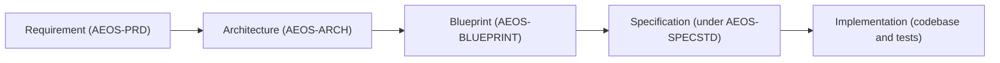

# AI Engineering Operating System

## AEOS — Development Workflow Guide

*The permanent statement of the normative engineering workflow a developer follows within an AEOS
project once Configuration and Runtime Connection are complete.*

| Field | Value |
| :--- | :--- |
| **Document** | Development Workflow Guide |
| **Product** | AI Engineering Operating System (AEOS) |
| **Document ID** | AEOS-DEVWFL |
| **Version** | 1.0.0 |
| **Status** | Draft |
| **Owner** | Product Owner, AEOS |
| **Author** | Developer Experience Board, AEOS |
| **Audience** | Developers, AI runtimes acting on a developer's behalf, engineering leads, and reviewers working within an AEOS project once Configuration and Runtime Connection are complete |
| **Suggested path** | `docs/developer/DEVELOPMENT_WORKFLOW.md` |
| **Companion documents** | `AEOS_VISION.md` (AEOS-VISION) · `AEOS_PRODUCT_REQUIREMENTS.md` (AEOS-PRD) · `AEOS_GLOSSARY.md` (AEOS-GLOSSARY) · `AEOS_DOCUMENT_STANDARD.md` (AEOS-DOCSTD) · `AEOS_SUPPORTED_TECHNOLOGIES.md` (AEOS-TECH) · `AEOS_ARCHITECTURE.md` (AEOS-ARCH) · `AEOS_BLUEPRINT.md` (AEOS-BLUEPRINT) · `AEOS_SPECIFICATION_STANDARD.md` (AEOS-SPECSTD) · `PROJECT_BOOTSTRAP.md` (AEOS-BOOT) · `ENVIRONMENT_SETUP.md` (AEOS-ENVSETUP) · `REPOSITORY_LAYOUT.md` (AEOS-LAYOUT) |
| **Supersedes** | None |

> **Authority of this document.**
> This document states, as a Developer Guide under AEOS-DOCSTD Section 4.1, the **normative sequence
> of engineering work a developer — human or AI runtime acting on a human's behalf — follows once a
> project's Configuration and Runtime Connection are complete**: the philosophy and Human-in-the-Loop
> principles that govern every phase, the standard development lifecycle and how a session within it
> begins, how a unit of work traces from a stated requirement through Architecture, Blueprint, and
> Specification to Implementation, how a human and an AI runtime collaborate within that unit of
> work, how a resulting change is reviewed, validated, and committed, how work iterates, how a
> failure at any point is recovered from, and the criteria by which a unit of work is complete.
>
> This document is a **Developer Guide**, in the sense AEOS-DOCSTD Section 4.1 defines that layer:
> task-oriented instruction for a person — or an AI runtime — working within an already-built result.
> It is not a Product document, not a Vision document, not an Architecture document, not a Blueprint,
> not a Specification under AEOS-SPECSTD, and not an Implementation Guide. It states no product
> requirement, no architectural decision, no Blueprint arrangement, no specified behavior, and no
> implementation procedure; where a statement here appears to do any of these, that is a defect in
> this document and MUST be reported rather than acted upon. It is not an Environment Setup Guide, an
> Installation guide, a Configuration guide, or a Runtime Connection guide, and it does not restate
> the content of any of them — it begins where they end.
>
> AEOS-DOCSTD Section 4.1 positions Developer Guides beneath Implementation Guides in the
> documentation hierarchy, and Section 4.3 states their purpose: task-oriented instruction for
> contributors and users — setup, workflow, conventions in practice, troubleshooting. No Developer
> Guide has previously been authored for AEOS; `docs/developer/` exists, reserved and empty, per
> `PROJECT_BOOTSTRAP.md` `BOOT-028`, pending exactly this kind of document. This document is written
> under AEOS-DOCSTD's general document template and its Section 4.3 purpose statement for this layer,
> in the absence of a dedicated Developer Guide Standard — in the same spirit `PROJECT_BOOTSTRAP.md`
> and `ENVIRONMENT_SETUP.md` adopted that general template for the Implementation Guide layer, and
> `AEOS_RUNTIME_FLOW.md` adopted AEOS-SPECSTD's discipline voluntarily where no dedicated Standard yet
> existed for the Runtime layer. It does not, on that account, establish a Developer Guide Standard; a
> future one remains reserved to the owner under AEOS-DOCSTD `H5`, and nothing in this document binds
> a future Developer Guide to the conventions it adopts for itself alone.
>
> Where this document and a document of higher authority both speak to a subject, the
> higher-authority document governs and any conflict here is a defect to be reported rather than
> acted upon.

> The key words **MUST**, **MUST NOT**, **SHOULD**, **SHOULD NOT**, and **MAY** in this document are
> to be interpreted as described in RFC 2119 and RFC 8174, and carry their normative meaning only
> when they appear in all capitals.

---

## Table of Contents

1. [Purpose](#1-purpose)
2. [Scope and Applicability](#2-scope-and-applicability)
3. [Workflow Philosophy](#3-workflow-philosophy)
4. [Human-in-the-Loop Principles](#4-human-in-the-loop-principles)
5. [Standard Development Lifecycle](#5-standard-development-lifecycle)
6. [Session Initialization](#6-session-initialization)
7. [From Requirement to Implementation](#7-from-requirement-to-implementation)
8. [AI Collaboration Workflow](#8-ai-collaboration-workflow)
9. [Review Workflow](#9-review-workflow)
10. [Validation Workflow](#10-validation-workflow)
11. [Commit Workflow](#11-commit-workflow)
12. [Iterative Development](#12-iterative-development)
13. [Failure Recovery](#13-failure-recovery)
14. [Workflow Completion Criteria](#14-workflow-completion-criteria)
15. [Non-Goals](#15-non-goals)
16. [Traceability](#16-traceability)
17. [References](#17-references)
18. [Document Governance](#18-document-governance)
19. [Appendix A — DEVWFL Rule Index](#appendix-a--devwfl-rule-index)
20. [Appendix B — Development Session Checklist (Non-Normative)](#appendix-b--development-session-checklist-non-normative)

---

## 1. Purpose

A developer who opens an AEOS project for the first time, and an AI runtime that opens the same
project with no memory of any prior session, both need the same answer to one question: *now that the
machine is prepared, the repository exists, and a runtime is connected, what actually happens next?*
Without a written answer, that question is settled by habit — differently by every developer, every
runtime, and every day — which is precisely the improvisation AEOS-PRD Problem `P1` exists to end.
This document is that written answer, held to the same discipline as the rest of the AEOS document
set: complete, versioned, and traceable, rather than remembered.

A reader of this document gains one thing: a single, ordered account of how engineering work proceeds
inside an AEOS project once onboarding is behind it — the philosophy behind it, the point at which a
human decides, the path a unit of work traces from a stated requirement to committed implementation,
how an AI runtime participates, and how review, validation, commit, iteration, and failure recovery
each work. It states no new product behavior. Everywhere it describes a gate, a class of action, or an
obligation, that gate, class, or obligation already exists in AEOS-PRD or AEOS-ARCH; this document
states where each applies within ongoing engineering work, and traces every statement back to its
source.

Five properties bind this document, consistent with the discipline AEOS-DOCSTD Section 6 and the
product's own quality attributes establish, and are met wherever this document's own layer permits:

| Property | What it requires of this document |
| :--- | :--- |
| **Runtime-neutral** | Every phase in [Section 5](#5-standard-development-lifecycle) applies unchanged regardless of which approved AI runtime performs the work. AEOS-PRD `PR-RUN-003` through `PR-RUN-005` require this of the product; [Section 8](#8-ai-collaboration-workflow) states what it requires of this workflow specifically. |
| **Platform-neutral** | No phase, gate, or rule stated here depends on Windows, macOS, or Linux specifics, consistent with AEOS-PRD `PR-PLT-002` and `PR-PLT-003`. |
| **Deterministic** | The phase order in [Section 5](#5-standard-development-lifecycle) is fixed; a phase is entered only after its predecessor's exit condition holds, consistent with `PR-WFL-004`'s incremental-execution requirement. |
| **Human-supervised** | Every consequential step passes through the Approval Gate the Interaction Model establishes; [Section 4](#4-human-in-the-loop-principles) states what that requires of this workflow specifically. |
| **Repository-anchored** | Nothing this document treats as complete is complete only in a chat session; [Section 14](#14-workflow-completion-criteria) ties completion to what the repository itself records, consistent with AEOS-VISION `V5`. |

## 2. Scope and Applicability

### 2.1 What This Document Governs

This document governs the ongoing engineering workflow within an AEOS project, and nothing beyond
it:

- the philosophy and the Human-in-the-Loop principles that shape every phase of that workflow;
- the standard development lifecycle: its phases, their order, and their exit conditions;
- how a development session begins, and what must already be true before it does;
- how a unit of work is traced from a stated requirement through Architecture, Blueprint, and
  Specification to Implementation, without restating any of those documents;
- how a human developer and an AI runtime divide responsibility within a unit of work;
- how a proposed change is reviewed, how it is validated, and how it is committed;
- how work iterates from one unit to the next;
- how a failure, interruption, or decline at any phase is recovered from;
- the criteria by which a unit of work is considered complete;
- what this document explicitly does not cover, so that a reader does not search this document, or a
  future document, in the wrong place.

This list is complete.

### 2.2 What This Document Does Not Govern

| Not governed here | Owned by |
| :--- | :--- |
| Why AEOS exists, and what must never change about it | AEOS-VISION |
| What AEOS is and what it must do | AEOS-PRD |
| What AEOS terms mean | AEOS-GLOSSARY |
| How AEOS documentation is written, structured, and frozen | AEOS-DOCSTD |
| Which technologies AEOS officially recognizes | AEOS-TECH |
| How AEOS is structured | AEOS-ARCH |
| How that structure is arranged to be built | AEOS-BLUEPRINT |
| How each defined behavior must work, precisely and testably | Specification documents, under AEOS-SPECSTD |
| How a new AEOS repository is initialized | `PROJECT_BOOTSTRAP.md` (AEOS-BOOT) |
| What a host machine must provide before any of the above is attempted | `ENVIRONMENT_SETUP.md` (AEOS-ENVSETUP) |
| The repository's directory structure and what belongs at each path | `REPOSITORY_LAYOUT.md` (AEOS-LAYOUT) |
| A project's Configuration — its Profile, technology selection, and initial non-runtime settings | Project management (`PR-PRJ`) and AEOS-BOOT Section 6 |
| Distribution, Installation, and Runtime Connection, as AEOS-PRD Section 16.4 draws that boundary | AEOS-PRD Section 18.14 (`PR-ONB`) |
| AEOS's own observable execution lifecycle for a single request | `AEOS_RUNTIME_FLOW.md` (AEOS-RTF) |
| What code realizes any capability named in this document | The codebase and its tests |

A statement in this document that redefines a product requirement, an Architecture Layer, a
Blueprint arrangement, a Specification's behavioral content, or another document's stated boundary
is a **defect in this document**. It MUST be reported rather than acted upon.

### 2.3 Applicability

This document applies once a project's Configuration and Runtime Connection, as AEOS-PRD Section
16.4 distinguishes them, are complete — that is, once the developer-facing concerns AEOS-PRD Section
18.14 (`PR-ONB`) governs have concluded. It does not apply before that point, and it does not
restate what happens up to it. It applies identically to a human developer performing engineering
work directly and to an AI runtime performing it on a human's behalf, consistent with AEOS-DOCSTD
Section 2.4, and identically across every approved AI runtime and every supported Platform,
consistent with `PR-RUN-003` and `PR-PLT-001`.

This document does not apply to the initialization of a new repository, which `PROJECT_BOOTSTRAP.md`
governs, and it does not apply to preparing a host machine, which `ENVIRONMENT_SETUP.md` governs. Its
first applicable moment is [Section 6](#6-session-initialization).

### 2.4 Recorded Deviation

AEOS-DOCSTD Section 7.3 records that the Developer Guide layer SHOULD NOT use normative keywords, on
the ground that a guide instructs and obligations belong to the documents that own them. This
document uses normative keywords in the `DEVWFL-<NNN>` rules of [Section 4](#4-human-in-the-loop-principles)
and [Sections 6](#6-session-initialization) through [14](#14-workflow-completion-criteria). Each such
rule operationalizes an obligation an owning document already states — principally AEOS-PRD's
Interaction Model, Action Classes, and its `PR-WFL`, `PR-RUN`, `PR-TDD`, `PR-REP`, `PR-RUL`, `PR-PMT`,
and `PR-SAF` requirement families, and AEOS-ARCH's `AR-BND` and `AR-PRN` invariants — at the point a
developer or an AI runtime actually performs it; no rule in this document states an obligation absent
from an owning document, and [Section 16](#16-traceability) traces every rule to its source. The
deviation is deliberate: removing the keywords would leave the sequencing and gating this document
exists to state unenforceable, while restating already-binding product requirements ambiguously
serves no reader. It is recorded here as AEOS-DOCSTD Section 7.2 requires of a deliberate deviation
from a SHOULD.

## 3. Workflow Philosophy

AEOS-PRD names seven problems Development Workflow exists to answer as product behavior rather than
as advice: process improvised per session, context thrown at a model, tools that act before they
explain, tests written last, practice locked to one vendor, an environment assumed rather than
inspected, and knowledge that dies with the chat session (AEOS-PRD Section 4, `P1`–`P7`). This
document does not restate those problems; it states how the workflow a developer actually follows
answers them, phase by phase.

Five of AEOS-PRD's thirteen product principles (Section 7) bear most directly on ongoing engineering
work, and each shapes a specific phase of this document rather than the document as a whole:

| Principle (AEOS-PRD Section 7) | What it requires of Development Workflow |
| :--- | :--- |
| **1. Human-in-the-Loop by Default** | No phase advances past its Approval Gate without the human's explicit decision. [Section 4](#4-human-in-the-loop-principles) states this in full. |
| **2. Explain Before Execute** | A proposal is understandable before it is actionable, at every phase from AI collaboration through commit. [Sections 8](#8-ai-collaboration-workflow) through [11](#11-commit-workflow) state what each phase explains. |
| **3. Incremental Execution** | Work advances in small, verifiable steps with defined start and end states. [Section 5](#5-standard-development-lifecycle) states the resulting phase structure. |
| **4. TDD-first Development** | A failing test precedes implementation for every change this workflow produces. [Section 10](#10-validation-workflow) states the cycle as it applies here. |
| **5. Repository as Product** | Nothing this workflow produces is authoritative until it is recorded in the repository. [Section 11](#11-commit-workflow) and [Section 14](#14-workflow-completion-criteria) state what that means for commit and for completion. |

Invariants `V2` through `V5` (AEOS-VISION) — the human decides, nothing consequential happens without
being understandable first, verification precedes implementation, and the repository is the product —
hold across every phase this document states without exception. A phase that appeared to satisfy this
document while violating one of them would be non-conformant with AEOS-VISION, not merely with this
guide.

## 4. Human-in-the-Loop Principles

AEOS-PRD Section 10 states the Interaction Model every consequential AEOS action follows: Inspect,
Explain, Propose, Confirm, Execute, Report — and the four Action Classes, Observation, Local change,
External effect, and Destructive, that determine what confirmation an action requires. This document
does not restate either; it states what they require specifically of a developer's engineering work,
where the acting party is often an AI runtime proposing a code change rather than AEOS proposing an
environment change.

Architecturally, AEOS-ARCH assigns the Workflow Layer sole responsibility for holding an Approval
Gate (`AR-PRN-004`), states that a consequential action MUST NOT reach effect without passing one
(`AR-BND-003`), and states that output arriving from the External AI Layer — an AI runtime's response
— MUST NOT itself authorize an action, satisfy a gate, alter a Rule, or expand an approved scope
(`AR-BND-004`), and MUST NOT simulate or stand in for a decision belonging to the Human Layer
(`AR-BND-010`). Every phase in [Sections 6](#6-session-initialization) through
[13](#13-failure-recovery) is written to hold that boundary: an AI runtime may generate a proposal at
any phase; only the developer may approve one.

| ID | Rule | Traces to |
| :--- | :--- | :--- |
| `DEVWFL-001` | A proposal presented to the developer during Development Workflow MUST state its rationale, its effect, its reversibility, and the consequence of declining. | `PR-WFL-005` |
| `DEVWFL-002` | A workflow step MUST NOT proceed past its Approval Gate without the developer's explicit confirmation; silence, ambiguity, or a prior approval for a different action MUST NOT be treated as approval. | `PR-WFL-005` · `AR-BND-014` |
| `DEVWFL-003` | The Action Class of a proposed action MUST be determined before the action is proposed, and the confirmation sought MUST match that class. | `PR-WFL-006` |
| `DEVWFL-004` | Output produced by an AI runtime MUST NOT itself satisfy an Approval Gate, alter a Rule, or expand an approved scope. | `AR-BND-004` · `AR-BND-010` |

## 5. Standard Development Lifecycle

Development Workflow is the sequence of phases below. Each phase has a stated exit condition; a
phase is entered only once its predecessor's exit condition holds, consistent with `PR-WFL-004`'s
incremental-execution requirement, and the sequence maps onto the engineering-lifecycle stages
AEOS-PRD Section 9 already names, restricted to the stages this document's scope covers.

| # | Phase | Purpose | Exit condition | Section |
| :--- | :--- | :--- | :--- | :--- |
| 1 | **Session Initialization** | Establish the current repository and workflow state before any proposal is made. | Current state reported; intent for the session confirmed or a prior Workflow resumed. | [6](#6-session-initialization) |
| 2 | **Requirement orientation** | Trace the intended unit of work to a stated requirement, and to Architecture, Blueprint, or Specification where the change touches them. | A governing identifier is identified, or the gap is surfaced as a question. | [7](#7-from-requirement-to-implementation) |
| 3 | **AI collaboration** | Generate a proposed change with an AI runtime under Context Minimization. | A Proposal exists, inspectable before it is sent or applied. | [8](#8-ai-collaboration-workflow) |
| 4 | **Review** | Evaluate the proposed change against requirements, Rules, and tests. | Findings are classified; none Critical or Major remain open, or each is declined with a recorded reason or escalated. | [9](#9-review-workflow) |
| 5 | **Validation** | Confirm the change through the project's own test tooling under the TDD Cycle. | The test the change targets passes, and the suite it depends on remains green. | [10](#10-validation-workflow) |
| 6 | **Commit** | Record the validated change in the repository's version control. | The commit is executed and its result reported. | [11](#11-commit-workflow) |
| 7 | **Iteration** | Return to the next unit of work, or pause and resume later. | The next Requirement orientation begins, or the session ends with Workflow State recorded. | [12](#12-iterative-development) |

Failure at any phase enters [Section 13](#13-failure-recovery) rather than a phase later in this
table; recovery either returns the workflow to the phase that failed or halts it in a recorded state.

| ID | Rule | Traces to |
| :--- | :--- | :--- |
| `DEVWFL-005` | The phases in the table above MUST be followed in the stated order within a single unit of work. A phase MAY be re-entered by way of [Section 12](#12-iterative-development), but MUST NOT be skipped. | `PR-WFL-004` |

## 6. Session Initialization

A development session begins only after a project's Configuration and Runtime Connection are
complete, as [Section 2.3](#23-applicability) states. AEOS-PRD `PR-ONB-011` requires that AEOS state
what a developer can do first once installed and connected; `PR-ONB-012` requires that a developer be
able to complete one full pass of the Interaction Model within that first session. This document's
Session Initialization phase is the point at which those two requirements are satisfied: it is the
handoff from onboarding, which AEOS-PRD Section 18.14 governs, to ongoing engineering work, which
this document governs from here on. No other requirement in the `PR-ONB` family applies past this
phase.

Consistent with AEOS-PRD Section 11's Environment Philosophy — AEOS inspects before it acts, on every
machine, every time — Session Initialization begins with inspection, not with a proposal. AEOS reports
the project's current repository state and the state of any Workflow already in progress before
asking the developer what they intend to do next.

| ID | Rule | Traces to |
| :--- | :--- | :--- |
| `DEVWFL-006` | Session Initialization MUST begin by inspecting the current repository and workflow state before any proposal is made. | `PR-NFR-001` |
| `DEVWFL-007` | Where an incomplete Workflow exists for the project, Session Initialization MUST offer to resume it before proposing new work. | `PR-WFL-008` |
| `DEVWFL-008` | Session Initialization MUST NOT assume unstated developer intent; where intent is unclear, AEOS asks rather than proceeds. | `PR-SAF-002` |

## 7. From Requirement to Implementation

A unit of engineering work does not begin at Implementation. AEOS-PRD Section 3.2 assigns each layer
— Product, Architecture, Specification, and Implementation — a distinct question, and a developer's
unit of work passes through whichever of those questions the change actually touches, in the order
the documentation hierarchy assigns them (AEOS-DOCSTD Section 4.1). This document does not restate
what any of those layers contain; it states only that a unit of work traces through them, and how.

| Layer | Answers | A unit of work traces to it when |
| :--- | :--- | :--- |
| **Requirement** | What must AEOS do? | Always — every unit of work traces to at least one `PR-` identifier. |
| **Architecture** | How is AEOS structured? | The change touches a layer boundary, dependency, or invariant AEOS-ARCH states. |
| **Blueprint** | How is that structure arranged to be built? | The change touches a subsystem's internal organization AEOS-BLUEPRINT states. |
| **Specification** | How must the behavior work, precisely and testably? | The change implements or alters a behavior a Specification document governs. |
| **Implementation** | What code realizes the above? | Always the final step — where Requirement, Architecture, Blueprint, and Specification meet code. |

Not every unit of work touches every layer. A change confined to Implementation still traces to the
requirement it satisfies; a change with no structural, arrangement, or specified-behavior component
skips the intervening rows without skipping the requirement trace itself, consistent with
`PR-WFL-004`'s incremental-execution requirement.

Where an intended change has no identifiable requirement behind it, AEOS-PRD Section 9 Stage 3
requires that ambiguity be surfaced as a question rather than resolved by assumption. This document
adopts that requirement directly: a developer, or an AI runtime, does not invent a requirement
identifier to proceed.

| ID | Rule | Traces to |
| :--- | :--- | :--- |
| `DEVWFL-009` | A unit of implementation work MUST trace to at least one AEOS-PRD requirement identifier, and, where it touches structure, arrangement, or specified behavior, to the Architecture, Blueprint, or Specification identifier that governs it. | AEOS-DOCSTD `H4` · AEOS-PRD Section 25.6 |
| `DEVWFL-010` | Where no requirement identifier covers an intended change, Development Workflow MUST surface the gap as a question for the developer rather than proceed on an assumed requirement. | `PR-SAF-002` |
| `DEVWFL-011` | Development Workflow MUST NOT restate the content of a Requirement, Architecture, Blueprint, or Specification document it references; it names and traces to the governing identifier only. | AEOS-DOCSTD `DS-P-06` · `DS-P-07` |

## 8. AI Collaboration Workflow

AEOS performs no inference of its own (`PR-RUN-001`); every proposed change an AI runtime contributes
during this workflow is generated by a runtime the developer selected, under context the developer can
inspect. This section states how that collaboration proceeds within a unit of work; it does not
restate runtime selection, connection, or lifecycle, which belong to AEOS-PRD Section 18.14 and
`AEOS_RUNTIME_FLOW.md` respectively.

Context supplied to the runtime is composed deliberately and scoped to the current step, consistent
with Context Minimization (AEOS-PRD Section 7.6, `PR-PMT-003`), and remains inspectable by the
developer before it is sent (`PR-PMT-005`). The change a runtime produces is a Proposal, not an
applied change; it reaches the repository only after Review, Validation, and Commit have run their
course, exactly as [Section 5](#5-standard-development-lifecycle) orders them.

The table below illustrates, non-normatively, how the Action Classes AEOS-PRD Section 10.1 defines
apply to actions typical of AI collaboration. It is an example, not an exhaustive rule.

| Illustrative action | Action Class | Approval required |
| :--- | :--- | :--- |
| Reading a file to compose context | Observation | None |
| Generating a proposed code change | Observation (the generation itself; the change is a Proposal, not yet applied) | None to generate; explicit approval to write |
| Writing an approved change to a tracked file | Local change | Explicit approval of the Proposal |
| Installing a dependency the change requires | External effect | Explicit approval, with cost and scope stated |
| Rewriting a file's history or discarding uncommitted work | Destructive | Explicit, specific confirmation of that exact action |

| ID | Rule | Traces to |
| :--- | :--- | :--- |
| `DEVWFL-012` | Context composed for an AI runtime within Development Workflow MUST be limited to what the current step requires. | `PR-PMT-003` |
| `DEVWFL-013` | A developer MUST be able to inspect a composed prompt before it is sent to a runtime. | `PR-PMT-005` |
| `DEVWFL-014` | A change authored by an AI runtime MUST be presented as a Proposal before it is written to the repository; Development Workflow MUST NOT apply AI-authored output directly. | `PR-WFL-005` · `AR-BND-010` |
| `DEVWFL-015` | Development Workflow MUST behave identically in substance regardless of which approved AI runtime performs the work. | `PR-RUN-003` · `PR-RUN-004` · `PR-RUN-005` · `PR-RUN-008` |
| `DEVWFL-016` | Where a selected runtime cannot support a requested workflow step, that limitation MUST be reported before work on the step begins. | `PR-RUN-007` · `PR-WFL-016` |

## 9. Review Workflow

Review evaluates a proposed change against the requirements, Rules, and tests that apply to it, and
produces findings the developer acts on before the change proceeds to Validation and Commit
(`PR-REP-011`). Review is distinct from Validation: Review asks whether the change is the right
change; Validation, in [Section 10](#10-validation-workflow), asks whether the change behaves as
specified.

Findings are classified Critical, Major, Minor, or Nitpick, the same four-class scheme `PR-REP-011`
establishes for code review and AEOS-DOCSTD Section 12.3 uses for document review. A change carrying
an open Critical or Major finding does not proceed to Commit Workflow until the finding is resolved,
declined with a recorded reason, or escalated — the same discipline AEOS-DOCSTD Section 12.4
establishes for reviewing documents, applied here to reviewing change.

Rule violations are reported as part of Review, with severity and location, and the developer can
determine which Rules were applied to a given change and why (`PR-RUL-005` through `PR-RUL-007`).

| ID | Rule | Traces to |
| :--- | :--- | :--- |
| `DEVWFL-017` | A proposed change MUST be evaluated against applicable requirements, Rules, and tests before it is accepted. | `PR-REP-011` |
| `DEVWFL-018` | Review findings MUST be classified as Critical, Major, Minor, or Nitpick. | `PR-REP-011` |
| `DEVWFL-019` | A change carrying an open Critical or Major review finding SHOULD NOT proceed to Commit Workflow until the finding is resolved, declined with a recorded reason, or escalated. | `PR-REP-011` |
| `DEVWFL-020` | AEOS reports which Rules were applied to a proposed change and any violations found, with severity and location. | `PR-RUL-005` · `PR-RUL-006` · `PR-RUL-007` |

## 10. Validation Workflow

Validation confirms that a change behaves as required, through the project's own test tooling and the
TDD Cycle: define behavior, write the failing test, verify it fails for the intended reason, implement
the minimum that passes, refactor under a green suite (AEOS-GLOSSARY, *TDD Cycle*; AEOS-PRD Section
7.4). TDD is the default development workflow for AEOS-governed code work (`PR-TDD-001`), and applies
identically to AEOS's own development (`PR-TDD-012`).

AEOS orchestrates the project's existing test tooling; it does not supply its own test framework
(`PR-TDD-009`, `AR-BND-012`). A test failure halts progression to any workflow step that depends on
the failing one, and is reported with enough detail to act on (`PR-TDD-010`, `PR-WFL-010`).

| ID | Rule | Traces to |
| :--- | :--- | :--- |
| `DEVWFL-021` | Implementation MUST NOT begin before a failing test exists and its failure has been verified for the intended reason. | `PR-TDD-002` · `PR-TDD-003` · `PR-TDD-004` |
| `DEVWFL-022` | A test failure MUST halt progression to dependent workflow steps and MUST be reported with enough detail to act on. | `PR-TDD-010` · `PR-WFL-010` |
| `DEVWFL-023` | Refactoring MUST occur only while the project's test suite is passing. | `PR-TDD-006` |
| `DEVWFL-024` | Skipping the TDD Cycle MUST be an explicit exception the developer acknowledges; it MUST NOT be the default and MUST NOT occur silently. | `PR-TDD-008` |

## 11. Commit Workflow

A commit records a validated change in the project's version control. AEOS reports the current
version-control state before proposing one (`PR-REP-003`), and the commit itself is a Proposal like
any other consequential action: it states what it records and why, and is confirmed under the Action
Class it falls into — ordinarily Local change for a commit confined to the repository, External effect
where it also reaches a remote, per AEOS-PRD Section 10.1's own example of pushing to a remote.

History is never modified, and uncommitted work is never discarded, without explicit, specific
confirmation of that exact operation; a general approval earlier in the workflow does not cover either
(`PR-REP-005`, `PR-REP-006`, `AR-BND-014`).

| ID | Rule | Traces to |
| :--- | :--- | :--- |
| `DEVWFL-025` | A commit MUST be proposed with the change it records and its rationale before it is executed, and confirmed under the Action Class that applies to it. | `PR-WFL-005` |
| `DEVWFL-026` | Version-control history MUST NOT be modified, and uncommitted work MUST NOT be discarded, without explicit, specific confirmation of that exact operation. | `PR-REP-005` · `PR-REP-006` |
| `DEVWFL-027` | AEOS MUST report the current version-control state before proposing a commit. | `PR-REP-003` |

## 12. Iterative Development

AEOS-PRD Section 9 states that its engineering-lifecycle stages are ordered for readability but that
real projects re-enter them continuously. Development Workflow is no different: completing one unit of
work, per [Section 14](#14-workflow-completion-criteria), returns the workflow to Requirement
orientation for the next one, per the Incremental Execution principle (AEOS-PRD Section 7.3) — small,
verifiable steps rather than a single irreversible leap.

A developer can see where the current unit of work stands, what has been completed, and what remains
outstanding at any point in this cycle, and can pause and resume a Workflow without losing position or
re-establishing context (`PR-WFL-007`, `PR-WFL-008`).

| ID | Rule | Traces to |
| :--- | :--- | :--- |
| `DEVWFL-028` | Where an engineering-lifecycle stage is re-entered, Development Workflow MUST retain visibility into what has already been completed and what remains outstanding. | `PR-WFL-007` |

## 13. Failure Recovery

A failure, an interruption, or a decline at any phase in [Section 5](#5-standard-development-lifecycle)
does not corrupt the workflow or the repository. Each is handled as an expected condition, consistent
with `PR-NFR-005`'s Resilience commitment and `AR-PRN-008`'s architectural requirement that a failing
or absent layer reduce available options rather than corrupt the Repository Layer.

| Situation | Development Workflow behavior |
| :--- | :--- |
| A developer declines a proposal | The workflow halts at that step without side effects; no partial application occurs. |
| A test fails during Validation | Progression to dependent steps halts; the failure is reported with enough detail to act on. |
| A selected AI runtime errors or becomes unavailable | The error is reported clearly; AEOS does not silently retry in a way that incurs unapproved cost, and does not silently substitute a different runtime. |
| A session is interrupted mid-phase | The project is left in a consistent, describable state; Workflow State supports resuming at the point of interruption. |
| A review finding is Critical or Major | The change does not proceed to Commit Workflow until the finding is resolved, declined with a recorded reason, or escalated. |

| ID | Rule | Traces to |
| :--- | :--- | :--- |
| `DEVWFL-029` | A declined proposal MUST halt the workflow without side effects. | `PR-WFL-009` |
| `DEVWFL-030` | An interruption at any point MUST leave the project in a consistent, describable state. | `PR-SAF-010` |
| `DEVWFL-031` | A runtime error MUST be reported clearly and MUST NOT be silently retried in a way that incurs unapproved cost. | `PR-RUN-011` |

## 14. Workflow Completion Criteria

A unit of work is complete only when every phase in [Section 5](#5-standard-development-lifecycle)
that applies to it has reached its stated exit condition: the change traces to a requirement, was
reviewed with no open Critical or Major finding, validated against a passing test the TDD Cycle
required, and committed to the repository with its result reported. Documentation the change affects
is updated and remains consistent with the repository it describes, consistent with `PR-DOC-003` and
`PR-DOC-007`, where the change touches documentation at all.

This document states completion as these observable conditions and no others. The formal values a
Workflow's state may hold, and the mechanics by which they are recorded and transition, are owned by
the Specification governing the AEOS state machine, not by this document; this section does not name
or assume any such value.

| ID | Rule | Traces to |
| :--- | :--- | :--- |
| `DEVWFL-032` | A unit of work is not reported complete while a test it requires is failing, an approval it requires is outstanding, or a change it produced is not recorded in the repository. | `PR-TDD-010` · `PR-WFL-005` · `PR-REP-001` |

## 15. Non-Goals

This document deliberately does not cover the following. Each is a reasonable expectation this
document does not meet, stated here so a reader does not search for it, or for a future document, in
the wrong place.

| # | Non-goal | Owned by, if anywhere |
| :--- | :--- | :--- |
| `NG-1` | Preparing a host machine: installing tooling, resolving environment variables, or satisfying directory-level conditions. | `ENVIRONMENT_SETUP.md` (AEOS-ENVSETUP) |
| `NG-2` | Initializing a new AEOS repository: its directories, document placement, and initial non-runtime configuration. | `PROJECT_BOOTSTRAP.md` (AEOS-BOOT) |
| `NG-3` | Establishing a project's Configuration: its Profile, technology selection, and initial non-runtime settings recorded at project creation. | `PR-PRJ` and AEOS-BOOT Section 6 |
| `NG-4` | Connecting to, selecting among, or authenticating an AI runtime. | AEOS-PRD Section 18.14 (`PR-ONB`), and the Runtime layer's own documents |
| `NG-5` | Distributing or otherwise making AEOS available for acquisition. | AEOS-PRD Section 15 (Distribution Strategy) |
| `NG-6` | Structural decisions about how AEOS itself is organized. | AEOS-ARCH |
| `NG-7` | The buildable arrangement of that structure. | AEOS-BLUEPRINT |
| `NG-8` | Precise, testable behavioral rules for a specified capability. | Specification documents, under AEOS-SPECSTD |
| `NG-9` | AEOS's own observable execution lifecycle for a single request. | `AEOS_RUNTIME_FLOW.md` (AEOS-RTF) |
| `NG-10` | Authoring a new Workflow, Rule, Skill, or Prompt as a declared Repository Asset. | `PR-WFL-002` / `013` · `PR-RUL-008` · `PR-SKL-005` · `PR-PMT-007`, and their respective future Implementation Guides |
| `NG-11` | Deploying a project's built artifacts. | AEOS-PRD Section 9 Stage 12, and `PR-REP-008` |
| `NG-12` | Configuring a project's CI/CD systems. | `PR-REP-007` |
| `NG-13` | Repository directory structure and file placement. | `REPOSITORY_LAYOUT.md` (AEOS-LAYOUT) |
| `NG-14` | What code realizes any capability this document names. | The codebase and its tests |

## 16. Traceability

Every `DEVWFL-` rule in this document traces to one or more identifiers stated inline in
[Sections 4](#4-human-in-the-loop-principles) and [6](#6-session-initialization) through
[14](#14-workflow-completion-criteria), and indexed in full in
[Appendix A](#appendix-a--devwfl-rule-index). The table below summarizes trace density by prefix,
consistent with the practice AEOS-SPECSTD `CM2` establishes for Specification documents, which
`PROJECT_BOOTSTRAP.md` also adopts for itself under AEOS-DOCSTD Section 2.3's general discipline.

| Prefix | Rules that trace to it |
| :--- | :--- |
| `PR-WFL` | `DEVWFL-001` · `002` · `003` · `005` · `007` · `014` · `016` · `022` · `025` · `028` · `029` · `032` |
| `PR-RUN` | `DEVWFL-015` · `016` · `031` |
| `PR-TDD` | `DEVWFL-021` · `022` · `023` · `024` · `032` |
| `PR-REP` | `DEVWFL-017` · `018` · `019` · `026` · `027` · `032` |
| `PR-SAF` | `DEVWFL-008` · `010` · `030` |
| `PR-PMT` | `DEVWFL-012` · `013` |
| `PR-RUL` | `DEVWFL-020` |
| `PR-NFR` | `DEVWFL-006` |

Four rules trace to AEOS-ARCH's `AR-` invariants or to AEOS-DOCSTD directly rather than to AEOS-PRD,
because they state a boundary AEOS-ARCH itself already draws (`DEVWFL-002`, `DEVWFL-004`,
`DEVWFL-014`) or a documentation principle AEOS-DOCSTD itself already imposes (`DEVWFL-009`,
`DEVWFL-011`), rather than a product requirement in its own right. This document, as a whole, traces
to AEOS-DOCSTD `H4`'s requirement that every derivative document trace to the layer above it,
satisfied here by tracing each rule to the identifier it ultimately serves, and to AEOS-DOCSTD `H6`'s
requirement that a document belong to a layer, satisfied by this document's position as a Developer
Guide, stated in the authority statement at the head of this document.

## 17. References

| Document | Document ID | Cited for |
| :--- | :--- | :--- |
| `AEOS_VISION.md` | AEOS-VISION | Invariants `V2` through `V5`, cited in [Section 3](#3-workflow-philosophy) and [Section 1](#1-purpose). |
| `AEOS_PRODUCT_REQUIREMENTS.md` | AEOS-PRD | The Interaction Model, Action Classes, Engineering Lifecycle, and the `PR-WFL`, `PR-RUN`, `PR-TDD`, `PR-DOC`, `PR-RUL`, `PR-PMT`, `PR-REP`, `PR-SAF`, `PR-ONB`, and `PR-NFR` requirement families this document's rules trace to, indexed in [Section 16](#16-traceability). |
| `AEOS_GLOSSARY.md` | AEOS-GLOSSARY | Terminology used without redefinition throughout this document, including *Proposal*, *Approval Gate*, *Action Class*, *Automation Grant*, *TDD Cycle*, and *Workflow State*. |
| `AEOS_DOCUMENT_STANDARD.md` | AEOS-DOCSTD | The documentation hierarchy, the Developer Guide layer's purpose (Section 4.1, Section 4.3), the general document template, the recorded-deviation practice ([Section 2.4](#24-recorded-deviation)), and the hierarchy rules (`H4`, `H5`, `H6`) this document is written under. |
| `AEOS_SUPPORTED_TECHNOLOGIES.md` | AEOS-TECH | Referenced for completeness; this document names no technology choice of its own. |
| `AEOS_ARCHITECTURE.md` | AEOS-ARCH | The Workflow Layer, the Human Layer, and the `AR-PRN` and `AR-BND` invariants cited in [Section 4](#4-human-in-the-loop-principles) and [Section 13](#13-failure-recovery); this document states no structural decision of its own. |
| `AEOS_BLUEPRINT.md` | AEOS-BLUEPRINT | Referenced in [Section 7](#7-from-requirement-to-implementation) as the layer between Architecture and Specification; this document states no arrangement of its own. |
| `AEOS_SPECIFICATION_STANDARD.md` | AEOS-SPECSTD | Referenced in [Section 7](#7-from-requirement-to-implementation) as the Specification layer's own governing Standard, and in [Section 16](#16-traceability) for its trace-density practice; this document is not itself a Specification. |
| `PROJECT_BOOTSTRAP.md` | AEOS-BOOT | The `docs/developer/` reservation (`BOOT-028`) this document fills, and its Section 6 for Initial Configuration, referenced in [Section 2.2](#22-what-this-document-does-not-govern) and [Section 15](#15-non-goals). |
| `ENVIRONMENT_SETUP.md` | AEOS-ENVSETUP | The host-machine preparation boundary this document begins after, referenced in [Section 2](#2-scope-and-applicability) and [Section 15](#15-non-goals). |
| `REPOSITORY_LAYOUT.md` | AEOS-LAYOUT | The repository structure boundary this document does not restate, referenced in [Section 15](#15-non-goals). |
| `AEOS_RUNTIME_FLOW.md` | AEOS-RTF | AEOS's own observable execution lifecycle, distinguished from Development Workflow in [Section 2.2](#22-what-this-document-does-not-govern) and [Section 15](#15-non-goals). |

## 18. Document Governance

### 18.1 Status

This document is a **Draft**. It is the first Developer Guide authored for AEOS, filling the
`docs/developer/` directory PROJECT_BOOTSTRAP.md `BOOT-028` reserves. It is intended to become the
Development Workflow Source of Truth once the owner's review under
[Section 18.4](#184-review-policy) records no Critical or Major finding, at which point it is intended
to be placed and frozen alongside the AEOS 1.0 document set.

### 18.2 Change Control

| Change type | Requires | Version impact |
| :--- | :--- | :--- |
| Editorial correction with no change of meaning | Contributor change, owner acceptance | Patch |
| Addition of a new `DEVWFL-<NNN>` rule that does not alter what an existing rule requires | Owner approval | Minor |
| Any change to what an existing `DEVWFL-<NNN>` rule requires, or its retirement | Explicit owner revision request | Major |
| Change to the phase structure in [Section 5](#5-standard-development-lifecycle) | Explicit owner revision request | Major |
| Any change that would contradict AEOS-PRD, AEOS-ARCH, or AEOS-GLOSSARY | Not permitted; reported as a defect in this document instead | — |

### 18.3 Relationship to the Architecture Freeze

This document introduces no architecture, no product requirement, no terminology, and no specified
behavior. Ideas arising from it that would alter AEOS-PRD, AEOS-ARCH, AEOS-BLUEPRINT, AEOS-DOCSTD, or
the documentation hierarchy are recorded as recommendations for the owning document's governance and
are applied only after explicit owner approval there — never enacted here.

### 18.4 Review Policy

Reviews of this document classify findings as **Critical**, **Major**, **Minor**, or **Nitpick**,
identify inconsistencies without redesigning the document, and recommend freezing it when no Critical
or Major finding remains, per AEOS-DOCSTD Section 12.3 and 12.4. A reviewer additionally confirms,
before recommending freeze:

- [ ] Every rule in [Section 4](#4-human-in-the-loop-principles) and
      [Sections 6](#6-session-initialization) through [14](#14-workflow-completion-criteria) carries a
      `DEVWFL-<NNN>` identifier and a trace.
- [ ] No rule states an obligation absent from an owning document, consistent with
      [Section 2.4](#24-recorded-deviation).
- [ ] No section restates the content of a Requirement, Architecture, Blueprint, Specification,
      Runtime, or other Implementation or Developer Guide document.
- [ ] No section states an installation procedure, an environment-preparation step, a Configuration
      step, or a Runtime Connection step.
- [ ] All twenty entries in this document's Table of Contents are present, in order, and none is
      silently empty.
- [ ] No Critical or Major finding remains open.

### 18.5 Precedence

| Situation | Resolution |
| :--- | :--- |
| This document conflicts with AEOS-VISION, AEOS-PRD, AEOS-GLOSSARY, AEOS-DOCSTD, AEOS-TECH, AEOS-ARCH, or AEOS-BLUEPRINT | The higher-authority document governs. The conflict is a defect in this document and is reported rather than acted upon. |
| This document conflicts with a Specification document on the mechanics of that document's own behavior domain | The owning Specification governs; this document is corrected to reference it rather than restate it. |
| This document conflicts with `PROJECT_BOOTSTRAP.md`, `ENVIRONMENT_SETUP.md`, or `REPOSITORY_LAYOUT.md` on a boundary those documents state | The other document governs its own boundary; this document is corrected. |
| A future Developer Guide states a workflow convention that conflicts with [Section 5](#5-standard-development-lifecycle) | The apparent need is reported against this document. It is not resolved by a contradictory statement in the other guide. |

### 18.6 Revision History

| Version | Status | Summary |
| :--- | :--- | :--- |
| 1.0.0 | Draft | Initial Development Workflow Guide. States the workflow philosophy and five Human-in-the-Loop rules governing every phase, the seven-phase standard development lifecycle, session initialization at the Configuration/Runtime-Connection handoff, the Requirement-to-Implementation trace, the AI collaboration workflow under Context Minimization and the Action Classes, the review workflow with its four-class finding scheme, the TDD-based validation workflow, the commit workflow, iterative development, failure recovery across five illustrative situations, and workflow completion criteria, together with thirty-two `DEVWFL-<NNN>` rules and fourteen non-goals. References AEOS-VISION, AEOS-PRD, AEOS-GLOSSARY, AEOS-DOCSTD, AEOS-TECH, AEOS-ARCH, AEOS-BLUEPRINT, AEOS-SPECSTD, AEOS-BOOT, AEOS-ENVSETUP, AEOS-LAYOUT, and AEOS-RTF. Introduces no product requirement, no vision, no terminology, no architectural decision, no Blueprint arrangement, and no specified behavior. Redefines nothing stated by any referenced document. Is the first document placed in `docs/developer/`. |

---

## Appendix A — DEVWFL Rule Index

**This appendix is non-normative.** The normative statement of each rule is its entry in
[Section 4](#4-human-in-the-loop-principles) and [Sections 6](#6-session-initialization) through
[14](#14-workflow-completion-criteria).

| ID | Section | Short label | Traces to |
| :--- | :--- | :--- | :--- |
| `DEVWFL-001` | 4 | Proposals state rationale, effect, reversibility, consequence of declining | `PR-WFL-005` |
| `DEVWFL-002` | 4 | No advance past an Approval Gate without explicit confirmation | `PR-WFL-005` · `AR-BND-014` |
| `DEVWFL-003` | 4 | Action Class determined before an action is proposed | `PR-WFL-006` |
| `DEVWFL-004` | 4 | AI output does not itself satisfy a gate | `AR-BND-004` · `AR-BND-010` |
| `DEVWFL-005` | 5 | Phase order fixed; re-entry only through Iterative Development | `PR-WFL-004` |
| `DEVWFL-006` | 6 | Session Initialization begins with inspection | `PR-NFR-001` |
| `DEVWFL-007` | 6 | Incomplete Workflow offered for resumption first | `PR-WFL-008` |
| `DEVWFL-008` | 6 | No assumed developer intent | `PR-SAF-002` |
| `DEVWFL-009` | 7 | Work traces to a requirement, and where relevant to Architecture, Blueprint, or Specification | AEOS-DOCSTD `H4` · AEOS-PRD 25.6 |
| `DEVWFL-010` | 7 | Missing requirement surfaced as a question | `PR-SAF-002` |
| `DEVWFL-011` | 7 | No restatement of a referenced document's content | AEOS-DOCSTD `DS-P-06` · `DS-P-07` |
| `DEVWFL-012` | 8 | Context limited to what the current step requires | `PR-PMT-003` |
| `DEVWFL-013` | 8 | Composed prompt inspectable before it is sent | `PR-PMT-005` |
| `DEVWFL-014` | 8 | AI-authored change presented as a Proposal, not applied directly | `PR-WFL-005` · `AR-BND-010` |
| `DEVWFL-015` | 8 | Workflow identical in substance across approved runtimes | `PR-RUN-003` · `004` · `005` · `008` |
| `DEVWFL-016` | 8 | Unsupported step reported before work begins | `PR-RUN-007` · `PR-WFL-016` |
| `DEVWFL-017` | 9 | Change evaluated against requirements, Rules, and tests | `PR-REP-011` |
| `DEVWFL-018` | 9 | Findings classified Critical, Major, Minor, or Nitpick | `PR-REP-011` |
| `DEVWFL-019` | 9 | Open Critical/Major finding blocks Commit Workflow | `PR-REP-011` |
| `DEVWFL-020` | 9 | Applied Rules and violations reported with severity and location | `PR-RUL-005` · `006` · `007` |
| `DEVWFL-021` | 10 | No implementation before a verified failing test | `PR-TDD-002` · `003` · `004` |
| `DEVWFL-022` | 10 | Test failure halts dependent steps and is reported | `PR-TDD-010` · `PR-WFL-010` |
| `DEVWFL-023` | 10 | Refactoring only under a passing suite | `PR-TDD-006` |
| `DEVWFL-024` | 10 | Skipping TDD is an explicit, acknowledged exception | `PR-TDD-008` |
| `DEVWFL-025` | 11 | Commit proposed with change and rationale before execution | `PR-WFL-005` |
| `DEVWFL-026` | 11 | History and uncommitted work require specific confirmation | `PR-REP-005` · `PR-REP-006` |
| `DEVWFL-027` | 11 | Version-control state reported before a commit is proposed | `PR-REP-003` |
| `DEVWFL-028` | 12 | Visibility into completed and outstanding work on re-entry | `PR-WFL-007` |
| `DEVWFL-029` | 13 | Declined proposal halts without side effects | `PR-WFL-009` |
| `DEVWFL-030` | 13 | Interruption leaves a consistent, describable state | `PR-SAF-010` |
| `DEVWFL-031` | 13 | Runtime error reported clearly, no silent retry | `PR-RUN-011` |
| `DEVWFL-032` | 14 | Completion requires passing tests, resolved approvals, and a recorded change | `PR-TDD-010` · `PR-WFL-005` · `PR-REP-001` |

## Appendix B — Development Session Checklist (Non-Normative)

A practical restatement of [Sections 6](#6-session-initialization) through
[14](#14-workflow-completion-criteria), for a developer or an AI runtime working through a unit of
engineering work directly. This checklist carries no authority of its own; where it appears to
diverge from those sections, they govern.

- [ ] Configuration and Runtime Connection confirmed complete before this workflow begins.
- [ ] Current repository and workflow state inspected and reported (Session Initialization).
- [ ] A prior incomplete Workflow, if any, offered for resumption.
- [ ] Intended work traced to a requirement identifier, and to Architecture, Blueprint, or
      Specification where it applies.
- [ ] Context for the AI runtime composed to Context Minimization and inspected before sending.
- [ ] Proposed change received as a Proposal, not applied directly.
- [ ] Change reviewed; findings classified; no Critical or Major finding left open.
- [ ] A failing test written, confirmed to fail for the intended reason, and driven to green under
      the TDD Cycle.
- [ ] Version-control state reported and a commit proposed, confirmed, and executed.
- [ ] Result reported and the repository re-inspected before the next unit of work begins.
- [ ] Where the session ends before a unit of work completes, Workflow State recorded so it can
      resume without loss of position.

---

**End of Development Workflow Guide**

AEOS-DEVWFL · Version 1.0.0 · Traces to `PR-WFL` · `PR-RUN` · `PR-TDD` · `PR-REP` · `PR-SAF` ·
`PR-PMT` · `PR-RUL` · `PR-NFR`, referencing AEOS-VISION · AEOS-PRD · AEOS-GLOSSARY · AEOS-DOCSTD ·
AEOS-TECH · AEOS-ARCH · AEOS-BLUEPRINT · AEOS-SPECSTD · AEOS-BOOT · AEOS-ENVSETUP · AEOS-LAYOUT ·
AEOS-RTF without restating any of them
