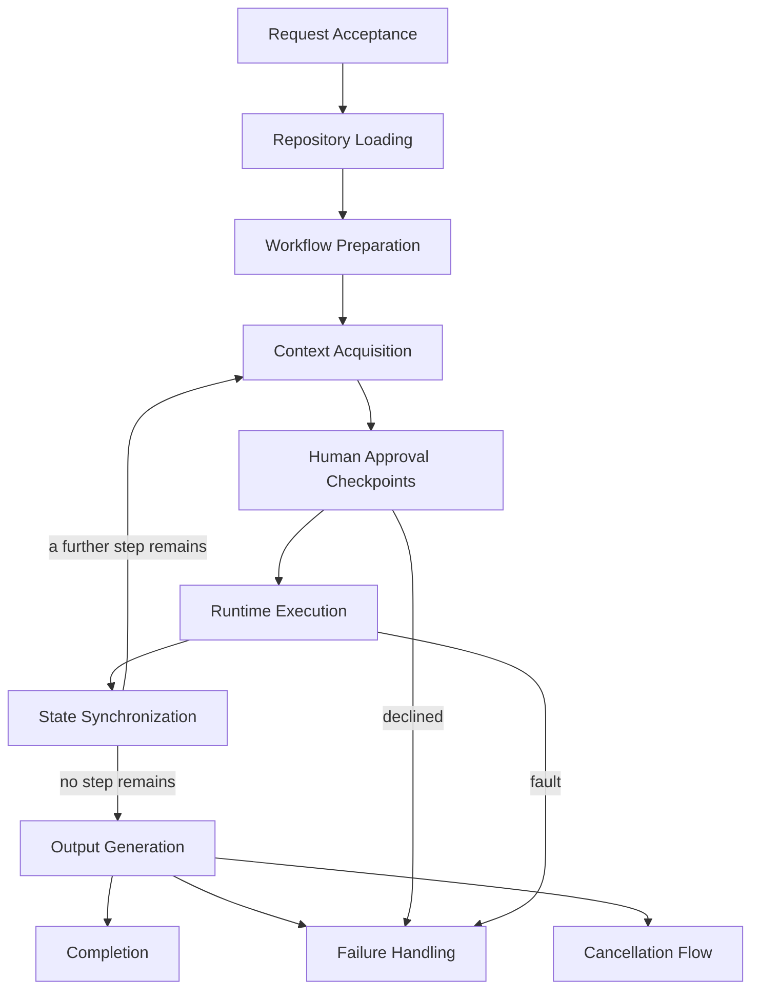

# AI Engineering Operating System

## AEOS — Runtime Flow Specification

*The permanent statement of the observable runtime lifecycle of AEOS, from request acceptance to
completion.*

| Field | Value |
| :--- | :--- |
| **Document** | Runtime Flow Specification |
| **Product** | AI Engineering Operating System (AEOS) |
| **Document ID** | AEOS-RTF |
| **Version** | 1.0.0 |
| **Status** | Freeze candidate |
| **Owner** | Product Owner, AEOS |
| **Author** | Chief Runtime Architect, AEOS |
| **Audience** | Architects, implementers, reviewers, test authors, and AI runtimes consuming this repository |
| **Suggested path** | `docs/runtime/RUNTIME_FLOW.md` |
| **Companion documents** | `AEOS_VISION.md` (AEOS-VISION) · `AEOS_PRODUCT_REQUIREMENTS.md` (AEOS-PRD) · `AEOS_GLOSSARY.md` (AEOS-GLOSSARY) · `AEOS_DOCUMENT_STANDARD.md` (AEOS-DOCSTD) · `AEOS_ARCHITECTURE.md` (AEOS-ARCH) · `AEOS_BLUEPRINT.md` (AEOS-BLUEPRINT) · `AEOS_SPECIFICATION_STANDARD.md` (AEOS-SPECSTD) · `AEOS_SPEC.md` (AEOS-SPEC) · `AEOS_WORKFLOW_ENGINE.md` (AEOS-SPEC-WFL) · `AEOS_CONTEXT_ROUTER.md` (AEOS-SPEC-CTX) · `AEOS_STATE_MACHINE.md` (AEOS-SPEC-STM) |
| **Supersedes** | None |

> **Authority of this document.**
> This document states, precisely and testably, the **observable runtime lifecycle of AEOS**: the
> closed, ordered set of phases a request passes through from the moment it is accepted to the
> moment it reaches Completion, Failure Handling, or Cancellation Flow, the responsibility each phase
> discharges, and the invariants that MUST hold across every phase. It answers the question
> AEOS-PRD Section 3.2 reserves for the **Runtime** layer — *"How does AEOS execute, in what
> environment, with what lifecycle?"* — and it answers that question exactly as AEOS-PRD requires of
> a Runtime document: it states what a user or an AI runtime observes, never what executes.
>
> AEOS-DOCSTD Section 4.5 records that the Runtime layer AEOS-PRD names has not yet been assigned a
> position in the documentation hierarchy, and that until it is, a Runtime document is written to the
> responsibility boundary AEOS-PRD states for it and complies with every rule of AEOS-DOCSTD that
> does not depend on hierarchy position. This document is the first such Runtime document. It is
> written under that provision.
>
> This document is **not** a Specification-layer document. It registers no `SP-` behavior domain
> under AEOS-SPECSTD, attaches at none of AEOS-SPEC's `EPS-1` through `EPS-7` extension points, and
> is not subject to AEOS-SPECSTD's own change control. It nonetheless adopts AEOS-SPECSTD's
> structural discipline voluntarily — precise, testable, `MUST`-level statements; a fixed
> subject-section shape; explicit traceability — because AEOS-DOCSTD's own principles ask no less
> rigor of any AEOS document, whatever its layer. Its own rules carry the document-local identifier
> `RTF-<NNN>`, which is not a registered AEOS-GLOSSARY layer prefix and makes no such claim; it is a
> traceability convention internal to this document alone, in the sense AEOS-TECH's `TG-` identifiers
> already are for that document.
>
> This document defines no vision, no product requirement, no terminology, no architecture, no
> Blueprint arrangement, no algorithm, no scheduler, no adapter, no execution-engine internal, no AI
> prompting mechanism, no database or persistence mechanism, and no technology. It states only the
> order in which already-specified behavior is engaged and the responsibility each phase discharges
> — never how any one domain's behavior is carried out, which remains exactly as AEOS-SPEC,
> AEOS-SPEC-WFL, AEOS-SPEC-CTX, and AEOS-SPEC-STM already state it. It redefines nothing stated by
> AEOS-VISION, AEOS-PRD, AEOS-GLOSSARY, AEOS-ARCH, AEOS-BLUEPRINT, AEOS-SPEC, AEOS-SPEC-WFL,
> AEOS-SPEC-CTX, or AEOS-SPEC-STM; where a statement here appears to, that is a defect in this
> document and MUST be reported rather than acted upon. Where this document and a document of higher
> authority both speak to the same subject, the higher-authority document governs.

> The key words **MUST**, **MUST NOT**, **SHOULD**, **SHOULD NOT**, and **MAY** in this document are
> to be interpreted as described in RFC 2119 and RFC 8174, and carry their normative meaning only
> when they appear in all capitals.

---

## Table of Contents

1. [Purpose](#1-purpose)
2. [Scope](#2-scope)
3. [Responsibilities](#3-responsibilities)
4. [Inputs](#4-inputs)
5. [Outputs](#5-outputs)
6. [Behavior](#6-behavior)
7. [Constraints](#7-constraints)
8. [Extension Points](#8-extension-points)
9. [Traceability](#9-traceability)
10. [Non-goals](#10-non-goals)
11. [References](#11-references)
12. [Document Governance](#12-document-governance)
13. [Appendix A — RTF Rule Index](#appendix-a--rtf-rule-index)

---

## 1. Purpose

AEOS-PRD Section 3.2 names a Runtime layer alongside Product, Architecture, and Specification, and
assigns it a question none of the other layers answers: how does AEOS execute, in what environment,
with what lifecycle. AEOS-PRD defers that question entirely, stating that a Runtime document
"states what users observe, never what executes." Every document that has since been written under
AEOS-SPECSTD — the System Specification and the Workflow Engine, Context Router, and State Machine
Specifications — answers a narrower question precisely and testably: what one behavior domain, or
one cross-cutting concern, must do. None of them states, and none of them should state, the order in
which a single request engages those domains, from the moment it arrives to the moment it is done.
Each says so explicitly in its own Non-goals.

AEOS-ARCH Section 6.2 states the interaction loop — Inspect, Explain, Propose, Confirm, Execute,
Report — as the only route by which one consequential action reaches effect. A request is rarely one
action. It is ordinarily a Workflow of many steps, each engaging that loop in turn, framed by work
that happens once per request rather than once per step: determining what the request addresses,
reading what the repository already holds, and interpreting a Workflow declaration into the steps
that will each take their turn through the loop. AEOS-PRD's `PR-SAF-010` requires that an
interruption at any point leave the project in a describable state, and `PR-WFL-008` requires that a
paused Workflow resume without losing position; neither is a property of one action or one behavior
domain alone. Both are properties of the whole sequence, observed end to end.

This document states that sequence once, as a closed, ordered set of observable phases, so that a
person or an AI runtime encountering AEOS for the first time can answer "what happens, and in what
order, from the moment I ask AEOS to do something until it is done" by reading one document rather
than inferring an order from what five documents each depend on. It composes what AEOS-SPEC,
AEOS-SPEC-WFL, AEOS-SPEC-CTX, and AEOS-SPEC-STM already specify; it restates none of it.

---

## 2. Scope

### 2.1 What This Document States

This document states: the closed, ordered set of phases a request's runtime lifecycle passes
through; which phases occur once per request, which recur once per step of a prepared Workflow, and
which are cross-cutting behavior attached to an interruption or a held decision rather than a
sequential step; the responsibility each phase discharges, stated by composing the already-specified
behavior of the documents in [Section 1](#1-purpose); the invariants that MUST hold across every
phase; and the point in that order at which each of AEOS-ARCH's six extension points becomes
observable.

### 2.2 Position in the Documentation Hierarchy

This document occupies the Runtime layer AEOS-PRD Section 3.2 names. AEOS-DOCSTD Section 4.5 has not
assigned that layer a position in the documentation hierarchy AEOS-DOCSTD Section 4.1 states; placing
it there is a hierarchy decision reserved to the owner. Until that decision is made, this document is
written to the responsibility boundary AEOS-PRD states for the Runtime layer and complies with every
rule of AEOS-DOCSTD that does not depend on hierarchy position: its documentation principles, its
writing style, its normative-language rules, its GitHub-Flavored Markdown format standard, its AI and
human readability conventions, its source-of-truth and referencing rules, and its review-and-freeze
lifecycle. This document does not, on its own authority, assign itself a position in
AEOS-DOCSTD Section 4.1; doing so remains a Major change to that Standard, per its `H5`.

### 2.3 Relationship to AEOS-SPECSTD and the Specification Layer

This document is written beside the Specification layer, not within it. AEOS-SPECSTD Section 2.3
scopes its own applicability to documents identified by the `SP` prefix; this document carries no
such prefix, registers no `AREA` code, and attaches at none of AEOS-SPEC's extension points. It is
therefore outside AEOS-SPECSTD's governance and is not a candidate for the freeze checklist that
Standard's Section 19.2 states.

It nonetheless composes AEOS-SPECSTD's structural shape — the eleven-section subject arrangement,
`MUST`-level rules with stable identifiers, declared dependencies cited rather than restated, and a
Non-goals section stating what a reader might expect and will not find — because that shape is what
makes a document of this precision legible against its siblings, and because AEOS-DOCSTD's own
principles (`DS-P-03`, `DS-P-10`) ask for no less rigor at any layer. Where this document's adoption
of that shape and AEOS-SPECSTD's own text differ, this document's own rules in
[Section 12](#12-document-governance) govern this document, and AEOS-SPECSTD continues to govern
every document that does carry the `SP` prefix.

### 2.4 Boundary of This Document

This document does not specify how any one phase's composed behavior is mechanically carried out —
that is, and remains, owned by AEOS-SPEC and by AEOS-SPEC-WFL, AEOS-SPEC-CTX, and AEOS-SPEC-STM for
the phases each already governs, and by the future domain-specific Specifications AEOS-SPEC
Section 8 reserves for the Runtime coordination, Adapter, Execution, and Human Interaction areas.
It does not add a state category, a transition, or an entity kind to the model AEOS-SPEC-STM fixes;
where this document's phases correspond to that model, they compose an existing binding and declare
none of their own. It does not state an installation, deployment, or environment-preparation
procedure, a data structure, a wire format, or a technology; those remain owned by Implementation
Guides, by AEOS-TECH, and by Developer Guides, none of which this document is. The resulting
exclusions are stated in full in [Section 10](#10-non-goals).

---

## 3. Responsibilities

This document is answerable for:

- The closed, ordered set of phases a request's runtime lifecycle passes through, from Request
  Acceptance to exactly one of Completion, Failure Handling, or Cancellation Flow.
- The classification of each phase as request-level, step-level, or cross-cutting, and the entry and
  exit condition each phase carries.
- The responsibility each phase discharges, stated by composing — and never restating — the behavior
  AEOS-SPEC, AEOS-SPEC-WFL, AEOS-SPEC-CTX, and AEOS-SPEC-STM already specify.
- The invariants that MUST hold across every phase, including the describability of an interruption
  at any point and the non-overlap of one phase's responsibility with another's.
- The point in the phase order at which each of AEOS-ARCH's six extension points becomes observable.

This document is **not** answerable for:

- The mechanics of the interaction loop, action classification, or boundary disclosure — owned by
  AEOS-SPEC's `SYS` domain.
- The mechanics of step sequencing, precondition evaluation, gate placement, or outcome recording —
  owned by AEOS-SPEC-WFL's `WFL` domain.
- The mechanics of Context selection, justification, or composition — owned by AEOS-SPEC-CTX's `CTX`
  domain.
- The general state model, its categories, its transition table, or its persistence, resume, and
  recovery responsibilities — owned by AEOS-SPEC-STM's `STM` domain.
- The internal behavior of the Runtime coordination, Adapter, Execution, or Human Interaction areas —
  each reserved by AEOS-SPEC Section 8 to its own future Specification.
- Any structural decision, layer boundary, or dependency direction — owned by AEOS-ARCH.
- Any internal arrangement, subsystem, or extension seam — owned by AEOS-BLUEPRINT.
- How this document's own composition is realized in code, storage, or process — owned by
  Implementation Guides, none of which yet exist for AEOS.

---

## 4. Inputs

The inputs below are the material the phases in [Section 6](#6-behavior) operate on. Each is already
defined by the document named; this document adds no property to any of them and states only which
phase consumes each one.

| Input | Defined by | Consumed by |
| :--- | :--- | :--- |
| A request identifying a project, or an initialization or adoption intent | AEOS-PRD `PR-PRJ-001` · `PR-PRJ-002` | Request Acceptance |
| The target project's Repository Assets — profile, applicable Rules and Skills, a Workflow declaration, recorded Workflow State | AEOS-GLOSSARY Repository Asset entry; AEOS-ARCH Section 4.9 | Repository Loading |
| A step's declared Context need | AEOS-SPEC-CTX Section 4 | Context Acquisition |
| A step's intended effect and its Action Class | AEOS-SPEC Section 6.2; AEOS-SPEC-WFL Section 6.4 | Human Approval Checkpoints |
| An explicit Human decision, or an applicable Automation Grant | AEOS-PRD Section 10.2; AEOS-SPEC Section 6.2 | Human Approval Checkpoints, Resume Flow |
| A Runtime result or fault | AEOS-SPEC Section 4 | Runtime Execution |
| The Repository's actual condition, for comparison against recorded state | AEOS-SPEC-STM Section 6.11 | State Synchronization, Recovery Flow |

---

## 5. Outputs

Every output below is externally observable, contractual behavior, composed from what the documents
named already require; none is an internal artifact this document introduces.

| Output | Defined by | Produced when |
| :--- | :--- | :--- |
| A determined target, or a reported undeterminable target | This document, [Section 6.4](#64-request-acceptance) | Following Request Acceptance |
| A reported repository divergence | AEOS-SPEC-STM `SP-STM-022`; AEOS-SPEC `SP-SYS-022` | Following Repository Loading or Recovery Flow, where found |
| A composed, justified, inspectable Context selection | AEOS-SPEC-CTX Section 5 | Following Context Acquisition, where a step declares a need |
| An Explanation, a Proposal, or a boundary disclosure | AEOS-SPEC Section 5 | Following Human Approval Checkpoints |
| An applied effect, at exactly the approved scope | AEOS-SPEC Section 5 | Following Runtime Execution |
| A durably recorded transition and outcome | AEOS-SPEC-STM Section 5; AEOS-SPEC-WFL `SP-WFL-023` | Following State Synchronization |
| A Report or a Status, distinguishing fact from inference | AEOS-SPEC Section 5; AEOS-SPEC-WFL `SP-WFL-032` | Following Output Generation |
| A request's current phase and, where step-level, its current step | This document, [Section 6.11](#611-output-generation) | On request, at any point in the lifecycle |

---

## 6. Behavior

Each rule below is independently testable: a reviewer or an automated test can determine compliance
from the rule's text and the identifiers it cites, without consulting this document's author.

### 6.1 Runtime Lifecycle Overview

> **On this section, non-normative.** This section orients the rules that follow. The normative
> statement of the lifecycle is [Section 6.2](#62-runtime-phases) together with the rules stated in
> [Sections 6.4](#64-request-acceptance) through [6.16](#616-recovery-flow).

A request's runtime lifecycle has three kinds of phase. Request-level phases occur at most once per
request: Request Acceptance, Repository Loading, and Workflow Preparation at the start; Output
Generation and exactly one of Completion, Failure Handling, or Cancellation Flow at the close.
Step-level phases recur once for each step of a prepared Workflow, in the same order, for as many
steps as the Workflow declares: Context Acquisition where a step declares a need, Human Approval
Checkpoints, Runtime Execution, and State Synchronization. Resume Flow and Recovery Flow are
cross-cutting: they are not steps in the primary sequence but the observable behavior attached to a
Held request and to a consistency check, respectively, and they may occur at any point the rules
governing them state.

Resume Flow and Recovery Flow are not drawn as nodes above because neither is a step a request passes
through once; both are behavior that MAY attach at any point a request is Held, paused, or resumed
following interruption, stated in full in
[Sections 6.15](#615-resume-flow) and [6.16](#616-recovery-flow).

| ID | Rule | Traces to |
| :--- | :--- | :--- |
| `RTF-001` | The runtime lifecycle MUST proceed through Request Acceptance, Repository Loading, and Workflow Preparation, in that order, before the first step of a prepared Workflow begins. | `PR-WFL-001` · `PR-WFL-004` |
| `RTF-002` | Where a prepared Workflow declares one or more steps, each step MUST proceed through Context Acquisition, where that step declares a Context need, then Human Approval Checkpoints, then Runtime Execution, then State Synchronization, in that order, before the next step of the same Workflow begins. | `PR-WFL-004` · `SP-WFL-005` |
| `RTF-003` | The runtime lifecycle MUST reach exactly one of Completion, Failure Handling, or Cancellation Flow for a given request, and MUST NOT reach more than one for the same request. | `PR-WFL-011` · `SP-STM-006` |

### 6.2 Runtime Phases

The table below is the complete list of phases this document composes. It is descriptive of the rules
stated in [Sections 6.4](#64-request-acceptance) through [6.16](#616-recovery-flow); those rules, not
this table, are what a reviewer checks compliance against.

| Phase | Kind | Domain(s) composed | Entry condition | Exit condition |
| :--- | :--- | :--- | :--- | :--- |
| Request Acceptance | Request-level | System interaction (`SYS`) | A request arrives at an entry surface | A target is determined, or reported undeterminable |
| Repository Loading | Request-level | Repository behavior; `SYS` | A target has been determined | Required material is available and any divergence is reported |
| Workflow Preparation | Request-level | Workflow Engine (`WFL`) | Repository Loading has completed without an unresolved divergence | The Workflow's steps, preconditions, gates, and criteria are interpreted |
| Context Acquisition | Step-level, conditional | Context Router (`CTX`) | A step declares a Context need | A composed, justified selection is available |
| Human Approval Checkpoints | Step-level | `SYS`; `WFL`; Human Interaction | A step's intended effect is ready for classification | An explicit decision is recorded, or the effect is Observation-class |
| Runtime Execution | Step-level | Runtime coordination; Adapter; Execution | A decision authorizes the step's effect, or the effect is Observation-class | The effect is applied at approved scope, or a fault is reported |
| State Synchronization | Step-level | `WFL`; `STM`; Repository behavior | Runtime Execution has produced an outcome | The outcome is durably recorded |
| Output Generation | Request-level, recurring | `SYS`; Human Interaction | State Synchronization has completed, or a terminal phase is reached | A Report or Status is assembled |
| Completion | Terminal, request-level | `WFL`; `STM` | Every declared step has reached a recorded outcome | The request's state reaches Completed |
| Failure Handling | Terminal-capable, request-level | `WFL`; `STM` | A step fails or its Proposal is declined | The request's state reaches Halted |
| Cancellation Flow | Terminal, request-level | `WFL`; `STM` | A Held request's continuation is explicitly declined | The request's state reaches Cancelled |
| Resume Flow | Cross-cutting | `WFL`; `STM` | A Held request receives a decision or an explicit resumption | The request returns to Advancing |
| Recovery Flow | Cross-cutting | `STM`; Repository behavior | Before a resume, a state report, or after an interruption | Recorded state is checked against actual condition |

| ID | Rule | Traces to |
| :--- | :--- | :--- |
| `RTF-004` | A phase MUST discharge only the responsibility this document attributes to it in this section and in [Sections 6.4](#64-request-acceptance) through [6.16](#616-recovery-flow), and MUST NOT discharge a responsibility this document attributes to a different phase. | `PR-NFR-006` · `PR-NFR-007` |

### 6.3 Phase Responsibilities

Each of the following thirteen subsections states, for one phase, the entry condition under which it
may begin, the responsibility it discharges by composing an already-specified behavior domain, and
the exit condition that MUST hold before the next phase begins.

| ID | Rule | Traces to |
| :--- | :--- | :--- |
| `RTF-005` | A phase MUST NOT begin until the entry condition its own subsection states holds, and MUST NOT be treated as complete until the exit condition its own subsection states holds. | `PR-WFL-004` · `PR-SAF-002` |

### 6.4 Request Acceptance

**Entry condition.** A request arrives at any entry surface AEOS-ARCH's `EP-6` admits.
**Responsibility.** Determine the project or initialization target the request identifies, composing
AEOS-SPEC `SP-SYS` Environment and Repository behavior; discharge no effect above the Observation
Action Class.
**Exit condition.** A target is determined, or the request is reported and the lifecycle halts before
Repository Loading.

| ID | Rule | Traces to |
| :--- | :--- | :--- |
| `RTF-006` | Request Acceptance MUST determine the project or initialization target the request identifies before Repository Loading begins. | `PR-PRJ-003` · `SP-SYS-037` |
| `RTF-007` | Where Request Acceptance cannot determine an addressable target, the runtime lifecycle MUST report the condition and MUST NOT proceed to Repository Loading. | `PR-SAF-002` · `SP-SYS-018` |
| `RTF-008` | Request Acceptance MUST NOT perform an effect above the Observation Action Class. | `PR-WFL-006` · `SP-SYS-008` |
| `RTF-009` | The behavior of Request Acceptance MUST NOT vary according to the entry surface or Distribution Method through which the request arrived. | `PR-DST-005` · `AR-LAY-007` |

### 6.5 Repository Loading

**Entry condition.** Request Acceptance has determined an addressable target.
**Responsibility.** Read, through the Repository Layer only, the target's profile, applicable Rules
and Skills, its Workflow declaration, and any recorded Workflow State, composing AEOS-ARCH
Section 4.9 and AEOS-SPEC `SP-SYS` Environment and Repository behavior.
**Exit condition.** The material Workflow Preparation requires is available, and any divergence
between recorded and actual repository state has been reported and resolved before proceeding.

| ID | Rule | Traces to |
| :--- | :--- | :--- |
| `RTF-010` | Repository Loading MUST occur only as a read from the Repository Layer, and MUST NOT perform a durable write. | `AR-DEP-006` · `SP-SYS-020` |
| `RTF-011` | Repository Loading MUST establish the project's recorded Workflow State, where one exists, before Workflow Preparation begins. | `PR-WFL-007` · `SP-STM-002` |
| `RTF-012` | Where Repository Loading finds the repository has changed in a way its recorded state does not reflect, the runtime lifecycle MUST report the divergence before Workflow Preparation begins. | `PR-REP-014` · `SP-SYS-022` |
| `RTF-013` | The runtime lifecycle MUST NOT proceed to Workflow Preparation while a divergence reported under `RTF-012` remains unresolved. | `PR-SAF-002` · `SP-STM-022` |

### 6.6 Context Acquisition

**Entry condition.** A step of the prepared Workflow declares a Context need.
**Responsibility.** Compose a selection for that step, composing AEOS-SPEC-CTX in full; discharge
none of it again here.
**Exit condition.** A composed, justified, inspectable selection is available to Human Approval
Checkpoints, or the step declares no Context need and this phase does not occur for it.

| ID | Rule | Traces to |
| :--- | :--- | :--- |
| `RTF-014` | Where a step declares a Context need, Context Acquisition MUST complete for that step before Human Approval Checkpoints begins for it. | `PR-PMT-002` · `SP-CTX-010` · `SP-SYS-039` |
| `RTF-015` | A selection Context Acquisition produces for one step MUST NOT be carried forward or reused for a different step. | `PR-PMT-003` · `SP-CTX-003` · `SP-CTX-024` |
| `RTF-016` | Context Acquisition MUST NOT itself present material to the Human Layer or cross the External AI boundary; it composes material for Human Approval Checkpoints and Runtime Execution to use. | `PR-PMT-005` · `SP-CTX-018` · `SP-CTX-020` |
| `RTF-017` | Where a step declares no Context need, the runtime lifecycle MUST proceed directly to Human Approval Checkpoints for that step without Context Acquisition occurring. | `PR-WFL-004` · `SP-WFL-005` |

### 6.7 Workflow Preparation

**Entry condition.** Repository Loading has completed without an unresolved divergence.
**Responsibility.** Interpret the loaded Workflow declaration into its steps, preconditions, gates,
and success criteria, composing AEOS-SPEC-WFL Section 6.2 in full.
**Exit condition.** The Workflow's first step is ready for Context Acquisition or Human Approval
Checkpoints, or the runtime lifecycle reports an unsatisfiable requirement before any step begins.

| ID | Rule | Traces to |
| :--- | :--- | :--- |
| `RTF-018` | Workflow Preparation MUST interpret the loaded Workflow declaration into the steps, preconditions, gates, and success criteria AEOS-SPEC-WFL already defines, before the first step begins. | `PR-WFL-001` · `SP-WFL-001` |
| `RTF-019` | Workflow Preparation MUST report, before the first step begins, any part of the Workflow's declared requirement the selected Runtime cannot satisfy. | `PR-WFL-016` · `SP-WFL-022` · `SP-SYS-028` |
| `RTF-020` | Workflow Preparation MUST NOT begin a step whose declared precondition does not hold. | `PR-WFL-004` · `SP-WFL-007` |
| `RTF-021` | Workflow Preparation MUST establish the request's state in the Advancing category no later than the moment the first step begins evaluation. | `PR-WFL-004` · `SP-STM-005` |

### 6.8 Human Approval Checkpoints

**Entry condition.** A step's intended effect is ready for classification, and Context Acquisition
has completed for it where required.
**Responsibility.** Classify the effect, place the gate its class requires, assemble a Proposal, and
collect a decision, composing AEOS-SPEC `SP-SYS` Section 6.2, AEOS-SPEC-WFL Section 6.4, and
AEOS-BLUEPRINT `BP-HUM`.
**Exit condition.** An explicit decision is recorded, or the effect is Observation-class and no
decision is required.

| ID | Rule | Traces to |
| :--- | :--- | :--- |
| `RTF-022` | Human Approval Checkpoints MUST classify a step's intended effect into exactly one Action Class before a Proposal is assembled for it. | `PR-WFL-006` · `SP-WFL-010` · `SP-SYS-009` |
| `RTF-023` | Runtime Execution MUST NOT begin for a step's intended effect above the Observation class until Human Approval Checkpoints has recorded an explicit decision for it. | `PR-SAF-005` · `SP-WFL-012` · `AR-BND-003` |
| `RTF-024` | A decision recorded at Human Approval Checkpoints MUST authorize exactly the Proposal presented, and MUST NOT be treated as authorizing a different or later Proposal. | `PR-SAF-005` · `AR-BND-014` |
| `RTF-025` | Where an Automation Grant covers the Action Class of a step's intended effect and that class is not Destructive, Human Approval Checkpoints MAY resolve without separately collecting a Human Approval for that step, consistent with the grant's scope. | `PR-WFL-014` · `SP-STM-017` |
| `RTF-026` | A declined Proposal at Human Approval Checkpoints MUST cause the runtime lifecycle to proceed to Failure Handling, and MUST NOT cause Runtime Execution to begin for the declined effect. | `PR-WFL-009` · `SP-SYS-012` |

### 6.9 Runtime Execution

**Entry condition.** An explicit decision authorizing the step's intended effect has been recorded,
or the effect is Observation-class.
**Responsibility.** Dispatch to the Runtime and Adapter areas for inference where required, and to
the Execution area for effect application, at exactly the approved scope, composing AEOS-SPEC
`SP-SYS` Section 6.4 and the future Runtime coordination, Adapter, and Execution Specifications
AEOS-SPEC Section 8 reserves.
**Exit condition.** The effect has been applied, or an inference result returned, within approved
scope, or a fault has been reported.

| ID | Rule | Traces to |
| :--- | :--- | :--- |
| `RTF-027` | Runtime Execution MUST apply exactly the scope Human Approval Checkpoints recorded as approved, and MUST NOT exceed it. | `PR-SAF-005` · `SP-SYS-006` · `AR-BND-014` |
| `RTF-028` | Where a step's requirement calls for inference, Runtime Execution MUST disclose what will cross the External AI boundary, and its expected cost, before that crossing occurs. | `PR-SAF-007` · `PR-SAF-008` · `SP-SYS-023` · `SP-CTX-021` |
| `RTF-029` | A result Runtime Execution receives across the External AI boundary MUST be treated as material for State Synchronization and Output Generation, and MUST NOT itself authorize a further effect. | `PR-SAF-002` · `SP-SYS-025` · `AR-BND-004` |
| `RTF-030` | Where a selected Runtime is unavailable, Runtime Execution MUST reduce the options that required it and MUST NOT alter durable project state to accommodate the absence. | `PR-RUN-010` · `SP-SYS-026` |
| `RTF-031` | A Runtime or Execution fault during Runtime Execution MUST be reported and MUST cause the runtime lifecycle to proceed to Failure Handling for the affected step. | `PR-RUN-011` · `SP-SYS-027` · `SP-WFL-027` |

### 6.10 State Synchronization

**Entry condition.** Runtime Execution for a step has produced an outcome — an applied effect, a
partial completion, or a fault.
**Responsibility.** Cause that outcome to be durably recorded through the Repository Layer before the
next step begins, composing AEOS-SPEC-WFL Section 6.8 and AEOS-SPEC-STM Sections 6.5, 6.9, and 6.14.
**Exit condition.** The durable write establishing the resulting state has completed, and the
transition has been recorded together with its cause.

| ID | Rule | Traces to |
| :--- | :--- | :--- |
| `RTF-032` | State Synchronization MUST cause a step's outcome to be durably recorded through the Repository Layer before the next step of the same Workflow begins. | `PR-WFL-008` · `PR-WFL-011` · `SP-WFL-025` · `SP-STM-018` |
| `RTF-033` | A transition State Synchronization causes MUST be recorded together with the input that caused it, before the request is presented to any counterparty as having completed that transition. | `PR-WFL-015` · `SP-STM-010` |
| `RTF-034` | State Synchronization MUST distinguish a partially completed step's outcome from a completed step's outcome in the durable record. | `PR-WFL-011` · `SP-WFL-024` · `SP-STM-029` |
| `RTF-035` | State Synchronization MUST NOT report a transition as complete to any counterparty until the durable write establishing the resulting state has completed. | `PR-SAF-010` · `SP-STM-018` |

### 6.11 Output Generation

**Entry condition.** State Synchronization has completed for a step, or a terminal phase has been
reached.
**Responsibility.** Assemble the Explanation, Status, or Report the completed work requires,
composing AEOS-SPEC `SP-SYS` Section 6.6 and AEOS-BLUEPRINT `BP-HUM`.
**Exit condition.** The assembled account is available, distinguishing observed fact from inference
and a success from a failure with equal detail.

| ID | Rule | Traces to |
| :--- | :--- | :--- |
| `RTF-036` | Output Generation MUST assemble, following State Synchronization for a step and following each terminal phase, a Report stating what actually occurred, including partial completion and failure. | `PR-WFL-011` · `PR-REP-012` · `SP-SYS-007` |
| `RTF-037` | Output Generation MUST distinguish an observed fact from an inference in any Explanation or Status it assembles. | `PR-SAF-011` · `PR-ENV-003` · `SP-SYS-003` |
| `RTF-038` | Output Generation MUST make a request's current phase and, where step-level, its current step and outstanding decisions available on request, without requiring a further transition to produce that account. | `PR-WFL-007` · `SP-WFL-032` · `SP-STM-030` |
| `RTF-039` | Output Generation MUST assemble a failure with the same detail as a success. | `PR-WFL-011` |

### 6.12 Completion

**Entry condition.** Every step the prepared Workflow's declaration requires has reached a recorded
outcome, and none remains unresolved.
**Responsibility.** Reach the Completed state the general state model already defines, composing
AEOS-SPEC-STM Section 6.14.
**Exit condition.** The request's state is Completed, and no further phase occurs for it.

| ID | Rule | Traces to |
| :--- | :--- | :--- |
| `RTF-040` | The runtime lifecycle MUST reach Completion only when every step the prepared Workflow's declaration requires has itself reached a recorded outcome. | `PR-WFL-011` · `SP-STM-028` |
| `RTF-041` | Completion's recorded outcome MUST distinguish full completion of every step from completion that includes one or more partially completed steps. | `PR-WFL-011` · `SP-STM-029` |
| `RTF-042` | Once the runtime lifecycle reaches Completion for a request, no further phase MUST occur for that request. | `PR-WFL-011` · `SP-STM-006` |

### 6.13 Failure Handling

**Entry condition.** A step fails, or its Proposal is declined.
**Responsibility.** Stop the affected Workflow's progression, composing AEOS-SPEC-WFL Section 6.9 and
AEOS-SPEC-STM Section 6.12.
**Exit condition.** The request's state is Halted, describable, and distinguishing failure from
decline.

| ID | Rule | Traces to |
| :--- | :--- | :--- |
| `RTF-043` | Failure Handling MUST stop the runtime lifecycle's progression for the affected Workflow when a step fails or its Proposal is declined, and MUST leave no effect of that step applied beyond what was already durably recorded as complete. | `PR-WFL-009` · `PR-WFL-010` · `SP-WFL-026` · `SP-WFL-027` |
| `RTF-044` | Failure Handling MUST NOT permit a step declared to depend on the failed or declined step to begin. | `PR-WFL-009` · `PR-WFL-010` · `SP-WFL-009` · `SP-STM-025` |
| `RTF-045` | Failure Handling MUST retain, as part of the request's recorded condition, whether the halt resulted from failure or from decline, as distinct conditions. | `PR-WFL-010` · `PR-WFL-011` · `SP-STM-024` |
| `RTF-046` | A request halted under Failure Handling MUST remain describable, and MAY proceed to Resume Flow when a new decision is proposed for it. | `PR-SAF-010` · `SP-WFL-028` · `SP-STM-011` |

### 6.14 Cancellation Flow

**Entry condition.** A human, presented with the decision to continue a Held request, explicitly
declines to continue it.
**Responsibility.** Reach the Cancelled state the general state model already defines, composing
AEOS-SPEC-STM Section 6.13; this phase introduces no cancellation capability distinct from the
decline mechanism `PR-WFL-009` already establishes.
**Exit condition.** The request's state is Cancelled, and no further phase occurs for it.

| ID | Rule | Traces to |
| :--- | :--- | :--- |
| `RTF-047` | The runtime lifecycle MUST proceed to Cancellation Flow only when a human, presented with the decision to continue a Held request, explicitly declines to continue it. | `PR-WFL-009` · `PR-SAF-002` · `SP-STM-026` |
| `RTF-048` | Cancellation Flow MUST leave no effect behind beyond what was already durably recorded as complete at the moment of cancellation, and MUST NOT reverse a prior transition. | `PR-WFL-009` · `PR-SAF-004` · `SP-STM-027` |
| `RTF-049` | Once the runtime lifecycle reaches Cancellation Flow for a request, no further phase MUST occur for that request. | `PR-WFL-009` · `SP-STM-006` |

### 6.15 Resume Flow

**Entry condition.** A request is Held — awaiting an outstanding decision or voluntarily paused — and
a decision, an applicable Automation Grant, or an explicit resumption is given.
**Responsibility.** Return the request to Advancing without loss of recorded position, composing
AEOS-SPEC-STM Section 6.10 and AEOS-SPEC-WFL Section 6.10.
**Exit condition.** The request's state is Advancing, and its recorded position is available without
re-derivation.

| ID | Rule | Traces to |
| :--- | :--- | :--- |
| `RTF-050` | Resume Flow MUST make available, without re-derivation, every element of a request's recorded position needed to continue, before Human Approval Checkpoints or Runtime Execution resumes for it. | `PR-WFL-008` · `SP-STM-020` · `SP-WFL-030` |
| `RTF-051` | Resume Flow MUST NOT require Runtime State; a request's durably recorded state MUST be sufficient by itself to resume. | `PR-REP-015` · `SP-STM-021` |
| `RTF-052` | Resume Flow MUST NOT resolve a Held request's outstanding decision on silence or ambiguity; only an explicit Human Approval, an applicable Automation Grant, or an explicit decline resolves it. | `PR-SAF-002` · `PR-WFL-005` · `SP-STM-016` |

### 6.16 Recovery Flow

**Entry condition.** Before Resume Flow proceeds for a request, before a request's current state is
reported, or following an interruption at any phase.
**Responsibility.** Check the durably recorded state against the Repository's actual condition,
composing AEOS-SPEC-STM Section 6.11; report, and never silently reconcile, a divergence.
**Exit condition.** The recorded state is confirmed consistent with actual condition, or a divergence
is reported.

| ID | Rule | Traces to |
| :--- | :--- | :--- |
| `RTF-053` | Before Resume Flow proceeds for a request, or its current state is reported, the durably recorded state MUST be checked against the Repository's actual condition; a divergence MUST be reported and MUST NOT be silently reconciled by assuming the recorded state is correct. | `PR-REP-014` · `SP-STM-022` |
| `RTF-054` | Where an interruption occurs before a transition's durable write completes, the request's state of record MUST remain its last successfully durably recorded state, and the interrupted transition MUST NOT be treated as having occurred. | `PR-SAF-010` · `SP-STM-023` |
| `RTF-055` | Recovery Flow MUST leave the runtime lifecycle in a state it can describe following an interruption at any phase. | `PR-SAF-010` · `SP-SYS-050` |
| `RTF-056` | Recovery Flow MUST NOT perform a durable write beyond recording a divergence it finds; reconciliation of a found divergence MUST proceed only through Repository Loading, Resume Flow, or a new decision. | `PR-SAF-002` · `SP-STM-022` |

---

## 7. Constraints

The invariants below MUST hold before, during, and after every phase stated in
[Section 6](#6-behavior).

### 7.1 Runtime Invariants

| ID | Rule | Traces to |
| :--- | :--- | :--- |
| `RTF-057` | At any moment, a request governed by this document MUST be observably at exactly one phase in [Section 6.2](#62-runtime-phases)'s table, or at exactly one state category the general state model defines, and MUST NOT be observably at more than one. | `PR-SAF-010` · `SP-STM-001` |
| `RTF-058` | The runtime lifecycle MUST NOT omit Human Approval Checkpoints for a step whose intended effect is above the Observation class, regardless of which phase sequence produced that step. | `PR-WFL-005` · `AR-BND-003` |
| `RTF-059` | The runtime lifecycle MUST NOT cause a durable write to occur other than through State Synchronization, or through Repository Loading's or Recovery Flow's own divergence report. | `AR-DEP-006` · `SP-SYS-020` |
| `RTF-060` | An interruption at any phase MUST leave the request in a state Recovery Flow can describe. | `PR-SAF-010` · `SP-SYS-050` |
| `RTF-061` | The phase order [Section 6](#6-behavior) states MUST hold for every request regardless of Platform or Distribution Method. | `PR-PLT-003` · `PR-DST-005` · `AR-LAY-007` |

### 7.2 Independence Constraints

| ID | Rule | Traces to |
| :--- | :--- | :--- |
| `RTF-062` | This document's composition MUST introduce no knowledge of any Runtime, Vendor, or Model beyond what the phase it composes already holds. | `PR-RUN-005` · `PR-RUN-006` · `AR-BND-005` |
| `RTF-063` | A phase's behavior MUST NOT vary according to which Runtime, Vendor, Model, or Platform is in use, beyond a variation the phase's own owning Specification already states. | `PR-RUN-004` · `AR-BND-011` |

### 7.3 Non-Functional Constraints

| ID | Rule | Traces to |
| :--- | :--- | :--- |
| `RTF-064` | Every rule in [Section 6](#6-behavior) MUST be verifiable in isolation, with any phase's owning behavior domain replaceable at its boundary for the purpose of that verification. | `PR-NFR-010` · `AR-LAY-008` |
| `RTF-065` | The runtime lifecycle's phase order MUST be explainable to the user on request. | `PR-NFR-001` · `SP-SYS-055` |

### 7.4 Declared Dependencies

This document declares its dependency on the following rules explicitly, by identifier, rather than
restating them, in the manner AEOS-SPECSTD `DP1` and `DP4` require of a Specification document and
which this document adopts as its own convention under
[Section 2.3](#23-relationship-to-aeos-specstd-and-the-specification-layer).

| Dependency | States | Why this document depends on it |
| :--- | :--- | :--- |
| `SP-SYS-001` through `SP-SYS-008` | The system interaction loop: Inspect, Explain, Propose, Confirm, Execute, Report. | Every step-level phase in [Section 6](#6-behavior) is a composition of this loop across a Workflow's steps. |
| `SP-SYS-050` | An interruption at any point in the system interaction loop leaves the project in a describable state. | [Section 6.16](#616-recovery-flow) and [Section 7.1](#71-runtime-invariants) rely on this rule for the describability an interrupted request must retain. |
| `SP-WFL-001` through `SP-WFL-034` | The complete observable behavior of the Workflow Engine. | Workflow Preparation, Human Approval Checkpoints, State Synchronization, Failure Handling, and Resume Flow each compose this domain for a request's steps. |
| `SP-CTX-001` through `SP-CTX-029` | The complete observable behavior of the Context Router. | Context Acquisition composes this domain in full. |
| `SP-STM-001` through `SP-STM-038` | The general state model: categories, transitions, persistence, resume, and recovery. | Completion, Failure Handling, Cancellation Flow, Resume Flow, and Recovery Flow each compose this model for a request's overall state, which this document treats as identical to the Workflow state `SP-WFL` already binds under AEOS-SPEC-STM's `EPM-1`. |

---

## 8. Extension Points

This document declares no extension point of its own. AEOS-ARCH Section 11.2 states the complete set
of six architectural extension points, and `AR-EXT-001` requires that extension occur only through
them. This section states, for each, the phase at which an addition admitted there becomes observable
in the runtime lifecycle — it does not create a seventh.

### 8.1 Mapping to Architecture Extension Points

| Architecture extension point | Becomes observable at |
| :--- | :--- |
| `EP-1` / `EP-2` — Repository Assets of an existing or a new kind | Repository Loading |
| `EP-3` — Runtime adapters | Runtime Execution |
| `EP-4` — Engineering Capability declarations | Workflow Preparation and Runtime Execution |
| `EP-5` — Tool integrations | Runtime Execution |
| `EP-6` — Entry surfaces | Request Acceptance and Human Approval Checkpoints |

### 8.2 Rules Governing These Extension Points

| ID | Rule | Traces to |
| :--- | :--- | :--- |
| `RTF-EXT-1` | An addition admitted at `EP-1` or `EP-2` becomes observable at Repository Loading and MUST NOT alter the phase order [Section 6](#6-behavior) states. | `PR-NFR-007` · `AR-EXT-001` |
| `RTF-EXT-2` | An addition admitted at `EP-3` becomes observable at Runtime Execution and MUST NOT alter which phase performs boundary disclosure or gate placement. | `AR-EXT-001` · `AR-EXT-003` |
| `RTF-EXT-3` | An addition admitted at `EP-4` becomes observable at Workflow Preparation and Runtime Execution and MUST NOT alter the content Human Approval Checkpoints requires of a decision. | `AR-EXT-001` |
| `RTF-EXT-4` | An addition admitted at `EP-5` becomes observable at Runtime Execution and MUST NOT alter State Synchronization's recording obligation. | `AR-EXT-001` |
| `RTF-EXT-5` | An addition admitted at `EP-6` becomes observable at Request Acceptance and at Human Approval Checkpoints and MUST NOT alter the content a Proposal MUST carry. | `AR-EXT-001` · `BP-HUM-013` |

---

## 9. Traceability

Every rule in [Section 6](#6-behavior), [Section 7](#7-constraints), and
[Section 8.2](#82-rules-governing-these-extension-points) traces to one or more `PR-` identifiers,
directly or through the `SP-`, `AR-`, or `BP-` identifiers it composes. The complete rule-by-rule
trace is [Appendix A](#appendix-a--rtf-rule-index).

### 9.1 Trace Density by `PR-` Prefix

| `PR-` prefix | Rules in this document that trace to it |
| :--- | :--- |
| `PR-WFL` | `RTF-001` · `RTF-002` · `RTF-003` · `RTF-011` · `RTF-017` through `RTF-021` · `RTF-023` · `RTF-025` · `RTF-026` · `RTF-032` through `RTF-046` · `RTF-047` through `RTF-050` · `RTF-052` · `RTF-058` |
| `PR-SAF` | `RTF-007` · `RTF-023` · `RTF-024` · `RTF-027` through `RTF-029` · `RTF-035` · `RTF-046` through `RTF-048` · `RTF-051` through `RTF-060` |
| `PR-REP` | `RTF-012` · `RTF-013` · `RTF-051` · `RTF-053` |
| `PR-RUN` | `RTF-030` · `RTF-031` · `RTF-062` · `RTF-063` |
| `PR-PMT` | `RTF-014` through `RTF-016` |
| `PR-DST` / `PR-PLT` | `RTF-009` · `RTF-061` |
| `PR-NFR` | `RTF-004` · `RTF-064` · `RTF-065` |
| `PR-PRJ` / `PR-ENV` | `RTF-006` · `RTF-037` |

No rule in this document lacks a trace, and no rule traces to an identifier this document does not
cite, consistent with the discipline AEOS-SPECSTD `TR1` and `TR4` state for the layer this document
adjoins.

### 9.2 Grounding in Architecture, Blueprint, and Specification Identifiers

This document's phase order is grounded in AEOS-ARCH Section 6.2's interaction loop and Section 5's
dependency direction, and in particular `AR-DEP-006`, `AR-BND-003`, `AR-BND-004`, `AR-BND-014`, and
`AR-LAY-006` through `AR-LAY-008`, cited for orientation and not restated. It is grounded in
AEOS-BLUEPRINT's `BP-WFL`, `BP-CTX`, `BP-HUM`, `BP-EXE`, and `BP-REP` arrangements, and composes,
without restating, the complete rule sets of AEOS-SPEC `SP-SYS`, AEOS-SPEC-WFL `SP-WFL`,
AEOS-SPEC-CTX `SP-CTX`, and AEOS-SPEC-STM `SP-STM` as declared in
[Section 7.4](#74-declared-dependencies).

### 9.3 Downstream Traceability

Downstream documents — Implementation Guides, Developer Guides, tests, issues, and pull requests —
reference the `RTF-<NNN>` identifiers they realize or affect. A future domain-specific Specification
attaching at `EPS-4` through `EPS-7` of AEOS-SPEC MAY reference the `RTF-<NNN>` identifiers this
document states for the phase at which that domain's behavior becomes observable, without this
document requiring it to.

---

## 10. Non-goals

This document deliberately does not cover the following. Each is a reasonable expectation a reader
might expect this document to cover, which it deliberately does not, stated here so a reader does not
search for it.

| Non-goal | Why it is out of scope | Where it belongs |
| :--- | :--- | :--- |
| The mechanics of the interaction loop, action classification, or boundary disclosure | Owned by AEOS-SPEC's `SYS` domain, composed and not restated | AEOS-SPEC |
| The mechanics of step sequencing, precondition evaluation, gate placement, or outcome recording | Owned by AEOS-SPEC-WFL's `WFL` domain, composed and not restated | AEOS-SPEC-WFL |
| The mechanics of Context selection, justification, or composition | Owned by AEOS-SPEC-CTX's `CTX` domain, composed and not restated | AEOS-SPEC-CTX |
| The general state model's categories, transition table, or persistence, resume, and recovery responsibilities | Owned by AEOS-SPEC-STM's `STM` domain, composed and not restated | AEOS-SPEC-STM |
| The internal behavior of the Runtime coordination, Adapter, Execution, or Human Interaction areas | Reserved by AEOS-SPEC Section 8 to a future domain-specific Specification for each | A future Runtime, Adapter, Execution, or Human Interaction Specification |
| A cancellation capability distinct from the decline mechanism `PR-WFL-009` already establishes | Not established by any `PR-` requirement; consistent with AEOS-SPEC-STM's own Non-goals, this document treats Cancellation Flow as a realization of that mechanism, not a new one | A future AEOS-PRD capability, should one be defined |
| Automatic reversal of a Completed or Cancelled request's recorded effects, or automatic retry of a failed step | Not established by any `PR-` requirement, consistent with `SP-WFL-043` and `SP-WFL-044`, cited and not restated | A future AEOS-PRD capability, should one be defined |
| A phase beyond the thirteen [Section 6.2](#62-runtime-phases) states | Introducing one is a Major revision of this document under [Section 12.2](#122-change-control), not a local addition | This document's own change control |
| A state category, transition, or entity kind beyond what AEOS-SPEC-STM already fixes | Owned by AEOS-SPEC-STM; this document introduces no `EPM-2` binding of its own | AEOS-SPEC-STM |
| An algorithm, scheduler implementation, adapter implementation, execution-engine internal, or AI prompting mechanism | Owned by Implementation Guides and by the future Runtime, Adapter, and Execution Specifications, none of which yet exist for AEOS | Implementation Guides; future Specifications |
| A data structure, wire format, interface, or persistence mechanism | Owned by Implementation Guides and by AEOS-TECH for recognized technologies | Implementation Guides; AEOS-TECH |
| Installation, deployment, or environment-preparation procedure | Owned by Developer Guides and by Implementation Guides, neither of which this document is | Developer Guides; Implementation Guides |
| Rationale for why any phase or rule above exists | Beyond the `PR-` trace, rationale is owned by AEOS-VISION and AEOS-PRD | AEOS-VISION; AEOS-PRD |
| Structural decisions, layer boundaries, or dependency direction | Owned by AEOS-ARCH and AEOS-BLUEPRINT | AEOS-ARCH; AEOS-BLUEPRINT |
| Test procedures, test plans, or test cases | Outside the scope this document adjoins, per AEOS-SPECSTD Section 2.2's note on testing artifacts | A future Test Specification layer |
| This document's own position in the documentation hierarchy | Reserved to the owner under AEOS-DOCSTD `H5` | AEOS-DOCSTD, at the owner's decision |

---

## 11. References

| Document or section | What this document cites it for |
| :--- | :--- |
| AEOS-PRD Section 3.2 | The Runtime layer's question and responsibility boundary this document answers |
| AEOS-PRD `PR-WFL`, `PR-SAF`, `PR-REP`, `PR-RUN`, `PR-PMT`, `PR-ENV`, `PR-PRJ`, `PR-PLT`, `PR-DST`, `PR-NFR` | The requirement identifiers this document's rules trace to |
| AEOS-DOCSTD Section 4.5 | The unassigned-layer provision under which this document is written |
| AEOS-DOCSTD Section 12 | The review-and-freeze lifecycle this document follows |
| AEOS-ARCH Section 5 | The dependency direction and permitted interactions this document's phase order does not disturb |
| AEOS-ARCH Section 6.2 | The interaction loop this document composes across a Workflow's steps |
| AEOS-ARCH Section 7 | The four architectural boundaries whose crossings this document's phases observe |
| AEOS-ARCH Section 8 | The `AR-` invariants cited throughout [Section 6](#6-behavior) and [Section 7](#7-constraints) |
| AEOS-ARCH Section 11.2 | The six extension points [Section 8](#8-extension-points) maps to a phase |
| AEOS-BLUEPRINT Sections 7, 8, 9, 12, 13 | The `BP-REP`, `BP-WFL`, `BP-CTX`, `BP-EXE`, and `BP-HUM` arrangements this document's phases compose |
| AEOS-SPECSTD | The structural discipline this document adopts voluntarily, per [Section 2.3](#23-relationship-to-aeos-specstd-and-the-specification-layer) |
| AEOS-SPEC | The `SP-SYS` interaction loop, action classification, and boundary-crossing behavior this document composes |
| AEOS-SPEC-WFL | The `SP-WFL` Workflow Engine behavior this document composes |
| AEOS-SPEC-CTX | The `SP-CTX` Context Router behavior this document composes |
| AEOS-SPEC-STM | The `SP-STM` general state model this document composes for Completion, Failure Handling, Cancellation Flow, Resume Flow, and Recovery Flow |

---

## 12. Document Governance

### 12.1 Status

This document is the first Runtime-layer document in the AEOS repository, written under the
provision AEOS-DOCSTD Section 4.5 states for a layer AEOS-PRD names but AEOS-DOCSTD has not yet
positioned in the documentation hierarchy. It is intended to be frozen as part of the AEOS 1.0
release, alongside AEOS-VISION, AEOS-PRD, AEOS-GLOSSARY, AEOS-DOCSTD, AEOS-ARCH, AEOS-BLUEPRINT,
AEOS-SPECSTD, AEOS-SPEC, AEOS-SPEC-WFL, AEOS-SPEC-CTX, and AEOS-SPEC-STM.

### 12.2 Change Control

This document defines its own change control, in the absence of a governing Standard for the layer it
occupies, consistent with AEOS-DOCSTD Section 13.3's default for documents that do not otherwise
state one.

| Increment | When |
| :--- | :--- |
| **Patch** | Editorial correction with no change to a rule's meaning or trace. |
| **Minor** | Addition of a new `RTF-<NNN>` identifier that does not alter what an existing identifier requires. |
| **Major** | Any change to what an existing `RTF-<NNN>` identifier requires; retirement of an identifier; addition, removal, or reordering of a phase; a change to a phase's classification as request-level, step-level, or cross-cutting; or any change that would invalidate a downstream Implementation Guide, Developer Guide, or test written against the prior version. |

### 12.3 Relationship to the Architecture Freeze

This document introduces no architecture, no requirement, no terminology, and no capability. Ideas
arising from it that would alter AEOS-PRD, AEOS-ARCH, AEOS-BLUEPRINT, or the documentation hierarchy
AEOS-DOCSTD defines are recorded as recommendations for the owning document's governance and are
applied only after explicit owner approval there — never enacted here.

### 12.4 Review Policy

Reviews of this document classify findings as **Critical**, **Major**, **Minor**, or **Nitpick**,
identify inconsistencies without redesigning, and recommend freezing the document when no Critical or
Major finding remains, per AEOS-DOCSTD Section 12.3 and 12.4. A reviewer additionally confirms, before
recommending freeze:

- [ ] Every rule in [Section 6](#6-behavior), [Section 7](#7-constraints), and
      [Section 8.2](#82-rules-governing-these-extension-points) carries an `RTF-<NNN>` identifier.
- [ ] Every identifier traces to one or more `PR-` identifiers, directly or through a composed `SP-`,
      `AR-`, or `BP-` identifier, per [Section 9](#9-traceability).
- [ ] No rule restates a rule already stated by AEOS-SPEC, AEOS-SPEC-WFL, AEOS-SPEC-CTX, or
      AEOS-SPEC-STM.
- [ ] No rule states an algorithm, a data structure, an interface, or a technology.
- [ ] All thirteen sections in this document's Table of Contents are present, in order, and none is
      silently empty.
- [ ] Every declared dependency in [Section 7.4](#74-declared-dependencies) is explicit and
      non-circular.
- [ ] No Critical or Major finding remains open.

### 12.5 Precedence

| Situation | Resolution |
| :--- | :--- |
| This document conflicts with AEOS-VISION, AEOS-PRD, AEOS-GLOSSARY, AEOS-ARCH, or AEOS-BLUEPRINT | The higher-authority document governs. The conflict is a defect in this document and is reported rather than acted upon. |
| This document conflicts with AEOS-SPEC, AEOS-SPEC-WFL, AEOS-SPEC-CTX, or AEOS-SPEC-STM on the mechanics of a phase those documents own | The owning Specification governs. This document is corrected to compose it rather than restate it. |
| This document conflicts with AEOS-DOCSTD on documentation form | AEOS-DOCSTD governs. This document is corrected. |
| This document conflicts with AEOS-SPECSTD on a matter of Specification-layer governance | AEOS-SPECSTD governs only documents carrying the `SP` prefix; this document is not one, and the apparent conflict is resolved by the boundary [Section 2.3](#23-relationship-to-aeos-specstd-and-the-specification-layer) states. |
| A future Specification attaching at `EPS-4` through `EPS-7` of AEOS-SPEC states a phase mapping that conflicts with [Section 8.1](#81-mapping-to-architecture-extension-points) | The apparent need is reported against this document. It is not resolved by a contradictory rule in the attaching document. |

### 12.6 Revision History

| Version | Status | Summary |
| :--- | :--- | :--- |
| 1.0.0 | Freeze candidate | Initial Runtime Flow Specification. States a closed, ordered set of thirteen observable phases — Request Acceptance, Repository Loading, Workflow Preparation, Context Acquisition, Human Approval Checkpoints, Runtime Execution, State Synchronization, Output Generation, Completion, Failure Handling, Cancellation Flow, Resume Flow, and Recovery Flow — classified as request-level, step-level, or cross-cutting, together with sixty-five `RTF` behavior and constraint rules and five `RTF-EXT` rules mapping AEOS-ARCH's six extension points onto the phase order. Composes, and does not restate, AEOS-SPEC `SP-SYS`, AEOS-SPEC-WFL `SP-WFL`, AEOS-SPEC-CTX `SP-CTX`, and AEOS-SPEC-STM `SP-STM` in full. Declares its position under AEOS-DOCSTD Section 4.5's unassigned-layer provision for the Runtime layer AEOS-PRD Section 3.2 names, and its relationship to AEOS-SPECSTD as an adjoining but non-governed document. Introduces no product requirement, no vision, no terminology, no architectural decision, no Blueprint arrangement, no state category, and no implementation. Redefines nothing stated by AEOS-VISION, AEOS-PRD, AEOS-GLOSSARY, AEOS-ARCH, AEOS-BLUEPRINT, AEOS-SPEC, AEOS-SPEC-WFL, AEOS-SPEC-CTX, or AEOS-SPEC-STM. |

---

## Appendix A — RTF Rule Index

**This appendix is non-normative.** The normative statement of each rule is its entry in
[Section 6](#6-behavior), [Section 7](#7-constraints), or
[Section 8.2](#82-rules-governing-these-extension-points).

| ID | Section | Short label | Traces to |
| :--- | :--- | :--- | :--- |
| `RTF-001` | 6.1 | Request-level order precedes the first step | `PR-WFL-001` · `PR-WFL-004` |
| `RTF-002` | 6.1 | Step-level order per step of a prepared Workflow | `PR-WFL-004` · `SP-WFL-005` |
| `RTF-003` | 6.1 | Exactly one terminal phase per request | `PR-WFL-011` · `SP-STM-006` |
| `RTF-004` | 6.2 | Phase discharges only its own attributed responsibility | `PR-NFR-006` · `PR-NFR-007` |
| `RTF-005` | 6.3 | Entry and exit conditions govern when a phase begins and completes | `PR-WFL-004` · `PR-SAF-002` |
| `RTF-006` | 6.4 | Target determined before Repository Loading | `PR-PRJ-003` · `SP-SYS-037` |
| `RTF-007` | 6.4 | Undeterminable target reported, lifecycle halts | `PR-SAF-002` · `SP-SYS-018` |
| `RTF-008` | 6.4 | Request Acceptance is Observation-class only | `PR-WFL-006` · `SP-SYS-008` |
| `RTF-009` | 6.4 | Acceptance behavior identical across surface and distribution | `PR-DST-005` · `AR-LAY-007` |
| `RTF-010` | 6.5 | Repository Loading is read-only | `AR-DEP-006` · `SP-SYS-020` |
| `RTF-011` | 6.5 | Recorded Workflow State established before preparation | `PR-WFL-007` · `SP-STM-002` |
| `RTF-012` | 6.5 | Divergence reported before preparation | `PR-REP-014` · `SP-SYS-022` |
| `RTF-013` | 6.5 | No preparation while divergence unresolved | `PR-SAF-002` · `SP-STM-022` |
| `RTF-014` | 6.6 | Context Acquisition completes before the checkpoint | `PR-PMT-002` · `SP-CTX-010` · `SP-SYS-039` |
| `RTF-015` | 6.6 | No carry-forward of a selection between steps | `PR-PMT-003` · `SP-CTX-003` · `SP-CTX-024` |
| `RTF-016` | 6.6 | Acquisition does not itself cross a boundary | `PR-PMT-005` · `SP-CTX-018` · `SP-CTX-020` |
| `RTF-017` | 6.6 | No-need steps skip directly to the checkpoint | `PR-WFL-004` · `SP-WFL-005` |
| `RTF-018` | 6.7 | Declaration interpreted before the first step | `PR-WFL-001` · `SP-WFL-001` |
| `RTF-019` | 6.7 | Unsatisfiable requirement reported before the first step | `PR-WFL-016` · `SP-WFL-022` · `SP-SYS-028` |
| `RTF-020` | 6.7 | No step begins without a holding precondition | `PR-WFL-004` · `SP-WFL-007` |
| `RTF-021` | 6.7 | Advancing established at first step evaluation | `PR-WFL-004` · `SP-STM-005` |
| `RTF-022` | 6.8 | Exactly one Action Class before a Proposal | `PR-WFL-006` · `SP-WFL-010` · `SP-SYS-009` |
| `RTF-023` | 6.8 | No execution above Observation without a decision | `PR-SAF-005` · `SP-WFL-012` · `AR-BND-003` |
| `RTF-024` | 6.8 | Decision authorizes exactly the Proposal presented | `PR-SAF-005` · `AR-BND-014` |
| `RTF-025` | 6.8 | Automation Grant may resolve non-Destructive checkpoints | `PR-WFL-014` · `SP-STM-017` |
| `RTF-026` | 6.8 | Decline proceeds to Failure Handling, not Execution | `PR-WFL-009` · `SP-SYS-012` |
| `RTF-027` | 6.9 | Execution applies exactly the approved scope | `PR-SAF-005` · `SP-SYS-006` · `AR-BND-014` |
| `RTF-028` | 6.9 | Disclosure before an External AI crossing | `PR-SAF-007` · `PR-SAF-008` · `SP-SYS-023` · `SP-CTX-021` |
| `RTF-029` | 6.9 | External AI result is material, not authority | `PR-SAF-002` · `SP-SYS-025` · `AR-BND-004` |
| `RTF-030` | 6.9 | Runtime absence reduces options only | `PR-RUN-010` · `SP-SYS-026` |
| `RTF-031` | 6.9 | Fault reported, proceeds to Failure Handling | `PR-RUN-011` · `SP-SYS-027` · `SP-WFL-027` |
| `RTF-032` | 6.10 | Outcome durably recorded before the next step | `PR-WFL-008` · `PR-WFL-011` · `SP-WFL-025` · `SP-STM-018` |
| `RTF-033` | 6.10 | Transition recorded with its cause before presentation | `PR-WFL-015` · `SP-STM-010` |
| `RTF-034` | 6.10 | Partial completion distinguished from completion | `PR-WFL-011` · `SP-WFL-024` · `SP-STM-029` |
| `RTF-035` | 6.10 | No completion report before the durable write | `PR-SAF-010` · `SP-STM-018` |
| `RTF-036` | 6.11 | Report assembled after synchronization and at every terminal phase | `PR-WFL-011` · `PR-REP-012` · `SP-SYS-007` |
| `RTF-037` | 6.11 | Fact distinguished from inference | `PR-SAF-011` · `PR-ENV-003` · `SP-SYS-003` |
| `RTF-038` | 6.11 | Current phase and step available on request | `PR-WFL-007` · `SP-WFL-032` · `SP-STM-030` |
| `RTF-039` | 6.11 | Failure assembled with the same detail as success | `PR-WFL-011` |
| `RTF-040` | 6.12 | Completion only when every step is resolved | `PR-WFL-011` · `SP-STM-028` |
| `RTF-041` | 6.12 | Full completion distinguished from partial | `PR-WFL-011` · `SP-STM-029` |
| `RTF-042` | 6.12 | No further phase after Completion | `PR-WFL-011` · `SP-STM-006` |
| `RTF-043` | 6.13 | Failure or decline stops progression, no effect applied | `PR-WFL-009` · `PR-WFL-010` · `SP-WFL-026` · `SP-WFL-027` |
| `RTF-044` | 6.13 | Dependent steps do not begin after a halt | `PR-WFL-009` · `PR-WFL-010` · `SP-WFL-009` · `SP-STM-025` |
| `RTF-045` | 6.13 | Failure and decline retained as distinct conditions | `PR-WFL-010` · `PR-WFL-011` · `SP-STM-024` |
| `RTF-046` | 6.13 | Halted request remains describable and resumable | `PR-SAF-010` · `SP-WFL-028` · `SP-STM-011` |
| `RTF-047` | 6.14 | Cancellation only on explicit decline while Held | `PR-WFL-009` · `PR-SAF-002` · `SP-STM-026` |
| `RTF-048` | 6.14 | No reversal, no effect beyond what was recorded | `PR-WFL-009` · `PR-SAF-004` · `SP-STM-027` |
| `RTF-049` | 6.14 | No further phase after Cancellation | `PR-WFL-009` · `SP-STM-006` |
| `RTF-050` | 6.15 | Recorded position available without re-derivation | `PR-WFL-008` · `SP-STM-020` · `SP-WFL-030` |
| `RTF-051` | 6.15 | Resume requires no Runtime State | `PR-REP-015` · `SP-STM-021` |
| `RTF-052` | 6.15 | No resolution on silence or ambiguity | `PR-SAF-002` · `PR-WFL-005` · `SP-STM-016` |
| `RTF-053` | 6.16 | Recorded state checked against actual condition | `PR-REP-014` · `SP-STM-022` |
| `RTF-054` | 6.16 | Incomplete write leaves the prior state of record | `PR-SAF-010` · `SP-STM-023` |
| `RTF-055` | 6.16 | Describable state after any interruption | `PR-SAF-010` · `SP-SYS-050` |
| `RTF-056` | 6.16 | No reconciling write outside the ordinary phases | `PR-SAF-002` · `SP-STM-022` |
| `RTF-057` | 7.1 | Exactly one observable phase or state category at a time | `PR-SAF-010` · `SP-STM-001` |
| `RTF-058` | 7.1 | No omission of a required checkpoint | `PR-WFL-005` · `AR-BND-003` |
| `RTF-059` | 7.1 | Durable writes confined to the stated paths | `AR-DEP-006` · `SP-SYS-020` |
| `RTF-060` | 7.1 | Interruption leaves a describable state | `PR-SAF-010` · `SP-SYS-050` |
| `RTF-061` | 7.1 | Phase order holds across Platform and Distribution | `PR-PLT-003` · `PR-DST-005` · `AR-LAY-007` |
| `RTF-062` | 7.2 | No added Runtime, Vendor, or Model knowledge | `PR-RUN-005` · `PR-RUN-006` · `AR-BND-005` |
| `RTF-063` | 7.2 | No unstated variation by Runtime, Vendor, Model, or Platform | `PR-RUN-004` · `AR-BND-011` |
| `RTF-064` | 7.3 | Verifiable in isolation | `PR-NFR-010` · `AR-LAY-008` |
| `RTF-065` | 7.3 | Phase order explainable on request | `PR-NFR-001` · `SP-SYS-055` |
| `RTF-EXT-1` | 8.2 | `EP-1`/`EP-2` observable at Repository Loading | `PR-NFR-007` · `AR-EXT-001` |
| `RTF-EXT-2` | 8.2 | `EP-3` observable at Runtime Execution | `AR-EXT-001` · `AR-EXT-003` |
| `RTF-EXT-3` | 8.2 | `EP-4` observable at Preparation and Execution | `AR-EXT-001` |
| `RTF-EXT-4` | 8.2 | `EP-5` observable at Runtime Execution | `AR-EXT-001` |
| `RTF-EXT-5` | 8.2 | `EP-6` observable at Acceptance and the checkpoint | `AR-EXT-001` · `BP-HUM-013` |

---

**End of Runtime Flow Specification**

AEOS-RTF · Version 1.0.0 · Traces to `PR-WFL` · `PR-SAF` · `PR-REP` · `PR-RUN` · `PR-PMT` · `PR-ENV` ·
`PR-PRJ` · `PR-PLT` · `PR-DST` · `PR-NFR`, composing `SP-SYS` · `SP-WFL` · `SP-CTX` · `SP-STM` ·
`AR-` · `BP-` in full
